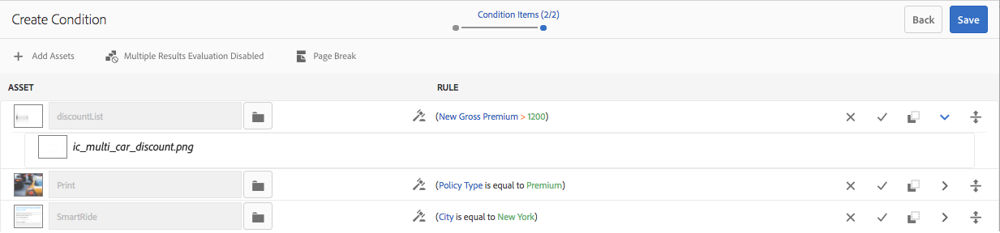

# Condiciones en Interactive Communications{#conditions-in-interactive-communications}

Creación y edición de fragmentos de condición para utilizarlos en Interactive Communications: la condición es uno de los cuatro tipos de fragmentos de documento utilizados para crear Interactive Communications. Los otros tres son textos, listas y fragmentos de diseño.

## Información general {#overview}

Condición es un fragmento de documento que puede incluir en una comunicación interactiva. Los demás fragmentos del documento son [texto](../../forms/using/texts-interactive-communications.md), lista y fragmento de diseño. Las condiciones permiten definir uno o varios recursos contextuales que se incluyen en una comunicación interactiva en función de los datos y las reglas suministrados.

Ejemplos:

* En el extracto de la tarjeta de crédito, se indicará la cuota anual de la tarjeta de crédito y la imagen de la tarjeta de crédito en función del tipo de tarjeta de crédito del cliente.
* En un recordatorio de prima de seguro debido, muestre cálculos de impuestos basados en los impuestos del estado del cliente.

Los recursos en las condiciones que se procesan en función de las reglas aplicadas y los valores pasados a la regla. Las reglas de las condiciones pueden comprobar los valores en los siguientes tipos de datos:

* Propiedad del modelo de datos de formulario asociado
* Todas las variables que cree en la condición
* Cadenas
* Números
* Expresiones matemáticas
* Fechas

## Crear condición {#createcondition}

1. Seleccione **[!UICONTROL Forms]** > **[!UICONTROL Fragmentos de documento]**.
1. Seleccione **[!UICONTROL Crear]** > **[!UICONTROL Condición]**.
1. Especifique la siguiente información:

   * **[!UICONTROL Título]**: (Opcional) Introduzca el título de la condición. Los títulos no tienen que ser únicos y pueden tener caracteres especiales y caracteres que no sean de inglés. Las condiciones son referidas por sus títulos (cuando están disponibles), como en miniaturas y propiedades.
   * **[!UICONTROL Nombre]**: Nombre exclusivo de la condición, dentro de una carpeta. No pueden existir dos fragmentos de documento (texto, condición o lista) con el mismo nombre dentro de una carpeta. En el campo Nombre, solo se pueden introducir caracteres, números y guiones en inglés. El campo Nombre se rellena automáticamente en función del campo Título . Los caracteres especiales, espacios, números y caracteres que no sean de inglés introducidos en el campo Título se sustituyen por guiones en el campo Nombre. Aunque el valor del campo Título se copia automáticamente en el Nombre, puede editarlo.

   * **[!UICONTROL Descripción]**: Escriba una descripción del fragmento del documento.
   * **[!UICONTROL Modelo]** de datos de formulario: De forma opcional, seleccione el botón de opción Modelo de datos de formulario para crear la condición basada en un modelo de datos de formulario. Cuando se selecciona el botón de opción Modelo de datos de formulario, aparece el campo **[!UICONTROL Modelo de datos de formulario]**. Busque y seleccione un modelo de datos de formulario. Al crear una condición para una comunicación interactiva, asegúrese de utilizar el mismo modelo de datos que desea utilizar en la comunicación interactiva. Para obtener más información sobre el modelo de datos de formulario, consulte [Integración de datos](../../forms/using/data-integration.md).

   * **[!UICONTROL Etiquetas]**: De forma opcional, para crear una etiqueta personalizada, introduzca un valor en el campo de texto y pulse Intro. Al guardar esta condición, se crean las etiquetas recién añadidas.

1. Toque **[!UICONTROL Siguiente]**.

   Aparece la página Crear condición .

   

1. Toque **[!UICONTROL Agregar recursos]**.

   Aparece la página Seleccionar recursos y muestra los textos, listas, condiciones e imágenes disponibles para agregar en la condición.

   >[!NOTE]
   >
   >En la página Seleccionar recursos solo aparecen los recursos basados en ninguno y los recién creados y los basados en FDM (creados con el mismo FDM que la condición que se está creando).

1. Pulse los recursos adecuados para seleccionarlos para incluirlos en la condición y, a continuación, pulse **[!UICONTROL Listo]**.

   Aparece la página Crear condición y enumera los recursos añadidos.

   

   Puede utilizar las siguientes opciones para administrar recursos en una condición:

   

   **[] Desactivar cambio.** Pulse este icono para rechazar los cambios que puede haber realizado en el recurso y en la regla de la condición.
   **[] Cambio de concepto de BA.** Pulse este icono para aceptar los cambios realizados en el recurso y en la regla de la condición.
   **[] CDuplicate Asset.** Pulse este icono para crear una copia del recurso junto con la regla aplicada, si la hay, en la condición. A continuación, puede continuar editando la regla y el recurso para los recursos duplicados. Duplicar un recurso resulta útil para crear reglas similares que muestren recursos alternativos basados en un contexto en particular.
   **[] Vista previa de DShow.** Pulse este icono para mostrar una previsualización del recurso en la página Crear/Editar condición .
   **Reordenar &#39;servidor&#39;.** Pulse y mantenga presionado este icono para arrastrar y soltar recursos para reordenarlos dentro de una condición.

   Puede seleccionar las siguientes opciones para especificar el comportamiento de la condición durante la ejecución:

   * **Evaluación de varios resultados deshabilitada\Evaluación de varios resultados habilitada**: Cuando esta opción está habilitada (aparece como &quot;Evaluación de varios resultados habilitada&quot;), todas las reglas se evalúan y el resultado es la suma de todas las reglas verdaderas. Si esta opción está deshabilitada (aparece como &quot;Evaluación de varios resultados deshabilitada&quot;), solo se evalúa la primera regla que se encuentra como verdadera y se convierte en el resultado de la condición.

   * **Salto** de página: Seleccione esta opción (  ) para añadir un salto de página entre los recursos de las condiciones. Cuando no se selecciona esta opción ( ), si una condición se está desbordando a la siguiente página de la salida de impresión, toda la condición se cambia a la siguiente página en lugar de romperse en la página entre los recursos de la condición.

1. Toque **[!UICONTROL Crear regla]** para agregar reglas para mostrar u ocultar los recursos, según sea necesario. Para utilizar variables en las reglas, consulte [creación de variables](#variables). Para obtener más información, consulte [Adición de reglas a la condición](#ruleeditor).

   Las reglas creadas aparecen en la columna REGLA de la pantalla Crear condición .

   

   >[!NOTE]
   >
   >Puede insertar activos en la condición que ya tienen reglas o que se repiten.

1. Toque **[!UICONTROL Guardar]**.

   Se crea la condición. Ahora puede continuar usando la condición como un bloque de creación al crear una comunicación interactiva.

   >[!NOTE]
   >
   >Para guardar una condición nueva o editada, debe tener al menos una regla para cada uno de los recursos añadidos en la condición.

## Editar una condición {#edit-a-condition}

Puede editar una condición siguiendo los pasos siguientes. También puede editar una condición desde una comunicación interactiva seleccionando Editar fragmento en el menú emergente.

1. Seleccione **[!UICONTROL Forms]** > **[!UICONTROL Fragmentos de documento]**.
1. Vaya a la condición y selecciónela.
1. Toque **[!UICONTROL Editar]**.
1. Realice los cambios necesarios en la condición. Para obtener más información sobre la información que puede cambiar en una condición, consulte [Crear condición](#createcondition).
1. Pulse **[!UICONTROL Guardar]** y, a continuación, pulse **[!UICONTROL Cerrar]**.

## Crear reglas en la condición {#ruleeditor}

Con el editor de reglas en una condición, puede crear reglas para mostrar u ocultar recursos en función de **condiciones preestablecidas**. Estas condiciones se pueden construir en función de:

* Cadenas
* Números
* Expresiones matemáticas
* Fechas
* Propiedades del modelo de datos de formulario asociado
* Todas las [variables](#variables) que pueda haber creado

### Crear regla en la condición {#create-rule-in-condition}

1. Durante la creación o edición de una condición, pulse el icono  (Editor de reglas) para el recurso correspondiente.

   Aparecerá el cuadro de diálogo Crear regla . Además de cadena, número, expresión matemática y fecha, también están disponibles en el Editor de reglas para crear instrucciones de las reglas:

   * Propiedades del modelo de datos de formulario asociado
   * Todas las [variables](#variables) que haya creado.

   

   Seleccione la opción adecuada que desea evaluar.

   >[!NOTE]
   >
   >La propiedad Collection no es compatible con la creación de reglas para mostrar los recursos.

1. Seleccione el operador apropiado para evaluar la regla, como Es igual a, Contiene y Comienza con.
1. Inserte la expresión, cadena, propiedad, variable o fecha del modelo de datos de evaluación.

   

   Regla para mostrar un recurso cuando el tipo de directiva es estándar

   * Al crear o editar una regla, también puede pulsar  (Cambiar tamaño) para expandir el cuadro de diálogo Crear regla/Editar regla . El cuadro de diálogo expandido a ventana completa le permite crear [variables](#variables) para construir reglas. Puntee de nuevo Cambiar tamaño para volver al cuadro de diálogo normal Crear regla .

   * También puede crear varias condiciones en una regla.

1. Puntee **[!UICONTROL Listo]**.

   La regla se aplica al recurso.

## Creación y uso de variables en una condición {#variables}

Mientras crea o edita una regla en una condición, puede pulsar  (Cambiar tamaño) para expandir el cuadro de diálogo Crear regla\Editar regla . El cuadro de diálogo expandido a ventana completa le permite:

* Crear y usar variables en la regla
* Arrastrar y soltar las propiedades y variables del modelo de datos de formulario en la regla

Vuelva a pulsar Cambiar tamaño para volver al cuadro de diálogo Crear regla\Editar regla .

### Crear variables {#create-variables}

1. Mientras crea o edita una regla en una condición, puede pulsar  (Cambiar tamaño) para expandir el cuadro de diálogo Crear regla\Editar regla .

   Aparece el cuadro de diálogo Expandido y ventana completa.

   

1. En el panel izquierdo, pulse **[!UICONTROL Variables]**.

   Aparecerá el panel Variables.

   

1. Toque **[!UICONTROL Crear]**.

   Aparece el panel Crear variables .

1. Introduzca la siguiente información y pulse **[!UICONTROL Create]**:

   * **[!UICONTROL Nombre]**: Nombre de la variable.
   * **[!UICONTROL Descripción]**: Opcionalmente, introduzca una descripción sobre la variable.
   * **[!UICONTROL Tipo]**: Seleccione un tipo de variable: Cadena, Número, Booleano o Fecha.
   * **[!UICONTROL Permitir solo]** valores específicos: Para las variables String y Number , puede asegurarse de que el agente elija entre un conjunto específico de valores para un marcador de posición en la interfaz de usuario del agente. Para especificar el conjunto de valores, seleccione esta opción y, a continuación, especifique los valores separados por coma que están permitidos en el campo **[!UICONTROL Values]**.

1. Toque **[!UICONTROL Crear]**.

   La variable se crea y se enumera en el panel Variables .

1. Para insertar una variable en la regla, arrastre y suelte la variable en un marcador de posición para una opción de la regla.
1. Después de crear una regla válida, pulse **[!UICONTROL Listo]**.

   Realice más cambios, si es necesario, en la condición y guárdela.

