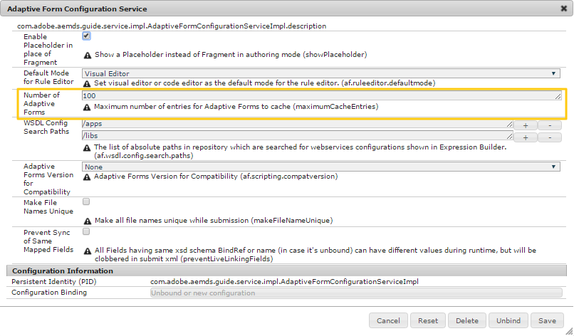

# Configuración de la caché de formularios adaptables {#configure-adaptive-forms-cache}

Una caché es un mecanismo para acortar los tiempos de acceso a los datos, reducir la latencia y mejorar las velocidades de entrada y salida (E/S). La caché de formularios adaptables almacena únicamente contenido HTML y estructura JSON de un formulario adaptable sin guardar datos precargados. Ayuda a reducir el tiempo necesario para procesar un formulario adaptable en el cliente. Está diseñado específicamente para formularios adaptables.

## Configurar la caché de formularios adaptables en las instancias de autor y publicación {#configure-adaptive-forms-caching-at-author-and-publish-instances}

1. Vaya a AEM administrador de configuración de la consola web en `https://[server]:[port]/system/console/configMgr`.
1. Haga clic en **[!UICONTROL Configuración del canal web de formulario adaptable y comunicación interactiva]** para editar sus valores de configuración.
1. En el cuadro de diálogo [!UICONTROL editar valores de configuración], especifique el número máximo de formularios o documentos que una instancia del servidor AEM [!DNL Forms] puede almacenar en caché en el campo **[!UICONTROL Number of Adaptive Forms]**. El valor predeterminado es 100.

   >[!NOTE]
   >
   >Para deshabilitar la caché, establezca el valor en el campo Número de Forms adaptable en **0**. La caché se restablece y todos los formularios y documentos se eliminan de la caché cuando se desactiva o cambia la configuración de la caché.

   

1. Haga clic en **[!UICONTROL Save]** para guardar la configuración.

El entorno está configurado para utilizar formularios adaptables de caché y recursos relacionados.


## (Opcional) Configure la caché de formularios adaptables en Dispatcher {#configure-the-cache}

También puede configurar el almacenamiento en caché de formularios adaptables en Dispatcher para mejorar el rendimiento.

### Requisitos previos {#pre-requisites}

* Active la opción [combinar o prefiere los datos en el cliente](prepopulate-adaptive-form-fields.md#prefill-at-client). Ayuda a combinar datos únicos para cada instancia de un formulario prerellenado.

### Consideraciones para almacenar en caché formularios adaptables en un Dispatcher {#considerations}

* Cuando utilice la caché de formularios adaptables, utilice el AEM [!DNL Dispatcher] para almacenar en caché las bibliotecas de cliente (CSS y JavaScript) de un formulario adaptable.
* Durante el desarrollo de componentes personalizados, en el servidor utilizado para el desarrollo, mantenga deshabilitada la caché de formularios adaptables.
* Las direcciones URL sin extensión no se almacenan en caché. Por ejemplo, las direcciones URL con patrón`/content/forms/[folder-structure]/[form-name].html` se almacenan en caché y el almacenamiento en caché ignora las direcciones URL con patrón `/content/dam/formsanddocument/[folder-name]/<form-name>/jcr:content`. Por lo tanto, utilice direcciones URL con extensiones para aprovechar las ventajas del almacenamiento en caché.
* Consideraciones para formularios adaptables localizados:
   * Utilice el formato de URL `http://host:port/content/forms/af/<afName>.<locale>.html` para solicitar una versión localizada de un formulario adaptable en lugar de `http://host:port/content/forms/af/afName.html?afAcceptLang=<locale>`
   * [Deshabilite el uso de ](supporting-new-language-localization.md#how-localization-of-adaptive-form-works) configuración regional de navegador para direcciones URL con formato  `http://host:port/content/forms/af/<adaptivefName>.html`.
   * Cuando se usa Formato de URL `http://host:port/content/forms/af/<adaptivefName>.html` y **[!UICONTROL Usar configuración regional del explorador]** en el administrador de configuración está desactivado, se proporciona la versión no localizada del formulario adaptable. El idioma no localizado es el idioma utilizado al desarrollar el formulario adaptable. No se tiene en cuenta la configuración regional configurada para el explorador (configuración regional del explorador) y se proporciona una versión no localizada del formulario adaptable.
   * Cuando se usa Formato de URL `http://host:port/content/forms/af/<adaptivefName>.html` y **[!UICONTROL Usar configuración regional del explorador]** en el administrador de configuración está habilitado, se proporciona una versión localizada del formulario adaptable, si está disponible. El idioma del formulario adaptable localizado se basa en la configuración regional configurada para el explorador (configuración regional del explorador). Puede provocar que [almacene en caché solo la primera instancia de un formulario adaptable]. Para evitar que el problema se produzca en su instancia, consulte [solución de problemas](#only-first-insatnce-of-adptive-forms-is-cached).

### Habilitar el almacenamiento en caché en Dispatcher

Siga los pasos que se indican a continuación para habilitar y configurar el almacenamiento en caché de formularios adaptables en Dispatcher:

1. Abra la siguiente URL para cada instancia de publicación de su entorno y [habilite el agente de vaciado para las instancias de publicación de su entorno](https://docs.adobe.com/content/help/en/experience-manager-dispatcher/using/configuring/page-invalidate.html#invalidating-dispatcher-cache-from-a-publishing-instance):
   `http://[server]:[port]]/etc/replication/agents.publish/flush.html`

1. [Agregue lo siguiente a su archivo](https://docs.adobe.com/content/help/en/experience-manager-dispatcher/using/configuring/dispatcher-configuration.html#automatically-invalidating-cached-files) dispatcher.any:

   ```JSON
      /invalidate
      {
      /0000
      {
      /glob "*"
      /type "deny"
      }
      /0001
      {
      # Consider all HTML files stale after an activation.
      /glob "*.html"
      /type "allow"
      }
      /0002
      {
      # Exclude htmls present in AF directories
      /glob "/content/forms/**/*.html"
      /type "deny"
      }
   ```

   Cuando agregue lo anterior:

   * Un formulario adaptable permanece en la caché hasta que no se publique una versión actualizada del formulario.

   * Cuando se publica una versión más reciente del recurso al que se hace referencia en un formulario adaptable, los formularios adaptables afectados se invalidan automáticamente. Existen algunas excepciones a la invalidación automática de los recursos a los que se hace referencia. Para solucionar las excepciones, consulte la sección [solución de problemas](#troubleshooting) .
1. [Agregue las siguientes reglas: dispatcher.any o archivo](https://docs.adobe.com/content/help/en/experience-manager-dispatcher/using/configuring/dispatcher-configuration.html#specifying-the-documents-to-cache) de reglas personalizadas. Excluye las direcciones URL que no admiten el almacenamiento en caché. Por ejemplo, Comunicación interactiva.

   ```JSON
      /0000 {
            /glob "*"
            /type "allow"
      }
      ## Don't cache csrf login tokens
      /0001 {
            /glob "/libs/granite/csrf/token.json"
            /type "deny"
      }
      ## Don't cache IC - print channel
      /0002 {
            /glob "/content/forms/**/channels/print.html"
            /type "deny"
      }
      ## Don't cache IC - web channel
      /0003 {
            /glob "/content/forms/**/channels/web.html"
            /type "deny"
      }
   ```

1. [Agregue los siguientes parámetros a la lista](https://docs.adobe.com/content/help/en/experience-manager-dispatcher/using/configuring/dispatcher-configuration.html#ignoring-url-parameters) de parámetros de URL ignorados:

   ```JSON
      /ignoreUrlParams {
      /0001 { /glob "*" /type "deny" }
      # added for AEM forms specific use cases.
      /0003 { /glob "dataRef" /type "allow" }
      }
   ```

El entorno de AEM está configurado para almacenar en caché los formularios adaptables. Almacena en caché todos los tipos de formularios adaptables. Si necesita comprobar los permisos de acceso del usuario para una página antes de enviar la página en caché, consulte [almacenamiento en caché de contenido seguro](https://docs.adobe.com/content/help/en/experience-manager-dispatcher/using/configuring/permissions-cache.html).

## Solución de problemas {#troubleshooting}

### Algunos formularios adaptables que contienen imágenes o vídeos no se invalidan automáticamente desde la caché de Dispatcher {#videos-or-images-not-auto-invalidated}

#### Problema {#issue1}

Cuando selecciona y añade imágenes o vídeos a través del navegador de recursos a un formulario adaptable y estas imágenes y vídeos se editan en el editor de Assets, los formularios adaptables que contienen dichas imágenes no se invalidan automáticamente desde la caché del distribuidor.

#### Solución {#Solution1}

Después de publicar las imágenes y el vídeo, cancele la publicación y los formularios adaptables que hacen referencia a estos recursos de forma explícita.

### Solo se almacena en caché la primera instancia de un formulario adaptable {#only-first-instance-of-adaptive-forms-is-cached}

#### Problema {#issue3}

Cuando la dirección URL del formulario adaptable no tiene información de localización y **[!UICONTROL Usar configuración regional del explorador]** está activada, se proporciona una versión localizada del formulario adaptable y solo la primera instancia del formulario adaptable se almacena en caché y se envía a todos los usuarios subsiguientes.

#### Solución {#Solution3}

Siga estos pasos para resolver el problema:

1. Abra conf.d/httpd-dispatcher.conf o cualquier otro archivo de configuración configurado para cargarse durante la ejecución.

1. Agregue el siguiente código al archivo y guárdelo. Es un código de ejemplo, puede modificarlo para adaptarlo a su entorno.

```XML
   <VirtualHost *:80>
        # Set log level high during development / debugging and then turn it down to whatever is appropriate
    LogLevel rewrite:trace6
        # Start Rewrite Engine
    RewriteEngine On
        # Handle actual URL convention (just pass through)
        RewriteRule "^/content/forms/af/(.*)[.](.*).html$" "/content/forms/af/$1.$2.html" [PT]
 
        # Handle selector based redirection basded on browser language
        # The Rewrite Cond(ition) is looking for the Accept-Lanague header and if found takes the first two character which most likely will be the desired language selector.
        RewriteCond %{HTTP:Accept-Language} ^(..).*$ [NC]
        RewriteRule "^/content/forms/af/(.*).html$" "/content/forms/af/$1.%1.html" [R]
   </VirtualHost>
```
