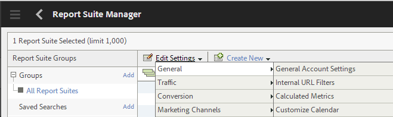

# Analytics con el marco de trabajo de Cloud Service {#analyticsusingcloudframework}

AEM Forms se integra con Analytics para permitirle capturar y realizar un seguimiento de las métricas de rendimiento de los formularios y documentos publicados. El objetivo detrás del análisis de estas métricas es tomar decisiones informadas basadas en los datos sobre los cambios necesarios para que los formularios o documentos sean más utilizables.

>[!NOTE]
>
>La función de análisis de AEM Forms está disponible como parte del paquete de complementos de AEM Forms. Para obtener información sobre la instalación del paquete de complementos, consulte [Instalar y configurar AEM Forms](../../forms/using/installing-configuring-aem-forms-osgi.md).
>
>Además del paquete de complementos, necesita una cuenta de Adobe Analytics y privilegios de administrador en la instancia de AEM. Para obtener información sobre la solución, consulte [Adobe Analytics](https://www.adobe.com/es/solutions/digital-analytics.html).

También puede realizar análisis mediante Adobe Launch. Para obtener más información sobre cómo integrar AEM Forms con Adobe Launch, consulte [Analytics con Adobe Launch](/help/forms/using/integrate-aem-forms-with-adobe-analytics.md).

## Información general {#overview}

Puede utilizar Adobe Analytics para detectar patrones de interacción y problemas que afrontan los usuarios al utilizar formularios adaptables, formularios HTML5 y comunicaciones interactivas. De forma predeterminada, Adobe Analytics rastrea y almacena información sobre los siguientes parámetros:

* **Promedio de tiempo de rellenado**: tiempo promedio empleado para rellenar el formulario.
* **Procesamientos**: número de veces que se abre un formulario.
* **Borradores**: número de veces que un formulario se guarda en estado de borrador.
* **Envíos**: número de veces que se envía un formulario.
* **Cancelaciones**: número de veces que los usuarios se van sin completar el formulario.

Puede personalizar Adobe Analytics para agregar o quitar más parámetros. Junto con la información anterior, el informe contiene la siguiente información sobre cada panel del HTML5 y la forma adaptable:

* **Tiempo**: tiempo invertido en el panel y en los campos del panel.
* **Error**: Número de errores identificados en el panel y en los campos del panel.
* **Ayuda**: Número de veces que un usuario abre la ayuda de un panel y los campos del panel.

## Crear un grupo de informes {#creating-report-suite}

Los datos de Analytics se almacenan en repositorios específicos del cliente, denominados grupos de informes. Para crear un grupo de informes y usar Adobe Analytics, debe tener una cuenta de Adobe Marketing Cloud válida. Antes de realizar los siguientes pasos, asegúrese de que tiene una cuenta de Adobe Marketing Cloud válida.

Siga estos pasos para crear un grupo de informes.

1. Inicie sesión en [https://sc.omniture.com/login/](https://sc.omniture.com/login/)
1. En Marketing Cloud, seleccione **Administrador** > **Admin Consoler** > **Grupos de informes**.
1. Seleccione **Crear nuevo** > **Grupo de informes** en el Administrador de grupos de informes.

   

   Crear nuevo grupo de informes

1. Asegúrese de que la primera lista desplegable esté configurada en **Crear a partir de una plantilla** y, a continuación, seleccione **Comercio**.
1. Busque el campo **ID del grupo de informes** y agregue un nuevo ID de grupo de informes. Por ejemplo, JJEsquire. Aparecerá un ID de grupo de informes debajo del campo ID de grupo de informes. Incluye un prefijo automático, que suele ser el nombre de la empresa.
1. Agregar nuevo **Título del sitio**. Por ejemplo, Grupo de introducción de JJEsquire. Este título se utiliza en la interfaz de usuario de Analytics. Utilice el ID del grupo de informes en su código.
1. Seleccione una **Zona horaria** de la lista desplegable. Todos los datos que llegan a este grupo de informes se registran en función de la zona horaria definida.
1. Deje los campos **Dirección URL base** y **Página predeterminada** vacíos. Estos dos valores solo se utilizan desde la interfaz de Adobe Marketing Cloud para vincular al sitio web.
1. Deje la **Fecha de lanzamiento** configurada como hoy. La Fecha de lanzamiento determina el día en que se activa el grupo de informes.
1. En el campo **Vistas de la página estimadas por día**, escriba 100. Utilice este campo para calcular la cantidad de vistas de página que espera para su sitio web por día. Esta estimación permite que Adobe ponga en marcha la cantidad adecuada de hardware para procesar los datos que va a recopilar.
1. Seleccione una **Moneda base** de la lista desplegable. Todos los datos de moneda que entran en este grupo de informes se convierten y almacenan en este formato de moneda.
1. Haga clic en la Suite **Crear informe**. Debería ver la actualización de la página con un mensaje que indique que el grupo de informes se ha creado correctamente.
1. Seleccione el grupo de informes recién creado. Navegue hasta **Editar configuración** > **General** > **Configuración general de la cuenta**.

   

   Configuración general de la cuenta

1. En la pantalla Configuración general de la cuenta, habilite **Informes de geografía** y haga clic en **Guardar**.
1. Navegue hasta **Editar configuración** > **Tráfico** > **Variables de tráfico**.
1. En el grupo de informes, configure y habilite las siguientes variables de tráfico.

   * **formName**: identificador de un formulario adaptable.
   * **formInstance**: identificador de una instancia de formulario adaptable. Habilite los informes de ruta para esta variable.
   * **fieldName**: identificador de un campo de formulario adaptable. Habilite los informes de ruta para esta variable.
   * **panelName**: identificador de un panel de formulario adaptable. Habilite los informes de ruta para esta variable.
   * **formTitle**: título del formulario.
   * **fieldTitle**: título del campo de formulario.
   * **panelTitle**: título del panel de formulario.
   * **analyticsVersion**: versión de análisis de formulario.

1. Navegue hasta **Editar configuración** > **Conversión** > **Eventos de éxito**. Defina y habilite los siguientes eventos de éxito:

   | Evento de éxito | Tipo |
   |---|---|
   | abandon | Contador |
   | procesar | Contador |
   | panelVisit | Contador |
   | fieldVisit | Contador |
   | save | Contador |
   | error | Contador |
   | help | Contador |
   | submit | Contador |
   | timeSpent | Numérica |

   >[!NOTE]
   >
   >El número de evento y el número de propiedad que se usen para configurar AEM Forms Analytics deben ser diferentes del número de evento y el número de propiedad que se usan en la configuración de [AEM Analytics](/help/sites-administering/adobeanalytics.md).

1. Cierre la sesión de la cuenta de Adobe Marketing Cloud.

## Crear la configuración de Cloud Service {#creating-cloud-service-configuration}

La configuración de Cloud Service es información sobre su cuenta de Adobe Analytics. La configuración permite que Adobe Experience Manager (AEM) se conecte a Adobe Analytics. Cree una configuración diferente para cada cuenta de Analytics que utilice.

1. Inicie sesión en la instancia de autor de AEM como administrador.
1. En la esquina superior izquierda, haga clic en **Adobe Experience Manager** > **Herramientas**  > **Cloud Service** > **Cloud Service heredados**.
1. Localice el icono de **Adobe Analytics**. Haga clic en **Mostrar configuraciones** y, a continuación, haga clic en **[+]** para agregar nueva configuración.

   Si es la primera vez que lo hace, haga clic en **Configurar ahora**.

1. Agreue un Título a la nueva configuración (rellenar el campo Nombre es opcional). Por ejemplo, la configuración de My analytics. Haga clic en **Crear**.

1. Cuando el panel Editar se abra en la página de configuración, rellene los campos:

   * **Empresa**: el nombre de su empresa como aparece en Adobe Analytics.
   * **Nombre de usuario**: nombre utilizado para iniciar sesión en Adobe Analytics.
   * **Contraseña**: la contraseña de Adobe Analytics para la cuenta anterior.
   * **Centro de datos**: el centro de datos de su cuenta de Adobe Analytics.

1. Haga clic en **Conectarse a Analytics**. Aparecerá un cuadro de diálogo con el mensaje de que la conexión se ha realizado correctamente. Haga clic en **Aceptar**.

## Crear un marco de trabajo de Cloud Service {#creating-cloud-service-framework}

Un marco de trabajo de Adobe Analytics es un conjunto de asignaciones entre variables de Adobe Analytics y de AEM. Utilice un marco de trabajo para configurar cómo los formularios rellenan los datos en los informes de Adobe Analytics. Los módulos están asociados a una configuración de Adobe Analytics. Puede crear varios marcos de trabajo para cada configuración.

1. En la consola de AEM Cloud Services, haga clic en **Mostrar configuraciones**, en Adobe Analytics.
1. Haga clic en **[+]** junto a la configuración de Analytics.

   

   Configuración de Adobe Analytics

1. Escriba un **Título** y un **Nombre** para el marco de trabajo, seleccione el marco de trabajo de **Adobe Analytics** y haga clic en **Crear**. El marco de trabajo se abrirá para editarlo.
1. En la sección Grupos de informes de la barra lateral, haga clic en **Agregar elemento**, utilice la lista desplegable para seleccionar el ID del grupo de informes (por ejemplo, JJEsquire) con el que interactuará la estructura.
1. Junto al ID del grupo de informes, seleccione las instancias de servidor que desea enviar información al grupo de informes.

   

1. Arrastre un **Componente de Form Analytics** de la categoría **otro** desde la barra de tareas al marco de trabajo.
1. Para asignar variables de Analytics con variables definidas en el componente, arrastre una variable desde el Buscador de contenido de AEM a un campo del componente de seguimiento.

   

1. Active el marco de trabajo mediante la **pestaña de la página** en la barra de tareas y haga clic en **Habilitar marco de trabajo**.

## Configurar el servicio de configuración de AEM Forms Analytics {#configuring-aem-forms-analytics-configuration-service}

1. En la instancia de autor, abra el administrador de configuración de la consola web de AEM en `https://<server>:<port>;/system/console/configMgr`.
1. Localizar y abrir la configuración de AEM Forms Analytics

   

   Servicio de configuración de AEM Forms Analytics

1. Especifique los valores adecuados para los siguientes campos y haga clic en **Guardar**.

   * **Marco de SiteCatalyst**: seleccione el marco o la configuración que definió en la sección Configurar un marco de trabajo para el seguimiento.
   * **Línea base del seguimiento del campo Tiempo**: especifique la duración, en segundos, tras la cual se debe realizar el seguimiento de la visita al campo. El valor predeterminado es 0. Cuando el valor es mayor de 0 (cero), se enviarán dos eventos de seguimiento independientes al servidor de Adobe Analytics. El primer evento indica al servidor de Analytics que deje de rastrear el campo de salida. El segundo evento se enviará después de que transcurra la duración especificada. El segundo evento ordena al servidor de análisis que inicie el seguimiento del campo visitado. El uso de dos eventos independientes ayuda a medir con precisión el tiempo empleado en un campo. Cuando el valor es 0 (cero), el evento de seguimiento único se enviará al servidor de Adobe Analytics.

   * **Sincronización de informes de Analytics**: especifique la expresión cron para recuperar informes de Adobe Analytics. El valor predeterminado es 0 0 2 ? &#42; &#42;.

   * **Recuperar tiempo de espera de informe:** especifique la duración, en segundos, que se debe esperar para que el servidor responda al informe de análisis. El tiempo predeterminado es 120 segundos.

   >[!NOTE]
   >
   >La operación de búsqueda de informes puede tardar hasta 10 segundos más que el número de segundos especificado.

1. Repita los pasos del 1 al 3 de la instancia de publicación para configurar Analytics.

Ahora puede habilitar Analytics para formularios y generar un informe de Analytics.

## Activar Analytics para un formulario o documento {#enabling-analytics-for-a-form-or-document}

1. Inicie sesión en el Portal de AEM en `https://[hostname]:'port'`.
1. Haga clic en **Forms > Formularios y documentos**, seleccione un formulario o documento y haga clic en **Habilitar Analytics**. El análisis está habilitado.

   

   Activar Analytics para un formulario

   **A.** Botón Habilitar Analytics **B.** Formulario seleccionado

   Para obtener información detallada sobre la visualización de informes de Forms Analytics, consulte [Visualizar y compreder los informes de AEM Forms Analytics](../../forms/using/view-understand-aem-forms-analytics-reports.md).
