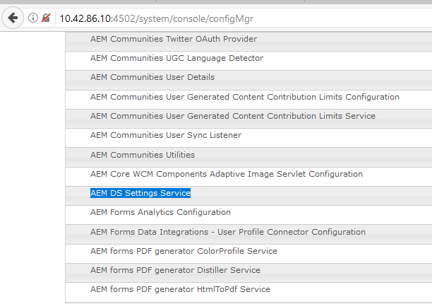

# Configurar AEM DS{#configuring-aem-ds-settings}

Este artículo describe cómo configurar el **Servicio de configuración de AEM DS**. Esta configuración se puede utilizar en varios escenarios, por ejemplo:

* En Administración de correspondencia

   * Para configurar el flujo de trabajo de AEM Forms
   * Mientras se utiliza el portal de formularios para el guardado remoto del borrador/envío

* En formularios adaptables para casos en los que el formulario adaptable se envía desde una instancia de publicación

A continuación se indican los pasos para establecer la **[!UICONTROL Configuración de AEM DS]**:

1. Abra el Administrador de configuración en la instancia de publicación mediante la URL:\
   *https://localhost:port/system/console/configMgr*.

   

1. En la **[!UICONTROL Configuración de la consola web de Adobe Experience Manager]**, busque y haga clic en la opción **[!UICONTROL Configuración de AEM DS]**.

   

1. El **[!UICONTROL Servicio de configuración de AEM DS]** muestra los ajustes de configuración comunes de los Componentes de AEM DS.

   

1. Agregue la siguiente información en los campos respectivos:

   **[!UICONTROL URL del servidor de procesamiento]**: el servidor de procesamiento es el servidor en el que se debe habilitar Forms o el flujo de trabajo de AEM. Puede ser la misma URL que la de la instancia de autor de AEM o que la otra URL del servidor (es decir, https://localhost:port/).

   **[!UICONTROL Nombre de usuario del servidor de procesamiento]**: nombre de usuario del usuario del flujo de trabajo [en función de la URL del servidor que se utilice]

   **[!UICONTROL Contraseña del servidor de procesamiento]**: contraseña del usuario del flujo de trabajo

   >[!NOTE]
   >
   >
   >    
   >    
   >    * Al utilizar Forms o flujos de trabajo de AEM, antes de realizar cualquier envío desde el servidor de publicación, es necesario configurar el servicio de configuración de DS. De lo contrario, el envío del formulario fallará.

