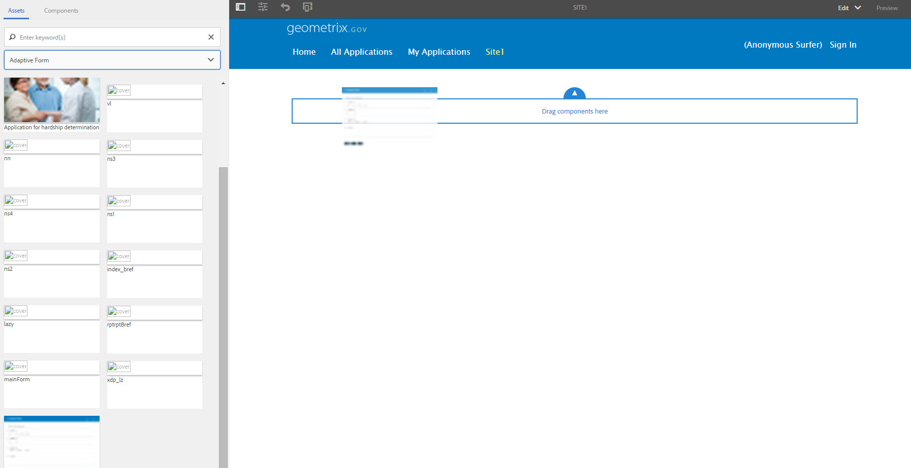

# Crear un formulario adaptable utilizando un conjunto de formularios adaptables{#create-an-adaptive-form-using-a-set-of-adaptive-forms}

## Información general {#overview}

En un flujo de trabajo, como una aplicación para abrir una cuenta bancaria, los usuarios rellenan varios formularios. En lugar de pedirles que rellenen un conjunto de formularios, puede apilarlos y crear un formulario grande (formulario principal). Cuando se agrega un formulario adaptable al formulario más grande, se agrega como panel (formulario secundario). Se agrega un conjunto de formularios secundarios para crear un formulario principal. Puede mostrar u ocultar paneles basados en los datos introducidos por el usuario. Los botones del formulario principal, como enviar y restablecer, sobrescriben los botones del formulario secundario. Para agregar un formulario adaptable en el formulario principal, puede arrastrar y soltar el formulario adaptable desde el navegador de recursos (como los fragmentos de formulario adaptables).

Las funciones disponibles son:

* Creación independiente
* Mostrar u ocultar los formularios adecuados
* Carga diferida

Las funciones como la creación independiente y la carga diferida proporcionan mejoras de rendimiento con respecto al uso de componentes individuales para crear el formulario principal.

>[!NOTE]
>
>No se pueden usar fragmentos o formularios adaptables basados en XFA como formularios secundarios o principales.

## Entre bastidores {#behind-the-scenes}

Se pueden agregar fragmentos y formularios adaptables basados en XSD en el formulario principal. La estructura del formulario principal es la misma que [cualquier formulario adaptable](../../forms/using/prepopulate-adaptive-form-fields.md). Cuando se agrega un formulario adaptable como formulario secundario, se agrega como panel en el formulario principal. Los datos de un formulario secundario enlazado se almacenan en la `data`raíz de la sección `afBoundData` del esquema XML del formulario principal.

Por ejemplo, los clientes rellenan un formulario de solicitud. Los dos primeros campos del formulario son nombre e identidad. Su XML es:

```xml
<afData>
    <afUnboundData>
        <data />
    </afUnboundData>
    <afBoundData>
        <data xmlns:xfa="https://www.xfa.org/schema/xfa-data/1.0/">
            <applicantName>Sarah Rose</applicantName>
            <applicantId>1234</applicantId>
        </data>
    </afBoundData>
</afData>
```

Agregue otro formulario en la aplicación que permita a los clientes rellenar su dirección de oficina. La raíz del esquema del formulario secundario es `officeAddress`. Aplique `bindref` `/application/officeAddress` o `/officeAddress`. Si no se proporciona `bindref`, el formulario secundario se agrega como subárbol `officeAddress`. Consulte el XML del formulario a continuación:

```xml
<afData>
    <afUnboundData>
        <data />
    </afUnboundData>
    <afBoundData>
        <data xmlns:xfa="https://www.xfa.org/schema/xfa-data/1.0/">
            <applicantName>Sarah Rose</applicantName>
            <applicantId>1234</applicantId>
            <officeAddress>
                <addressLine>1, Geometrixx City</addressLine>
                <zip>11111</zip>
            </officeAddress>
        </data>
    </afBoundData>
</afData>
```

Si inserta otro formulario que permita a los clientes proporcionar la dirección de la casa, aplique `bindref` `/application/houseAddress or /houseAddress.`El XML tiene el siguiente aspecto:

```xml
<afData>
    <afUnboundData>
        <data />
    </afUnboundData>
    <afBoundData>
        <data xmlns:xfa="https://www.xfa.org/schema/xfa-data/1.0/">
            <applicantName>Sarah Rose</applicantName>
            <applicantId>1234</applicantId>
            <officeAddress>
                <addressLine>1, Geometrixx City</addressLine>
                <zip>11111</zip>
            </officeAddress>
            <houseAddress>
                <addressLine>2, Geometrixx City</addressLine>
                <zip>11111</zip>
            </houseAddress>
        </data>
    </afBoundData>
</afData>
```

Si desea mantener el mismo nombre de subraíz que la raíz del esquema ( `Address`en este ejemplo), utilice archivos bindrefs indexados.

Por ejemplo, aplique bindrefs `/application/address[1]` o `/address[1]` y `/application/address[2]` o `/address[2]`. El XML del formulario es:

```xml
<afData>
    <afUnboundData>
        <data />
    </afUnboundData>
    <afBoundData>
        <data xmlns:xfa="https://www.xfa.org/schema/xfa-data/1.0/">
            <applicantName>Sarah Rose</applicantName>
            <applicantId>1234</applicantId>
            <address>
                <addressLine>1, Geometrixx City</addressLine>
                <zip>11111</zip>
            </address>
            <address>
                <addressLine>2, Geometrixx City</addressLine>
                <zip>11111</zip>
            </address>
        </data>
    </afBoundData>
</afData>
```

Puede cambiar el subárbol predeterminado del formulario o fragmento adaptable mediante la propiedad `bindRef` . La propiedad `bindRef` permite especificar la ruta que señala a una ubicación en la estructura de árbol del esquema XML.

Si el formulario secundario es independiente, sus datos se almacenan en la raíz `data`de la sección `afUnboundData` del esquema XML del formulario principal.

Puede agregar un formulario adaptable como formulario secundario varias veces. Asegúrese de que `bindRef` se modifique correctamente para que cada instancia utilizada del formulario adaptable apunte a una subraíz diferente debajo de la raíz de datos.

>[!NOTE]
>
>Si se asignan distintos formularios o fragmentos a la misma subraíz, los datos se sobrescriben.

## Adición de un formulario adaptable como formulario secundario mediante el navegador de recursos {#adding-an-adaptive-form-as-a-child-form-using-asset-browser}

Realice los siguientes pasos para agregar un formulario adaptable como formulario secundario mediante el explorador de recursos.

1. Abra el formulario principal en modo de edición.
1. En la barra lateral, haga clic en **Assets** . En Assets, seleccione **Formulario adaptable** en la lista desplegable.
   [ ](assets/asset-1.png)

1. Arrastre y suelte el formulario adaptable que desee agregar como formulario secundario.
   [ ](assets/drag-drop-1.png)sitioEl formulario adaptable que suelte se agrega como formulario secundario.

