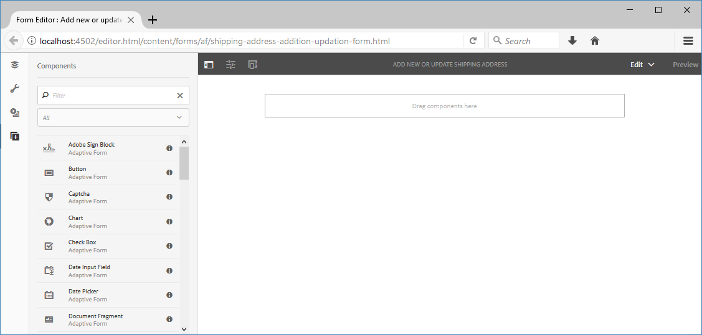
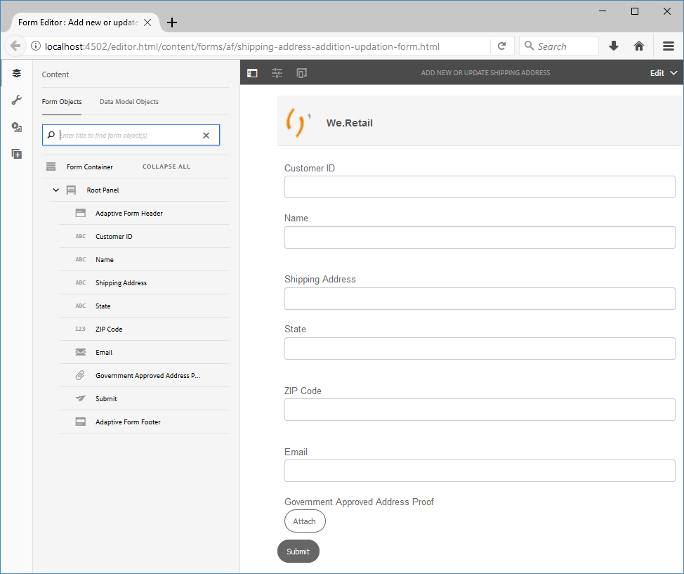

# Tutorial: Crear un formulario adaptable {#do-not-publish-tutorial-create-an-adaptive-form}

Este tutorial es un paso de la serie [Create Your First Adaptive Form](/help/forms/using/create-your-first-adaptive-form.md). Se recomienda seguir la serie en secuencia cronológica para comprender, realizar y demostrar el caso de uso completo del tutorial.

## Acerca del tutorial {#about-the-tutorial}

Los formularios adaptables son formularios de nueva generación dinámicos y adaptables. Puede utilizar formularios adaptables para ofrecer experiencias personalizadas. También puede integrar formularios adaptables con [!DNL Adobe Analytics] para estadísticas de uso y [!DNL Adobe Campaign] para administración de campañas. Para obtener más información sobre las capacidades de los formularios adaptables, consulte [Introducción a la creación de formularios adaptables](/help/forms/using/introduction-forms-authoring.md).

Cuando se sigue un proceso adecuado, es más fácil crear y administrar formularios. En este artículo, aprenderá a:

* [Crear un formulario adaptable que permita a un cliente añadir una dirección de envío](/help/forms/using/create-adaptive-form.md#step-create-the-adaptive-form)

* [Diseño de campos de un formulario adaptable para mostrar y aceptar información de un cliente](/help/forms/using/create-adaptive-form.md#step-add-header-and-footer)

* [Cree una acción de envío para enviar un correo electrónico que contenga contenido de formulario](/help/forms/using/create-adaptive-form.md#step-add-components-to-capture-and-display-information)
* [Vista previa y envío de un formulario adaptable](/help/forms/using/create-adaptive-form.md)

Al final del artículo tendrá un formulario similar al siguiente:\

## Paso 1: Crear el formulario adaptable {#step-create-the-adaptive-form}

1. Inicie sesión en la instancia de autor de AEM y vaya a **[!UICONTROL Adobe Experience Manager]** > **[!UICONTROL Forms]** > **[!UICONTROL Forms &amp; Documents]**. La dirección URL predeterminada es [http://localhost:4502/aem/forms.html/content/dam/formsanddocuments](http://localhost:4502/aem/forms.html/content/dam/formsanddocuments).
1. Pulse **[!UICONTROL Crear]** y seleccione **[!UICONTROL Formulario adaptable]**. Aparece una opción para seleccionar una plantilla. Pulse la plantilla **[!UICONTROL En blanco]** para seleccionarla y pulse **[!UICONTROL Siguiente]**.

1. Aparece una opción para **[!UICONTROL Agregar propiedades]**. Los campos **[!UICONTROL Title]** y **[!UICONTROL Name]** son obligatorios:

   * **Título:** especifique  `Add new or update shipping address` en el  **** campo Título. El campo de título especifica el nombre para mostrar del formulario. El título le ayuda a identificar el formulario en la interfaz de usuario de AEM [!DNL Forms].
   * **Nombre:** especifique  `shipping-address-add-update-form` en el  **** campo Nombre. El campo Name especifica el nombre del formulario. Se crea un nodo con el nombre especificado en el repositorio. A medida que empieza a escribir un título, el valor del campo de nombre se genera automáticamente. Puede cambiar el valor sugerido. El campo de nombre solo puede incluir caracteres alfanuméricos, guiones y guiones bajos. Todas las entradas no válidas se sustituyen por guiones.

1. Toque **[!UICONTROL Crear]**. Se crea un formulario adaptable y aparece un cuadro de diálogo para abrir el formulario y editarlo. Pulse **[!UICONTROL Abrir]** para abrir el formulario recién creado en una nueva pestaña. El formulario se abre para su edición. También muestra la barra lateral para personalizar el formulario recién creado según las necesidades.

   Para obtener información sobre la interfaz de creación de formularios adaptables y los componentes disponibles, consulte [Introducción a la creación de formularios adaptables](/help/forms/using/creating-adaptive-form.md).

   

## Paso 2: Agregar encabezado y pie de página {#step-add-header-and-footer}

AEM [!DNL Forms] proporciona muchos componentes para mostrar información en un formulario adaptable. Los componentes Encabezado y Pie de página ayudan a proporcionar un aspecto y un aspecto coherentes a un formulario. Un encabezado suele incluir el logotipo de una empresa, el título del formulario y el resumen. Un pie de página suele incluir información de copyright y vínculos a otras páginas.

1. Pulse  > . Se abre el navegador de componentes. Arrastre el componente **[!UICONTROL Header]** desde el navegador de componentes al formulario adaptable.
1. Toque **[!UICONTROL Logotipo]**. Aparecerá la barra de herramientas. Pulse  en la barra de herramientas, escriba **We.Retail** y pulse .

1. Toque Imagen. Aparecerá la barra de herramientas. Toque . El navegador de propiedades se abre a la izquierda de la pantalla. **** Examine y cargue la imagen del logotipo. Pulse . La imagen aparece en el encabezado.

   Puede pulsar Get file para descargar el logotipo utilizado en este artículo si no lo tiene.

   [Obtener archivo](assets/logo.png)

1. Arrastre el componente **[!UICONTROL Pie de página]** de  al formulario adaptable. En esta fase, el formulario tiene el siguiente aspecto:

   

## Paso 3: Añadir componentes para capturar y mostrar información {#step-add-components-to-capture-and-display-information}

Los componentes son componentes básicos de un formulario adaptable. AEM [!DNL Forms] proporciona muchos componentes para capturar y mostrar la información de forma adaptativa. Puede arrastrar los componentes de  a un formulario. Para obtener más información sobre los componentes disponibles y la funcionalidad correspondiente, consulte [Introducción a la creación de formularios adaptables](/help/forms/using/introduction-forms-authoring.md).

1. Arrastre el componente **[!UICONTROL Cuadro numérico]** al formulario adaptable. Colóquelo antes del componente de pie de página. Abra las propiedades del componente, cambie **[!UICONTROL Título]** del componente a **`Customer ID`**, cambie **[!UICONTROL Nombre de elemento]** a **`customer_ID`**, habilite la opción **[!UICONTROL Campo requerido]**, habilite la opción **[!UICONTROL Usar tipo de entrada de número HTML5]** y pulse .
1. Arrastre tres componentes Cuadro de texto al formulario adaptable. Colóquelos antes del componente de pie de página. Defina las siguientes propiedades para estos cuadros de texto.:

   <table> 
    <tbody> 
     <tr> 
      <td><b>Propiedad</b></td> 
      <td><b>Cuadro de texto 1 </b></td> 
      <td><b>Cuadro de texto 2 </b></td> 
      <td><b>Cuadro de texto 3</b></td> 
     </tr> 
     <tr> 
      <td>Título</td> 
      <td>Nombre  </td> 
      <td>Dirección de envío</td> 
      <td>Estado</td> 
     </tr> 
     <tr> 
      <td>Nombre de elemento</td> 
      <td>customer_Name  </td> 
      <td>customer_Shipping_Address</td> 
      <td>customer_State</td> 
     </tr> 
     <tr> 
      <td>Campo requerido</td> 
      <td>Activado</td> 
      <td>Activado</td> 
      <td>Activado</td> 
     </tr> 
     <tr> 
      <td>Permitir varias líneas  </td> 
      <td>Deshabilitado</td> 
      <td>Activado</td> 
      <td>Deshabilitado</td> 
     </tr> 
    </tbody> 
   </table>

1. Arrastre un componente **[!UICONTROL Cuadro numérico]** antes del componente de pie de página. Abra las propiedades del componente, establezca los valores enumerados en la tabla siguiente, Pulse .

   | Propiedad | Value |
   |---|---|
   | Título | Código postal |
   | Nombre de elemento | customer_ZIPCode |
   | Número máximo de dígitos | 6 |
   | Campo requerido | Activado |
   | Tipo de patrón de visualización | Sin motivo |

1. Arrastre un componente **[!UICONTROL Email]** antes del componente de pie de página. Abra las propiedades del componente, establezca los valores enumerados en la tabla siguiente y pulse .

   | Propiedad | Valor |
   |---|---|
   | Título | Correo electrónico |
   | Nombre de elemento | customer_Email |
   | Campo requerido | Activado |

1. Arrastre un componente **[!UICONTROL Archivo adjunto]** antes del componente de pie de página. Abra las propiedades del componente, establezca los valores enumerados en la tabla siguiente y pulse .

   <table> 
    <tbody> 
     <tr> 
      <td><b>Propiedad</b></td> 
      <td><b>Valor</b></td> 
     </tr> 
     <tr> 
      <td>Título</td> 
      <td>Prueba de dirección aprobada por el gobierno  </td> 
     </tr> 
     <tr> 
      <td>Nombre de elemento</td> 
      <td>customer_Address_Proof</td> 
     </tr> 
     <tr> 
      <td>Campo requerido</td> 
      <td>Activado</td> 
     </tr> 
    </tbody> 
   </table>

1. Arrastre un componente **[!UICONTROL Botón de envío]** al formulario adaptable. Colóquelo antes del componente de pie de página. Abra las propiedades del componente, cambie Nombre de elemento a `address_addition_update_submit` y pulse . La presentación del formulario es completa y el formulario tiene el aspecto siguiente:

   

## Paso 4: Configurar la acción de envío para el formulario adaptable {#step-configure-submit-action-for-the-adaptive-form}

Una acción de envío se activa cuando un usuario toca el botón Enviar de un formulario adaptable. Puede utilizar una acción de envío para guardar datos de formulario en el repositorio local, enviar datos de formulario a un extremo REST, enviar datos de formulario como correo electrónico, etc. Los formularios adaptables proporcionan algunas acciones de envío integradas. Para obtener información detallada, consulte [Configuración de la acción de envío](/help/forms/using/configuring-submit-actions.md).

Con los pasos siguientes, se puede configurar la acción de envío por correo electrónico y la acción de envío de demostración del formulario:

1. Configure el servidor de correo electrónico. Para obtener más información, consulte [Configuración de notificaciones por correo electrónico](/help/sites-administering/notification.md).

1. Pulse **[!UICONTROL Contenedor de formulario]** en el navegador de contenido y pulse . El navegador de propiedades se abre a la izquierda.
1. Vaya a **[!UICONTROL Envío]** > **[!UICONTROL Enviar acción]**. Seleccione **[!UICONTROL Send Email]**. Especifique los siguientes valores y pulse .

   | Propiedad | Valor |
   |--- |--- |
   | De | `donotreply@weretail.com` |
   | A | `${customer_Email}` |
   | Asunto | Reconocimiento: Ha añadido la dirección de envío al sitio web de We.Retail. |
   | Plantilla de correo electrónico | Hola `${customer_Name}`, se añade la siguiente dirección como dirección de envío de su cuenta:  `${customer_Name}`, `${customer_Shipping_Address}`, `${customer_State}`, `${customer_ZIPCode}`  Regards, We.Retail |
   | Incluir archivos adjuntos | Activado |

   El formulario está listo. Ahora puede obtener una vista previa del formulario y probar la funcionalidad. Si ha utilizado el nombre mencionado en el tutorial y accede al formulario en el equipo que ejecuta AEM servidor [!DNL Forms], el formulario está disponible en [http://localhost:4502/editor.html/content/forms/af/shipping-address-add-update-form.html](http://localhost:4502/editor.html/content/forms/af/shipping-address-add-update-form.html).

## Paso 5: Previsualizar y enviar el formulario adaptable {#step-preview-and-submit-the-adaptive-form}

Puede utilizar la opción **[!UICONTROL Preview]** para evaluar el aspecto y el comportamiento de un formulario. Puede enviar un formulario en modo de vista previa y también comprobar las validaciones aplicadas a un formulario. Por ejemplo, si se muestra un error cuando un campo obligatorio se deja vacío.

Los formularios adaptables también proporcionan una opción para emular la experiencia de un formulario para varios dispositivos. Por ejemplo, iPhone, iPad y Escritorio. Puede utilizar las opciones **[!UICONTROL Preview]** y **[!UICONTROL Emulator]**  junto con otras para obtener una vista previa de un formulario para dispositivos de diferentes tamaños de pantalla.

1. Pulse la opción **[!UICONTROL Preview]** en el lado derecho del editor de formularios. El formulario se abre en el modo de vista previa. Si ha utilizado el nombre mencionado en el tutorial, la dirección URL de vista previa del formulario es [http://localhost:4502/content/dam/formsanddocuments/shipping-address-add-update-form/jcr:content?wcmmode=disabled](http://localhost:4502/content/dam/formsanddocuments/shipping-address-addition-updation-form/jcr:content?wcmmode=disabled)
1. Utilice la  para ver el aspecto del formulario en varios dispositivos.
1. Rellene los campos del formulario y pulse **[!UICONTROL Enviar]**. El formulario se envía y se le redirige a la página **Gracias** predeterminada. También puede especificar una página de agradecimiento personalizada. Para obtener más información, consulte [Configuración de la página de redireccionamiento](/help/forms/using/configuring-redirect-page.md).

El formulario adaptable para añadir una dirección está listo. Si ha utilizado el nombre mencionado en el tutorial y accede al formulario en el equipo que ejecuta el servidor de AEM Forms, el formulario está disponible en [http://localhost:4502/editor.html/content/forms/af/shipping-address-add-update-form.html](http://localhost:4502/editor.html/content/forms/af/shipping-address-add-update-form.html).
