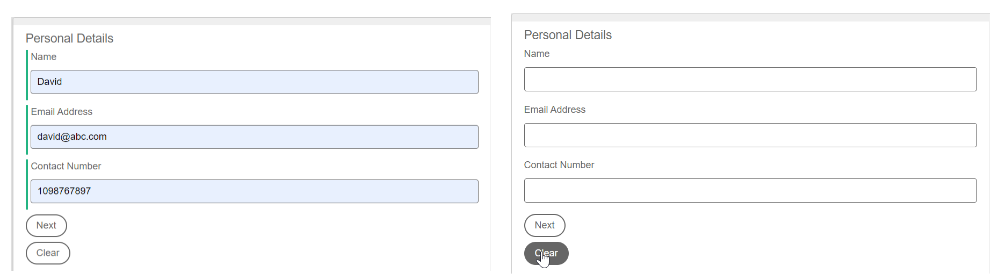

# Funciones personalizadas en los componentes principales de Forms adaptable

Este artículo describe la creación de funciones personalizadas con el componente principal del formulario adaptable más reciente, que tienen las funciones más recientes, como las siguientes:

* Función de almacenamiento en caché para funciones personalizadas
* Compatibilidad de objetos de campo y objeto de ámbito global con funciones personalizadas
* Compatibilidad con funciones modernas de JavaScript, como las funciones izquierda y flecha (compatibilidad con ES10)

Asegúrese de establecer la [última versión del formulario](https://github.com/adobe/aem-core-forms-components/tree/release/650) en el entorno del componente principal de AEM Forms para utilizar las características más recientes en las funciones personalizadas. </span>


| Versión | Vínculo del artículo |
| -------- | ---------------------------- |
| AEM 6.5 | Este artículo |
| AEM as a Cloud Service | [Haga clic aquí](https://experienceleague.adobe.com/es/docs/experience-manager-cloud-service/content/forms/adaptive-forms-authoring/authoring-adaptive-forms-core-components/create-an-adaptive-form-on-forms-cs/create-and-use-custom-functions) |

## Introducción

AEM Forms 6.5 incluye funciones de JavaScript que le permiten definir reglas comerciales complejas mediante el editor de reglas. Aunque AEM Forms ofrece una variedad de funciones personalizadas integradas, muchos casos de uso requieren la definición de sus propias funciones personalizadas para utilizarlas en varios formularios. Estas funciones personalizadas mejoran las capacidades de los formularios al permitir la manipulación y el procesamiento de los datos introducidos para satisfacer requisitos específicos. Además, permiten modificar dinámicamente el comportamiento del formulario en función de criterios predefinidos.

### Usos de las funciones personalizadas {#uses-of-custom-function}

Las ventajas de utilizar funciones personalizadas en los componentes principales de Forms adaptables son:


* **Administrar datos**: Las funciones personalizadas administran y procesan los datos introducidos en los campos de formulario.
* **Procesamiento de datos**: las funciones personalizadas ayudan a procesar los datos introducidos en los campos de formulario.
* **Validación de datos**: las funciones personalizadas permiten realizar comprobaciones personalizadas en las entradas del formulario y proporcionar mensajes de error especificados.
* **Comportamiento dinámico**: las funciones personalizadas le permiten controlar el comportamiento dinámico de los formularios en función de condiciones específicas. Por ejemplo, puede mostrar u ocultar campos, modificar valores de campos o ajustar la lógica del formulario de forma dinámica.
* **Integración**: puede usar funciones personalizadas para integrarlas con API o servicios externos. Ayuda a recuperar datos de fuentes externas, enviar datos a extremos REST externos o realizar acciones personalizadas basadas en eventos externos.

Las funciones personalizadas son esencialmente bibliotecas de cliente que se agregan en el archivo JavaScript. Una vez creada una función personalizada, esta estará disponible en el editor de reglas para que la seleccione el usuario en un formulario adaptable. Las funciones personalizadas se identifican mediante las anotaciones de JavaScript en el editor de reglas.

### Anotaciones de JavaScript compatibles con funciones personalizadas {#js-annotations}

**Las anotaciones de JavaScript proporcionan metadatos para el código JavaScript**. Incluye comentarios que comienzan con símbolos específicos como `/**` y `@`. Las anotaciones proporcionan información importante sobre funciones, variables y otros elementos del código. El formulario adaptable admite las siguientes anotaciones de JavaScript para funciones personalizadas:

#### Nombre

**Name** se usa para identificar la función personalizada en el editor de reglas de un formulario adaptable. Las siguientes sintaxis se utilizan para asignar un nombre a una función personalizada:

* `@name [functionName] <Function Name>`
* `@function [functionName] <Function Name>`
* `@func [functionName] <Function Name>`

>[!NOTE]
>`[functionName]` es el nombre de la función. No se permiten espacios.
>`<Function Name>` es el nombre para mostrar de la función en el editor de reglas de Forms adaptable.
>Si el nombre de la función es idéntico al nombre de la función en sí, puede omitir `[functionName]` de la sintaxis.

#### Parámetro

El **Parámetro** es una lista de argumentos utilizados por funciones personalizadas. Una función puede admitir varios parámetros. Las siguientes sintaxis se utilizan para definir un parámetro en una función personalizada:

* `@param {type} name <Parameter Description>`
* `@argument` `{type} name <Parameter Description>`
* `@arg` `{type}` `name <Parameter Description>`

  `{type}` representa el tipo de parámetro. Los tipos de parámetros permitidos son:

   * string: Representa un solo valor de cadena.
   * number: representa un solo valor numérico.
   * boolean: Representa un solo valor booleano (true o false).
   * string[]: Representa una matriz de valores de cadena.
   * number[]: representa una matriz de valores numéricos.
   * boolean[]: Representa una matriz de valores booleanos.
   * date: representa un solo valor de fecha.
   * date[]: representa una matriz de valores de fecha.
   * array: representa una matriz genérica que contiene valores de varios tipos.
   * object: representa un objeto de formulario pasado a una función personalizada en lugar de pasar su valor directamente.
   * ámbito: representa el objeto global, que contiene variables de solo lectura como instancias de formulario, instancias de campo de destino y métodos para realizar modificaciones de formulario dentro de las funciones personalizadas. Se declara como el último parámetro en las anotaciones de JavaScript y no es visible para el editor de reglas de un formulario adaptable. El parámetro scope accede al objeto del formulario o componente para almacenar en déclencheur la regla o el evento necesarios para el procesamiento del formulario. Para obtener más información sobre el objeto Globals y cómo utilizarlo, [haga clic aquí](/help/forms/using/create-and-use-custom-functions-core-components.md#field-and-global-scope-objects-in-custom-functions-support-field-and-global-objects)

El tipo de parámetro es **no distingue entre mayúsculas y minúsculas** y no se permiten espacios en el nombre del parámetro.

`<Parameter Description>` contiene detalles sobre el propósito del parámetro. Puede tener varias palabras.

<!--

**Optional Parameters**
By default, all parameters are mandatory. You can define a parameter as optional by either adding `=` after the parameter type or enclosing the parameter name in `[]`. Parameters defined as optional in JavaScript annotations are displayed as optional in the rule editor.
To define a variable as an optional parameter, you can use the any of the following syntaxes:
  
* `@param {type=} Input1`

In the above line of code, `Input1` is an optional parameter without any default value. To declare optional parameter with default value:

`@param {string=<value>} input1`
        
`input1` as an optional parameter with the default value set to `value`. 

* `@param {type} [Input1]`

In the above line of code, `Input1` is an optional parameter without any default value. To declare optional parameter with default value:

`@param {array} [input1=<value>]`

    `input1` is an optional parameter of array type with the default value set to `value`. 
    Ensure that the parameter type is enclosed in curly brackets {} and the parameter name is enclosed in square brackets []. 

Consider the following code snippet, where input2 is defined as an optional parameter:

```javascript

        /**
         * optional parameter function
         * @name OptionalParameterFunction
         * @param {string} input1 
         * @param {string=} input2 
         * @return {string}
        */
        function OptionalParameterFunction(input1, input2) {
        let result = "Result: ";
        result += input1;
        if (input2 !== null) {
            result += " " + input2;
        }
        return result;
        }
```

The following illustration displays using the `OptionalParameterFunction` csutom function in the rule editor:


You can save the rule without specifying a value for required parameters, but the rule is not executed and displays a warning message as:


When user leaves the optional parameter empty, then the "Undefined" value is passed to the custom function for the optional parameter.

To learn more about how to define optional parameters in JSDocs, [click here](https://jsdoc.app/tags-param).

-->

#### Tipo de devolución

El tipo de valor devuelto especifica el tipo de valor que la función personalizada devuelve después de la ejecución. Las siguientes sintaxis se utilizan para definir un tipo de valor devuelto en una función personalizada:

* `@return {type}`
* `@returns {type}`
  `{type}` representa el tipo devuelto de la función. Los tipos de valor devuelto permitidos son:
* string: Representa un solo valor de cadena.
* number: representa un solo valor numérico.
* boolean: Representa un solo valor booleano (true o false).
* string[]: Representa una matriz de valores de cadena.
* number[]: representa una matriz de valores numéricos.
* boolean[]: Representa una matriz de valores booleanos.
* date: representa un solo valor de fecha.
* date[]: representa una matriz de valores de fecha.
* array: representa una matriz genérica que contiene valores de varios tipos.
* object: representa el objeto de formulario en lugar de su valor directamente.

El tipo de valor devuelto no distingue entre mayúsculas y minúsculas.

#### Privado

La función personalizada, declarada como privada, no aparece en la lista de funciones personalizadas del editor de reglas de un formulario adaptable. De forma predeterminada, las funciones personalizadas son públicas. La sintaxis para declarar la función personalizada como privada es `@private`.

<!--
#### Member

  Syntax: `@memberof namespace`
  Attaches a namespace to the function.
-->

<!--

#### This

   Syntax: `@this currentComponent`

   Use @this to refer to the Adaptive Form component on which the rule is written. 
  
   The following example is based on the field value. In the following example, the rule hides a field in the form. The `this` portion of `this.value` refers to underlying Adaptive Form component, on which the rule is written.

   ```
      /**
      * @function myTestFunction
      * @this currentComponent
      * @param {scope} scope in which code inside function will be executed.
      */
      myTestFunction = function (scope) {
         if(this.value == "O"){
               scope.age.visible = true;
         } else {
            scope.age.visible = false;
         }
      }

   ```

    >[!NOTE]
    >
    >Comments before custom function are used for summary. Summary can extend to multiple lines until a tag is encountered. Limit the size to a single for a concise description in the rule builder.

-->

<!--

## Function declaration supported types {#function-declaration-supported-types}

**Function Statement**

```javascript
function area(len) {
    return len*len;
}
```

This function is included without `jsdoc` comments.

**Function Expression**

```javascript
var area;
//Some codes later
/** */
area = function(len) {
    return len*len;
};
```

**Function Expression and Statement**

```javascript
var b={};
/** */
b.area = function(len) {
    return len*len;
}
```

**Function Declaration as Variable**

```javascript
/** */
var x1,
    area = function(len) {
        return len*len;
    },
    x2 =5, x3 =true;
```

Limitation: custom function picks only the first function declaration from the variable list, if together. You can use function expression for every function declared.

**Function Declaration as Object**

```javascript
var c = {
    b : {
        /** */
        area : function(len) {
            return len*len;
        }
    }
};
```
-->

## Directrices al crear funciones personalizadas {#considerations}

Para enumerar las funciones personalizadas en el editor de reglas, puede utilizar cualquiera de los siguientes formatos:

### Instrucción de función con o sin comentarios jsdoc

Puede crear una función personalizada con o sin comentarios jsdoc.

```javascript
    function functionName(parameters) 
        {
            // code to be executed
        }
```

Si el usuario no agrega ninguna anotación de JavaScript a la función personalizada, se muestra en el editor de reglas por su nombre de función. Sin embargo, se recomienda incluir anotaciones de JavaScript para mejorar la legibilidad de las funciones personalizadas.


### Función de flecha con anotaciones o comentarios JavaScript obligatorios

Puede crear una función personalizada con una sintaxis de función de flecha:

```javascript
    /**
    * test function
    * @name testFunction 
    * @param {string} a parameter description
    * @param {string=} b parameter description
    * @return {string}
    */
    testFunction = (a, b) => {
    return a + b;
    };
    /** */
    testFunction1=(a) => (return a)
    /** */
    testFunction2 = a => a + 100;
    
```

Si el usuario no agrega ninguna anotación de JavaScript a la función personalizada, la función personalizada no aparece en la lista del editor de reglas de un formulario adaptable.

### Expresión de función con anotaciones o comentarios JavaScript obligatorios

Para enumerar funciones personalizadas en el editor de reglas de un formulario adaptable, cree funciones personalizadas en el siguiente formato:

```javascript
    /**
    * test function
    * @name testFunction 
    * @param {string} input1 parameter description
    * @param {string=} input2 parameter description
    * @return {string}
    */
    testFunction = function(input1,input2)
        {
            // code to be executed
        }
```

Si el usuario no agrega ninguna anotación de JavaScript a la función personalizada, la función personalizada no aparece en la lista del editor de reglas de un formulario adaptable.

### Requisitos previos para crear una función personalizada

Antes de empezar a añadir una función personalizada a su Forms adaptable, asegúrese de que tiene instalado el siguiente software en su equipo:

* **Editor de texto sin formato (IDE)**: Aunque cualquier editor de texto sin formato puede funcionar, un entorno de desarrollo integrado (IDE) como Microsoft Visual Studio Code ofrece características avanzadas para facilitar la edición.

* **Git:** Este sistema de control de versiones es necesario para administrar cambios de código. Si no lo tiene instalado, descárguelo de https://git-scm.com.


## Creación de una función personalizada {#create-custom-function}

Los pasos para crear funciones personalizadas son los siguientes:
1. AEM [Cree una biblioteca del lado del cliente usando el tipo de archivo del proyecto de y agregue una función personalizada](#create-client-library-archetype)
O
   [Crear funciones personalizadas mediante CRXDE](#create-add-custom-function)
1. [Agregar una biblioteca de cliente a un formulario adaptable](#add-client-library)
1. [Usar una función personalizada en un formulario adaptable](#use-custom-functions)


### AEM Crear una biblioteca de cliente con el tipo de archivo del proyecto de{#create-client-library-archetype}

AEM Puede agregar funciones personalizadas agregando una biblioteca de cliente al proyecto creado [mediante el tipo de archivo del proyecto de](https://experienceleague.adobe.com/es/docs/experience-manager-core-components/using/developing/archetype/using#getting-started).
Si tiene un proyecto existente <!--and have already the project structure as shown in the image below,-->, puede agregar directamente [funciones personalizadas](#create-add-custom-function) a su proyecto local.

<!---->

Después de crear un proyecto de tipo de archivo o de utilizar uno existente, cree una biblioteca de cliente. Para crear una biblioteca de cliente, realice los siguientes pasos:

**Agregar una carpeta de biblioteca de cliente**

AEM Para agregar una nueva carpeta de biblioteca de cliente al [directorio de proyecto de la], siga los pasos:

1. AEM Abra el [directorio de proyecto ] en un editor de datos

   

1. Busque `ui.apps`.
1. Añada una carpeta nueva. Por ejemplo, agregue una carpeta denominada como `experience-league`.
1. Vaya a la carpeta `/experience-league/` y agregue un(a) `ClientLibraryFolder`. Por ejemplo, cree una carpeta de biblioteca de cliente llamada `customclientlibs`.

   Ubicación: `[AEM project directory]/ui.apps/src/main/content/jcr_root/apps/`

**Agregar archivos y carpetas a la carpeta Biblioteca de cliente**

Agregue lo siguiente a la carpeta de biblioteca de cliente agregada:

* El archivo `.content.xml` 
* El archivo `js.txt` 
* `js` carpeta

`Location is: [AEMaaCS project directory]/ui.apps/src/main/content/jcr_root/apps/experience-league/customclientlibs/`

1. En `.content.xml`, agregue las siguientes líneas de código:

   ```javascript
   <?xml version="1.0" encoding="UTF-8"?>
   <jcr:root xmlns:cq="http://www.day.com/jcr/cq/1.0" xmlns:jcr="http://www.jcp.org/jcr/1.0"
   jcr:primaryType="cq:ClientLibraryFolder"
   categories="[customfunctionscategory]"/>
   ```

   >[!NOTE]
   >
   > Puede elegir cualquier nombre para la propiedad `client library folder` y `categories`.

1. En `js.txt`, agregue las siguientes líneas de código:

   ```javascript
         #base=js
       function.js
   ```

1. En la carpeta `js`, agregue el archivo javascript como `function.js`, que incluye las funciones personalizadas:

   ```javascript
   /**
       * Calculates Age
       * @name calculateAge
       * @param {object} field
       * @return {string} 
   */
   
   function calculateAge(field) {
   var dob = new Date(field);
   var now = new Date();
   
   var age = now.getFullYear() - dob.getFullYear();
   var monthDiff = now.getMonth() - dob.getMonth();
   
   if (monthDiff < 0 || (monthDiff === 0 && now.getDate() < dob.getDate())) {
   age--;
   }
   
   return age;
   }
   ```

1. Guarde los archivos.


**Incluir la nueva carpeta en filter.xml**:

1. Vaya al archivo `/ui.apps/src/main/content/META-INF/vault/filter.xml` en su [directorio del proyecto AEMaaCS].

1. Abra el archivo y añada la siguiente línea al final:

   `<filter root="/apps/experience-league" />`
1. Guarde el archivo.

   

1. AEM Compile la carpeta de la biblioteca de cliente recién creada en su entorno de siguiendo los pasos indicados en [Cómo compilar la sección](https://github.com/adobe/aem-project-archetype/tree/develop/src/main/archetype#how-to-build).

## Crear e implementar funciones personalizadas mediante CRXDE{#create-add-custom-function}

Si está utilizando el complemento más reciente de AEM Forms y Forms, puede crear una función personalizada a través de CRXDE para utilizar las últimas actualizaciones de las funciones personalizadas. Para ello, realice los siguientes pasos:

<!---->


1. Iniciar sesión en `http://server:port/crx/de/index.jsp#`.
1. Cree una carpeta dentro de la carpeta `/apps`. Por ejemplo, cree una carpeta con el nombre `experience-league`.
1. Guarde los cambios.
1. Vaya a la carpeta creada y cree un nodo de tipo `cq:ClientLibraryFolder` como `clientlibs`.
1. Vaya a la carpeta `clientlibs` recién creada y agregue las propiedades `allowProxy` y `categories`:

   

   >[!NOTE]
   >
   > Puede proporcionar cualquier nombre en lugar de `customfunctionsdemo`.

1. Guarde los cambios.

1. Cree una carpeta llamada `js` en la carpeta `clientlibs`.
1. Cree un archivo de JavaScript llamado `functions.js` en la carpeta `js`.
1. Cree un archivo denominado `js.txt` en la carpeta `clientlibs`.
1. Guarde los cambios.
La estructura de carpetas creada tiene este aspecto:

   
1. Haga doble clic en el archivo `functions.js` para abrir el editor. El archivo contiene el código de la función personalizada.
Añadamos el siguiente código al archivo JavaScript para calcular la edad en función de la fecha de nacimiento (AAAA-MM-DD).

   ```javascript
       /**
            * Calculates Age
            * @name calculateAge 
            * @return {string} 
       */
   
       function calculateAge(dateOfBirthString) {
       var dob = new Date(dateOfBirthString);
       var now = new Date();
   
       var age = now.getFullYear() - dob.getFullYear();
       var monthDiff = now.getMonth() - dob.getMonth();
   
       if (monthDiff < 0 || (monthDiff === 0 && now.getDate() < dob.getDate())) {
       age--;
       }
   
       return age;
       }
   ```

1. Guardar `function.js`.
1. Vaya a `js.txt` y agregue el siguiente código:

   ```javascript
       #base=js
       functions.js
   ```

1. Guarde el archivo `js.txt`.

Puede hacer referencia a la carpeta [función personalizada](/help/forms/using/assets/customfunction.zip) siguiente. AEM Descargue e instale esta carpeta en su instancia de.

Ahora puede utilizar la función personalizada en el formulario adaptable agregando la biblioteca de cliente.

## Agregar una biblioteca de cliente en un formulario adaptable{#add-client-library}

Una vez que haya implementado la biblioteca de cliente en el entorno de AEM Forms, utilice sus funcionalidades en el formulario adaptable. Para agregar la biblioteca de cliente en el formulario adaptable

1. Abra el formulario en el modo Edición. Para abrir un formulario en modo de edición, seleccione un formulario y seleccione **[!UICONTROL Editar]**.
1. Abra el Explorador de contenido y seleccione el componente **[!UICONTROL Contenedor de guía]** del formulario adaptable.
1. Haga clic en el icono de propiedades del contenedor de guía. Se abre el cuadro de diálogo Contenedor de formulario adaptable.
1. Abra la ficha **[!UICONTROL Básico]** y seleccione el nombre de la **[!UICONTROL categoría de biblioteca de cliente]** en la lista desplegable (en este caso, seleccione `customfunctionscategory`).

   

1. Haga clic en **[!UICONTROL Listo]**.

Ahora puede crear una regla para utilizar funciones personalizadas en el editor de reglas:


Ahora, vamos a entender cómo configurar y utilizar una función personalizada usando el servicio Invocar del [Editor de reglas en AEM Forms 6.5](/help/forms/using/rule-editor-core-components.md#invoke-form-data-model-service-invoke)

## Usar una función personalizada en un formulario adaptable {#use-custom-functions}

En un formulario adaptable, puede usar [funciones personalizadas dentro del editor de reglas](/help/forms/using/rule-editor-core-components.md).
Agregue el siguiente código al archivo JavaScript (archivo `Function.js`) para calcular la edad en función de la fecha de nacimiento (DD-MM-AAAA). Cree una función personalizada como `calculateAge()` que tome la fecha de nacimiento como entrada y devuelva la edad:

```javascript
    /**
        * Calculates Age
        * @name calculateAge
        * @param {object} field
        * @return {string} 
    */

    function calculateAge(field) {
    var dob = new Date(field);
    var now = new Date();

    var age = now.getFullYear() - dob.getFullYear();
    var monthDiff = now.getMonth() - dob.getMonth();

    if (monthDiff < 0 || (monthDiff === 0 && now.getDate() < dob.getDate())) {
    age--;
    }

    return age;
    }
```

En el ejemplo anterior, cuando el usuario introduce la fecha de nacimiento con el formato (AAAA-MM-DD), se invoca la función personalizada `calculateAge` y se devuelve la edad.


Vamos a previsualizar el formulario para observar cómo se implementan las funciones personalizadas a través del editor de reglas:


>[!NOTE]
>
> Puede hacer referencia a la carpeta [funciones personalizadas](/help/forms/using/assets/customfunctions.zip) siguiente. AEM Descargue e instale esta carpeta en su instancia de mediante el [Administrador de paquetes](https://experienceleague.adobe.com/es/docs/experience-manager-65/content/sites/administering/contentmanagement/package-manager).

### Compatibilidad con funciones asincrónicas en funciones personalizadas {#support-of-async-functions}

Las funciones personalizadas asincrónicas no aparecen en la lista del editor de reglas. Sin embargo, es posible invocar funciones asincrónicas dentro de funciones personalizadas creadas mediante expresiones de función sincrónicas.


>[!NOTE]
>
> La ventaja de llamar a funciones asincrónicas en funciones personalizadas es que las funciones asincrónicas permiten la ejecución simultánea de varias tareas, con el resultado de cada función utilizada dentro de las funciones personalizadas.

Consulte el siguiente código para ver cómo se pueden invocar funciones asincrónicas mediante funciones personalizadas:

```javascript
    
    async function asyncFunction() {
    const response = await fetch('https://petstore.swagger.io/v2/store/inventory');
    const data = await response.json();
    return data;
    }

    /**
    * callAsyncFunction
    * @name callAsyncFunction callAsyncFunction
    */
    function callAsyncFunction() {
    asyncFunction()
        .then(responseData => {
        console.log('Response data:', responseData);
        })
        .catch(error => {
         console.error('Error:', error);
    });
}
```

En el ejemplo anterior, la función asyncFunction es un `asynchronous function`. Realiza una operación asincrónica realizando una solicitud `GET` a `https://petstore.swagger.io/v2/store/inventory`. Espera la respuesta con `await`, analiza el cuerpo de la respuesta como JSON con `response.json()` y, a continuación, devuelve los datos. La función `callAsyncFunction` es una función sincrónica personalizada que invoca la función `asyncFunction` y muestra los datos de respuesta en la consola. Aunque la función `callAsyncFunction` es sincrónica, llama a la función asyncFunction asincrónica y controla su resultado con instrucciones `then` y `catch`.

Para ver cómo funciona, vamos a agregar un botón y crear una regla para el botón que invoca la función asincrónica al hacer clic en un botón.


Consulte la ilustración de la ventana de la consola siguiente para demostrar que cuando el usuario hace clic en el botón `Fetch`, se invoca la función personalizada `callAsyncFunction`, que a su vez llama a una función asincrónica `asyncFunction`. Inspect utiliza la ventana de la consola para ver la respuesta tras hacer clic en el botón:


Vamos a profundizar en las funciones personalizadas.

## Varias funciones para funciones personalizadas

Puede utilizar funciones personalizadas para agregar características personalizadas a los formularios. Estas funciones admiten varias capacidades, como trabajar con campos específicos, utilizar campos globales o almacenar en caché. Esta flexibilidad le permite personalizar formularios según los requisitos de su organización.

### Objetos Field y Global scope en funciones personalizadas {#support-field-and-global-objects}

Objetos de campo hace referencia a los componentes o elementos individuales de un formulario, como campos de texto o casillas de verificación. El objeto Globals contiene variables de solo lectura como la instancia de formulario, la instancia del campo de destino y los métodos para realizar modificaciones de formulario dentro de funciones personalizadas.

>[!NOTE]
>
> `param {scope} globals` debe ser el último parámetro y no se mostrará en el editor de reglas de un formulario adaptable.

<!-- Let us look at the following code snippet:

```JavaScript
   
    /**
    * updateDateTime
    * @name updateDateTime
    * @param {object} field
    * @param {scope} globals
    */
    function updateDateTime(field, globals) {
    // Accessing the Date object from the global scope
    var currentDate = new Date();
    // Formatting the date and time
    var formattedDateTime = currentDate.toLocaleString();
    // Updating the field value with the formatted date and time using setProperty.
    globals.functions.setProperty(field, {value: formattedDateTime});
    }
```

In the above code snippet, a custom function named `updateDateTime` takes parameters such as a field object and a global object. The field represents the textbox object where the formatted date and time value is displayed within the form. -->

Vamos a aprender cómo las funciones personalizadas utilizan los objetos globales y de campo con la ayuda de un formulario `Contact Us` que utiliza diferentes casos de uso.


#### **Caso de uso**: mostrar un panel con la regla `SetProperty`

Agregue el siguiente código en la función personalizada como se explica en la sección [create-custom-function](#create-custom-function) para establecer el campo del formulario como `Required`.

```javascript
    
    /**
    * enablePanel
    * @name enablePanel
    * @param {object} field1
    * @param {object} field2
    * @param {scope} globals 
    */

    function enablePanel(field1,field2, globals)
    {
       if(globals.functions.validate(field1).length === 0)
       {
       globals.functions.setProperty(field2, {visible: true});
       }
    }
```

>[!NOTE]
>
> * Puede configurar las propiedades del campo mediante las propiedades disponibles ubicadas en `[form-path]/jcr:content/guideContainer.model.json`.
> * Las modificaciones realizadas en el formulario mediante el método `setProperty` del objeto Globals son de naturaleza asincrónica y no se reflejan durante la ejecución de la función personalizada.

En este ejemplo, la validación del panel `personaldetails` se produce al hacer clic en el botón. Si no se detectan errores en el panel, otro panel, el panel `feedback`, se vuelve visible al hacer clic en el botón.

Vamos a crear una regla para el botón `Next`, que valida el panel `personaldetails` y hace visible el panel `feedback` cuando el usuario hace clic en el botón `Next`.


Consulte la siguiente ilustración para demostrar dónde se valida el panel `personaldetails` al hacer clic en el botón `Next`. Si se validan todos los campos del `personaldetails`, el panel `feedback` se volverá visible.


Si hay errores en los campos del panel `personaldetails`, se mostrarán en el nivel de campo al hacer clic en el botón `Next`, y el panel `feedback` permanecerá invisible.


#### **Caso de uso**: valide el campo.

Agregue el siguiente código en la función personalizada como se explica en la sección [create-custom-function](#create-custom-function) para validar el campo.

```javascript
    /**
    * validateField
    * @name validateField
    * @param {object} field
    * @param {scope} globals
    */
    function validateField(field,globals)
    {
    
        globals.functions.validate(field);
    
    }   
```

>[!NOTE]
>
> Si no se pasa ningún argumento en la función `validate()`, se valida el formulario.

En este ejemplo, se aplica un motivo de validación personalizado al campo `contact`. Los usuarios deben ingresar un número de teléfono que comience por `10` seguido de `8` dígitos. Si el usuario escribe un número de teléfono que no comienza con `10` o contiene más o menos de `8` dígitos, aparecerá un mensaje de error de validación al hacer clic en el botón:


Ahora, el siguiente paso es crear una regla para el botón `Next` que valide el campo `contact` al hacer clic en el botón.


Consulte la siguiente ilustración para demostrar que si el usuario escribe un número de teléfono que no comience por `10`, aparece un mensaje de error en el nivel de campo:


Si el usuario escribe un número de teléfono válido y se validan todos los campos del panel `personaldetails`, aparecerá el panel `feedback` en la pantalla:


#### **Caso de uso**: Restablecer un panel

Agregue el siguiente código en la función personalizada como se explica en la sección [create-custom-function](#create-custom-function) para restablecer el panel.

```javascript
    /**
    * resetField
    * @name  resetField
    * @param {string} input1
    * @param {object} field
    * @param {scope} globals 
    */
    function  resetField(field,globals)
    {
    
        globals.functions.reset(field);
    
    }
```

>[!NOTE]
>
> Si no se pasa ningún argumento en la función `reset()`, se valida el formulario.

En este ejemplo, el panel `personaldetails` se restablece al hacer clic en el botón `Clear`. El siguiente paso es crear una regla para el botón `Clear` que restablezca el panel al hacer clic en el botón.


Consulte la siguiente ilustración para mostrar que si el usuario hace clic en el botón `clear`, se restablece el panel `personaldetails`:



#### **Caso de uso**: para mostrar un mensaje personalizado en el nivel de campo y marcar el campo como no válido

Puede usar la función `markFieldAsInvalid()` para definir un campo como no válido y establecer un mensaje de error personalizado en el nivel de campo. El valor `fieldIdentifier` puede ser `fieldId`, `field qualifiedName` o `field dataRef`. El valor del objeto denominado `option` puede ser `{useId: true}`, `{useQualifiedName: true}` o `{useDataRef: true}`.
Las sintaxis utilizadas para marcar el campo como no válido y establecer mensajes personalizados son:

* `globals.functions.markFieldAsInvalid(field.$id,"[custom message]",{useId: true});`
* `globals.functions.markFieldAsInvalid(field.$qualifiedName, "[custom message]", {useQualifiedName: true});`
* `globals.functions.markFieldAsInvalid(field.$dataRef, "[custom message]", {useDataRef: true});`

Agregue el siguiente código en la función personalizada como se explica en la sección [create-custom-function](#create-custom-function) para habilitar el mensaje personalizado en el nivel de campo.

```javascript
    /**
    * customMessage
    * @name customMessage
    * @param {object} field
    * @param {scope} globals 
    */
    function customMessage(field, globals) {
    const minLength = 15;
    const comments = field.$value.trim();
    if (comments.length < minLength) {
        globals.functions.markFieldAsInvalid(field.$id, "Comments must be at least 15 characters long.", { useId: true });
    }
}
```

En este ejemplo, si el usuario introduce menos de 15 caracteres en el cuadro de texto de comentarios, aparece un mensaje personalizado en el nivel de campo.

El siguiente paso es crear una regla para el campo `comments`:


Vea la demostración siguiente para mostrar que escribir comentarios negativos en el campo `comments` déclencheur la visualización de un mensaje personalizado en el nivel de campo:


Si el usuario introduce más de 15 caracteres en el cuadro de texto de comentarios, el campo se valida y se envía el formulario:


#### **Caso de uso**: enviar datos alterados al servidor

La siguiente línea de código:
`globals.functions.submitForm(globals.functions.exportData(), false);` se usa para enviar los datos del formulario después de la manipulación.
* El primer argumento son los datos que se van a enviar.
* El segundo argumento representa si el formulario se debe validar antes del envío. Es `optional` y se establece como `true` de manera predeterminada.
* El tercer argumento es el `contentType` del envío, que también es opcional con el valor predeterminado `multipart/form-data`. Los otros valores pueden ser `application/json` y `application/x-www-form-urlencoded`.

Agregue el siguiente código en la función personalizada como se explica en la sección [create-custom-function](#create-custom-function) para enviar los datos manipulados en el servidor:

```javascript
    /**
    * submitData
    * @name submitData
    * @param {object} field
    * @param {scope} globals 
    */
    function submitData(globals)
    {
    
    var data = globals.functions.exportData();
    if(!data.comments) {
    data.comments = 'NA';
    }
    console.log('After update:{}',data);
    globals.functions.submitForm(data, false);
    }
```

En este ejemplo, si el usuario deja vacío el cuadro de texto `comments`, el `NA` se envía al servidor al enviar el formulario.

Ahora cree una regla para el botón `Submit` que envía datos:


Consulte la siguiente ilustración de `console window` para demostrar que si el usuario deja vacío el cuadro de texto de `comments`, el valor como `NA` se envía en el servidor:


También puede inspeccionar la ventana de la consola para ver los datos enviados al servidor:


<!--

#### **Use Case**: Display form submission and failure messages for custom submit action 

Add the following line of code as explained in the [create-custom-function ](#create-custom-function) section, to customize the submission or failure message for form submissions and display the form submission messages in a modal box:

```javascript
/**
 * Handles the success response after a form submission.
 *
 * @param {scope} globals - This object contains a read-only form instance, target field instance, triggered event, and methods for performing form modifications within custom functions.
 * @returns {void}
 */
function customSubmitSuccessHandler(globals) {
    var event = globals.event;
    var submitSuccessResponse = event.payload.body;
    var form = globals.form;

    if (submitSuccessResponse) {
        if (submitSuccessResponse.redirectUrl) {
            window.location.href = encodeURI(submitSuccessResponse.redirectUrl);
        } else if (submitSuccessResponse.thankYouMessage) {
            showModal("success", submitSuccessResponse.thankYouMessage);
        }
    }
}

/**
 * Handles the error response after a form submission.
 *
 * @param {string} customSubmitErrorMessage - The custom error message.
 * @param {scope} globals - This object contains a read-only form instance, target field instance, triggered event, and methods for performing form modifications within custom functions.
 * @returns {void}
 */
function customSubmitErrorHandler(customSubmitErrorMessage, globals) {
    showModal("error", customSubmitErrorMessage);
}
function showModal(type, message) {
    // Remove any existing modals
    var existingModal = document.getElementById("modal");
    if (existingModal) {
        existingModal.remove();
    }

    // Create the modal dialog
    var modal = document.createElement("div");
    modal.setAttribute("id", "modal");
    modal.setAttribute("class", "modal");

    // Create the modal content
    var modalContent = document.createElement("div");
    modalContent.setAttribute("class", "modal-content");

    // Create the modal header
    var modalHeader = document.createElement("div");
    modalHeader.setAttribute("class", "modal-header");
    modalHeader.innerHTML = "<h2>" + (type === "success" ? "Thank You" : "Error") + "</h2>";

    // Create the modal body
    var modalBody = document.createElement("div");
    modalBody.setAttribute("class", "modal-body");
    modalBody.innerHTML = "<p class='" + type + "-message'>" + message + "</p>";

    // Create the modal footer
    var modalFooter = document.createElement("div");
    modalFooter.setAttribute("class", "modal-footer");

    // Create the close button
    var closeButton = document.createElement("button");
    closeButton.setAttribute("class", "close-button");
    closeButton.innerHTML = "Close";
    closeButton.onclick = function() {
        modal.remove();
    };

    // Append the elements to the modal content
    modalFooter.appendChild(closeButton);
    modalContent.appendChild(modalHeader);
    modalContent.appendChild(modalBody);
    modalContent.appendChild(modalFooter);

    // Append the modal content to the modal
    modal.appendChild(modalContent);

    // Append the modal to the document body
    document.body.appendChild(modal);
}
```

In this example, when the user uses the `customSubmitSuccessHandler` and `customSubmitErrorHandler` custom functions, the success and failure messages are displayed in a modal. The JavaScript function `showModal(type, message)` is used to dynamically create and display a modal dialog box on a screen.

Now, create a rule for successful form submission:


Refer to the illustration below to demonstrate that when the form is submitted successfully, the success message is displayed in a modal:


 
Similarly, let us create a rule for failed form submissions:


Refer to the illustration below to demonstrate that when the form submission fails, the error message is displayed in a modal:


To display form submission success and failure in a default manner, the `Default submit Form Success Handler` and `Default submit Form Error Handler` functions are available out of the box.

In case, the custom submit action fails to perform as expected in existing AEM projects or forms, refer to the [troubleshooting](#troubleshooting) section.

-->

## Compatibilidad de almacenamiento en caché para función personalizada

Los Forms adaptables implementan el almacenamiento en caché de funciones personalizadas para mejorar el tiempo de respuesta al recuperar la lista de funciones personalizadas en el editor de reglas. Aparece un mensaje como `Fetched following custom functions list from cache` en el archivo `error.log`.


En caso de que se modifiquen las funciones personalizadas, el almacenamiento en caché se invalidará y se analizará.

## Resolución de problemas {#troubleshooting}

* El usuario debe asegurarse de que el componente principal [y la versión de especificación estén configurados en la última versión](https://github.com/adobe/aem-core-forms-components/tree/release/650). AEM Sin embargo, para los proyectos y formularios existentes de la, hay que seguir algunos pasos adicionales:

   * AEM Para el proyecto de, el usuario debe reemplazar todas las instancias de `submitForm('custom:submitSuccess', 'custom:submitError')` por `submitForm()` e implementar el proyecto.

   * En el caso de los formularios existentes, si los controladores de envío personalizados no funcionan correctamente, el usuario debe abrir y guardar la regla `submitForm` en el botón **Enviar** mediante el Editor de reglas. Esta acción reemplaza la regla existente de `submitForm('custom:submitSuccess', 'custom:submitError')` por `submitForm()` en el formulario.


* Si el archivo JavaScript que contiene código para funciones personalizadas tiene un error, las funciones personalizadas no aparecen en el editor de reglas de un formulario adaptable. Para comprobar la lista de funciones personalizadas, puede desplazarse al archivo `error.log` en busca del error. En caso de error, la lista de funciones personalizadas aparece vacía:

  

  En caso de que no haya ningún error, las funciones personalizadas se recuperan y aparecen en el archivo `error.log`. Aparece un mensaje como `Fetched following custom functions list` en el archivo `error.log`:

  

## Consideraciones

* `parameter type` y `return type` no admiten `None`.

* Las funciones que no se admiten en la lista de funciones personalizadas son:
   * Funciones del generador
   * Funciones asíncronas/de espera
   * Definiciones de método
   * Métodos de clase
   * Parámetros predeterminados
   * Parámetros REST
