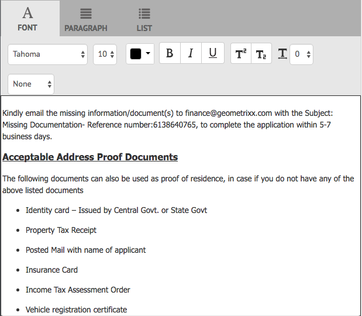

# Crear correspondencia{#create-correspondence}

## Crear correspondencia en la interfaz de usuario Crear correspondencia {#create-correspondence-in-the-create-correspondence-user-interface}

Después de crear una plantilla de [carta en Correspondence Management](../../forms/using/create-letter.md), el usuario final/agente/reclamante puede abrir la carta en la interfaz de usuario Crear correspondencia y crear una correspondencia ingresando datos, configurando contenido y administrando archivos adjuntos. Por último, el agente o el ajustador de reclamaciones pueden gestionar el contenido en el modo de previsualización y presentar la carta.

### Previsualización de una correspondencia {#preview-a-correspondence}

Seleccione la letra a previsualización siguiendo los pasos siguientes:

1. En la página Letras, toque **Seleccionar**.
1. Toque la letra correspondiente para seleccionarla.

   

   Seleccionar carta

1. Para una carta basada en el diccionario de datos, seleccione **Previsualización** > **Previsualización**. O bien, para una carta no basada en el diccionario de datos, seleccione **Previsualización**. También puede pasar el ratón sobre una letra (sin seleccionarla) y tocar el icono de Previsualización de letras para previsualización.

   >[!NOTE]
   >
   >Si un diccionario de datos no está asociado con la letra, se abre la previsualización de la letra. De lo contrario, si la carta está basada en el diccionario de datos, Administración de correspondencia muestra las opciones Previsualización y Personalizado en el menú Previsualización y puede seleccionar una de las dos opciones. También puede asociar datos de prueba con un diccionario de datos. Cuando el [diccionario de datos tiene datos de prueba asociados](../../forms/using/data-dictionary.md#p-working-with-test-data-p), al seleccionar la opción de previsualización, se abre la previsualización normal con los datos de prueba completados.

1. Para poder procesar una correspondencia mientras la visualiza, debe ser administrador o parte de uno de los siguientes grupos:

   * formularios-usuarios (para la previsualización en la instancia de autor)
   * cm-agent-users (para representaciones en instancias de publicación)

   Si no dispone de los permisos necesarios, solicite al administrador el acceso adecuado. Para obtener más información sobre cómo crear y agregar usuarios a grupos, consulte [Añadir usuarios o grupos a un grupo](/help/sites-administering/security.md). Si intenta procesar una correspondencia sin tener los permisos adecuados, aparece la página de error 404.

1. Si ha seleccionado **Previsualización** > **Personalizado**, se abre un cuadro de diálogo. En el cuadro de diálogo, seleccione un archivo de datos, correspondiente al diccionario de datos, para previsualización de la letra con y, a continuación, seleccione **Previsualización**. Se crea un archivo de datos basado en un diccionario de datos para una letra específica. Para obtener más información sobre el archivo de datos, consulte [Diccionario de datos](../../forms/using/data-dictionary.md#p-working-with-test-data-p).

   

1. La previsualización HTML de la letra (previsualización de formularios móviles) se abre con la ficha Datos en foco de forma predeterminada.

   Para obtener más información sobre los formularios móviles y las funciones que admiten, consulte [Diferenciación de funciones entre Mobile Forms y PDF forms](https://helpx.adobe.com/livecycle/help/mobile-forms/feature-differentiation-mobile-forms-pdf.html).

   Hay tres fichas: datos, contenido y datos adjuntos. Si no hay elementos de datos (variables de marcador de posición y campos de diseño), la letra se abre directamente con la ficha Contenido que se muestra. La ficha Archivos adjuntos solo está disponible cuando los archivos adjuntos están presentes o el acceso a la biblioteca está habilitado.

   >[!NOTE]
   >
   >Para obtener más información sobre el cambio entre el modo de representación HTML o PDF de la previsualización de letras, consulte [Cambio del modo de representación de letras](#changerenditionmode). Para obtener más información sobre la compatibilidad con PDF en Correspondence Management and AEM, consulte [Interrupción de los complementos del explorador NPAPI y su impacto](https://helpx.adobe.com/aem-forms/kb/discontinuation-of-npapi-plugins-impact-on-aem-forms.html) y [PDF forms en HTML5 Forms](https://helpx.adobe.com/aem-forms/kb/pdf-forms-to-html5-forms.html).

### Escriba los datos {#enterdata}

En la ficha Datos, rellene los campos de diseño y los marcadores de posición disponibles.

1. Introduzca los datos y las variables de contenido en los campos según sea necesario. Rellene todos los campos obligatorios marcados con un asterisco (*) para habilitar el botón **Enviar**.

   Toque un valor de campo de datos en la previsualización de letras HTML para resaltar el campo de datos correspondiente en la ficha Datos.

    

### Gestionar contenido {#managecontent}

En la ficha de contenido, administre el contenido como fragmentos de documento y variables de contenido en la carta.

1. Seleccione **Contenido**. La Administración de correspondencia muestra la ficha de contenido de la carta.

   

1. Edite los módulos de contenido, según sea necesario, en la ficha Contenido. Para enfocar el módulo de contenido relevante en la jerarquía de contenido, puede tocar la línea o el párrafo correspondiente en la previsualización de letras o tocar el módulo de contenido directamente en la jerarquía de contenido.

   Por ejemplo, la línea &quot;Hemos revisado... &quot; se selecciona en el gráfico siguiente y el módulo de contenido relevante se selecciona en la ficha Contenido.

   

   En la ficha Contenido o Datos, al tocar Resaltar los módulos seleccionados ( ) en la parte superior izquierda de la previsualización de letras HTML, puede deshabilitar o habilitar la funcionalidad para ir al módulo de contenido/datos cuando el texto, párrafo o campo de datos relevante esté seleccionado en la previsualización de letras.

   Para obtener más información sobre las acciones disponibles para varios módulos en la interfaz de usuario Crear correspondencia, consulte [Acciones e información disponibles en la interfaz de usuario Crear correspondencia](#actions-and-info-available-in-the-create-correspondence-content-tab).

1. Para localizar módulos de contenido, utilice el campo Buscar. Escriba el nombre o título completo o parcial del módulo de contenido para buscarlo en la correspondencia.
1. Toque el icono Mostrar ( ) delante de una lista, texto, condición o área de destinatario para mostrarlo u ocultarlo en la letra.
1. Para editar un módulo de texto en línea o editable, toque el icono **Editar** pertinente ( ) o haga clic con el doble en el módulo de texto relevante en la previsualización de letras.

   El sistema muestra un editor de texto para editar y dar formato al texto.

   El corrector ortográfico predeterminado del navegador comprueba la ortografía en el editor de texto. Para administrar la revisión ortográfica y gramatical, puede editar la configuración del corrector ortográfico del navegador o instalar complementos del navegador para revisar la ortografía y la gramática.

   También puede utilizar los distintos métodos abreviados de teclado del editor de texto para administrar, editar y dar formato al texto. Para obtener más información acerca de los [atajos de teclado del Editor de texto](/help/forms/using/keyboard-shortcuts.md#correspondence-management) en Atajos de teclado de Correspondence Management.

   

   Es posible que desee reutilizar uno o varios párrafos de texto que existan en otra aplicación de documento. Puede copiar y pegar texto directamente, como desde MS Word, páginas HTML o cualquier otra aplicación.

   Puede copiar y pegar uno o varios párrafos de texto en un módulo de texto editable. Por ejemplo, puede tener un documento de MS Word con una lista con viñetas de pruebas de residencia aceptables, como por ejemplo:

   

   Puede copiar y pegar directamente el texto del documento de MS Word en un módulo de texto editable. El formato, como la lista con viñetas, la fuente y el color del texto, se conserva en el módulo de texto.

   

   >[!NOTE]
   >
   >Sin embargo, el formato del texto pegado tiene algunas [limitaciones](https://helpx.adobe.com/aem-forms/kb/cm-copy-paste-text-limitations.html).

   Puede aplicar sangría al texto y a los números de la carta mediante la tecla de tabulación. Por ejemplo, puede utilizar la tecla Tab para alinear varias columnas de texto en una lista en un formato de tabla.

   

   Ejemplo: Uso de la tecla de tabulación para alinear varias columnas de texto en un formato de tabla

   >[!NOTE]
   >
   >Para obtener más información sobre la configuración del espaciado entre fichas para los módulos de texto y las letras, consulte [Más información sobre el uso del espaciado entre tabuladores para organizar el texto](https://helpx.adobe.com/aem-forms/kb/cm-tab-spacing-limitations.html).

1. Si es necesario, inserte caracteres especiales en la correspondencia. Por ejemplo, puede utilizar la paleta Caracteres especiales para insertar:

   * Símbolos monetarios como €, ¥y £
   * Matemáticas como la adrenalina, el rey, el rey, el rey y el símbolo ^
   * Símbolos de puntuación como ‟ y&quot;

   

   Correspondence Management ha incorporado compatibilidad con 210 caracteres especiales. El administrador puede [agregar compatibilidad con más caracteres especiales personalizados personalizándolos](../../forms/using/custom-special-characters.md).

1. Para resaltar o resaltar partes del texto en un módulo en línea editable, seleccione el texto y toque Color de resaltado.

   

   Puede tocar directamente un color básico `**[A]**` presente en la paleta Colores básicos o tocar **Seleccionar** después de usar el deslizador `**[B]**` para elegir la sombra adecuada del color.

   Opcionalmente, también puede ir a la ficha Avanzado para seleccionar el tono, la luminosidad y la saturación correspondientes `**[C]**` para crear el color preciso y, a continuación, tocar Seleccionar `**[D]**` para aplicar el color y resaltar el texto.

   

1. Realice los cambios de formato y contenido adecuados y toque **Guardar**. Toque ( ) para moverse entre módulos de texto editables, o toque **Guardar y Siguiente** para guardar los cambios y desplazarse al siguiente módulo de texto editable.
1. El sistema también muestra las variables sin rellenar para cada rama. Cuando no hay variables sin rellenar, las variables sin rellenar se muestran como 0. Si hay una variable sin rellenar, puede tocar una rama para expandirla y localizar la variable sin rellenar. Utilice la barra de herramientas de contenido para eliminar contenido, aumentar o reducir la sangría del contenido e insertar saltos de página antes o después del contenido.

   Puede insertar saltos de página por encima y por debajo de los módulos de datos incluso cuando formen parte de listas y condiciones.

1. Toque Abrir/Cerrar variable de contenido ( ) para abrir las variables de contenido y rellenarlas correctamente.
1. Una vez que complete la variable sin rellenar correctamente, el recuento de la variable sin rellenar se establece en 0.

   En la interfaz de usuario Crear correspondencia, el recuento de variables sin rellenar se muestra en cada nivel de la jerarquía de cualquier módulo que contenga al menos una variable. Si un módulo contiene variables sin rellenar, el recuento se muestra en el nivel de variable, módulo, área de destinatario y plantilla de letras.

   El recuento de variables sin rellenar incluye:

   * Solo variables de marcador de posición y diccionario de datos sin proteger. El recuento de variables no incluye variables de diccionario de datos protegidas o de diseño.
   * Campos obligatorios.
   * Campos de diseño si son obligatorios y están enlazados al usuario.
   * Solo instancias de variables únicas. Si un módulo, área de destinatario o plantilla de carta contiene dos o más instancias de la misma variable, el recuento se muestra como 1 (uno). Sin embargo, para cada una de las instancias, el recuento se muestra como 1.

   El recuento de variables no rellenadas no incluye los módulos no seleccionados. Si un módulo se incluye en una plantilla de carta pero no está en la letra, no se muestra el recuento de variables no rellenadas en este módulo.

   Para el área de destinatario, el módulo y la variable, el recuento se muestra a la derecha de cada objeto en la plantilla de letras. Sin embargo, para la plantilla completa, el recuento se muestra en la barra de estado Crear correspondencia.

   Los módulos de una plantilla de carta muestran el recuento de variables sin rellenar como se describe a continuación:

   * **** TextoMuestra la suma de las variables únicas de marcador de posición sin rellenar y los elementos de diccionario de datos contenidos en el módulo de texto.
   * **** CondiciónMuestra la suma de las variables de condición únicas no rellenadas incluidas en la condición y las variables incluidas en los módulos resultantes.
   * **** ListaMuestra la suma de todas las variables únicas sin rellenar contenidas en los módulos asignados a la lista.
   * **** Área de destinatarioMuestra la suma de todas las variables únicas sin rellenar contenidas en los módulos asignados al área de destinatario.

   Tenga en cuenta lo siguiente con respecto a las variables con valores predeterminados:

   * El valor predeterminado de un campo de variable booleano es *false*. Sin embargo, se considera que la variable no está rellenada. Esto implica que el recuento de variables incluye todos los campos de variables booleanas con el valor *false*.

   * El valor predeterminado de un campo de variable numérica es *0 (cero)*. Sin embargo, se considera que la variable no está rellenada. Esto implica que el recuento de variables incluye todos los campos numéricos de variables con el valor *0 (cero)*.

#### Acciones e información disponibles en la ficha Crear contenido de correspondencia {#actions-and-info-available-in-the-create-correspondence-content-tab}

**Área de destino**

* Insertar línea en blanco: Inserta una nueva línea en blanco.
* Insertar texto en línea: Inserta un nuevo módulo de texto.
* Bloqueo de pedido (información): Indica que no se puede cambiar el orden del contenido.
* Valores no rellenados (información): Indica el número de variables sin rellenar en el área de destinatario.

**Módulo**

* Selección (icono de ojo): Incluye\excluye el módulo de la letra.
* Omitir viñetas (aplicable a los módulos de lista y sus módulos secundarios): Omite las viñetas de un módulo concreto.
* Salto de página antes (aplicable para módulos secundarios del área de destinatario): Inserta un salto de página antes del módulo.
* Salto de página después de (aplicable para módulos secundarios del área de destinatario): Inserta un salto de página antes del módulo.
* Valores no rellenados (información): Indica el número de variables sin rellenar en el área de destinatario.
* Editar (sólo módulos de texto): Abra el editor de texto enriquecido para editar el módulo de texto.
* Panel de datos (módulos de texto y condición): Abra todas las variables del módulo.

**Módulo lista**

* Insertar línea en blanco: Inserta una nueva línea en blanco.
* Biblioteca de contenido: Abre la biblioteca de contenido para agregar módulos a la lista.
* Configuración de lista (solo lista anidada):
* Bloqueo de pedido (información): Indica que no se puede cambiar el orden de los elementos de lista.

### Administrar archivos adjuntos {#manage-attachments}

1. Seleccione **Datos adjuntos**. La Administración de correspondencia muestra los archivos adjuntos disponibles, tal como se configuraron al crear la plantilla de carta.
1. Puede elegir no enviar un archivo adjunto junto con la letra tocando el icono de vista y puede tocar la cruz del archivo adjunto para eliminarlo de la letra. Para los archivos adjuntos especificados, mientras se crea una plantilla de carta, como Obligatorio, los iconos Vista y Eliminar están desactivados.
1. Toque el icono de acceso a biblioteca ( ) para acceder a la biblioteca de contenido e insertar recursos DAM como archivos adjuntos.

   >[!NOTE]
   >
   >El icono Acceso a biblioteca solo está disponible cuando se habilitó el acceso a la biblioteca durante la creación de la carta.

1. Si el orden de los datos adjuntos no estaba bloqueado durante la creación de la correspondencia, puede reordenarlos seleccionando un archivo adjunto y tocando las flechas hacia abajo y hacia arriba.

   Para obtener más información, consulte [envío de datos adjuntos](#attachmentdelivery).

### Administre el contenido en previsualización y envíe la carta {#manage-content-in-preview-and-submit-the-letter}

Puede realizar cambios en el diseño y en el contenido para asegurarse de que la carta tenga el aspecto deseado y se envíe a los distintos procesos de publicación.

1. Para resaltar todo el contenido editable de la letra, toque **Resaltar secciones editables**.

   El contenido editable de la carta se resalta con un fondo gris.

   

1. Edite los módulos de contenido, según sea necesario, en la ficha Contenido. Para enfocar el módulo de contenido relevante en la jerarquía de contenido, puede tocar la línea o el párrafo correspondiente en la previsualización de letras o tocar el módulo de contenido directamente en la jerarquía de contenido.

   Por ejemplo, la línea &quot;Para permitirnos el acceso...&quot; se selecciona en el gráfico de abajo y el módulo de contenido correspondiente se selecciona en la ficha Contenido.

   Al tocar Resaltar módulos seleccionados en el contenido ( ), puede desactivar o habilitar la funcionalidad para resaltar el módulo de contenido en la ficha Contenido cuando se toca el texto, el párrafo o el campo de datos relevantes en la previsualización de letras.

   Para obtener más información sobre las acciones disponibles para varios módulos en la interfaz de usuario Crear correspondencia, consulte [Acciones e información disponibles en la interfaz de usuario Crear correspondencia](#actions-and-info-available-in-the-create-correspondence-content-tab).

1. Para agregar un salto de página a la letra, toque donde desee insertar un salto de página y seleccione Salto de página antes o Salto de página después de ( ).

   En la letra se inserta un marcador de posición de salto de página explícito. Para ver la vista de cómo un salto de página explícito afecta a la letra, consulte la previsualización PDF acoplada.

   >[!NOTE]
   >
   >Como los formularios móviles no admiten saltos de página, los encabezados y pies de página solo aparecen una vez. Sin embargo, puede definir explícitamente encabezados y pies de página en la presentación (por página) para que aparezcan en la previsualización de formularios móviles. Además, las páginas en blanco de la carta, si las hay, no aparecen en la previsualización de formularios móviles.

   

1. Para guardar la carta como borrador, en el que podrá seguir trabajando más tarde, toque Guardar como borrador. Para utilizar esta opción, la carta debe estar [publicada](../../forms/using/publishing-unpublishing-forms.md#publishanasset). Para obtener más información, consulte Instancia de borrador en [Guardar borradores y enviar instancias de carta](#savingdrafts).

   

   El cuadro de diálogo Nombre de la letra provisional aparece con la identificación de la instancia de la letra. Opcionalmente, puede editar este ID. Anote el Id de la letra y toque **Listo**. Más adelante, puede utilizar este ID para [volver a cargar el borrador de la letra](submit-letter-topostprocess.md#reloaddraft).

1. Para previsualización de la letra como un PDF acoplado con la presentación exacta y los saltos de página a medida que se vaya enviando, toque la Previsualización ( ).

   La carta aparece como un PDF acoplado. El PDF acoplado es la representación exacta de la carta, ya que se enviará con las fuentes, los saltos y el diseño correctos de la carta.

   >[!NOTE]
   >
   >Si utiliza Mozilla Firefox y el tipo de representación HTML, para previsualización de la letra como PDF acoplado, asegúrese de utilizar el complemento nativo del navegador y no el complemento de Acrobat. Para seleccionar el complemento nativo del navegador, vaya a la configuración de Mozilla Firefox y, para el tipo de contenido PDF, seleccione Previsualización en Firefox.

1. Si encuentra que la previsualización PDF acoplada es satisfactoria, toque **Enviar** para enviar la carta. O bien, para realizar cambios en la letra, toque **Previsualización de salida** para volver a la previsualización de la interfaz de usuario Crear correspondencia de la letra para realizar cambios en la carta. Al tocar Enviar, si la configuración Administrar instancia de carta está habilitada en la instancia de Publicar, se genera la instancia de envío de carta.

   Para obtener más información, consulte Instancia de borrador en Guardar borradores y enviar instancias de carta.

   También puede guardar la carta como borrador para realizar cambios en la carta más adelante.

   Después de realizar los cambios necesarios, puede enviar la carta desde la previsualización HTML5 o tocar de nuevo la Previsualización para revisar el resultado del PDF acoplado.

   Para obtener información sobre las diferencias entre formularios HTML5 y PDF forms, consulte [Diferenciación de funciones entre formularios HTML5 y PDF forms](../../forms/using/feature-differentiation-html5-forms-pdf-forms.md).

## Guardar borradores y enviar instancias de carta {#savingdrafts}

Cuando se procesa una carta en la interfaz de usuario Crear correspondencia, puede guardarla como si se estuviera viendo.

Existen dos tipos de instancias de letras que se pueden guardar: Instancia de borrador y instancia de envío.

* **Instancia** de borrador: La instancia de borrador captura el estado actual de la letra que está previsualizando. Para guardar una instancia de borrador, primero asegúrese de que la letra y todos los recursos a los que hace referencia la letra están en estado Publicado. Para obtener información sobre la publicación de una carta, consulte [Publicar un recurso](../../forms/using/publishing-unpublishing-forms.md#publishanasset). Debe publicar una carta antes de guardarla como borrador, ya que cuando publica una carta, crea una versión de la carta, sus recursos dependientes y los datos en ese momento. Usted u otro usuario no puede editar la versión publicada de una carta y se puede restaurar más tarde sin ninguna discrepancia inesperada de la versión publicada. Puede volver más tarde a esta instancia y continuar desde donde se fue.

* **Enviar instancia**: Las instancias de envío capturan el estado de la letra a medida que se envía. La instancia de envío almacena el estado PDF de la instancia de carta después de que se haya procesado junto con los datos introducidos por el usuario en la interfaz de usuario Crear correspondencia.

Estas instancias solo se pueden guardar cuando la carta se está viendo en una instancia de publicación. De forma predeterminada, el guardado en instancias está desactivado. Para habilitar el guardado de instancias de letras, lleve a cabo los siguientes pasos.

1. En AEM, abra la configuración de la consola web de Adobe Experience Manager para su servidor mediante la siguiente URL: https://&lt;server>:&lt;port>/&lt;contextpath>/system/console/configMgr
1. Busque **[!UICONTROL Configuraciones de administración de correspondencia]** y haga clic en ellas.
1. Marque **[!UICONTROL Administrar instancias de carta en la configuración de Publish]** y luego haga clic en **[!UICONTROL Guardar]**.

Cuando se activa el guardado de instancias de letras, tiene la opción de seleccionar dónde guardar las instancias de letras. Existen dos opciones para guardar las instancias de letras: Guardado local o Almacenamiento remoto.

### Almacenamiento local {#local-save}

Las instancias de letras se guardan en la instancia de publicación y se replican de forma inversa en la instancia de autor.

### Almacenamiento remoto {#remote-save}

Esta opción existe para las personas que tienen problemas con el almacenamiento de datos de usuario en instancias de publicación, que en general están fuera del cortafuegos corporativo. Cuando se activa la opción de guardar de forma remota, las instancias de letras no se guardan en la instancia de publicación pero se guardan de forma remota en el autor de procesamiento especificado mediante las configuraciones del SDK de cliente de LiveCycle.

#### Habilitar almacenamiento remoto {#enable-remote-save}

1. En AEM, abra la configuración de la consola web de Adobe Experience Manager para su servidor mediante la siguiente URL: `https://<server>:<port>/<contextpath>/system/console/configMgr`
1. Busque **[!UICONTROL Configuraciones de administración de correspondencia]** y haga clic en ellas.
1. Busque la configuración **[!UICONTROL Almacenamiento remoto]**, verifíquela y haga clic en **[!UICONTROL Guardar]**.

#### Especificar la configuración del autor de procesamiento {#specify-processing-author-settings}

1. En AEM, abra la configuración de la consola web de Adobe Experience Manager para su servidor mediante la siguiente URL: `https://<server>:<port>/<contextpath>/system/console/configMgr`

   

1. En esta página, localice la configuración del SDK del cliente de Adobe LiveCycle y amplíela haciendo clic en ella.

1. En la URL del servidor de procesamiento, introduzca el nombre del servidor de LiveCycle, proporcione la información de inicio de sesión y, a continuación, haga clic en **Guardar**.

   

1. Si es necesario, configure el nombre de usuario y la contraseña con los que desea acceder al servidor.

#### Envío de datos adjuntos {#attachmentdelivery}

* Los archivos adjuntos de la carta están disponibles en el proceso posterior del PDF, que se crea después del envío de la carta.
* Cuando la carta se procesa con las API del lado del servidor como un PDF interactivo o no interactivo, el PDF procesado contiene archivos adjuntos como archivos PDF adjuntos.
* Cuando se carga un proceso de publicación asociado a una plantilla de carta como parte de las operaciones Enviar o completar correspondencia mediante la interfaz de usuario Crear correspondencia, los archivos adjuntos se pasan como la Lista&lt;com.adobe.idp.Documento> en el parámetro AttachmentDocs.
* Los mecanismos de envío predeterminados, como correo electrónico e impresión, también proporcionan archivos adjuntos junto con el PDF de la correspondencia generada.

## Modos de representación de la previsualización de letras: Previsualización de formularios móviles y previsualización PDF {#rendition-modes-of-letter-preview-mobile-forms-preview-and-pdf-preview}

La Administración de correspondencia de AEM Forms muestra una carta como HTML en la interfaz de usuario Crear correspondencia. Sin embargo, la administración de correspondencia aún admite la revertir a la previsualización PDF en lugar de a la previsualización HTML. Para obtener más información sobre cómo cambiar entre el modo de previsualización HTML y PDF, consulte [Cambiar el modo de representación de la letra](#changerenditionmode).

A continuación se describen las ventajas y la funcionalidad disponibles en la previsualización de HTML y PDF.

**Ventajas de los formularios móviles/previsualización HTML**

* **Toque un valor de campo de datos para resaltar el campo** de datos correspondiente: En la interfaz de usuario Crear correspondencia, puede tocar un valor de campo de datos en la letra para resaltar el campo de datos correspondiente en la ficha Datos. Para obtener más información, consulte [Introducción de datos](#enterdata).

* **Compatibilidad** con exploradores: Los navegadores retiran gradualmente la compatibilidad con NPAPI, lo que afecta a la previsualización de letras en PDF. Los formularios HTML/móviles no afectan a la previsualización de letras.
* **Resalte el contenido editable en una letra**: En la interfaz de usuario Crear correspondencia, puede tocar Resaltar contenido editable para resaltar todo el contenido editable de la letra en gris. Para obtener más información, consulte [Administrar contenido](#managecontent).

`<li>` `<li>Benefits of HTML preview  <ul>   <li>Right to left</li>   <li>NPAPI</li>   <li>Highlight Editable Content</li>  </ul> </li>` `<li>Benefits of PDF preview  <ul>   <li>Page Break</li>   <li>Final Preview</li>  </ul> </li>`
`<li>` `<li>Benefits of HTML preview  <ul>   <li>Right to left</li>   <li>NPAPI</li>   <li>Highlight Editable Content</li>  </ul> </li>` `<li>Benefits of PDF preview  <ul>   <li>Page Break</li>   <li>Final Preview</li>  </ul> </li>`  **Ventajas de la previsualización de PDF**

* **Salto** de página: En la previsualización PDF, se puede realizar una vista exacta de cómo los saltos de página de la letra afectan a su salida.
* **Previsualización** final: En la previsualización PDF, puede realizar una vista del formato y el aspecto exactos de la letra, ya que la letra aparecerá en su salida.

Para obtener información sobre la compatibilidad con secuencias de comandos en PDF forms, consulte [Compatibilidad con secuencias de comandos](https://help.adobe.com/en_US/livecycle/11.0/ScriptingSupport/index.html).

Para obtener más información sobre la compatibilidad con secuencias de comandos en formularios HTML5, consulte [Compatibilidad con secuencias de comandos para formularios HTML5](/help/forms/using/scripting-support.md).

### Cambiar el modo de representación de la letra {#changerenditionmode}

De forma predeterminada, la interfaz de usuario Crear correspondencia utiliza los formularios HTML o móviles para representar la previsualización de letras. La previsualización de formularios móviles no tiene problemas para procesarse en ningún navegador, ya que utiliza el complemento nativo del explorador y no requiere complementos adicionales. Puede cambiar el modo de previsualización de letras a PDF. Sin embargo, las restricciones del navegador pueden crear problemas para distintas funciones de la previsualización PDF interactiva de la carta.

Para obtener más información sobre la compatibilidad del explorador con la previsualización de letras, consulte [Interrupción de los complementos del explorador NPAPI y su impacto](https://helpx.adobe.com/aem-forms/kb/discontinuation-of-npapi-plugins-impact-on-aem-forms.html).

Para cambiar el modo de previsualización de la letra, complete los siguientes pasos:

1. Vaya a `https://[system]:'port'/system/console/configMgr` y, si es necesario, inicie sesión como administrador.
1. Vaya a **[!UICONTROL Configuraciones de administración de correspondencia]** > **[!UICONTROL Tipo de representación]** y seleccione **Representación HTML** (predeterminada) o **Representación PDF**.
1. Haga clic en **[!UICONTROL Guardar]**.

