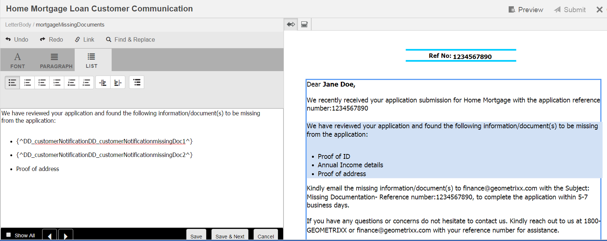

# Crear correspondencia{#create-correspondence}

## Crear correspondencia en la interfaz de usuario Crear correspondencia {#create-correspondence-in-the-create-correspondence-user-interface}

Después de crear [la plantilla de carta en Administración de correspondencia](../../forms/using/create-letter.md), el usuario/agente/administrador de reclamaciones final puede abrir la carta en la interfaz de usuario de Crear correspondencia y crear una correspondencia al introducir datos, configurar el contenido y administrar los archivos adjuntos. Finalmente, el agente o administrador de reclamaciones puede administrar el contenido en el modo de vista previa y enviar la carta.

### Previsualizar una correspondencia {#preview-a-correspondence}

Seleccione la carta que desea previsualizar mediante los pasos siguientes:

1. En la página Cartas, pulse **Seleccionar**.
1. Pulse la carta adecuada para seleccionarla.

   

   Seleccionar carta

1. Para una carta basada en el diccionario de datos, seleccione **Previsualizar** > **Previsualizar**. O para una carta no basada en diccionario de datos, seleccione **Previsualizar**. También puede situarse sobre una carta (sin seleccionarla) y pulsar el icono Previsualizar carta para previsualizarla.

   >[!NOTE]
   >
   >Si un diccionario de datos no está asociado con la carta, se abrirá la vista previa de la carta. De lo contrario, si la carta está basada en el diccionario de datos, Administración de correspondencia mostrará las opciones Previsualizar y Personalizado en el menú Previsualizar y podrá seleccionar una de las dos opciones. También puede asociar datos de prueba con un diccionario de datos. Cuando el [diccionario de datos tiene asociados datos de prueba](../../forms/using/data-dictionary.md#p-working-with-test-data-p), al seleccionar la opción Previsualizar, la vista previa normal se abrirá con los datos de prueba rellenados.

1. Para poder procesar una correspondencia al previsualizarla, debe ser administrador o formar parte de uno de los siguientes grupos:

   * forms-users (para previsualizar en la instancia de autor)
   * cm-agent-users (para procesar en instancia de publicación)

   Si no dispone de los permisos necesarios, solicite al administrador el acceso correspondiente. Para obtener más información sobre crear y agregar usuarios a grupos, consulte [Agregar usuarios o grupos a un grupo](/help/sites-administering/security.md). Si intenta procesar una correspondencia sin tener los permisos adecuados, aparecerá la página de error 404.

1. Si ha seleccionado **Previsualizar** > **Personalizado**, se abrirá un cuadro de diálogo. En el cuadro de diálogo, seleccione un archivo de datos, correspondiente al diccionario de datos, con el que previsualizar la carta y, a continuación, seleccione **Previsualizar**. Se creará un archivo de datos basado en un diccionario de datos para una carta específica. Para obtener más información sobre el archivo de datos, consulte [Diccionario de datos](../../forms/using/data-dictionary.md#p-working-with-test-data-p).

   

1. La vista previa HTML de cartas (vista previa de formularios móviles) se abrirá con la pestaña Datos enfocada de forma predeterminada.

   Para obtener más información sobre los formularios móviles y las características que admiten, consulte [Diferenciar las características de Mobile Forms y de los formularios PDF](https://helpx.adobe.com/es/livecycle/help/mobile-forms/feature-differentiation-mobile-forms-pdf.html).

   Hay tres pestañas: datos, contenido y archivos adjuntos. Si no hay elementos de datos (variables de marcador de posición y campos de diseño), la carta se abrirá directamente con la pestaña Contenido. La pestaña Datos adjuntos solo estará disponible cuando haya archivos adjuntos o cuando el acceso a la biblioteca esté habilitado.

   >[!NOTE]
   >
   >Para obtener más información sobre cómo cambiar entre el modo de procesamiento HTML o PDF de la vista previa de la carta, consulte [Cambiar el modo de procesamiento de la carta](#changerenditionmode). Para obtener más información sobre la compatibilidad con PDF en Administración de correspondencia y en AEM, consulte [Interrupción de los complementos del explorador NPAPI y su impacto](https://helpx.adobe.com/es/aem-forms/kb/discontinuation-of-npapi-plugins-impact-on-aem-forms.html) y [De formularios PDF a formularios HTML5](https://helpx.adobe.com/aem-forms/kb/pdf-forms-to-html5-forms.html).

### Introducir datos {#enterdata}

En la pestaña Datos, rellene los campos de diseño y los marcadores de posición disponibles.

1. Escriba las variables de datos y de contenido en los campos según sea necesario. Rellene todos los campos obligatorios marcados con un asterisco (&#42;) para habilitar el botón **Enviar**.

   Pulse un valor del campo de datos en la vista previa de la carta HTML para resaltar el campo de datos correspondiente en la pestaña Datos.

    

### Administrar contenido {#managecontent}

En la pestaña Contenido, administre el contenido, como los fragmentos del documento y las variables de contenido de la carta.

1. Seleccione **Contenido**. Administración de correspondencia muestra la pestaña Contenido de la carta.

   

1. Edite los módulos de contenido, según sea necesario, en la pestaña Contenido. Para centrar la atención en el módulo de contenido relevante en la jerarquía de contenido, puede pulsar la línea o el párrafo correspondiente en la vista previa de la carta o pulsar el módulo de contenido directamente en la jerarquía de contenido.

   Por ejemplo, la línea “Hemos revisado...” está seleccionada en el siguiente gráfico y el módulo de contenido correspondiente está seleccionado en la pestaña Contenido.

   

   En la pestaña Contenido o Datos, pulse Resaltar módulos seleccionados ( ) en la parte superior izquierda de la vista previa de la carta HTML, puede deshabilitar o habilitar la funcionalidad para ir al módulo de contenido/datos cuando el texto, párrafo o campo de datos relevantes esté seleccionado en la vista previa de la carta.

   Para obtener más información sobre las acciones disponibles para varios módulos en la interfaz de usuario Crear correspondencia, consulte [Acciones e información disponible en la interfaz de usuario Crear correspondencia](#actions-and-info-available-in-the-create-correspondence-content-tab).

1. Para localizar módulos de contenido, utilice el campo Buscar. Escriba el nombre completo o parcial o el título del módulo de contenido para buscarlo en la correspondencia.
1. Pulse el icono Mostrar ( ) delante de una lista, texto, condición o área de destino para mostrarlo u ocultarlo en la carta.
1. Para editar un módulo de texto dentro de la línea o editable, pulse el icono **Editar** ( ) o haga doble clic en el módulo de texto correspondiente en la vista previa de la carta.

   El sistema muestra un editor de texto para editar y dar formato al texto.

   El corrector ortográfico predeterminado del explorador comprueba la ortografía en el Editor de texto. Para administrar la revisión ortográfica y gramatical, puede editar la configuración del corrector ortográfico del explorador o instalar complementos del explorador para revisar la ortografía y la gramática.

   También puede utilizar los distintos métodos abreviados de teclado en el Editor de texto para administrar, editar y dar formato al texto. Para obtener más información, consulte los métodos abreviados de teclado del [Editor de texto](/help/forms/using/keyboard-shortcuts.md#correspondence-management) en Métodos abreviados de teclado de Administración de correspondencia.

   

   Es posible que quiera reutilizar uno de los párrafos de texto que existen en otra aplicación del documento. Puede copiar y pegar texto directamente, como desde MS Word, páginas HTML o cualquier otra aplicación.

   Puede copiar y pegar uno o varios párrafos de texto en un módulo de texto editable. Por ejemplo, es posible que tenga un documento de MS Word con una lista con viñetas de justificantes de domicilio aceptables como las siguientes:

   

   Puede copiar y pegar directamente el texto del documento de MS Word en un módulo de texto editable. El formato, como la lista con viñetas, la fuente y el color del texto, se mantiene en el módulo de texto.

   

   >[!NOTE]
   >
   >Sin embargo, el formato del texto pegado tiene algunas [limitaciones](https://helpx.adobe.com/es/aem-forms/kb/cm-copy-paste-text-limitations.html).

   Puede sangrar el texto y los números de la carta utilizando el tabulador. Por ejemplo, puede utilizar el tabulador para alinear varias columnas de texto de una lista con un formato de tabla.

   

   Ejemplo: Usar el tabulador para alinear varias columnas de texto en un formato tabular

   >[!NOTE]
   >
   >Para obtener más información sobre la configuración del espaciado de tabulación para los módulos de texto y las cartas, consulte [Más información sobre el uso del espaciado de tabulación para organizar el texto](https://helpx.adobe.com/es/aem-forms/kb/cm-tab-spacing-limitations.html).

1. Si es necesario, inserte caracteres especiales en la correspondencia. Por ejemplo, puede utilizar la paleta Caracteres especiales para insertar:

   * Símbolos monetarios como €, ￥ y £
   * Símbolos matemáticos como ∑, √, ∂ y ^
   * Símbolos de puntuación como ‟ y &quot;

   

   Administración de correspondencia ha incorporado la compatibilidad con 210 caracteres especiales. El administrador puede [agregar compatibilidad con caracteres especiales adicionales o personalizados usando la personalización](../../forms/using/custom-special-characters.md).

1. Para resaltar o hacer énfasis en determinados fragmentos de texto de un módulo en línea editable, seleccione el texto y pulse Color de resaltado.

   

   Puede pulsar directamente en un color básico `**[A]**` presentes en la paleta Colores básicos o pulsar **Seleccionar** después de usar el regulador `**[B]**` para elegir la sombra adecuada de color.

   Alternativamente, también puede ir a la pestaña Avanzado para seleccionar el tono, la luminosidad y la saturación adecuados `**[C]**` para crear el color preciso y, a continuación, pulsar Seleccionar `**[D]**` para aplicar el color para resaltar el texto.

   

1. Realice los cambios de contenido y formato adecuados y pulse **Guardar**. Pulse ( ) para moverse entre módulos de texto editables, o pulse **Guardar y siguiente** para guardar los cambios y pasar al siguiente módulo de texto editable.
1. El sistema también muestra las variables sin rellenar para cada una de las ramas. Cuando no hay variables no rellenadas, las estas se mostrarán como 0. Si hay variables sin rellenar, puede pulsar una rama para expandirla y localizarlas. Utilice la barra de herramientas de contenido para eliminar contenido, aumentar/disminuir la sangría del contenido e insertar saltos de página antes o después del contenido.

   Puede insertar saltos de página por encima y por debajo de los módulos de datos incluso cuando formen parte de listas y condiciones.

1. Pulse Abrir/Cerrar variable de contenido ( ) para abrir las variables de contenido y rellenarlas correctamente.
1. Una vez que rellene correctamente las variables que estén sin rellenar, el recuento de variables sin rellenar se establecerá en 0.

   En la interfaz de usuario Crear correspondencia, el recuento de variables sin rellenar se mostrará en cada nivel de la jerarquía de cualquier módulo que contenga al menos una variable. Si un módulo contiene variables no rellenadas, el recuento se mostrará en los niveles de variable, módulo, área de destino y plantilla de carta.

   El recuento de variables no rellenadas incluye lo siguiente:

   * Solo variables de diccionario de datos y marcadores de posición sin proteger. El recuento de variables no incluye variables de diseño o diccionarios de datos protegidos.
   * Campos obligatorios.
   * Los campos de diseño, si son obligatorios y están enlazados al usuario.
   * Solo instancias de variables únicas. Si un módulo, área de destino o plantilla de carta contiene dos o más instancias de la misma variable, el recuento se mostrará como 1 (uno). Sin embargo, para cada una de las instancias, el recuento se mostrará como 1.

   El recuento de variables no rellenadas no incluye los módulos no seleccionados. Si un módulo se incluye en una plantilla de cartas pero no está en la carta, no se mostrará el recuento de variables no rellenadas en este módulo.

   Para el área de destino, módulo y variable, el recuento se muestra a la derecha de cada objeto en la plantilla de cartas. Sin embargo, para la plantilla completa, el recuento se mostrará en la barra de estado de Crear correspondencia.

   Los módulos de una plantilla de cartas muestran el recuento de variables no rellenadas como se describe a continuación:

   * **Texto** muestra la suma de las variables únicas de marcador de posición sin rellenar y los elementos de diccionario de datos que contiene el módulo de texto.
   * **Condición** muestra la suma de las variables de condición únicas no rellenadas que contiene la condición y las variables contenidas en los módulos resultantes.
   * **Lista** muestra la suma de todas las variables únicas no rellenadas que contiene los módulos asignados a la lista.
   * **Área de destino** muestra la suma de todas las variables únicas sin rellenar incluidas en los módulos asignados al área de destino.

   Tenga en cuenta lo siguiente con respecto a las variables con valores predeterminados:

   * El valor predeterminado de un campo de variable booleana es *false*. Pero se considera que la variable no está rellenada. Esto implica que el recuento de variables incluye todos los campos de variables booleanas con valor *false*.

   * El valor predeterminado de un campo de variable numérica es *0 (cero)*. Pero se considera que la variable no está rellenada. Esto implica que el recuento de variables incluye todos los campos numéricos de variables con valor *0 (cero)*.

#### Acciones e información disponibles en la pestaña Crear contenido de correspondencia {#actions-and-info-available-in-the-create-correspondence-content-tab}

**Área de destino**

* Insertar línea en blanco: inserta una nueva línea en blanco.
* Insertar texto en línea: inserta un nuevo módulo de texto.
* Bloquear orden (información): indica que no se puede cambiar el orden del contenido.
* Valores no rellenados (información): indica el número de variables sin rellenar en el área de destino.

**Módulo**

* Selección (icono de ojo): incluye\excluye el módulo de la carta.
* Omitir viñetas (aplicable a los módulos de lista y sus módulos secundarios): omite las viñetas de un módulo concreto.
* Salto de página antes (aplicable a módulos secundarios de área de destino): inserta un salto de página antes del módulo.
* Salto de página después de (aplicable a módulos secundarios de área de destino): inserta un salto de página antes del módulo.
* Valores no rellenados (información): indica el número de variables sin rellenar en el área de destino.
* Editar (solo módulos de texto): abre el editor de texto enriquecido para editar el módulo de texto.
* Panel de datos (módulos de texto y condición): abre todas las variables del módulo.

**Módulo de lista**

* Insertar línea en blanco: inserta una nueva línea en blanco.
* Biblioteca de contenido: abre la biblioteca de contenido para agregar módulos a la lista.
* Configuración de la lista (solo lista anidada):
* Bloquear orden (información): indica que no se puede cambiar el orden de los elementos de la lista.

### Administrar archivos adjuntos {#manage-attachments}

1. Seleccione **Archivos adjuntos**. Administración de correspondencia mostrará los archivos adjuntos disponibles, tal como se configuran al crear la plantilla de la carta.
1. Puede optar por no enviar un archivo adjunto junto con la carta al pulsar el icono Ver y puede pulsar la cruz del archivo adjunto para eliminarlo de la carta. Para los archivos adjuntos especificados, al crear una plantilla de carta, como Obligatorio, los iconos Ver y Eliminar están deshabilitados.
1. Pulse el icono Acceder a la biblioteca () para acceder a la biblioteca de contenido e insertar recursos DAM como archivos adjuntos.

   >[!NOTE]
   >
   >El icono Acceder a la biblioteca solo está disponible si el acceso a la biblioteca estaba habilitado durante la creación de la carta.

1. Si el orden de los archivos adjuntos no se ha bloqueado al crear la correspondencia, puede reordenarlos si selecciona un archivo adjunto y pulsa las flechas abajo y arriba.

   Para obtener más información, consulte [Entregar datos adjuntos](#attachmentdelivery).

### Administrar contenido en la vista previa y enviar la carta {#manage-content-in-preview-and-submit-the-letter}

Puede realizar cambios en el diseño y el contenido para garantizar que la carta tenga el aspecto que desea y se envíe a los distintos procesos de publicación.

1. Para resaltar todo el contenido editable de la carta, pulse **Resaltar secciones editables**.

   El contenido editable de la carta se resaltará con un fondo gris.

   

1. Edite los módulos de contenido, según sea necesario, en la pestaña Contenido. Para centrar la atención en el módulo de contenido relevante en la jerarquía de contenido, puede pulsar la línea o el párrafo correspondiente en la vista previa de la carta o pulsar el módulo de contenido directamente en la jerarquía de contenido.

   Por ejemplo, la línea “Para permitirnos acceder...” está seleccionada en el gráfico de abajo y el módulo de contenido correspondiente está seleccionado en la pestaña Contenido.

   Al pulsar Resaltar los módulos seleccionados en el contenido ( ), puede deshabilitar o habilitar la funcionalidad para resaltar el módulo de contenido en la pestaña Contenido cuando se pulsa el texto, el párrafo o el campo de datos correspondiente en la vista previa de la carta.

   Para obtener más información sobre las acciones disponibles para varios módulos en la interfaz de usuario Crear correspondencia, consulte [Acciones e información disponible en la interfaz de usuario Crear correspondencia](#actions-and-info-available-in-the-create-correspondence-content-tab).

1. Para agregar un salto de página a la carta, pulse donde desee insertar un salto de página y seleccione Salto de página antes o Salto de página después ( ).

   En la carta se insertará un marcador de posición de salto de página explícito. Para ver cómo afecta un salto de página explícito a la carta, consulte la vista previa del PDF aplanado.

   >[!NOTE]
   >
   >Como los formularios móviles no admiten saltos de página, los encabezados y pies de página aparecerán solo una vez. Sin embargo, puede establecer explícitamente encabezados y pies de página en la presentación (por página) para que aparezcan en la vista previa de los formularios móviles. Además, las páginas en blanco de la carta, si las hay, no aparecerán en la vista previa de los formularios móviles.

   

1. Para guardar la carta como borrador, para poder volver a trabajar más adelante, pulse Guardar como borrador. Para utilizar esta opción, la carta debe [publicarse](../../forms/using/publishing-unpublishing-forms.md#publishanasset). Para obtener más información, consulte Instancia de borrador en las [instancias Guardar borrador y Enviar carta](#savingdrafts).

   

   El cuadro de diálogo Nombre de la carta en estado de borrador aparecerá con el ID de instancia de la carta. Si lo desea, puede editar este ID Tome nota del ID de la carta y, a continuación, pulse **Listo**. Más tarde, podrá usar este ID para [volver a cargar el borrador de la carta](submit-letter-topostprocess.md#reloaddraft).

1. Para obtener una vista previa de la carta como PDF aplanado con el diseño exacto y los saltos de página a medida que se envíen, pulse ( ) Previsualizar.

   La carta aparecerá como PDF aplanado. El PDF aplanado es la representación exacta de la carta tal como se enviará con las fuentes, los saltos y el diseño correctos.

   >[!NOTE]
   >
   >Si utiliza Mozilla Firefox y el tipo de representación HTML, para previsualizar la carta como PDF aplanado, asegúrese de utilizar el complemento del explorador nativo y no el complemento de Acrobat. Para seleccionar el complemento nativo del explorador, vaya a la configuración de Mozilla Firefox y, para el tipo de contenido PDF, seleccione Previsualizar en Firefox.

1. Si la vista previa del PDF aplanado es satisfactoria, pulse **Enviar** para presentar la carta. O para realizar cambios en la carta, pulse **Salir de la vista previa** para volver a la interfaz de Crear correspondencia de la carta y realizar cambios en ella. Al pulsar Enviar, si la configuración Administrar instancia de carta está habilitada en la instancia de publicación, se generará la instancia de envío de la carta.

   Para obtener más información, consulte Instancia de borrador en las instancias Guardar borrador y Enviar carta.

   También puede guardar la carta como borrador para realizar cambios más adelante.

   Después de realizar los cambios necesarios, puede enviar la carta desde la vista previa HTML5 o pulsar de nuevo Previsualizar para revisar el resultado del PDF aplanado.

   Para obtener información sobre las diferencias entre formularios HTML5 y PDF, consulte [Diferenciar características entre formularios HTML5 y formularios PDF](../../forms/using/feature-differentiation-html5-forms-pdf-forms.md).

## Instancias Guardar borrador y Enviar carta {#savingdrafts}

Cuando se representa una carta en la interfaz de usuario Crear correspondencia, puede guardarla como si se viera.

Existen dos tipos de instancias de cartas que se pueden guardar: la instancia de borrador y la instancia de envío.

* **Instancia de borrador**: la instancia de borrador captura el estado actual de la carta que previsualiza. Para guardar una instancia de borrador, primero asegúrese de que la carta y todos los recursos a los que hace referencia están en estado Publicado. Para obtener información sobre cómo publicar una carta, consulte [Publicar un recurso](../../forms/using/publishing-unpublishing-forms.md#publishanasset). Debe publicar una carta antes de guardarla como borrador, ya que cuando lo hace, crea una versión de la carta, de sus recursos dependientes y de los datos en ese momento. Usted u otro usuario no pueden editar la versión publicada de una carta y se puede restaurar más tarde sin discrepancias inesperadas de la versión publicada. Puede volver a esta instancia más tarde y continuar desde donde lo dejó.

* **Instancia de envío**: las instancias de envío capturan el estado de la carta cuando se envía. La instancia de envío almacena el estado del PDF de la instancia de carta una vez que se ha procesado junto con los datos introducidos por el usuario en la interfaz de usuario de Crear correspondencia.

Estas instancias solo se pueden guardar cuando la carta se ve en la instancia de publicación. De forma predeterminada, el guardado en instancias está desactivado. Para habilitar el guardado de instancias de cartas, realice los siguientes pasos.

1. En AEM, abra Configuración de la consola web de Adobe Experience Manager para su servidor mediante la siguiente URL: https://&lt;server>:&lt;port>/&lt;contextpath>/system/console/configMgr
1. Busque y haga clic en **[!UICONTROL Configuraciones de Administración de correspondencia]**.
1. Marque la configuración **[!UICONTROL Administrar instancias de carta en Publicar]** y haga clic en **[!UICONTROL Guardar]**.

### Habilitar la característica Guardar borrador {#enable-save-draft-feature}

Antes de publicar cartas o guardar borradores en la instancia de publicación, realice los siguientes pasos en las instancias de autor y publicación para habilitar la función Guardar como borrador:

Las propiedades *cq:lastReplicationAction*, *cq:lastreplicated* y *cq:lastReplicatedBy* no se transfieren a la instancia de publicación de forma predeterminada. Para poder transmitir las propiedades *cq:lastReplicationAction*, *cq:lastreplicated* y *cq:lastReplicatedBy* para publicar instancias, deshabilite el componente [!UICONTROL com.day.cq.replication.impl.ReplicationPropertiesFilterFactory]. Para deshabilitar el componente, haga lo siguiente:

1. En la instancia de autor, abra la consola Componentes de la consola web de Adobe Experience Manager. La URL predeterminada es `http://author-server:port/system/console/components`

1. Busque el componente **[!UICONTROL com.day.cq.replication.impl.ReplicationPropertiesFilterFactory]**.

1. Haga clic en el botón  para deshabilitar el componente [!UICONTROL com.day.cq.replication.impl.ReplicationPropertiesFilterFactory].

Para habilitar la función Guardar como borrador, reemplace la URL existente en [!UICONTROL URL de autor de VersionRestoreManager] por la URL de la instancia de autor. Para reemplazar la dirección URL, haga lo siguiente:

1. En la instancia de publicación, abra la [!UICONTROL Configuración de la consola web de Adobe Manager]. La URL predeterminada es `https://publish-server:port/system/console/configMgr`

1. Busque y abra el componente **[!UICONTROL Administración de correspondencia: Instancia de autor Versión Restaurar configuraciones]**.

1. Busque el campo **[!UICONTROL URL de autor de VersionRestoreManager]** y especifique la URL para la instancia de autor.

1. Haga clic en Guardar.

Cuando se activa el guardado de instancias de carta, tiene la opción de seleccionar dónde guardarlas instancias. Existen dos opciones para guardar las instancias de carta: Guardado local o Guardado remoto.

### Guardado local {#local-save}

Las instancias de carta se guardan en la instancia de publicación y se replican de forma inversa en la instancia de autor.

### Guardado remoto {#remote-save}

Esta opción existe para las personas que tienen dudas sobre el guardado de datos de usuario en instancias de publicación, que en general están fuera del firewall corporativo. Cuando se activa la opción Guardado de forma remota, las instancias de carta no se guardan en la instancia de publicación, sino de forma remota en el autor de procesamiento especificado mediante las configuraciones del SDK de cliente de LiveCycle.

#### Habilitar guardado remoto {#enable-remote-save}

1. En AEM, abra Configuración de la consola web de Adobe Experience Manager para su servidor mediante la siguiente URL: `https://<server>:<port>/<contextpath>/system/console/configMgr`
1. Busque y haga clic en **[!UICONTROL Configuraciones de Administración de correspondencia]**.
1. Busque la configuración **[!UICONTROL Guardado remoto]**, márquela y haga clic en **[!UICONTROL Guardar]**.

#### Especifique la configuración del autor de procesamiento {#specify-processing-author-settings}

1. En AEM, abra Configuración de la consola web de Adobe Experience Manager para su servidor mediante la siguiente URL: `https://<server>:<port>/system/console/configMgr`

   

1. En esta página, busque Configuración del SDK de cliente de Adobe LiveCycle y expanda esta opción haciendo clic en ella.

1. En la URL del servidor de procesamiento, escriba el nombre del servidor de LiveCycle, proporcione la información de inicio de sesión y haga clic en **Guardar**.

   

1. Si es necesario, establezca el nombre de usuario y la contraseña con los que desea acceder al servidor.

#### Envío de archivos adjuntos {#attachmentdelivery}

* Los archivos adjuntos de las cartas están disponibles después del procesamiento en el PDF, que se crea después del envío de la carta.
* Cuando la carta se procesa con la API del lado del servidor como PDF interactivo o no interactivo, el PDF procesado contiene archivos adjuntos como archivos adjuntos PDF.
* Cuando se carga un proceso de publicación asociado a una plantilla de carta como parte de las operaciones Enviar o Completar correspondencia mediante la interfaz de usuario de Crear Correspondencia, los archivos adjuntos se pasan como Lista&lt;com.adobe.idp.Document> en el parámetro AttachmentDocs.
* Los mecanismos de envío listos para usar, como correo electrónico e Imprimir, también entregan archivos adjuntos junto con el PDF de la correspondencia generada.

## Modos de representación de la previsualización de cartas: vista previa de formularios móviles y vista previa PDF {#rendition-modes-of-letter-preview-mobile-forms-preview-and-pdf-preview}

Administración de correspondencia de AEM Forms muestra una carta como HTML en la interfaz de usuario de Crear correspondencia. Sin embargo, Administración de correspondencia sigue siendo compatible con la vista previa PDF en lugar de la vista previa HTML. Para obtener más información sobre cómo cambiar entre el modo de vista previa HTML y PDF, consulte [Cambiar el modo de procesamiento de la carta](#changerenditionmode).

A continuación se muestran las ventajas y las funcionalidades disponibles en la vista previa HTML y PDF.

**Ventajas de los formularios móviles/vista previa HTML**

* **Pulse un valor de campo de datos para resaltar el campo de datos correspondiente**: en la interfaz de usuario de Crear correspondencia, puede pulsar un valor de campo de datos en la carta para resaltar el campo de datos correspondiente en la pestaña Datos. Para obtener más información, consulte [Escribir datos](#enterdata).

* **Compatibilidad con exploradores**: los exploradores retiran la compatibilidad con NPAPI gradualmente, lo que afecta a la vista previa PDF de la carta. La vista previa de la carta en los formularios HTML/móvil no se ve afectada por esto.
* **Resaltar contenido editable en una carta**: en la interfaz de usuario de Crear correspondencia, puede pulsar Resaltar contenido editable para resaltar en gris todo el contenido editable de la carta. Para obtener más información, consulte [Administrar contenido](#managecontent).

`<li>` `<li>Benefits of HTML preview  <ul>   <li>Right to left</li>   <li>NPAPI</li>   <li>Highlight Editable Content</li>  </ul> </li>` `<li>Benefits of PDF preview  <ul>   <li>Page Break</li>   <li>Final Preview</li>  </ul> </li>`
`<li>` `<li>Benefits of HTML preview  <ul>   <li>Right to left</li>   <li>NPAPI</li>   <li>Highlight Editable Content</li>  </ul> </li>` `<li>Benefits of PDF preview  <ul>   <li>Page Break</li>   <li>Final Preview</li>  </ul> </li>` **Ventajas de la vista previa PDF**

* **Salto de página**: en la vista previa PDF, puede ver exactamente cómo los saltos de página de la carta afectan a su salida.
* **Vista previa final**: en la vista previa PDF, puede ver el formato y el aspecto exactos de la carta, tal como aparecerá en su salida.

Para obtener información sobre la compatibilidad con scripts en formularios PDF, consulte [Compatibilidad con scripts](https://help.adobe.com/es_ES/livecycle/11.0/ScriptingSupport/index.html).

Para obtener más información sobre la compatibilidad con scripts en formularios HTML5, consulte [Compatibilidad con scripts en formularios HTML5](/help/forms/using/scripting-support.md).

### Cambiar el modo de representación de la carta {#changerenditionmode}

De forma predeterminada, la interfaz de usuario de Crear correspondencia utiliza HTML o formularios móviles para obtener la vista previa de la carta. La vista previa de formularios móviles no presenta problemas de representación en ningún explorador, ya que utiliza el complemento nativo del explorador y no requiere complementos adicionales. Puede cambiar el modo de vista previa de la carta a PDF. Sin embargo, las restricciones del explorador pueden crear problemas para diferentes características de la vista previa interactiva PDF de la carta.

Para obtener más información sobre la compatibilidad del explorador con la vista previa de cartas, consulte [Interrupción de los complementos del explorador NPAPI y su impacto](https://helpx.adobe.com/es/aem-forms/kb/discontinuation-of-npapi-plugins-impact-on-aem-forms.html).

Para cambiar el modo de vista previa de la carta, complete los siguientes pasos:

1. Vaya a `https://[system]:'port'/system/console/configMgr` y, si es necesario, inicie sesión como administrador.
1. Vaya a **[!UICONTROL Configuraciones de Administración de correspondencia]** > **[!UICONTROL Tipo de procesamiento]** y seleccione **Procesamiento HTML** (Predeterminado) o **Procesamiento PDF**.
1. Haga clic en **[!UICONTROL Guardar]**.
