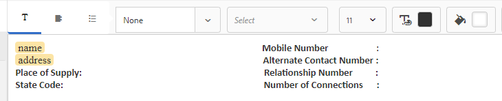

# Tutorial:Creación de fragmentos de documento{#tutorial-create-document-fragments}

Este tutorial es un paso en la [serie Crear una primera comunicación](/help/forms/using/create-your-first-interactive-communication.md) interactiva. Se recomienda seguir la serie en secuencia cronológica para comprender, realizar y demostrar el caso de uso completo del tutorial.

Los fragmentos de documento son componentes reutilizables de una correspondencia que se utilizan para componer una comunicación interactiva. Los fragmentos de documento son de los siguientes tipos:

* Texto: un recurso de texto es un fragmento de contenido que consta de uno o varios párrafos de texto. Un párrafo puede ser estático o dinámico.
* Lista: Lista es un grupo de fragmentos de documento, incluidos texto, listas, condiciones e imágenes.
* Condición: las condiciones permiten definir qué contenido se incluye en la comunicación interactiva en función de los datos recibidos del modelo de datos de formulario.

Este tutorial lo acompaña a través de los pasos para crear varios fragmentos de documentos de texto basados en la anatomía proporcionada en la sección [Planificar la comunicación](/help/forms/using/planning-interactive-communications.md) interactiva. Al final de este tutorial, podrá:

* Creación de fragmentos de documento
* Crear variables
* Crear y aplicar reglas

A continuación se muestra la lista de fragmentos de documento creados en este tutorial:

* [Detalles de la factura](../../forms/using/create-document-fragments.md#step-create-bill-details-text-document-fragment)
* [Detalles del cliente](../../forms/using/create-document-fragments.md#step-create-customer-details-text-document-fragment)
* [Resumen de la factura](../../forms/using/create-document-fragments.md#step-create-bill-summary-text-document-fragment)
* [Resumen de los cargos](../../forms/using/create-document-fragments.md#step-create-summary-of-charges-text-document-fragment)

Cada fragmento de documento incluye campos con texto estático, datos recibidos del modelo de datos de formulario y datos introducidos mediante la interfaz de usuario del agente. Todos estos campos se han descrito en la sección [Planificar la comunicación](/help/forms/using/planning-interactive-communications.md) interactiva.

Al crear fragmentos de documento en este tutorial, se crean variables para campos que reciben datos mediante la interfaz de usuario del agente.

Utilice **FDM_Create_First_IC**, tal como se describe en la sección [Crear modelo](../../forms/using/create-form-data-model0.md) de datos de formulario, como modelo de datos de formulario para crear fragmentos de documento en este tutorial.

## Paso 1: Crear fragmento de documento de texto Detalles de factura {#step-create-bill-details-text-document-fragment}

El fragmento de documento Detalles de la factura incluye los siguientes campos:

| Campo | Fuente de datos |
|---|---|
| Nº de factura | IU del agente |
| Período de facturación | IU del agente |
| Fecha de facturación | IU del agente |
| Su plan | Modelo de datos de formulario |

Ejecute los siguientes pasos para crear variables para campos con la interfaz de usuario del agente como origen de datos, crear texto estático y utilizar elementos del modelo de datos de formulario en el fragmento de documento:

1. Seleccione **Formularios** > Fragmentos **de documento**.

1. Seleccione **Crear** > **Texto**.
1. Especifique la siguiente información:

   1. Introduzca **bill_details_first_ic** como nombre en el campo **Título** . El título se rellena automáticamente en el campo **Nombre** .

   1. Seleccione Modelo **de datos de formulario** en la sección Modelo **de** datos.

   1. Seleccione **FDM_Create_First_IC** como modelo de datos de formulario y toque **Seleccionar**.

   1. Puntee **Siguiente**.

1. Seleccione la ficha **Variables** en el panel izquierdo y toque **Crear**.
1. En la sección **Crear variable** :

   1. Introduzca **el número** de invocación como nombre de la variable.
   1. Seleccione **Cadena** como tipo.
   1. Toque **Crear**.
   

   Repita los pasos 4 y 5 para crear las siguientes variables:

   * Billperiod: Tipo de cadena
   * FechaFacturación: Tipo de fecha
   

1. Cree texto estático para los campos siguientes utilizando el panel derecho:

   * Nº de factura
   * Período de facturación
   * Fecha de facturación
   * Su plan
   

1. Coloque el cursor junto al campo No **de** factura y haga doble clic en la variable **NúmeroDeFactura** desde la ficha **Variables** del panel izquierdo.
1. Coloque el cursor junto al campo Período **de** facturación y haga doble clic en la variable **Período** de facturación.
1. Coloque el cursor junto al campo Fecha **de** facturación y haga doble clic en la variable Fecha **de** facturación.
1. Seleccione la ficha Objetos **del modelo de** datos en el panel izquierdo.
1. Coloque el cursor junto al campo **Su plan** y haga doble clic en la propiedad **client** > **customerplan** .

   

1. Haga clic en **Guardar** para crear el fragmento de documento de texto Detalles de la factura.

## Paso 2: Crear fragmento de documento de texto Detalles del cliente {#step-create-customer-details-text-document-fragment}

El fragmento de documento Detalles del cliente incluye los siguientes campos:

| Campo | Fuente de datos |
|---|---|
| Nombre del cliente | Modelo de datos de formulario |
| Dirección | Modelo de datos de formulario |
| Lugar de suministro | IU del agente |
| Código de estado | IU del agente |
| Número de móvil | Modelo de datos de formulario |
| Número de contacto alternativo | Modelo de datos de formulario |
| Número de relación | Modelo de datos de formulario |
| Número de conexiones | IU del agente |

Ejecute los siguientes pasos para crear variables para campos con la interfaz de usuario del agente como origen de datos, crear texto estático y utilizar elementos del modelo de datos de formulario en el fragmento de documento:

1. Seleccione **Formularios** > Fragmentos **de documento**.
1. Seleccione **Crear** > **Texto**.
1. Especifique la siguiente información:

   1. Introduzca **customer_details_first_ic** como nombre en el campo **Título** . El título se rellena automáticamente en el campo **Nombre** .

   1. Seleccione Modelo **de datos de formulario** en la sección Modelo **de** datos.

   1. Seleccione **FDM_Create_First_IC** como modelo de datos de formulario y toque **Seleccionar**.

   1. Puntee **Siguiente**.

1. Seleccione la ficha **Variables** en el panel izquierdo y toque **Crear**.
1. En la sección **Crear variable** :

   1. Introduzca **Placesupply** como nombre de la variable.
   1. Seleccione **Cadena** como tipo.
   1. Toque **Crear**.
   Repita los pasos 4 y 5 para crear las siguientes variables:

   * Código de estado: Tipo de número
   * Numeradores: Tipo de número

1. Seleccione la ficha Objetos **del modelo de** datos, coloque el cursor en el panel derecho y haga doble clic en la propiedad **client** > **name** .
1. Pulse Intro para mover el cursor a la línea siguiente y haga doble clic en la propiedad **customer** > **address** .
1. Cree texto estático para los campos siguientes utilizando el panel derecho:

   * Número de móvil
   * Número de contacto alternativo
   * Lugar de suministro
   * Número de relación
   * Código de estado
   * Número de conexiones
   

1. Coloque el cursor junto al campo Número **** móvil y haga doble clic en la propiedad **cliente** > **mobilenum** .
1. Coloque el cursor junto al campo Número **de contacto** alternativo y haga doble clic en la propiedad** cliente** > **alternatemobilenumber** .
1. Coloque el cursor junto al campo Número **de** relación y haga doble clic en la propiedad **client** > **relation number** .
1. Seleccione la ficha **Variables** , coloque el cursor junto al campo **Lugar de suministro** y haga doble clic en la variable **Colocación** .
1. Coloque el cursor junto al campo Código **de** estado y haga doble clic en la variable **Código de estado** .
1. Coloque el cursor junto al campo **Número de conexiones** y haga doble clic en la variable **Numeración** .

   

1. Haga clic en **Guardar** para crear el fragmento de documento de texto Detalles del cliente.

## Paso 3: Crear fragmento de documento de texto Resumen de factura {#step-create-bill-summary-text-document-fragment}

El fragmento de documento Resumen de factura incluye los siguientes campos:

| Campo | Fuente de datos |
|---|---|
| Saldo anterior | IU del agente |
| Pagos | IU del agente |
| Ajustes | IU del agente |
| Cargos en el período de facturación actual | Modelo de datos de formulario |
| Importe pendiente | IU del agente |
| Fecha de vencimiento | IU del agente |

Ejecute los siguientes pasos para crear variables para campos con la interfaz de usuario del agente como origen de datos, crear texto estático y utilizar elementos del modelo de datos de formulario en el fragmento de documento:

1. Seleccione **Formularios** > Fragmentos **de documento**.
1. Seleccione **Crear** > **Texto**.
1. Especifique la siguiente información:

   1. Introduzca **bill_summary_first_ic** como nombre en el campo **Título** . El título se rellena automáticamente en el campo **Nombre** .

   1. Seleccione Modelo **de datos de formulario** en la sección Modelo **de** datos.

   1. Seleccione **FDM_Create_First_IC** como modelo de datos de formulario y toque **Seleccionar**.

   1. Puntee **Siguiente**.

1. Seleccione la ficha **Variables** en el panel izquierdo y toque **Crear**.
1. En la sección **Crear variable** :

   1. Introduzca **Anteriormente Balance** como nombre de la variable.
   1. Seleccione **Número** como tipo.
   1. Toque **Crear**.
   Repita los pasos 4 y 5 para crear las siguientes variables:

   * Pagos: Tipo de número
   * Ajustes: Tipo de número
   * Importe vencido: Tipo de número
   * Duedate: Tipo de fecha

1. Cree texto estático para los campos siguientes utilizando el panel derecho:

   * Saldo anterior
   * Pagos
   * Ajustes
   * Cargos en el período de facturación actual
   * Importe pendiente
   * Fecha de vencimiento
   * Los cargos por demora en el pago después de la fecha de vencimiento son de $ 20
   

1. Coloque el cursor junto al campo Saldo **** anterior y haga doble clic en la variable **Saldo** anterior.
1. Coloque el cursor junto al campo **Pagos** y haga doble clic en la variable **Pagos** .
1. Coloque el cursor junto al campo **Ajustes** y haga doble clic en la variable **Ajustes** .
1. Coloque el cursor junto al campo **Importe Vencido** y haga doble clic en la variable **Importe** .
1. Coloque el cursor junto al campo Fecha **de** vencimiento y haga doble clic en la variable **Duedate** .
1. Seleccione la ficha Objetos **del modelo de** datos, coloque el cursor junto al campo Período **de facturación actual** Cargos en el panel derecho y haga doble clic en la propiedad **facturas** > **cobros** de uso.

   

1. Haga clic en **Guardar** para crear el fragmento de documento de texto Detalles del cliente.

## Paso 4: Crear fragmento de documento de texto Resumen de cargos {#step-create-summary-of-charges-text-document-fragment}

El fragmento del documento Resumen de cargos incluye los siguientes campos:

| Campo | Fuente de datos |
|---|---|
| Cargos de llamadas | Modelo de datos de formulario |
| Cargos de llamada de conferencia | Modelo de datos de formulario |
| Gastos por SMS | Modelo de datos de formulario |
| Cargos por Internet móvil | Modelo de datos de formulario |
| Cargos de itinerancia nacionales | Modelo de datos de formulario |
| Cargos de itinerancia internacionales | Modelo de datos de formulario |
| Cargos por servicios de valor agregado | Modelo de datos de formulario |
| Cargos totales | Modelo de datos de formulario |
| TOTAL PAGABLE | Modelo de datos de formulario |

Siga estos pasos para crear texto estático y utilizar elementos del modelo de datos de formulario en el fragmento de documento:

1. Seleccione **Formularios** > Fragmentos **de documento**.
1. Seleccione **Crear** > **Texto**.
1. Especifique la siguiente información:

   1. Introduzca **summary_loads_first_ic** como nombre en el campo **Título** . El título se rellena automáticamente en el campo Nombre.

   1. Seleccione Modelo **de datos de formulario** en la sección Modelo **de** datos.

   1. Seleccione **FDM_Create_First_IC** como modelo de datos de formulario y toque **Seleccionar**.

   1. Puntee **Siguiente**.

1. Cree texto estático para los campos siguientes utilizando el panel derecho:

   * Cargos de llamadas
   * Cargos de llamada de conferencia
   * Gastos por SMS
   * Cargos por Internet móvil
   * Cargos de itinerancia nacionales
   * Cargos de itinerancia internacionales
   * Cargos por servicios de valor agregado
   * Cargos totales
   * TOTAL PAGABLE
   

1. Seleccione la ficha Objetos **del modelo** de datos.
1. Sitúe el cursor junto al campo Cargos **de** llamadas y haga doble clic en la propiedad **Facetas** > **Cargos** de llamadas.
1. Sitúe el cursor junto al campo Cargos **de llamada de** conferencia y haga doble clic en la propiedad **Billetes** > **cargos** fijos.
1. Coloque el cursor junto al campo Cargos **por** SMS y haga doble clic en la propiedad **efectos** > **smscargos** .
1. Sitúe el cursor junto al campo Cargos **por Internet** móvil y haga doble clic en la propiedad **Billetes** > **cargos** internos.
1. Coloque el cursor junto al campo Cargos **** Nacionales de Viaje y haga doble clic en las **facturas** > **propiedad nacional** itinerante.
1. Coloque el cursor junto al campo Cargos **itinerantes** internacionales y haga doble clic en las **facturas** > **propiedad roamingintnl** .
1. Coloque el cursor junto al campo Cargos **de servicios de** valor agregado y haga doble clic en la propiedad **efectos** > **lienzo** .
1. Sitúe el cursor junto al campo Cargos **** totales y haga doble clic en la propiedad **Facetas** > **Cargos** de uso.
1. Coloque el cursor junto al campo **TOTAL PAGABLE** y haga doble clic en la propiedad **efectos** > **cobros** de uso.

   

1. Seleccione el texto en la fila Cargos **de servicios de** valor agregado y toque **Crear regla** para crear una condición basada en la cual se muestre la fila en la comunicación interactiva:
1. En la ventana emergente **Crear regla** :

   1. Seleccione Modelos **de datos y variables** y, a continuación, **facturas** > **cargas** de llamada.

   1. Seleccionar **es menor que** el operador.
   1. Seleccione **Número** e introduzca el valor como **60**.
   En función de esta condición, la fila Cargos de servicios de valor agregado solo se muestra si el valor del campo Cargos de llamadas es inferior a 60.

   

1. Haga clic en **Guardar** para crear el fragmento de documento de texto Resumen de cargos.
