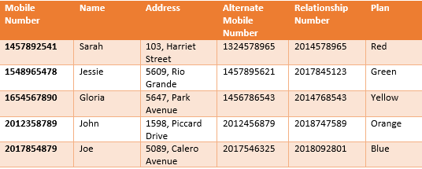
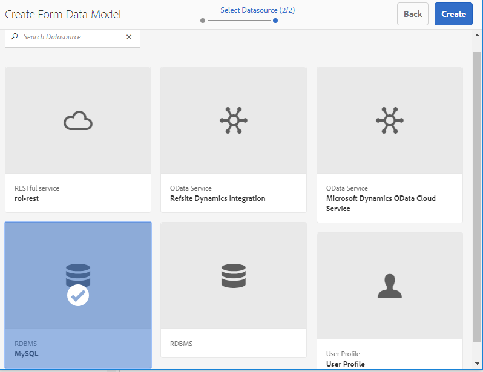
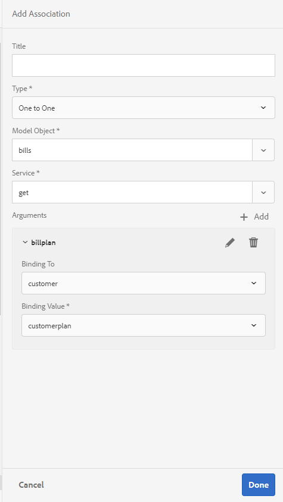
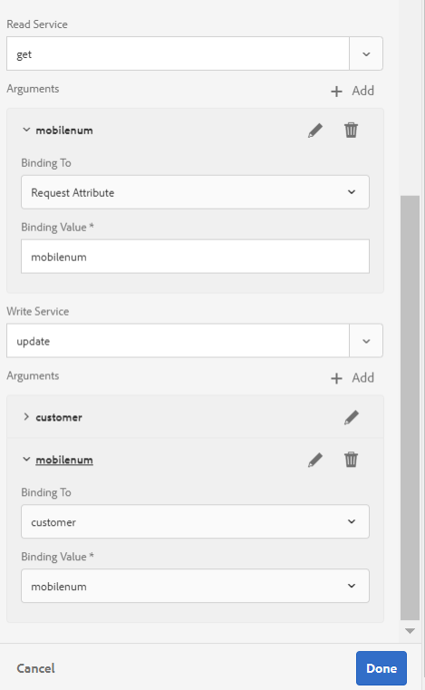
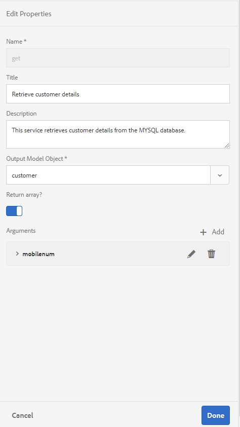

# Tutorial: Crear un modelo de datos de formulario{#tutorial-create-form-data-model}


Este tutorial es un paso en la serie [Crear su primera comunicación interactiva](/help/forms/using/create-your-first-interactive-communication.md). Se recomienda seguir la serie en orden cronológico para comprender, realizar y mostrar el caso de uso del tutorial completo.

## Información sobre el tutorial {#about-the-tutorial}

El módulo de integración de datos de AEM Forms le permite crear un modelo de datos de formulario a partir de fuentes de datos backend dispares, como un perfil de usuario de AEM, servicios web RESTful, servicios web basados en SOAP, servicios OData y bases de datos relacionales. Puede configurar objetos y servicios del modelo de datos en un modelo de datos de formulario y asociarlo a un formulario adaptable. Los campos de formularios adaptables están enlazados a las propiedades del objeto del modelo de datos. Los servicios permiten rellenar previamente el formulario adaptable y escribir los datos de formulario enviados en el objeto del modelo de datos.

Para obtener más información sobre la integración y el modelo de datos de formulario, consulte [Integración de datos de AEM Forms](https://helpx.adobe.com/es/experience-manager/6-3/forms/using/data-integration.html).

Este tutorial lo acompañará durante los pasos para preparar, crear, configurar y asociar un modelo de datos de formulario con una comunicación interactiva. Al final de este tutorial, podrá:

* [Configurar la base de datos](../../forms/using/create-form-data-model0.md#step-set-up-the-database)
* [Configurar la base de datos MySQL como fuente de datos](../../forms/using/create-form-data-model0.md#step-configure-mysql-database-as-data-source)
* [Crear un modelo de datos de formulario](../../forms/using/create-form-data-model0.md#step-create-form-data-model)
* [Configurar un modelo de datos de formulario](../../forms/using/create-form-data-model0.md#step-configure-form-data-model)
* [Probar un modelo de datos de formulario](../../forms/using/create-form-data-model0.md#step-test-form-data-model-and-services)

El modelo de datos de formulario tiene un aspecto similar al siguiente:


**A.** Fuentes de datos configuradas **B.** Esquemas de fuentes de datos **C.** Servicios disponibles **D.** Objetos del modelo de datos **E.** Servicios configurados

## Requisitos previos {#prerequisites}

Antes de empezar, asegúrese de que dispone de lo siguiente:

* Una base de datos MySQL con datos de ejemplo como se indica en la sección [Configurar la base de datos](../../forms/using/create-form-data-model0.md#step-set-up-the-database).
* Un paquete OSGi para el controlador JDBC MySQL como se explica en [Empaquetar un controlador de base de datos JDBC](https://helpx.adobe.com/es/experience-manager/6-3/help/sites-developing/jdbc.html#bundling-the-jdbc-database-driver)

## Paso 1: Configurar la base de datos {#step-set-up-the-database}

Una base de datos es esencial para crear una comunicación interactiva. Este tutorial utiliza una base de datos para mostrar el Modelo de datos de formulario y las capacidades de persistencia de las comunicaciones interactivas. Configurar una base de datos que contenga tablas de cliente, de facturas y de llamadas.
La siguiente imagen ilustra datos de ejemplo para la tabla de clientes:



Utilice la siguiente instrucción DDL para crear la tabla **cliente** en la base de datos.

```sql
CREATE TABLE `customer` (
   `mobilenum` int(11) NOT NULL,
   `name` varchar(45) NOT NULL,
   `address` varchar(45) NOT NULL,
   `alternatemobilenumber` int(11) DEFAULT NULL,
   `relationshipnumber` int(11) DEFAULT NULL,
   `customerplan` varchar(45) DEFAULT NULL,
   PRIMARY KEY (`mobilenum`),
   UNIQUE KEY `mobilenum_UNIQUE` (`mobilenum`)
 ) ENGINE=InnoDB DEFAULT CHARSET=utf8
```

Utilice la siguiente instrucción DDL para crear la tabla **facturas** en la base de datos.

```sql
CREATE TABLE `bills` (
   `billplan` varchar(45) NOT NULL,
   `latepayment` decimal(4,2) NOT NULL,
   `monthlycharges` decimal(4,2) NOT NULL,
   `billdate` date NOT NULL,
   `billperiod` varchar(45) NOT NULL,
   `prevbal` decimal(4,2) NOT NULL,
   `callcharges` decimal(4,2) NOT NULL,
   `confcallcharges` decimal(4,2) NOT NULL,
   `smscharges` decimal(4,2) NOT NULL,
   `internetcharges` decimal(4,2) NOT NULL,
   `roamingnational` decimal(4,2) NOT NULL,
   `roamingintnl` decimal(4,2) NOT NULL,
   `vas` decimal(4,2) NOT NULL,
   `discounts` decimal(4,2) NOT NULL,
   `tax` decimal(4,2) NOT NULL,
   PRIMARY KEY (`billplan`)
 ) ENGINE=InnoDB DEFAULT CHARSET=utf8
```

Utilice la siguiente instrucción DDL para crear la tabla **llamadas** en la base de datos.

```sql
CREATE TABLE `calls` (
   `mobilenum` int(11) DEFAULT NULL,
   `calldate` date DEFAULT NULL,
   `calltime` varchar(45) DEFAULT NULL,
   `callnumber` int(11) DEFAULT NULL,
   `callduration` varchar(45) DEFAULT NULL,
   `callcharges` decimal(4,2) DEFAULT NULL,
   `calltype` varchar(45) DEFAULT NULL
 ) ENGINE=InnoDB DEFAULT CHARSET=utf8
```

La tabla **llamadas** incluye los detalles de la llamada, como la fecha, la hora, el número, la duración y los gastos de las llamadas. La tabla **cliente** está vinculada a la tabla de llamadas mediante el campo Número móvil (mobilenum). Para cada número de móvil enumerado en la tabla **cliente**, hay varios registros en la tabla **llamadas**. Por ejemplo, puede recuperar los detalles de la llamada para el número de móvil **1457892541** si acude a la tabla **llamadas**.

La tabla **facturas** incluye los detalles de la factura, como la fecha y el período de la factura, los gastos mensuales y los gastos por llamadas. La tabla **cliente** está vinculada a la tabla **facturas** mediante el campo Plan de facturación. Hay un plan asociado a cada cliente en la tabla **cliente**. La tabla **facturas** incluye los detalles de los precios de todos los planes existentes. Por ejemplo, puede recuperar los detalles del plan para **Sarah** de la tabla **cliente** y utilizar estos detalles para recuperar los detalles de precios de la tabla **facturas**.

## Paso 2: Configurar la base de datos MySQL como fuente de datos {#step-configure-mysql-database-as-data-source}

Puede configurar distintos tipos de fuentes de datos para crear un modelo de datos de formulario. Para este tutorial, configurará la base de datos MySQL que está configurada y contiene datos de ejemplo. Para obtener información sobre otras fuentes de datos compatibles y cómo configurarlas, consulte [Integración de datos de AEM Forms](https://helpx.adobe.com/es/experience-manager/6-3/forms/using/data-integration.html).

Haga lo siguiente para configurar la base de datos MySQL:

1. Instale el controlador JDBC para la base de datos MySQL como un paquete OSGi:

   1. Inicie sesión en la instancia de autor de AEM Forms como administrador y vaya a los paquetes de la consola web de AEM. La dirección URL predeterminada es [https://localhost:4502/system/console/bundles](https://localhost:4502/system/console/bundles).
   1. Pulse **Instalar/actualizar**. Aparecerá el cuadro de diálogo **Cargar e instalar paquetes**.

   1. Pulse **Elegir archivo** para buscar y seleccionar el paquete OSGi del controlador JDBC de MySQL. Seleccione **Iniciar paquete** y **Actualizar paquetes** y pulse **Instalar** o **Actualizar**. Asegúrese de que el controlador JDBC de Oracle Corporation para MySQL esté activo. El controlador está instalado.

1. Configurar la base de datos MySQL como fuente de datos:

   1. Vaya a la consola web de AEM en [https://localhost:4502/system/console/configMgr](https://localhost:4502/system/console/configMgr).
   1. Localice la configuración **Apache Sling Connection Pooled DataSource**. Pulse para abrir la configuración en modo de edición.
   1. En el cuadro de diálogo de configuración, especifique los siguientes detalles:

      * **Nombre del Datasource:** puede especificar cualquier nombre. Por ejemplo, especifique **MySQL**.

      * **Nombre de propiedad del servicio DataSource**: especifique el nombre de la propiedad de servicio que contiene el nombre del DataSource. Se especifica al registrar la instancia de fuente de datos como servicio OSGi. Por ejemplo, **datasource.name**.

      * **Clase del controlador JDBC**: especifique el nombre de clase Java del controlador JDBC. Para la base de datos MySQL, especifique **com.mysql.jdbc.Driver**.

      * **URI de conexión JDBC**: especifique la dirección URL de conexión de la base de datos. Para la base de datos MySQL que se ejecuta en el puerto 3306 y en el esquema teleca, la URL es: `jdbc:mysql://'server':3306/teleca?autoReconnect=true&useUnicode=true&characterEncoding=utf-8`
      * **Nombre de usuario:** nombre de usuario de la base de datos. Debe permitir que el controlador JDBC establezca una conexión con la base de datos.
      * **Contraseña:** contraseña de la base de datos. Debe permitir que el controlador JDBC establezca una conexión con la base de datos.
      * **Probar en el préstamo:** habilita la opción **Probar en el préstamo**.

      * **Probar en la devolución:** habilita la opción **Probar en la devolución**.

      * **Consulta de validación:** especifica una consulta SQL SELECT para validar conexiones desde el grupo. La consulta debe devolver al menos una fila. Por ejemplo, **seleccione &#42; del cliente**.

      * **Aislamiento de transacciones**: establezca el valor en **READ_COMMITTED**.
   Deje las demás propiedades con los [valores](https://tomcat.apache.org/tomcat-7.0-doc/jdbc-pool.html) predeterminados  y pulse **Guardar**.

   Se creará una configuración similar a la siguiente.

   

## Paso 3: Crear un modelo de datos de formulario {#step-create-form-data-model}

AEM Forms proporciona una interfaz de usuario intuitiva para [crear un modo de datos de formulario](https://helpx.adobe.com/es/experience-manager/6-3/forms/using/data-integration.html#main-pars_header_1524967585) de fuentes de datos configuradas. Puede utilizar varias fuentes de datos en un modelo de datos de formulario. Para el caso de uso de este tutorial, utilizará MySQL como fuente de datos.

Para crear el modelo de datos de formulario, haga lo siguiente:

1. En la instancia de autor de AEM, navegue hasta **Formularios** > **Integraciones de datos**.
1. Pulse **Crear** > **Modelo de datos de formulario**.
1. En el asistente Crear un modelo de datos de formulario, especifique un **nombre** para el modelo de datos de formulario. Por ejemplo, **FDM_Create_First_IC**. Pulse **Siguiente**.
1. La pantalla Seleccionar fuente de datos enumera todas las fuentes de datos configuradas. Seleccione la fuente de datos **MySQL** y pulse **Crear**.

   

1. Haga clic en **Listo**. El modelo de datos de formulario **FDM_Create_First_IC** se ha creado.

## Paso 4: Configurar el modelo de datos de formulario {#step-configure-form-data-model}

La configuración del modelo de datos de formulario incluye lo siguiente:

* [Agregar objetos y servicios del modelo de datos](#add-data-model-objects-and-services)
* [Crear propiedades secundarias calculadas para el objeto del modelo de datos](#create-computed-child-properties-for-data-model-object)
* [Agregar asociaciones entre objetos del modelo de datos](#add-associations-between-data-model-objects)
* [Editar propiedades del objeto del modelo de datos](#edit-data-model-object-properties)
* [Configurar servicios para objetos del modelo de datos](#configure-services)

### Agregar objetos y servicios del modelo de datos {#add-data-model-objects-and-services}

1. En la instancia de autor de AEM, navegue hasta **Formularios** > **Integraciones de datos**. La dirección URL predeterminada es [https://localhost:4502/aem/forms.html/content/dam/formsanddocuments-fdm](https://localhost:4502/aem/forms.html/content/dam/formsanddocuments-fdm).
1. El modelo de datos de formulario **FDM_Create_First_IC** creado anteriormente se muestra aquí. Selecciónelo y pulse **Editar**.

   La fuente de datos seleccionada **MySQL** se muestra en el panel **Fuentes de datos**.

   

1. Expanda el árbol de fuentes de datos **MySQL**. Seleccione los siguientes objetos y servicios del modelo de datos del esquema **teleca**:

   * **Objetos del modelo de datos**:

      * facturas
      * llamadas
      * cliente
   * **Servicios:**

      * conseguir
      * actualizar

   Pulse **Agregar selección** para agregar los objetos y servicios seleccionados al modelo de datos de formulario.

   

   Los objetos del modelo de datos de facturas, llamadas y clientes se muestran en el panel derecho de la pestaña **Modelo**. Los servicios conseguir y actualizar se muestran en la pestaña **Servicios**.

   

### Crear propiedades secundarias calculadas para el objeto del modelo de datos {#create-computed-child-properties-for-data-model-object}

Una propiedad calculada es aquella cuyo valor se calcula en función de una regla o una expresión. Con una regla, puede establecer el valor de una propiedad calculada en una cadena literal, un número, el resultado de una expresión matemática o el valor de otra propiedad en el modelo de datos del formulario.

En función del caso de uso, cree la propiedad informática secundaria **usagecharges** en el objeto del modelo de datos **facturas** mediante la siguiente expresión matemática:

* gastos de uso = gastos por llamada + gastos por llamada de conferencia + gastos por SMS + gastos por Internet móvil + itinerancia nacional + internacional + VAS (todas estas propiedades existen en el objeto del modelo de datos Facturas) Para obtener más información sobre la propiedad informática secundaria **usagecharges**, consulte [Planificar la comunicación interactiva](/help/forms/using/planning-interactive-communications.md).

Ejecute los siguientes pasos para crear propiedades informáticas secundarias para el objeto del modelo de datos Facturas:

1. Seleccione la casilla de verificación en la parte superior del objeto del modelo de datos **facturas** para seleccionarlo y pulse **Crear propiedad secundaria**.
1. En el panel **Crear propiedad secundaria**:

   1. Escriba **usagecharges** como nombre de la propiedad secundaria.
   1. Habilite **Informatizado**.
   1. Seleccione **Flotante** como tipo y pulse **Listo** para agregar la propiedad secundaria al objeto del modelo de datos **facturas**.

   

1. Pulse **Editar regla** para abrir el Editor de reglas.
1. Pulse **Crear**. Se abre la ventana de la regla **Establecer valor**.
1. En la lista desplegable Seleccionar opción, elija **Expresión matemática**.

   

1. En la expresión matemática, seleccione **callcharges** y **confcallcharges** en los objetos primero y segundo, respectivamente. Seleccione **más** como operador. Pulse dentro de la expresión matemática y pulse **Extender expresión** para agregar los objetos **smscharges**, **internetcharges**, **roamingnational**, **roamingintnl** y **vas** a la expresión.

   La siguiente imagen representa la expresión matemática en el editor de reglas:

   

1. Pulse **Listo**. La regla se crea en el Editor de reglas.
1. Pulse **Cerrar** para cerrar la ventana Editor de reglas.

### Agregar asociaciones entre objetos del modelo de datos {#add-associations-between-data-model-objects}

Una vez definidos los objetos del modelo de datos, puede crear asociaciones entre ellos. La asociación puede ser de uno a uno o de uno a varios. Por ejemplo, puede haber varios dependientes asociados a un empleado. Se denomina asociación uno a varios y se representa con 1:n en la línea que conecta los objetos del modelo de datos asociados. Sin embargo, si una asociación devuelve un nombre de empleado único para un ID de empleado determinado, se denomina asociación uno a uno.

Cuando se agregan objetos del modelo de datos asociados en una fuente de datos a un modelo de datos de formulario, sus asociaciones se retienen y se muestran como conectadas mediante líneas de flecha.

En función del caso de uso, cree las siguientes asociaciones entre los objetos del modelo de datos:

| Asociación | Objetos del modelo de datos |
|---|---|
| 1:n | customer:calls (se pueden asociar varias llamadas a un cliente en una factura mensual) |
| 1:1 | customer:bills (una factura está asociada a un cliente para un mes en particular) |

Siga estos pasos para crear asociaciones entre objetos del modelo de datos:

1. Seleccione la casilla de verificación de la parte superior del objeto del modelo de datos **cliente** para seleccionarlo y pulse **Agregar asociación**. Se abrirá el panel de propiedades de **Agregar asociación**.
1. En el panel **Agregar asociación**:

   * Especifique un título para la asociación. Es un campo opcional.
   * Seleccione **Uno a varios** de la lista desplegable **Tipo**.

   * Seleccione **llamadas** de la lista desplegable **Objeto del modelo**.

   * Seleccione **conseguir** de la lista desplegable **Servicio**.

   * Pulse **Agregar** para vincular el objetos del modelo de datos **cliente** al objeto del modelo de datos **llamadas** mediante una propiedad. En función del caso de uso, el objeto del modelo de datos de llamadas debe estar vinculado a la propiedad número móvil del objeto del modelo de datos del cliente. Se abrirá el cuadro de diálogo **Agregar argumento**.

   

1. En el cuadro de diálogo **Agregar argumento**:

   * Seleccione **mobilenum** de la lista desplegable **Nombre**. La propiedad Número móvil es una propiedad común que está disponible en los objetos del modelo de datos Cliente y Llamadas. Como resultado, se utiliza para crear una asociación entre los objetos del modelo de datos Cliente y Llamadas.
Para cada número móvil disponible en el objeto del modelo de datos Cliente, hay varios registros de llamada disponibles en la tabla Llamadas.

   * Especifique un título y una descripción opcionales para el argumento.
   * Seleccione **cliente** de la lista desplegable **Enlace a**.

   * Seleccione **mobilenum** de la lista desplegable **Valor de enlace**.

   * Pulse **Agregar**.

   

   La propiedad mobilenum se muestra en la sección **Argumentos**.

   

1. Pulse **Listo** para crear una asociación 1:n entre los objetos del modelo de datos Cliente y Llamadas.

   Una vez que haya creado una asociación entre los objetos del modelo de datos Cliente y Llamadas, cree una asociación 1:1 entre los objetos del modelo de datos Cliente y Facturas.

1. Seleccione la casilla de verificación de la parte superior del objeto del modelo de datos **cliente** para seleccionarlo y pulse **Agregar asociación**. Se abrirá el panel de propiedades de **Agregar asociación**.
1. En el panel **Agregar asociación**:

   * Especifique un título para la asociación. Es un campo opcional.
   * Seleccione **Uno a uno** de la lista desplegable **Tipo**.

   * Seleccione **facturas** de la lista desplegable **Objeto del modelo**.

   * Seleccione **conseguir** de la lista desplegable **Servicio**. La propiedad **billplan**, que es la clave principal de la tabla Facturas, ya está disponible en la sección **Argumentos**.
Los objetos del modelo de datos Facturas y Cliente se vinculan mediante las propiedades billplan (facturas) y customerplan (cliente), respectivamente. Cree un enlace entre estas propiedades para recuperar los detalles del plan para cualquier cliente disponible en la base de datos MySQL.

   * Seleccione **cliente** de la lista desplegable **Enlace a**.

   * Seleccione **customerplan** de la lista desplegable **Valor de enlace**.

   * Pulse **Listo** para crear un enlace entre las propiedades billplan y customerplan.

   

   La siguiente imagen muestra las asociaciones entre los objetos del modelo de datos y las propiedades utilizadas para crear asociaciones entre ellos:

   

### Editar propiedades del objeto del modelo de datos {#edit-data-model-object-properties}

Después de crear asociaciones entre Cliente y otros objetos del modelo de datos, edite las propiedades de Cliente para definir la propiedad en función de la cual se recuperarán los datos del objeto del modelo de datos. En función del caso de uso, Número móvil se utiliza como propiedad para recuperar datos del objeto del modelo de datos Cliente.

1. Seleccione la casilla de verificación de la parte superior del objeto del modelo de datos **cliente** para seleccionarlo y pulse **Editar propiedades**. Se abrirá el panel **Editar propiedades**.
1. Especifique **cliente** como el **Objeto del modelo de nivel superior**.
1. Seleccione **obtener** de la lista desplegable **Leer servicio**.
1. En la sección **Argumentos**:

   * Seleccione **Solicitar atributo** de la lista desplegable **Enlace a**.

   * Especifique **mobilenum** como valor de enlace.

1. Seleccione **actualizar** de la lista desplegable **Escribir servicio**.
1. En la sección **Argumentos**:

   * Para la propiedad **mobilenum**, seleccione **cliente** de la lista desplegable **Enlace a**.

   * Seleccione **mobilenum** de la lista desplegable **Valor de enlace**.

1. Pulse **Listo** para guardar las propiedades.

   

1. Seleccione la casilla de verificación de la parte superior del objeto del modelo de datos **llamadas** para seleccionarlo y pulse **Editar propiedades**. Se abrirá el panel **Editar propiedades**.
1. Desactive el **Objeto del modelo de nivel superior** para el objeto del modelo de datos **llamadas**.
1. Pulse **Listo**.

   Repita los pasos 8 a 10 para configurar las propiedades del objeto del modelo de datos **facturas**.

### Configurar servicios {#configure-services}

1. Vaya a la pestaña **Servicios**.
1. Seleccione el servicio **conseguir** y pulse **Editar propiedades**. Se abrirá el panel **Editar propiedades**.
1. En el panel **Editar propiedades**:

   * Escriba un título y una descripción opcionales.
   * Seleccione **cliente** de la lista desplegable **Objeto del modelo de salida**.

   * Pulse **Listo** para guardar las propiedades.

   

1. Seleccione el servicio **actualizar** y pulse **Editar propiedades**. Se abrirá el panel **Editar propiedades**.
1. En el panel **Editar propiedades**:

   * Escriba un título y una descripción opcionales.
   * Seleccione **cliente** de la lista desplegable **Objeto del modelo de entrada**.

   * Pulse **Listo**.
   * Pulse **Guardar** para guardar el modelo de datos de formulario.

   

## Paso 5: Probar el modelo y los servicios de datos de formulario {#step-test-form-data-model-and-services}

Puede probar el objeto y los servicios del modelo de datos para comprobar que está configurado correctamente.

Haga lo siguiente para ejecutar la prueba:

1. Vaya a la pestaña **Modelo**, seleccione el objeto del modelo de datos **cliente** y pulse **Probar objeto del modelo**.
1. En la ventana **Probar el modelo de datos de formulario**, seleccione **Leer objeto del modelo** de la lista desplegable **Seleccionar modelo/servicio**.
1. En la sección **Entrada**, especifique un valor para la propiedad **mobilenum** que existe en la base de datos MySQL configurada y pulse **Probar**.

   Los detalles del cliente asociados con la propiedad mobilenum especificada se recuperarán y se mostrarán en la sección Salida como se muestra a continuación. Cierre el cuadro de diálogo.

   

1. Vaya a la pestaña **Servicios**.
1. Seleccione el servicio **obtener** y pulse **Probar servicio**
1. En la sección **Entrada**, especifique un valor para la propiedad **mobilenum** que existe en la base de datos MySQL configurada y pulse **Probar**.

   Los detalles del cliente asociados con la propiedad mobilenum especificada se recuperarán y se mostrarán en la sección Salida como se muestra a continuación. Cierre el cuadro de diálogo.

   

### Editar y guardar datos de ejemplo {#edit-and-save-sample-data}

El editor del modelo de datos de formulario permite generar datos de ejemplo para todas las propiedades de objetos del modelo de datos, incluidas las propiedades calculadas, en un modelo de datos de formulario. Es un conjunto de valores aleatorios que cumplen con el tipo de datos configurado para cada propiedad. También puede editar y guardar datos, que se conservan incluso si se regeneran los datos de ejemplo.

Para generar, editar y guardar datos de ejemplo, haga lo siguiente:

1. En la página del modelo de datos de formulario, pulse **Editar datos de ejemplo**. Genera y muestra los datos de ejemplo en la ventana Editar datos de ejemplo.

   

1. En la ventana **Editar datos de ejemplo**, edite los datos, según sea necesario, y pulse **Guardar**. Cierre la ventana.
