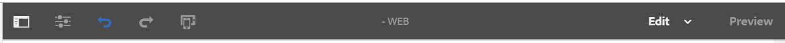
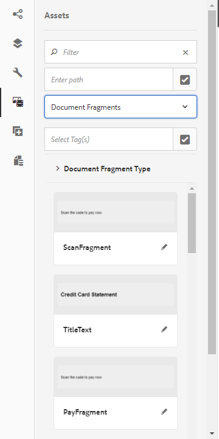
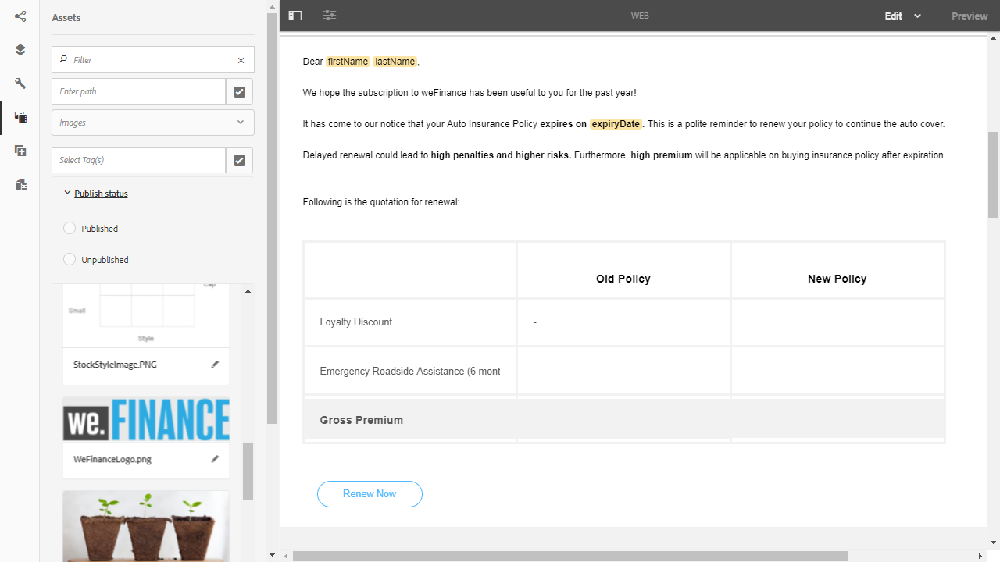
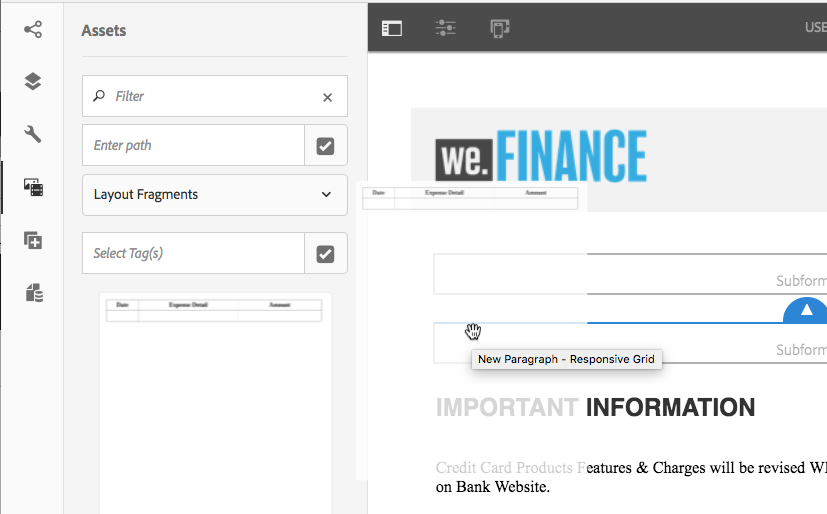
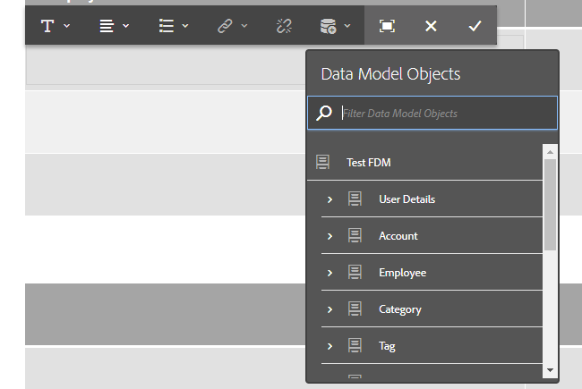
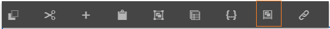

# Crear una comunicación interactiva{#create-an-interactive-communication}

## Información general {#overview}

Interactive Communications centraliza y administra la creación, el ensamblaje y la entrega de correspondencia personalizada e interactiva. Utilice la impresión como canal maestro para la web, puede minimizar la duplicación de esfuerzos al crear la salida web de la comunicación interactiva.

### Requisitos previos {#prerequisites}

Los siguientes son los requisitos previos para crear una comunicación interactiva:

* Configure un [Modelo de datos de formulario](/help/forms/using/data-integration.md) que contenga datos de prueba o con un origen de datos real, como una instancia de Microsoft® Dynamics.
* Asegúrese de que tiene los [fragmentos de documento](/help/forms/using/document-fragments.md).
* Asegúrese de que tiene [Plantillas para impresión y canal web](/help/forms/using/web-channel-print-channel.md).
* Asegúrese de que tiene el [tema](/help/forms/using/themes.md) requerido para el canal web.

## Crear comunicación interactiva {#createic}

1. Inicie sesión en la instancia de autor de AEM y vaya a **[!UICONTROL Adobe Experience Manager]** > **[!UICONTROL Forms]** > **[!UICONTROL Forms &amp; Documents]**.
1. Pulse **[!UICONTROL Crear]** y seleccione **[!UICONTROL Comunicación interactiva]**. Aparece la página Crear comunicación interactiva .

   

1. Indique la siguiente información. :

   * **[!UICONTROL Título]**: Introduzca el título de la comunicación interactiva.
   * **[!UICONTROL Nombre]**: El nombre de la comunicación interactiva se deriva del título que introduzca. Edítela si es necesario.
   * **[!UICONTROL Descripción]**: Introduzca una descripción sobre la comunicación interactiva.
   * **[!UICONTROL Modelo]** de datos de formulario: Busque y seleccione el modelo de datos de formulario. Para obtener más información sobre el Modelo de datos de formulario, consulte [Integración de datos de AEM Forms](/help/forms/using/data-integration.md).

   * **[!UICONTROL Servicio de precarga]**: Seleccione el servicio de rellenado previo para recuperar los datos y rellenar previamente la comunicación interactiva.
   * **[!UICONTROL Tipo]** de proceso posterior: Puede seleccionar AEM flujo de trabajo o Forms que se activará cuando se envíe la comunicación interactiva. Seleccione el tipo de flujo de trabajo que desea activar.

   * **[!UICONTROL Proceso]** posterior: Seleccione el nombre del flujo de trabajo que desea activar. Cuando seleccione AEM flujo de trabajo, indique la ruta de acceso del archivo adjunto, la ruta de diseño, la ruta del PDF, la ruta de datos de impresión y la ruta de datos web.
   * **[!UICONTROL Etiquetas]**: Seleccione las etiquetas que desea aplicar a la comunicación interactiva. También puede escribir un nombre de etiqueta nuevo/personalizado y pulsar Intro para crearlo.
   * **[!UICONTROL Autor]**: el nombre del autor se toma automáticamente del nombre de usuario del usuario que ha iniciado sesión.
   * **[!UICONTROL Fecha de publicación:]** introduzca la fecha para publicar la comunicación interactiva.
   * **[!UICONTROL Fecha de cancelación de publicación]**: Introduzca la fecha para cancelar la publicación de la comunicación interactiva.

1. Toque **[!UICONTROL Siguiente]**. Aparecerá la pantalla para especificar los detalles de los canales web y de impresión.
1. Introduzca lo siguiente:

   * **[!UICONTROL Imprimir]**: Seleccione esta opción para generar el canal de impresión de la comunicación interactiva.
   * **[!UICONTROL Imprimir plantilla]**: Busque y seleccione un XDP como plantilla de impresión.
   * **[!UICONTROL Web]**: Seleccione esta opción para generar el canal web o la salida interactiva de la comunicación interactiva.
   * **[!UICONTROL Plantilla]** web de comunicación interactiva: Busque y seleccione la plantilla web .
   * **** Tema y  **[!UICONTROL seleccione tema]**: Busque y seleccione el tema para darle estilo al canal web de la comunicación interactiva. Para obtener más información, consulte [Temas en AEM Forms](/help/forms/using/themes.md).

   * **[!UICONTROL Usar Imprimir como maestro para el canal]** web: Seleccione esta opción para crear el canal web sincronizado con el canal de impresión. El uso del canal de impresión como maestro para el canal web garantiza que el contenido y el enlace de datos del canal web se deriven del canal de impresión y que los cambios realizados en el canal de impresión se reflejen en el canal web al pulsar Sincronizar. Sin embargo, se permite a los autores romper la herencia de componentes específicos del canal web, según sea necesario. Para obtener más información, consulte [Sincronizar canal web con canal de impresión](../../forms/using/create-interactive-communication.md#synchronize).
Si selecciona la opción **[!UICONTROL Usar Imprimir como maestro para el canal web]**, puede seleccionar cualquiera de los siguientes modos para generar el canal web:

      * **[!UICONTROL Diseño]** automático: Seleccione este modo para generar automáticamente marcadores de posición, contenido y enlace de datos para el canal web desde el canal de impresión.
      * **[!UICONTROL Organizar manualmente]**: Seleccione este modo para seleccionar manualmente y añadir elementos de canal de impresión al canal web mediante el contenido maestro disponible en la  **[!UICONTROL pestaña]** Fuente de datos . Para obtener más información, consulte [Seleccionar elementos de canal de impresión para crear contenido de canal web](#selectprintchannelelements).

   Para obtener más información sobre el canal de impresión y el canal web, consulte [Canal de impresión y canal web](/help/forms/using/web-channel-print-channel.md).

1. Toque **[!UICONTROL Crear]**. Se crea la comunicación interactiva y aparece un cuadro de alerta. Pulse **[!UICONTROL Editar]** para comenzar a crear el contenido de la comunicación interactiva, tal como se explica en [Añadir contenido utilizando la interfaz de usuario de creación de comunicación interactiva](#step2). Como alternativa, puede pulsar **[!UICONTROL Listo]** y elegir editar la comunicación interactiva más adelante.

## Añadir contenido a la comunicación interactiva {#step2}

Después de crear una comunicación interactiva, puede utilizar la interfaz de creación de comunicación interactiva para crear su contenido.

Para obtener más información sobre la interfaz de creación de comunicaciones interactivas, consulte [Introducción a la creación de comunicaciones interactivas](/help/forms/using/introduction-interactive-communication-authoring.md).

1. La interfaz de creación de comunicaciones interactivas se inicia al pulsar Editar como se menciona en [Crear comunicación interactiva](#createic). Como alternativa, puede navegar a un recurso de comunicación interactiva existente en AEM, seleccionarlo y pulsar **[!UICONTROL Editar]** para iniciar la interfaz de creación de comunicación interactiva.

   De forma predeterminada, aparece el canal de impresión de la comunicación interactiva, a menos que la comunicación interactiva sea solo de canal web. El canal de impresión de la comunicación interactiva muestra las áreas de destino, tal como están disponibles en la plantilla de canal de impresión/XDP seleccionada. En estas áreas y campos de destino, puede añadir componentes o recursos.

1. Con el canal Imprimir seleccionado, seleccione la pestaña **[!UICONTROL Componentes]**. Los siguientes componentes están disponibles en el canal de impresión:

   | **Componente** | **Funcionalidad** |
   |---|---|
   | Gráfico | Agrega un gráfico que se puede usar en Comunicación interactiva para la representación visual de datos bidimensionales recuperados de una colección de modelos de datos de formulario. Para obtener más información, consulte [Uso de gráficos en Interactive Communications](/help/forms/using/chart-component-interactive-communications.md). |
   | Fragmento de documento | Permite añadir un componente reutilizable, como texto, lista o condición, a una comunicación interactiva. El componente añadido puede estar basado en el modelo de datos de formulario o sin un modelo de datos de formulario. |
   | Imagen | Permite insertar una imagen. |

   Arrastre y suelte los componentes en la comunicación interactiva y configúrelos según sea necesario.

   También puede utilizar las operaciones de deshacer y rehacer mientras crea una comunicación interactiva para los canales de impresión y web.

   Utilice la operación de deshacer para descartar la última acción realizada y la operación de rehacer para incorporar de nuevo la acción descartada. Por ejemplo, si ha insertado una imagen o ha creado un enlace de datos en una comunicación interactiva y necesita descartarlo, utilice la operación Deshacer.

   

   Las opciones Deshacer y Rehacer se muestran en la barra de herramientas de la página IU de creación. La opción Deshacer solo se muestra después de realizar una acción. La opción Rehacer se muestra en la barra de herramientas de la página solo después de realizar una operación de deshacer. Estas acciones se restablecen al actualizar la página.

1. Con el canal de impresión seleccionado, vaya a la pestaña **[!UICONTROL Assets]** y aplique el filtro para mostrar solo los recursos que desee ver.

   Con el navegador Recursos, también puede arrastrar y soltar recursos directamente en las áreas de destino de Comunicación interactiva.

   

1. Arrastre y suelte los fragmentos del documento en la comunicación interactiva. A continuación se muestran los tipos de fragmentos de documento que puede utilizar en el canal de impresión de la comunicación interactiva.

<table>
 <tbody>
  <tr>
   <td><strong>Tipo de fragmento de documento</strong></td>
   <td><strong>Ejemplo de propósito</strong></td>
  </tr>
  <tr>
   <td><a href="/help/forms/using/texts-interactive-communications.md" target="_blank">Texto</a></td>
   <td>Texto para añadir dirección, correo electrónico del destinatario y texto del cuerpo de la carta </td>
  </tr>
  <tr>
   <td><a href="/help/forms/using/conditions-interactive-communications.md" target="_blank">Condición</a></td>
   <td>Condición para agregar la imagen de encabezado adecuada a la comunicación en función del tipo de directiva: Standard o Premium.   </td>
  </tr>
  <tr>
   <td>Lista</td>
   <td>Grupo de fragmentos de documento, incluyendo texto, condiciones, otras listas e imágenes.   </td>
  </tr>
 </tbody>
</table>

También puede reemplazar el enlace entre un área de destino y un fragmento de documento soltando el nuevo fragmento en el área de destino mediante la pestaña **[!UICONTROL Assets]**. El sombreado de color azul del área de destino mientras arrastra el fragmento indica que el fragmento del documento se puede soltar en el área de destino.

Para obtener más información sobre los fragmentos de documento, consulte [Fragmentos de documento](/help/forms/using/document-fragments.md).

La interfaz de creación permite distinguir entre los campos independientes y enlazados y las variables dentro de una comunicación interactiva. La interfaz resalta los campos y las variables independientes mediante un borde naranja.

Además, cuando pasa el ratón sobre estos elementos, se muestra una información de objeto con el mensaje Campo (sin consolidar) o Variable (sin enlazar).

Es posible que en ocasiones no se muestre una variable independiente utilizada en un fragmento de documento en la interfaz de creación. Puede deberse a una regla de texto en línea dentro de un fragmento de documento o en el caso de un fragmento de condición. En estos casos, la información de objeto, resaltada en azul, se muestra como parte del fragmento de documento. La información sobre herramientas muestra el número de variables independientes utilizadas dentro de un fragmento de documento.

Pulse el fragmento de documento, pulse  (Configurar) y, a continuación, pulse **[!UICONTROL Propiedades]** en la barra de tareas de la comunicación interactiva. La sección **[!UICONTROL Variables y objetos del modelo de datos]** enumera las variables, incluidas las variables ocultas y los objetos del modelo de datos utilizados en los fragmentos del documento. Utilice el icono  (Editar) junto a cada objeto o variable del modelo de datos para editar las propiedades.

1. Para configurar el enlace de variables, pulse una variable, seleccione  (Configure) y, a continuación, configure las propiedades de enlace en el panel Propiedades de la barra lateral.

   * **Ninguno**: El agente rellenará el valor de la variable .
   * **Fragmento** de texto: Si está seleccionado, puede examinar y seleccionar un fragmento de documento de texto cuyo contenido se procese en el campo. Solo esos fragmentos de documento de texto pueden enlazarse a variables que no tienen variables dentro de.
   * **Objeto** Modelo de datos: Seleccione una propiedad del modelo de datos de formulario cuyo valor se rellene en el campo .
   * **Valor predeterminado:** puede definir un valor predeterminado para la variable mediante este campo. El valor se muestra al obtener una vista previa de la comunicación interactiva o en la interfaz de usuario del agente.
   * **Patrón de visualización:** también puede definir un formato de visualización para una variable. Seleccione cualquiera de las opciones predefinidas en la lista desplegable **Type** para aplicar un formato de visualización a una variable. Seleccione **Personalizado** para definir un patrón de visualización que no esté disponible en la lista. Para obtener más información, consulte [Patrones de visualización de datos](../../forms/using/create-interactive-communication.md#datadisplaypatterns).

   Vaya a [Variables y objetos del modelo de datos](../../forms/using/create-interactive-communication.md#hiddenvariables) para configurar el enlace de variables ocultas en el fragmento del documento.

   También puede arrastrar y soltar elementos de origen de datos o fragmentos de documento de texto para configurar el enlace de variables.  Para crear un enlace con cualquiera de los elementos de la fuente de datos, seleccione la pestaña **Fuentes de datos** y arrastre y suelte el elemento en el nombre de la variable. El elemento de origen de datos y la variable deben ser del mismo tipo para configurar el enlace correctamente. Si arrastra y suelta un elemento de fuente de datos en una variable ya enlazada, el nuevo elemento reemplaza al anterior para crear un nuevo enlace con la variable . Del mismo modo, seleccione la pestaña **Assets** y arrastre y suelte el fragmento de documento de texto en el nombre de la variable para configurar el enlace entre ellos. El fragmento del documento de texto no debe contener ninguna variable.

1. Para añadir una tabla, con el canal de impresión seleccionado, en la pestaña **[!UICONTROL Assets]** aplique el filtro para mostrar solo los fragmentos de diseño. Arrastre y suelte el fragmento de diseño necesario en la comunicación interactiva. Un fragmento de diseño se basa en un XDP y se puede utilizar para crear diseños gráficos o tablas estáticas y dinámicas en Comunicación interactiva que se rellenan con datos dinámicos.

   Ejemplo: Una tabla de diseño para mostrar la prima bruta, el descuento por lealtad % y la disponibilidad de asistencia de emergencia en carretera para las políticas antiguas y nuevas.

   Para obtener más información sobre los fragmentos de diseño, consulte [Fragmentos de documento](/help/forms/using/document-fragments.md).

1. Con el canal de impresión seleccionado, en la pestaña **[!UICONTROL Assets]** aplique el filtro para mostrar las imágenes. Arrastre y suelte las imágenes necesarias en la Comunicación interactiva, como el logotipo de la empresa.

   Además, administre lo siguiente en la Comunicación interactiva:

   * [Adición y configuración de gráficos](/help/forms/using/chart-component-interactive-communications.md)
   * [Sincronización del canal web con el canal de impresión](../../forms/using/create-interactive-communication.md#synchronize)

      * Sincronización automática
      * Cancelar herencia
      * Volver a habilitar la herencia
      * Sincronizar
   * [Archivos adjuntos y acceso a la biblioteca](../../forms/using/create-interactive-communication.md#attachmentslibrary)
   * [Propiedades del campo XDP/Layout](../../forms/using/create-interactive-communication.md#xdplayoutfieldproperties)
   * [Adición de reglas a los componentes](../../forms/using/create-interactive-communication.md#rules)

1. Cambie a **[!UICONTROL Canal web]**. El canal web aparece en el editor de comunicación interactiva. Cuando cambia del canal Imprimir al canal Web por primera vez, se produce la sincronización automática. Para obtener más información, consulte [Sincronización del canal web desde el canal de impresión](../../forms/using/create-interactive-communication.md#synchronize).

   Dado que en este ejemplo utilizamos Imprimir como formato para la web, los marcadores de posición del canal Imprimir, el contenido y el enlace de datos se sincronizan con el canal web. Sin embargo, puede cambiar y personalizar el contenido específico en el canal web. [Cancele la ](#cancelinheritance) herencia de las áreas de destino y las variables que se han generado mediante el canal de impresión para poder personalizar el contenido.

   

   Pulse el fragmento de documento, pulse  (Configurar) y, a continuación, pulse **[!UICONTROL Propiedades]** en la barra de tareas de la comunicación interactiva. La sección **[!UICONTROL Variables y objetos del modelo de datos]** enumera las variables, incluidas las variables ocultas y los objetos del modelo de datos utilizados en los fragmentos del documento. Utilice el icono  (Editar) junto a cada objeto o variable del modelo de datos para editar las propiedades. Además, para los fragmentos de documento que se han [generado automáticamente](#synchronize) en el canal web mediante el canal de impresión, utilice el icono  (Cancelar herencia) junto a cada objeto y variable del modelo de datos para [cancelar herencia](#cancelinheritance) y poder editarlos.

1. Para añadir componentes adicionales al canal web, con el canal web seleccionado, pulse **[!UICONTROL Componentes]**. Arrastre y suelte los componentes en el canal web de la comunicación interactiva según sea necesario y proceda a configurarlos.

   | Componentes | Funcionalidad |
   |---|---|
   | Gráfico | Agrega un gráfico que se puede usar en Comunicación interactiva para la representación visual de datos bidimensionales recuperados de una colección de modelos de datos de formulario. Para obtener más información, consulte [Uso del componente de gráfico](../../forms/using/chart-component-interactive-communications.md). |
   | Fragmento de documento | Permite añadir un componente, texto, lista o condición reutilizables a una comunicación interactiva. El componente reutilizable que agregue a una comunicación interactiva puede estar basado en el modelo de datos de formulario o sin un modelo de datos de formulario. |
   | Imagen | Permite insertar una imagen. |
   | Panel | Permite agregar un [Panel](../../forms/using/create-interactive-communication.md#add-panel-component-to-the-web-channel) a la comunicación interactiva. |
   | Tabla | Agrega una tabla que le permite organizar los datos en filas y columnas. |
   | Área de destino | Inserta un área de destino en un canal web para organizar los componentes específicos del canal web. El área de destino es un contenedor sin formato que le permite agrupar componentes específicos de canales web. |
   | Texto | Agrega texto enriquecido al canal web de una comunicación interactiva. El texto también puede utilizar objetos del modelo de datos de formulario para hacer que el contenido sea dinámico. |
   | Botón | Permite agregar un [Botón](../../forms/using/create-interactive-communication.md#add-button-component-to-the-web-channel) a la comunicación interactiva. Puede utilizar el componente Botón para navegar a otras comunicaciones interactivas, formularios adaptables, otros recursos como imágenes o fragmentos de documento, o una URL externa. |
   | Separador | Permite insertar una línea horizontal dentro de una comunicación interactiva. Utilice este componente para distinguir entre secciones de una correspondencia. Por ejemplo, puede utilizar el componente Separador para distinguir entre las secciones Detalles del cliente y Detalles de la tarjeta de crédito en un extracto de tarjeta de crédito. |

1. Si es necesario, inserte recursos en el canal web.

   Puede [obtener una vista previa de la comunicación interactiva](#previewic) para ver el aspecto de las salidas de impresión y web de la comunicación interactiva y seguir realizando los cambios necesarios.

## Vista previa de la comunicación interactiva {#previewic}

Puede utilizar la opción **Preview** para evaluar el aspecto de la comunicación interactiva. El canal web de comunicación interactiva también ofrece la opción de emular la experiencia de una comunicación interactiva para varios dispositivos. Por ejemplo, iPhone, iPad y Escritorio. Puede utilizar las opciones **Preview** y **Emulator**  junto con otras para obtener una vista previa de las salidas web para dispositivos de diferentes tamaños de pantalla. Los datos de ejemplo de la vista previa se rellenan desde el modelo de datos de formularios especificado.

1. Seleccione el canal (impreso o Web) para obtener una vista previa y pulse la vista previa. Aparecerá la comunicación interactiva.

   >[!NOTE]
   >
   >La vista previa se rellena con los datos de ejemplo del modelo de datos de formulario especificado. Para obtener más información sobre la vista previa de la comunicación interactiva con otros datos o el uso del servicio de rellenado previo, consulte [Uso del modelo de datos de formulario](/help/forms/using/using-form-data-model.md) y [Trabajo con el modelo de datos de formulario](/help/forms/using/work-with-form-data-model.md).

1. Para el canal web, utilice la  para ver el aspecto de la comunicación interactiva en varios dispositivos.

   

Además, puede [Preparar y enviar comunicación interactiva mediante la IU del agente](/help/forms/using/prepare-send-interactive-communication.md).

## Configurar propiedades en la comunicación interactiva {#configure-properties-in-interactive-communication}

### Archivos adjuntos y acceso a la biblioteca {#attachmentslibrary}

En el canal Imprimir, puede configurar los archivos adjuntos y el acceso a la biblioteca para permitir que el agente administre los archivos adjuntos en la interfaz de usuario del agente para la comunicación interactiva:

1. En el canal Imprimir, resalte el contenedor de documento y pulse **Propiedades**.

   

   El panel Propiedades aparece en la barra lateral.

   

1. Expanda **Attachments** y especifique las siguientes propiedades:

   * **[!UICONTROL Permitir acceso]** a la biblioteca: Seleccione para habilitar el acceso a la biblioteca para el agente en la interfaz de usuario del agente. Si está activado, el agente puede añadir archivos de la biblioteca mientras prepara la comunicación interactiva.
   * **[!UICONTROL Permitir Reordenación De Archivos Adjuntos]**: Seleccione para permitir que el agente vuelva a ordenar los archivos adjuntos con la comunicación interactiva.
   * **[!UICONTROL Número Máximo De Archivos Adjuntos Permitidos]**: Especifique el número máximo de archivos adjuntos permitidos con la comunicación interactiva.
   * **[!UICONTROL Archivos A Adjuntar]**: Pulse  **** Añadir y busque para seleccionar los archivos que desea adjuntar y especifique lo siguiente:

      * **[!UICONTROL Adjuntar Este Archivo Al Documento De Forma Predeterminada]**: Puede cambiar esta opción si solo el archivo adjunto no es obligatorio.
      * **[!UICONTROL Obligatorio:]** El agente no podrá eliminar el archivo adjunto en la interfaz de usuario del agente.

   

1. Puntee **[!UICONTROL Listo]**.

### Propiedades del campo XDP/Diseño {#xdplayoutfieldproperties}

1. Mientras edita el canal de impresión de una comunicación interactiva, pase el ratón sobre un campo, que está creado en la plantilla Canal de impresión, y seleccione  (Configurar).

   El cuadro de diálogo Propiedades aparece en la barra lateral.

   

1. Especifique lo siguiente:

   * **[!UICONTROL Nombre]**: Nombre del nodo JCR.
   * **[!UICONTROL Título]**: Introduzca un título que sea visible para el agente en la interfaz de usuario del agente y en el árbol del contenedor de documentos.
   * **[!UICONTROL Tipo]** de enlace: Seleccione uno de los siguientes tipos de enlace para el campo .

      * Ninguno: El agente rellenará el valor de la propiedad.
      * Fragmento de texto: Si está seleccionado, puede examinar y seleccionar un fragmento de documento de texto cuyo contenido se procese en el campo. También puede arrastrar y soltar el fragmento de documento de texto en el nombre del campo para configurar el enlace entre ellos. El fragmento del documento de texto no debe contener ninguna variable.
      * Objeto del modelo de datos: Seleccione una propiedad del modelo de datos de formulario cuyo valor se rellene en el campo . Como alternativa, seleccione la pestaña **Fuentes de datos** y arrastre y suelte la propiedad en el campo.
   * **[!UICONTROL Valores]** predeterminados: El valor predeterminado garantiza que el campo no esté vacío cuando no haya ningún valor proporcionado por el objeto del modelo de datos especificado o el fragmento de texto. Si el tipo de enlace de datos es ninguno, el valor predeterminado se rellena previamente en el campo.
   * **[!UICONTROL Patrón]** de visualización: También puede definir un formato de visualización para un campo. Seleccione cualquiera de las opciones predefinidas en la lista desplegable **Type** para aplicar un formato de visualización a un campo. Seleccione **Personalizado** para definir un patrón de visualización que no esté disponible en la lista. Para obtener más información, consulte [Patrones de visualización de datos](../../forms/using/create-interactive-communication.md#datadisplaypatterns)

   * **[!UICONTROL Editable Por Agente]**: Seleccione para permitir que el agente edite el valor en el campo de la interfaz de usuario del agente. Esta configuración no es aplicable si el tipo de enlace es un fragmento de texto.
   * **[!UICONTROL Etiqueta]**: Especifique una cadena de texto que se muestre con el campo al agente en la interfaz de usuario del agente. Esta configuración no es aplicable si el tipo de enlace es un fragmento de texto.
   * **[!UICONTROL Información del objeto]**: Introduzca una cadena de texto que sea visible al pasar el ratón por encima del agente en la interfaz de usuario del agente. Esta configuración no es aplicable si el tipo de enlace es un fragmento de texto.
   * **[!UICONTROL Requerido]**: Seleccione para que el campo sea obligatorio para el agente. Esta configuración no es aplicable si el tipo de enlace es un fragmento de texto.
   * **[!UICONTROL Permitir varias líneas]**: Seleccione este campo para permitir varias líneas de texto como entrada en el campo . Esta configuración no es aplicable si el tipo de enlace es un fragmento de texto.

1. Pulse .

### Patrones de visualización de datos {#datadisplaypatterns}

La interfaz de creación permite definir patrones de visualización de datos para campos, variables y elementos del modelo de datos de formulario disponibles al crear una comunicación interactiva para canales web e impresos.

Para configurar el patrón de visualización de datos, pulse el elemento , seleccione  (Configure) y configure el patrón de visualización en el panel **[!UICONTROL Properties]** de la barra lateral. Seleccione cualquier opción predefinida de la lista desplegable **[!UICONTROL Type]** para ver el patrón asociado al tipo seleccionado. Seleccione **[!UICONTROL Personalizado]** en la lista desplegable **[!UICONTROL Tipo]** para definir un patrón que no esté disponible en la lista. La edición de valores en el campo **[!UICONTROL Pattern]** modifica automáticamente el tipo a **[!UICONTROL Custom]**.

Para aplicar el patrón de visualización, el número de caracteres o dígitos definidos en el campo Patrón debe coincidir o superar los caracteres o dígitos definidos en el valor de los campos, variables y elementos del modelo de datos de formulario. Para obtener más información, consulte [ejemplo](../../forms/using/create-interactive-communication.md#greaternumberofdigits).

Puede redefinir el patrón de visualización de un campo, variable o elemento del modelo de datos de formulario después de generar contenido web a partir del canal de impresión. Como resultado, un elemento puede tener diferentes patrones de visualización definidos para los canales web e impresos. Si no define un patrón de visualización para un elemento del canal de impresión y genera automáticamente contenido web mediante el canal de impresión, el enlace de datos definido para el elemento en el canal de impresión define las opciones de patrón de visualización disponibles en la lista desplegable **[!UICONTROL Tipo]**. Si no hay ningún enlace definido para el elemento, el tipo de datos del elemento define las opciones de patrón de visualización disponibles. Por ejemplo, si crea un enlace de datos del tipo Number para un elemento del canal de impresión, las opciones de patrón de visualización disponibles en la lista desplegable **[!UICONTROL Type]** son del tipo Number en varios formatos.

Cambie al modo **Preview** o abra la interfaz de usuario del agente para ver el patrón de visualización aplicado a estos elementos.

En la tabla siguiente se muestra un ejemplo de los valores que se muestran como resultado de la configuración del patrón de visualización de datos para una variable:

| Tipo | Valor predeterminado | Patrón de visualización | Valor de visualización | Descripción |
|---|---|---|---|---|
| Número de la Seguridad Social | 123456789 | text{999-99-9999} | 123-45-6789 | El número de dígitos del campo de valor predeterminado coincide con el número de dígitos del campo Pattern . El valor basado en el patrón se muestra correctamente. |
| Número de la Seguridad Social | 1234567 | text{999-99-9999} | 1-23-4567 | El número de dígitos del campo de valor predeterminado es menor que el número de dígitos del campo Patrón . El patrón se aplica a los 7 dígitos disponibles. |
| Número de la Seguridad Social | 1234567890 | text{999-99-9999} | 1234567890 | El número de dígitos del campo de valor predeterminado es bueno que el número de dígitos del campo Patrón . Como resultado, no hay ningún cambio en el valor de visualización. |

Si no se especifica un patrón de visualización para una variable o un elemento del modelo de datos de formulario, se utiliza de forma predeterminada la [configuración global del fragmento del documento](https://helpx.adobe.com//experience-manager/6-5/forms/using/interactive-communication-configuration-properties.html).

Si no se aplica un patrón de visualización a una variable de tipo de datos numérico, la vista previa Imprimir muestra el patrón según la configuración global del fragmento del documento. Si aplica cambios a la configuración de fragmento de documento global predeterminada, la interfaz de usuario del agente seguirá mostrando el patrón según los separadores predeterminados definidos para la configuración regional.

Del mismo modo, para los campos, si no se especifica el patrón de visualización, se aplica al campo el patrón definido al crear la plantilla de impresión (XDP). Si no hay ningún patrón al crear la plantilla de impresión, los patrones predeterminados basados en especificaciones XFA se aplican a los campos.

Además, si el patrón de visualización especificado es incorrecto o no se puede aplicar, los patrones predeterminados basados en especificaciones XFA se aplican a los campos, variables o elementos del modelo de datos de formulario.

## Aplicar reglas a los componentes de comunicación interactiva {#rules}

Para condicionalizar componentes o contenido en la comunicación interactiva, pulse el componente o fragmento de contenido y seleccione  (Crear regla) para iniciar el Editor de reglas.

Para obtener más información, consulte:

* [Editor de reglas](/help/forms/using/rule-editor.md)
* [Introducción a la creación de comunicaciones interactivas](/help/forms/using/introduction-interactive-communication-authoring.md)

## Uso de tablas {#tables}

### Tablas dinámicas en comunicación interactiva {#dynamic-tables-in-interactive-communication}

Puede añadir tablas dinámicas en Comunicación interactiva mediante fragmentos de diseño. Los siguientes pasos utilizan un ejemplo de extracto de una tarjeta de crédito para ilustrar el uso de un fragmento de diseño para crear una tabla dinámica en una comunicación interactiva.

1. Asegúrese de que el fragmento de diseño necesario para crear la tabla está disponible en AEM.
1. En el canal de impresión de la comunicación interactiva, arrastre y suelte un fragmento de diseño (con una tabla de varias columnas) en un área de destino desde el navegador de recursos.

   

   Aparece una tabla en el área de diseño Comunicación interactiva .

   

1. Especifique el enlace de datos para cada una de las celdas de la tabla. Para crear una fila repetible, inserte las propiedades del modelo de datos de formulario en la fila que pertenezca a una propiedad de colección común.

   1. Pulse una celda en la tabla y seleccione  (Configurar).

      El cuadro de diálogo Propiedades aparece en la barra lateral.

      

   1. Configure las propiedades:

      * **[!UICONTROL Nombre]**: Nombre del nodo JCR.
      * **[!UICONTROL Título]**: Introduzca un título que sea visible en el editor de comunicación interactiva.
      * **[!UICONTROL Tipo]** de enlace: Seleccione uno de los siguientes tipos de enlace para el campo .

         * **[!UICONTROL Ninguna]**
         * **[!UICONTROL Objeto]** del modelo de datos: El valor de una propiedad del modelo de datos de formulario se rellena en el campo . Como alternativa, seleccione la pestaña **Fuentes de datos** y arrastre y suelte la propiedad en el campo.
      * **[!UICONTROL Objeto]** Modelo de datos: Propiedad del modelo de datos de formulario cuyo valor se rellena en el campo .
      * **[!UICONTROL Valor]** predeterminado: El valor predeterminado garantiza que el campo no esté vacío cuando el objeto del modelo de datos especificado no proporcione ningún valor. El valor predeterminado se rellena previamente en el campo .

      * **[!UICONTROL Editable Por Agente]**: Seleccione para permitir que el agente edite el valor en el campo de la interfaz de usuario del agente.
   1. Pulse .

1. Previsualice la comunicación interactiva para ver la tabla representada con los datos.

   

### Sólo tablas {#webchanneltables} del canal web

Pulse el panel raíz en la plantilla web y pulse **+** para añadir un componente **Tabla** a la comunicación interactiva. En la comunicación interactiva se inserta una tabla que incluye dos filas. La primera fila de la tabla representa el encabezado Tabla.

#### Agregar filas y columnas a la tabla {#addrowscolumnstable}

**Para agregar o eliminar columnas:**

1. Pulse el cuadro de texto predeterminado en la fila de encabezado de tabla para ver la barra de herramientas de componentes.
1. Seleccione **Agregar columna** o **Eliminar columna** para agregar o eliminar columnas de tabla, respectivamente.

**Para agregar o eliminar filas:**

1. Pulse cualquiera de las filas de tabla para ver la barra de herramientas de componentes. También puede seleccionar la fila de la tabla mediante el navegador de contenido en la barra de tareas de la comunicación interactiva.
1. Seleccione **Agregar fila** o **Eliminar fila** para agregar o eliminar filas de tabla respectivamente. Utilice las opciones **Subir** y **Bajar** disponibles en la barra de herramientas para reorganizar las filas de la tabla.

**A.** Agregar fila  **B.** Eliminar fila  **C.** Subir  **D.** Bajar

#### Agregar o editar texto en celdas de tabla {#addedittexttable}

1. Seleccione el cuadro de texto predeterminado en la celda de la tabla y pulse  (Editar).
1. Escriba el texto en la celda de la tabla y pulse  para guardarlo.

#### Crear enlace entre celdas de tabla y elementos de objeto del modelo de datos {#createbindingtablecells}

1. Seleccione el cuadro de texto predeterminado en la fila de la tabla y pulse  (Editar).
1. Pulse la lista desplegable Objetos del modelo de datos y seleccione la propiedad.
1. Pulse para guardar y crear un enlace entre la celda de la tabla y la propiedad del objeto del modelo de datos.

#### Crear un hipervínculo para texto en la celda de tabla {#createhyperlinktable}

1. Seleccione el cuadro de texto predeterminado en la celda de la tabla y pulse  (Editar).
1. Seleccione el texto de la celda de la tabla y pulse el icono Hipervínculo .
1. Especifique la dirección URL en el campo **Path**.
1. Toque  para guardar las propiedades del hipervínculo.

#### Crear tablas dinámicas {#createdynamictables}

Puede crear una tabla dinámica solo de canal web en una comunicación interactiva utilizando una propiedad de modelo de datos de colección de tipo . Esta tabla es una representación de las propiedades secundarias de una propiedad de colección. Solo se pueden editar las propiedades de formato de las distintas celdas de la tabla.

1. Cambie al canal web y, a continuación, elija mostrar el explorador de fuentes de datos.
1. Arrastre y suelte una propiedad de colección en un subformulario. Se crea una tabla en el subformulario.
1. Obtenga una vista previa de la tabla en la vista previa web de la comunicación interactiva.

#### Ordenar columnas en una tabla {#sortcolumns}

Puede ordenar los datos en función de cualquier columna de una tabla de la comunicación interactiva. Los valores de la columna se pueden ordenar en orden ascendente o descendente.

La ordenación se puede aplicar a tablas columnas que contengan:

* Texto estático
* Propiedades del objeto del modelo de datos
* Combinación de texto estático y propiedades del objeto del modelo de datos

Para habilitar la ordenación:

1. Seleccione la tabla y pulse  (Configurar). También puede seleccionar la tabla utilizando el navegador **Content** en la barra de tareas de la comunicación interactiva.
1. Seleccione **Habilitar ordenación.**
1. Toque  para guardar las propiedades de la tabla. Los iconos de clasificación, flechas arriba y abajo, en los encabezados de las columnas representan que se ha activado la ordenación.

   

1. Cambie al modo **Preview** para ver el resultado. La tabla se ordena automáticamente en función de la primera columna de la tabla.
1. Haga clic en el encabezado de la columna para ordenar los valores según la columna.

   Un encabezado de columna con una flecha hacia arriba representa que:

   * se ordena en función de esa columna.
   * los valores de la columna se muestran en orden ascendente.

   

   Del mismo modo, un encabezado de columna con una flecha hacia abajo representa que los valores de la columna se muestran en orden descendente.

## Editar propiedades de comunicación interactiva {#edit-interactive-communication-properties}

Una vez creada una comunicación interactiva, puede editar sus propiedades en una etapa posterior.

Utilice la página **Properties** para:

* Edite los valores de los campos especificados al crear la comunicación interactiva, como Título y Descripción.
* Añada o elimine el canal web de una comunicación interactiva existente.
* Previsualizar, descargar o eliminar la comunicación interactiva
* Abra la [IU del agente](/help/forms/using/prepare-send-interactive-communication.md).

Para acceder a la página **Properties**:

1. Inicie sesión en la instancia de autor de AEM y vaya a **Adobe Experience Manager** > **Forms** > **Forms &amp; Documents**.
1. Seleccione la Comunicación interactiva y pulse **Propiedades**.
1. Seleccione la pestaña **General** para editar los campos **Title** y **Description**.

### Agregar o eliminar el canal web {#add-or-delete-the-web-channel}

Ejecute los siguientes pasos para agregar el canal web para una comunicación interactiva existente:

1. En la página **Properties**, seleccione la pestaña **Channels**.
1. Seleccione la casilla de verificación **Web** y seleccione una plantilla para el canal web.
1. Seleccione **Usar Imprimir como maestro para el canal web** para habilitar la sincronización entre el canal web y el canal de impresión.
1. Toque **Guardar y cerrar** para guardar los cambios.

   Del mismo modo, puede pulsar la casilla **Web** en la pestaña **Channels** para eliminar el canal web de la comunicación interactiva.

## Añadir el componente Botón al canal web {#add-button-component-to-the-web-channel}

Puede añadir el botón como componente al canal web de la comunicación interactiva. Defina reglas utilizando el [editor de reglas](../../forms/using/rule-editor.md) para poder navegar a otras comunicaciones interactivas, formularios adaptables, otros recursos como imágenes o fragmentos de documentos, o una URL externa al pulsar el botón.

Para añadir un botón y definir las reglas que contiene:

1. Pulse el panel raíz en la plantilla web y pulse **+** para añadir el componente **Botón** a la comunicación interactiva.
1. Pulse el componente de botón y pulse  para definir las reglas al pulsar el botón.
1. En la sección **When**, seleccione **clicked** en el estado de la lista desplegable de botones.
1. En la sección **Then**:

   1. Seleccione una acción de la lista desplegable. Por ejemplo, seleccione **Vaya a** como tipo de acción.

   1. Especifique la dirección URL de la comunicación interactiva, el formulario adaptable, un recurso o una página web. Por ejemplo, especifique la dirección URL en el siguiente formato para navegar a otra comunicación interactiva: https://&lt;server-name>:&lt;port>/editor.html/content/forms/af/&lt;Interactive Communication name>/channels/&lt;channel name - print or web>.html
   1. Especifique la opción para abrir el recurso en la misma pestaña, en una pestaña nueva o en una ventana nueva.
   1. Pulse **Listo** y, a continuación, pulse **Cerrar** para guardar la regla.

   Del mismo modo, puede seleccionar otras opciones disponibles en la lista desplegable de tipo de acción, como Invocar servicio y Enviar formulario. Para obtener más información, consulte [editor de reglas](../../forms/using/rule-editor.md).

1. Obtenga una vista previa de la comunicación interactiva y pulse el botón para ver la comunicación interactiva, el formulario adaptable, un recurso o una página web especificados en el paso 4, letra b).

## Añadir el componente Panel al canal web {#add-panel-component-to-the-web-channel}

El componente Panel es un marcador de posición para agrupar otros componentes y controla cómo se coloca un grupo de componentes, como acordeón y pestañas, en la Comunicación interactiva. Un componente de panel también le permite hacer que un grupo de componentes se repita para el usuario final, como en varias entradas necesarias para rellenar las credenciales educativas.

Siga los siguientes pasos para añadir un componente Panel al canal web:

1. Inserte el componente **Panel** en el canal web mediante cualquiera de las siguientes opciones:

   * Pulse un componente, pulse **+** y seleccione el componente **Panel**.

   * En el panel del navegador **Component**, arrastre y suelte el componente **Panel** en la comunicación interactiva.

   * Pulse el **Panel** en el panel del navegador **Contenido** y pulse **Agregar panel secundario**. Al seleccionar la opción **Agregar panel secundario** se muestra el cuadro de diálogo **Agregar panel secundario**. Introduzca el título y una descripción y un nombre opcionales para el componente Panel.

1. Pulse el panel del navegador **Contenido** para realizar acciones adicionales en el panel, como configurar, editar reglas, copiar, eliminar e insertar componentes.

   También puede arrastrar y soltar un panel en el navegador **Contenido** para reflejar el cambio en la estructura de la comunicación interactiva en el panel derecho.

## Sincronización del canal web con el canal de impresión {#synchronize}

Al seleccionar Imprimir como maestro para el canal web al crear una comunicación interactiva, el canal web se crea de forma sincronizada con el canal de impresión y el contenido y el enlace de datos del canal web se derivan del canal de impresión, y los cambios realizados en el canal de impresión podrían reflejarse en el canal web al pulsar Sincronizar.

Sin embargo, se permite a los autores romper la herencia de los componentes del canal web, según sea necesario.

 

### Sincronización automática {#autosync}

Si selecciona la opción **[!UICONTROL Usar Imprimir como maestro para el canal web]**, puede seleccionar cualquiera de los siguientes modos para generar el canal web:

* **[!UICONTROL Diseño]** automático: Seleccione este modo para generar automáticamente marcadores de posición, contenido y enlace de datos para el canal web desde el canal de impresión.
* **[!UICONTROL Organizar manualmente]**: Seleccione este modo para seleccionar manualmente los elementos del canal Imprimir y agregarlos al canal Web utilizando el contenido principal disponible en la pestaña Fuentes de datos . Para obtener más información, consulte [Seleccionar elementos de canal de impresión para crear contenido de canal web](#selectprintchannelelements).

>[!NOTE]
>
>Al sincronizar los canales, se sincronizan únicamente los fragmentos de documento, las imágenes, las condiciones, las listas y los fragmentos de diseño del canal de impresión al canal web. Los subformularios o nodos principales que incluyen estos elementos no se sincronizan.

### Seleccione Imprimir elementos de canal para crear contenido de canal web {#selectprintchannelelements}

Si selecciona Imprimir como principal mientras crea la comunicación interactiva y no selecciona la opción de sincronización automática, también puede arrastrar y soltar elementos del canal Imprimir en la interfaz de creación del canal web.

Vaya a **Fuentes de datos** > **Contenido maestro** para ver los elementos del canal de impresión. Arrastre y suelte las áreas, campos o tablas de destino en la interfaz de creación del canal web. Un icono de círculo azul junto al nombre del elemento indica que el elemento Canal de impresión ya se ha incluido en el canal web.

### Cancelar herencia {#cancelinheritance}

En el canal web, los componentes se incrustan en las áreas de destino.

Pase el ratón sobre el área o variable de destino correspondiente en el canal web, seleccione  (Cancelar herencia) y, a continuación, en el cuadro de diálogo Cancelar herencia, pulse **[!UICONTROL Sí]**.

La herencia de los componentes dentro del área de destino se cancela y ahora puede editarlos según sea necesario.

### Volver a activar la herencia {#re-enable-inheritance}

En el canal web, si ha cancelado la herencia de un componente, puede volver a activarlo. Para volver a habilitar la herencia, pase el ratón sobre el límite del área de destino correspondiente, que incluye el componente, y pulse .

Aparecerá el cuadro de diálogo Revertir herencia.

Si es necesario, seleccione **[!UICONTROL Sincronizar la página después de revertir la herencia]**. Seleccione esta opción para sincronizar toda la comunicación interactiva. Si no selecciona esta opción, solo se sincroniza el área de destino correspondiente al restablecer la herencia.

Toque **[!UICONTROL Yes]**.

### Sincronizar {#synchronize-1}

Si utiliza Imprimir como maestro para el canal web y realiza cambios en el canal de impresión, puede sincronizar el contenido para traer los cambios recién realizados al canal web.

1. Para sincronizar el canal web con el canal de impresión, cambie al canal web y pulse el icono Más opciones .

   

1. Pulse una de las siguientes opciones:

   * **[!UICONTROL Sincronizar con Imprimir]**: Sincroniza el contenido solo para las áreas de destino en las que no se cancela la herencia.
   * **[!UICONTROL Restablecer]**: Sincroniza el contenido del canal web con el canal de impresión y descarta todos los cambios realizados en el canal web.

### Utilice la barra de herramientas de componentes para realizar acciones en componentes heredados {#componenttoolbar}

Una vez que haya generado automáticamente contenido en el canal web mediante la opción Sincronizar, puede realizar más acciones en los componentes sin cancelar la herencia.

Pulse el componente para ver las siguientes opciones:

* **Copiar:** copie un componente y péguelo en otros lugares de la comunicación interactiva.
* **Cortar:** mueva un componente de un lugar a otro en la comunicación interactiva.
* **Insertar componente:** inserte un componente encima del componente seleccionado.
* **Pegar:** pegue el componente que ha cortado o copiado con las opciones descritas anteriormente.
* **Grupo:** seleccione varios componentes si desea cortar, copiar o pegar más de un componente juntos.
* **Principal:** seleccione el elemento principal de un componente.
* **Ver expresión SOM:** vea la expresión  [SOM ](../../forms/using/using-som-expressions-adaptive-forms.md) del componente.

* **Agrupar objetos en el panel:** agrupe los componentes de un panel para poder realizar operaciones en esos componentes de forma simultánea. Para obtener más información, consulte [Agrupar objetos en Panel](#groupobjectspanel).

* **Cancelar herencia:** [cancele la ](#cancelinheritance) herencia de los componentes dentro del área de destino para editarlos.

### Agrupar objetos en el panel {#groupobjectspanel}

La interfaz de creación de canales web facilita la agrupación de los componentes en un panel para poder realizar operaciones en esos componentes simultáneamente. La pestaña **Content** enumera los componentes agrupados como elementos secundarios del panel en el árbol de contenido.

1. Pulse un componente y seleccione la operación Group ( ).
1. Seleccione varios componentes y pulse **Agrupar objetos en Panel**.

   

1. En el cuadro de diálogo **Agrupar objetos del panel**, introduzca un nombre para el panel.
1. Introduzca un título y una descripción opcionales para el panel.
1. Haga clic en .

   Los componentes agrupados se muestran como elementos secundarios del Panel en el árbol de contenido.

   

