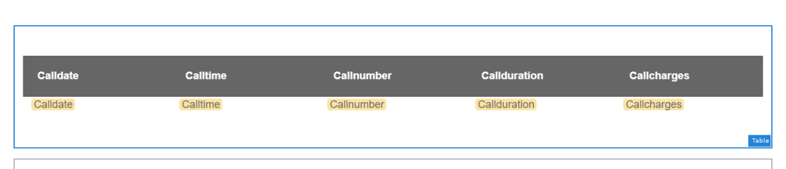

# Tutorial: Crear comunicación interactiva {#tutorial-create-interactive-communication}

Este tutorial es un paso en la [Cree su primera comunicación interactiva](/help/forms/using/create-your-first-interactive-communication.md) serie. Se recomienda seguir la serie en secuencia cronológica para comprender, realizar y demostrar el caso de uso completo del tutorial.

Una vez creados todos los componentes básicos, como el modelo de datos de formulario, los fragmentos de documento, las plantillas y los temas para la versión web, puede empezar a crear una comunicación interactiva.

Las comunicaciones interactivas se pueden entregar a través de dos canales: Imprimir y Web. También puede crear una comunicación interactiva con el canal de impresión como maestro. La opción Imprimir como principal para el canal web garantiza que el contenido, la herencia y el enlace de datos del canal web se deriven del canal de impresión. También garantiza que los cambios realizados en el canal Imprimir se sincronicen en el canal Web. Sin embargo, los autores de la comunicación interactiva pueden romper la herencia de componentes específicos del canal web.

Este tutorial lo acompaña durante los pasos para crear comunicaciones interactivas para los canales web e impresos. Al final de este tutorial, podrá:

* Crear comunicación interactiva para el canal de impresión
* Crear comunicación interactiva para el canal web
* Crear comunicaciones interactivas de impresión y web con Imprimir como maestro

## Crear comunicaciones interactivas para impresión y web sin sincronización {#create-interactive-communications-for-print-and-web-with-no-synchronization}

### Crear comunicación interactiva para el canal de impresión {#create-interactive-communication-for-print-channel}

A continuación se muestra la lista de recursos que ya se han creado en este tutorial y que son necesarios al crear la comunicación interactiva para el canal de impresión:

**Imprimir plantilla:** [create_first_ic_print_template](../../forms/using/create-templates-print-web.md)

**Modelo de datos de formulario:** [FDM_Create_First_IC](../../forms/using/create-form-data-model0.md)

**Fragmentos de documento:** [bill_details_first_ic, customer_details_first_ic, bill_summary_first_ic, summary_charge_first_ic](../../forms/using/create-document-fragments.md)

**Fragmentos de diseño:** [table_lf](../../forms/using/create-templates-print-web.md)

**Imágenes:** PayNow y ValueAddedServices

1. Inicie sesión en la instancia de autor de AEM y vaya a **[!UICONTROL Adobe Experience Manager]** > **[!UICONTROL Forms]** > **[!UICONTROL Forms y documentos]**.
1. Toque **Crear** y seleccione **Comunicación interactiva**. La variable **Crear comunicación interactiva** se muestra.
1. Especifique **create_first_ic** en el **Título** y **Nombre** campo . Select **FDM_Create_First_IC** como modelo de datos del formulario y pulse **Siguiente**.
1. En el **Canales** asistente:

   1. Especifique **create_first_ic_print_template** como plantilla Imprimir y pulse **Select**. Asegúrese de que la variable **Usar Imprimir como maestro para el canal web** no está seleccionada.

   1. Especifique **Create_First_IC_templates** carpeta > **Create_First_IC_Web_Template** como plantilla web y pulse **Select**.

   1. Pulse **Crear**.

   Se muestra un mensaje de confirmación de que la comunicación interactiva se ha creado correctamente.

1. Toque **Editar** para abrir la comunicación interactiva en el panel derecho.
1. Vaya a la **Recursos** y aplique el filtro para mostrar solo los fragmentos del documento en el panel izquierdo.
1. Arrastre y suelte los siguientes fragmentos de documento en sus áreas de destino en la Comunicación interactiva:

   | Fragmento de documento | Área de destino |
   |---|---|
   | bill_details_first_ic | Detalles de la factura |
   | customer_details_first_ic | Detalles del cliente |
   | bill_summary_first_ic | Resumen de facturación |
   | summary_charge_first_interactivo_communication | Cargos |

   

1. Toque **Gráficos** área de destino y toque **+** para agregar un **Gráfico** componente.
1. Pulse el componente Gráfico y seleccione  (Configurar). Las propiedades del gráfico se muestran en el panel izquierdo:

   1. Especifique un nombre para el gráfico.
   1. Select **Circular** de la variable **Tipo de gráfico** lista desplegable.
   1. Seleccione el **calltype** de la variable **llamadas** tipo de objeto del modelo de datos en el **Eje X** para obtener más información. Toque .
   1. Select **Frecuencia** de la variable **Función** lista desplegable.
   1. Seleccione el **calltype** de la variable **llamadas** tipo de objeto del modelo de datos en el **Eje Y** para obtener más información. Toque .
   1. Toque  para guardar las propiedades del gráfico.

1. Vaya a la **Recursos** y aplique el filtro para mostrar solo los fragmentos de diseño en el panel izquierdo. Arrastre y suelte la **table_lf** fragmento de diseño al **Llamadas desglosadas** área de destino.
1. Seleccione el campo de texto en la **Fecha** toque y columna  (Configurar).
1. Select **Objeto de modelo de datos** de la variable **Tipo de enlace** lista desplegable y seleccione **llamadas** > **calldate**. Toque  dos veces para guardar las propiedades.

   Del mismo modo, cree un enlace con **calltime**, **callnumber**, **callduration** y **cargas** para campos de texto en la variable **Tiempo**, **Número**, **Duración** y **Cargos** columnas respectivamente.

1. Toque **PayNow** área de destino y toque **+** para agregar un **Imagen** componente.
1. Pulse el componente Imagen y seleccione  (Configurar). Las propiedades de la imagen se muestran en el panel izquierdo:

   1. Especifique **PayNow** como el nombre de la imagen en la **Nombre** campo .
   1. Toque **Cargar**, seleccione la imagen guardada en el sistema de archivos local y pulse **Apertura**.
   1. Toque  para guardar las propiedades de la imagen.

1. Repita los pasos 13 y 14 para agregar **ValueAddedServices** a la **ValueAddedServices** área de destino.

### Crear comunicación interactiva para el canal web {#create-interactive-communication-for-web-channel}

A continuación se muestra la lista de recursos que ya se han creado en este tutorial y que son necesarios al crear la comunicación interactiva para el canal web:

**Plantilla web:** [Create_First_IC_Web_Template](../../forms/using/create-templates-print-web.md)

**Modelo de datos de formulario:** [FDM_Create_First_IC](../../forms/using/create-form-data-model0.md)

**Fragmentos de documento:** [bill_details_first_ic, customer_details_first_ic, bill_summary_first_ic, summary_charge_first_ic](../../forms/using/create-document-fragments.md)

**Imágenes:** PayNowWeb y ValueAddedServicesWeb

1. Inicie sesión en la instancia de autor de AEM y vaya a **[!UICONTROL Adobe Experience Manager]** > **[!UICONTROL Forms]** > **[!UICONTROL Forms y documentos]**.
1. Toque **Crear** y seleccione **Comunicación interactiva**. La variable **Crear comunicación interactiva** se muestra.
1. Especifique **create_first_ic** en el **Título** y **Nombre** campo . Select **FDM_Create_First_IC** como modelo de datos del formulario y pulse **Siguiente**.
1. En el **Canales** asistente:

   1. Especifique **create_first_ic_print_template** como plantilla Imprimir y pulse **Select**. Asegúrese de que la variable **Usar Imprimir como maestro para el canal web** no está seleccionada.

   1. Especifique **Create_First_IC_templates** carpeta > **Create_First_IC_Web_Template** como plantilla web y pulse **Select**.

   1. Pulse **Crear**.

   Se muestra un mensaje de confirmación de que la comunicación interactiva se ha creado correctamente.

1. Toque **Editar** para abrir la comunicación interactiva en el panel derecho.
1. Toque . **Canales** en el panel izquierdo y pulse **Web**.
1. Vaya a la **Recursos** y aplique el filtro para mostrar solo los fragmentos del documento en el panel izquierdo.
1. Arrastre y suelte los siguientes fragmentos de documento en sus áreas de destino en la Comunicación interactiva:

   | Fragmento de documento | Área de destino |
   |---|---|
   | bill_details_first_ic | Detalles de la factura |
   | customer_details_first_ic | Detalles del cliente |
   | bill_summary_first_ic | Resumen de facturación |
   | summary_charge_first_interactivo_communication | Cargos |

1. Toque **Resumen de cargos** área de destino y toque **+** para agregar un **Gráfico** componente.
1. Pulse el componente Gráfico y seleccione  (Configurar). Las propiedades del gráfico se muestran en el panel izquierdo:

   1. Especifique un nombre para el gráfico.
   1. Select **Circular** de la variable **Tipo de gráfico** lista desplegable.

   1. Seleccione el **calltype** de la variable **llamadas** tipo de objeto del modelo de datos en el **Eje X** para obtener más información. Toque .

   1. Select **Frecuencia** de la variable **Función** lista desplegable.

   1. Seleccione el **calltype** de la variable **llamadas** tipo de objeto del modelo de datos en el **Eje Y** para obtener más información. Toque .

   1. Toque  para guardar las propiedades del gráfico.

1. Seleccione el **Fuentes de datos** en el panel izquierdo y arrastre y suelte la **llamadas** objeto del modelo de datos a la variable **Llamadas desglosadas** área de destino. Todas las propiedades de **llamadas** el objeto del modelo de datos se muestra como columnas de tabla en la variable **Llamadas desglosadas** área de destino en el panel derecho.

   En función del caso de uso, se requieren las columnas Fecha de llamada, Hora de llamada, Número de llamada, Duración de llamada y Cargos de llamada en la tabla.

   

1. Select **Mobilenum** encabezado de columna de tabla y seleccione **Más opciones** > **Eliminar columna**. Del mismo modo, elimine la variable **Calltype** para abrir el Navegador.
1. Seleccione el **Calldate** toque y encabezado de columna de tabla  (Editar) para cambiar el nombre del texto a **Fecha de llamada**. Del mismo modo, cambie el nombre de otros encabezados de columna de la tabla.
1. En función del caso de uso, inserte un **Pagar ahora** en la Comunicación interactiva que proporciona al usuario una opción para realizar el pago haciendo clic en el botón . Siga estos pasos para insertar el botón :

   1. Toque **Pagar ahora** área de destino y toque **+** para agregar un **Texto** componente.

   1. Pulse el componente de texto y pulse  (Editar).
   1. Cambiar el nombre del texto a **Pagar ahora**.
   1. Seleccione el texto y pulse el icono Hipervínculo .
   1. Especifique la URL de pago en la **Ruta** campo .
   1. Select **Nueva ficha** from **Target** lista desplegable.

   1. Toque  para guardar las propiedades del hipervínculo.

1. Select **Estilo** en la lista desplegable junto a la **Vista previa** .

   

1. Defina un estilo para el texto del hipervínculo para mostrarlo como un botón en la Comunicación interactiva siguiendo los pasos siguientes:

   1. Pulse el componente de texto y seleccione  (Editar).
   1. En el **Borde** , especifique **1,5px** como **Ancho del borde**, seleccione **Sólido** como **Estilo de borde** y especifique **46px** como **Radio del borde**.

   1. Seleccione Rojo como color de fondo para el botón en la sección **Contexto** para obtener más información.
   1. En el **Margen** campo para **Dimension y posición** , toque la sección **Editar simultáneamente** y establezca la variable **Right** margen como **450px**. Los campos Superior, Inferior e Izquierda se definen como en blanco.

   

1. Toque **Pagar ahora** área de destino y toque **+** para agregar un **Imagen** componente.
1. Pulse el componente Imagen y seleccione  (Configurar). Las propiedades de la imagen se muestran en el panel izquierdo:

   1. Especifique **PayNow** como el nombre de la imagen en la **Nombre** campo .

   1. Toque **Cargar**, seleccione **PayNowWeb** imagen guardada en el sistema de archivos local y pulse **Apertura**.

   1. Toque  para guardar las propiedades de la imagen.

1. En función del caso de uso, inserte un **Suscribirse** en la Comunicación interactiva que proporciona al usuario una opción para suscribirse a los servicios de valor añadido haciendo clic en el botón .

   Repita los pasos 13-17 para agregar un **Suscribirse** para **Servicios de valor agregado** área de destino y agregue la variable **ValueAddedServicesWeb** imagen.

## Creación de comunicaciones interactivas para impresión y web con sincronización automática {#create-interactive-communications-for-print-and-web-with-auto-synchronization}

También puede crear una comunicación interactiva habilitando la sincronización automática entre los canales Imprimir y Web. Para habilitar la sincronización automática, seleccione la opción Imprimir como maestro al crear la comunicación interactiva. Al seleccionar la opción Imprimir como formato, se garantiza que el contenido, la herencia y el enlace de datos del canal web se deriven del canal Imprimir. También garantiza que los cambios realizados en el canal Imprimir se reflejen en el canal Web.

Siga estos pasos para derivar el contenido del canal web mediante el canal de impresión:

1. Inicie sesión en la instancia de autor de AEM y vaya a **[!UICONTROL Adobe Experience Manager]** > **[!UICONTROL Forms]** > **[!UICONTROL Forms y documentos]**.
1. Toque **Crear** y seleccione **Comunicación interactiva**. La variable **Crear comunicación interactiva** se muestra.
1. Especifique **create_first_ic** en el **Título** y **Nombre** campo . Select **FDM_Create_First_IC** como modelo de datos del formulario y pulse **Siguiente**.
1. En el **Canales** asistente:

   1. Especifique **create_first_ic_print_template** como plantilla Imprimir y pulse **Select**.

   1. Seleccione el **Usar Imprimir como maestro para el canal web** casilla de verificación.
   1. Especifique **Create_First_IC_templates** carpeta > **Create_First_IC_Web_Template** como plantilla web y pulse **Select**.

   1. Pulse **Crear**.

   Se muestra un mensaje de confirmación de que la comunicación interactiva se ha creado correctamente.

1. Toque **Editar** para abrir la comunicación interactiva en el panel derecho.
1. Ejecución de los pasos 6 a 15 de [Crear comunicación interactiva para el canal de impresión](../../forms/using/create-interactive-communication0.md#create-interactive-communication-for-print-channel) para obtener más información.
1. Toque . **Canales** en el panel izquierdo y pulse **Web** para generar automáticamente contenido para el canal web desde el canal de impresión.
1. Como **Usar Imprimir como maestro para el canal web** está seleccionada en el paso 4, el contenido y los enlaces se generan automáticamente para el canal web desde el canal de impresión.

   El contenido del canal de impresión se inserta debajo del contenido de la plantilla de canal web. Para modificar el contenido del canal web que se ha generado automáticamente desde el canal de impresión, puede cancelar la herencia de cualquier área de destino.

   Pase el ratón sobre el área de destino relevante en el canal web y seleccione  (Cancelar herencia) y, a continuación, en la variable **Cancelar herencia** cuadro de diálogo, toque **Sí**.

   

   Si ha cancelado la herencia de un componente, puede volver a activarlo. Para volver a habilitar la herencia, pase el ratón sobre el límite del área de destino correspondiente, que incluye el componente, y pulse .

1. Seleccione el **Contenido** en el panel izquierdo.
1. Arrastre y suelte el contenido del canal web generado automáticamente en los paneles existentes de la plantilla web mediante el árbol de contenido. A continuación se muestra la lista de componentes que deben reorganizarse:

   * Componente Detalles de la factura al panel Detalles de la factura
   * Componente Detalles del cliente al panel Detalles del cliente
   * Componente Resumen de facturación al panel Resumen de facturación
   * Componente Resumen de Cargos al panel Resumen de Cargos
   * Fragmento de diseño (tabla) al panel Llamadas desglosadas

   

1. Repita los pasos 13 - 18 de [Crear comunicación interactiva para el canal web](../../forms/using/create-interactive-communication0.md#create-interactive-communication-for-web-channel) para insertar el **Pagar ahora** y **Suscribirse** hipervínculos en el canal web de la comunicación interactiva.
