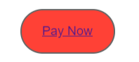

# Tutorial: Crear comunicaciones interactivas {#tutorial-create-interactive-communication}

Este tutorial es un paso en la serie [Crear su primera comunicación interactiva](/help/forms/using/create-your-first-interactive-communication.md). Se recomienda seguir la serie en orden cronológico para comprender, realizar y mostrar el caso de uso del tutorial completo.

Una vez creados todos los componentes básicos, como el modelo de datos de formulario, los fragmentos de documento, las plantillas y las temáticas para la versión web, puede empezar a crear una comunicación interactiva.

Las comunicaciones interactivas se pueden entregar a través de dos canales: Imprimir y Web. También puede crear una comunicación interactiva con el canal Imprimir como principal. La opción Imprimir como principal del canal Web garantiza que el contenido, la herencia y el enlace de datos del canal Web se deriven del canal Imprimir. También garantiza que los cambios realizados en el canal Imprimir se sincronicen en el canal Web. Sin embargo, los autores de la comunicación interactiva pueden romper la herencia de componentes específicos del canal Web.

Este tutorial lo acompañará durante los pasos para crear comunicaciones interactivas para los canales Web e Imprimir. Al final de este tutorial, podrá:

* Crear una comunicación interactiva para el canal Imprimir
* Crear una comunicación interactiva para el canal Web
* Crear comunicaciones interactivas Imprimir y Web con Imprimir como principal

## Crear comunicaciones interactivas para Imprimir y Web sin sincronización {#create-interactive-communications-for-print-and-web-with-no-synchronization}

### Crear comunicaciones interactivas para el canal Imprimir {#create-interactive-communication-for-print-channel}

A continuación se muestra la lista de recursos que ya se han creado en este tutorial y que son necesarios al crear la comunicación interactiva para el canal Imprimir:

**Plantilla Imprimir:** [create_first_ic_print_template](../../forms/using/create-templates-print-web.md)

**Modelo de datos de formulario:** [FDM_Create_First_IC](../../forms/using/create-form-data-model0.md)

**Fragmentos de documento:** [bill_details_first_ic, customer_details_first_ic, bill_summary_first_ic, summary_charges_first_ic](../../forms/using/create-document-fragments.md)

**Fragmentos de diseño:** [table_lf](../../forms/using/create-templates-print-web.md)

**Imágenes:** PayNow y ValueAddedServices

1. Inicie sesión en la instancia de autor de AEM y navegue hasta **[!UICONTROL Adobe Experience Manager]** > **[!UICONTROL Formularios]** > **[!UICONTROL Formularios y documentos]**.
1. Pulse **Crear** y seleccione **Comunicación interactiva**. Se mostrará el asistente **Crear comunicación interactiva**.
1. Especifique **create_first_ic** en los campos **Título** y **Nombre**. Seleccione **FDM_Create_First_IC** como modelo de datos de formulario y pulse **Siguiente**.
1. En el asistente **Canales**:

   1. Especifique **create_first_ic_print_template** como plantilla Imprimir y pulse **Seleccionar**. Asegúrese de que la casilla de verificación **Usar Imprimir como principal para el canal Web** no esté seleccionada.

   1. Especifique la carpeta **Create_First_IC_templates** > **Create_First_IC_Web_Template** como plantilla Web y pulse **Seleccionar**.

   1. Pulse **Crear**.

   Se mostrará un mensaje de confirmación de que la comunicación interactiva se ha creado correctamente.

1. Pulse **Editar** para abrir la comunicación interactiva en el panel derecho.
1. Vaya a la pestaña **Recursos** y aplique el filtro para mostrar solo los fragmentos del documento en el panel izquierdo.
1. Arrastre y suelte los siguientes fragmentos de documento en sus áreas de destino en la comunicación interactiva:

   | Fragmento de documento | Área de destino |
   |---|---|
   | bill_details_first_ic | BillDetails |
   | customer_details_first_ic | CustomerDetails |
   | bill_summary_first_ic | BillSummary |
   | summary_charges_first_interactive_communication | Gastos |

   

1. Pulse el área de destino **Gráficos** y pulse **+** para agregar un componente **Gráfico**.
1. Pulse el componente Gráfico y seleccione  (Configurar). Las propiedades del gráfico se muestran en el panel izquierdo:

   1. Especifique un nombre para el gráfico.
   1. Seleccione **Circular** de la lista desplegable **Tipo de gráfico**.
   1. Seleccione la propiedad **calltype** del tipo de objeto del modelo de datos **llamadas** en la sección **Eje X**. Pulse .
   1. Seleccione la variable **Frecuencia** de la lista desplegable **Función**.
   1. Seleccione la propiedad **calltype** del tipo de objeto del modelo de datos **llamadas** en la sección **Eje Y**. Pulse .
   1. Pulse  para guardar las propiedades del gráfico.

1. Vaya a la pestaña **Recursos** y aplique el filtro para mostrar solo los fragmentos de diseño en el panel izquierdo. Arrastre y suelte el fragmento de diseño **table_lf** hasta el área de destino **Llamadas desglosadas**.
1. Seleccione el campo de texto en la columna **Fecha** y pulse  (Configurar).
1. Seleccione **Objeto del modelo de datos** de la lista desplegable **Tipo de enlace** y seleccione **llamadas** > **calldate**. Pulse dos veces  para guardar las propiedades.

   Del mismo modo, cree un enlace con **calltime**, **callnumber**, **callduration** y **callcharges** para campos de texto en las columnas **Tiempo**, **Número**, **Duración** y **Gastos** respectivamente.

1. Pulse el área de destino **PayNow** y pulse **+** para agregar un componente **Imagen**.
1. Pulse el componente Imagen y seleccione  (Configurar). Las propiedades de la imagen se muestran en el panel izquierdo:

   1. Especifique **PayNow** como el nombre de la imagen en el campo **Nombre**.
   1. Pulse **Cargar**, seleccione la imagen guardada en el sistema de archivos local y pulse **Abrir**.
   1. Pulse  para guardar las propiedades de la imagen.

1. Repita los pasos 13 y 14 para agregar la imagen **ValueAddedServices** al área de destino **ValueAddedServices**.

### Crear comunicaciones interactivas para el canal Web {#create-interactive-communication-for-web-channel}

A continuación se muestra la lista de recursos que ya se han creado en este tutorial y que son necesarios al crear la comunicación interactiva para el canal Web:

**Plantilla web:** [Create_First_IC_Web_Template](../../forms/using/create-templates-print-web.md)

**Modelo de datos de formulario:** [FDM_Create_First_IC](../../forms/using/create-form-data-model0.md)

**Fragmentos de documento:** [bill_details_first_ic, customer_details_first_ic, bill_summary_first_ic, summary_charges_first_ic](../../forms/using/create-document-fragments.md)

**Imágenes:** PayNowWeb y ValueAddedServicesWeb

1. Inicie sesión en la instancia de autor de AEM y navegue hasta **[!UICONTROL Adobe Experience Manager]** > **[!UICONTROL Formularios]** > **[!UICONTROL Formularios y documentos]**.
1. Pulse **Crear** y seleccione **Comunicación interactiva**. Se mostrará el asistente **Crear comunicación interactiva**.
1. Especifique **create_first_ic** en los campos **Título** y **Nombre**. Seleccione **FDM_Create_First_IC** como modelo de datos de formulario y pulse **Siguiente**.
1. En el asistente **Canales**:

   1. Especifique **create_first_ic_print_template** como plantilla Imprimir y pulse **Seleccionar**. Asegúrese de que la casilla de verificación **Usar Imprimir como principal para el canal Web** no esté seleccionada.

   1. Especifique la carpeta **Create_First_IC_templates** > **Create_First_IC_Web_Template** como plantilla Web y pulse **Seleccionar**.

   1. Pulse **Crear**.

   Se mostrará un mensaje de confirmación de que la comunicación interactiva se ha creado correctamente.

1. Pulse **Editar** para abrir la comunicación interactiva en el panel derecho.
1. Pulse la pestaña **Canales** en el panel izquierdo y pulse **Web**.
1. Vaya a la pestaña **Recursos** y aplique el filtro para mostrar solo los fragmentos del documento en el panel izquierdo.
1. Arrastre y suelte los siguientes fragmentos de documento en sus áreas de destino en la comunicación interactiva:

   | Fragmento de documento | Área de destino |
   |---|---|
   | bill_details_first_ic | BillDetails |
   | customer_details_first_ic | CustomerDetails |
   | bill_summary_first_ic | BillSummary |
   | summary_charges_first_interactive_communication | Gastos |

1. Pulse el área de destino **Resumen de gastos** y pulse **+** para agregar un componente **Gráfico**.
1. Pulse el componente Gráfico y seleccione  (Configurar). Las propiedades del gráfico se muestran en el panel izquierdo:

   1. Especifique un nombre para el gráfico.
   1. Seleccione **Circular** de la lista desplegable **Tipo de gráfico**.

   1. Seleccione la propiedad **calltype** del tipo de objeto del modelo de datos **llamadas** en la sección **Eje X**. Pulse .

   1. Seleccione la variable **Frecuencia** de la lista desplegable **Función**.

   1. Seleccione la propiedad **calltype** del tipo de objeto del modelo de datos **llamadas** en la sección **Eje Y**. Pulse .

   1. Pulse  para guardar las propiedades del gráfico.

1. Seleccione la pestaña **Fuentes de datos** del panel izquierdo y arrastre y suelte el objetos del modelo de datos **llamadas** en el área de destino **Llamadas desglosadas**. Todas las propiedades del objeto del modelo de datos **llamadas** se mostrarán como columnas de tabla en el área de destino **Llamadas desglosadas** en el panel derecho.

   En función del caso de uso, se requieren las columnas Fecha de la llamada, Hora de la llamada, Número de la llamada, Duración de la llamada y Gastos de la llamada en la tabla.

   

1. Seleccione el encabezado de la columna **Mobilenum** de la tabla y seleccione **Más opciones** > **Eliminar columna**. Del mismo modo, elimine la columna **Calltype**.
1. Seleccione el encabezado de la columna **Calldate** de la tabla y pulse  (Editar) para cambiar el nombre del texto a **Fecha de la llamada**. Del mismo modo, cambie el nombre de otros encabezados de columna de la tabla.
1. En función del caso de uso, inserte un botón **Pagar ahora** en la comunicación interactiva que proporcione al usuario una opción para realizar el pago al hacer clic en el botón. Siga estos pasos para insertar el botón:

   1. Pulse el área de destino **Pagar ahora** y pulse **+** para agregar un componente **Texto**.

   1. Pulse el componente Texto y pulse  (Editar).
   1. Cambie el nombre del texto a **Pagar ahora**.
   1. Seleccione el texto y pulse el icono Hipervínculo.
   1. Especifique la URL de pago en el campo **Ruta**.
   1. Seleccione **Nueva pestaña** de la lista desplegable **Destino**.

   1. Pulse  para guardar las propiedades del hipervínculo.

1. Seleccione **Estilo** de la lista desplegable junto a la opción **Previsualizar**.

   

1. Defina un estilo para el texto del hipervínculo para mostrarlo como un botón en la comunicación interactiva al seguir los siguientes pasos:

   1. Pulse el componente Texto y seleccione  (Editar).
   1. En la sección **Borde**, especifique **1,5 px** como **Anchura del borde**, seleccione **Sólido** como **Estilo del borde** y especifique **46 px** como **Radio del borde**.

   1. Seleccione Rojo como color de fondo para el botón en la sección **Contexto**.
   1. En el campo **Margen** para la sección **Dimensiones y posición**, pulse el icono **Editar simultáneamente** y establezca la variable **Margen derecho** a **450 px**. Los campos Superior, Inferior e Izquierda se definen como en blanco.

   

1. Pulse el área de destino **Pagar ahora** y pulse **+** para agregar un componente **Imagen**.
1. Pulse el componente Imagen y seleccione  (Configurar). Las propiedades de la imagen se muestran en el panel izquierdo:

   1. Especifique **PayNow** como el nombre de la imagen en el campo **Nombre**.

   1. Pulse **Cargar**, seleccione la imagen **PayNowWeb** guardada en el sistema de archivos local y pulse **Abrir**.

   1. Pulse  para guardar las propiedades de la imagen.

1. En función del caso de uso, inserte un botón **Suscribirse** en la comunicación interactiva que proporcione al usuario una opción para suscribirse a los servicios de valor agregado al hacer clic en el botón.

   Repita de los pasos 13 al 17 para agregar un botón **Suscribirse** al área de destino **Servicios de valor agregado** y agregue la imagen **ValueAddedServicesWeb**.

## Crear comunicaciones interactivas para Imprimir y Web con sincronización automática {#create-interactive-communications-for-print-and-web-with-auto-synchronization}

También puede crear una comunicación interactiva si habilita la sincronización automática entre los canales Imprimir y Web. Para habilitar la sincronización automática, seleccione la opción Imprimir como principal al crear la comunicación interactiva. Al seleccionar la opción Imprimir como principal, se garantiza que el contenido, la herencia y el enlace de datos del canal Web se deriven del canal Imprimir. También garantiza que los cambios realizados en el canal Imprimir se reflejen en el canal Web.

Siga estos pasos para derivar el contenido del canal Web mediante el canal Imprimir:

1. Inicie sesión en la instancia de autor de AEM y navegue hasta **[!UICONTROL Adobe Experience Manager]** > **[!UICONTROL Formularios]** > **[!UICONTROL Formularios y documentos]**.
1. Pulse **Crear** y seleccione **Comunicación interactiva**. Se mostrará el asistente **Crear comunicación interactiva**.
1. Especifique **create_first_ic** en los campos **Título** y **Nombre**. Seleccione **FDM_Create_First_IC** como modelo de datos de formulario y pulse **Siguiente**.
1. En el asistente **Canales**:

   1. Especifique **create_first_ic_print_template** como plantilla Imprimir y pulse **Seleccionar**.

   1. Seleccione la casilla de verificación **Usar Imprimir como principal para el canal Web**.
   1. Especifique la carpeta **Create_First_IC_templates** > **Create_First_IC_Web_Template** como plantilla Web y pulse **Seleccionar**.

   1. Pulse **Crear**.

   Se mostrará un mensaje de confirmación de que la comunicación interactiva se ha creado correctamente.

1. Pulse **Editar** para abrir la comunicación interactiva en el panel derecho.
1. Ejecute de los pasos 6 a 15 de la sección [Crear comunicación interactiva para el canal Imprimir](../../forms/using/create-interactive-communication0.md#create-interactive-communication-for-print-channel).
1. Pulse **Canales** en el panel izquierdo y pulse **Web** para generar automáticamente contenido para el canal Web desde el canal Imprimir.
1. Como la casilla de verificación **Usar Imprimir como principal para el canal Web** se selecciona en el paso 4, el contenido y los enlaces se generan automáticamente para el canal Web desde el canal Imprimir.

   El contenido del canal Imprimir se inserta debajo del contenido de la plantilla de canal Web. Para modificar el contenido del canal Web que se ha generado automáticamente desde el canal Imprimir, puede cancelar la herencia de cualquier área de destino.

   Pase el ratón sobre el área de destino relevante en el canal Web y seleccione  (Cancelar herencia) y, a continuación, en el cuadro de diálogo **Cancelar herencia**, pulse **Sí**.

   

   Si ha cancelado la herencia de un componente, puede volver a habilitarla. Para volver a habilitar la herencia, pase el ratón sobre el límite del área de destino correspondiente que incluye el componente y pulse .

1. Seleccione la pestaña **Contenido** en el panel izquierdo.
1. Arrastre y suelte el contenido del canal Web generado automáticamente en los paneles existentes de la plantilla web mediante el árbol de contenido. A continuación se muestra la lista de componentes que deben volver a organizarse:

   * Componente Detalles de la factura al panel Detalles de la factura
   * Componente Detalles del cliente al panel Detalles del cliente
   * Componente Resumen de factura al panel Resumen de factura
   * Componente Resumen de gastos al panel Resumen de gastos
   * Fragmento de diseño (tabla) al panel Llamadas desglosadas

   

1. Repita de los pasos 13 al 18 de [Crear comunicación interactiva para el canal Web](../../forms/using/create-interactive-communication0.md#create-interactive-communication-for-web-channel) para insertar los hipervínculos **Pagar ahora** y **Suscribirse** en el canal Web de la comunicación interactiva.
