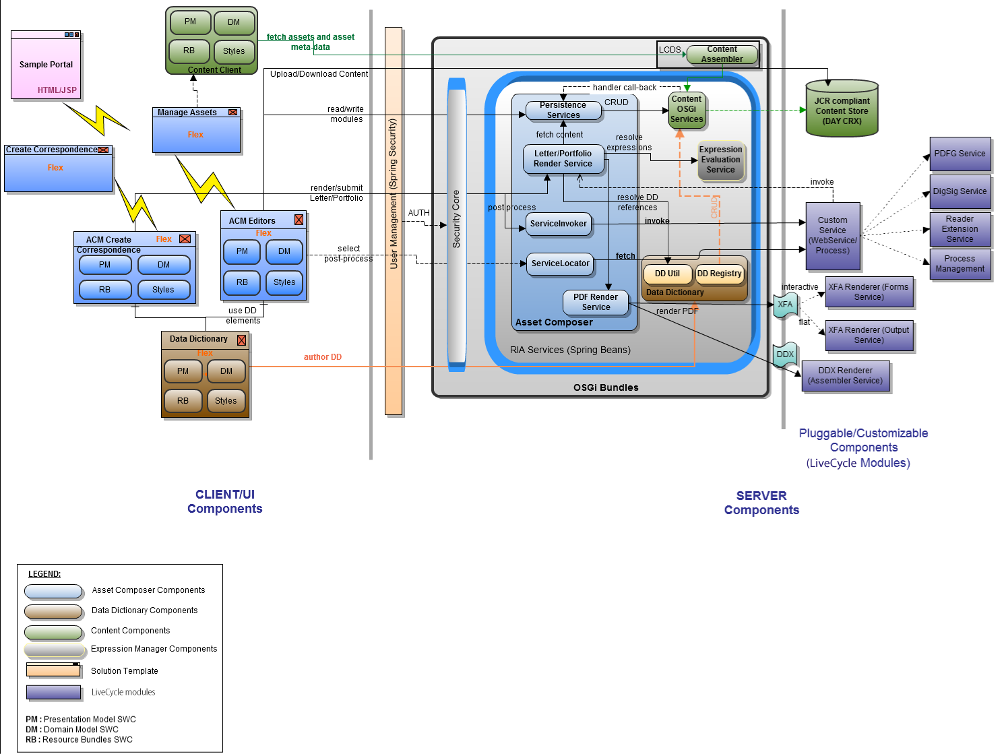

# Crear carta {#create-letter}

## Flujo de trabajo de Correspondencia de Administración {#correspondence-management-workflow}

El flujo de trabajo de Correspondencia Management consta de cuatro fases:

1. Creación de plantillas
1. Creación de fragmentos de documento
1. Creación de cartas
1. Postprocesamiento

### Creación de plantillas {#template-creation}

El siguiente gráfico muestra un flujo de trabajo típico para crear una plantilla de correspondencia.

En este flujo de trabajo:

1. Los diseñadores de formularios crean diseños y presentaciones de fragmentos con Adobe Forms Designer y los cargan en un repositorio de CRX. Los diseños contienen campos de formulario típicos, funciones de presentación como encabezado y pie de página y &quot;áreas de destinatario&quot; vacías para la colocación del contenido. Más adelante, los especialistas en aplicaciones asignan el contenido necesario para estas áreas de destinatario. Más información sobre [diseño](/help/forms/using/layout-design-details.md).
1. Los expertos en materia de materias de los departamentos de legal, financiero o marketing crean y cargan contenido como, por ejemplo, cláusulas de texto, términos y condiciones, e imágenes como logotipos, que se reutilizan en varias plantillas de correspondencia.
1. Los especialistas en aplicaciones crean plantillas de correspondencia. Especialista en solicitudes

   * Asigna cláusulas de texto e imágenes a áreas de destinatario en las plantillas de diseño
   * Define condiciones/reglas para la inclusión de contenido
   * Enlace campos y variables de diseño a modelos de datos subyacentes

1. El autor previsualización la carta y la envía para su posterior procesamiento. Más información sobre [posprocesamiento](/help/forms/using/submit-letter-topostprocess.md).

#### Uso de plantillas de carta proporcionadas con la Administración de correspondencia {#using-letter-templates-provided-with-correspondence-management}

En lugar de crear una plantilla de diseño desde cero, puede elegir modificar y reutilizar las plantillas que proporciona la Administración de correspondencia. Puede utilizar designer para modificar rápidamente la marca y los campos de datos y contenido de las plantillas para adaptarlos a las necesidades de su organización. Para obtener más información sobre las plantillas de Correspondence Management, consulte [Plantillas de carta de referencia](/help/forms/using/reference-cm-layout-templates.md).

### Creación de fragmentos de documento {#document-fragment-creation}

Los fragmentos de documento son partes reutilizables\componentes de una correspondencia que permite componer letras\correspondencia.

Los fragmentos de documento son de los siguientes tipos:

#### Texto {#text}

Un recurso de texto es un fragmento de contenido que consta de uno o varios párrafos de texto. Un párrafo puede ser estático o dinámico. Un párrafo dinámico contiene referencias a elementos de datos, cuyos valores se suministran en tiempo de ejecución.

#### Lista {#list}

Lista es una serie de fragmentos de documento, incluidos texto, listas (la misma lista no se puede &quot;añadir en sí misma), condiciones e imágenes. El orden de los elementos de lista puede ser fijo o editable. Al crear una carta, puede utilizar algunos o todos los elementos de lista para replicar un patrón reutilizable de elementos.

#### Condición {#condition}

Las condiciones le permiten definir qué contenido se incluye en el momento de la creación de la correspondencia, en función de los datos suministrados. La condición se describe en términos de variables de control. Las variables pueden ser un elemento de diccionario de datos o un marcador de posición. Al agregar una condición, puede elegir incluir un recurso en función del valor que tenga la variable de control. Las condiciones tienen una única salida basada en una expresión. La primera expresión se encuentra como verdadera, según la variable de condición actual. Su valor se convierte en el resultado de la condición.

#### Fragmento de diseño {#layout-fragment}

Un fragmento de diseño es un diseño que se puede utilizar en una o varias letras. Un fragmento de diseño se utiliza para crear patrones repetibles, especialmente tablas dinámicas. La presentación puede contener campos de formulario típicos como &quot;Dirección&quot; y &quot;Número de referencia&quot;. También contiene subformularios vacíos que denotan áreas de destinatario. Los diseños (XDP) se crean en Designer y, a continuación, se [cargan en Forms y Documentos](/help/forms/using/get-xdp-pdf-documents-aem.md).

### Creación de carta {#letter-creation}

Existen dos maneras de generar la correspondencia que se envía a sus clientes: dirigido por el usuario y por el sistema.

#### Controlada por el usuario {#user-driven}

Los empleados orientados al cliente, como los reguladores de reclamaciones o los trabajadores pueden crear correspondencia personalizada. Mediante una interfaz sencilla e intuitiva de cumplimentación de cartas, los usuarios empresariales pueden añadir texto opcional a la correspondencia, personalizar el contenido editable mientras previsualizan la correspondencia en tiempo real. Luego pueden enviar la correspondencia personalizada a un proceso back-end.

#### Controlada por el sistema {#system-driven}

La generación de correspondencia es automatizada, impulsada por déclencheur de evento. Por ejemplo, un aviso de recordatorio enviado a una ciudadana pidiéndole que registre impuestos por adelantado, se genera combinando la plantilla predefinida con datos de ciudadanos. La carta final se puede enviar por correo electrónico, imprimir, enviar por fax o archivar.

### Postprocesamiento {#post-processing}

La correspondencia final se puede enviar a un proceso de postprocesamiento. La correspondencia puede ser:

1. Procesado para impresión por correo electrónico, fax o por lotes, o colocado en una carpeta para impresión o correo electrónico.
1. Presentado para su examen y aprobación.
1. Garantizado mediante la aplicación de firmas digitales, certificación, cifrado o administración de derechos.
1. Se convierte en un documento PDF en el que se pueden realizar búsquedas y que contiene todos los metadatos necesarios para archivar y auditar.
1. Se incluye en un Portfolio PDF que incluye más documentos, como material de marketing. El Portfolio PDF se puede enviar como la correspondencia final.

### Arquitectura de la solución Administración de Correspondencia {#correspondence-management-solution-architecture}

El siguiente gráfico proporciona información general de una arquitectura de ejemplo de la solución Letters.

## Desestructurar una letra {#deconstructing-a-letter}

Este documento de Aviso de Cancelación es un ejemplo de una correspondencia típica:

<table> 
 <tbody> 
  <tr> 
   <td><strong>Elementos de carta</strong></td> 
   <td><strong>Descripción</strong></td> 
   <td><strong>Formado con</strong></td> 
  </tr> 
  <tr> 
   <td>Datos de sistemas empresariales back-end</td> 
   <td>Datos procedentes de sistemas empresariales back-end. Los datos se combinan dinámicamente con la plantilla de correspondencia.</td> 
   <td>El archivo de datos  creado según un diccionario de datos</td> 
  </tr> 
  <tr> 
   <td>Datos  ingresados por empleado de primera línea</td> 
   <td>Datos que puede proporcionar un empleado de primera línea que está personalizando la carta antes de enviarla.  </td> 
   <td>
Elementos DD no protegidos  Párrafos de texto editables  Variables/marcadores de posición  
 </td> 
  </tr> 
  <tr> 
   <td>Párrafos de texto aprobados previamente </td> 
   <td>Contenido de texto preaprobado. Los expertos en Derecho, Finanzas o una línea de negocios que entienden el contexto comercial de la carta suelen crear el contenido del texto. El contenido, como el encabezado, el pie de página, las renuncias de responsabilidad y el saludo, sería común en la mayoría de las letras. Sin embargo, contenidos como "motivo de la terminación" serían específicos de la carta en particular.</td> 
   <td>
Text\Lists\  Condiciones\Presentación
 
 
 </td> 
  </tr> 
  <tr> 
   <td>¿Datos  basados en lógica personalizada?</td> 
   <td>En el caso de algunas cartas, como una carta para solicitar más información sobre una reclamación, los usuarios como el ajuste de reclamaciones pueden agregar contenido de texto personalizado.</td> 
   <td>Documento  Fragmento de tipo Condición </td> 
  </tr> 
  <tr> 
   <td>Imágenes almacenadas  del repositorio central</td> 
   <td>Imágenes como logotipos e imágenes de firma. Imágenes como logotipos corporativos aparecerían en la mayor parte o en toda la correspondencia. Las imágenes de firma son específicas de la carta y de la persona en cuyo nombre se envía la carta.</td> 
   <td>
Imágenes almacenadas en AEM recursos (DAM)  
 
 
 </td> 
  </tr> 
 </tbody> 
</table>

## Analizar una carta antes de crearla {#analyze-a-letter-before-you-construct-it}

Analice cada letra para descubrir los distintos elementos que la componen. El especialista en aplicaciones analiza las correspondencias que se generan.

* Qué partes de la correspondencia son estáticas y cuáles dinámicas. Las variables que se rellenan desde fuentes de datos back-end o por usuarios finales.
* El orden en que los distintos párrafos de texto aparecen en la correspondencia, como por ejemplo si un usuario comercial puede cambiar de párrafo durante la creación de la correspondencia.
* ¿Se genera el sistema de correspondencia o se requiere que un usuario final edite la correspondencia? ¿Cuántas correspondencias se generan a partir del sistema y cuántas requieren la intervención del usuario?
* ¿Con qué frecuencia cambia la plantilla de correspondencia? ¿Se actualizará anualmente, trimestralmente o sólo cuando cambie una legislación en particular? ¿Qué tipo de cambios se esperan? Es un cambio para corregir errores tipográficos, un cambio de diseño, agregar más campos, agregar más párrafos, etc.
* Cuando planifique sus requisitos de correspondencia, cree la lista de nuevas plantillas de correspondencia. Para cada plantilla de correspondencia se requiere:

   * Cláusulas de texto, imágenes y tablas
   * Valores de datos de sistemas back-end
   * El diseño y los diseños de fragmento de la correspondencia
   * El orden en que aparece el contenido en la carta y las reglas para la inclusión y exclusión del contenido

* Condiciones en las que los usuarios comerciales, como los reguladores de reclamaciones o los trabajadores de casos, modifican el contenido o partes de la carta.
* Los escenarios son narrativas que describen la experiencia del usuario, los requisitos y las ventajas de utilizar la solución Cartas.
* Los escenarios también proporcionan:los conjuntos de habilidades y las herramientas que necesita para el proyecto.
* Prácticas recomendadas para planificar la implementación. &quot;Descripción general de la implementación de alto nivel.

## Ventajas de realizar la análisis {#benefits-of-performing-the-analysis}

**Reutilización de** contenidoDispone de una lista consolidada del nuevo contenido necesario para generar correspondencia. Gran parte del contenido, como encabezados, pies de página, renuncias de responsabilidad e introducciones, es común a muchas letras y se puede reutilizar en varias letras. Todos estos contenidos comunes pueden ser creados y aprobados por expertos una vez y luego reutilizados en muchas piezas de correspondencia.

**Creación del** diccionario de datosHabrá valores de datos como &quot;ID del cliente&quot; y &quot;Nombre del cliente&quot; que son comunes a muchas letras. Puede preparar una lista consolidada de todos estos valores de datos. Normalmente, se consulta a alguien del equipo de middleware empresarial al planificar la estructura. Esto constituye la base para crear el diccionario de datos.

**Abastecimiento de datos desde** sistemas empresariales back-endTambién conocerá todos los valores de datos necesarios y desde dónde se obtienen los datos del sistema empresarial. A continuación, puede diseñar la implementación para extraer los datos del sistema empresarial y alimentarlos con la solución Letters.

**Calcular la complejidad de** las cartasEs importante determinar cuán complejo será crear una correspondencia en particular. Esta análisis ayuda a determinar la cantidad de tiempo y conjuntos de habilidades que serán necesarios para crear las plantillas de letras. Esto, a su vez, ayudará a estimar los recursos y el costo de la implementación de la solución Letters.

## Complejidad de correspondencia {#correspondence-complexity}

La complejidad de la correspondencia puede determinarse analizando los siguientes parámetros:

**Complejidad** del diseño ¿Qué complejidad tiene el diseño? Las cartas como Aviso de cancelación tienen diseños sencillos. Mientras que las letras como Confirmación de cobertura de solicitudes tienen una presentación compleja con varias tablas y más de 60 campos de formulario. La creación de diseños complejos lleva más tiempo y requiere conjuntos de habilidades de diseño avanzado.

**Número de párrafos de texto y** condicionesUn contrato de préstamo puede tener 10 páginas y contener más de 40 cláusulas de texto. Muchas de estas cláusulas dependerían de &quot;parámetros de préstamo&quot;. Sobre la base de las condiciones exactas, las cláusulas se incluirían o excluirían del contrato. La creación de esas cartas requiere una planificación minuciosa y una definición cuidadosa de las condiciones complejas.

Esta tabla proporciona algunas directrices que puede utilizar para clasificar las letras:

<table> 
 <tbody> 
  <tr> 
   <td>
<strong>Nivel de complejidad</strong>
 </td> 
   <td>
<strong>Complejidad del diseño (subjetivo)</strong>
 </td> 
   <td>
<strong>Número de párrafos de texto</strong>
 </td> 
   <td>
<strong>Número de textos o imágenes condicionales</strong>
 </td> 
   <td>
<strong>Conjunto de habilidades requerido</strong>
 </td> 
  </tr> 
  <tr> 
   <td>
Baja complejidad
 </td> 
   <td>
Baja. Layout tiene pocos campos de formulario (&lt;15).
 
Generalmente una página.
 </td> 
   <td>
8
 </td> 
   <td>
1
 </td> 
   <td>
Capacidades de diseñador medio.
 </td> 
  </tr> 
  <tr> 
   <td>
Complejidad media
 </td> 
   <td>
Diseño de complejidad media. Incluye estructuras como tablas. Generalmente más de una página de largo.
 </td> 
   <td>
16
 </td> 
   <td>
2
 </td> 
   <td>
Capacidades de diseñador medio.
 
 
 
Capacidad para crear expresiones complejas mediante interfaces de usuario.
 </td> 
  </tr> 
  <tr> 
   <td>
Alta complejidad
 </td> 
   <td>
Diseño complejo. Puede tener buenas tres páginas. Contiene tablas y más de 60 campos de formulario.
 </td> 
   <td>
40
 </td> 
   <td>
8
 </td> 
   <td>
Capacidades de diseñador experto.
 
 
 
Capacidad para crear expresiones complejas mediante interfaces de usuario.
 </td> 
  </tr> 
 </tbody> 
</table>

## Información general sobre la creación de una carta {#overview-of-creating-a-letter}

1. Seleccione el diseño adecuado que sirve como base de la letra y cree una letra.
1. Añada módulos de datos o fragmentos de diseño a la letra y configúrelos.
1. Elija la previsualización de la correspondencia.
1. Edite y configure los campos, las variables, el contenido y los archivos adjuntos.

### Requisitos previos {#prerequisites}

Primero necesita lo siguiente para crear una correspondencia:

* [Paquete](compatibility-package.md) de compatibilidad. Instale el Paquete de compatibilidad para vista de la opción **Letras** en la página **Forms**.
* La letra XDP ([layout](/help/forms/using/document-fragments.md)).
* Otros XDP ([fragmentos de diseño](document-fragments.md#document-fragments)) que forman partes de la letra. Los XDP\Layouts se crean en [Designer](https://help.adobe.com/en-US/AEMForms/6.1/DesignerHelp/).
* El [diccionario de datos pertinente](/help/forms/using/data-dictionary.md) (opcional).
* Los [módulos de datos](/help/forms/using/document-fragments.md) que desea utilizar en la correspondencia.
* [Los ](/help/forms/using/data-dictionary.md#p-working-with-test-data-p) datos de prueba son el archivo XML con los datos de prueba que contiene. Los datos de prueba son obligatorios si utiliza un diccionario de datos.

## Crear una plantilla de carta {#create-a-letter-template}

### Seleccione un diseño e introduzca las propiedades de la letra {#select-a-layout-and-enter-the-letter-properties}

1. Seleccione **Forms** > **Letras**.

1. Seleccione **Crear > Carta**. La Administración de correspondencia muestra los diseños disponibles (XDP). Estos diseños proceden de Designer. Los diseños también incluyen las plantillas de letras que la Administración de correspondencia proporciona de forma predeterminada. Para obtener más información sobre las plantillas de Correspondence Management, consulte [Plantillas de carta de referencia](/help/forms/using/reference-cm-layout-templates.md). Para añadir sus propios diseños, cree archivos XDP (layout) en Designer y, a continuación, [cárguelos en AEM Forms](/help/forms/using/get-xdp-pdf-documents-aem.md).

   

1. Toque **Siguiente** para seleccionar un diseño.

   

1. Introduzca las propiedades de Correspondencia y toque **Guardar:**

   * **Título (opcional):** introduzca el título de la carta. El título no tiene que ser único y puede tener caracteres especiales y caracteres no ingleses.
   * **Nombre:** el nombre único de la carta. No puede haber dos letras en ningún estado con el mismo nombre. En el campo Nombre, solo puede introducir caracteres, números y guiones en inglés. El campo Nombre se rellena automáticamente según el campo Título. Los caracteres especiales, espacios, números y caracteres no ingleses introducidos en el campo Título se sustituyen por guiones en el campo Nombre. Aunque el valor del campo Título se copia automáticamente en el Nombre, puede editarlo.
   * **Descripción (opcional):** describa la letra para su referencia.
   * **Diccionario de datos (opcional)**: El diccionario de datos se puede asociar a la correspondencia. Los recursos que inserte posteriormente en esta correspondencia deben tener el mismo diccionario de datos que el que elija para la correspondencia aquí o ningún diccionario de datos.
   * **Etiquetas (opcional):** seleccione las etiquetas que desee aplicar a la correspondencia. También puede escribir un nombre de etiqueta nuevo o personalizado y pulsar Intro para crearlo.
   * **Proceso de anuncio (opcional):** seleccione el proceso de anuncio que se aplicará a la plantilla de carta. Existen procesos de anuncios predeterminados y los que ha creado con AEM, como correo electrónico e impresión.

   

1. El sistema muestra un mensaje: &quot;Carta creada correctamente&quot;. (en el mensaje de alerta) Toque **Abrir** para configurar los módulos de datos y los fragmentos de diseño que contiene. O toque **Listo** para volver a la página anterior.

   

   **Siguiente**: Al tocar  **Abrir**, la Administración de correspondencia muestra una representación del diseño con todos los componentes del diseño (XDP) enumerados. Continúe insertando los [Módulos de datos y fragmentos de diseño y configurándolos](/help/forms/using/create-letter.md#p-insert-data-modules-and-layout-fragments-in-a-letter-and-configure-them-p).

### Inserte módulos de datos y fragmentos de diseño en una carta y configúrelos {#insert-data-modules-and-layout-fragments-in-a-letter-and-configure-them}

Cuando después de crear una correspondencia, toque Abrir, la Administración de correspondencia muestra una representación de la presentación con todos los subformularios o áreas de destinatario de la presentación (XDP) enumerados. En cada una de las áreas de destinatario, puede elegir insertar un módulo de datos o un fragmento de diseño (y, a continuación, módulos de datos en el fragmento de diseño).

>[!NOTE]
>
>También puede tocar el icono Editar de una letra en la página Letras para insertar módulos de datos y fragmentos de diseño en una carta y configurarlos.

1. Puntee **Insertar** para cada uno de los subformularios y seleccione Módulos de datos o un fragmento de diseño para insertar en cada uno de los subformularios.

   

1. Seleccione Módulo de datos o Fragmento de diseño para estas opciones en cada subformulario y, a continuación, elija los módulos de datos o los fragmentos de diseño que desea insertar. Un fragmento de diseño permite insertar en él módulos de datos o fragmentos de diseño según su diseño (hasta cuatro niveles).

   

1. Si inserta un fragmento de diseño, el nombre del fragmento de diseño aparece en el subformulario. Y según el fragmento seleccionado, los subformularios anidados aparecen en el subformulario.
1. Después de insertar los módulos de datos seleccionados en el diseño, puede tocar el modo de configuración y establecer lo siguiente después de tocar el icono Editar para cada uno de los módulos:

   1. **Editable**: Cuando se selecciona esta opción, el contenido se puede editar en la interfaz de usuario Crear correspondencia. Marque el contenido como editable solo si requiere que el usuario comercial (como un ajuste de reclamaciones) lo modifique.
   1. **Obligatorio**: Cuando se selecciona esta opción, el contenido se requiere en la interfaz de usuario Crear correspondencia.
   1. **Seleccionado**: Cuando se selecciona esta opción, el contenido se selecciona de forma predeterminada en la interfaz de usuario Crear correspondencia.
   1. **Sangría**: Aumente o disminuya la sangría del módulo/contenido de la letra. La sangría se especifica en términos de niveles, comenzando por 0. Cada nivel sangra 36 puntos. Para obtener más información sobre cómo personalizar formularios, consulte **[!UICONTROL Configuraciones de administración de correspondencia]** en [Flujo de trabajo de Forms](submit-letter-topostprocess.md#formsworkflow).
   1. **Salto de página antes**: Si establece la opción Salto de página antes de que se active, el contenido del módulo ESTA siempre se mostrará en una página nueva.
   1. **Salto de página después** de: Si establece el valor de Salto de página después de para un módulo específico, el contenido del módulo SIGUIENTE siempre se muestra en una página nueva.

   

1. Para editar un módulo, toque el icono Editar junto a él. Después de editar los módulos, toque **Guardar**.

   En esta página, también puede hacer lo siguiente para los subformularios:

   1. **Permitir texto** gratuito: Si Permitir texto libre está activado, el usuario puede agregar texto en línea en la vista CCR. En la vista de CCR, se activa una acción &#39;T&#39; para aquellas áreas de destinatario que tienen activada la opción Permitir texto libre y cuando el usuario la toca, se solicita el nombre y la descripción del texto y, al tocar Aceptar, se abre el texto en modo de edición, donde el usuario puede agregar texto. Esto funciona como otros módulos de texto
   1. **Orden** de bloqueo: Bloquea el orden de los subformularios en la letra. El autor no puede reordenar los subformularios o componentes al crear la letra.

   En esta página, también puede hacer lo siguiente para cada uno de los recursos de los subformularios:

   1. **Cambiar el orden de los recursos**: arrastre y suelte un recurso manteniendo el icono de reordenación de un recurso ( ).
   1. **Eliminar recursos**: Toque el icono Eliminar situado junto a un recurso para eliminarlo.
   1. **Recursos** de previsualización: Puntee en el icono de mostrar previsualización ( ) situado junto a un recurso.

1. Toque **Siguiente**.
1. La página Datos detalla cómo se utilizan los campos de datos y las variables en la plantilla. Los datos se pueden vincular a fuentes de datos como un diccionario de datos o entradas del usuario. Cada campo define las propiedades desde las que el diccionario de datos asigna datos o qué rótulo se muestra para los campos de entrada del usuario.

   Vinculación:

   * Los elementos **field** pueden vincularse a un literal, un elemento de diccionario de datos, un recurso o un valor especificado por el usuario. También puede ignorar un elemento de campo enlazándolo a la opción Ignorar.
   * Los elementos **variable** pueden vincularse a un literal, un elemento de diccionario de datos, un campo, una variable, un recurso o un valor especificado por el usuario.

   A continuación se muestran algunos campos principales en la vinculación:

   * **Multilínea**: Puede especificar si la entrada de datos de un campo o variable es multilínea. Si selecciona esta opción, el cuadro de entrada del campo o la variable se muestra como cuadro de entrada multilínea en la Vista de edición de datos. El campo o la variable también se muestra como multilínea en las vistas de datos y contenido en la interfaz de usuario Crear correspondencia. El campo de entrada multilínea es similar al campo para introducir un comentario en un TextModule. La opción multilínea solo está disponible para campos y variables con tipo de vínculo Usuario o Elementos del diccionario de datos no protegidos.
   * **Opcional**: Puede especificar si el valor del campo o la variable es opcional o no. La opción de campo opcional está disponible para campos y variables con tipo de vínculo Usuario o Elementos del diccionario de datos no protegidos.

   * **Validación** de campo/variable: Para proporcionar una validación mejorada del valor de un campo o variable, puede asignar un validador al campo o variable. Esta opción solo está disponible para campos y variables con tipo de vínculo Usuario o Elementos del diccionario de datos no protegidos.
   * **** Subtítulos e  **información sobre herramientas**: Rótulo es la etiqueta del campo que aparece antes del campo en la interfaz de usuario de CCR. Esta opción está disponible para campos y variables con tipo de vínculo Usuario o Elementos del diccionario de datos no protegidos.

   A continuación se indican los tipos de validación que puede utilizar para los campos:

   * **Validador** de cadenas: Utilice el validador de cadenas para especificar una longitud mínima y máxima de la cadena introducida en el campo o la variable. Cuando cree un validador de cadenas, asegúrese de especificar parámetros de validación válidos. Introduzca una longitud válida para los valores mínimo y máximo. Para el validador de cadenas, puede especificar la longitud mínima y máxima del valor que se puede introducir. Si el valor introducido no se ajusta a los valores mínimo y máximo especificados, el campo correspondiente de la interfaz de usuario de CCR se marca en color rojo.

   * **Validador** de número: Utilice el Validador de números para especificar el valor numérico mínimo y máximo introducido en un campo o variable. Cuando cree un validador de números, asegúrese de especificar parámetros de validación válidos. Introduzca valores numéricos para los valores mínimo y máximo.

   * **Validador** de Expresiones regular: Utilice el Validador de Expresiones regulares para definir una expresión regular que se utilice para validar el valor de un campo o variable. Además, puede personalizar el mensaje de error. Cuando cree un validador de Expresiones regular, asegúrese de especificar una expresión regular válida.
   >[!NOTE]
   >
   >Los validadores de campos y variables solo están disponibles en campos o variables con tipo de vínculo Usuario o Elementos del diccionario de datos no protegidos.

   

1. Después de especificar la vinculación, toque **Siguiente**. La Administración de correspondencia muestra la pantalla Archivos adjuntos.

### Configure los archivos adjuntos {#set-up-the-attachments}

1. Seleccione **Añadir recurso**.
1. En la pantalla Seleccionar recurso, toque los recursos para adjuntarlos a la letra y toque **Listo**. Es necesario que los recursos se carguen primero en Recursos. Se recomienda adjuntar solo archivos PDF y documentos de Microsoft Office, pero también puede adjuntar imágenes. Para obtener más información sobre cómo cargar recursos en DAM, consulte [Carga de recursos](/help/assets/manage-assets.md).
1. Para bloquear el orden de los recursos en la lista de modo que el ajuste de reclamaciones no pueda cambiar el orden, toque **Bloquear orden**. Si no selecciona esta opción, el ajuste de solicitudes puede cambiar el orden de los artículos de lista.
1. Para cambiar el orden de los recursos, arrastre y suelte un recurso que contenga el icono de reordenación de un recurso ( ).
1. Toque **Editar** delante de un archivo adjunto y especifique un archivo adjunto como Obligatorio si no desea que el autor pueda eliminarlo. Especifique un archivo adjunto como Seleccionado si desea que se preseleccione en la interfaz de CCR.
1. Seleccione **Acceso a biblioteca** para dar acceso a la biblioteca. Si Acceso a biblioteca está habilitado, el ajuste de solicitudes puede acceder a la biblioteca de contenido al crear una carta e insertar archivos adjuntos.
1. Seleccione **Configuración de datos adjuntos** y especifique el número máximo de datos adjuntos.

1. Toque **Guardar**. La correspondencia se crea y se enumera en la página Cartas.

Después de crear una plantilla de carta en Correspondence Management, el usuario final/agente/ajustador de notificaciones puede abrir la carta en la interfaz de usuario de CCR y crear una correspondencia introduciendo datos, configurando contenido y administrando archivos adjuntos. Para obtener más información, consulte [Crear correspondencia](/help/forms/using/create-correspondence.md).

## Tipos de vínculos disponibles para cada uno de los campos {#types-of-linkage-available-for-each-of-the-fields}

En la tabla siguiente se describen los tipos de vínculos disponibles para distintos tipos de campos.

Los siguientes valores de la tabla

* **Sí**: El tipo de campo de la columna más a la izquierda admite ese tipo de asignación
* **No**: El tipo de campo de la columna más a la izquierda no admite ese tipo de asignación
* **N/D**: El tipo de campo de la columna situada más a la izquierda no es aplicable

<table> 
 <tbody> 
  <tr> 
   <td> </td> 
   <td><strong>Literal</strong></td> 
   <td><strong>Recurso</strong></td> 
   <td><strong>Diccionario de datos</strong></td> 
   <td><strong>Ignorar</strong></td> 
   <td><strong>Usuario</strong></td> 
   <td><strong>Campo</strong></td> 
   <td><strong>Variable</strong></td> 
  </tr> 
  <tr> 
   <td><strong>date</strong></td> 
   <td>Sí</td> 
   <td>No</td> 
   <td>Sí</td> 
   <td>Sí</td> 
   <td>Sí</td> 
   <td>N/D</td> 
   <td>N/D</td> 
  </tr> 
  <tr> 
   <td><strong>time</strong></td> 
   <td>Sí</td> 
   <td>No</td> 
   <td>Sí</td> 
   <td>Sí</td> 
   <td>Sí</td> 
   <td>N/D</td> 
   <td>N/D</td> 
  </tr> 
  <tr> 
   <td><strong>datetime</strong></td> 
   <td>Sí</td> 
   <td>No</td> 
   <td>Sí</td> 
   <td>Sí</td> 
   <td>Sí</td> 
   <td>N/D</td> 
   <td>N/D</td> 
  </tr> 
  <tr> 
   <td><strong>integer</strong></td> 
   <td>Sí</td> 
   <td>No</td> 
   <td>Sí</td> 
   <td>Sí</td> 
   <td>Sí  </td> 
   <td>N/D</td> 
   <td>N/D</td> 
  </tr> 
  <tr> 
   <td><strong>float</strong></td> 
   <td>Sí</td> 
   <td>No</td> 
   <td>Sí</td> 
   <td>Sí</td> 
   <td>Sí  </td> 
   <td>N/D</td> 
   <td>N/D  </td> 
  </tr> 
  <tr> 
   <td><strong>richtext</strong></td> 
   <td>Sí</td> 
   <td>solo texto</td> 
   <td>Sí</td> 
   <td>Sí</td> 
   <td>Sí</td> 
   <td>N/D</td> 
   <td>N/D</td> 
  </tr> 
  <tr> 
   <td><strong></strong> <strong>texto sin formato</strong></td> 
   <td>Sí</td> 
   <td>solo texto</td> 
   <td>Sí</td> 
   <td>Sí</td> 
   <td>Sí</td> 
   <td>N/D</td> 
   <td>N/D</td> 
  </tr> 
  <tr> 
   <td><strong>image</strong></td> 
   <td>No</td> 
   <td>solo imagen</td> 
   <td>No</td> 
   <td>Sí</td> 
   <td>No</td> 
   <td>N/D</td> 
   <td>N/D</td> 
  </tr> 
  <tr> 
   <td><strong>signature</strong></td> 
   <td>No</td> 
   <td>No</td> 
   <td>No  </td> 
   <td>Sí</td> 
   <td>No</td> 
   <td>N/D</td> 
   <td>N/D  </td> 
  </tr> 
 </tbody> 
</table>

## Crear una copia de una plantilla de carta {#createcopylettertemplate}

Puede utilizar una plantilla de carta existente para crear rápidamente una plantilla de carta con propiedades, contenido y recursos heredados similares, como fragmentos de documento y diccionario de datos. Para ello, copie y pegue una carta.

1. En la página Letras, seleccione una o varias letras. La interfaz de usuario muestra el icono Copiar.
1. Pulse Copiar. La interfaz de usuario muestra el icono Pegar. También puede elegir ir dentro de una carpeta antes de pegarla. Las distintas carpetas pueden contener recursos con los mismos nombres. Para obtener más información sobre las carpetas, consulte [Carpetas y organización de recursos](/help/forms/using/import-export-forms-templates.md#folders-and-organizing-assets).
1. Toque Pegar. Aparecerá el cuadro de diálogo Pegar. Si está copiando y pegando las letras en el mismo lugar, el sistema asigna automáticamente nombres y títulos a las nuevas copias de las letras, pero puede editar los títulos y nombres de las letras.
1. Si es necesario, edite el Título y el Nombre con los que desea guardar la copia de la carta.
1. Toque Pegar. Se crea la copia de la carta. Ahora puede realizar los cambios necesarios en la carta recién creada.

