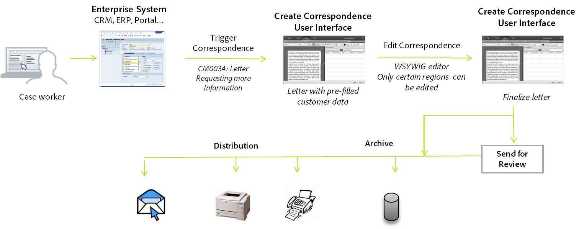

# Crear carta {#create-letter}

## Flujo de trabajo de Administración de correspondencia {#correspondence-management-workflow}

El flujo de trabajo de Administración de correspondencia consta de cuatro fases:

1. Crear plantillas
1. Crear fragmentos de documento
1. Crear cartas
1. Postprocesar

### Crear plantillas {#template-creation}

El siguiente gráfico muestra un flujo de trabajo típico para crear una plantilla de correspondencia.

En este flujo de trabajo:

1. Los diseñadores de formularios crean diseños y diseños de fragmento con Adobe Forms Designer y los cargan en un repositorio CRX. Los diseños contienen campos de formulario típicos, funciones de presentación como encabezado y pie de página y “áreas de destino” vacías para colocar contenido. Después, los especialistas en aplicaciones asignan el contenido necesario para estas áreas de destino. Más información sobre [realizar diseños](/help/forms/using/layout-design-details.md).
1. Los expertos en materia de los departamentos jurídicos, financieros o de marketing crean y cargan contenido, como cláusulas de texto, términos y condiciones, e imágenes como logotipos, que se reutilizan en varias plantillas de correspondencia.
1. Los especialistas en aplicaciones crean plantillas de correspondencia. El especialista en aplicaciones

   * Asigna cláusulas de texto e imágenes a áreas de destino en las plantillas de diseño
   * Define condiciones/reglas para la inclusión de contenido
   * Enlaza campos y variables de diseño con modelos de datos subyacentes

1. El autor obtiene una vista previa de la carta y la envía para su procesamiento posterior. Más información sobre [posprocesamiento](/help/forms/using/submit-letter-topostprocess.md).

#### Usar plantillas de carta proporcionadas con Administración de correspondencia {#using-letter-templates-provided-with-correspondence-management}

En lugar de crear una plantilla de diseño desde cero, puede elegir modificar y reutilizar las plantillas que proporciona Administración de correspondencia. Puede utilizar Designer para modificar rápidamente la marca y los campos de datos y el contenido de las plantillas para adaptarlos a las necesidades de su organización. Para obtener más información sobre las plantillas de Administración de correspondencia, consulte [Plantillas de carta de referencia](/help/forms/using/reference-cm-layout-templates.md).

### Crear fragmentos de documento {#document-fragment-creation}

Los fragmentos de documento son partes reutilizables\componentes de una correspondencia mediante los cuales puede componer cartas\correspondencia.

Los fragmentos del documento son de los siguientes tipos:

#### Texto {#text}

Un recurso de texto es un fragmento de contenido que consta de uno o más párrafos de texto. Un párrafo puede ser estático o dinámico. Un párrafo dinámico contiene referencias a elementos de datos, cuyos valores se proporcionan durante la ejecución.

#### Lista {#list}

Una lista es una serie de fragmentos de documento, incluidos texto, listas (la misma lista no se puede agregar en sí misma), condiciones e imágenes. El orden de los elementos de la lista puede ser fijo o editable. Al crear una carta, puede utilizar algunos o todos los elementos de una lista para replicar un patrón de elementos reutilizable.

#### Condición {#condition}

Las condiciones permiten definir qué contenido se incluye en el momento de la creación de la correspondencia, según los datos suministrados. La condición se describe en términos de variables de control. Las variables pueden ser un elemento de diccionario de datos o un marcador de posición. Cuando agregue una condición, puede decidir si desea incluir un recurso en función del valor de la variable de control. Las condiciones tienen una sola salida basada en una expresión. La primera expresión se encuentra como true, en función de la variable de condición actual. Su valor se convierte en el resultado de la condición.

#### Fragmento de diseño {#layout-fragment}

Un fragmento de diseño es un diseño que se puede utilizar en una o varias cartas. Un fragmento de diseño se utiliza para crear patrones repetibles, especialmente tablas dinámicas. El diseño puede contener campos de formulario típicos, como “Dirección” y “Número de referencia”. También contiene subformularios vacíos que denotan áreas de destino. Los diseños (XDP) se crean en Designer y, a continuación, se [cargan en Formularios y documentos](/help/forms/using/get-xdp-pdf-documents-aem.md).

### Crear cartas {#letter-creation}

Existen dos maneras de generar la correspondencia que se envía a sus clientes: dirigidas por el usuario y por el sistema.

#### Dirigidas por el usuario {#user-driven}

Los empleados que trabajan de cara al cliente, como los reguladores de reclamaciones o los trabajadores de casos, pueden crear correspondencia personalizada. Con una interfaz sencilla e intuitiva de cumplimentación de cartas, los usuarios empresariales pueden agregar texto opcional a la correspondencia, personalizar el contenido editable y previsualizar la correspondencia en tiempo real. Luego pueden enviar la correspondencia personalizada a un proceso back-end.

#### Dirigida por el sistema {#system-driven}

La generación de correspondencia está automatizada, impulsada por un activador de eventos. Por ejemplo, un recordatorio enviado a una ciudadana pidiéndole que registre sus impuestos por adelantado, se genera combinando la plantilla predefinida con datos ciudadanos. La carta final puede enviarse por correo electrónico, imprimirse, enviarse por fax o archivarse.

### Posprocesamiento {#post-processing}

La correspondencia final se puede enviar a un proceso back-end para el posprocesamiento. La correspondencia puede ser:

1. Procesada para correo electrónico, fax o impresión por lotes, o colocada en una carpeta para imprimirla o enviarla por correo electrónico.
1. Presentada para revisarla y aprobarla.
1. Asegurada al aplicar firmas digitales, certificación, cifrado o administración de derechos.
1. Convertida en un documento PDF en el que se puede buscar y que contiene todos los metadatos necesarios para fines de archivo y auditoría.
1. Incluida en un Portfolio PDF que incluye más documentos, como material de marketing. El Portfolio PDF se puede enviar como correspondencia final.

### Arquitectura de la solución de Administración de correspondencia {#correspondence-management-solution-architecture}

El siguiente gráfico proporciona información general sobre una arquitectura de ejemplo de la solución Cartas.

## Desestructurar una carta {#deconstructing-a-letter}

Este documento de Aviso de cancelación es un ejemplo típico de correspondencia:

<table> 
 <tbody> 
  <tr> 
   <td><strong>Elementos de la carta</strong></td> 
   <td><strong>Descripción</strong></td> 
   <td><strong>Formado con</strong></td> 
  </tr> 
  <tr> 
   <td>Datos de sistemas empresariales back-end</td> 
   <td>Datos procedentes de sistemas empresariales back-end. Los datos se combinan dinámicamente con la plantilla de correspondencia.</td> 
   <td>El  archivo de datos creado a partir de un diccionario de datos</td> 
  </tr> 
  <tr> 
   <td>Datos  escritos por empleados de primera línea</td> 
   <td>Datos que puede proporcionar un empleado de primera línea que personaliza la carta antes de enviarla.  </td> 
   <td>
Elementos DD no protegidos  Párrafos de texto editables  Variables/marcadores de posición  
 </td> 
  </tr> 
  <tr> 
   <td>Preaprobado  Párrafos de texto</td> 
   <td>Contenido de texto preaprobado. Los expertos en asuntos jurídicos, finanzas o una línea de negocios que comprenden el contexto empresarial de la carta suelen crear el contenido del texto. El contenido, como el encabezado, el pie de página, las exenciones de responsabilidad y el saludo, son partes comunes en la mayoría de las cartas. Sin embargo, el contenido como “motivo de la cancelación” sería específico de la carta en cuestión.</td> 
   <td>
Text\Lists\  Conditions\Layout
 
 
 </td> 
  </tr> 
  <tr> 
   <td>Datos  ¿En función de la lógica personalizada?</td> 
   <td>En el caso de algunas cartas, como una carta para solicitar más información sobre una reclamación, los usuarios, como el Administrador de reclamaciones, pueden agregar contenido de texto personalizado.</td> 
   <td>Documento  Fragmento de tipo Condición </td> 
  </tr> 
  <tr> 
   <td>Almacenado  Imágenes del repositorio central</td> 
   <td>Imágenes como logotipos e imágenes de firma. Las imágenes como logotipos corporativos aparecerían en la mayoría o en toda la correspondencia. Las imágenes de firma son específicas de la carta y de la persona en cuyo nombre se envía.</td> 
   <td>
Imágenes almacenadas en recursos de AEM (DAM)  
 
 
 </td> 
  </tr> 
 </tbody> 
</table>

## Analice la carta antes de crearla {#analyze-a-letter-before-you-construct-it}

Analice cada carta para descubrir las partes que la componen. El especialista en aplicaciones analiza las correspondencias que se generan.

* Qué partes de la correspondencia son estáticas y cuáles son dinámicas. Las variables que se rellenan desde fuentes de datos back-end o por usuarios finales.
* El orden en que aparecen los distintos párrafos de texto en la correspondencia, como si un usuario empresarial puede cambiar de párrafo durante la creación de la correspondencia.
* ¿Se genera el sistema de correspondencia o se requiere que un usuario final edite la correspondencia? ¿Cuántas correspondencias se generan a partir del sistema y cuántas requieren la intervención del usuario?
* ¿Con qué frecuencia cambia la plantilla de correspondencia? ¿Se actualizará anualmente, trimestralmente o solo cuando cambie una legislación en particular? ¿Qué tipo de cambios se esperan? ¿Se trata de un cambio para corregir errores tipográficos, un cambio de diseño, agregar más campos, agregar más párrafos, etc.?
* Al planificar sus necesidades de correspondencia, prepare la lista de nuevas plantillas de correspondencia. Para cada plantilla de correspondencia, necesita lo siguiente:

   * Cláusulas de texto, imágenes y tablas
   * Valores de datos de sistemas back-end
   * El diseño y los diseños de fragmentos de correspondencia
   * El orden en el que aparece el contenido en la carta y las reglas para la inclusión y exclusión de contenido

* Condiciones en las que los usuarios comerciales, como los reguladores de reclamaciones o los trabajadores de casos, modifican el contenido o partes de la carta.
* Los escenarios son narrativas que describen la experiencia del usuario, los requisitos y las ventajas de utilizar la solución Cartas.
* Los escenarios también proporcionan: los conjuntos de aptitudes y herramientas que necesita para su proyecto.
* Prácticas recomendadas para planificar la implementación. “Descripción general de la implementación de alto nivel.

## Ventajas de realizar el análisis {#benefits-of-performing-the-analysis}

**Reutilizar contenido** Tiene una lista consolidada de contenido nuevo necesario para generar correspondencia. Gran parte del contenido, como encabezados, pies de página, exenciones de responsabilidad e introducciones, es común a muchas cartas y se puede reutilizar en varias. Todos estos contenidos comunes pueden crearlos y aprobarlos expertos una vez y luego reutilizados en muchos fragmentos de correspondencia.

**Crear el diccionario de datos** Habrá valores de datos como “ID del cliente” y “Nombre del cliente” que son comunes en muchas cartas. Puede preparar una lista consolidada de todos estos valores de datos. Normalmente, se consulta a alguien del equipo de middleware empresarial para planificar la estructura. Esto forma la base para crear el diccionario de datos.

**Abastecimiento de datos de sistemas empresariales back-end** También conocerá todos los valores de datos necesarios y desde dónde se obtienen los datos del sistema empresarial. A continuación, puede crear la implementación para extraer los datos del sistema empresarial y alimentarlos con la solución Cartas.

**Calcular la complejidad de las cartas** Es importante determinar lo complejo que será crear una correspondencia determinada. Este análisis ayuda a determinar la cantidad de tiempo y conjuntos de aptitudes que se necesitarán para crear las plantillas de cartas. Esto, a su vez, ayudará a estimar los recursos y el gasto de la implementación de la solución Cartas.

## Complejidad de la correspondencia {#correspondence-complexity}

La complejidad de la correspondencia puede determinarse al analizar los siguientes parámetros:

**Complejidad del diseño** ¿Cómo es de complejo el diseño? Las cartas como el Aviso de cancelación tienen diseños simples. Mientras que las cartas como la Confirmación de cobertura de reclamaciones tienen un diseño complejo con varias tablas y más de 60 campos de formulario. Crear diseños complejos lleva más tiempo y requiere conjuntos de aptitudes de diseño avanzado.

**Número de párrafos y condiciones del texto** Un contrato de préstamo puede tener 10 páginas y contener más de 40 cláusulas de texto. Muchas de estas cláusulas dependerían de “parámetros de préstamo”. Sobre la base de las condiciones exactas, las cláusulas se incluirían o excluirían del contrato. Crear esas cartas requiere una planificación minuciosa y una definición cuidadosa de las condiciones complejas.

En esta tabla se proporcionan algunas directrices que puede utilizar para clasificar las cartas:

<table> 
 <tbody> 
  <tr> 
   <td>
<strong>Nivel de complejidad</strong>
 </td> 
   <td>
<strong>Complejidad del diseño (subjetivo)</strong>
 </td> 
   <td>
<strong>Número de párrafos del texto</strong>
 </td> 
   <td>
<strong>Número de textos o imágenes condicionales</strong>
 </td> 
   <td>
<strong>Conjunto de aptitudes requerido</strong>
 </td> 
  </tr> 
  <tr> 
   <td>
Baja complejidad
 </td> 
   <td>
Baja. La presentación tiene pocos campos de formulario (&lt; 15).
 
Generalmente, una página.
 </td> 
   <td>
8
 </td> 
   <td>
1
 </td> 
   <td>
Aptitudes medias de diseñador.
 </td> 
  </tr> 
  <tr> 
   <td>
Complejidad media
 </td> 
   <td>
Diseño de complejidad medio. Incluye estructuras como tablas. Normalmente, más de una página de longitud.
 </td> 
   <td>
16
 </td> 
   <td>
2
 </td> 
   <td>
Aptitudes medias de diseñador.
 
 
 
Capacidad para crear expresiones complejas mediante interfaces de usuario.
 </td> 
  </tr> 
  <tr> 
   <td>
Complejidad
 </td> 
   <td>
Diseño complejo. Puede tener más de tres páginas. Contiene tablas y más de 60 campos de formulario.
 </td> 
   <td>
40
 </td> 
   <td>
8
 </td> 
   <td>
Aptitudes de experto en Designer.
 
 
 
Capacidad para crear expresiones complejas mediante interfaces de usuario.
 </td> 
  </tr> 
 </tbody> 
</table>

## Información general sobre la creación de una carta {#overview-of-creating-a-letter}

1. Seleccione el diseño adecuado que sirve como base de la carta y cree una.
1. Agregue módulos de datos o fragmentos de diseño a la carta y configúrelos.
1. Previsualice la correspondencia.
1. Edite y configure los campos, variables, contenido y archivos adjuntos.

### Requisitos previos {#prerequisites}

Primero necesita lo siguiente para crear una correspondencia:

* [Paquete de compatibilidad](compatibility-package.md). Instale el paquete de compatibilidad para ver la opción **Cartas** en la página **Formularios**.
* La carta XDP ([diseño](/help/forms/using/document-fragments.md)).
* Otros XDP ([fragmentos de diseño](document-fragments.md#document-fragments)) que forman parte de la carta. Los XDP\Diseños se crean en [Designer](https://www.adobe.com/go/learn_aemforms_designer_65).
* El diccionario de datos [relevante](/help/forms/using/data-dictionary.md) (Opcional).
* Los [módulos de datos](/help/forms/using/document-fragments.md) que desee utilizar en la correspondencia.
* [Datos de prueba](/help/forms/using/data-dictionary.md#p-working-with-test-data-p) es el archivo XML con los datos de prueba transferidos en él. Los datos de prueba son necesarios si utiliza un diccionario de datos.

## Crear una plantilla de carta {#create-a-letter-template}

### Seleccione un diseño e introduzca las propiedades de la carta {#select-a-layout-and-enter-the-letter-properties}

1. Seleccione **Formularios** > **Cartas**.

1. Seleccione **Crear > Carta**. Administración de correspondencia muestra los diseños disponibles (XDP). Estos diseños proceden de Designer. Los diseños también incluyen las plantillas de cartas que proporciona Administración de correspondencia de forma predeterminada. Para obtener más información sobre las plantillas de Administración de correspondencia, consulte [Plantillas de carta de referencia](/help/forms/using/reference-cm-layout-templates.md). Para agregar sus propios diseños, cree archivos XDP (diseño) en Designer y, a continuación, [cárguelos en AEM Forms](/help/forms/using/get-xdp-pdf-documents-aem.md).

   

1. Para seleccionar un diseño, púlselo y pulse **Siguiente**.

   

1. Introduzca las propiedades de la correspondencia y pulse **Guardar:**

   * **Título (opcional):** escriba el título de la carta. El título no tiene que ser único y puede tener caracteres especiales y caracteres que no sean de inglés.
   * **Nombre:** nombre único de la carta. No puede haber dos cartas en ningún estado con el mismo nombre. En el campo Nombre, solo se pueden introducir caracteres, números y guiones en inglés. El campo Nombre se rellena automáticamente en función del campo Título. Los caracteres especiales, espacios, números y caracteres que no sean de inglés introducidos en el campo Título se sustituyen por guiones en el campo Nombre. Aunque el valor del campo Título se copia automáticamente en Nombre, puede editarlo.
   * **Descripción (opcional):** describa la carta para su referencia.
   * **Diccionario de datos (opcional)**: el diccionario de datos se puede asociar a la correspondencia. Los recursos que inserte posteriormente en esta correspondencia deben tener el mismo diccionario de datos que el que elija para la correspondencia o ningún diccionario de datos.
   * **Etiquetas (opcional):** seleccione las etiquetas que desee aplicar a la correspondencia. También puede escribir un nombre de etiqueta nuevo/personalizado y pulsar Entrar para crearlo.
   * **Posprocesamiento (opcional):** seleccione el postprocesamiento que se aplicará a la plantilla de la carta. Existen postprocesamientos predeterminados y los que ha creado mediante AEM, como correo electrónico e impresión.

   

1. El sistema mostrará el mensaje: “Carta creada correctamente”. (en el mensaje de alerta) Pulse **Abrir** para configurar los módulos de datos y los fragmentos de diseño que incluye. O pulse **Listo** para volver a la página anterior.

   

   **Siguiente**: al pulsar **Abrir**, Administración de correspondencia mostrará una representación del diseño con todos los componentes del diseño (XDP) enumerados. Inserte los [módulos de datos y fragmentos de diseño y configúrelos](/help/forms/using/create-letter.md#p-insert-data-modules-and-layout-fragments-in-a-letter-and-configure-them-p).

### Inserte módulos de datos y fragmentos de diseño en una carta y configúrelos {#insert-data-modules-and-layout-fragments-in-a-letter-and-configure-them}

Después de crear una correspondencia, si pulsa Abrir, Administración de correspondencia mostrará una representación de la presentación con todas las áreas de subformularios/destino de la presentación (XDP) enumerados. En cada una de las áreas de destino, puede elegir insertar un módulo de datos o un fragmento de diseño (y luego módulos de datos en el fragmento de diseño).

>[!NOTE]
>
>También puede pulsar el icono Editar de una carta en la página Cartas para Insertar módulos de datos y fragmentos de diseño y configurarlos.

1. Pulse **Insertar** para cada uno de los subformularios y seleccione Módulos de datos o un fragmento de diseño para insertar en cada uno de ellos.

   

1. Seleccione Módulo de datos o Fragmentos de diseño para estas opciones para cada uno de los subformularios y, a continuación, elija los módulos de datos o los fragmentos de diseño que desea insertar. Un fragmento de diseño le permite insertar más módulos de datos o fragmentos de diseño según su diseño (hasta cuatro niveles).

   

1. Si inserta un fragmento de presentación, el nombre del fragmento de presentación aparecerá en el subformulario. Y según el fragmento seleccionado, los subformularios anidados aparecerán en el subformulario.
1. Una vez insertados los módulos de datos seleccionados en el diseño, puede pulsar el modo de configuración y definir lo siguiente después de pulsar el icono Editar para cada uno de los módulos:

   1. **Editable**: cuando selecciona esta opción, el contenido se puede editar en la interfaz de usuario Crear correspondencia. Marque el contenido como editable solo si requiere que el usuario del negocio (como un Administrador de reclamaciones) lo modifique.
   1. **Obligatorio**: cuando selecciona esta opción, el contenido es necesario en la interfaz de usuario Crear correspondencia.
   1. **Seleccionado**: cuando selecciona esta opción, el contenido se selecciona de forma predeterminada en la interfaz de usuario Crear correspondencia.
   1. **Sangría**: aumentar o disminuir la sangría del módulo/contenido de la carta. La sangría se especifica en términos de niveles, comenzando por 0. Cada nivel sangra 36 puntos. Para obtener más información sobre la personalización de formularios, consulte **[!UICONTROL Configuraciones de Administración de correspondencia]** en [Flujo de trabajo de Forms](submit-letter-topostprocess.md#formsworkflow).
   1. **Salto de página antes**: si establece el salto de página antes de que se active, el contenido de ESTE módulo siempre se mostrará en una página nueva.
   1. **Salto de página después**: si establece el salto de página después de que se active para un módulo específico, el contenido del módulo NEXT siempre se mostrará en una página nueva.

   

1. Para editar un módulo, pulse el icono Editar que hay junto a él. Después de editar los módulos, pulse **Guardar**.

   En esta página, también puede hacer lo siguiente para los subformularios:

   1. **Permitir texto libre**: si la opción Permitir texto libre está habilitada, el usuario puede agregar texto dentro de la línea en la carta en la vista CCR. En la vista CCR, se habilita una acción “T” para las áreas de destino que tienen habilitada la opción Permitir texto libre y cuando el usuario la pulse, se solicitará el nombre y la descripción del texto y, al pulsar Aceptar, se abrirá el texto en modo de edición, donde el usuario puede agregar texto. Esto funciona como otros módulos de texto
   1. **Bloquear orden**: bloquea el orden de los subformularios de la carta. No se permite al autor reordenar los subformularios o componentes al crear la carta.

   En esta página, también puede hacer lo siguiente para cada uno de los recursos de los subformularios:

   1. **Cambiar el orden de los recursos**: arrastre y suelte un recurso que contenga el icono de reordenar de un recurso ( ).
   1. **Eliminar recursos**: pulse el icono Eliminar situado junto a un recurso para eliminarlo.
   1. **Previsualizar recursos**: pulse el icono Mostrar vista previa ( ) junto a un recurso.

1. Pulse **Siguiente**.
1. La página Datos detalla cómo se utilizan los campos de datos y las variables en la plantilla. Los datos se pueden vincular a fuentes de datos como un diccionario de datos o entradas del usuario. Cada campo define propiedades desde las que el diccionario de datos asigna datos o qué rótulo se muestra para los campos de entrada del usuario.

   Vinculación:

   * Los elementos de **campo** se pueden vincular a un literal, a un elemento de diccionario de datos, a un recurso o a un valor especificado por el usuario. También puede ignorar un elemento de campo enlazándolo a la opción Ignorar.
   * Los elementos de la **variable** se pueden vincular a un literal, a un elemento de diccionario de datos, a un campo, a una variable, a un recurso o a un valor especificado por el usuario.

   A continuación, se muestran algunos campos principales en el vínculo:

   * **Varias líneas**: puede especificar si la entrada de datos de un campo o una variable es de varias líneas. Si selecciona esta opción, el cuadro de entrada del campo o variable se mostrará como cuadro de entrada de varias líneas en la vista Editar datos. El campo o variable también se mostrará como de varias líneas en las vistas Datos y contenido de la interfaz de usuario Crear correspondencia. El campo de entrada de varias líneas es similar al campo para escribir un comentario en un TextModule. La opción de varias líneas solo está disponible para campos y variables con tipo de vínculo Usuario o Elementos de diccionario de datos no protegidos.
   * **Opcional**: puede especificar si el valor del campo o de la variable es opcional o no. La opción de campo opcional está disponible para campos y variables con tipo de vínculo Usuario o Elementos de diccionario de datos no protegidos.

   * **Validación de campos/variables**: para proporcionar una validación mejorada del valor de un campo o variable, puede asignar un validador al campo o variable. Esta opción solo está disponible para campos y variables con tipo de vínculo Usuario o Elementos de diccionario de datos no protegidos.
   * **Pie de ilustración** e **Información del objeto**: Pie de ilustración es la etiqueta del campo que aparece antes del campo en la interfaz de usuario de CCR. Esta opción está disponible para campos y variables con tipo de vínculo Usuario o Elementos de diccionario de datos no protegidos.

   A continuación se indican los tipos de validación que puede utilizar para los campos:

   * **Validador de cadenas**: utilice el validador de cadenas para especificar una longitud mínima y máxima de la cadena introducida en el campo o la variable. Cuando cree un validador de cadenas, asegúrese de especificar parámetros de validación válidos. Introduzca una longitud válida para los valores mínimo y máximo. Para el validador de cadenas, puede especificar la longitud mínima y máxima del valor que se puede introducir. Si el valor introducido no concuerda con el mínimo y el máximo especificados, el campo correspondiente en la interfaz de usuario de CCR se marca en color rojo.

   * **Validador de números**: utilice el validador de números para especificar el valor numérico mínimo y máximo introducido en un campo o variable. Cuando cree un validador de números, asegúrese de especificar parámetros de validación válidos. Escriba valores numéricos para los valores mínimo y máximo.

   * **Validador de expresiones regulares**: utilice el validador de expresiones regulares para definir una expresión regular que se utilice para validar el valor de un campo o variable. Además, puede personalizar el mensaje de error. Cuando cree un validador de expresiones regulares, asegúrese de especificar una expresión regular válida.
   >[!NOTE]
   >
   >Los validadores de campos y variables solo están disponibles en campos o variables con tipo de vínculo Usuario o Elementos de diccionario de datos no protegidos.

   

1. Después de especificar el vínculo, pulse **Siguiente**. Administración de correspondencia muestra la pantalla Anexos.

### Configurar los archivos adjuntos {#set-up-the-attachments}

1. Seleccione **Agregar recurso**.
1. En la pantalla Seleccionar recurso, pulse los recursos que desea adjuntar a la carta y pulse **Listo**. Debe tener los recursos que cargó primero en Recursos. Se recomienda adjuntar únicamente documentos PDF y de Microsoft Office, pero también imágenes. Para obtener más información sobre la carga de recursos en DAM, consulte [Cargar recursos](/help/assets/manage-assets.md).
1. Para bloquear el orden de los recursos en la lista de modo que el Administrador de reclamaciones no pueda cambiar el orden, pulse **Bloquear orden**. Si no selecciona esta opción, el Administrador de reclamaciones puede cambiar el orden de los artículos de la lista.
1. Para cambiar el orden de los recursos, arrastre y suelte un recurso que contenga el icono de reordenar de un recurso ( ).
1. Pulse **Editar** delante de un archivo adjunto y especifique un archivo adjunto como obligatorio si no desea que el autor pueda eliminarlo. Especifique un archivo adjunto como Seleccionado si desea que se preseleccione en la interfaz de CCR.
1. Seleccione **Acceso a la biblioteca** para conceder acceso a la biblioteca. Si el acceso a la biblioteca está habilitado, el Administrador de reclamaciones podrá acceder a la biblioteca de contenido al crear una carta e insertar archivos adjuntos.
1. Seleccione **Configuración de archivos adjuntos** y especifique el número máximo de archivos adjuntos.

1. Pulse **Guardar**. La correspondencia se creará y aparecerá en la página Cartas.

Después de crear una plantilla de carta en Administración de correspondencia, el usuario/agente/administrador de reclamaciones final podrá abrir la carta en la interfaz de usuario de CCR y crear una correspondencia al introducir datos, configurar contenido y administrar archivos adjuntos. Para obtener más información, consulte [Crear correspondencia](/help/forms/using/create-correspondence.md).

## Tipos de vinculación disponibles para cada uno de los campos {#types-of-linkage-available-for-each-of-the-fields}

La siguiente tabla describe qué tipos de vínculos están disponibles para varios tipos de campos.

Los siguientes valores de la tabla

* **Sí**: el tipo de campo de la columna situada más a la izquierda admite ese tipo de asignación
* **No**: el tipo de campo de la columna situada más a la izquierda no admite ese tipo de asignación
* **N/D**: el tipo de campo de la columna situada más a la izquierda no es aplicable

<table> 
 <tbody> 
  <tr> 
   <td> </td> 
   <td><strong>Literal</strong></td> 
   <td><strong>Recurso</strong></td> 
   <td><strong>Diccionario de datos</strong></td> 
   <td><strong>Ignorar</strong></td> 
   <td><strong>Usuario</strong></td> 
   <td><strong>Campo</strong></td> 
   <td><strong>Variable</strong></td> 
  </tr> 
  <tr> 
   <td><strong>fecha</strong></td> 
   <td>Sí</td> 
   <td>No</td> 
   <td>Sí</td> 
   <td>Sí</td> 
   <td>Sí</td> 
   <td>N/D</td> 
   <td>N/D</td> 
  </tr> 
  <tr> 
   <td><strong>hora</strong></td> 
   <td>Sí</td> 
   <td>No</td> 
   <td>Sí</td> 
   <td>Sí</td> 
   <td>Sí</td> 
   <td>N/D</td> 
   <td>N/D</td> 
  </tr> 
  <tr> 
   <td><strong>datetime</strong></td> 
   <td>Sí</td> 
   <td>No</td> 
   <td>Sí</td> 
   <td>Sí</td> 
   <td>Sí</td> 
   <td>N/D</td> 
   <td>N/D</td> 
  </tr> 
  <tr> 
   <td><strong>integer</strong></td> 
   <td>Sí</td> 
   <td>No</td> 
   <td>Sí</td> 
   <td>Sí</td> 
   <td>Sí  </td> 
   <td>N/D</td> 
   <td>N/D</td> 
  </tr> 
  <tr> 
   <td><strong>float</strong></td> 
   <td>Sí</td> 
   <td>No</td> 
   <td>Sí</td> 
   <td>Sí</td> 
   <td>Sí  </td> 
   <td>N/D</td> 
   <td>N/D  </td> 
  </tr> 
  <tr> 
   <td><strong>richtext</strong></td> 
   <td>Sí</td> 
   <td>solo texto</td> 
   <td>Sí</td> 
   <td>Sí</td> 
   <td>Sí</td> 
   <td>N/D</td> 
   <td>N/D</td> 
  </tr> 
  <tr> 
   <td></strong>Texto sin<strong> <strong>formato</strong></strong></td> 
   <td>Sí</td> 
   <td>solo texto</td> 
   <td>Sí</td> 
   <td>Sí</td> 
   <td>Sí</td> 
   <td>N/D</td> 
   <td>N/D</td> 
  </tr> 
  <tr> 
   <td><strong>image</strong></td> 
   <td>No</td> 
   <td>solo imagen</td> 
   <td>No</td> 
   <td>Sí</td> 
   <td>No</td> 
   <td>N/D</td> 
   <td>N/D</td> 
  </tr> 
  <tr> 
   <td><strong>firma</strong></td> 
   <td>No</td> 
   <td>No</td> 
   <td>No  </td> 
   <td>Sí</td> 
   <td>No</td> 
   <td>N/D</td> 
   <td>N/D  </td> 
  </tr> 
 </tbody> 
</table>

## Crear una copia de una plantilla de carta {#createcopylettertemplate}

Puede utilizar una plantilla de carta existente para crear rápidamente una plantilla de carta con propiedades, contenido y recursos heredados similares, como fragmentos de documento y diccionario de datos. Para ello, copie y pegue una carta.

1. En la página Cartas, seleccione una o varias cartas. La interfaz de usuario muestra el icono Copiar.
1. Pulse Copiar. La interfaz de usuario muestra el icono Pegar. Si lo desea, también puede abrir una carpeta antes de pegar el fragmento. Las carpetas pueden contener recursos con los mismos nombres. Para obtener más información sobre las carpetas, consulte [Carpetas y organización de recursos](/help/forms/using/import-export-forms-templates.md#folders-and-organizing-assets).
1. Pulse Pegar. Aparecerá el cuadro de diálogo Pegar. Si está copia y pega las cartas en el mismo lugar, el sistema asignará automáticamente nombres y títulos a las copias nuevas de las cartas, pero podrá editar sus títulos y nombres.
1. Si es necesario, edite el título y el nombre con los que desea guardar la copia de la carta.
1. Pulse Pegar. Se creará la copia de la carta. Ahora puede realizar los cambios necesarios en la carta recién creada.
