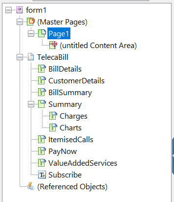
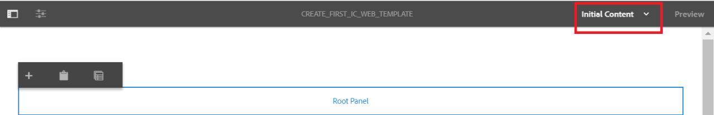

# Tutorial: Creación de plantillas{#tutorial-create-templates}

Este tutorial es un paso en la [serie Crear una primera comunicación](/help/forms/using/create-your-first-interactive-communication.md) interactiva. Se recomienda seguir la serie en secuencia cronológica para comprender, realizar y demostrar el caso de uso completo del tutorial.

Para crear una comunicación interactiva, debe tener plantillas disponibles en el servidor AEM para los canales web e impresos.

Las plantillas para el canal de impresión se crean en Adobe Forms Designer y se cargan en el servidor AEM. Estas plantillas están disponibles para su uso durante la creación de una comunicación interactiva.

Las plantillas para el canal web se crean en AEM. Los creadores y administradores de plantillas pueden crear, editar y habilitar plantillas web. Una vez creadas y habilitadas, estas plantillas están disponibles para su uso durante la creación de una comunicación interactiva.

Este tutorial lo acompaña a través de los pasos para crear plantillas para canales Web e impresos de modo que estén disponibles para su uso durante la creación de comunicaciones interactivas. Al final de este tutorial, podrá:

* Creación de plantillas XDP para el canal de impresión mediante Adobe Forms Designer
* Carga de plantillas XDP en el servidor de AEM Forms
* Crear y habilitar plantillas para el canal Web

## Crear plantilla para el canal de impresión {#create-template-for-print-channel}

Cree y gestione una plantilla para el canal de impresión de la comunicación interactiva mediante las siguientes tareas:

* [Creación de una plantilla XDP con Forms Designer](../../forms/using/create-templates-print-web.md#create-xdp-template-using-forms-designer)
* [Cargar plantilla XDP en el servidor de AEM Forms](../../forms/using/create-templates-print-web.md#upload-xdp-template-to-the-aem-forms-server)
* [Creación de una plantilla XDP para fragmentos de diseño](../../forms/using/create-templates-print-web.md#create-xdp-template-for-layout-fragments)

### Creación de una plantilla XDP con Forms Designer {#create-xdp-template-using-forms-designer}

En función del caso [de](/help/forms/using/create-your-first-interactive-communication.md) uso y de la [anatomía](/help/forms/using/planning-interactive-communications.md), cree los siguientes subformularios en la plantilla XDP:

* Detalles de la factura: Incluye un fragmento de documento
* Detalles del cliente: Incluye un fragmento de documento
* Resumen de facturación: Incluye un fragmento de documento
* Resumen: Incluye un fragmento de documento (subformulario Cargos) y un gráfico (subformulario Gráficos)
* Llamadas por elementos: Incluye una tabla (fragmento de diseño)
* Pagar ahora: Incluye una imagen
* Servicios de valor agregado: Incluye una imagen

Estos subformularios se muestran como áreas de destino en la plantilla Imprimir después de cargar el archivo XDP al servidor de Forms. Todas las entidades, como fragmentos de documento, gráficos, fragmentos de diseño e imágenes, se agregan a las áreas de destino al crear la comunicación interactiva.

Siga los pasos siguientes para crear una plantilla XDP para el canal Imprimir:

1. Abra el Diseñador de formularios, seleccione **Archivo** > **Nuevo** > **Utilizar un formulario en blanco,** toque **Siguiente** y, a continuación, **Finalizar** para abrir el formulario para la creación de plantillas.

   Asegúrese de que las opciones Biblioteca **de** objetos y **Objeto** están seleccionadas en el menú **Ventana** .

1. Arrastre y suelte el componente **Subformulario** desde la biblioteca **de** objetos al formulario.
1. Seleccione el subformulario para mostrar las opciones del subformulario en la ventana **Objeto** del panel derecho.
1. Seleccione la ficha **Subformulario** y seleccione **De posición variable** en la lista desplegable **Contenido** . Arrastre el extremo izquierdo del subformulario para ajustar la longitud.
1. En la ficha **Enlaces** :

   1. Especifique **BillDetails** en el campo **Nombre** .

   1. Seleccione **Sin enlace** de datos en la lista desplegable Enlace **de datos** .
   

1. Del mismo modo, seleccione el subformulario raíz, seleccione la ficha **Subformulario** y seleccione **De posición variable** en la lista desplegable **Contenido** . En la ficha **Enlaces** :

   1. Especifique **TelecaBill** en el campo **Nombre** .

   1. Seleccione **Sin enlace** de datos en la lista desplegable Enlace **de datos** .
   

1. Repita los pasos 2 a 5 para crear los subformularios siguientes:

   * Detalles de la factura
   * Detalles del cliente
   * Resumen de factura
   * Resumen: seleccione la ficha **Subformulario** y seleccione **Colocado** en la lista desplegable **Contenido** para este subformulario. Inserte los subformularios siguientes en el subformulario **Resumen** .

      * Cargos
      * Gráficos
   * ItemizedCalls
   * PayNow
   * ValueAddedServices
   Para ahorrar tiempo, también puede copiar y pegar subformularios existentes para crear nuevos subformularios.

   Para cambiar el subformulario **Gráficos** a la derecha del subformulario Cargos, seleccione el subformulario **Gráficos** en el panel izquierdo, seleccione la ficha **Presentación** y especifique un valor para el campo **AnclajeX** . El valor debe ser mayor que el valor del campo **Ancho** del subformulario **Cargos** . Seleccione el subformulario **Cargos** y seleccione la ficha **Presentación** para ver el valor del campo **Anchura** .

1. Arrastre y suelte el objeto **Texto** de la biblioteca **de** objetos en el formulario e introduzca el **Marcar XXXX para suscribirse** al texto del cuadro.
1. Haga clic con el botón derecho en el objeto de texto del panel izquierdo, seleccione **Cambiar nombre de objeto** e introduzca el nombre del objeto de texto como **Suscribirse**.

   

1. Seleccione **Archivo** > **Guardar como** para guardar el archivo en el sistema de archivos local:

   1. Vaya a la ubicación en la que desea guardar el archivo y especifique el nombre como **create_first_ic_print_template**.
   1. Seleccione **.xdp** en la lista desplegable **Guardar como tipo** .

   1. Toque **Guardar**.

### Cargar plantilla XDP en el servidor de AEM Forms {#upload-xdp-template-to-the-aem-forms-server}

Una vez creada una plantilla XDP con Forms Designer, debe cargarla en el servidor de AEM Forms para que la plantilla esté disponible para su uso durante la creación de la comunicación interactiva.

1. Seleccione **Formularios** > **Formularios y documentos**.
1. Toque **Crear** > Cargar **archivo**.

   Desplácese y seleccione la plantilla **create_first_ic_print_template** (XDP) y toque **Abrir** para importar la plantilla XDP al servidor de AEM Forms.

### Creación de una plantilla XDP para fragmentos de diseño {#create-xdp-template-for-layout-fragments}

Para crear un fragmento de diseño para el canal Imprimir de la comunicación interactiva, cree un XDP con Forms Designer y cárguelo en el servidor de AEM Forms.

1. Abra el Diseñador de formularios, seleccione **Archivo** > **Nuevo** > **Utilizar un formulario en blanco,** toque **Siguiente** y, a continuación, **Finalizar** para abrir el formulario para la creación de plantillas.

   Asegúrese de que las opciones Biblioteca **de** objetos y **Objeto** están seleccionadas en el menú **Ventana** .

1. Arrastre y suelte el componente **Tabla** desde la biblioteca **de** objetos al formulario.
1. En el cuadro de diálogo Insertar tabla:

   1. Especifique el número de columnas como **5**.
   1. Especifique el número de filas de trabajo como **1**.
   1. Seleccione la casilla de verificación **Incluir fila de encabezado en tabla** .
   1. Pulse **Aceptar**.

1. Puntee **+** en el panel izquierdo junto a la **Tabla** 1 y haga clic con el botón derecho en **Celda1** y seleccione **Cambiar el nombre del objeto** a **fecha**.

   Del mismo modo, cambie **Cell2**, **Cell3**, **Cell4** y **Cell5** por **Time************** ,Number, Durationy Charges, respectivamente.

1. Haga clic en los campos de texto Encabezado de la vista **de** Designer y cámbieles el nombre a **Hora**, **Número**, **Duración** y **Cargos**.

   

1. Seleccione **Fila 1** en el panel izquierdo y seleccione **Objeto** > **Enlace** > **Repetir fila para cada elemento** de datos.

   

1. Arrastre y suelte el componente Campo **de** texto desde la biblioteca **de** objetos hasta la vista **de** Designer.

   

   Del mismo modo, arrastre y suelte el componente Campo **de** texto en las filas **Tiempo**, **Número**, **Duración** y **Cargos** .

1. Seleccione **Archivo** > **Guardar como** para guardar el archivo en el sistema de archivos local:

   1. Vaya a la ubicación para guardar el archivo y especifique el nombre como **table_lf**.
   1. Seleccione **.xdp** en la lista desplegable **Guardar como tipo** .

   1. Toque **Guardar**.
   Una vez creada una plantilla XDP para un fragmento de diseño con Forms Designer, debe [cargarla](../../forms/using/create-templates-print-web.md#upload-xdp-template-to-the-aem-forms-server) en el servidor de AEM Forms para que la plantilla esté disponible para su uso durante la creación de fragmentos de diseño.

## Crear plantilla para canal Web {#create-template-for-web-channel}

Cree y administre una plantilla para el canal Web de comunicación interactiva mediante las siguientes tareas:

* [Crear carpeta para plantillas](../../forms/using/create-templates-print-web.md#create-folder-for-templates)
* [Crear la plantilla](../../forms/using/create-templates-print-web.md#create-the-template)
* [Habilitar la plantilla](../../forms/using/create-templates-print-web.md#enable-the-template)
* [Activación de botones en Interactive Communications](../../forms/using/create-templates-print-web.md#enabling-buttons-in-interactive-communications)

### Crear carpeta para plantillas {#create-folder-for-templates}

Para crear una plantilla de canal Web, defina una carpeta en la que puede guardar las plantillas creadas. Una vez que cree una plantilla dentro de esa carpeta, habilite la plantilla para permitir que los usuarios de los formularios creen un canal Web de una comunicación interactiva basada en la plantilla.

Siga los pasos siguientes para crear una carpeta para las plantillas editables:

1. Toque **Herramientas**  > **Navegador** de configuración.
1. En la página Navegador de configuración, toque **Crear**.
1. En el cuadro de diálogo **Crear configuración** , especifique **Create_First_IC_templates** como título para la carpeta, marque Plantillas **** editables y toque **Crear**.

   

   La carpeta **Create_First_IC_templates** se crea y se enumera en la página **Navegador** de configuración.

### Crear la plantilla {#create-the-template}

En función del caso [de](/help/forms/using/create-your-first-interactive-communication.md) uso y la [anatomía](/help/forms/using/planning-interactive-communications.md), cree los paneles siguientes en la plantilla web:

* Detalles de la factura: Incluye un fragmento de documento
* Detalles del cliente: Incluye un fragmento de documento
* Resumen de facturación: Incluye un fragmento de documento
* Resumen de cargos: Incluye un fragmento de documento y un gráfico (diseño de dos columnas)
* Llamadas por elementos: Incluye una tabla
* Pagar ahora: Incluye un botón **Pagar ahora** y una imagen
* Servicios de valor agregado: Incluye una imagen y un botón **Suscribirse** .

Todas las entidades, como fragmentos de documento, gráficos, tablas, imágenes y botones, se agregan al crear la comunicación interactiva.

Siga los pasos siguientes para crear una plantilla para el canal Web en la carpeta **Create_First_IC_templates** :

1. Vaya a la carpeta de plantillas adecuada seleccionando **Herramientas** > **Plantillas** > **Crear_primero_IC_plantillas** .
1. Toque **Crear**.
1. En el asistente **Seleccionar un tipo** de plantilla, seleccione Comunicación **interactiva - Canal** web y toque **Siguiente**.
1. En el asistente **de configuración Detalles** de plantilla, especifique **Create_First_IC_Web_Template** como título de plantilla. Especifique una descripción opcional y toque **Crear**.

   Mensaje de confirmación de que se muestra **Create_First_IC_Web_Template** .

1. Toque **Abrir** para abrir la plantilla en el editor de plantillas.
1. Seleccione Contenido **** inicial en la lista desplegable situada junto a la opción **Vista previa** .

   

1. Toque **Panel** raíz y, a continuación, toque **+** para ver la lista de componentes que puede agregar a la plantilla.
1. Seleccione **Panel** en la lista para agregar un panel sobre el panel **raíz**.
1. Seleccione la ficha **Contenido** en el panel izquierdo. El nuevo panel agregado en el paso 8 se muestra debajo del panel **raíz** en el árbol de contenido.

   

1. Seleccione el panel y toque  (Configurar).
1. En el panel Propiedades:

   1. Especifique los **detalles** de la publicidad en el campo Nombre.
   1. Especifique los detalles **de la** factura en el campo Título.
   1. Seleccione **1** en la lista desplegable **Número de columnas** .

   1. Toque  para guardar las propiedades.
   El nombre del panel se actualiza a Detalles **de** facturación en el árbol de contenido.

1. Repita los pasos 7 a 11 para agregar paneles con las siguientes propiedades a la plantilla:

   | Nombre | Título | Número de columnas |
   |---|---|---|
   | detalles del cliente | Detalles del cliente | 1 |
   | resumen de facturación | Resumen de facturación | 1 |
   | summaryfees | Resumen de cargos | 2 |
   | itemisedcall | Llamadas por elementos | 1 |
   | paynow | Pagar ahora | 2 |
   | lienzo | Servicios de valor agregado | 1 |

   La siguiente imagen muestra el árbol de contenido después de agregar todos los paneles a la plantilla:

   

### Habilitar la plantilla {#enable-the-template}

Una vez que haya creado la plantilla Web, debe habilitarla para utilizar la plantilla mientras crea la Comunicación interactiva.

Ejecute los siguientes pasos para habilitar la plantilla Web:

1. Puntee **Herramientas**  > **Plantillas**.
1. Vaya a la plantilla **Create_First_IC_Web_Template** , selecciónela y toque **Habilitar**.
1. Tab **Active** nuevamente para confirmar.

   La plantilla está habilitada y su estado se muestra como Habilitada. Puede utilizar esta plantilla al crear la comunicación interactiva para el canal Web.

### Activación de botones en Interactive Communications {#enabling-buttons-in-interactive-communications}

En función del caso de uso, debe incluir los botones **Pagar ahora** y **Suscribirse** (componentes de formularios adaptables) en Comunicación interactiva. Para habilitar el uso de estos botones en la comunicación interactiva, ejecute los siguientes pasos:

1. Seleccione **Estructura** en la lista desplegable situada junto a la opción **Vista previa** .
1. Seleccione el panel raíz **Contenedor** de documento mediante el árbol de contenido y toque **Política** para seleccionar los componentes que se pueden usar en la comunicación interactiva.

   

1. En la ficha Componentes **** permitidos de la sección **Propiedades** , seleccione **Botón** en los componentes del formulario **** adaptable.

   

1. Toque  para guardar las propiedades.