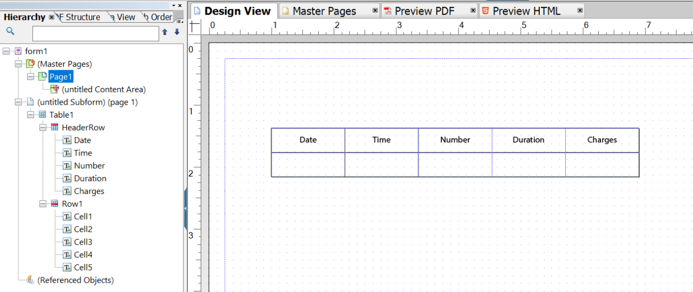

# Tutorial: Crear plantillas{#tutorial-create-templates}

Este tutorial es un paso en la serie [Crear su primera comunicación interactiva](/help/forms/using/create-your-first-interactive-communication.md). Se recomienda seguir la serie en secuencia cronológica para comprender, realizar y mostrar el caso de uso completo del tutorial.

Para crear una comunicación interactiva, debe tener plantillas disponibles en el servidor de AEM para los canales Imprimir y Web.

Las plantillas del canal Imprimir se crean en Adobe Forms Designer y se cargan en el servidor de AEM. Estas plantillas están disponibles para su uso durante la creación de una comunicación interactiva.

Las plantillas del canal Web se crean en AEM. Los autores y administradores de plantillas pueden crear, editar y habilitar plantillas web. Una vez creadas y habilitadas, estas plantillas están disponibles para usarlas durante la creación de una comunicación interactiva.

Este tutorial mostrará los pasos para crear plantillas para los canales Imprimir y Web para que estén disponibles para usarlas durante la creación de comunicaciones interactivas. Al final de este tutorial, podrá:

* Crear plantillas XDP para el canal Imprimir mediante Adobe Forms Designer
* Cargar las plantillas XDP al servidor de AEM Forms
* Crear y habilitar plantillas para el canal Web

## Crear plantillas para el canal Imprimir {#create-template-for-print-channel}

Cree y administre una plantilla para el canal Imprimir de una comunicación interactiva mediante las siguientes tareas:

* [Crear una plantilla XDP con Forms Designer](../../forms/using/create-templates-print-web.md#create-xdp-template-using-forms-designer)
* [Cargar una plantilla XDP en el servidor de AEM Forms](../../forms/using/create-templates-print-web.md#upload-xdp-template-to-the-aem-forms-server)
* [Creación de una plantilla XDP para fragmentos de diseño](../../forms/using/create-templates-print-web.md#create-xdp-template-for-layout-fragments)

### Crear una plantilla XDP con Forms Designer {#create-xdp-template-using-forms-designer}

En función del [caso de uso](/help/forms/using/create-your-first-interactive-communication.md) y la [anatomía](/help/forms/using/planning-interactive-communications.md), cree los siguientes subformularios en la plantilla XDP:

* Detalles de la factura: incluye un fragmento de documento
* Detalles del cliente: incluye un fragmento de documento
* Resumen de factura: incluye un fragmento de documento
* Resumen: incluye un fragmento de documento (subformulario Gastos) y un gráfico (subformulario Gráficos)
* Llamadas desglosadas: incluye una tabla (fragmento de diseño)
* Pagar ahora: incluye una imagen
* Servicios de valor agregado: incluye una imagen

Estos subformularios se muestran como áreas de destino en la plantilla Imprimir después de cargar el archivo XDP en el servidor de Forms. Todas las entidades, como fragmentos de documento, gráficos, fragmentos de diseño e imágenes, se agregan a las áreas de destino al crear la comunicación interactiva.

Para crear una plantilla XDP para el canal Imprimir, haga lo siguiente:

1. Abra Forms Designer y seleccione **Archivo** > **Nuevo** > **Utilizar un formulario en blanco,** select **Siguiente**, y luego seleccione **Finalizar** para abrir el formulario y crear plantillas.

   Asegúrese de que las opciones **Biblioteca de objetos** y **Objeto** se seleccionan en el menú **Ventana**.

1. Arrastre y suelte el componente **Subformulario** de la **Biblioteca de objetos** al formulario.
1. Seleccione el subformulario para poder ver sus opciones en la **Objeto** en el panel derecho.
1. Seleccione la pestaña **Subformulario** y luego seleccione **De posición variable** en la lista desplegable **Contenido**. Para ajustar la longitud, arrastre el extremo izquierdo del subformulario.
1. En la pestaña **Enlaces**:

   1. Especifique **BillDetails** en el campo **Nombre**.

   1. Seleccione **Sin enlace de datos** en la lista desplegable **Enlace de datos**.

   

1. Del mismo modo, seleccione el subformulario raíz, seleccione la pestaña **Subformulario** y seleccione **Flujo** de la lista desplegable **Contenido**. En la pestaña **Enlaces**:

   1. Especifique **TelecaBill** en el campo **Nombre**.

   1. Seleccione **Sin enlace de datos** en la lista desplegable **Enlace de datos**.

   

1. Repita del paso 2 al 5 para crear los siguientes subformularios:

   * BillDetails
   * CustomerDetails
   * BillSummary
   * Resumen: seleccione la pestaña **Subformulario** y seleccione **Colocado** de la lista desplegable **Contenido** para este subformulario. Inserte los siguientes subformularios en el subformulario **Resumen**.

      * Gastos
      * Gráficos

   * ItemisedCalls
   * PayNow
   * ValueAddedServices

   Para ahorrar tiempo, también puede copiar y pegar subformularios existentes para crear subformularios adicionales.

   Para cambiar el **Gráficos** subformulario a la derecha del subformulario Gastos, seleccione la **Gráficos** subformulario del panel izquierdo, seleccione la opción **Diseño** y especifique un valor para la pestaña **AnchorX** field. El valor debe ser mayor que el valor del campo **Anchura** para el subformulario **Gastos**. Seleccione el **Cargos** subformulario y seleccione **Diseño** para poder ver el valor de la variable **Ancho** field.

1. Arrastre y suelte el objeto **Texto** desde la **Biblioteca de objetos** hasta el formulario y escriba el texto **Marque XXXX para suscribirse** en el cuadro.
1. Haga clic con el botón derecho en el objeto de texto del panel izquierdo y seleccione **Cambiar nombre de objeto** y escriba el nombre para el objeto de texto como **Suscribirse**.

   

1. Seleccione **Archivo** > **Guardar como** para guardar el archivo en el sistema de archivos local:

   1. Vaya a la ubicación en la que puede guardar el archivo y especifique el nombre como **create_first_ic_print_template**.
   1. Seleccione **.xdp** en la lista desplegable **Guardar como tipo**.

   1. Seleccione **Guardar**.

### Cargar una plantilla XDP en el servidor de AEM Forms {#upload-xdp-template-to-the-aem-forms-server}

Una vez creada una plantilla XDP con Forms Designer, debe cargarla en el servidor de AEM Forms para que la plantilla esté disponible para usarla durante la creación de la comunicación interactiva.

1. Seleccione **[!UICONTROL Forms]** > **[!UICONTROL Formularios y documentos]**.
1. Seleccionar **Crear** > **Carga de archivos**.

   Desplácese y seleccione **create_first_ic_print_template** plantilla (XDP) y seleccione **Abrir** para importar la plantilla XDP en el servidor de AEM Forms.

### Creación de una plantilla XDP para fragmentos de diseño {#create-xdp-template-for-layout-fragments}

Para crear un fragmento de diseño para el canal Imprimir de la comunicación interactiva, cree un XDP con Forms Designer y cárguelo en el servidor de AEM Forms.

1. Abra Forms Designer y seleccione **Archivo** > **Nuevo** > **Utilizar un formulario en blanco,** select **Siguiente**, y luego seleccione **Finalizar** para abrir el formulario y crear plantillas.

   Asegúrese de que las opciones **Biblioteca de objetos** y **Objeto** se seleccionan en el menú **Ventana**.

1. Arrastre y suelte el componente **Tabla** desde la **Biblioteca de objetos** hasta el formulario.
1. En el cuadro de diálogo Insertar tabla:

   1. Especifique el número de columnas como **5**.
   1. Especifique el número de filas como **1**.
   1. Seleccione la casilla de verificación **Incluir fila de encabezado en la tabla**.
   1. Pulse **Aceptar**.

1. Seleccionar **+** en el panel izquierdo junto a **Tabla** 1 y haga clic con el botón derecho **Celda1** y seleccione **Cambiar nombre de objeto** hasta **Fecha**.

   Del mismo modo, cambie el nombre de **Cell2**, **Cell3**, **Cell4** y **Cell5** a **Hora**, **Número**, **Duración** y **Gastos** respectivamente.

1. Haga clic en los campos de texto del encabezado en la **Vista de Designer** y cambie sus nombres a **Tiempo**, **Número**, **Duración** y **Gastos**.

   

1. Seleccione **Fila 1** en el panel izquierdo y seleccione **Objeto** > **Enlace** > **Repetir fila para cada elemento de datos**.

   

1. Arrastre y suelte el componente **Campo de texto** desde la **Biblioteca de objetos** hasta la **Vista de Designer**.

   

   Del mismo modo, arrastre y suelte el **Campo de texto** al componente de **Hora**, **Número**, **Duración**, y **Cargos** filas.

1. Seleccione **Archivo** > **Guardar como** para guardar el archivo en el sistema de archivos local:

   1. Vaya a la ubicación en la que puede guardar el archivo y especifique el nombre como **table_lf**.
   1. Seleccione **.xdp** en la lista desplegable **Guardar como tipo**.

   1. Seleccione **Guardar**.

   Una vez creada una plantilla XDP para el fragmento de diseño con Forms Designer, debe [cargar](../../forms/using/create-templates-print-web.md#upload-xdp-template-to-the-aem-forms-server) Añádala al servidor de AEM Forms para que la plantilla esté disponible para usarla durante la creación de fragmentos de diseño.

## Creación de una plantilla para el canal Web {#create-template-for-web-channel}

Cree y administre una plantilla para el canal Web de comunicaciones interactivas mediante las siguientes tareas:

* [Crear carpeta para plantillas](../../forms/using/create-templates-print-web.md#create-folder-for-templates)
* [Crear la plantilla](../../forms/using/create-templates-print-web.md#create-the-template)
* [Habilitar la plantilla](../../forms/using/create-templates-print-web.md#enable-the-template)
* [Activar botones en las comunicaciones interactivas](../../forms/using/create-templates-print-web.md#enabling-buttons-in-interactive-communications)

### Crear una carpeta para plantillas {#create-folder-for-templates}

Para crear una plantilla del canal Web, defina una carpeta en la que pueda guardar las plantillas creadas. Una vez creada una plantilla dentro de esa carpeta, habilítela para permitir a los usuarios de los formularios crear un canal Web de una comunicación interactiva basada en la plantilla.

Para crear una carpeta para las plantillas editables, haga lo siguiente:

1. Seleccionar **Herramientas**  > **Explorador de configuración**.
   * Consulte la documentación del [Explorador de configuración](/help/sites-administering/configurations.md) para obtener más información.
1. En la página Explorador de configuración, seleccione **Crear**.
1. En el **Crear configuración** diálogo, especificar **Create_First_IC_templates** como título de la carpeta, marque **Plantillas editables** y seleccione **Crear**.

   

   La carpeta **Create_First_IC_templates** se crea y se enumera en la página **Explorador de configuración**.

### Crear la plantilla {#create-the-template}

En función del [caso de uso](/help/forms/using/create-your-first-interactive-communication.md) y la [anatomía](/help/forms/using/planning-interactive-communications.md), cree los siguientes paneles en la plantilla web:

* Detalles de la factura: incluye un fragmento de documento
* Detalles del cliente: incluye un fragmento de documento
* Resumen de factura: incluye un fragmento de documento
* Resumen de gastos: incluye un fragmento de documento y un gráfico (diseño de dos columnas)
* Llamadas desglosadas: incluye una tabla
* Pagar ahora: Incluye un botón **Pagar ahora** y una imagen
* Servicios de valor agregado: incluye una imagen y un botón **Suscribirse**.

Todas las entidades, como fragmentos de documento, gráficos, tablas, imágenes y botones, se agregarán al crear la comunicación interactiva.

Para crear una plantilla para el canal Web en **Create_First_IC_templates** , realice los siguientes pasos:

1. Vaya a la carpeta de plantillas adecuada seleccionando la **Herramientas** > **Plantillas** > **Create_First_IC_templates** carpeta.
1. Seleccione **Crear**.
1. En el **Elegir un tipo de plantilla** asistente de configuración, seleccione **Comunicación interactiva - Canal web** y seleccione **Siguiente**.
1. En el asistente de configuración **Detalles de la plantilla**, especifique **Create_First_IC_Web_Template** como título de la plantilla. Especifique una descripción opcional y seleccione **Crear**.

   Se mostrará el mensaje de confirmación **Create_First_IC_Web_Template**.

1. Seleccionar **Abrir** para abrir la plantilla en el editor de plantillas.
1. Seleccione **Contenido inicial** de la lista desplegable junto a la opción **Vista previa**.

   

1. Seleccionar **Panel raíz** y luego seleccione **+** para ver la lista de componentes que puede agregar a la plantilla.
1. Para agregar un panel encima de **Panel raíz**, seleccione **Panel** de la lista.
1. Seleccione la pestaña **Contenido** en el panel izquierdo. El panel nuevo agregado en el paso 8 se mostrará en **Panel raíz** en el árbol de contenido.

   

1. Seleccione el panel y seleccione  (Configurar).
1. En el panel Propiedades:

   1. Especifique **billdetails** en el campo Nombre.
   1. Especifique **Detalles de la factura** en el campo Título.
   1. Seleccione **1** de la lista desplegable **Número de columnas**.

   1. Para guardar las propiedades, seleccione .

   El nombre del panel se actualiza a **Detalles de la factura** en el árbol de contenido.

1. Repita del paso 7 al 11 para agregar paneles con las siguientes propiedades a la plantilla:

   | Nombre | Título | Número de columnas |
   |---|---|---|
   | customerdetails | Detalles del cliente | 1 |
   | billsummary | Resumen de la factura | 1 |
   | summarycharges | Resumen de gastos | 2 |
   | itemisedcalls | Llamadas desglosadas | 1 |
   | paynow | Pagar ahora | 2 |
   | vas | Servicios de valor agregado | 1 |

   La siguiente imagen representa el árbol de contenido después de agregar todos los paneles a la plantilla:

   

### Habilitar la plantilla {#enable-the-template}

Una vez creada la plantilla web, debe habilitarla para poder utilizarla al crear la comunicación interactiva.

Para habilitar la plantilla web, haga lo siguiente:

1. Seleccionar **Herramientas**  > **Plantillas**.
1. Vaya a **Create_First_IC_Web_Template** plantilla, selecciónela y seleccione **Activar**.
1. Seleccionar **Activar** de nuevo para confirmar.

   La plantilla está habilitada y su estado se muestra como Habilitada. Puede utilizar esta plantilla al crear la comunicación interactiva para el canal Web.

### Activar botones en las comunicaciones interactivas {#enabling-buttons-in-interactive-communications}

En función del caso de uso, debe incluir los botones **Pagar ahora** y **Suscribirse** (componentes de formularios adaptables) en la comunicación interactiva. Para habilitar el uso de estos botones en la comunicación interactiva, haga lo siguiente:

1. Seleccione **Estructura** de la lista desplegable junto a la opción **Vista previa**.
1. Seleccione el **Contenedor de documento** Panel raíz con el árbol de contenido y seleccione **Política** para seleccionar los componentes que se permiten utilizar en la comunicación interactiva.

   

1. En el **Componentes permitidos** de la pestaña **Propiedades** , seleccione **Botón** desde el **Formulario adaptable** componentes.

   

1. Para guardar las propiedades, seleccione .
