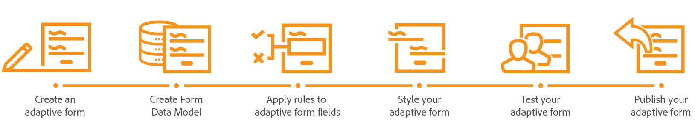

# Tutorial: Crear el primer formulario adaptable{#tutorial-create-your-first-adaptive-form}

## Introducción {#introduction}

¿Busca una experiencia **de** formularios adaptable para dispositivos móviles que simplifique la matriculación, aumente la participación y reduzca el tiempo de respuesta? Los formularios **** adaptables son ideales para usted. Los formularios adaptables proporcionan una experiencia de formularios móvil, de automatización y analítica. Puede crear fácilmente formularios que sean interactivos e interactivos, utilizar procesos automatizados para reducir las tareas administrativas y repetitivas y utilizar análisis de datos para mejorar y personalizar la experiencia que los clientes tienen con sus formularios.

Este tutorial proporciona un marco integral para crear un formulario adaptable. El tutorial está organizado en un caso de uso y en varias guías. Cada guía ayuda a conocer y agregar nuevas funciones al formulario adaptable que se crea en este tutorial. Tiene un formulario adaptable que funciona después de cada guía. La guía para crear un formulario adaptable está disponible. Las guías posteriores estarán disponibles en breve. Al final de este tutorial, podrá:

* Cree un formulario adaptable y un modelo de datos de formulario.
* Defina el estilo del formulario adaptable.
* Utilice el editor de reglas de formulario adaptable para crear reglas comerciales.
* Pruebe y publique un formulario adaptable.

El viaje comienza con el aprendizaje del caso de uso:

Un sitio web ofrece una gama de productos para diversos clientes. Los clientes exploran el portal, seleccionan y solicitan los productos. Cada cliente crea una cuenta y proporciona direcciones de envío y facturación. Una cliente existente, Sara Rose, está buscando agregar su dirección de envío al sitio web. El sitio web proporciona un formulario en línea para agregar y actualizar las direcciones de envío.

El sitio web se ejecuta en Adobe Experience Manager (AEM) y utiliza AEM Forms para la captura y el procesamiento de datos. El formulario de adición y actualización de direcciones es un formulario adaptable. El sitio web almacena los detalles del cliente en una base de datos. Utilizan el formulario de adición y actualización de direcciones para recuperar y mostrar las direcciones disponibles. También utilizan el formulario adaptable para aceptar direcciones nuevas y actualizadas.

### Requisitos previos {#prerequisite}

* Configure una instancia de creación de AEM.
* Instale el complemento  AEM Forms en la instancia de creación.
* Obtenga el controlador de base de datos JDBC (archivo JAR) del proveedor de base de datos. Los ejemplos del tutorial se basan en la base de datos MySQL y utilizan el controlador [de base de datos JDBC](https://dev.mysql.com/downloads/connector/j/5.1.html)MySQL de Oracle.

* Configure una base de datos que contenga datos de clientes con los campos que se muestran a continuación. Una base de datos no es esencial para crear un formulario adaptable. Este tutorial utiliza una base de datos para mostrar el modelo de datos de formulario y las capacidades de persistencia de AEM Forms.

## Paso 1: Creación de un formulario adaptable {#step-create-an-adaptive-form}

Los formularios adaptables son de nueva generación, atractivos, interactivos, dinámicos y adaptables. Mediante formularios adaptables, puede ofrecer experiencias personalizadas y con objetivos definidos. AEM Forms proporciona un editor WYSIWYG de arrastrar y soltar para crear formularios adaptables. Para obtener más información sobre los formularios adaptables, consulte [Introducción a la creación de formularios](../../forms/using/introduction-forms-authoring.md)adaptables.

Objetivos:

* Crear un formulario adaptable que permita al cliente agregar una dirección de envío
* Campos de diseño de un formulario adaptable para mostrar y aceptar información de un cliente
* Crear una acción de envío para enviar un correo electrónico con contenido de formulario
* Vista previa y envío de un formulario adaptable

## Step 2: Create Form Data Model {#step-create-form-data-model}

Un modelo de datos de formulario permite conectar un formulario adaptable a orígenes de datos dispares. Por ejemplo, perfil de usuario de AEM, servicios web RESTful, servicios web basados en SOAP, servicios OData y bases de datos relacionales. Un modelo de datos de formulario es un esquema de representación de datos unificado de entidades comerciales y servicios disponibles en orígenes de datos conectados. Puede utilizar el modelo de datos de formulario con un formulario adaptable para recuperar, actualizar, eliminar y agregar datos a orígenes de datos conectados.

Objetivos:

* Configurar la instancia de base de datos del sitio web (base de datos MySQL) como fuentes de datos
* Crear el modelo de datos de formulario utilizando la base de datos MySQL como origen de datos
* Agregar objetos de modelo de datos al modelo de datos de formulario
* Configuración de servicios de lectura y escritura para el modelo de datos de formulario
* Probar el modelo de datos de formulario y los servicios configurados con datos de prueba

## Paso 3: Aplicación de reglas a campos de formulario adaptables {#step-apply-rules-to-adaptive-form-fields}

Los formularios adaptables proporcionan un editor para escribir reglas en objetos de formulario adaptables. Estas reglas definen acciones para activar objetos de formulario en función de condiciones preestablecidas, entradas de usuario y acciones de usuario en el formulario. Ayuda a garantizar la precisión y acelera la experiencia de cumplimentación de formularios.

Objetivos:

* Creación y aplicación de reglas a campos de formulario adaptables
* Utilice reglas para activar los servicios del modelo de datos de formulario para actualizar datos a la base de datos

## Paso 4: Estilo del formulario adaptable {#step-style-your-adaptive-form}

Los formularios adaptables proporcionan temas y un [editor](../../forms/using/themes.md) para crear temas para los formularios adaptables. Un tema contiene detalles de estilo para componentes y paneles, y puede reutilizar un tema en diferentes formularios. Los estilos incluyen propiedades como colores de fondo, colores de estado, transparencia, alineación y tamaño. Al aplicar el tema al formulario, el estilo especificado se refleja en los componentes correspondientes del formulario. Los formularios adaptables también admiten estilos en línea para estilos específicos de un formulario.

Objetivos:

* Aplicar un tema predefinido a un formulario adaptable
* Creación de un tema para un formulario adaptable mediante el editor de temas
* Uso de fuentes web en un tema personalizado

## Paso 5: Probar el formulario adaptable {#step-test-your-adaptive-form}

Los formularios adaptables son esenciales para las interacciones con los clientes. Es importante probar los formularios adaptables con cada cambio que realice en ellos. Probar cada campo de un formulario es tedioso. AEM Forms proporciona un SDK (Calvin SDK) para automatizar la prueba de formularios adaptables. Calvin le permite automatizar la prueba de sus formularios adaptables en el navegador web.

Objetivos:

* Crear grupo de pruebas para el formulario adaptable
* Creación de casos de prueba para formularios adaptables
* Ejecutar los casos de prueba

## Paso 6: Publicación del formulario adaptable {#step-publish-your-adaptive-form}

Los formularios adaptables se pueden publicar como formularios independientes (aplicación de una sola página), incluir en la página [de](/help/forms/using/embed-adaptive-form-aem-sites.md)sitios de AEM o enumerar en un sitio de AEM mediante [Forms Portal](../../forms/using/introduction-publishing-forms.md).

Objetivos:

* Publicación del formulario adaptable como página de AEM
* Incrustar el formulario adaptable en una página Sitios de AEM
* Incrustar el formulario adaptable en una página web externa (una página web que no es de AEM alojada fuera de AEM)

