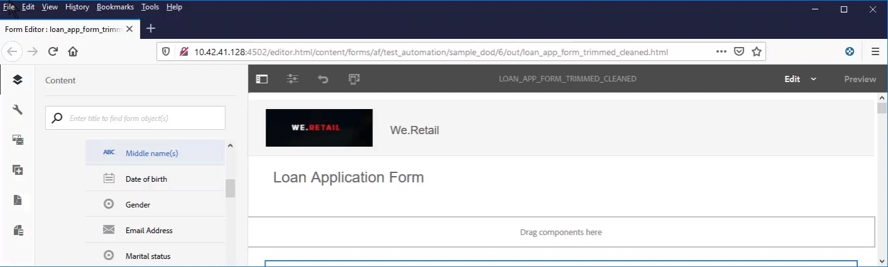

# Creación de formularios adaptables accesibles{#creating-accessible-adaptive-forms}

## Introducción {#introduction}

Un formulario accesible es un formulario que todos pueden utilizar, incluidos los usuarios con necesidades especiales. Forms adaptable incluye una serie de funciones y funciones que mejoran el uso para usuarios con diferentes capacidades. La generación de accesibilidad en formularios adaptables no sólo permite la mayor audiencia posible para el contenido, sino que también es un requisito para proporcionar documentos en áreas geográficas donde se exige el cumplimiento de los estándares de accesibilidad. Los desarrolladores de formularios de ayuda de AEM Forms cumplen los estándares de accesibilidad.

Durante la creación de un formulario adaptable, el autor debe tener en cuenta los siguientes puntos para crear un formulario adaptable accesible:

* Comprobar el formulario con la herramienta de prueba de accesibilidad Nombre accesible y Inspector de descripción (ANDI)
* Proporcionar etiquetas adecuadas para los controles de formulario
* Proporcionar equivalentes de texto para imágenes
* Proporcionar suficiente contraste de color
* Asegúrese de que los controles de formulario son accesibles mediante el teclado

## Requisitos previos

Se requiere una herramienta de accesibilidad como **Inspector de nombre y descripción accesible (ANDI)** y un **tema de formulario adaptable desarrollado para solucionar problemas relacionados con la accesibilidad** para crear un formulario adaptable accesible.

### Descargar e instalar la herramienta de prueba de accesibilidad

La herramienta de identificación accesible (ANDI) le ayuda a identificar y corregir problemas relacionados con el cumplimiento de la accesibilidad en el contenido web. Es la herramienta recomendada bajo las directrices de Trusted Tester v5 del Departamento de Seguridad Nacional. Es desarrollado por el departamento de &#x200B; de la Administración de Seguridad Social de los Estados Unidos para verificar el cumplimiento de la Sección 508 del contenido de la web. La herramienta:

* Ayuda a detectar problemas de accesibilidad &#x200B; en una página web
* Proporciona sugerencias para mejorar la &#x200B; de accesibilidad
* Detecta problemas de accesibilidad del teclado y contraste del color
* Identifica claramente el contenido del lector de pantalla de conformidad con los estándares

ANDI trabaja con todos los exploradores de Internet más importantes. Consulte la [documentación de ANDI](https://www.ssa.gov/accessibility/andi/help/install.html) para obtener instrucciones detalladas sobre cómo configurar y utilizar la herramienta.

### Descargar e instalar el tema Ultramarine-Accessible

El tema Ultramarine-Accesible es un tema de referencia. Ayuda a demostrar cómo corregir el contraste de color y otros problemas relacionados con la accesibilidad en un formulario adaptable. Adobe recomienda crear un tema personalizado para el entorno de producción en función de los estilos aprobados por su organización. Realice los siguientes pasos para cargar el tema en la instancia de AEM:

1. Descargue el paquete de temas.
1. Vaya a **[!UICONTROL Experience Manager]** > **[!UICONTROL Navegación]**  > **[!UICONTROL Forms]** en la instancia de AEM.
1. Toque **[!UICONTROL Crear]** > **[!UICONTROL Carga de archivo]**. Seleccione y cargue el archivo x Ultramarine-Accessible-Theme.zip. Carga el tema en la instancia de AEM.

## Hacer accesible un formulario adaptable

Debe centrarse en cuatro aspectos clave: navegación mediante el teclado, contraste de color, texto alternativo significativo para imágenes y etiquetas adecuadas para los controles de formulario para hacer accesible un formulario adaptable. Siga estos pasos para hacer accesibles los formularios adaptables existentes:

### 1. Aplicar un tema accesible y realizar correcciones adicionales

Aplique el tema Ultramarina-Accesible a su formulario adaptable existente. Para aplicar el tema:

1. Abra el formulario adaptable para editarlo.
1. Seleccione un componente y toque el icono principal. En el menú contextual, toque **[!UICONTROL Contenedor de formulario adaptable]** y, a continuación, toque el icono de configuración.
1. Seleccione el tema Ultramarina accesible en el navegador de propiedades y toque el icono **[!UICONTROL Guardar]**.
1. Actualice la ventana del explorador. El tema se aplica al formulario adaptable.

Después de aplicar un tema accesible, realice las siguientes correcciones adicionales. Las correcciones se añaden a las correcciones de accesibilidad que se tratan en el tema accesible:

1. Añada un texto alternativo significativo para la imagen del logotipo en el formulario adaptable.

   Proporcione un texto alternativo significativo para las imágenes de los componentes de encabezado y pie de página de la plantilla de formulario adaptable. Cuando se corrige la plantilla y se utiliza para crear un formulario adaptable, los formularios adaptables heredan todas las correcciones de accesibilidad relacionadas con el encabezado y el pie de página de la plantilla.  Para un formulario adaptable existente, realice cambios a nivel de formulario adaptable. Los cambios realizados en una plantilla de formulario adaptable no fluyen automáticamente a un formulario adaptable existente.

1. Añada un componente de encabezado que contenga el nombre del formulario en el formulario adaptable. Si el diseño de formulario especifica un nombre de compañía, agregue también un componente de encabezado independiente para el nombre de la compañía.

   La mayoría de las herramientas de accesibilidad informan a los usuarios sobre la jerarquía del contenido para ayudarles a comprender la estructura de la página web. Defina diferentes niveles de encabezado para el nombre de organización y el texto del nombre del formulario en el formulario adaptable para proporcionar una estructura jerárquica a este texto. Además, utilice un componente Texto antes de cada panel y sección con un nivel de encabezado adecuado para crear una jerarquía.

   

1. Cambie el color de fondo del pie de página para utilizar el contraste adecuado de acuerdo con los estándares de accesibilidad a fin de mejorar la visibilidad y legibilidad del texto. Puede utilizar ANDI para buscar problemas de contraste de color en el formulario. Además, no utilice fuentes muy pequeñas. Las fuentes pequeñas son difíciles de leer.

1. Reemplace los componentes switch y de elección de imagen del formulario adaptable existente con el componente de opción (radio).

1. Reemplace el componente de paso numérico del formulario adaptable existente con el componente de cuadro numérico.

1. Reemplazar el campo de entrada de fecha con el campo del selector de fecha.

1. Defina patrones de visualización, validación y edición para el componente del selector de fechas. Asimismo, configure un mensaje de error de validación personalizado. Por ejemplo, ha especificado una fecha no válida. El formato correcto de la fecha es AAAA-MM-DD.

1. Configure el texto de accesibilidad personalizado para el componente del selector de fechas. Por ejemplo, introduzca la fecha de nacimiento. Los lectores de pantalla leen estos textos de accesibilidad personalizados.

1. Utilice una descripción breve en lugar de una descripción larga para los componentes de formulario adaptables. Una descripción larga agrega el botón de ayuda. Asegúrese de que el formulario adaptable no tenga ningún botón de ayuda.

1. Añada el texto de accesibilidad personalizado en todas las celdas de solo lectura de las tablas. Además, deshabilite todas las celdas de sólo lectura de las tablas.

1. Elimine los campos de firma de garabatos, si los hay, en el formulario adaptable. Configure el formulario adaptable para que utilice Adobe Sign para una experiencia de firma digital optimizada.

### 2. Proporcionar etiquetas adecuadas para los controles de formulario {#provide-proper-labels-for-form-controls}

La etiqueta o el título de un componente identifica lo que representa el componente de formulario. Por ejemplo, el texto &quot;Nombre&quot; indica a los usuarios que deben introducir su nombre en un campo de texto. Para que los lectores de pantalla puedan acceder a ella, la etiqueta se asocia mediante programación a un componente de formulario. Como alternativa, el control de formulario se configura con información de accesibilidad adicional.

La etiqueta percibida por los lectores de pantalla no tiene por qué ser necesariamente la misma que la del rótulo visual. En algunos casos, es posible que desee ser más específico sobre el propósito del control. Para cada objeto de campo de un formulario, las opciones de accesibilidad se pueden utilizar para especificar lo que el lector de pantalla anuncia para identificar el campo de formulario específico.

Para utilizar la opción Accesibilidad, siga estos pasos:

1. Seleccione un componente y toque .
1. Haga clic en **[!UICONTROL Accesibilidad]** en la barra lateral para elegir la opción de accesibilidad deseada.

### Opciones de accesibilidad en componentes de formulario {#accessibility-options-in-form-components}

**Los autores** de formularios de texto personalizados proporcionan el contenido en la opción de accesibilidad Campo de texto personalizado. La tecnología de asistencia, como los lectores de pantalla, utiliza este texto personalizado. El uso del ajuste Título es la mejor opción en la mayoría de los escenarios. Considere la posibilidad de crear Texto personalizado del Reader de pantalla solo cuando utilice el Título o no sea posible una descripción breve.

**Breve** descripciónPara la mayoría de los componentes, la breve descripción aparece en tiempo de ejecución cuando el usuario sitúa el puntero sobre el componente. Puede definir esta opción en el campo de descripción breve, en la opción de contenido de ayuda.

**** TítuloUtilice esta opción para permitir que AEM Forms utilice la etiqueta visual asociada al campo de formulario como texto del lector de pantalla.

**** NombrePuede especificar un valor en el campo Nombre de la ficha Enlace. El nombre no puede contener espacios.

**** NingunoAl seleccionar Ninguno, el objeto de formulario no tiene un nombre en el formulario publicado. Ninguno no es una configuración recomendada para los controles de formulario.

>[!NOTE]
>
>* Los botones de opción y las casillas de verificación solo pueden tener dos opciones de accesibilidad, a saber, Texto personalizado y Título.
>* En el caso de los formularios adaptables basados en XFA, la opción de accesibilidad se hereda de las opciones de accesibilidad definidas en el XDP. La información del objeto de XDP se asigna a la descripción corta y el rótulo se asigna al título. Las demás opciones funcionan tal cual.

### 3. Proporcionar equivalentes de texto para imágenes {#provide-text-equivalents-for-images}

Las imágenes pueden ayudar a mejorar la comprensión de algunos usuarios. Sin embargo, para los usuarios que utilizan lectores de pantalla, las imágenes reducen la accesibilidad del formulario. Si decide utilizar imágenes, proporcione descripciones de texto para todas las imágenes.

Asegúrese de que el texto describe el objeto y su propósito en el formulario. Un lector de pantalla lee este texto alternativo cuando encuentra una imagen. Una imagen siempre debe tener un texto alternativo especificado.

Seleccione un componente de imagen y toque . En la barra lateral, en Propiedades, especifique el texto alternativo de una imagen.

### 4. Proporcionar suficiente contraste de color {#provide-sufficient-color-contrast}

El diseño de accesibilidad implica considerar directrices adicionales para el uso del color. Los autores de formularios pueden utilizar colores para mejorar el aspecto de los formularios, resaltando varios componentes del formulario. Sin embargo, un uso incorrecto del color puede hacer que una forma sea difícil o imposible de leer para personas con diferentes capacidades.

Los usuarios con deficiencias visuales se basan en un alto contraste entre el texto y el fondo para leer contenido digital. Sin un contraste suficiente, un formulario puede resultar difícil, si no imposible, de leer para algunos usuarios.

Se recomienda utilizar los colores predeterminados de fuente y fondo (contenido en color negro sobre fondo blanco). Si cambia los colores predeterminados, elija un color de primer plano oscuro en un color de fondo claro o viceversa.

Consulte [Creación de temáticas personalizadas para formularios adaptables](/help/forms/using/creating-custom-adaptive-form-themes.md) para obtener más información sobre cómo cambiar el color del contraste y el tema de los formularios adaptables.

### 5. Asegúrese de que los controles de formulario sean accesibles mediante el teclado {#ensure-that-form-controls-are-keyboard-accessible}

Un formulario accesible se puede rellenar completamente utilizando solo el teclado o un dispositivo de entrada equivalente. Los usuarios con movilidad reducida o con problemas de visión pueden no tener más opción que utilizar el teclado y muchos usuarios que pueden utilizar el ratón prefieren la entrada del teclado. Al permitir los distintos métodos de entrada, no solo se crean formularios accesibles, sino que también se crean formularios que se adaptan mejor a las preferencias de todos los usuarios.

Los siguientes métodos abreviados de teclado están disponibles en AEM Forms.

| Acción | Método abreviado de teclado |
|---|---|
| Mover el cursor hacia delante a través de un formulario | Ficha |
| Mover el cursor hacia atrás a través de un formulario | Mayús + Tab |
| Desplazarse al panel siguiente | Alt+Flecha derecha |
| Desplazarse al panel anterior | Alt+Flecha izquierda |
| Restablecer los datos rellenados en un formulario | Alt + R |
| Enviar un formulario | Alt + S |

## Utilice la herramienta de accesibilidad para encontrar los problemas de accesibilidad restantes

El Inspector de nombre y descripción accesible (ANDI) ayuda a identificar y corregir problemas relacionados con el cumplimiento de la accesibilidad en un formulario adaptable. Para utilizar la herramienta ANDI para encontrar los problemas de accesibilidad en un formulario adaptable:

1. Abra el formulario adaptable en modo de previsualización.
1. Haga clic en el icono de la herramienta ANDI con marcador. La herramienta ANDI analiza el formulario adaptable y muestra problemas de accesibilidad. Para obtener más información sobre cómo utilizar la herramienta, consulte la [documentación de ANDI](https://www.ssa.gov/accessibility/andi/help/howtouse.html).
1. Revise y corrija los problemas informados por ANDI.