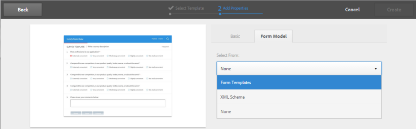

# Creación de un formulario adaptable {#creating-an-adaptive-form}

## <strong>Creación de un formulario</strong> adaptable {#strong-create-an-adaptive-form-strong}

Siga estos pasos para crear un formulario adaptable.

1. Acceso a la instancia de AEM Forms Author en `https://[server]:[port]/<custom-context-if-any>.`

1. Introduzca sus credenciales en la página de inicio de sesión de AEM.

   Después de iniciar sesión, en la esquina superior izquierda, toque **[!UICONTROL Adobe Experience Manager > Formularios > Formularios y documentos]**.

   >[!NOTE]
   >
   >Para una instalación predeterminada, el inicio de sesión es `admin` y la contraseña es `admin`.

1. Toque **[!UICONTROL Crear]** y seleccione Formulario **** adaptable.
1. Aparece una opción para seleccionar una plantilla. Para obtener más información acerca de las plantillas, consulte Plantillas de formulario [adaptables](/help/forms/using/creating-adaptive-form.md#p-adaptive-form-templates-p). Toque una plantilla para seleccionarla y toque Siguiente.
1. Aparece una opción para &#39;Agregar propiedades&#39;. Especifique los valores de los siguientes campos de propiedad. Los campos Título y Nombre son obligatorios:

   * **** Título: Especifica el nombre para mostrar del formulario. El título le ayuda a identificar el formulario en la interfaz de usuario de AEM Forms.
   * **** Nombre: Especifica el nombre del formulario. En el repositorio se crea un nodo con el nombre especificado. A medida que comienza a escribir un título, se genera automáticamente el valor del campo de nombre. Puede cambiar el valor sugerido. El campo de nombre solo puede incluir caracteres alfanuméricos, guiones y guiones bajos. Todas las entradas no válidas se reemplazan con un guión.
   * **** Descripción: Especifica la información detallada sobre el formulario.
   * **** Etiquetas: Especifica etiquetas para identificar de forma exclusiva el formulario adaptable. Las etiquetas ayudan a buscar en el formulario. Para crear etiquetas, escriba nuevos nombres de etiquetas en el cuadro **Etiquetas** .

1. Puede crear un formulario adaptable basado en uno de los siguientes modelos de formulario:

   * [Modelo de datos de formulario](#fdm)
   * [Plantilla de formulario XFA](/help/forms/using/creating-adaptive-form.md#p-create-an-adaptive-form-based-on-an-xfa-form-template-p)
   * [Esquema XML o JSON](/help/forms/using/creating-adaptive-form.md#p-create-an-adaptive-form-based-on-xml-or-json-schema-p)
   * Ninguno o sin ningún modelo de formulario
   Puede configurarlas desde la ficha Modelo de **[!UICONTROL formulario]** de la página **[!UICONTROL Agregar propiedades]** . De forma predeterminada, el modelo de formulario seleccionado es **[!UICONTROL Ninguno]**.

1. Toque **Crear**. Se crea un formulario adaptable y aparece un cuadro de diálogo para abrir el formulario y editarlo.

   Una vez que haya terminado de especificar todas las propiedades, haga clic en **[!UICONTROL Crear]**. Se crea un formulario adaptable y aparece un cuadro de diálogo para abrir el formulario y editarlo.

   Una vez que haya terminado de especificar todas las propiedades, haga clic en **[!UICONTROL Crear]**. Se crea un formulario adaptable y aparece un cuadro de diálogo para abrir el formulario y editarlo.

1. Toque **[!UICONTROL Abrir]** para abrir el formulario recién creado en una nueva ficha. El formulario se abre para su edición y muestra el contenido disponible en la plantilla. También muestra la barra lateral para personalizar el formulario recién creado según las necesidades.

   En función del tipo de formulario adaptable, los elementos de formulario presentes en la plantilla de formulario XFA, el esquema XML o el esquema JSON asociados se muestran en la ficha Objetos **[!UICONTROL del modelo de]** datos del navegador **[!UICONTROL de]** contenido en la barra lateral. También puede arrastrar y soltar estos elementos para crear el formulario adaptable.

   Para obtener información sobre la interfaz de creación de formularios adaptables y los componentes disponibles, consulte [Introducción a la creación de formularios](/help/forms/using/introduction-forms-authoring.md)adaptables.

   >[!NOTE] {grayBox=&quot;true&quot;}
   >
   >Permite que las ventanas emergentes del navegador abran el formulario recién creado en una nueva ficha.

## Creación de un formulario adaptable basado en un modelo de datos de formulario {#fdm}

[La integración](/help/forms/using/data-integration.md) de datos de AEM Forms permite integrar varios orígenes de datos y unir sus entidades y servicios para crear un modelo de datos de formulario. Es una extensión del esquema JSON. Puede utilizar un modelo de datos de formulario para crear un formulario adaptable. Las entidades u objetos del modelo de datos configurados en un modelo de datos de formulario están disponibles como objetos del modelo de datos para la creación de formularios. Se enlazan a las fuentes de datos respectivas y se utilizan para rellenar previamente un formulario y escribir los datos enviados de vuelta a las fuentes de datos respectivas. También puede invocar servicios configurados en un modelo de datos de formulario mediante reglas de formulario adaptables.

Para utilizar un modelo de datos de formulario para crear un formulario adaptable:

1. En la ficha Modelo de formulario de la pantalla Agregar propiedades, seleccione Modelo **[!UICONTROL de datos de]** formulario en la lista desplegable **[!UICONTROL Seleccionar desde]** .

   

1. Puntee para expandir **[!UICONTROL Seleccionar modelo]** de datos de formulario. Se muestran todos los modelos de datos de formulario disponibles.

   Seleccione un modelo de datos de.

   

>[!NOTE]
>
>También puede cambiar el modelo de datos de formulario para un formulario adaptable. Para ver los pasos detallados, consulte [Editar propiedades del modelo de formulario de un formulario](#edit-form-model)adaptable.

## Creación de un formulario adaptable basado en una plantilla de formulario XFA {#create-an-adaptive-form-based-on-an-xfa-form-template}

Puede reutilizar las plantillas de formulario XFA para crear formularios adaptables. Para reutilizar, cargue y asocie una plantilla de formulario XFA con un formulario adaptable. Los elementos de la plantilla de formulario (formulario XFA) están disponibles para su uso en el buscador de contenido en el momento de la creación de formularios adaptables. Desde Content Finder, puede arrastrar y soltar los elementos de la plantilla de formulario en el formulario.

>[!NOTE]
>
>[Cargue la plantilla](/help/forms/using/get-xdp-pdf-documents-aem.md) de formulario XFA en AEM Forms antes de empezar a crear un formulario adaptable basado en la plantilla de formulario.

Para utilizar una plantilla de formulario XFA como modelo de formulario para el formulario adaptable, haga lo siguiente:

1. En la página **[!UICONTROL Agregar propiedades]** , abra la ficha Modelo **[!UICONTROL de formulario]** .
1. En la ficha Modelo de formulario, en la lista desplegable, seleccione Plantillas **[!UICONTROL de formulario]**. Todas las plantillas de formulario cargadas en el repositorio mediante la interfaz de usuario de AEM Forms se muestran para su selección. Seleccione una plantilla de la lista.

   
   **** Figura: *Selección de una plantilla de formulario*

   >[!NOTE]
   >
   >También puede cambiar la plantilla de formulario para un formulario adaptable. Para ver los pasos detallados, consulte [Editar propiedades del modelo de formulario de un formulario](#edit-form-model)adaptable.

## Creación de un formulario adaptable basado en un esquema XML o JSON {#create-an-adaptive-form-based-on-xml-or-json-schema}

Los esquemas XML y JSON representan la estructura en la que el sistema back-end de la organización produce o consume los datos. Puede asociar un esquema a un formulario adaptable y utilizar sus elementos para agregar contenido dinámico al formulario adaptable. Los elementos del esquema están disponibles en la ficha Objeto del modelo de datos del navegador de contenido para la creación de formularios adaptables. Puede arrastrar y soltar los elementos de esquema para crear el formulario.

Consulte los siguientes documentos para comprender cómo diseñar un esquema XML o JSON para crear formularios adaptables.

* [Creación de formularios adaptables mediante un esquema XML](/help/forms/using/adaptive-form-xml-schema-form-model.md)
* [Creación de formularios adaptables mediante el esquema JSON](/help/forms/using/adaptive-form-json-schema-form-model.md)

Para utilizar el esquema XML o JSON como modelo de formulario para un formulario adaptable, haga lo siguiente:

1. En el paso **[!UICONTROL Agregar propiedades]** de la página de creación de formularios adaptables, toque la ficha Modelo **[!UICONTROL de]** formularios.
1. En la ficha Modelo de formulario, seleccione **[!UICONTROL Esquema]** en el campo desplegable **[!UICONTROL Seleccionar desde]** .

1. Toque **[!UICONTROL Seleccionar esquema]** y realice una de las siguientes acciones:

   * **[!UICONTROL Cargar desde el disco]** : seleccione esta opción y toque Cargar definición de esquema para buscar y cargar un esquema XML o un esquema JSON desde el sistema de archivos. El archivo de esquema cargado reside con el formulario y no es accesible para otros formularios adaptables.
   * **[!UICONTROL Buscar en el repositorio]** : seleccione esta opción para seleccionar de la lista de archivos de definición de esquema disponibles en el repositorio. Seleccione el archivo de esquema XML o JSON como modelo de formulario. El esquema seleccionado se asociará al formulario por referencia y será accesible para su uso en otros formularios adaptables.
   >[!CAUTION] {grayBox=&quot;true&quot;}
   >
   >Asegúrese de que el nombre de archivo del esquema JSON termina con **.schema.json**. Por ejemplo: mySchema.schema.json

   
   **** Figura: *Selección del esquema XML o JSON*

1. (Solo para el esquema XML) Después de seleccionar o cargar un esquema XML, especifique un elemento raíz del archivo XSD seleccionado para asignarlo al formulario adaptable.

   
   **** Figura: *Selección del elemento raíz XSD*

>[!NOTE]
>
>También puede cambiar el esquema de un formulario adaptable. Para ver los pasos detallados, consulte [Editar propiedades del modelo de formulario de un formulario](#edit-form-model)adaptable.

## Plantillas de formulario adaptables {#adaptive-form-templates}

Una plantilla proporciona una estructura básica y define el aspecto (diseños y estilos) de un formulario adaptable. Tiene componentes con formato previo que contienen determinadas propiedades y estructura de contenido. De forma predeterminada, AEM Forms proporciona algunas plantillas de formulario adaptables. Para obtener el paquete completo de plantillas, incluidas las plantillas avanzadas, debe instalar el paquete del complemento AEM Forms. Para obtener más información, consulte [Instalación del paquete](/help/forms/using/installing-configuring-aem-forms-osgi.md)del complemento AEM Forms.

Además, puede utilizar el editor de plantillas para crear sus propias plantillas. Para obtener más información sobre el trabajo con plantillas, consulte Plantillas de formulario [adaptables](/help/forms/using/template-editor.md).

>[!NOTE]
>
>Cuando se abre un formulario adaptable creado con la plantilla avanzada para edición, aparece un mensaje de error. La plantilla avanzada tiene un componente Paso de firma y Adobe Sign está habilitado para ella de forma predeterminada. Cree y seleccione una configuración [de nube de](/help/forms/using/adobe-sign-integration-adaptive-forms.md) Adobe Sign y [configure un firmante](/help/forms/using/working-with-adobe-sign.md#main-pars-header-1374317451) para resolver el error.

## Editar propiedades del modelo de formulario de un formulario adaptable {#edit-form-model}

Los formularios adaptables se crean sin un modelo de formulario (con la opción Ninguno para el modelo de formulario) o con un modelo de formulario como una plantilla de formulario, un esquema XML o JSON o un modelo de datos de formulario. Puede cambiar el modelo de formulario para un formulario adaptable de Ninguno a otro modelo de formulario. Para los formularios adaptables basados en un modelo de formulario, puede elegir otra plantilla de formulario, un esquema XML, un esquema JSON o un modelo de datos de formulario para el mismo modelo de formulario. Sin embargo, no puede cambiar de un modelo de formulario a otro.

1. Seleccione el formulario adaptable y toque el icono **Propiedades** .
1. Abra la ficha Modelo **[!UICONTROL de formulario]** y realice una de las acciones siguientes.

   * Si el formulario adaptable no tiene un modelo de formulario, puede elegir otro modelo de formulario y, en consecuencia, seleccionar una plantilla de formulario, un esquema XML o JSON o un modelo de datos de formulario.
   * Si el formulario adaptable se basa en un modelo de formulario, puede elegir otra plantilla de formulario, un esquema XML o JSON o un modelo de datos de formulario para el mismo modelo de formulario.

1. Toque **[!UICONTROL Guardar]** para guardar las propiedades.

## Guardar automáticamente un formulario adaptable {#auto-save-an-adaptive-form}

De forma predeterminada, el contenido de un formulario adaptable se guarda en una acción del usuario, como al pulsar el botón Guardar. También puede configurar un formulario adaptable para que empiece a guardar automáticamente el contenido en función de un evento o un intervalo de tiempo. La opción de guardado automático es útil en:

* Guardar automáticamente el contenido para usuarios anónimos e iniciados en sesión
* Guardado del contenido de un formulario sin la intervención mínima del usuario
* Comenzar a guardar el contenido de un formulario basado en un suceso de usuario
* Guardar el contenido de un formulario repetidamente después de un intervalo de tiempo especificado

### Habilitar guardado automático para un formulario adaptable {#enable-auto-save-for-an-adaptive-form}

De forma predeterminada, la opción de guardado automático no está activada. Puede activar la opción de guardado automático desde la ficha Guardar automáticamente de un formulario adaptable. La ficha Guardado automático también proporciona otras opciones de configuración. Realice los siguientes pasos para habilitar y configurar la opción de guardado automático para un formulario adaptable:

1. Para acceder a la sección de guardado automático de las propiedades, seleccione un componente, toque  > Contenedor **[!UICONTROL de formulario]** adaptable y, a continuación, toque .
1. En la sección Guardar **** automáticamente, **[!UICONTROL active]** la opción de guardar automáticamente.
1. En el cuadro Evento **[!UICONTROL de formulario]** adaptable, especifique 1 o TRUE para empezar a guardar automáticamente el formulario cuando se carga en el explorador. También puede especificar una expresión condicional para un suceso, que cuando se activa y devuelve true, comienza a guardar el contenido del formulario.
1. Especifique el activador. El guardado automático se activa según la configuración. Sus opciones son:

   * **** Basado en el tiempo: Seleccione la opción para empezar a guardar el contenido en función de un intervalo de tiempo específico.
   * **** Basado en eventos: Seleccione la opción para empezar a guardar el contenido en función del momento en que se activa un evento.
   Al seleccionar un activador, se activa el cuadro Configuración de estrategia. El cuadro Configuración de estrategia permite:

   * Especifique un intervalo de tiempo si selecciona un activador basado en **[!UICONTROL tiempo]** .
   * Especifique un nombre de evento si selecciona un activador basado en **[!UICONTROL eventos]** .
   También puede crear y agregar su propia estrategia personalizada a la lista. Para obtener más información, consulte [Implementación de una estrategia personalizada para guardar automáticamente los formularios](/help/forms/using/auto-save-an-adaptive-form.md#p-implement-a-custom-strategy-to-enable-autosave-for-adaptive-forms-p).

1. (Solo guardado automático basado en el tiempo) Realice los siguientes pasos para configurar las opciones de guardado automático basado en el tiempo.

   1. En el cuadro Guardar **[!UICONTROL automáticamente en este intervalo]** , especifique el intervalo de tiempo en segundos. El formulario se guarda repetidamente después de que transcurra el número de segundos especificado en el cuadro de intervalo.

1. (Solo guardado automático basado en eventos) Siga los pasos siguientes para configurar las opciones de guardado automático basado en eventos.

   1. En el cuadro Guardar **automáticamente después de este evento** , especifique un evento [GuideBridge](https://helpx.adobe.com/aem-forms/6/javascript-api/GuideBridge.html) . El formulario se guarda cada vez que la expresión se evalúa como VERDADERA.

1. (Opcional) Para guardar automáticamente el contenido para usuarios anónimos, seleccione la opción **Activar guardado automático para usuarios** anónimos y haga clic en **[!UICONTROL Aceptar]**.

   >[!NOTE]
   >
   >Para que la opción de guardado automático funcione para los usuarios anónimos, asegúrese de configurar el servicio de configuración común de formularios para permitir que todos los usuarios obtengan una vista previa, verifiquen y firmen formularios.
   >
   >Para configurar el servicio, vaya a la configuración de la consola web de AEM en `https://[server]:[host]/system/console/configMgr` y edite el servicio **[!UICONTROL de configuración común de]** Forms para elegir la opción **[!UICONTROL Todos los usuarios]** en el campo **[!UICONTROL Permitir]** y guardar la configuración.