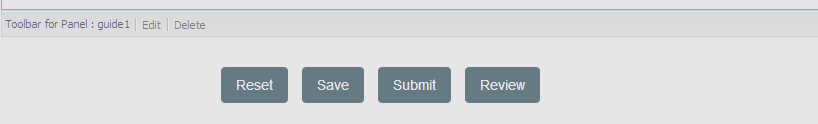

# Creación de una acción de barra de herramientas personalizada{#creating-a-custom-toolbar-action}

## Requisitos previos {#prerequisite}

Antes de crear una acción de barra de herramientas personalizada, familiarícese con [Uso de bibliotecas del cliente](/help/sites-developing/clientlibs.md) y [Desarrollo con CRXDE Lite](/help/sites-developing/developing-with-crxde-lite.md).

## Qué es una acción {#what-is-an-action-br}

Un formulario adaptable proporciona una barra de herramientas que permite al autor del formulario configurar un conjunto de opciones. Estas opciones se definen como acciones para el formulario adaptable. Haga clic en el botón Editar de la barra de herramientas del panel para definir las acciones admitidas por los formularios adaptables.


Además del conjunto de acciones proporcionadas de forma predeterminada, puede crear acciones personalizadas en la barra de herramientas. Por ejemplo, puede agregar una acción para permitir al usuario revisar todos los campos de formulario adaptables antes de enviar un formulario.

## Pasos para crear una acción personalizada en formularios adaptables {#steps}

Para ilustrar la creación de una acción de barra de herramientas personalizada, los siguientes pasos le guían para crear un botón que permita a los usuarios finales revisar todos los campos del formulario adaptable antes de enviar un formulario rellenado.

1. Todas las acciones predeterminadas admitidas por los formularios adaptables están presentes en `/libs/fd/af/components/actions` carpeta. En CRXDE, copie la variable `fileattachmentlisting` nodo de `/libs/fd/af/components/actions/fileattachmentlisting` a `/apps/customaction`.

1. Después de copiar el nodo en `apps/customaction` carpeta, cambie el nombre del nodo a `reviewbeforesubmit`. Además, cambie la variable `jcr:title` y `jcr:description` propiedades del nodo.

   La variable `jcr:title` contiene el nombre de la acción que se muestra en el cuadro de diálogo de la barra de herramientas. La variable `jcr:description` contiene más información que se muestra cuando un usuario pasa el puntero sobre la acción.

   

1. Select `cq:template` nodo en `reviewbeforesubmit` nodo . Asegúrese de que el valor de `guideNodeClass` la propiedad es `guideButton` y cambiar `jcr:title` en consecuencia.
1. Cambie la propiedad type en la variable `cq:Template` nodo . Para el ejemplo actual, cambie la propiedad type a button.

   El valor de tipo se añade como clase CSS en el HTML generado para el componente. Los usuarios pueden usar esa clase CSS para aplicar estilo a sus acciones. El estilo predeterminado para los dispositivos móviles y de escritorio se proporciona para los valores de tipo botón, enviar, restablecer y guardar.

1. Seleccione la acción personalizada en el cuadro de diálogo de la barra de herramientas de edición de formularios adaptables. Se muestra un botón Revisar en la barra de herramientas del panel.

    

1. Para proporcionar funcionalidad al botón Revisar, agregue código JavaScript y CSS y código del lado del servidor en el archivo init.jsp, presentes dentro de la variable `reviewbeforesubmit` nodo .

   Agregue el siguiente código en `init.jsp`.

   ```jsp
   <%@include file="/libs/fd/af/components/guidesglobal.jsp" %>
   <guide:initializeBean name="guideField" className="com.adobe.aemds.guide.common.GuideButton"/>
   
   <c:if test="${not isEditMode}">
           <cq:includeClientLib categories="reviewsubmitclientlibruntime" />
   </c:if>
   
   <%--- BootStrap Modal Dialog  --------------%>
   <div class="modal fade" id="reviewSubmit" tabindex="-1">
       <div class="modal-dialog">
           <div class="modal-content">
               <div class="modal-header">
                   <h3>Review the Form Fields</h3>
               </div>
               <div class="modal-body">
                   <div class="modal-list">
                       <table class="table table-bordered">
                           <tr class="name">
                               <td class="reviewlabel col-md-3 active">
                                   <label>Your Name is: </label>
                               </td>
                           </tr>
                           <tr class="pan">
                               <td class="reviewlabel col-md-3 active">
                                   <label>Your Pan Number is: </label>
                               </td>
                           </tr>
                           <tr class="dob">
                               <td class="reviewlabel col-md-3 active">
                                   <label>Your Date Of Birth is: </label>
                               </td>
                           </tr>
                           <tr class="80cdeclaration">
                               <td class="reviewlabel col-md-3 active">
                                   <label>Your Total 80C Declaration Amount is: </label>
                               </td>
                           </tr>
                           <tr class="rentpaid">
                               <td class="reviewlabel col-md-3 active">
                                   <label>Your Total HRA Amount is: </label>
                               </td>
                           </tr>
                       </table>
                   </div>
               </div><!-- /.modal-body -->
               <div class="modal-footer">
                   <div class="fileAttachmentListingCloseButton col-md-2 col-xs-2 col-sm-2">
                       <button data-dismiss="modal">Close</button>
                   </div>
               </div>
           </div><!-- /.modal-content -->
       </div><!-- /.modal-dialog -->
   </div><!-- /.modal -->
   ```

   Agregue el siguiente código en la `ReviewBeforeSubmit.js` archivo.

   ```javascript
   /*anonymous function to handle show of review before submit view */
   $(function () {
       if($("div.reviewbeforesubmit button[id*=reviewbeforesubmit]").length > 0) {
           $("div.reviewbeforesubmit button[id*=reviewbeforesubmit]").click(function(){
               // Create the options object to be passed to the getElementProperty API
               var options = {},
                   result = [];
               options.somExpressions = [];
               options.propertyName = "value";
               guideBridge.visit(function(model){
                   if(model.name === "name" || model.name === "pan" || model.name === "dateofbirth" || model.name === "total" || model.name === "totalmonthlyrent"){
                           options.somExpressions.push(model.somExpression);
                   }
               }, this);
               result = guideBridge.getElementProperty(options);
   
               $('#reviewSubmit .reviewlabel').each(function(index, item){
                   var data = ((result.data[index] == null) ? "No Data Filled" : result.data[index]);
                   if($(this).next().hasClass("reviewlabelvalue")){
                       $(this).next().html(data);
                   } else {
                       $(this).after($("<td></td>").addClass("reviewlabelvalue col-md-6 active").html(data));
                   }
               });
               // added because in mobile devices it was causing problem of backdrop
               $("#reviewSubmit").appendTo('body');
               $("#reviewSubmit").modal("show");
           });
       }
   });
   ```

   Agregue el siguiente código a `ReviewBeforeSubmit.css` archivo.

   ```css
   .modal-list .reviewlabel {
       white-space: normal;
       text-align: right;
       padding:2px;
   }
   
   .modal-list .reviewlabelvalue {
       border: #cde0ec 1px solid;
       padding:2px;
   }
   
   /* Adding icon for this action in mobile devices */
   /* This is the glyphicon provided by bootstrap eye-open */
   /* .<type> .iconButton-icon */
   .reviewbeforesubmit .iconButton-icon {
       position: relative;
       top: -8px;
       font-family: 'Glyphicons Halflings';
       font-style: normal;
   }
   
   .reviewbeforesubmit .iconButton-icon:before {
       content: "\e105"
   }
   ```

1. Para verificar la funcionalidad de la acción personalizada, abra el formulario adaptable en el modo de Vista previa y haga clic en Revisar en la barra de herramientas.

   >[!NOTE]
   >
   >La variable `GuideBridge` La biblioteca de no se carga en el modo de creación. Por lo tanto, esta acción personalizada no funciona en el modo de creación.

   

## Ejemplos {#samples}

El siguiente archivo contiene un paquete de contenido. El paquete incluye un formulario adaptable relacionado con la demostración anterior de la acción de barra de herramientas personalizada.

[Obtener archivo](assets/customtoolbaractiondemo.zip)
