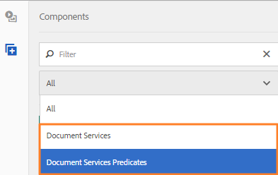

# Creación de una página de portal de formularios{#creating-a-forms-portal-page}

Los componentes del portal de Forms equipan a los desarrolladores web con componentes para crear y personalizar un portal de formularios en sitios web creados con Adobe Experience Manager (AEM). Para obtener una descripción general rápida del portal de formularios, consulte [Introducción a la publicación de formularios en un portal](../../forms/using/introduction-publishing-forms.md).

## Requisitos previos {#prerequisites}

Los componentes del portal de Forms no están disponibles para su uso de forma predeterminada. Asegúrese de que las siguientes categorías de componentes del portal de formularios están habilitadas tal como se describe en [Habilitación de componentes del portal de formularios](/help/forms/using/enabling-forms-portal-components.md).

**Documento** ServicesIncluye los componentes Búsqueda y listado, Vínculo y Borradores y envíos.

**Predicados** de servicios de documentoIncluye componentes Predicado de fecha, Predicado de texto completo, Predicado de propiedades y Predicado de etiquetas. Estos componentes se utilizan para configurar la búsqueda en el componente Búsqueda y lista.

Una vez habilitadas en una página de sitios AEM, estas categorías de componentes están disponibles para su uso en el navegador de componentes.

Categorías de componentes del portal de Forms

## Componente Búsqueda y listado {#search-amp-lister-component}

El componente Búsqueda y lista, disponible en la categoría del componente Servicios de Documento, se utiliza para lista de formularios en una página e implementación de la búsqueda en los formularios enumerados. El componente incluye dos paneles:

* Panel de lista donde se muestran los formularios.
* Panel de búsqueda donde se agrega la funcionalidad de búsqueda.

Puede arrastrar y soltar el componente Buscar y listado desde la categoría del componente Documento Services en el navegador de componentes hasta la página. Cuando se agrega, el componente tiene un aspecto similar al siguiente.

Componente de búsqueda y listado en una página con diseño de cuadrícula

### Panel de lista {#list-pane}

El panel Lista es un área en la que se muestran los formularios. El componente Búsqueda y lista proporciona varias opciones de configuración que puede utilizar para controlar la visualización de formularios en el panel Lista.

Para configurar el panel de Lista, toque el componente Buscar y listar y, a continuación, toque . Se abre el cuadro de diálogo **[!UICONTROL Editar componente]**.

Panel de lista en modo de edición

El cuadro de diálogo **Editar** incluye varias fichas que proporcionan opciones de configuración descritas en la tabla siguiente. Toque **Aceptar** para guardar la configuración, cuando termine.

<table>
 <tbody>
  <tr>
   <th>Ficha</th>
   <th>Configuración</th>
   <th>Descripción</th>
  </tr>
  <tr>
   <td><strong>Carpetas de recursos</strong></code></td>
   <td>Añadir elemento</td>
   <td>Configura las carpetas en las que los recursos se cargan mediante la interfaz de usuario de AEM Forms. De forma predeterminada, lista todos los recursos cargados. Para obtener más información sobre la IU de AEM Forms, consulte <a href="../../forms/using/introduction-managing-forms.md" target="_blank">Introducción a la administración de formularios</a>.</td>
  </tr>
  <tr>
   <td>
<strong>Mostrar</strong></code>
 </td>
   <td>Texto del título</td>
   <td>Título del componente Búsqueda y listado. El título predeterminado es <strong>Forms Portal.</strong></td>
  </tr>
  <tr>
   <td> </td>
   <td>Plantilla de diseño</td>
   <td>Diseño de los recursos. </td>
  </tr>
  <tr>
   <td> </td>
   <td>Deshabilitar búsqueda avanzada</td>
   <td>Cuando se habilita, oculta el icono de búsqueda avanzada.</td>
  </tr>
  <tr>
   <td> </td>
   <td>Deshabilitar búsqueda de texto</td>
   <td>Cuando está activada, oculta la barra de búsqueda de texto completo.</td>
  </tr>
  <tr>
   <td><strong>Resultado</strong></code></td>
   <td>Número De Resultados Por Página</td>
   <td>Configura el número máximo de formularios que desea mostrar en una página.</td>
  </tr>
  <tr>
   <td> </td>
   <td>Texto de resultados</td>
   <td>
Configura el texto de los resultados (por ejemplo, 1-12 de 601 <strong>Resultados</strong>). El valor predeterminado es <strong>Results</strong>.
 
Por ejemplo, si especifica <strong>Forms </strong>en este campo y hay un total de 601 formularios, el texto resultante cambiará a 1-12 de 601 <strong>Forms.</strong>
 </td>
  </tr>
  <tr>
   <td> </td>
   <td>Texto de página</td>
   <td>
Configura el texto de la página (por ejemplo, <strong>Página </strong>1 de 51). El valor predeterminado es <strong>Page</strong>.
 
Por ejemplo: si especifica <strong>Formulario de solicitud </strong>en este campo y hay 51 páginas, el texto de la página cambiará a <strong>Formulario de solicitud </strong>1 de 51.
 </td>
  </tr>
  <tr>
   <td> </td>
   <td>De texto</td>
   <td>
Reemplaza la palabra <strong>de</strong> por el texto especificado (Página 1 <strong>de </strong>51). El valor predeterminado es <strong>de</strong>.
 
Por ejemplo, si especifica <strong>de </strong>en este campo, el texto cambia a Página 1 <strong>de </strong>51.
 </td>
  </tr>
  <tr>
   <td><strong>Vínculo de formulario</strong></code></td>
   <td>Tipo de procesamiento</td>
   <td>Controla la lista de formularios según el tipo de procesamiento especificado. Las opciones disponibles son PDF y HTML. Por ejemplo, si selecciona solo HTML como tipo de procesamiento, los PDF forms se filtran.</td>
  </tr>
  <tr>
   <td> </td>
   <td>PERFIL HTML</td>
   <td>Configura el perfil HTML que se va a utilizar para la representación. Todos los perfiles disponibles se enumeran en la lista desplegable.</td>
  </tr>
  <tr>
   <td> </td>
   <td>Enviar URL</td>
   <td>
Configura un servlet en el que se envían los datos del formulario.
 
<strong>Nota:La dirección URL de </strong> <em>envío de un formulario se puede especificar en varios lugares y su orden de prioridad es el siguiente:</em>

    <ol>
     <li><em>La dirección URL de envío incrustada en el formulario (en el botón Enviar) tiene la prioridad más alta.</em></li>
     <li><em>La dirección URL de envío que se menciona en la interfaz de usuario de AEM Forms tiene la segunda prioridad.</em></li>
     <li><em>La dirección URL de envío mencionada en el portal de formularios tiene la prioridad más baja.</em></li>
    </ol> </td>
  </tr>
  <tr>
   <td> </td>
   <td>Información del objeto Acción de procesamiento HTML</td>
   <td>Configura el texto de la información del objeto, que se muestra al pasar el puntero sobre  (el icono HTML5).</td>
  </tr>
  <tr>
   <td> </td>
   <td>Información del objeto Acción de procesamiento de PDF</td>
   <td>Configura el texto de la información del objeto, que se muestra al pasar el puntero sobre  (el icono PDF).</td>
  </tr>
  <tr>
   <td><strong>Estilo</strong></code></td>
   <td>Tipo de estilo</td>
   <td>Permite especificar <strong>Sin estilo, Estilo predeterminado</strong> o <strong>Estilo personalizado </strong>para enumerar los formularios.</td>
  </tr>
  <tr>
   <td> </td>
   <td>Ruta de estilo personalizada</td>
   <td>Si seleccionó Personalizado como Tipo de estilo, busque para especificar la ruta de acceso al CSS personalizado y, de lo contrario, seleccione Predeterminado.</td>
  </tr>
 </tbody>
</table>

### Panel de búsqueda {#search-pane}

El panel Buscar permite agregar los componentes Predicado de fecha, Predicado de texto completo, Predicado de propiedades y Predicado de etiquetas desde la categoría Predicados de Documento Services en AEM barra de tareas. Estos componentes implementan la funcionalidad de búsqueda para que los usuarios realicen búsquedas en los formularios enumerados.

**Sugerencia:** *Puede controlar la lista de formularios mostrados en el portal de formularios en función de criterios preestablecidos y ocultar la funcionalidad de búsqueda para los usuarios finales. Para controlar la lista de formularios, utilice los componentes Predicar para aplicar filtros de búsqueda. También puede especificar los valores de filtro predeterminados y desactivar la búsqueda desde la ficha Visualización del cuadro de diálogo Editar componente.*

Panel de búsqueda con predicado de fecha, texto completo, propiedades y etiquetas

#### Predicado de fecha {#date-predicate}

El componente Predicado de fecha, cuando se agrega, habilita la búsqueda en los formularios enumerados que se modificaron durante un período de tiempo especificado.

Para configurar el componente Predicado de fecha:

1. Puntee en el componente y luego en . Se abre el cuadro de diálogo Editar.
1. Especifique lo siguiente:

   * **Tipo:** La única opción disponible es Fecha de  **última modificación**

   * **Texto:** Etiqueta o rótulo del componente Predicado de fecha. El valor predeterminado es **Última fecha de modificación.**

   * **Etiqueta de fecha de inicio:** Etiqueta o rótulo del campo de fecha de inicio
   * **Etiqueta de fecha de finalización:** Etiqueta o rótulo para el campo de fecha de finalización
   * **Ocultar:** Para aplicar el filtro de fechas predeterminado a los formularios de lista

1. Toque **Aceptar**

#### Predicado de texto completo {#full-text-predicate}

El componente Predicado de texto completo implementa la búsqueda de texto completo en los datos del formulario, como el nombre y la descripción. Los usuarios pueden buscar cualquier cadena de texto para devolver formularios que contengan el texto en su nombre o descripción.

Para configurar el componente predicado de texto completo:

1. Puntee en el componente y luego en . Se abre el cuadro de diálogo Editar.
1. Especifique el título en el campo **Título principal**.
1. Tocar **Aceptar**

#### Predicado de propiedades {#properties-predicate}

El componente Predicado de propiedades implementa la búsqueda de formularios en función de las propiedades del formulario, como título, autor y descripción.

Para configurar el componente Predicado de propiedades:

1. Puntee en el componente y luego en . Se abre el cuadro de diálogo Editar.
1. En la ficha General, especifique la etiqueta de búsqueda. El valor predeterminado es **Propiedades**

1. En la ficha Opciones, toque **Añadir elemento.**
1. Seleccione una propiedad en la lista desplegable y especifique una etiqueta de búsqueda para ella en el campo debajo de la lista desplegable.
1. Repita el paso 4 para agregar más propiedades. También puede especificar un valor de filtro predeterminado para los formularios de lista en función de los criterios especificados y ocultar la propiedad para la búsqueda por parte de los usuarios finales. Seleccione la casilla Ocultar de una propiedad y especifique el valor de filtro predeterminado.
Por ejemplo, si desea mostrar formularios que contengan &quot;Viaje&quot; en sus títulos, seleccione Ocultar junto a la propiedad Título. Además, especifique Viaje en el cuadro de texto de valor de filtro predeterminado.

1. Toque **Aceptar**

#### Predicado de etiquetas {#tags-predicate}

El componente Predicado de etiquetas implementa la búsqueda de formularios en función de las etiquetas definidas en Forms Manager.

Para configurar el componente Predicado de etiquetas:

1. Puntee en el componente y luego en . Se abre el cuadro de diálogo Editar.
1. Puntee en el botón de flecha hacia abajo situado junto al campo Etiquetas.
1. Seleccionar las etiquetas adecuadas
1. Toque **Aceptar**

Las etiquetas seleccionadas aparecen en el panel Buscar junto con las casillas de verificación para selección. Ahora los usuarios pueden reducir la búsqueda en función de las etiquetas.

## Formularios de lista en una página {#list-forms-on-a-page-br}

Para lista de formularios en una página, agregue el componente **[!UICONTROL Buscar y listar]** a la página y configure el **[!UICONTROL Panel de Lista]**. Para permitir que los usuarios finales busquen formularios con fecha, texto y etiquetas, agregue un componente **[!UICONTROL Panel de búsqueda]**.

Para vincular un formulario desde cualquier lugar de la página, utilice el componente Vínculo. Para obtener más información sobre el componente de vínculo, consulte [Incrustación del componente de vínculo en una página](../../forms/using/embedding-link-component-page.md).

Para lista de los formularios que están en estado borrador y los formularios que ya se han enviado, utilice el componente **[!UICONTROL Borradores y envíos]**. Para obtener más información, consulte [Personalización del componente Borradores y envíos](../../forms/using/draft-submission-component.md).

## Facilidad de uso del dispositivo móvil {#mobile-device-friendliness}

El componente Búsqueda y listado de Forms Portal es sencillo para dispositivos móviles y se adapta en consecuencia. Las tres vistas predeterminadas: Los rediseños de cuadrícula, tarjeta y panel según el dispositivo en el que se abre el sitio, siempre que la página web también se adapte. El simple hecho es que Search &amp; Lister es un solo componente y no rige el estilo de nivel de página.

La siguiente imagen muestra el componente Buscar y listado cuando se abre en un dispositivo móvil:

Componente Búsqueda y listado

## Personalización de una página de portal de formularios {#customizing-a-forms-portal-page-br}

Puede personalizar una página de portal de formularios para proporcionar una apariencia distinta a la página. También puede agregar metadatos para mejorar la experiencia de búsqueda, cambiar el diseño de la página y agregar estilos CSS personalizados. Para obtener más información, consulte [Personalización de plantillas para componentes de Forms Portal](../../forms/using/customizing-templates-forms-portal-components.md).

La interfaz de usuario de AEM Forms permite agregar metadatos personalizados a los formularios. Los metadatos personalizados son útiles para proporcionar una experiencia de listado y búsqueda de formularios a los usuarios finales. Para obtener más información sobre los metadatos personalizados, consulte [Personalización de plantillas para componentes de Forms Portal](../../forms/using/customizing-templates-forms-portal-components.md).

De forma predeterminada, el portal de formularios proporciona acciones de procesamiento. Puede personalizar el portal de formularios para agregar más acciones. Para obtener información detallada, consulte [Añadir acción personalizada en elementos de lista de formularios.](../../forms/using/add-custom-action-form-lister.md)

## Artículos relacionados

* [Habilitar componentes del portal de formularios](/help/forms/using/enabling-forms-portal-components.md)
* [Crear página del portal de formularios](/help/forms/using/creating-form-portal-page.md)
* [Lista de formularios en una página web mediante API](/help/forms/using/listing-forms-webpage-using-apis.md)
* [Uso del componente Borradores y envíos](/help/forms/using/draft-submission-component.md)
* [Personalización del almacenamiento de borradores y formularios enviados](/help/forms/using/draft-submission-component.md)
* [Ejemplo para integrar el componente de borradores y envíos con la base de datos](/help/forms/using/integrate-draft-submission-database.md)
* [Personalización de plantillas para componentes del portal de formularios](/help/forms/using/customizing-templates-forms-portal-components.md)
* [Introducción a la publicación de formularios en un portal](/help/forms/using/introduction-publishing-forms.md)
