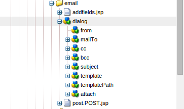

# Escritura de la acción Enviar personalizada para formularios adaptables{#writing-custom-submit-action-for-adaptive-forms}

Los formularios adaptables requieren acciones de envío para procesar los datos especificados por el usuario. Una acción Enviar determina la tarea realizada en los datos que se envían mediante un formulario adaptable. Adobe Experience Manager (AEM) incluye acciones [de envío](../../forms/using/configuring-submit-actions.md) OOTB que muestran las tareas personalizadas que puede realizar con los datos enviados por el usuario. Por ejemplo, puede realizar tareas como enviar correo electrónico o almacenar los datos.

## Flujo de trabajo para una acción de envío {#workflow-for-a-submit-action}

El diagrama de flujo ilustra el flujo de trabajo de una acción Enviar que se activa al hacer clic en el botón **[!UICONTROL Enviar]** en un formulario adaptable. Los archivos del componente Archivo adjunto se cargan en el servidor y los datos del formulario se actualizan con las direcciones URL de los archivos cargados. Dentro del cliente, los datos se almacenan en formato JSON. El cliente envía una solicitud de Ajax a un servlet interno que analiza los datos especificados y los devuelve en formato XML. El cliente recopila estos datos con campos de acción. Envía los datos al servlet final (servlet de envío de guía) mediante una acción de envío de formulario. A continuación, el servlet reenvía el control a la acción Enviar. La acción Enviar puede reenviar la solicitud a otro recurso de sling o redirigir el explorador a otra dirección URL.


### Formato de datos XML {#xml-data-format}

Los datos XML se envían al servlet mediante el parámetro de **`jcr:data`** solicitud. Las acciones de envío pueden acceder al parámetro para procesar los datos. El siguiente código describe el formato de los datos XML. Los campos enlazados al modelo de formulario aparecen en la **`afBoundData`** sección . Los campos no enlazados aparecen en la `afUnoundData`sección. Para obtener más información sobre el formato del `data.xml` archivo, consulte [Introducción al rellenado previo de campos](../../forms/using/prepopulate-adaptive-form-fields.md)de formulario adaptables.

```xml
<?xml ?>
<afData>
<afUnboundData>
<data>
<field1>value</field2>
<repeatablePanel>
    <field2>value</field2>
</repeatablePanel>
<repeatablePanel>
    <field2>value</field2>
</repeatablePanel>
</data>
</afUnboundData>
<afBoundData>
<!-- xml corresponding to the Form Model /XML Schema -->
</afBoundData>
</afData>
```

### Campos de acción {#action-fields}

Una acción Enviar puede agregar campos de entrada ocultos (mediante la etiqueta de [entrada](https://developer.mozilla.org/en/docs/Web/HTML/Element/Input) HTML) al formulario HTML procesado. Estos campos ocultos pueden contener los valores que necesita al procesar el envío del formulario. Al enviar el formulario, estos valores de campo se contabilizan nuevamente como parámetros de solicitud que la acción Enviar puede utilizar durante el envío. Los campos de entrada se denominan campos de acción.

Por ejemplo, una acción Enviar que también capture el tiempo empleado para rellenar un formulario puede agregar los campos de entrada ocultos `startTime` y `endTime`.

Una secuencia de comandos puede proporcionar los valores de los campos `startTime` y `endTime` cuando el formulario se procesa y antes del envío, respectivamente. La secuencia de comandos de acción Enviar `post.jsp` puede acceder a estos campos utilizando parámetros de solicitud y calcular el tiempo total necesario para rellenar el formulario.

### Archivos adjuntos {#file-attachments}

Las acciones de envío también pueden utilizar los archivos adjuntos cargados mediante el componente Archivo adjunto. Las secuencias de comandos de acción de envío pueden acceder a estos archivos mediante la API [sling](https://sling.apache.org/apidocs/sling5/org/apache/sling/api/request/RequestParameter.html)RequestParameter. El método [isFormField](https://sling.apache.org/apidocs/sling5/org/apache/sling/api/request/RequestParameter.html#isFormField()) de la API ayuda a identificar si el parámetro de solicitud es un archivo o un campo de formulario. Puede iterar los parámetros de solicitud en una acción Enviar para identificar los parámetros de archivo adjunto.

El siguiente código de muestra identifica los archivos adjuntos en la solicitud. A continuación, lee los datos en el archivo mediante [Get API](https://sling.apache.org/apidocs/sling5/org/apache/sling/api/request/RequestParameter.html#get()). Por último, crea un objeto Document con los datos y lo anexa a una lista.

```java
RequestParameterMap requestParameterMap = slingRequest.getRequestParameterMap();
for (Map.Entry<String, RequestParameter[]> param : requestParameterMap.entrySet()) {
    RequestParameter rpm = param.getValue()[0];
    if(!rpm.isFormField()) {
        fileAttachments.add(new Document(rpm.get()));
    }
}
```

### Ruta de acceso de redirección y URL de redirección {#forward-path-and-redirect-url}

Después de realizar la acción necesaria, el servlet Enviar reenvía la solicitud a la ruta de avance. Una acción utiliza la API setForwardPath para establecer la ruta de avance en el servlet Guide Submit.

Si la acción no proporciona una ruta hacia adelante, el servlet Enviar redirige el explorador mediante la URL de redirección. El autor configura la URL de redireccionamiento mediante la configuración de la página de agradecimiento del cuadro de diálogo Editar formulario adaptable. También puede configurar la URL de redireccionamiento mediante la acción Enviar o la API setRedirectUrl en el servlet de envío de guía. También puede configurar los parámetros Request enviados a la URL de redireccionamiento mediante la API setRedirectParameters del servlet Guide Submit.

>[!NOTE]
>
>Un autor proporciona la URL de redireccionamiento (mediante la Configuración de la página de agradecimiento). [Las acciones](../../forms/using/configuring-submit-actions.md) de envío de OOTB utilizan la dirección URL de redirección para redirigir el explorador desde el recurso al que hace referencia la ruta de reenvío.
>
>Puede escribir una acción Enviar personalizada que envíe una solicitud a un recurso o servlet. Adobe recomienda que la secuencia de comandos que realiza la gestión de recursos para la ruta de reenvío redirija la solicitud a la URL de redireccionamiento cuando finalice el procesamiento.

## Submit action {#submit-action}

Una acción de envío es un sling:Folder que incluye lo siguiente:

* **addfields.jsp**: Esta secuencia de comandos proporciona los campos de acción que se agregan al archivo HTML durante la representación. Utilice esta secuencia de comandos para agregar los parámetros de entrada ocultos necesarios durante el envío en la secuencia de comandos post.POST.jsp.
* **dialog.xml**: Esta secuencia de comandos es similar al cuadro de diálogo Componente de CQ. Proporciona información de configuración que el autor personaliza. Los campos se muestran en la ficha Enviar acciones del cuadro de diálogo Editar formulario adaptable cuando se selecciona la acción Enviar.
* **post.POST.jsp**: El servlet Enviar llama a esta secuencia de comandos con los datos que envía y los datos adicionales de las secciones anteriores. Cualquier mención de la ejecución de una acción en esta página implica la ejecución del script post.POST.jsp. Para registrar la acción Enviar con los formularios adaptables que se van a mostrar en el cuadro de diálogo Editar formulario adaptable, agregue estas propiedades a sling:Folder:

   * **guideComponentType** de tipo String y value **fd/af/components/guide submitype**
   * **guideDataModel** de tipo String que especifica el tipo de formulario adaptable para el que se aplica la acción Enviar. **xfa** es compatible con formularios adaptables basados en XFA, mientras que **xsd** es compatible con formularios adaptables basados en XSD. **basic** se admite en formularios adaptables que no utilizan XDP o XSD. Para mostrar la acción en varios tipos de formularios adaptables, agregue las cadenas correspondientes. Separe cada cadena con una coma. Por ejemplo, para que una acción sea visible en formularios adaptables basados en XFA y XSD, especifique los valores **xfa** y **xsd** respectivamente.

   * **jcr:descripción** de tipo String. El valor de esta propiedad se muestra en la lista de acciones Enviar de la ficha Enviar acciones del cuadro de diálogo Editar formulario adaptable. Las acciones OOTB están presentes en el repositorio de CRX en la ubicación **/libs/fd/af/components/guide submitype**.

## Creación de una acción Enviar personalizada {#creating-a-custom-submit-action}

Realice los siguientes pasos para crear una acción Enviar personalizada que guarde los datos en el repositorio de CRX y luego le envíe un mensaje de correo electrónico. El formulario adaptable contiene la acción Enviar OOTB Contenido del almacén (desaprobada) que guarda los datos en el repositorio de CRX. Además, CQ proporciona una API de [correo](https://docs.adobe.com/docs/en/cq/current/javadoc/com/day/cq/mailer/package-summary.html) que se puede utilizar para enviar correos electrónicos. Antes de utilizar la API de correo, [configure](https://docs.adobe.com/docs/en/cq/current/administering/notification.html?wcmmode=disabled#Configuring el servicio de correo) el servicio Day CQ Mail a través de la consola del sistema. Puede reutilizar la acción Almacenar contenido (desaprobada) para almacenar los datos en el repositorio. La acción Almacenar contenido (desaprobada) está disponible en la ubicación /libs/fd/af/components/guide submitype/store en el repositorio de CRX.

1. Inicie sesión en CRXDE Lite en la dirección URL https://&lt;server>:&lt;port>/crx/de/index.jsp. Cree un nodo con la propiedad sling:Folder y nombre store_and_mail en la carpeta /apps/custom_submit_action. Cree la carpeta custom_submit_action si aún no existe.

   

1. **Proporcione los campos de configuración obligatorios.**

   Agregue la configuración que requiere la acción Tienda. Copie el nodo **cq:dialog** de la acción Store de /libs/fd/af/components/guide submitype/store a la carpeta de acciones de /apps/custom_submit_action/store_and_email.

   

1. **Proporcione campos de configuración para solicitar al autor la configuración de correo electrónico.**

   El formulario adaptable también proporciona una acción Correo electrónico que envía correos electrónicos a los usuarios. Personalice esta acción según sus necesidades. Vaya a /libs/fd/af/components/guide submitype/email/dialog. Copie los nodos del nodo cq:dialog en el nodo cq:dialog de la acción Enviar (/apps/custom_submit_action/store_and_email/dialog).

   

1. **Haga que la acción esté disponible en el cuadro de diálogo Editar formulario adaptable.**

   Agregue las siguientes propiedades en el nodo store_and_email:

   * **guideComponentType** de tipo **String** y value **fd/af/components/guide submitype**

   * **guideDataModel** de tipo **String** y value **xfa, xsd, basic**

   * **jcr:descripción** del tipo **Cadena** y valor **Almacén y Acción de correo electrónico**

1. Abra cualquier formulario adaptable. Haga clic en el botón **Editar** situado junto a **Inicio** para abrir el cuadro de diálogo **Editar** del contenedor de formularios adaptables. La nueva acción se muestra en la ficha **Enviar acciones** . Al seleccionar la acción **de** almacenamiento y correo electrónico, se muestra la configuración agregada en el nodo de cuadro de diálogo.

   

1. **Utilice la acción para completar una tarea.**

   Agregue la secuencia de comandos post.POST.jsp a la acción. (/apps/custom_submit_action/store_and_mail/).

   Ejecute la acción Tienda OOTB (script post.POST.jsp). Utilice la API [FormsHelper.runAction](https://docs.adobe.com/docs/en/cq/current/javadoc/com/day/cq/wcm/foundation/forms/FormsHelper.html#runAction(java.lang.String, java.lang.String, org.apache.sling.api.resource.Resource, org.apache.sling.api.SlingHttpServletRequest, org.apache.sling.api.SlingHttpServletResponse) que CQ proporciona en su código para ejecutar la acción Store. Agregue el siguiente código en el archivo JSP:

   `FormsHelper.runAction("/libs/fd/af/components/guidesubmittype/store", "post", resource, slingRequest, slingResponse);`

   Para enviar el correo electrónico, el código lee la dirección de correo electrónico del destinatario desde la configuración. Para recuperar el valor de configuración en la secuencia de comandos de la acción, lea las propiedades del recurso actual utilizando el siguiente código. Del mismo modo, puede leer los demás archivos de configuración.

   `ValueMap properties = ResourceUtil.getValueMap(resource);`

   `String mailTo = properties.get("mailTo");`

   Por último, utilice la API de CQ Mail para enviar el correo electrónico. Utilice la clase [SimpleEmail](https://commons.apache.org/proper/commons-email/apidocs/org/apache/commons/mail/SimpleEmail.html) para crear el objeto Email como se describe a continuación:

   >[!NOTE]
   >
   >Asegúrese de que el archivo JSP tenga el nombre post.POST.jsp.

   ```java
   <%@include file="/libs/fd/af/components/guidesglobal.jsp" %>
   <%@page import="com.day.cq.wcm.foundation.forms.FormsHelper,
          org.apache.sling.api.resource.ResourceUtil,
          org.apache.sling.api.resource.ValueMap,
                   com.day.cq.mailer.MessageGatewayService,
     com.day.cq.mailer.MessageGateway,
     org.apache.commons.mail.Email,
                   org.apache.commons.mail.SimpleEmail" %>
   <%@taglib prefix="sling"
                   uri="https://sling.apache.org/taglibs/sling/1.0" %>
   <%@taglib prefix="cq"
                   uri="https://www.day.com/taglibs/cq/1.0"
   %>
   <cq:defineObjects/>
   <sling:defineObjects/>
   <%
           String storeContent =
                       "/libs/fd/af/components/guidesubmittype/store";
           FormsHelper.runAction(storeContent, "post", resource,
                                   slingRequest, slingResponse);
    ValueMap props = ResourceUtil.getValueMap(resource);
    Email email = new SimpleEmail();
    String[] mailTo = props.get("mailto", new String[0]);
    email.setFrom((String)props.get("from"));
           for (String toAddr : mailTo) {
               email.addTo(toAddr);
      }
    email.setMsg((String)props.get("template"));
    email.setSubject((String)props.get("subject"));
    MessageGatewayService messageGatewayService =
                       sling.getService(MessageGatewayService.class);
    MessageGateway messageGateway =
                   messageGatewayService.getGateway(SimpleEmail.class);
    messageGateway.send(email);
   %>
   ```

   Seleccione la acción en el formulario adaptable. La acción envía un correo electrónico y almacena los datos.

