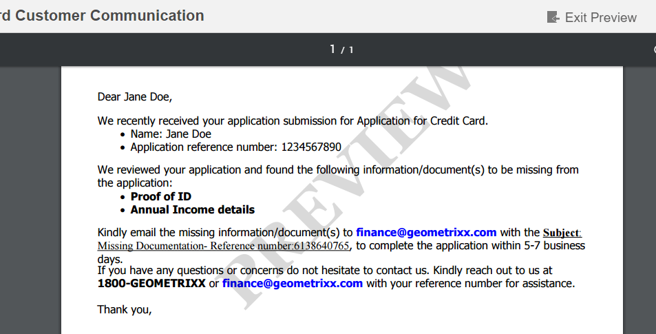

# Marca de agua personalizada en vista previa de PDF de carta{#custom-watermark-in-letter-pdf-preview}

## Información general {#overview}

En la interfaz de usuario Crear correspondencia, los usuarios del agente previsualizan la correspondencia en forma final en la que se envía al postprocesamiento, como por ejemplo para correo electrónico o impresión.

Para evitar el uso no autorizado de estos datos, las organizaciones pueden imponer una marca de agua en la vista previa del PDF. La marca de agua predeterminada es &quot;PREVIEW&quot;, que aparece en el PDF.

Para habilitar la marca de agua en la vista previa del PDF, seleccione la opción **[!UICONTROL Aplicar marca de agua]** durante la vista previa en Configuraciones **[!UICONTROL de administración de]** correspondencia en https://[server]:[port]/system/console/configMgr.



Puede seguir los pasos siguientes para personalizar el texto y el aspecto de la marca de agua:

## Personalización de la marca de agua en la vista previa de PDF en la interfaz de usuario Crear correspondencia {#customizewatermark-}

1. Vaya a `https://[server]:[port]/[ContextPath]/crx/de` e inicie sesión como administrador.
1. En la carpeta de aplicaciones, cree una carpeta denominada **[!UICONTROL previewwatermark]** con una ruta/estructura similar a la carpeta de marcas de agua de la vista previa en la carpeta libs:

   1. Haga clic con el botón derecho en la carpeta **de marca de agua de la vista previa** en la siguiente ruta y seleccione **Overlay Node**:

      `/libs/fd/cm/configFiles/previewwatermark`

   1. Asegúrese de que el cuadro de diálogo Nodo de superposición tiene los siguientes valores:

      **** Ruta: /libs/fd/cm/configFiles/previewwatermark

      **** Ubicación de superposición: /apps/

      **** Coincidir tipos de nodo: Verificado

      >[!NOTE]
      >
      >No realice cambios en la rama /libs. Cualquier cambio que realice puede perderse, ya que esta rama puede cambiar siempre que:
      >
      >    
      >    
      >    * Actualizar en su instancia
      >    * Aplicar una corrección urgente
      >    * Instalación de un paquete de funciones


   1. Haga clic en **Aceptar** y, a continuación, en **Guardar todo**. La carpeta **[!UICONTROL de marca de agua de vista previa]** se crea en la ruta especificada.


1. Copie y pegue el archivo ddx de la carpeta &quot;/libs/fd/cm/configFiles/previewwatermark&quot; en la carpeta &quot;/apps/fd/cm/configFiles/previewwatermark&quot; y haga clic en **[!UICONTROL Guardar todo]**.
1. Realice los cambios deseados en el archivo ddx en /apps/fd/cm/configFiles/previewwatermark/.

   ```
   <DDX xmlns="https://ns.adobe.com/DDX/1.0/">
    <PDF result="output.pdf">
     <PDF source="input.pdf"/>
           <Watermark opacity="15%" rotation="45">
            <StyledText>
                     <p font-family="Georgia" font-size="70pt" color="black" font-weight="bold">
                         PREVIEW
                    </p>
            </StyledText>
           </Watermark>
    </PDF>
   </DDX>
   ```

   Para obtener información sobre la personalización del aspecto, el texto y la alineación de las marcas de agua, consulte Adición y eliminación de marcas de agua y fondos en el documento [Servicio de ensambladores y Referencia](https://help.adobe.com/en_US/livecycle/11.0/ddxRef.pdf) DDX.

   >[!NOTE]
   >
   >En el archivo ddx, las referencias a resultado y origen deben permanecer sin cambios en output.pdf y input.pdf. El nombre del archivo ddx tampoco debe cambiarse.

1. Haga clic en **Guardar todo**.

