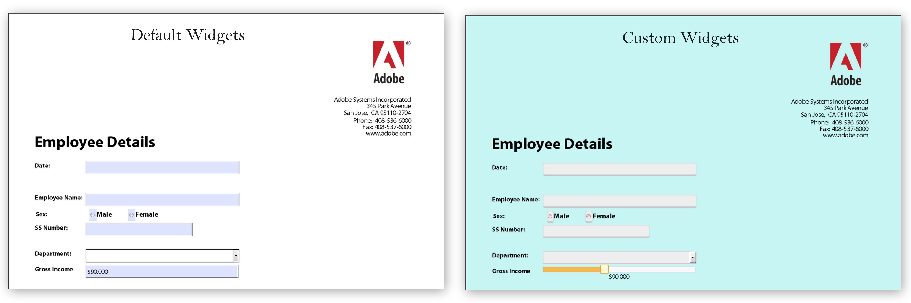

# Crear apariciones personalizadas en formularios HTML5{#create-custom-appearances-in-html-forms}

Puede conectar widgets personalizados a un Forms móvil. Puede ampliar los widgets de jQuery existentes o desarrollar sus propias utilidades personalizadas utilizando el marco de aspectos visuales. El motor XFA utiliza varios widgets; consulte [Marco de aspecto para los formularios adaptables y HTML5](/help/forms/using/introduction-widgets.md) para obtener información detallada.



Ejemplo de utilidad predeterminada y personalizada

## Integración de widgets personalizados con formularios HTML5 {#integrating-custom-widgets-with-html-forms}

### Crear un perfil  {#create-a-profile-nbsp}

Puede crear un perfil o elegir un perfil existente para agregar un widget personalizado. Para obtener más información sobre la creación de perfiles, consulte [Creación de perfiles personalizados](/help/forms/using/custom-profile.md).

### Crear un widget {#create-a-widget}

Los formularios HTML5 proporcionan una implementación del marco de widgets que se puede ampliar para crear nuevas utilidades. La implementación es un widget jQuery *abstractWidget* que se puede ampliar para escribir un nuevo widget. El nuevo widget solo puede hacerse funcional ampliando o anulando las funciones mencionadas a continuación.

<table>
 <tbody>
  <tr>
   <td>Función/Clase</td>
   <td>Descripción</td>
  </tr>
  <tr>
   <td>procesar</td>
   <td>La función render devuelve el objeto jQuery para el elemento HTML predeterminado del widget. El elemento HTML predeterminado debe ser de tipo enfocable. Por ejemplo, &lt;a&gt;, &lt;input&gt; y &lt;li&gt;. El elemento devuelto se usa como $userControl. Si $userControl especifica la restricción anterior, las funciones de la clase AbstractWidget funcionan como se espera; de lo contrario, algunas de las API comunes (enfoque, clic) requieren cambios. </td>
  </tr>
  <tr>
   <td>getEventMap</td>
   <td>Devuelve un mapa para convertir eventos HTML en eventos XFA. <br /> {<br /> desenfocar: XFA_EXIT_EVENT,<br /> }<br />  Este ejemplo muestra que el desenfoque es un evento HTML y XFA_EXIT_EVENT es el evento XFA correspondiente. </td>
  </tr>
  <tr>
   <td>getOptionsMap</td>
   <td>Devuelve un mapa que proporciona detalles sobre qué acción realizar al cambiar una opción. Las claves son las opciones que se proporcionan al widget y los valores son las funciones a las que se llama cada vez que se detecta un cambio en esa opción. El widget proporciona controladores para todas las opciones comunes (excepto value y displayValue)</td>
  </tr>
  <tr>
   <td>getCommitValue</td>
   <td>La estructura Widget carga la función cada vez que el valor de la utilidad se guarda en el modelo XFAM (por ejemplo, en el suceso exit de un campo de texto). La implementación debe devolver el valor que se ha guardado en el widget. El controlador se proporciona con el nuevo valor para la opción .</td>
  </tr>
  <tr>
   <td>showValue</td>
   <td>De forma predeterminada, en XFA en el suceso enter , se muestra el rawValue del campo . Se llama a esta función para mostrar rawValue al usuario. </td>
  </tr>
  <tr>
   <td>showDisplayValue</td>
   <td>De forma predeterminada, en XFA en el evento exit se muestra el formattedValue del campo . Se llama a esta función para mostrar el formattedValue al usuario. </td>
  </tr>
 </tbody>
</table>

Para crear su propio widget, en el perfil creado anteriormente, incluya referencias del archivo JavaScript que contiene funciones anuladas y funciones agregadas recientemente. Por ejemplo, el *sliderNumericFieldWidget* es un widget para campos numéricos. Para utilizar la utilidad en el perfil en la sección del encabezado, incluya la siguiente línea:

```javascript
window.formBridge.registerConfig("widgetConfig" , widgetConfigObject);
```

### Registro de un widget personalizado con el motor de secuencias de comandos XFA  {#register-custom-widget-with-xfa-scripting-engine-nbsp}

Cuando el código del widget personalizado esté listo, registre el widget con el motor de secuencias de comandos utilizando `registerConfig`API para [Puente de formulario](/help/forms/using/form-bridge-apis.md). Toma widgetConfigObject como entrada.

```javascript
window.formBridge.registerConfig("widgetConfig",
        {
        ".<field-identifier>":"<name-of-the-widget>"
        }
    );
```

#### widgetConfigObject {#widgetconfigobject}

La configuración del widget se proporciona como un objeto JSON (una colección de pares de valor clave) donde la clave identifica los campos y el valor representa el widget que se utilizará con esos campos. Una configuración de ejemplo tiene este aspecto:

```
*{*

*“identifier1” : “customwidgetname”,
“identifier2” : “customwidgetname2”,
..
}*
```

donde &quot;identificador&quot; es un selector de CSS jQuery que representa un campo en particular, un conjunto de campos de un tipo en particular o todos los campos. A continuación, se enumera el valor del identificador en casos diferentes:

| Tipo de identificador | Identificador | Descripción |
|---|---|---|
| Campo particular con nombre de campo | Identificador: &quot;div.fieldname&quot; | Todos los campos con el nombre &quot;nombre de campo&quot; se representan con el widget. |
| Todos los campos de tipo &quot;type&quot; (donde type es NumericField, DateField, etc.): | Identificador: &quot;div.type&quot; | Para Campo de tiempo y Campo de tiempo, el tipo es campo de texto, ya que estos campos no son compatibles. |
| Todos los campos | Identificador: &quot;div.field&quot; |  |
