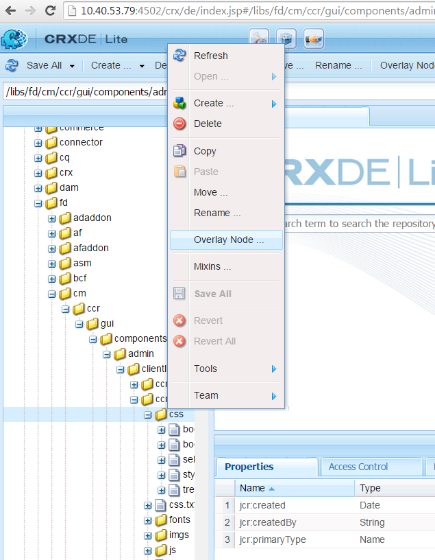
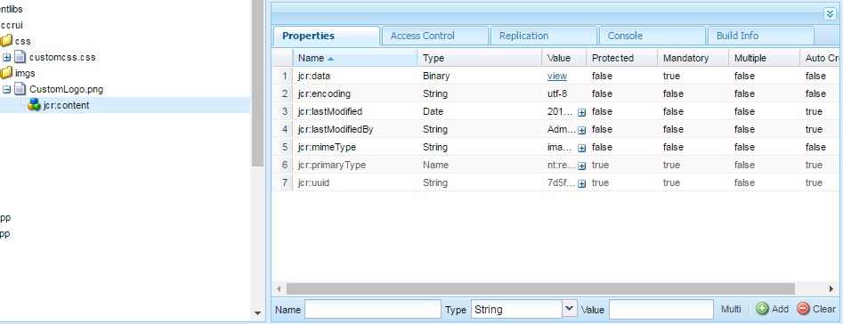

# Personalice la IU de creación de correspondencia{#customize-create-correspondence-ui}

## Información general {#overview}

La administración de correspondencia le permite cambiar la marca de su plantilla de solución para obtener un mejor valor de marca y cumplir con los estándares de marca de su organización. El cambio de marca de la interfaz de usuario incluye el cambio del logotipo de la organización, que se muestra en la esquina superior izquierda de la interfaz de usuario Crear correspondencia.

Puede cambiar el logotipo en la interfaz de usuario Crear correspondencia con el logotipo de su organización.


Icono personalizado en la interfaz de usuario Crear correspondencia

### Cambio del logotipo en la interfaz de usuario Crear correspondencia {#changing-the-logo-in-the-create-correspondence-ui}

Para configurar una imagen de logotipo de su elección, haga lo siguiente:

1. Cree la estructura de carpetas [adecuada en CRX](#creatingfolderstructure).
1. [Cargue el nuevo ](#uploadlogo) archivo de logotipo en la carpeta que ha creado en CRX.

1. [Configure el ](#createcss) CSSon CRX para que haga referencia al nuevo logotipo.
1. Borre el historial del explorador y [actualice la IU Crear correspondencia](#refreshccrui).

## Creación de la estructura de carpetas requerida {#creatingfolderstructure}

Cree la estructura de carpetas, como se explica a continuación, para alojar la imagen del logotipo personalizado y la hoja de estilo. La nueva estructura de carpetas con la carpeta raíz /apps es similar a la estructura de la carpeta /libs.

Para cualquier personalización, cree una estructura de carpetas paralela, como se explica más abajo, en la rama /apps.

La rama /apps (estructura de carpetas):

* Garantiza que los archivos sean seguros en caso de una actualización del sistema. En caso de actualización, paquete de funciones o una corrección urgente, se actualiza la rama /libs y si aloja los cambios en la rama /libs, se sobrescriben.
* Le ayuda a no perturbar el sistema o ramificación actual, que posiblemente pueda desestabilizarse por error si utiliza las ubicaciones predeterminadas para almacenar los archivos personalizados.
* Ayuda a los recursos a obtener una mayor prioridad cuando AEM busca recursos. AEM está configurado para buscar primero la rama /apps y luego la rama /libs para encontrar un recurso. Este mecanismo significa que el sistema utiliza la superposición (y las personalizaciones definidas en ella).

Siga estos pasos para crear la estructura de carpetas necesaria en la rama /apps:

1. Vaya a `https://'[server]:[port]'/[ContextPath]/crx/de` e inicie sesión como administrador.
1. En la carpeta de aplicaciones, cree una carpeta con el nombre `css` con una ruta/estructura similar a la carpeta css (ubicada en la carpeta ccrui).

   Pasos para crear la carpeta css:

   1. Haga clic con el botón derecho en la carpeta **css** en la siguiente ruta y seleccione **Overlay Node**: `/libs/fd/cm/ccr/gui/components/admin/clientlibs/ccrui/css`

      

   1. Asegúrese de que el cuadro de diálogo Nodo de superposición tiene los siguientes valores:

      **Ruta:** /libs/fd/cm/ccr/gui/components/admin/clientlibs/ccrui/css

      **Ubicación de superposición:** /apps/

      **Coincidir tipos de nodo:** activado

      

      >[!NOTE]
      >
      >No realice cambios en la rama /libs. Cualquier cambio que realice puede perderse, ya que esta rama puede cambiar siempre que:
      >
      >    
      >    
      >    * Actualizar en su instancia
      >    * Aplicar una corrección urgente
      >    * Instalación de un paquete de funciones


   1. Haga clic en **Aceptar**. La carpeta css se crea en la ruta especificada.


1. En la carpeta de aplicaciones, cree una carpeta con el nombre `imgs` con una ruta/estructura similar a la carpeta imgs (ubicada en la carpeta ccrui).

   1. Haga clic con el botón derecho en la carpeta **imgs** en la siguiente ruta y seleccione **Overlay Node**: `/libs/fd/cm/ccr/gui/components/admin/clientlibs/ccrui/imgs`
   1. Asegúrese de que el cuadro de diálogo Nodo de superposición tiene los siguientes valores:

      **Ruta:** /libs/fd/cm/ccr/gui/components/admin/clientlibs/ccrui/imgs

      **Ubicación de superposición:** /apps/

      **Coincidir tipos de nodo:** activado

   1. Haga clic en **Aceptar**.

      >[!NOTE]
      >
      >También puede crear la estructura de carpetas manualmente en la carpeta /apps.

1. Haga clic en **Guardar todo** para guardar los cambios en el servidor.

## Cargue el nuevo logotipo en CRX {#uploadlogo}

Cargue el archivo de logotipo personalizado en CRX. Las reglas HTML estándar rigen la representación del logotipo. Los formatos de archivo de imagen admitidos dependen del navegador que utilice para acceder a AEM Forms. Todos los navegadores admiten JPEG, GIF y PNG. Para obtener más información, consulte la documentación específica del navegador sobre los formatos de imagen admitidos.

* Las dimensiones predeterminadas de la imagen del logotipo son 48 px * 48 px. Asegúrese de que la imagen es similar a este tamaño o mayor que 48 px * 48 px.
* Si la altura de la imagen del logotipo es superior a 50 píxeles, la interfaz de usuario Crear correspondencia reduce la imagen a una altura máxima de 50 píxeles, ya que esta es la altura del encabezado. Al reducir la escala de la imagen, la interfaz de usuario Crear correspondencia mantiene la proporción de aspecto de la imagen.
* La interfaz de usuario Crear correspondencia no aumenta la escala de la imagen si es pequeña, por lo que debe utilizar una imagen de logotipo con una altura mínima de 48 píxeles y una anchura suficiente para la claridad.

Siga estos pasos para cargar el archivo de logotipo personalizado en CRX:

1. Ir a `https://'[server]:[port]'/[contextpath]/crx/de`. Si es necesario, inicie sesión como Administrador.
1. En CRXDE, haga clic con el botón derecho en la carpeta **imgs** en la siguiente ruta y seleccione **Crear > Crear archivo**:

   `/apps/fd/cm/ccr/gui/components/admin/clientlibs/ccrui/imgs/`

   

1. En el cuadro de diálogo Crear archivo, escriba el nombre del archivo como CustomLogo.png (o el nombre del archivo de logotipo).

   

1. Haga clic en **Guardar todo**.

   En el nuevo archivo que ha creado (aquí CustomLogo.png), aparece la propiedad jcr:content.

1. Haga clic en jcr:content en la estructura de carpetas.

   jcr:propiedades del contenido.

   

1. Haga clic con el doble en la propiedad **jcr:data**.

   Aparecerá el cuadro de diálogo Editar jcr:datos.

   Ahora haga clic en la carpeta newlogo.png, doble haga clic en jcr:content (opción dim) y defina type nt:resource. Si no está presente, cree una propiedad con el nombre jcr:content.

1. En el cuadro de diálogo Editar jcr:data, haga clic en **Examinar** y seleccione el archivo de imagen que desee utilizar como logotipo (aquí CustomLogo.png).

   Los formatos de archivo de imagen admitidos dependen del navegador que utilice para acceder a AEM Forms. Todos los navegadores admiten JPEG, GIF y PNG. Para obtener más información, consulte la documentación específica del navegador sobre los formatos de imagen admitidos.

   

   Ejemplo: CustomLogo.png para usar como logotipo personalizado

1. Haga clic en **Guardar todo**.

## Cree el CSS para integrar el logotipo con la IU {#createcss}

La imagen del logotipo personalizado requiere que se cargue una hoja de estilo adicional en el contexto de contenido.

Siga los pasos siguientes para configurar la hoja de estilo para procesar el logotipo:

1. Ir a `https://'[server]:[port]'/[contextpath]/crx/de`. Si es necesario, inicie sesión como Administrador.
1. Cree un archivo llamado customcss.css (no puede utilizar otro nombre de archivo) en la siguiente ubicación:

   `/apps/fd/cm/ccr/gui/components/admin/clientlibs/ccrui/css/`

   Pasos para crear el archivo custom.css:

   1. Haga clic con el botón derecho en la carpeta **css** y seleccione **Crear > Crear archivo**.
   1. En el cuadro de diálogo Nuevo archivo, especifique el nombre de la CSS como `customcss.css` (no puede utilizar otro nombre de archivo) y haga clic en **Aceptar**.
   1. Añada el siguiente código al archivo css recién creado. En content:url, en el código, especifique el nombre de la imagen que ha cargado en la carpeta imgs en CRXDE.

      ```css
      .logo, .logo:after {
      content:url("../imgs/CustomLogo.png");
      }
      ```

   1. Haga clic en **Guardar todo**.

## Actualice la IU Crear correspondencia para ver el logotipo personalizado {#refreshccrui}

Borre la caché del explorador y, a continuación, abra la instancia Crear interfaz de usuario de correspondencia en el explorador. Debería ver su logotipo personalizado.


Icono personalizado en la interfaz de usuario Crear correspondencia

