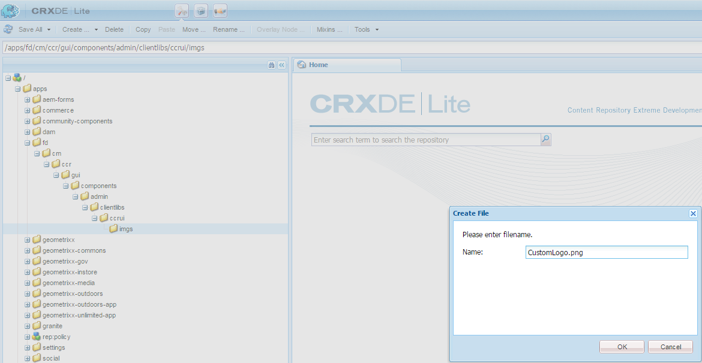

# Personalizar la interfaz de usuario de Crear correspondencia{#customize-create-correspondence-ui}

## Información general {#overview}

Administración de correspondencia le permite modificar la marca de su plantilla de solución para obtener un valor de marca mejor y adherirse a los estándares de marca de su organización. Para cambiar la marca de la interfaz de usuario, debe cambiar el logotipo de la organización, que se muestra en la esquina superior izquierda de la interfaz de usuario de Crear correspondencia.

Puede cambiar el logotipo en la interfaz de usuario de Crear correspondencia con el logotipo de su organización.


El icono personalizado en la interfaz de usuario de Crear correspondencia

### Cambiar el logotipo en la interfaz de usuario de Crear correspondencia {#changing-the-logo-in-the-create-correspondence-ui}

Para configurar una imagen de logotipo de su elección, haga lo siguiente:

1. Cree la estructura de carpetas adecuada [en CRX](#creatingfolderstructure).
1. [Cargue el nuevo archivo de logotipo](#uploadlogo) en la carpeta que ha creado en CRX.

1. [Configure la CSS](#createcss) en CRX para hacer referencia al nuevo logotipo.
1. Borre el historial del explorador y [actualice la interfaz de usuario de Crear correspondencia](#refreshccrui).

## Crear la estructura de carpetas necesaria {#creatingfolderstructure}

Cree la estructura de carpetas, como se explica a continuación, para alojar la imagen del logotipo personalizado y la hoja de estilo. La nueva estructura de carpetas con la carpeta raíz /apps es similar a la estructura de la carpeta /libs.

Para cualquier personalización, cree una estructura de carpetas paralela, como se explica más abajo, en la rama /apps.

La rama /apps (estructura de carpetas):

* Garantiza que los archivos estén seguros en caso de una actualización del sistema. En caso de actualización, un paquete de características o una corrección, la rama /libs se actualizará y si aloja los cambios en la rama /libs, se sobrescribirán.
* Ayuda a no alterar el sistema o rama actual, que podría desestabilizarse por error si utiliza las ubicaciones predeterminadas para almacenar los archivos personalizados.
* Ayuda a que los recursos obtengan una prioridad mayor cuando AEM busca recursos. AEM está configurado para buscar primero la rama /apps y luego la rama /libs para encontrar un recurso. Este mecanismo significa que el sistema utiliza la superposición (y las personalizaciones definidas).

Siga estos pasos para crear la estructura de carpetas necesaria en la rama /apps:

1. Vaya a `https://'[server]:[port]'/[ContextPath]/crx/de` e inicie sesión como administrador.
1. En la carpeta de aplicaciones, cree una carpeta denominada `css` con una ruta/estructura similar a la carpeta css (ubicada en la carpeta ccrui).

   Pasos para crear la carpeta css:

   1. Haga clic con el botón derecho en la carpeta **css** en la siguiente ruta y seleccione **Nodo de superposición**: `/libs/fd/cm/ccr/gui/components/admin/clientlibs/ccrui/css`

      

   1. Asegúrese de que el cuadro de diálogo Nodo de superposición tenga los siguientes valores:

      **Ruta:**/libs/fd/cm/ccr/gui/components/admin/clientlibs/ccrui/css

      **Ubicación de superposición:** /apps/

      **Coincidir tipos de nodo:** Comprobado

      

      >[!NOTE]
      >
      >No realice cambios en la rama /libs. Cualquier cambio que realice podría perderse, ya que esta rama puede cambiar siempre que haga lo siguiente:
      >
      >    
      >    
      >    * Actualice en su instancia
      >    * Aplique una corrección
      >    * Instale un paquete de características


   1. Haga clic en **Aceptar**. La carpeta css se creará en la ruta de acceso especificada.

1. En la carpeta de aplicaciones, cree una carpeta denominada `imgs` con una ruta/estructura similar a la carpeta imgs (ubicada en la carpeta ccrui).

   1. Haga clic con el botón derecho en la carpeta **imgs** en la siguiente ruta y seleccione **Nodo de superposición**: `/libs/fd/cm/ccr/gui/components/admin/clientlibs/ccrui/imgs`
   1. Asegúrese de que el cuadro de diálogo Nodo de superposición tenga los siguientes valores:

      **Ruta:**/libs/fd/cm/ccr/gui/components/admin/clientlibs/ccrui/imgs

      **Ubicación de superposición:** /apps/

      **Coincidir tipos de nodo:** Comprobado

   1. Haga clic en **Aceptar**.

      >[!NOTE]
      >
      >También puede crear manualmente la estructura de carpetas en la carpeta /apps.

1. Haga clic en **Guardar todo** para guardar los cambios en el servidor.

## Cargar el nuevo logotipo a CRX {#uploadlogo}

Cargue su archivo de logotipo personalizado en CRX. Las reglas HTML estándar rigen el procesamiento del logotipo. Los formatos de archivo de imagen admitidos dependerán del explorador que utilice para acceder a AEM Forms. Todos los exploradores admiten JPEG, GIF y PNG. Para obtener más información, consulte la documentación específica del explorador sobre los formatos de imagen admitidos.

* Las dimensiones predeterminadas de la imagen del logotipo son de 48 px &#42; 48 px. Asegúrese de que la imagen sea similar a este tamaño o mayor que 48 px &#42; 48 px.
* Si la altura de la imagen del logotipo es superior a 50 píxeles, la interfaz de usuario de Crear correspondencia reducirá la imagen a una altura máxima de 50 píxeles, ya que esta es la altura del encabezado. Al reducir la escala de la imagen, la interfaz de usuario de Crear correspondencia mantiene la relación de aspecto de la imagen.
* La interfaz de usuario de Crear correspondencia no aumenta la escala de la imagen si es pequeña, por lo que debe asegurarse de utilizar una imagen de logotipo con una altura mínima de 48 píxeles y una anchura suficiente para una mayor claridad.

Siga estos pasos para cargar el archivo de logotipo personalizado en CRX:

1. Vaya a `https://'[server]:[port]'/[contextpath]/crx/de`. Si es necesario, inicie sesión como administrador.
1. En CRXDE, haga clic con el botón derecho en la carpeta **imgs** en la siguiente ruta y seleccione **Crear > Crear archivo**:

   `/apps/fd/cm/ccr/gui/components/admin/clientlibs/ccrui/imgs/`

   

1. En el cuadro de diálogo Crear archivo, escriba el nombre del archivo como CustomLogo.png (o el nombre del archivo de logotipo).

   

1. Haga clic en **Guardar todo**.

   En el nuevo archivo que ha creado (aquí CustomLogo.png), aparecerá la propiedad jcr:content.

1. Haga clic en jcr:content en la estructura de carpetas.

   aparecerán las propiedades de jcr:content.

   

1. Haga doble clic en la propiedad **jcr:data**.

   Aparecerá el cuadro de diálogo Editar jcr:data.

   Ahora haga clic en la carpeta newlogo.png, haga doble clic en jcr:content (opción dim) y establezca el tipo nt:resource. Si no está presente, cree una propiedad con el nombre jcr:content.

1. En el cuadro de diálogo Editar jcr:data, haga clic en **Examinar** y seleccione el archivo de imagen que desee utilizar como logotipo (aquí CustomLogo.png).

   Los formatos de archivo de imagen admitidos dependerán del explorador que utilice para acceder a AEM Forms. Todos los exploradores admiten JPEG, GIF y PNG. Para obtener más información, consulte la documentación específica del explorador sobre los formatos de imagen admitidos.

   

   Ejemplo: CustomLogo.png para usar como logotipo personalizado

1. Haga clic en **Guardar todo**.

## Cree el CSS para integrar el logotipo con la interfaz de usuario {#createcss}

La imagen del logotipo personalizado requiere que se cargue una hoja de estilo adicional en el contexto de contenido.

Siga estos pasos para configurar la hoja de estilo y procesar el logotipo:

1. Vaya a `https://'[server]:[port]'/[contextpath]/crx/de`. Si es necesario, inicie sesión como administrador.
1. Cree un archivo llamado customcss.css (no puede usar un nombre de archivo diferente) en la siguiente ubicación:

   `/apps/fd/cm/ccr/gui/components/admin/clientlibs/ccrui/css/`

   Pasos para crear el archivo customcss.css:

   1. Haga clic con el botón derecho en la carpeta **css** y seleccione **Crear > Crear archivo**.
   1. En el cuadro de diálogo Nuevo archivo, especifique el nombre del CSS como `customcss.css` (no puede utilizar un nombre de archivo diferente) y haga clic en **Aceptar**.
   1. Agregue el siguiente código al archivo css recién creado. En content:url en el código, especifique el nombre de la imagen que ha cargado en la carpeta imgs en CRXDE.

      ```css
      .logo, .logo:after {
      content:url("../imgs/CustomLogo.png");
      }
      ```

   1. Haga clic en **Guardar todo**.

## Actualice la interfaz de usuario de Crear correspondencia para ver el logotipo personalizado {#refreshccrui}

Borre la memoria caché del explorador y, a continuación, abra la instancia Interfaz de usuario de Crear correspondencia en el explorador. Debería ver su logotipo personalizado.


El icono personalizado en la interfaz de usuario de Crear correspondencia
