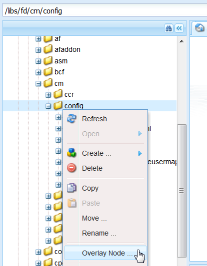

# Personalizar editor de texto{#customize-text-editor}

## Información general {#overview}

Puede personalizar el editor de texto, en Administrar recursos y Crear interfaz de usuario de correspondencia, para agregar más fuentes y tamaños de fuente. Estas fuentes incluyen fuentes inglesas y no inglesas, como el japonés.

Puede personalizar para cambiar lo siguiente en la configuración de fuente:

* Familia de fuentes y tamaño
* Propiedades como altura y espaciado entre letras
* Valores predeterminados de familia y tamaño de fuente, altura, espaciado entre letras y formato de fecha
* Sangrías de viñeta

Para ello, debe:

1. [Personalice las fuentes editando el archivo tbxeditor-config.xml en CRX](#customizefonts)
1. [Añadir fuentes personalizadas al equipo cliente](#addcustomfonts)

## Personalice las fuentes editando el archivo tbxeditor-config.xml en CRX {#customizefonts}

Para personalizar fuentes editando el archivo tbxeditor-config.xml, haga lo siguiente:

1. Vaya a `https://'[server]:[port]'/[ContextPath]/crx/de` e inicie sesión como administrador.
1. En la carpeta de aplicaciones, cree una carpeta denominada config con una ruta/estructura similar a la carpeta de configuración, que se encuentra en libs/fd/cm/config, siguiendo los pasos siguientes:

   1. Haga clic con el botón derecho en la carpeta items en la siguiente ruta y seleccione **Nodo de superposición**:

      `/libs/fd/cm/config`

      

   1. Asegúrese de que el cuadro de diálogo Nodo de superposición tiene los siguientes valores:

      **Ruta:** /libs/fd/cm/config

      **Ubicación:** /apps/

      **Coincidir tipos de nodo:** Seleccionado

      

   1. Haga clic en **Aceptar**. La estructura de carpetas se crea en la carpeta de aplicaciones.

   1. Haga clic en **Guardar todo**.

1. Cree una copia del archivo tbxeditor-config.xml en la carpeta de configuración recién creada, siguiendo los pasos siguientes:

   1. Haga clic con el botón derecho en el archivo tbxeditor-config.xml en libs/fd/cm/config y seleccione **Copiar**.
   1. Haga clic con el botón derecho en la siguiente carpeta y seleccione **Pegar:**

      `apps/fd/cm/config`

   1. El nombre del archivo pegado, de forma predeterminada, es `copy of tbxeditor-config.xml.` Cambie el nombre del archivo a `tbxeditor-config.xml` y haga clic en **Guardar todo**.

1. Abra el archivo tbxeditor-config.xml en apps/fd/cm/config y, a continuación, realice los cambios necesarios.

   1. Haga clic con el botón doble en el archivo tbxeditor-config.xml en apps/fd/cm/config. Se abre el archivo.

      ```xml
      <editorConfig>
         <bulletIndent>0.25in</bulletIndent>
      
         <defaultDateFormat>DD-MM-YYYY</defaultDateFormat>
      
         <fonts>
            <default>Times New Roman</default>
            <font>_sans</font>
            <font>_serif</font>
            <font>_typewriter</font>
            <font>Arial</font>
            <font>Courier</font>
            <font>Courier New</font>
            <font>Geneva</font>
            <font>Georgia</font>
            <font>Helvetica</font>
            <font>Tahoma</font>
            <font>Times New Roman</font>
            <font>Times</font>
            <font>Verdana</font>
         </fonts>
      
         <fontSizes>
            <default>12</default>
            <fontSize>8</fontSize>
            <fontSize>9</fontSize>
            <fontSize>10</fontSize>
            <fontSize>11</fontSize>
            <fontSize>12</fontSize>
            <fontSize>14</fontSize>
            <fontSize>16</fontSize>
            <fontSize>18</fontSize>
            <fontSize>20</fontSize>
            <fontSize>22</fontSize>
            <fontSize>24</fontSize>
            <fontSize>26</fontSize>
            <fontSize>28</fontSize>
            <fontSize>36</fontSize>
            <fontSize>48</fontSize>
            <fontSize>72</fontSize>
         </fontSizes>
      
         <lineHeights>
            <default>2</default>     
            <lineHeight>2</lineHeight>
            <lineHeight>3</lineHeight>
            <lineHeight>4</lineHeight>
            <lineHeight>5</lineHeight>
            <lineHeight>6</lineHeight>
            <lineHeight>7</lineHeight>
            <lineHeight>8</lineHeight>
            <lineHeight>9</lineHeight>
            <lineHeight>10</lineHeight>
            <lineHeight>11</lineHeight>
            <lineHeight>12</lineHeight>
            <lineHeight>13</lineHeight>
            <lineHeight>14</lineHeight>
            <lineHeight>15</lineHeight>
            <lineHeight>16</lineHeight>
         </lineHeights>
      
         <letterSpacings>
            <default>0</default>
            <letterSpacing>0</letterSpacing>
            <letterSpacing>1</letterSpacing>
            <letterSpacing>2</letterSpacing>
            <letterSpacing>3</letterSpacing>
            <letterSpacing>4</letterSpacing>
            <letterSpacing>5</letterSpacing>
            <letterSpacing>6</letterSpacing>
            <letterSpacing>7</letterSpacing>
            <letterSpacing>8</letterSpacing>
            <letterSpacing>9</letterSpacing>
            <letterSpacing>10</letterSpacing>
            <letterSpacing>11</letterSpacing>
            <letterSpacing>12</letterSpacing>
            <letterSpacing>13</letterSpacing>
            <letterSpacing>14</letterSpacing>
            <letterSpacing>15</letterSpacing>
            <letterSpacing>16</letterSpacing>
         </letterSpacings>
      </editorConfig>
      ```

   1. Realice los cambios necesarios en el archivo para cambiar lo siguiente en la configuración de fuente:

      * Añadir o quitar la familia y el tamaño de fuente
      * Propiedades como altura y espaciado entre letras
      * Valores predeterminados de familia y tamaño de fuente, altura, espaciado entre letras y formato de fecha
      * Sangrías de viñeta

      Por ejemplo, para agregar una fuente japonesa llamada Sazanami Mincho Medium, debe realizar la siguiente entrada en el archivo XML: `<font>Sazanami Mincho Medium</font>`. También necesita tener esta fuente instalada en el ordenador cliente para acceder a la personalización de fuentes y trabajar con ella. Para obtener más información, consulte [Añadir fuentes personalizadas al equipo cliente](#addcustomfonts).

      También puede cambiar los valores predeterminados para varios aspectos del texto y, al eliminar las entradas, quitar las fuentes del editor de texto.

   1. Haga clic en **Guardar todo**.


## Añadir fuentes personalizadas al equipo cliente {#addcustomfonts}

Al acceder a una fuente en el editor de texto de Correspondence Management, debe estar presente en el ordenador cliente que está utilizando para acceder a Correspondence Management. Para poder usar una fuente personalizada en el editor de texto, primero debe instalar la misma en el ordenador cliente.

Para obtener más información sobre la instalación de fuentes, consulte:

* [Instalación o desinstalación de fuentes en Windows](https://windows.microsoft.com/en-us/windows-vista/install-or-uninstall-fonts)
* [Conceptos básicos de Mac: Libro de fuentes](https://support.apple.com/en-us/HT201749)

## Acceso a las personalizaciones de fuentes {#access-font-customizations}

Después de realizar cambios en las fuentes del archivo tbxeditor-config.xml en CRX e instalar las fuentes necesarias en el ordenador cliente que se utiliza para acceder a AEM Forms, los cambios aparecerán en el editor de texto.

Por ejemplo, la fuente Sazanami Mincho Medium agregada en la [Personalice fuentes editando el archivo tbxeditor-config.xml en el procedimiento CRX](#customizefonts) aparece en la interfaz de usuario del editor de texto de la siguiente manera:


>[!NOTE]
>
>Para ver el texto en japonés, primero debe introducir el texto con caracteres japoneses. La aplicación de una fuente japonesa personalizada solo da formato al texto de una determinada manera. La aplicación de una fuente japonesa personalizada no cambia los caracteres ingleses ni otros caracteres a los japoneses.

