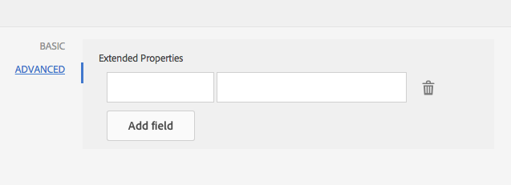

# Diccionario de datos{#data-dictionary}

## Introducción {#introduction}

Un diccionario de datos permite a los usuarios comerciales utilizar información de fuentes de datos back-end sin conocer detalles técnicos sobre sus modelos de datos subyacentes. Un diccionario de datos está compuesto por elementos de diccionario de datos (DDE). Estos elementos de datos se utilizan para integrar los datos del back-end en las letras como entrada para su uso en la correspondencia de un cliente.

Un diccionario de datos es una representación independiente de metadatos que describe las estructuras de datos subyacentes y sus atributos asociados. Se crea un diccionario de datos con vocabulario empresarial. Se puede asignar a uno o varios modelos de datos subyacentes.

El diccionario de datos está formado por elementos de tres tipos: Elementos simples, compuestos y de colección. Los DDE simples son elementos primitivos como cadenas, números, fechas y valores booleanos que contienen información como el nombre de una ciudad. Un DDE compuesto contiene otros DDE, que pueden ser de tipo primitivo, compuesto o colección. Por ejemplo, una dirección que consta de una dirección de calle, ciudad, provincia, país y código postal. Una colección es una lista de DDE simples o compuestos similares. Por ejemplo, un cliente con varias ubicaciones o distintas direcciones de facturación y envío.

Correspondence Management utiliza los datos del back-end, del cliente o de destinatario específicos almacenados según la estructura del diccionario de datos para crear correspondencia destinada a distintos clientes. Por ejemplo, se puede crear un documento con nombres descriptivos, como &quot;Estimado {Nombre}&quot;,&quot;Sr. {Apellidos}&quot;.

Normalmente, los usuarios empresariales no necesitan conocer las representaciones de metadatos como XSD (esquema XML) y clases Java. Sin embargo, generalmente requieren acceso a estas estructuras y atributos de datos para generar soluciones.

### Flujo de trabajo del diccionario de datos {#data-dictionary-workflow}

1. Un autor [crea el diccionario de datos](#createdatadictionary) cargando un esquema o desde cero.
1. El autor crea cartas y comunicaciones interactivas basadas en el diccionario de datos y asocia los elementos del diccionario de datos en carta y comunicaciones interactivas siempre que sea necesario.
1. Un autor puede descargar un archivo XML de datos de ejemplo, basado en el esquema de un diccionario de datos. El autor puede modificar el archivo XML de datos de ejemplo, que puede asociarse como datos de prueba con el diccionario de datos. Lo mismo se utiliza durante la previsualización de la letra.
1. Mientras [realiza una vista previa de una letra](../../forms/using/create-letter.md#p-types-of-linkage-available-for-each-of-the-fields-p), un autor elige la previsualización de la letra con datos (Previsualización personalizada). La carta se abre con los datos proporcionados por el autor. Esto se abre en la interfaz de creación de correspondencia. El agente que está previsualizando esta carta puede modificar el contenido, los datos y los datos adjuntos de esta carta y puede enviar la carta final. Para obtener más información sobre la creación de letras, consulte [Creación de correspondencia](../../forms/using/create-letter.md).

## Requisitos previos {#prerequisite}

Instale el [Paquete de compatibilidad](compatibility-package.md) para vista de la opción **Diccionarios de datos** en la página **Forms**.

## Crear un diccionario de datos {#createdatadictionary}

Puede utilizar el Editor de diccionario de datos para crear un diccionario de datos o puede cargar un archivo esquema XSD para crear un diccionario de datos basado en él. A continuación, puede ampliar el diccionario de datos agregando más información necesaria, incluidos los campos. Independientemente de cómo se creó el diccionario de datos, el propietario del proceso empresarial no necesita conocer los sistemas back-end. El propietario del proceso comercial sólo necesita conocer los objetos de dominio y sus definiciones para su proceso.

>[!NOTE]
>
>Para varias letras que requieren elementos similares, puede crear un diccionario de datos común. Sin embargo, un diccionario de datos grandes con un gran número de elementos puede provocar problemas de rendimiento al utilizar el diccionario de datos y cargar los elementos, como letras y fragmentos de documento. Si tiene problemas de rendimiento, intente crear diccionarios de datos independientes para letras diferentes.

1. Seleccione **Forms** > **Diccionarios de datos**.
1. Toque **Crear diccionario de datos**.
1. En la pantalla Propiedades, agregue lo siguiente:

   * **Título:**  (opcional) Introduzca el título del diccionario de datos. El título no tiene que ser único y puede tener caracteres especiales y caracteres no ingleses. Las letras y otros fragmentos de documento se mencionan con su título (cuando están disponibles), como en miniaturas y propiedades de recursos. Se hace referencia a los diccionarios de datos con sus nombres y no con títulos.
   * **Nombre:** el nombre único del diccionario de datos. En el campo Nombre, solo puede introducir caracteres, números y guiones en inglés. El campo Nombre se rellena automáticamente en función del campo Título y los caracteres especiales, espacios, números y caracteres no ingleses introducidos en el campo Título se sustituyen por guiones. Aunque el valor del campo Título se copia automáticamente en el Nombre, puede editarlo.

   * **Descripción**: (Opcional) Descripción del diccionario de datos.
   * **Etiquetas:**  (opcional) para crear una etiqueta personalizada, introduzca un valor en el campo de texto y pulse Intro. Puede ver la etiqueta debajo del campo de texto de las etiquetas. Al guardar este texto, también se crean las etiquetas recientemente agregadas.
   * **Propiedades** extendidas: (Opcional) Toque  **Añadir** campo para especificar atributos de metadatos para el diccionario de datos. En la columna Nombre de propiedad, introduzca un nombre de propiedad único. En la columna Valor, introduzca un valor para asociarlo a la propiedad.

   

1. (Opcional) Para cargar una definición de esquema XSD para el diccionario de datos, en el panel Estructura del diccionario de datos, toque **Cargar Esquema XML**. Vaya al archivo XSD, selecciónelo y toque **Abrir**. Se crea un diccionario de datos en función del esquema XML cargado. Es necesario modificar los nombres y las descripciones de los elementos en el diccionario de datos. Para ello, seleccione los nombres de los elementos tocándolos y editando sus descripciones, nombres para mostrar y otros detalles en los campos del panel derecho.

   Para obtener más información sobre los elementos de DD calculados, consulte [Elementos de diccionario de datos calculados](#computedddelements).

   >[!NOTE]
   >
   >Puede omitir la carga del archivo esquema y crear el diccionario de datos desde cero mediante la interfaz de usuario. Para ello, omita este paso y continúe con los pasos siguientes.

1. Toque **Siguiente**.
1. En la pantalla Añadir propiedades, agregue los elementos al diccionario de datos. También puede agregar o eliminar elementos y editar sus detalles si ha cargado un esquema para obtener una estructura básica del diccionario de datos.

   Puede tocar los tres puntos del lado derecho de un elemento y agregar un elemento a la estructura del diccionario de datos.

   

   Seleccione ya sea Elemento compuesto, Elemento de colección o Elemento primitivo.

   * Un DDE compuesto contiene otros DDE, que pueden ser de tipo primitivo, compuesto o colección. Por ejemplo, una dirección que consta de una dirección de calle, ciudad, provincia, país y código postal.
   * Los DDE primitivos son elementos como cadenas, números, fechas y valores booleanos que contienen información como el nombre de una ciudad.
   * Una colección es una lista de DDE simples o compuestos similares. Por ejemplo, un cliente con varias ubicaciones o distintas direcciones de facturación y envío.

   A continuación se indican algunas reglas para crear un diccionario de datos:

   * Solo se permite el tipo compuesto como DDE de nivel superior en un diccionario de datos.
   * Nombre, nombre de referencia y tipo de elemento son campos obligatorios para un diccionario de datos y DDE.
   * El nombre de referencia debe ser único.
   * Un DDE principal (compuesto) no puede tener dos elementos secundarios con el mismo nombre.
   * Los números solo contienen tipos de cadenas primitivas.

   Para obtener más información sobre los elementos Compuesto, Recopilación y Primitivo y trabajar con elementos del diccionario de datos, consulte [Asignación de elementos del diccionario de datos a Esquema XML](#mappingddetoschema).

   Para obtener información sobre las validaciones en el diccionario de datos, consulte [Validaciones del editor de diccionario de datos](#ddvalidations).

   

1. (Opcional) Después de seleccionar un elemento, en la ficha Avanzado puede agregar propiedades (atributos). También puede tocar **Añadir campo** y extender las propiedades de un elemento DD.

   

1. (Opcional) Puede eliminar cualquier elemento tocando los tres puntos a la derecha de un elemento y seleccionando **Eliminar**.

   

   >[!NOTE]
   >
   >Al eliminar un elemento compuesto/de colección con nodos secundarios, también se eliminan sus nodos secundarios.

1. (Opcional) Seleccione un elemento en el panel Estructura del diccionario de datos y en el panel Lista de campos y variables. Cambie o agregue cualquier atributo necesario asociado al elemento.
1. Toque **Guardar**.

### Crear copias de uno o más diccionario de datos {#create-copies-of-one-or-more-data-dictionary}

Para crear rápidamente uno o varios diccionarios de datos con propiedades y elementos similares a los diccionarios de datos existentes, puede copiarlos y pegarlos.

1. En la lista de diccionarios de datos, seleccione los diccionarios de datos correspondientes. La interfaz de usuario muestra el icono Copiar.
1. Pulse Copiar. La interfaz de usuario muestra el icono Pegar.
1. Toque Pegar. Aparecerá el cuadro de diálogo Pegar. El sistema asigna automáticamente nombres y títulos a los nuevos diccionarios de datos.
1. Si es necesario, edite el Título y el Nombre con los que desea guardar la copia del diccionario de datos.
1. Toque Pegar. Se crea la copia del diccionario de datos. Ahora puede realizar los cambios necesarios en el diccionario de datos recién creado.

## Consulte los fragmentos o documentos de documento que hacen referencia a un elemento del diccionario de datos {#see-the-document-fragments-or-documents-that-refer-to-a-data-dictionary-element}

Mientras edita o visualiza un diccionario de datos, puede ver qué elementos del diccionario de datos se denominan Textos, Condiciones, Cartas y Comunicaciones interactivas.

1. Realice una de las siguientes acciones para editar el diccionario de datos:

   * Pase el ratón sobre un diccionario de datos y toque Editar.
   * Seleccione un diccionario de datos y, a continuación, toque Editar en el encabezado.
   * Pase el ratón sobre un diccionario de datos y toque Seleccionar. A continuación, toque Editar en el encabezado.

   O toque un diccionario de datos para vista.

1. En el diccionario de datos, toque un elemento sencillo para seleccionarlo. Los elementos compuestos y de colección no tienen referencias.

   Junto con las propiedades Básico y Avanzado del elemento, también aparece Contenido de la Cuaresma.

1. Toque Contenido de la Cuaresma.

   La ficha Contenido de la Cuaresma aparece con lo siguiente: Textos, condiciones, cartas y comunicaciones interactivas. Cada uno de estos encabezados también muestra el número de referencias al elemento seleccionado.

1. Toque un encabezado para ver el nombre de los recursos que hacen referencia al elemento.

   

1. Para vista de contenido prestado para otro elemento, toque el elemento .
1. Para mostrar un recurso que hace referencia al elemento, toque su nombre. El navegador muestra el recurso, la carta o la comunicación interactiva.

## Trabajar con datos de prueba {#working-with-test-data}

1. En la página Diccionarios de datos, toque **Seleccionar**.
1. Toque un diccionario de datos para el que desee descargar datos de prueba y, a continuación, toque **Descargar datos XML de muestra**.
1. Toque **Aceptar** en el mensaje de alerta. Se descarga un archivo XML.
1. Abra el archivo XML con el Bloc de notas u otro editor XML. El archivo XML tiene la misma estructura que el diccionario de datos y las cadenas de marcador de posición de los elementos. Reemplace las cadenas de marcador de posición con los datos con los que desea probar una letra.

   ```xml
   <?xml version="1.0" encoding="UTF-8" standalone="no"?>
   <Company>
   <Name>string</Name>
   <Type>string</Type>
   <HeadOfficeAddress>
   <Street>string</Street>
   <City>string</City>
   <State>string</State>
   <Zip>string</Zip>
   </HeadOfficeAddress>
   <SalesOfficeAddress>
   <Street>string</Street>
   <City>string</City>
   <State>string</State>
   <Zip>string</Zip>
   </SalesOfficeAddress>
   <HeadCount>1.0</HeadCount>
   <CEO>
   <PersonName>
   <FirstName>string</FirstName>
   <MiddleName>string</MiddleName>
   <LastName>string</LastName>
   </PersonName>
   <DOB>string</DOB>
   <CurrAddress>
   <Street>string</Street>
   <City>string</City>
   <State>string</State>
   <Zip>string</Zip>
   </CurrAddress>
   <DOJ>14-04-1973</DOJ>
   <Phone>1.0</Phone>
   </CEO>
   </Company>
   ```

   >[!NOTE]
   >
   >En este ejemplo, XML crea espacio para tres valores en un elemento de recopilación, pero el número de valores se puede aumentar o reducir según los requisitos.

1. Después de realizar las entradas de datos, puede utilizar este archivo XML cuando esté previsualizando una carta con datos de prueba.

   Puede agregar estos datos de prueba con DD (seleccione DD y toque Cargar datos de prueba y cargar este archivo xml)
Después de esto, cuando previsualización la letra normalmente (no personalizada), los datos XML se utilizan en letras. También puede tocar Personalizado y, a continuación, cargar este XML.

## Ejemplos {#samples}

Los siguientes ejemplos de código muestran los detalles de implementación del diccionario de datos.

### Esquema de muestra que se puede cargar en el diccionario de datos {#sample-schema-that-can-be-uploaded-to-the-data-dictionary}

```xml
<?xml version="1.0" encoding="utf-8"?>
<xs:schema xmlns="DCT" targetNamespace="DCT" xmlns:xs="https://www.w3.org/2001/XMLSchema"
  elementFormDefault="qualified" attributeFormDefault="unqualified">
  <xs:element name="Company">
    <xs:complexType>
      <xs:sequence>
        <xs:element name="Name" type="xs:string"/>
        <xs:element name="Type" type="xs:anySimpleType"/>
        <xs:element name="HeadOfficeAddress" type="Address"/>
        <xs:element name="SalesOfficeAddress" type="Address" minOccurs="0"/>
        <xs:element name="HeadCount" type="xs:integer"/>
        <xs:element name="CEO" type="Employee"/>
        <xs:element name="Workers" type="Employee" maxOccurs="unbounded"/>
      </xs:sequence>
    </xs:complexType>
  </xs:element>
  <xs:complexType name="Employee">
    <xs:complexContent>
      <xs:extension  base="Person">
        <xs:sequence>
          <xs:element name="CurrAddress" type="Address"/>
          <xs:element name="DOJ" type="xs:date"/>
          <xs:element name="Phone" type="xs:integer"/>
        </xs:sequence>
      </xs:extension>
    </xs:complexContent>
  </xs:complexType>
  <xs:complexType name="Person">
    <xs:sequence>
      <xs:element name="PersonName" type="Name"/>
      <xs:element name="DOB" type="xs:dateTime"/>
    </xs:sequence>
  </xs:complexType>
  <xs:complexType name="Name">
    <xs:sequence>
      <xs:element name="FirstName" type="xs:string"/>
      <xs:element name="MiddleName" type="xs:string"/>
      <xs:element name="LastName" type="xs:string"/>
    </xs:sequence>
  </xs:complexType>
  <xs:complexType name="Address">
    <xs:sequence>
      <xs:element name="Street" type="xs:string"/>
      <xs:element name="City" type="xs:string"/>
      <xs:element name="State" type="xs:string"/>
      <xs:element name="Zip" type="xs:string"/>
    </xs:sequence>
  </xs:complexType>
</xs:schema>
```

## Atributos comunes asociados a un DDE {#common-attributes-associated-with-a-dde}

La siguiente tabla detalla los atributos comunes asociados con un DDE:

<table>
 <tbody>
  <tr>
   <td><strong>Atributo</strong></td>
   <td><strong>Tipo</strong></td>
   <td><strong>Descripción</strong></td>
  </tr>
  <tr>
   <td>Nombre</td>
   <td>Cadena</td>
   <td>Requerido.<br /> Nombre del DDE. Debe ser único.</td>
  </tr>
  <tr>
   <td>Nombre de referencia<br /></td>
   <td>Cadena</td>
   <td>Requerido. Nombre de referencia único para el DDE que permite hacer referencias al DDE que son independientes de los cambios en la jerarquía o estructura del diccionario de datos. Los módulos de texto se asignan con este nombre</td>
  </tr>
  <tr>
   <td>displayname</td>
   <td>Cadena</td>
   <td>Un nombre opcional sencillo para el usuario del DDE.</td>
  </tr>
  <tr>
   <td>Descripción</td>
   <td>Cadena</td>
   <td>Descripción del DDE.</td>
  </tr>
  <tr>
   <td>elementType</td>
   <td>Cadena</td>
   <td>Requerido. Tipo de DDE: CADENA, NÚMERO, FECHA, Booleano, COMPUESTO, COLECCIÓN.</td>
  </tr>
  <tr>
   <td>elementSubType</td>
   <td>Cadena</td>
   <td>Subtipo para DDE: ENUM. Solo se permite para STRING y NUMBER elementType.</td>
  </tr>
  <tr>
   <td>Clave</td>
   <td>Booleano</td>
   <td>Campo booleano que indica si un DDE es un elemento clave.</td>
  </tr>
  <tr>
   <td>Calculado</td>
   <td>Booleano</td>
   <td>Campo booleano que indica si se calcula un DDE. Un valor DDE calculado es una función de otros valores DDE. De forma predeterminada, se admiten expresiones jsp.</td>
  </tr>
  <tr>
   <td>expression</td>
   <td>Cadena</td>
   <td>La expresión del DDE "calculado". El servicio de evaluación de expresiones enviado de forma predeterminada admite expresiones JSP EL. Puede reemplazar el servicio de expresión con una implementación personalizada.</td>
  </tr>
  <tr>
   <td>valueSet</td>
   <td>Lista</td>
   <td>Conjunto de valores permitidos para un DDE de tipo Enum. Por ejemplo, el tipo de cuenta solo puede tener valores (Guardar, Actual).</td>
  </tr>
  <tr>
   <td>expandedProperties</td>
   <td>Objeto</td>
   <td>Mapa de propiedades personalizadas agregadas al DDE (información específica de la interfaz de usuario o cualquier otra información).</td>
  </tr>
  <tr>
   <td>Requerido</td>
   <td>Booleano</td>
   <td>El indicador indica que los datos de origen de instancia correspondientes al diccionario de datos deben contener el valor de este DDE concreto.</td>
  </tr>
  <tr>
   <td>Enlace</td>
   <td>BindingElement</td>
   <td>Enlace XML o Java del elemento.</td>
  </tr>
 </tbody>
</table>

### Elementos del diccionario de datos calculados {#computedddelements}

Un diccionario de datos también puede incluir elementos calculados. Un elemento de diccionario de datos calculado siempre está asociado a una expresión. Esta expresión se evalúa para obtener el valor de un elemento de diccionario de datos en tiempo de ejecución. Un valor DDE calculado es una función de otros valores DDE o literales. De forma predeterminada, se admiten expresiones de lenguaje de Expresión JSP (EL). Las expresiones EL utilizan los caracteres ${ } y las expresiones válidas pueden incluir literales, operadores, variables (referencias de elementos del diccionario de datos) y llamadas a funciones. Al hacer referencia a un elemento de diccionario de datos en la expresión, se utiliza el nombre de referencia del DDE. El nombre de referencia es único para cada elemento de diccionario de datos dentro de un diccionario de datos.

Un DDE PersonFullName calculado se puede asociar con una expresión de concatenación EL como ${PersonFirstName} ${PersonLastName}.

## Asignación de tipos de datos entre XSD y el diccionario de datos {#data-type-mapping-between-xsd-and-data-dictionary-br}

La exportación de un XSD requiere una asignación de datos específica, que se detalla en la siguiente tabla. La columna DDI indica el tipo del valor DDE como disponible en el DDI.

<table>
 <tbody>
  <tr>
   <td>XSD <br /> </td>
   <td><p>Diccionario de datos <br /> </p> </td>
   <td>DDI (tipo de datos de valor de instancia)<br /> </p> </td>
  </tr>
  <tr>
   <td><p>xs:element de tipo - Tipo compuesto<br /> </p> </td>
   <td>DDE de tipo - COMPOSITE<br /> </p> </td>
   <td>java.util.Map<br /> </td>
  </tr>
  <tr>
   <td><p>xs:element donde maxOccurs &gt; 1<br /> </p> </td>
   <td>DDE de tipo - COLLECTION-<br /> Se crea un nodo DDE junto al DDE COLLECTION que captura información del nodo COLLECTION principal. Lo mismo se crea para la recopilación de tipos de datos simples/compuestos. Siempre que tenga una COLECCIÓN del tipo compuesto, el árbol del diccionario de datos captura los campos constituyentes en los elementos secundarios del DDE creados para capturar información de tipo.<br /> - DDE (COLECCIÓN)<br /> - DDE(COMPOSITE para información de tipo)<br /> - DDE(STRING) field1<br /> - DDE(STRING) field2<br /> <br /> </p> </td>
   <td>java.util.List<br /> </td>
  </tr>
  <tr>
   <td>Atributo de tipo - xs:id <br /> </p> </td>
   <td>DDE de tipo - STRING <br /> </td>
   <td>java.lang.String<br /> </td>
  </tr>
  <tr>
   <td>xs:attribute /xs:element de tipo - xs:string</p> </td>
   <td>DDE de tipo - STRING<br /> </td>
   <td>java.lang.String<br /> </td>
  </tr>
  <tr>
   <td>xs:attribute /xs:element de tipo - xs: booleano <br /> </td>
   <td>DDE de tipo - Booleano <br /> </td>
   <td>java.lang.Boolean<br /> </td>
  </tr>
  <tr>
   <td>xs:attribute /xs:element del tipo - xs:date </td>
   <td>DDE de tipo - FECHA </td>
   <td>java.lang.String</td>
  </tr>
  <tr>
   <td>xs:attribute /xs:element de tipo - xs:integer </td>
   <td>DDE de tipo - NÚMERO </td>
   <td>java.lang.Double</td>
  </tr>
  <tr>
   <td>xs:attribute /xs:element de tipo - xs:long</td>
   <td>DDE de tipo - NÚMERO </td>
   <td>java.lang.Double</td>
  </tr>
  <tr>
   <td>xs:attribute /xs:element de tipo - xs:doble</td>
   <td>DDE de tipo - NÚMERO </td>
   <td>java.lang.Double</td>
  </tr>
  <tr>
   <td>Elemento de tipo enum y baseType - xs:string</td>
   <td>DDE de tipo<br /> - SUBtipo STRING<br /> - ENUM<br /> valueSet - los valores permitidos para ENUM<br /> </td>
   <td>java.lang.String</td>
  </tr>
 </tbody>
</table>

## Descargar un archivo de datos de muestra de un diccionario de datos {#download-a-sample-data-file-from-a-data-dictionary}

Una vez creado el diccionario de datos, puede descargarlo como archivo de datos de ejemplo XML para introducir entradas de texto.

1. En la página Diccionarios de datos, toque **Seleccionar** y, a continuación, toque un diccionario de datos para seleccionarlo.
1. Seleccione **Descargar datos XML de ejemplo**.
1. Toque **Aceptar** en el mensaje de alerta.

   Correspondence Management crea un archivo XML basado en la estructura del diccionario de datos seleccionado y lo descarga en el equipo con el nombre &lt;data-dictionary-name>-SampleData. Ahora puede editar este archivo en un editor de texto o XML para crear entradas de datos mientras [crea una letra](../../forms/using/create-letter.md).

## Internacionalización de metadatos {#internationalization-of-meta-data}

Si desea enviar la misma carta en distintos idiomas a sus clientes, puede localizar el nombre para mostrar, la descripción y los conjuntos de valores de enumeración de los elementos del diccionario de datos y del diccionario de datos.

### Localizar diccionario de datos {#localize-data-dictionary}

1. En la página Diccionarios de datos, toque **Seleccionar** y, a continuación, toque un diccionario de datos para seleccionarlo.
1. Toque **Descargar datos de Localización**.
1. Toque **Aceptar** en la alerta. Correspondence Management descarga un archivo zip en el equipo con el nombre DataDictionary-&lt;Nombre_de_documento>.zip.
1. El archivo Zip contiene un archivo .properties. Este archivo define el diccionario de datos descargado. El contenido del archivo de propiedades es similar al siguiente:

   ```ini
   #Wed May 20 16:06:23 BST 2015
   DataDictionary.EmployeeDD.description=
   DataDictionary.EmployeeDD.displayName=EmployeeDataDictionary
   DataDictionaryElement.name.description=
   DataDictionaryElement.name.displayName=name
   DataDictionaryElement.person.description=
   DataDictionaryElement.person.displayName=person
   ```

   La estructura del archivo de propiedades define una línea para la descripción y el nombre para mostrar del diccionario de datos y cada elemento del diccionario de datos en el diccionario de datos. Además, el archivo de propiedades define una línea para un valor de enumeración establecido para cada elemento del diccionario de datos. Al igual que con un diccionario de datos, el archivo de propiedades correspondiente puede tener varias definiciones de elementos del diccionario de datos. Además, el archivo puede contener las definiciones de uno o varios conjuntos de valores enum.

1. Para actualizar el archivo .properties en una configuración regional diferente, actualice los valores de nombre para mostrar y descripción del archivo. Cree más instancias del archivo para cada idioma en el que desee localizar. Solo se admiten los idiomas francés, alemán, japonés e inglés.

1. Guarde los distintos archivos de propiedades actualizados con los nombres siguientes:

   _fr_FR.properties Francés

   _de_DE.properties Alemán

   _ja_JA.properties Japonés

   _en_EN.properties Inglés

1. Archive el archivo .properties (o los archivos para varias configuraciones regionales) en un solo archivo .zip.

1. En la página Diccionarios de datos, seleccione **Más** > **Cargar datos de Localización** y seleccione el archivo zip con archivos de propiedades localizados.
1. Para vista de los cambios de localización, cambie la configuración regional del explorador.

## Validaciones del diccionario de datos {#ddvalidations}

El Editor del diccionario de datos aplica las siguientes validaciones al crear o actualizar un diccionario de datos.

* Solo se permite el tipo compuesto como elemento de nivel superior en un diccionario de datos.
* Los elementos Compuesto y Colección no están permitidos en el nivel de hoja. Solo se permiten elementos primitivos (cadena, fecha, número, booleano) en el nivel de hoja. Esta validación garantiza que no hay elementos compuestos y de recopilación sin un DDE secundario.
* Al cargar un archivo XSD para crear un diccionario de datos, el Editor del diccionario de datos solicita un elemento de nivel superior, si existen varios, para crear el diccionario de datos.
* El nombre es el único parámetro requerido para un diccionario de datos.
* Un DDE principal (compuesto) no puede tener dos elementos secundarios con el mismo nombre
* Garantiza que un DDE se marque como computado, solo si no es un parámetro requerido. No se puede calcular un elemento requerido y no se puede requerir un elemento calculado. Además, los elementos de colección y de composición no se pueden calcular.
* Garantiza que un DDE se marque como requerido, solo cuando no se calcule. También garantiza que no es el &quot;collectionElement&quot; el que denota el tipo de colección (es decir, los únicos elementos secundarios de un elemento de colección).
* No se permiten claves vacías ni claves de Duplicado en expandedProperties para un diccionario de datos o DDE.
* No utilice los dos puntos (:) ni los caracteres de barra vertical(|) dentro de la clave o el valor de una propiedad extendida. No hay validación para el uso de estos caracteres prohibidos.

Validaciones que se aplican en el nivel de diccionario de datos

* El nombre del diccionario de datos no debe ser nulo.
* El nombre del diccionario de datos solo debe contener caracteres alfanuméricos.
* La lista del elemento secundario del diccionario de datos no debe ser nula ni estar vacía.
* El diccionario de datos no debe contener más de un elemento de diccionario de datos de nivel superior.
* Solo se permite el tipo compuesto como elemento de nivel superior en un diccionario de datos.

Validaciones que se aplican en el nivel de elemento del diccionario de datos.

* Todos los nombres de DDE no deben ser nulos y no deben contener espacios.
* Todos los DDE deben tener un tipo de elemento &quot;no nulo/no nulo&quot;.
* Todos los nombres de referencia de DDE no deben ser nulos.
* Todos los nombres de referencia de DDE deben ser únicos.
* Todas las referencias de DDE solo deben contener caracteres alfanuméricos y &quot;_&quot;.
* Todos los nombres de pantalla DDE deben contener sólo caracteres alfanuméricos y &quot;_&quot;.
* Los elementos Compuesto y Colección no están permitidos en el nivel de hoja. Solo se permiten elementos primitivos (cadena, fecha, número, booleano) en el nivel de hoja. Esta validación garantiza que no hay elementos compuestos y de recopilación sin un DDE secundario.
* Un DDE principal compuesto no debe tener dos elementos secundarios con el mismo nombre.
* El subtipo ENUM solo se utiliza para los elementos String y Number.
* Los elementos de colección y compuestos no se pueden calcular.
* Un DDE no se puede calcular ni se requiere.
* Los DDE calculados deben contener una expresión válida.
* Los DDE calculados no deben tener un enlace XML.
* Un DDE que indica el tipo de un DDE de recopilación no se puede calcular ni se requiere.
* Los DDE de subtipo ENUM no deben contener conjuntos de valores nulos o vacíos.
* El enlace XML de un DDE de recopilación no debe asignarse a un atributo.
* La sintaxis de enlace XML debe ser válida; por ejemplo, sólo se muestra una @; la @ sólo se permite cuando va seguida de un nombre de atributo.

## Asignación de elementos del diccionario de datos al esquema XML {#mappingddetoschema}

Puede crear un diccionario de datos a partir de un Esquema XML o hacerlo mediante la interfaz de usuario del diccionario de datos. Todos los elementos del diccionario de datos (DDE) de un diccionario de datos tienen un campo Enlace XML para almacenar el enlace del DDE a un elemento del esquema XML. El enlace de cada DDE es relativo al DDE principal.

Los siguientes detalles muestran ejemplos de modelos y ejemplos de código que muestran detalles de implementación para el diccionario de datos.

## Asignación de elementos simples (primitivos) {#mapping-simple-primitive-elements}

Un DDE primitivo representa un campo o atributo de naturaleza atómica. Los DDE primitivos definidos fuera del ámbito de un tipo complejo (DDE compuesto) o un elemento repetitivo (DDE de colección) se pueden almacenar en cualquier ubicación dentro del Esquema XML. La ubicación de los datos correspondientes a un DDE primitivo no depende de la asignación de su DDE principal. DDE primitivo utiliza la información de asignación del campo Enlace XML para determinar su valor y las asignaciones se traducen en uno de los siguientes:

* un atributo
* un elemento
* un contexto de texto
* nada (un DDE omitido)

El siguiente ejemplo muestra un esquema simple.

```xml
<?xml version="1.0" encoding="UTF-8"?>
<xs:schema xmlns:xs="https://www.w3.org/2001/XMLSchema">
  <xs:element name='age' type='integer'/>
  <xs:element name='price' type='decimal'/>
</xs:schema>
```

| **Elemento Diccionario de datos** | **Enlace XML predeterminado** |
|---|---|
| age | /age |
| precio | /precio |

### Asignación de elementos compuestos {#mapping-composite-elements}

El enlace no es compatible con los elementos compuestos; si se proporciona el enlace, se ignora. El enlace para todos los DDE secundarios constituyentes de tipo primitivo debe ser absoluto. Permitir la asignación absoluta para elementos secundarios de un DDE compuesto proporciona más flexibilidad en términos de enlace XPath. La asignación de un DDE compuesto a un elemento de tipo complejo en el esquema XML limita el ámbito de enlace de sus elementos secundarios.

El siguiente ejemplo muestra el esquema de una nota.

```xml
<xs:element name="note">
    <xs:complexType>
        <xs:sequence>
            <xs:element name="to" type="xs:string"/>
            <xs:element name="from" type="xs:string"/>
            <xs:element name="heading" type="xs:string"/>
            <xs:element name="body" type="xs:string"/>
        </xs:sequence>
    </xs:complexType>
</xs:element>
```

<table>
 <tbody>
  <tr>
   <td><strong>Elemento Diccionario de datos</strong></td>
   <td><strong>Enlace XML predeterminado</strong></td>
  </tr>
  <tr>
   <td>nota</td>
   <td>empty(null)<br /> </td>
  </tr>
  <tr>
   <td>hasta</td>
   <td>/note/to</td>
  </tr>
  <tr>
   <td>de</td>
   <td>/note/from</td>
  </tr>
  <tr>
   <td>encabezado</td>
   <td>/note/heading</td>
  </tr>
  <tr>
   <td>body</td>
   <td>/note/body</td>
  </tr>
 </tbody>
</table>

### Asignación de elementos de colección {#mapping-collection-elements}

Un elemento de colección solo se asigna a otro elemento de colección que tiene cardinalidad > 1. Los DDE secundarios de un DDE de colección tienen un enlace XML relativo (local) con respecto al enlace XML de su principal. Dado que los DDE secundarios de un elemento de recopilación deben tener la misma cardinalidad que el elemento principal, el enlace relativo debe garantizar la restricción cardinal para que los DDE secundarios no apunten a un elemento de Esquema XML no repetido. En el ejemplo siguiente, la cardinalidad de &quot;TokenID&quot; debe ser la misma que &quot;Tokens&quot;, que es su DDE de recopilación principal.

Al asignar un DDE de colección a un elemento de Esquema XML:

* el enlace del DDE correspondiente al elemento Collection debe ser el XPath absoluto

* No proporcione ningún enlace para el DDE que representa el tipo de elemento Colección. Si se proporciona, se omitirá el enlace.

* El enlace para todos los DDE secundarios del elemento Collection debe ser relativo al elemento Collection principal.

El siguiente Esquema XML declara un elemento con el nombre Tokens y un atributo maxOccurs de &quot;unbounded&quot;. Por lo tanto, Tokens es un elemento de recopilación.

```xml
<?xml version="1.0" encoding="utf-8"?>
<Root>
  <Tokens>
    <TokenID>string</TokenID>
    <TokenText>
      <TextHeading>string</TextHeading>
      <TextBody>string</TextBody>
    </TokenText>
  </Tokens>
  <Tokens>
    <TokenID>string</TokenID>
    <TokenText>
      <TextHeading>string</TextHeading>
      <TextBody>string</TextBody>
    </TokenText>
  </Tokens>
  <Tokens>
    <TokenID>string</TokenID>
    <TokenText>
      <TextHeading>string</TextHeading>
      <TextBody>string</TextBody>
    </TokenText>
  </Tokens>
</Root>
```

El token.xsd asociado a este ejemplo sería:

```xml
<xs:element name="Root">
  <xs:complexType>
    <xs:sequence>
      <xs:element name="Tokens" type="TokenType" maxOccurs="unbounded"/>
    </xs:sequence>
  </xs:complexType>
</xs:element>

<xs:complexType name="TokenType">
  <xs:sequence>
    <xs:element name="TokenID" type="xs:string"/>
    <xs:element name="TokenText">
      <xs:complexType>
        <xs:sequence>
          <xs:element name="TextHeading" type="xs:string"/>
          <xs:element name="TextBody" type="xs:string"/>
        </xs:sequence>
      </xs:complexType>
    </xs:element>
  </xs:sequence>
</xs:complexType>
```

| **Elemento Diccionario de datos** | **Enlace XML predeterminado** |
|---|---|
| Raíz | empty(null) |
| Tokens | /Root/Tokens |
| Compuesto | empty(null) |
| TokenID | TokenID |
| TokenText | empty(null) |
| TokenHeading | TokenText/TextHeading |
| TokenBody | TokenText/TextBody |

