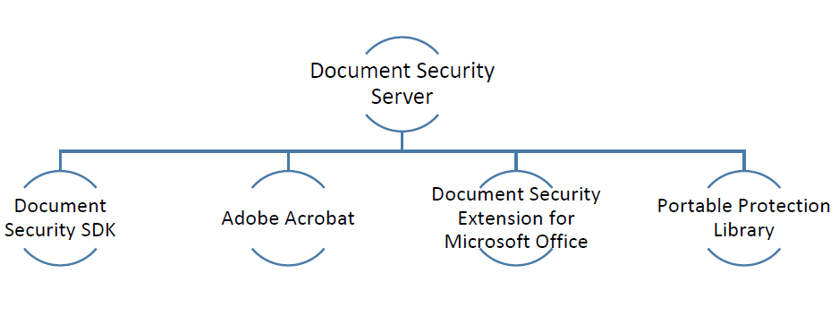

# Ofertas de seguridad de documentos{#document-security-offerings}

Adobe Experience Manager Forms document security garantiza que solo los usuarios autorizados puedan utilizar sus documentos. Con la seguridad de los documentos, puede distribuir de forma segura cualquier información guardada en un formato compatible. Los formatos de archivo admitidos son Adobe Portable Document Format (PDF) y Microsoft Word, Excel y PowerPoint.

Puede proteger los documentos mediante políticas. La configuración de confidencialidad que especifique en una directiva determina cómo un destinatario puede utilizar un documento al que aplica la directiva. Por ejemplo, puede especificar si los destinatarios pueden imprimir o copiar texto, editar texto o agregar firmas y comentarios a documentos protegidos.

Las directivas se almacenan en el servidor de seguridad de documentos; las políticas se aplican a los documentos a través de la aplicación cliente. Cuando aplica una directiva a un documento, la configuración de confidencialidad especificada en la directiva protege la información que contiene el documento. Puede distribuir el documento protegido por políticas a los destinatarios autorizados por la directiva.

En el diagrama siguiente se muestra la arquitectura típica de AEM Forms Document Security:

## Clientes de seguridad de documentos {#document-security-clients}

Document Security proporciona varios clientes para proteger documentos, ver y editar documentos protegidos e indexadores para permitir la búsqueda de texto completo en documentos protegidos. Puede elegir un cliente en función de sus necesidades y las capacidades del cliente.

Document Security Server es el componente central mediante el cual Document Security realiza transacciones como autenticación de usuarios, administración en tiempo real de políticas y aplicación de la confidencialidad. El servidor también proporciona un repositorio central para políticas, registros de auditoría y otra información relacionada.

El servidor de Document Security proporciona una interfaz basada en Web (página Web) para crear políticas, administrar documentos protegidos por políticas y supervisar eventos asociados a documentos protegidos por políticas. Los administradores también pueden configurar opciones globales como autenticación de usuarios, auditoría y mensajería para usuarios invitados y administrar cuentas de usuario invitadas.

El servidor está incluido en la oferta de complementos de AEM Forms Document Security. Puede ponerse en contacto con el [equipo de ventas](https://www.adobe.com/products/request-consultation/marketing-cloud.html?s_osc=70114000002JNwKAAW&amp;s_iid=70114000002JHs3AAG) de AEM Forms para adquirir el complemento Seguridad de documentos.

### Documentos de Protect {#protect-documents}

AEM Forms Document Security proporciona varias herramientas para aplicar políticas de seguridad. Puede elegir una herramienta según sus necesidades y especificaciones.

Puede utilizar el SDK de Document Security, Adobe Acrobat, Document Security Extension for Microsoft Office o Portable Protection Library para aplicar y rastrear las políticas de seguridad:

* **SDK de seguridad de documentos:** El SDK es un cliente con numerosas funciones. Puede utilizar el SDK de Document Security para acceder a la funcionalidad del servidor de documentos, abrir documentos protegidos por políticas y desarrollar extensiones, complementos o aplicaciones personalizados. Por ejemplo, puede desarrollar extensiones para proteger formatos de archivo personalizados o integrar SDK con soluciones de Prevención de pérdida de datos (DLP). Las extensiones, aplicaciones y complementos desarrollados con el SDK de Document Security envían documentos al servidor AEM Forms designado y las políticas se aplican en el servidor. Tenga en cuenta también que AEM Forms document security client SDK (CSDK) no puede desproteger los documentos protegidos mediante la biblioteca de protección portátil (PPL) y viceversa.

   El SDK de Document Security está disponible tanto para Java como para C++. El SDK de Java se incluye en la oferta de AEM Forms Document Security y se instala en la implementación de AEM formularios en JEE. Puede ponerse en contacto con [AEM equipo de asistencia](https://helpx.adobe.com/es/marketing-cloud/contact-support.html) para obtener el SDK de C++. El SDK de C++ se puede compilar con Microsoft Visual Studio 2013. Puede visitar el sitio [Document Security API documentation](https://help.adobe.com/en_US/livecycle/11.0/Services/WS92d06802c76abadb76c48dfe12dbeb3e281-7ff0.2.html) para aprender y utilizar las funciones del SDK.

* **Adobe Acrobat:** puede usar Adobe Acrobat para aplicar directivas de seguridad a documentos PDF creados con aplicaciones de escritorio populares, como Microsoft Office, navegadores web o cualquier aplicación que admita la impresión en formato PDF.

   Puede adquirir y descargar Adobe Acrobat desde el [sitio web de Adobe](https://acrobat.adobe.com/us/en/free-trial-download.html). El artículo [de Adobe Acrobat sobre la configuración de directivas de seguridad para archivos PDF](https://helpx.adobe.com/acrobat/using/setting-security-policies-pdfs.html) proporciona información detallada sobre la creación y aplicación de directivas en Adobe Acrobat.

* **Extensión de seguridad de documentos para Microsoft Office**: Puede utilizar la extensión de seguridad de documentos para Microsoft Office para aplicar directivas predefinidas a sus archivos de Microsoft Office desde los programas de Microsoft Office. La extensión garantiza que solo las personas autorizadas puedan utilizar archivos Microsoft Word, Excel y PowerPoint protegidos por políticas. Solo los usuarios autorizados que tengan el complemento instalado pueden utilizar los archivos protegidos por políticas.

   La extensión Document Security está disponible como complemento de Microsoft Office. Puede ponerse en contacto con [AEM equipo de asistencia](https://helpx.adobe.com/ca/marketing-cloud/contact-support.html) para obtener la extensión. Posteriormente, puede visitar la ayuda de [Document Security Extension for Microsoft Office](https://helpx.adobe.com/aem-forms/aem-document-security/download-installer.html) para obtener información sobre la instalación, configuración y uso de la extensión.

* **Biblioteca de protección portátil:** la Biblioteca de protección portátil (PPL) protege un documento localmente, sin enviarlo al servidor de AEM Forms. Solo las credenciales de seguridad y los detalles de las políticas viajan por la red. PPL también le permite limitar el acceso a la recuperación de directivas solo a los usuarios que iniciaron sesión. Puede recuperar directivas con el contexto del usuario que ha iniciado sesión en AEM usuario.

   Junto con lo anterior, la biblioteca de protección adecuada tiene todas las funciones del SDK de seguridad de documentos. Puede utilizar el SDK de Document Security para acceder a la funcionalidad del servidor de documentos, abrir documentos protegidos por políticas y desarrollar extensiones, complementos o aplicaciones personalizados. Tenga en cuenta también que la biblioteca de protección portátil (PPL) no puede desproteger los documentos protegidos mediante el SDK del cliente de seguridad de documentos (CSDK) de AEM Forms y viceversa.

   La biblioteca de protección portátil está disponible para los idiomas Java y C++ en versiones de 32 y 64 bits. También está disponible como un paquete OSGi para AEM Forms en OSGi. La PPL C++ se puede compilar con Microsoft Visual Studio 2013. Si tiene una licencia para el complemento de seguridad de documentos de AEM Forms, puede ponerse en contacto con el equipo de soporte de [Seguridad de documentos de AEM Forms](https://helpx.adobe.com/marketing-cloud/contact-support.html) para adquirir la biblioteca de protección portátil. Más adelante, puede utilizar la Ayuda de la biblioteca de protección portátil (incluida en la biblioteca) para configurar y utilizar la biblioteca de protección portátil.

### Ver o editar documentos protegidos {#view-or-edit-protected-documents}

* Para **documentos PDF**, puede utilizar Adobe Acrobat DC, Acrobat Reader y Acrobat Reader Mobile para ver documentos PDF protegidos. La mayoría de los usuarios ya tienen Acrobat Reader instalado en sus dispositivos, por lo que no necesitan obtener o aprender software adicional para ver documentos protegidos. También puede descargar el Acrobat Reader desde el [sitio web de descargas de Acrobat Reader](https://get.adobe.com/reader/).

* Para **documentos de Microsoft Office**, necesita la extensión de Microsoft Office y AEM Forms Document Security para Microsoft Office. La extensión Document Security está disponible como complemento de Microsoft Office. Puede descargar la extensión desde el sitio web de Adobe.

### Indexación de documentos protegidos {#index-protected-documents}

Los motores de búsqueda de texto completo de Microsoft Windows (servidor de SharePoint Index) y Adobe Experience Manager (AEM) pueden realizar búsquedas de texto completo en formatos de documento usados con más frecuencia, como archivos de texto sin formato, documentos de Microsoft Office y documentos PDF. Puede utilizar los indexadores de Document Security para habilitar los motores de búsqueda de texto completo para buscar documentos PDF protegidos:

* **indexador de iFilter:** puede usar el indexador de iFilter para indexar documentos PDF protegidos y habilitar los motores de búsqueda de texto completo de Microsoft Windows (Servicio de indexación de escritorio y servidor de indexación de SharePoint) para buscar documentos PDF protegidos. Para obtener información detallada, consulte [AEM SharePoint IFilter para documentos protegidos](assets/sharepoint-ifilter-doc-security.pdf).

* **Indexador de seguridad de documentos de AEM Forms:** puede utilizar el indizador de seguridad de documentos de AEM Forms para indexar documentos PDF protegidos y permitir que Adobe Experience Manager busque documentos PDF protegidos. Los indexadores forman parte de la oferta AEM Forms Document Security. Estos se incluyen en AEM Forms en instaladores JEE.

