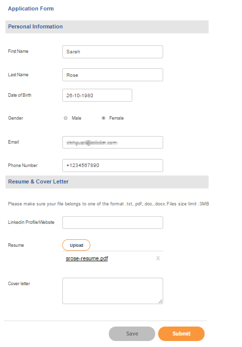
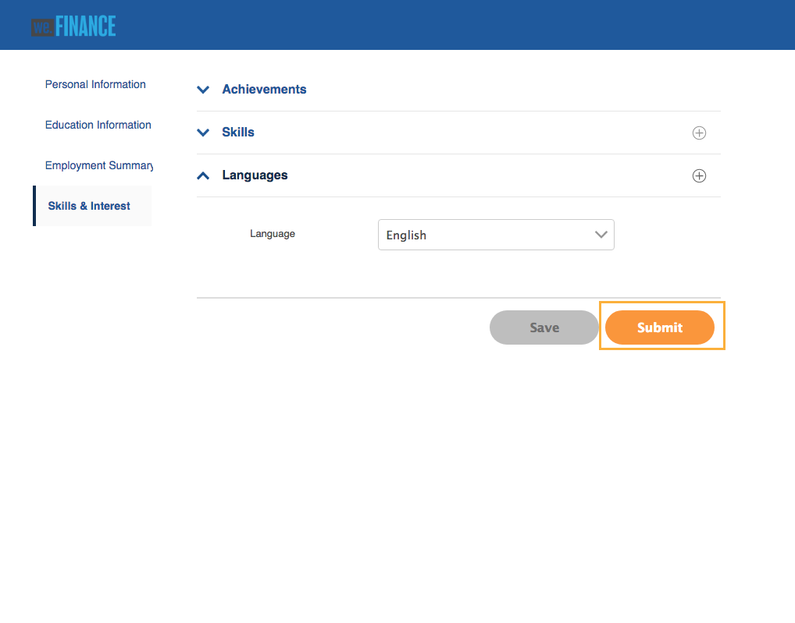

# Recorrido del sitio de referencia de contratación de empleados {#employee-recruitment-reference-site-walkthrough}

## Información general {#overview}

We.Finance es una organización que permite a los candidatos solicitar empleo a través del portal de referencia. La organización también utiliza el portal para administrar la programación de entrevistas, la lista de preseleccionados y la comunicación interna de los candidatos. El sitio administra lo siguiente:

* Candidatos que buscan y solicitan trabajos
* Selección y preselección de candidatos
* Proceso de entrevistas
* Recopilación de detalles de los candidatos
* Comprobación de fondo de candidato
* Despliegue de ofertas a los candidatos seleccionados

>[!NOTE]
>
>Los casos de uso de contratación de empleados están disponibles en los sitios de referencia de We.Finance y We.Gov. Los ejemplos, imágenes y descripciones utilizados en los tutoriales utilizan el sitio de referencia We.Finance. Sin embargo, puede ejecutar estos casos de uso y revisar los artefactos usando We.Gov también. Para ello, reemplace **we-finance** por **we-gov** en las direcciones URL mencionadas.

### Los modelos de flujo de trabajo implicados {#workflow-models-involved}

El caso de uso de contratación de empleados implica dos flujos de trabajo:

* Antes de la entrevista: Flujo de trabajo de contratación de empleados de finanzas
* Después de la entrevista: nosotros financiamos el flujo de trabajo de la entrevista posterior de contratación de empleados

Estos flujos de trabajo se crean en AEM y se pueden encontrar en:

`https://[authorHost]:[authorPort]/libs/cq/workflow/admin/console/content/models.html/etc/workflow/models/`

#### Flujo de trabajo de contratación de empleados de finanzas {#we-finance-employee-recruiting-workflow}

A continuación se muestra el modelo del flujo de trabajo de contratación de empleados de We Finance seguido en este documento.

#### Flujo de trabajo de posentrevista de contratación de empleados de finanzas {#we-finance-employee-recruiting-post-interview-workflow}

A continuación se muestra el modelo del flujo de trabajo de contratación de postentrevista de empleados de We Finance seguido en este documento.

### Personas {#personas}

El escenario incluye las siguientes personas:

* Sarah Rose, la candidata que solicita un trabajo en la organización
* John Jacobs, el reclutador
* Gloria Rios, la gerente de contratación
* John Doe, la persona de Recursos Humanos

## Sarah solicita un trabajo {#sarah-applies-for-a-job}

Sarah Rose está buscando una oportunidad de trabajo en la organización. Ella visita su portal web y explora las ofertas de empleo que se enumeran en la página de ofertas de empleo. Ella encuentra un listado de trabajo coincidente y solicita el mismo.

Página de inicio We.Finance

Página de carrera de We.Finance

Sarah hace clic en Aplicar en una publicación de trabajo. Se abre el formulario de solicitud de trabajo. Ella completa todos los detalles de la solicitud y la presenta.

### Cómo funciona {#how-it-works}

La página de inicio We.Finance y la página de carrera son páginas de AEM Sites. La página de carrera incorpora un formulario adaptable, que utiliza un panel repetible para recuperar las ofertas de trabajo mediante un servicio y las lista en la página. Puede revisar el formulario adaptable en `https://[authorHost]:[authorPort]/editor.html/content/forms/af/we-finance/employee/recruitment/jobs.html`.

### Véalo usted mismo {#see-it-yourself}

Vaya a `https://[publishHost]:[publishPort]/content/we-finance/global/en.html` y haga clic en **[!UICONTROL Carrera]**. Haga clic en **[!UICONTROL Buscar]** para completar la lista de trabajo y luego haga clic en **[!UICONTROL Aplicar]** para un trabajo. Rellene los detalles del formulario y envíe la solicitud.

Asegúrese de especificar un ID de correo electrónico válido en la aplicación, ya que cualquier comunicación a través de este tutorial se enviará al ID de correo electrónico especificado.

## John Jacobs preselecciona al perfil de Sarah Rose para la selección de gerente de contratación {#john-jacobs-shortlists-sarah-rose-s-profile-for-the-hiring-manager-s-screening}

La organización recibe la solicitud de empleo presentada por Sarah. A John Jacobs, un reclutador, se le asigna la tarea de revisar el perfil de Sarah. Revisa la tarea en su Bandeja de entrada AEM, encuentra el perfil que coincide con el requisito de trabajo y hace clic en Lista de métodos abreviados. El perfil de Sarah se reenvía a Gloria Rios, la gerente de contratación, para su aprobación.

La bandeja de entrada AEM de John

John Jacobs preselecciona al perfil de Sarah Rose para la selección de gerente de contratación

**Cómo funciona**

La acción de envío del formulario de solicitud de trabajo déclencheur un flujo de trabajo que crea una tarea en la bandeja de entrada de John Jacob para filtrar la aplicación. Cuando John revisa y enumera la aplicación, el flujo de trabajo crea una tarea en el administrador de contratación, la bandeja de entrada de Gloria.

### Véalo usted mismo {#see-it-yourself-1}

Vaya a `https://[publishHost]:[publishPort]/content/we-finance/global/en/login.html?resource=/aem/inbox.html`e inicie sesión con jjacobs/password como nombre de usuario/contraseña para John Jacobs. Abra la tarea de Revisión de Perfiles Candidatos y preseleccione al solicitante.

## Gloria revisa la solicitud y aprueba al solicitante para una entrevista {#gloria-reviews-the-application-and-approves-the-applicant-for-an-interview}

Gloria, la gerente de contratación, recibe el perfil preseleccionado como una tarea en su Bandeja de entrada AEM. Ella lo reseña y aprueba a la candidata, Sarah Rose, para la entrevista.

La bandeja de entrada AEM de Gloria

Gloria aprueba a Sarah Rose para una entrevista

**Cómo funciona**

Cuando Gloria aprueba al candidato para una entrevista, el flujo de trabajo crea una tarea en la Bandeja de entrada AEM de John Doe, que es un reclutador para We.Finance.

### Véalo usted mismo {#see-it-yourself-2}

Vaya a `https://[publishHost]:[publishPort]/content/we-finance/global/en/login.html?resource=/aem/inbox.html` e inicie sesión con jjacobs/password como nombre de usuario/contraseña para John Jacobs. Abra la tarea de Revisión de Perfiles Candidatos y preseleccione al solicitante.

Vaya a `https://[publishHost]:[publishPort]/content/we-finance/global/en/login.html?resource=/aem/inbox.html` e inicie sesión usando grios/password como nombre de usuario/contraseña para Gloria Rios. Abra la tarea Revisión de Perfil de candidatos y haga clic en Programar entrevista.

## John Doe programa una entrevista {#john-doe-schedules-an-interview}

John Doe recibe la tarea de programar una entrevista en su bandeja de entrada. John Doe selecciona y abre la tarea y fija la fecha y hora de la entrevista, el lugar y la persona de Recursos Humanos responsable de la entrevista como John Jacob. John Doe hace clic en Enviar correo electrónico de invitación. Se envía un correo electrónico a Sarah y se asigna una tarea a Gloria, la directora de contratación, para entrevistar a Sarah.

Bandeja de entrada de AEM de John Doe

John Doe programa la entrevista y envía los detalles a Sarah Rose

## Sarah Rose recibe el correo electrónico con el programa de entrevistas {#sarah-rose-receives-the-email-with-interview-schedule}

Sarah Rose recibe el correo electrónico con el programa de entrevistas, el lugar de celebración y otros detalles. Ella hace clic en Aceptar para indicar que está bien con el programa y el lugar de la entrevista. Según la información precisa, Sarah llega a las entrevistas.

Sarah Rose recibe el programa de entrevistas

## Después de las entrevistas, el gerente de contratación hace una lista de Sarah Rose {#after-the-interviews-the-hiring-manager-shortlists-sarah-rose}

Después de que Sarah Rose recorra las entrevistas y las borra, Gloria Rios, la directora de contratación, abre la tarea de selección de candidatos desde su bandeja de entrada y hace clic en Seleccionar. La decisión de Gloria Rios se transmite a la persona de Recursos Humanos, John Doe, para su posterior procesamiento.

La bandeja de entrada AEM de Gloria

Gloria Rios selecciona a Sarah Rose después de las entrevistas

## John Doe solicita más información {#john-doe-requests-more-information}

Antes de pedir a una candidata que se una a la organización, sus antecedentes deben ser comprobados. John Doe abre y revisa los detalles de la candidata seleccionada y encuentra que algunos de sus detalles de empleo y educación todavía no se han rellenado. John Doe hace clic en Necesita más información.

 

John Doe solicita más información de Sarah Rose sobre su educación y experiencia laboral

## Sarah Rose recibe un correo electrónico solicitando más información {#sarah-rose-receives-an-email-requesting-further-information}

Sarah Rose recibe un correo electrónico en el que le notifica que se necesita más información para procesar su solicitud de empleo. El correo electrónico incluye un vínculo al formulario para rellenar la información requerida.

Sarah Rose recibe un correo electrónico en el que se notifica que se necesita más información para procesar su solicitud de empleo

Sarah hace clic en el vínculo Proporcionar detalles del correo electrónico. Aparece un formulario. Sarah rellena los detalles requeridos de educación y empleo como lo solicitó John Doe y hace clic en Enviar.

Sarah abre el formulario de información adicional haciendo clic en el vínculo del correo electrónico

Sarah rellena la información adicional solicitada por John Doe y hace clic en Enviar

## John Doe revisa el perfil seleccionado para obtener la información adicional proporcionada {#john-doe-reviews-the-selected-candidate-profile-for-the-additional-information-provided}

John Doe selecciona la solicitud de revisión de candidato y la abre. John Doe descubre que Sarah ha llenado toda la información necesaria. Después de revisar la aplicación, John Doe hace clic en Aprobar. Con la aprobación de John Doe, la solicitud de realizar una verificación de antecedentes de Sarah Rose se envía a John Jacobs.

La bandeja de entrada AEM de John Doe

John Doe revisa la información adicional proporcionada por Sarah y la aprueba

## John Jacobs recibe una solicitud de comprobación de antecedentes {#john-jacobs-receives-a-background-check-request}

John Jacobs ve la solicitud de comprobación en segundo plano en su bandeja de entrada. John Jacobs abre la tarea y revisa la información proporcionada por Sarah Rose. Después de realizar una comprobación en segundo plano, John Jacobs hace clic en Ir adelante para indicar que la comprobación en segundo plano se ha realizado correctamente.

La bandeja de entrada de AEM de John Jacobs

Después de realizar la comprobación de fondo, John Jacobs hace clic en Ir adelante

## John Doe envía la carta de unión a Sarah Rose {#john-doe-sends-out-the-joining-letter-to-sarah-rose}

John Doe recibe una solicitud en su bandeja de entrada AEM para enviar la carta de unión. John abre la solicitud y vista los detalles. John Doe adjunta el PDF de la letra de unión y, a continuación, hace clic en Adjuntar y enviar carta de unión.

Bandeja de entrada de AEM de John Doe

John Doe envía la carta de unión para firmar

## Sarah Rose recibe y firma la carta de unión {#sarah-rose-receives-and-signs-the-joining-letter}

Sarah Rose recibe la carta de unión para firmar. Sarah hace clic aquí para revisar y firmar la carta de unión. El PDF con letras unificadas se abre con un campo para firmar el documento.

Sarah Rose recibe la carta de unión para firmar

Sarah puede elegir entre escribir, utilizar dibujar para escribir a mano, insertar una imagen de firma o usar la pantalla táctil de su móvil para dibujar su firma. Sarah escribe su nombre, hace clic en Haga clic para firmar y descarga la copia firmada de la carta de unión.

Sarah escribe su nombre para firmar la carta de unión

Sarah hace clic en Haga clic para firmar para completar la firma de la carta de unión

