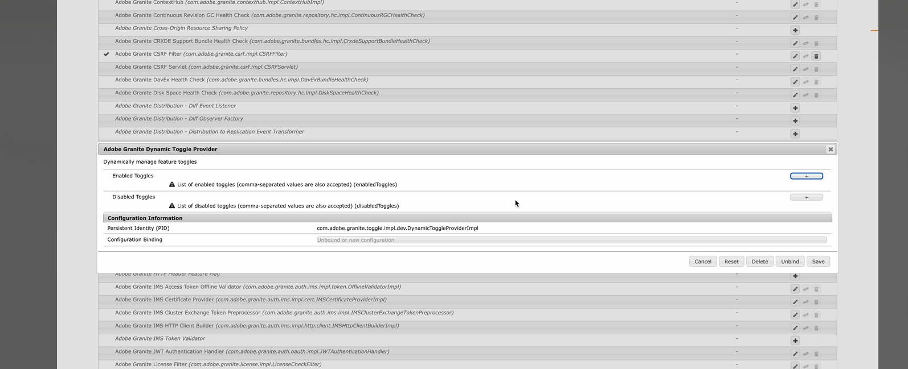

# Alternancia de funciones en Adobe Experience Manager AEM () 6.5{#enable-feature-toggle-aem-forms-65}

AEM La opción de alternancia de funciones es una funcionalidad en la que los administradores pueden habilitar o deshabilitar de forma dinámica determinadas funciones. Esta funcionalidad es especialmente útil para administrar **las características de los primeros usuarios** y **las características de la versión preliminar** sin que sea necesario realizar implementaciones o cambios importantes en la base de código. AEM Garantiza la flexibilidad y el control sobre las funciones accesibles en un entorno de.

## Activar alternancia de función {#enable-feature-toggle-65}

AEM Se pueden configurar cambios de características para los usuarios que las adoptaron por primera vez o nuevas características a través de la **consola web de** siguiendo los pasos a continuación:

1. Inicie sesión en la instancia de AEM Forms.
2. Navegue hasta `http://<author-instance-url>:portnumber/system/console/configMgr`.
3. Busque **Adobe Granite Dynamic Toggle Provider** en el Administrador de configuración.
4. Haga clic en el icono .
5. En la sección [!UICONTROL Conmutadores habilitados], haga clic en .
6. Añada el ID de alternancia de función para la función como se muestra en la siguiente imagen.
   

   >[!NOTE]
   >
   >Puede encontrar el ID de alternancia de funciones en el documento específico de las funciones que adoptaron por primera vez.

7. Haga clic en Guardar.

## Deshabilitar alternancia de funciones {#disable-feature-toggle-65}

Para desactivar las opciones de características para aquellas características cuyas opciones están activadas, siga los pasos a continuación:

1. Inicie sesión en la instancia de AEM Forms.
2. Navegue hasta `http://<author-instance-url>:portnumber/system/console/configMgr`.
3. Busque **Adobe Granite Dynamic Toggle Provider** en el Administrador de configuración.
4. Haga clic en el icono .
5. En la sección [!UICONTROL Conmutadores deshabilitados], haga clic en .
6. Añada el número de conmutador para que la función se desactive.
   
7. Haga clic en Guardar.

## Consideración técnica

Las alternancias de funciones son específicas del entorno y se administran durante la ejecución, por lo que no requieren el reinicio del servidor. Sin embargo, algunas funciones pueden requerir la actualización de las páginas relevantes o la limpieza de la caché para reflejar los cambios.
Puede acceder a la lista de características habilitadas mediante la alternancia de características para su entorno mediante `http://<author-instance-url>:4502/etc.clientlibs/toggles.json`.