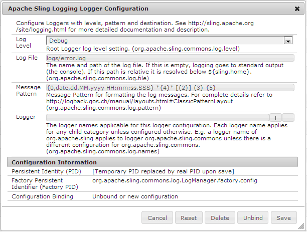

# Habilitar el registro para formularios HTML5{#enable-logging-for-html-forms}

Puede configurar la utilidad del registrador para crear inicios para los registros de formularios HTML5. La utilidad del registrador tiene varios niveles, puede establecer un nivel según sus necesidades. Los formularios HTML5 tienen componentes de servidor y de cliente. Puede configurar registros para ambos componentes.

## Configuración del registro del lado del servidor {#configuring-server-side-logging}

Siga los pasos siguientes para configurar los registros del lado del servidor:

1. Ir a `https://'[server]:[port]'/system/console/configMgr`. Busque y abra la opción *Configuración del registrador de registro de Sling de Apple*. Aparecerá un cuadro de diálogo:

   

   Opción de configuración del registrador de registros de Sling de Apple

1. Cambie el **Nivel de registro** a **Depurar**.

1. Especifique el nombre y la ruta del **archivo de registro**.

   >[!NOTE]
   >
   >Para generar registros en el directorio de registro de formularios HTML5, agregue ../logs/ antes del nombre del archivo.

1. Cambie **Logger** a **HTMLFormsPerfLogger**. Haga clic en **Guardar**.

## Configuración del registro de cliente {#configuring-client-logging}

Puede utilizar los siguientes métodos para habilitar el registro en el lado del cliente en formularios HTML5:

* Uso del parámetro de solicitud denominado `log`
* Uso de CQ Configuration Manager

### Habilitación del registro mediante el parámetro de solicitud {#enabling-logging-using-request-parameter}

Con este método, puede generar registros para una solicitud en particular. El nombre del parámetro de solicitud es `log. La dirección URL del registro es la siguiente:

`https://<server>:<port>/content/xfaforms/profiles/test.html?contentRoot=<path of the folder containing form xdp>&template=<name of the xdp>&log=<log configuration>.`

La configuración del registro está formada por el nivel de registro y la categoría del registrador.

#### Destino de registro {#log-destination}

<table>
 <tbody>
  <tr>
   <th><strong>Destino del registro</strong></th>
   <th><strong>Descripción</strong></th>
  </tr>
  <tr>
   <td>1</td>
   <td>Los registros se dirigen al explorador <strong>Consola</strong></td>
  </tr>
  <tr>
   <td>2</td>
   <td>Los registros se recopilan en un objeto JavaScript del lado del cliente y se pueden publicar en <strong>Server</strong> </td>
  </tr>
  <tr>
   <td>3</td>
   <td>Ambas opciones anteriores  </td>
  </tr>
 </tbody>
</table>

#### Niveles de registro {#log-levels}

<table>
 <tbody>
  <tr>
   <th>Nivel de registro</th>
   <th>Descripción</th>
  </tr>
  <tr>
   <td>0</td>
   <td>DESACTIVADO  </td>
  </tr>
  <tr>
   <td>3</td>
   <td>FATAL  </td>
  </tr>
  <tr>
   <td>2</td>
   <td>ERROR  </td>
  </tr>
  <tr>
   <td>1</td>
   <td>AVISAR  </td>
  </tr>
  <tr>
   <td>4</td>
   <td>INFORMACIÓN  </td>
  </tr>
  <tr>
   <td>5</td>
   <td>DEPURACIONES  </td>
  </tr>
  <tr>
   <td>6</td>
   <td>TRACE  </td>
  </tr>
  <tr>
   <td>7</td>
   <td>TODO  </td>
  </tr>
 </tbody>
</table>

#### Categorías del registrador {#logger-categories}

<table>
 <tbody>
  <tr>
   <th>Categoría de registro</th>
   <th>Descripción</th>
  </tr>
  <tr>
   <td>una</td>
   <td>xfa (Registros relacionados con el motor de secuencias de comandos)</td>
  </tr>
  <tr>
   <td>b)</td>
   <td>xfaView (Registros relacionados con el motor de diseño)  </td>
  </tr>
  <tr>
   <td>c</td>
   <td>xfaPerf (Registros relacionados con el rendimiento)  </td>
  </tr>
 </tbody>
</table>

#### Configuración de registro {#log-configuration}

En la URL del registro, el parámetro de cadena de consulta de configuración del registro se define de la siguiente manera:

`{destination}-{a level}-{b level}-{c level}`

Por ejemplo:

<table>
 <tbody>
  <tr>
   <th>Configuración de registro</th>
   <th>Descripción</th>
  </tr>
  <tr>
   <td>2-a4-b5-c6  </td>
   <td>Destino: Nivel xfa del servidor : INFO  nivel xfaView: DEBUG  nivel xfaPerf: TRACE</td>
  </tr>
 </tbody>
</table>

>[!NOTE]
>
>El nivel de registro predeterminado para cada categoría de registro a (xfa), b (xfaView) y c (xfaPerf) es 2 (ERROR). En consecuencia, para la configuración del registro: 2-b6, los niveles de registro para las diferentes categorías son:
>a xfa): 2 (nivel predeterminado ERROR)
>b (xfaView): 6 (TRACE especificado por el usuario)
>a (xfaPerf): 2 (nivel predeterminado ERROR)

### Habilitación del registro mediante Configuration Manager {#enabling-logging-using-configuration-manager}

Si utiliza Configuration Manager para habilitar el registro, los registros se generan para cada solicitud de procesamiento hasta que se deshabilita de nuevo el registro.

1. Inicie sesión en CQ Configuration Manager en `https://'[server]:[port]'/system/console/configMgr` e inicie sesión con las credenciales de administrador.
1. Busque y haga clic en **Configuraciones móviles de Forms**.
1. En el cuadro de texto Opciones de depuración, introduzca las configuraciones de registro como se describe en la sección anterior, por ejemplo, **2-a4-b5-c6**

   

   Configuración de formularios

## Carga de registros {#uploading-logs}

Si el destino se establece como 1, todos los mensajes de registro de secuencias de comandos de cliente se dirigen a la consola. Si un administrador requiere estos registros junto con los registros del servidor, establezca el nivel de destino en 2. En este nivel, todos los registros se recopilan en un objeto JS del lado del cliente y, si el formulario se procesa con el Perfil predeterminado, aparece un botón **Enviar registros** a la izquierda del botón **Resaltar campos existentes** en la barra de herramientas. Cuando el usuario hace clic en el vínculo, todos los registros recopilados se anuncian en el servidor y se registran en el archivo de registro de errores configurado en el servidor.

De forma predeterminada, toda la información se agrega al archivo error.log en el directorio /crx-repository/logs/.

Para cambiar la ubicación y el nombre del archivo de registro:

1. Inicie sesión en Configuration Manager como administrador. La dirección URL predeterminada de Configuration Manager es `https://'[server]:[port]'/system/console/configMgr`.
1. Haga clic en **Configuración del registrador Sling de Apache**. Aparecerá un cuadro de diálogo.

   

1. Cambie el **Nivel de registro** a Depurar.

1. Especifique la ruta y el nombre del **archivo de registro**.

   >[!NOTE]
   >
   >Para crear registros en el mismo directorio donde se guardan otros archivos de registro, especifique ../logs/&lt;nombre de archivo> en la propiedad Log Files.

1. Cambie el **Logger** a **HTMLFormsPerfLogger** y haga clic en **Guardar**.
