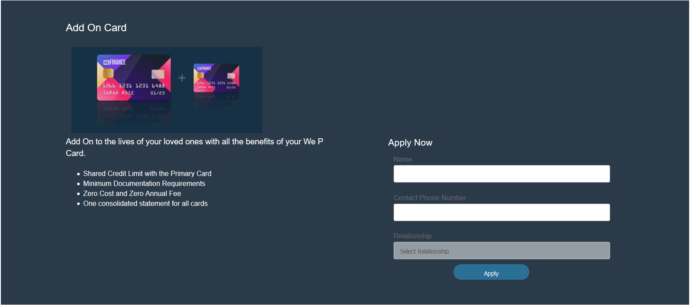
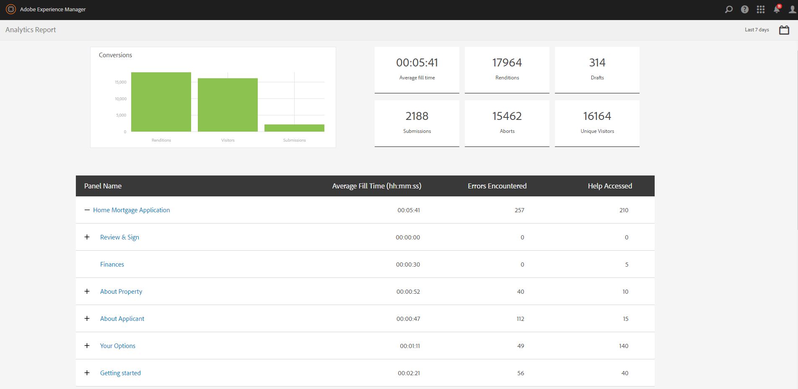

# Recorrido por el sitio de referencia de We.Finance{#we-finance-reference-site-walkthrough}

## Requisitos previos {#pre-requisites}

Configure los sitios de referencia tal como se describe en [Configuración y configuración de los sitios](../../forms/using/setup-reference-sites.md)de referencia de AEM Forms.

## Escenarios del sitio de referencia de We.Finance {#we-finance-reference-site-scenarios}

We.Finance es una organización líder en el ámbito de los servicios financieros que ofrece soluciones financieras completas y personalizadas para satisfacer las necesidades de los distintos perfiles de los clientes. Ofrecen tarjetas de crédito, hipotecas y servicios de seguros de vivienda.

Su objetivo es llegar a los clientes actuales y futuros en su dispositivo preferido, explicar los beneficios de sus servicios y ayudarles a inscribirse en sus servicios. Además, buscan presentar más productos financieros como tarjetas complementarias que los clientes pueden encontrar interesantes.

Siga leyendo para obtener tutoriales detallados de los casos de uso de We.Finance y comprender cómo AEM Forms ayuda a las organizaciones financieras a lograr sus objetivos. Se cubren los siguientes tutoriales:

* [Recorrido de la aplicación de tarjeta de crédito](#credit-card-application-walkthrough)
* [Recorrido de solicitud de hipoteca](#home-mortgage-application-walkthrough)
* [Recorrido de la aplicación hipotecaria doméstica con Microsoft Dynamics](#home-mortgage-application-walkthrough-with-microsoft-dynamics)
* [Recorrido de solicitudes de seguro domiciliario](#home-insurance-application-walkthrough)
* [Recorrido de la gestión de la riqueza](#wealthmanagementwalkthrough)
* [Recorrido por aplicación de seguro automático](#autoinsuranceapplicationwalkthrough)

## Recorrido de la aplicación de tarjeta de crédito {#credit-card-application-walkthrough}

El escenario de la aplicación de tarjetas de crédito We.Finance incluye las siguientes personas:

* Sarah Rose, una cliente de We.Finance
* Gloria Rios, Responsable de Tarjeta de Crédito e Hipoteca, We.Finance

La siguiente infografía muestra el flujo de trabajo paso a paso de la aplicación de tarjeta de crédito.

Veamos el escenario del sitio de referencia en detalle para comprender cómo los formularios AEM ayudan a We.Finance a lograr sus objetivos.

### Sarah recibe un boletín de We.Finance y solicita una tarjeta de crédito {#sarah-receives-a-newsletter-from-we-finance-and-applies-for-a-credit-card}

Sarah Rose es una cliente existente de We.Finance. Recibe un boletín de We.Finance acerca de las nuevas tarjetas de crédito que se ofrecen. Ella encuentra las ofertas excitantes y decide solicitar una tarjeta de crédito. Ella hace clic en el botón Aplicar ahora en el boletín, que la lleva a la aplicación de tarjeta de crédito en el portal We.Finance.

#### Cómo funciona {#how-it-works}

La newsletter enviada a Sarah es una implementación personalizada que activa un correo electrónico para el ID de correo electrónico especificado. El botón Aplicar ahora del correo electrónico está vinculado a la aplicación de tarjeta de crédito, que es un formulario adaptable en una instancia de publicación.

#### Véalo usted mismo {#see-it-yourself}

Abra la siguiente URL en la instancia de publicación para activar un correo electrónico de newsletter. Asegúrese de reemplazar `[emailID]` por una cuenta de correo electrónico válida para recibir la newsletter. Abra la newsletter y haga clic en **[!UICONTROL Aplicar ahora]** para ir a la aplicación de tarjeta de crédito.

`https://[publishServer]:[publsihPort]/content/campaigns/we-finance/start.html?app=cc&email=[emailID]&givenName=Sarah&familyName=Rose`

### Sarah encuentra interesante la oferta y elige postular {#sarah-finds-the-offer-interesting-and-chooses-to-apply}

Sarah decide solicitar la tarjeta de crédito y toca el botón **Aplicar ahora** en el correo electrónico. Lleva a Sarah a la aplicación de tarjetas de crédito en el portal We.Finance. El formulario de aplicación está organizado en secciones con una presentación de tarjeta.

Sarah selecciona una tarjeta de crédito de las opciones disponibles y hace clic en **[!UICONTROL Continuar]**.

En la página de Información Personal, mientras Sarah proporciona su Número de Seguridad Social, recibe un mensaje para iniciar sesión con sus credenciales.

Sarah es una cliente existente de We.Finance. Ella inicia sesión con sus credenciales de cuenta de We.Finance y sus datos personales se rellenan automáticamente en el formulario. Sarah sigue rellenando el formulario de solicitud y es entonces cuando aparece un recordatorio para una reunión a la que debe asistir. Ella hace clic en **[!UICONTROL Guardar mi progreso]** en el formulario de solicitud. Guarda toda la información que Sarah ha rellenado hasta ahora y aparece un diálogo para confirmar si desea recibir un correo electrónico con un enlace a su borrador de solicitud para completarlo más tarde.

Sarah hace clic en **[!UICONTROL Enviar correo]**. Recibe un correo electrónico con un vínculo para reanudar su solicitud de tarjeta de crédito.

**Sarah accede a la aplicación de tarjeta de crédito desde su dispositivo móvil**

Si Sarah accede a la aplicación de tarjeta de crédito desde su dispositivo móvil, la aplicación adaptable se abre en una vista optimizada para dispositivos móviles. En esta vista, el formulario de aplicación se procesa como una sección a la vez. Le permite a Sarah ver y proporcionar información progresivamente a medida que navega por la aplicación.

**Cómo funciona**

El botón **Aplicar ahora** dirige a Sarah a la aplicación de tarjeta de crédito. La aplicación es un formulario adaptable, que se puede revisar en las instancias de creación de `https://[host]:[Port]/editor.html/content/forms/af/we-finance/cc-app.html`.

Algunas de las funciones clave que puede revisar en el formulario adaptable son:

* Se basa en un esquema XSD.
* Se construye usando el tema A de We Finance para el estilo y la plantilla We.Finance para el diseño. También utiliza Presentación sin títulos de panel en la presentación del encabezado del formulario para la navegación móvil. Muestra un diseño móvil progresivo cuando se abre desde un dispositivo móvil. Puede revisar la plantilla en `https://[host]:[Port]/libs/wcm/core/content/sites/templates.html/conf/we-finance` y el tema en `https://[host]:[Port]/editor.html/content/dam/formsanddocuments-themes/we-finance/we-finance-theme-a/jcr:content`.
* Incluye reglas de formulario adaptables para invocar los servicios del Modelo de datos de formulario para rellenar previamente los detalles de usuario del usuario que ha iniciado sesión. También invoca a los servicios para rellenar previamente la información por número de la seguridad social o por dirección de correo electrónico proporcionada en el formulario. Puede revisar los modelos de datos de formulario y sus servicios en `https://[host]:[Port]/aem/forms.html/content/dam/formsanddocuments-fdm`.
* Utiliza varios componentes de formulario adaptables para capturar entradas y adaptarse a las respuestas del usuario. También utiliza componentes como Correo electrónico que admiten tipos de entrada HTML5.
* Utiliza el componente Paso de firma para mostrar el formulario completado y permite la firma electrónica en el formulario.
* El botón Guardar mi progreso genera un ID exclusivo para el usuario y guarda la aplicación parcialmente rellenada como borrador en un nodo del repositorio de AEM. También muestra un cuadro de diálogo que busca permiso para enviar un correo electrónico con un vínculo al nodo que contiene el borrador de la aplicación. El botón Enviar correo del cuadro de diálogo de confirmación activa un correo electrónico con un vínculo al nodo que contiene el borrador.
* Utiliza la acción de envío Invocar flujo de trabajo de AEM para activar el flujo de trabajo de aprobación de tarjeta de crédito. Puede revisar el flujo de trabajo utilizado en este formulario en `https://[host]:[Port]/editor.html/conf/global/settings/workflow/models/we-finance-credit-card-workflow.html`

Se recomienda revisar el formulario para comprender el esquema, los componentes, las reglas, los modelos de datos de formulario, el flujo de trabajo de formularios y la acción de envío que se utiliza para crear el formulario.

Consulte también la siguiente documentación para obtener más información sobre las funciones utilizadas en el formulario adaptable de la aplicación de tarjeta de crédito:

* [Introducción a la creación de formularios adaptables](../../forms/using/introduction-forms-authoring.md)
* [Creación de formularios adaptables mediante el esquema XML](../../forms/using/adaptive-form-xml-schema-form-model.md)
* [Editor de reglas](../../forms/using/rule-editor.md)
* [Temas](../../forms/using/themes.md)
* [Integración de datos](../../forms/using/data-integration.md)
* [Uso de Adobe Sign en formularios adaptables](../../forms/using/working-with-adobe-sign.md)
* [Flujo de trabajo centrado en formularios en OSGi](../../forms/using/aem-forms-workflow.md)

**Véalo usted mismo**

Cuando haya iniciado sesión como Sarah Rose, haga clic en el botón **Aplicar ahora** en la aplicación de tarjeta de crédito. Rellene algunos detalles, explore varios componentes de formulario adaptables y haga clic en **Guardar mi progreso** para recibir un mensaje de correo electrónico con un botón **Reanudar** que se vincula a la aplicación de borrador. Asegúrese de especificar su ID de correo electrónico en el formulario de solicitud para recibir el correo electrónico.

Revise el tema de We.Finance disponible en:

`https://<host>:<AuthorPort>/editor.html/content/dam/formsanddocuments-themes/we-Finance/we-Finance-Theme-A/jcr:content`

Puede consultar la plantilla de We.Finance en:

`https://<host>:<AuthorPort>/editor.html/conf/we-finance/settings/wcm/templates/we-finance-template/structure.html`

### Sarah reanuda y presenta la solicitud {#sarah-resumes-and-submits-the-application}

Sarah regresa más tarde y encuentra un correo electrónico de We.Finance. Ella hace clic en el botón **Reanudar** del correo electrónico que la lleva a su aplicación de tarjeta de crédito de borrador. La información que rellenó antes viene prepoblada. Cumplimenta el formulario de solicitud restante, firma la solicitud y la presenta.

También puede acceder a su aplicación de borrador en **Mis formularios** en la página de inicio de We.Finance.

#### Cómo funciona {#how-it-works-1}

El botón Reanudar del correo electrónico redirige a Sarah al nodo que contiene su aplicación de borrador.

#### Véalo usted mismo {#see-it-yourself-1}

Debe haber recibido un correo electrónico con un vínculo a la aplicación de borrador en el ID de correo electrónico que especificó al rellenar el formulario de solicitud. Adelante, rellene las secciones restantes de la aplicación y envíelas.

### We.Finance recibe y aprueba la solicitud {#approving-the-application}

We.Finance recibe la solicitud de tarjeta de crédito presentada por Sarah. Se asigna una tarea a Gloria Ríos. Revisa la tarea en su Bandeja de entrada AEM y la aprueba.

#### Cómo funciona {#how-it-works-2}

Cuando Sarah rellena y envía la aplicación de tarjeta de crédito, se activa un flujo de trabajo de Forms y se crea una tarea en la bandeja de entrada de AEM de Gloria.

AEM Forms en OSGi proporciona flujos de trabajo centrados en formularios que le permiten crear flujos de trabajo adaptables basados en formularios. Estos flujos de trabajo pueden utilizarse para revisiones y aprobaciones, flujos de procesos comerciales, para iniciar servicios de documentos, integrarse con el flujo de trabajo de firma de Adobe Sign, etc. Para obtener más información, consulte Flujo de trabajo centrado en [formularios en OSGi](../../forms/using/aem-forms-workflow.md).

La siguiente imagen muestra el flujo de trabajo de AEM que procesa la aplicación de tarjeta de crédito y genera una salida en PDF de la aplicación.

#### Véalo usted mismo {#see-it-yourself-2}

Puede acceder a la bandeja de entrada de AEM para el sitio web we.Finance en https://&lt;*hostname*>:&lt;*PublishPort*>/content/we-finance/global/en.html. En la página, toque **Iniciar sesión**, seleccione la casilla de verificación **Iniciar sesión como representante** , inicie sesión en la bandeja de entrada de AEM utilizando `grios/password` como nombre de usuario/contraseña para Gloria Rios y apruebe la aplicación de tarjeta de crédito. Para obtener información sobre el uso de la Bandeja de entrada de AEM para tareas de flujo de trabajo centradas en formularios, consulte [Gestión de aplicaciones y tareas de formularios en la Bandeja de entrada](../../forms/using/manage-applications-inbox.md)de AEM.

Al aprobar la solicitud, Sarah recibe un correo electrónico con el kit de bienvenida.

### Sarah recibe el kit de bienvenida y solicita una tarjeta complementaria {#sarah-receives-the-welcome-kit-and-applies-for-an-add-on-card}

Cuando se aprueba la solicitud de tarjeta de crédito de Sarah, recibe un correo electrónico con un enlace al kit de bienvenida. Abre el kit de bienvenida, que incluye los datos de su cuenta de tarjeta de crédito. El kit de bienvenida también muestra ofertas promocionales personalizadas para Sarah. A medida que se desplaza hacia abajo, el kit de bienvenida contiene un formulario incrustado para solicitar una tarjeta complementaria. Sarah rellenó rápidamente los detalles requeridos desde el kit de bienvenida y solicita la tarjeta complementaria. Aparece un cuadro de diálogo de confirmación para la aplicación de tarjeta complementaria.

El kit de bienvenida está personalizado para Sarah y muestra información relevante para ella. Le ofrece la opción de descargar una versión en PDF del kit de bienvenida.

El kit de bienvenida incluye otro formulario de solicitud que Sarah puede rellenar y enviar para solicitar una tarjeta complementaria desde el kit de bienvenida sin visitar el portal We.Finance.

#### Cómo funciona {#how-it-works-3}

El kit de bienvenida es una comunicación interactiva incluida en el `cq-we-finance-content-pkg.zip` paquete. Las tarjetas interactivas de la versión de escritorio para mostrar las ventajas de la tarjeta de crédito en el kit de bienvenida son un diseño personalizado creado con el diseño de tarjeta predeterminado de un fragmento de documento.

La aplicación de tarjeta complementaria es un formulario adaptable integrado en la comunicación interactiva del kit de bienvenida.

#### Véalo usted mismo {#see-it-yourself-3}

Haga clic en el botón Reanudar del correo electrónico recibido en el paso anterior. Abre el borrador de la aplicación. Rellene todos los detalles y envíe la solicitud. Recibirá un kit de bienvenida. Revise el kit de bienvenida.

También puede ver el kit de bienvenida en la siguiente URL:

https://&lt;*host*>: &lt;*port*>/content/aemforms-refsite/doclink.html?document=/content/forms/af/we-finance/credit-card/creditcardwelcomkit&amp;customerId=197&amp;channel=web

Puede acceder a ella en instancias de autor y publicación.

### Sarah recibe un extracto de tarjeta de crédito {#sarah-receives-a-credit-card-statement}

Mientras Sarah empieza a usar la tarjeta de crédito, recibe otro correo electrónico de We.Finance que incluye su extracto de la tarjeta de crédito. Las siguientes imágenes muestran el correo electrónico con un vínculo al extracto de la tarjeta de crédito en dispositivos móviles.

Sarah hace clic en Ver extracto en el correo electrónico para ver el extracto de la tarjeta de crédito. La declaración es una comunicación interactiva. Tiene versiones web e impresa (PDF). La instrucción se integra con el modelo de datos de Forms para recuperar datos específicos del cliente de la base de datos. La declaración interactiva contiene varios elementos:

* Resumen de la declaración
* Informe de gastos detallado
* Análisis de gastos gráficos
* Opción de realizar un pago por la cantidad adeudada desde el estado de cuenta
* Descargar el recibo de pago

Sarah no necesita ir al portal ni buscar en sus correos electrónicos la versión en PDF del extracto de tarjeta de crédito para archivarlo sin conexión. Solo hace clic en la instrucción Download (Descargar instrucción) para descargar una versión PDF de la declaración.

La declaración detallada se presenta en una tabla interactiva. El estado de cuenta también ofrece la opción de pagar una parte o la totalidad de la cantidad adeudada desde el estado de cuenta.

Sarah programa el pago desde dentro de la declaración. Sarah también puede usar la opción de pago Flexi para dividir el pago en partes iguales.

#### Cómo funciona {#how-it-works-4}

El extracto de la tarjeta de crédito es una comunicación interactiva. La tabla de gastos detallada del estado es una tabla adaptable. El gráfico para el análisis de gastos es un componente de gráfico, lee la tabla de gastos y genera el gráfico circular.

#### Véalo usted mismo {#see-it-yourself-4}

Puede revisar el extracto interactivo de la tarjeta de crédito en la siguiente URL:

https://&lt;*hostname*>:&lt;*port*>/content/aemforms-refsite/doclink.html?document=/content/forms/af/we-finance/credit-card/credit-card-Statement&amp;customerId=197&amp;channel=web

Puede acceder a ella en instancias de autor y publicación.

El extracto de la tarjeta de crédito muestra las ofertas promocionales hacia el final del extracto. Puede integrar Adobe Target con la comunicación interactiva de AEM Forms para ofrecer ofertas con objetivos promocionales basadas en segmentos de clientes específicos. Para configurar la comunicación interactiva de modo que utilice Adobe Target para ofertas personalizadas y con objetivos, consulte [Creación de experiencias](/help/forms/using/experience-targeting-forms.md)con objetivos.

### We.Finance analiza el rendimiento de la aplicación de tarjeta de crédito {#we-finance-analyzes-the-performance-of-the-credit-card-application}

We.Finance, de vez en cuando, revisa el rendimiento de su aplicación de tarjeta de crédito para comprobar si hay problemas con los clientes. Utilizan este análisis para tomar decisiones informadas sobre los cambios requeridos en la aplicación de tarjeta de crédito a fin de mejorar la experiencia del usuario, reducir la tasa de abandono de formularios y mejorar así la conversión. Aprovechan la integración de AEM Forms con Adobe Analytics para su análisis. La siguiente imagen muestra el tablero de análisis.

Para obtener más información sobre cómo interpretar el tablero de análisis, consulte [Visualización y comprensión de los informes](../../forms/using/view-understand-aem-forms-analytics-reports.md)de análisis de AEM Forms.

#### Cómo funciona {#how-it-works-5}

Las métricas de rendimiento del formulario de solicitud de tarjeta de crédito se rastrean con Adobe Analytics. Para obtener más información sobre la configuración de Adobe Analytics y la visualización de informes, consulte [Configuración de análisis para formularios y documentos](../../forms/using/configure-analytics-forms-documents.md).

#### Véalo usted mismo {#see-it-yourself-br}

Para que pueda ver y explorar el informe de análisis, le proporcionamos datos iniciales para la aplicación de tarjeta de crédito en el sitio de referencia. Antes de usar datos de raíz, consulte [Configuración de Analytics](../../forms/using/setup-reference-sites.md#configureanalytics). Realice los siguientes pasos en la instancia de autor para ver el informe con los datos de inicialización:

1. Vaya a la interfaz de usuario de **Forms &amp; Documents** en https://&lt;*hostname*>:&lt;*AuthorPort*>/aem/forms.html/content/dam/formsanddocuments.

1. Haga clic para abrir la carpeta **We.Finance** .
1. Seleccione **Aplicación para el formulario adaptable de tarjeta** de crédito y, a continuación, en la barra de herramientas, haga clic en **[!UICONTROL Activar Analytics]**.

1. Seleccione de nuevo el formulario adaptable y haga clic en Informe **[!UICONTROL de]** Analytics en la barra de herramientas para generar el informe. Primero verá un informe en blanco.

Para generar un informe de análisis con datos de inicialización:

1. En el navegador de direcciones de la lista CRXDE, escriba: `/apps/we-finance/demo-artifacts/analyticsTestData/Credit card Analytics Test Data`
1. Los datos de prueba se seleccionan en la estructura del directorio del lado izquierdo.
1. Haga doble clic en el archivo seleccionado para abrir su contenido en el panel derecho.
1. Copie todo el contenido del archivo de datos raíz.
1. En CRXDE, vaya a: `/content/dam/formsanddocuments/we-finance/cc-app/jcr:content/analyticsdatanode/lastsevendays`
1. En el campo **[!UICONTROL analyticsdata]** , en **[!UICONTROL Propiedades]**, pegue el contenido copiado del archivo de datos raíz.

1. Seleccione **Aplicación para el formulario adaptable de tarjeta** de crédito y haga clic en Informe **[!UICONTROL de]** análisis en la barra de herramientas para generar el informe con datos de raíz.

**Prueba A/B de la aplicación de tarjeta de crédito**

Además de analizar el rendimiento de la aplicación de tarjeta de crédito y mejorarla constantemente, We.Finance aprovecha la integración de AEM Forms con Target para crear pruebas A/B. Les permite ofrecer diferentes experiencias en el formulario de solicitud de tarjeta de crédito e identificar la experiencia que causa una mejor tasa de conversión en términos de finalización y envío de formularios.

Para configurar Target en el servidor de AEM Forms, consulte [Configuración e integración de Target en AEM Forms](../../forms/using/ab-testing-adaptive-forms.md#set%20up%20and%20integrate%20target%20in%20aem%20forms).

Realice los siguientes pasos para experimentar la creación de una prueba A/B para el formulario de solicitud de tarjeta de crédito We.Finance:

1. Vaya a **Forms &amp; Documents** en https://&lt;*hostname*>:&lt;*AuthorPort*>/aem/forms.html/content/dam/formsanddocuments.

1. Haga clic para abrir la carpeta **We.Finance** .
1. Seleccione **Aplicación para formulario adaptable de tarjeta** de crédito.
1. Haga clic en **Más** en la barra de herramientas y seleccione **Configurar prueba** A/B. Se abre la página Configurar pruebas A/B.

1. Especifique un nombre **de actividad**.
1. En la lista desplegable Audiencia, seleccione una audiencia a la que desee ofrecer distintas experiencias del formulario. Por ejemplo, **Visitantes que utilizan Chrome**.
1. En los campos **de distribución** de experiencias para las experiencias A y B, especifique la distribución, en porcentaje, para determinar la distribución de experiencias entre la audiencia total. Por ejemplo, si especifica 40, 60 para las experiencias A y B, respectivamente, la experiencia A se ofrecerá al 40 % de la audiencia y el 60 % restante verá la experiencia B.
1. Haga clic en **Configurar**. Aparece un cuadro de diálogo para confirmar la creación de la prueba A/B.
1. Haga clic en **Finalizado**.
1. Seleccione el formulario **Solicitud de tarjeta** de crédito y haga clic en **Editar**. Proporciona la opción de abrir una de las experiencias. Haga clic en **Experiencia B**. El formulario se abre en el modo de edición.

1. Modifique el formulario como desee para crear una experiencia distinta a la experiencia A predeterminada.
1. Vaya a la interfaz de usuario Formularios y documentos, seleccione el formulario, haga clic en **Más** y seleccione **Iniciar prueba** A/B.
1. Ahora abra el formulario en el navegador Chrome varias veces con la siguiente URL:

   `https://&lt;*hostname*&gt;:&lt;*port*&gt;/content/dam/formsanddocuments/we-finance/cc-app/jcr:content?wcmmode=disabled`

   >[!NOTE] Nota: Quite la cookie con el nombre **mbox** de la persistencia de cookies del explorador antes de abrir el formulario la próxima vez. Verá la experiencia A y B del formulario al azar.

1. Seleccione el formulario, haga clic en **Más** y, a continuación, en Informe **de prueba** A/B. No encontrará muchos datos en el informe, ya que acaba de iniciar la prueba. Proporcionemos ahora algunos datos iniciales para ver el aspecto del informe de prueba A/B.
1. Abra CRXDE Lite y realice una copia de seguridad del siguiente archivo: /libs/fd/fmaddon/gui/components/admin/targetreport/clientlibs/targetreport/js/targetreport.js
1. Reemplace la definición de función `onReportLoadSuccess` en el archivo mencionado anteriormente con la definición de función en el archivo siguiente: /apps/we-finance/demo-artifacts/targetreport.js

   Nota: Estos cambios solo sirven para fines de demostración. Asegúrese de restaurar el contenido del archivo después de completar este procedimiento.

1. Actualice el informe que ha generado y verá algo como lo siguiente. Revise el tablero de informes.

Para finalizar la prueba A/B, haga clic en **Finalizar prueba** A/B en el tablero de informes. En este momento, un cuadro de diálogo le solicita que declare una experiencia. Seleccione un ganador y confirme que desea finalizar la prueba A/B.

Si elige la experiencia A como ganadora, la prueba A/B finalizará y, a partir de ahora, solo se ofrecerá la Experiencia A a todas las audiencias, incluidas las de Chrome.

## Recorrido de solicitud de hipoteca {#home-mortgage-application-walkthrough}

El escenario de hipoteca We.Finance involucra a las siguientes personas:

* Sarah Rose, una cliente de We.Finance
* Gloria Rios, Responsable de Tarjeta de Crédito e Hipoteca, We.Finance
* John Doe, Representante de Atención al Cliente de We.Finance

La siguiente infografía muestra el flujo de trabajo paso a paso de una aplicación de hipoteca.

Ahora veamos en detalle los pasos del escenario del sitio de referencia para ver cómo los formularios AEM ayudan a We.Finance a lograr sus objetivos.

### Sarah visita el sitio web We.Finance y solicita la hipoteca {#sarah-visits-we-finance-website-and-applies-for-home-mortgage}

Sarah Rose está planeando comprar una casa y buscando planes de hipoteca. Es cliente de We.Finance y por lo tanto visita el portal We.Finance para explorar las ofertas de hipotecas. Ella va a la sección de Préstamos y encuentra una calculadora de hipotecas en el portal. Ella rellena los detalles y hace clic en Calcular mi hipoteca, que devuelve un plan de hipoteca.

 

Calculadora hipotecaria

Resultado del cálculo hipotecario

#### Cómo funciona {#how-it-works-6}

La calculadora de hipotecas domésticas de la página Préstamos es un formulario adaptable incorporado en la página Sitios de AEM. Puede revisar la página Préstamos en modo de edición en `https://[authorHost]:[authorPort]/editor.html/content/we-finance/global/en/loan-landing-page.html`.

La calculadora de hipotecas incrustadas, que es un formulario adaptable, utiliza reglas para calcular el importe del IME basándose en los detalles del préstamo proporcionados en los campos de la calculadora. Puede revisar el formulario adaptable en `https://[authorHost]:[authorPort]/editor.html/content/forms/af/we-finance/hm-calc.html`.

#### Véalo usted mismo {#see-it-yourself-5}

Vaya al portal We.Finance en `https://<publishHost>:<publishPort>/content/we-finance/global/en.html` y haga clic en **[!UICONTROL Préstamos]**. Proporcione detalles en la calculadora de hipotecas y vea los resultados.

### Sarah encuentra interesante la oferta y elige postular {#sarah-finds-the-offer-interesting-and-chooses-to-apply-1}

Sarah elige solicitar la hipoteca y hace clic en **[!UICONTROL Aplicar ahora]** en los resultados de la calculadora de hipotecas. Abre la solicitud de hipoteca.

Si Sarah está accediendo a la aplicación hipotecaria desde su dispositivo móvil, el formulario de la aplicación se abre en una vista optimizada para su visualización en un dispositivo móvil. En esta vista, el formulario de aplicación procesa una sección a la vez. Le permite a Sarah ver y proporcionar información progresivamente a medida que navega por el formulario de solicitud.

Las siguientes imágenes muestran el flujo de trabajo mientras Sarah navega por la aplicación hipotecaria en su dispositivo móvil.

Si Sarah hace clic en **Aplicar ahora** desde su escritorio, el formulario de solicitud de hipoteca se abre de la siguiente manera. La información proporcionada por Sarah en la calculadora de hipotecas se rellena previamente en el formulario de solicitud. Sarah rellena los detalles restantes y hace clic en **Continuar**.

Según la información que Sarah ha llenado en la calculadora de hipotecas, se le presentan algunos planes hipotecarios. Ella elige el plan que se adapta a sus necesidades y continúa llenando la solicitud. Finalmente firma y presenta la solicitud.

La solicitud enviada se dirige a We.Finance para su aprobación.

#### Cómo funciona {#how-it-works-7}

El botón **Aplicar ahora** dirige a Sarah a la aplicación de hipoteca. La aplicación es un formulario adaptable, que se puede revisar en las instancias de creación de `https://[host]:[Port]/editor.html/content/forms/af/we-finance/hm-app.html`.

Algunas de las funciones clave que puede revisar en el formulario adaptable son:

* Se basa en un esquema XSD, `homeMortgageApplication.xsd`.
* Se construye utilizando el tema B de We Finance para el estilo y la plantilla de We.Finance para el diseño. También utiliza Presentación sin títulos de panel en la presentación del encabezado del formulario para la navegación móvil. Muestra un diseño móvil progresivo cuando se abre desde un dispositivo móvil. Puede revisar la plantilla y el tema utilizados en el formulario adaptable en las siguientes ubicaciones de la instancia de creación de AEM:

   * `https://[host]:[Port]/libs/wcm/core/content/sites/templates.html/conf/we-finance`
   * `https://[host]:[Port]/editor.html/content/dam/formsanddocuments-themes/we-finance/we-finance-theme-b/jcr:content`

* La primera ficha, Introducción, de la aplicación es una calculadora de hipotecas dinámicas que muestra las opciones basadas en la selección del usuario. Por ejemplo, los campos y valores son diferentes para las opciones de compra y refinanciación. Esta funcionalidad se logra mediante reglas de mostrar y ocultar. Además, cuando se hace clic en Continuar y se inicializa la ficha Planes, se invoca un servicio Web configurado en un Modelo de datos de formulario para recuperar y mostrar planes de hipoteca. Puede revisar los modelos de datos de formulario y los servicios configurados en `https://[host]:[Port]/aem/forms.html/content/dam/formsanddocuments-fdm`.
* Utiliza varios componentes de formulario adaptables para capturar entradas y adaptarse a las respuestas del usuario. También utiliza componentes como Correo electrónico que admiten tipos de entrada HTML5.
* Utiliza el componente Paso de firma para mostrar el formulario completado y permite la firma electrónica en el formulario.
* Utiliza la acción de envío Invocar flujo de trabajo de AEM para activar el flujo de trabajo AEM de Hipoteca doméstica de We Finance. Puede revisar el flujo de trabajo utilizado en este formulario en `https://[host]:[Port]/editor.html/conf/global/settings/workflow/models/we-finance-home-mortgage-workflow.html`

Se recomienda revisar el formulario para comprender el esquema, los componentes, las reglas, los modelos de datos de formulario, el flujo de trabajo de formularios y la acción de envío que se utiliza para crear el formulario.

Consulte también la siguiente documentación para obtener más información sobre las funciones utilizadas en el formulario adaptable de la aplicación de hipoteca sobre el hogar:

* [Introducción a la creación de formularios adaptables](../../forms/using/introduction-forms-authoring.md)
* [Creación de formularios adaptables mediante el esquema XML](../../forms/using/adaptive-form-xml-schema-form-model.md)
* [Editor de reglas](../../forms/using/rule-editor.md)
* [Temas](../../forms/using/themes.md)
* [Integración de datos](../../forms/using/data-integration.md)
* [Uso de Adobe Sign en formularios adaptables](../../forms/using/working-with-adobe-sign.md)
* [Flujo de trabajo centrado en formularios en OSGi](../../forms/using/aem-forms-workflow.md)

#### Véalo usted mismo {#see-it-yourself-6}

Vaya a `https://[server]:[port]/content/we-finance/global/en/all-forms.html` y haga clic en el botón **Aplicar ahora** en Aplicación hipotecaria doméstica. Complete los detalles de la ficha Introducción, pruebe con distintas opciones y envíe la aplicación.

Asegúrese de especificar un ID de correo electrónico válido en la aplicación para recibir un correo de confirmación en la bandeja de entrada.

### We.Finance recibe la solicitud {#approving_the_application-1}

We.Finance recibe la solicitud de hipoteca presentada por Sarah. La tarea de aprobar o rechazar la solicitud se asigna a Gloria Ríos. Ella revisa la solicitud y descubre que falta la identificación del gobierno de Sarah.

Gloria abre la tarea y hace clic en Need More Info (Necesita más información) y hace un comentario sobre la falta de ID de gobierno.

La tarea ahora se asigna a John Doe, un representante de atención al cliente de We.Finance. Él abre la tarea y revisa el comentario de Gloria. Se pone en contacto con Sarah y le pide que envíe una copia de su documento de identidad. Después de recibir una copia del documento de identidad de Sarah, lo adjunta a la tarea y presenta la solicitud de reevaluación.

La tarea se reasigna a Gloria. Revisa la ID adjunta y aprueba la solicitud.

#### Cómo funciona {#how-it-works-8}

Cuando Sarah rellena y envía la aplicación de hipoteca principal, se activa un flujo de trabajo de Forms y se crea una tarea en la bandeja de entrada de Gloria AEM. A medida que Gloria revisa la aplicación y solicita más información, la tarea se asigna a John Doe. Cuando John Doe adjunta el ID y vuelve a enviar la aplicación, se asigna a Gloria. Esto se define en el flujo de trabajo de AEM asociado a la aplicación de hipoteca.

AEM Forms en OSGi proporciona flujos de trabajo centrados en formularios que le permiten crear flujos de trabajo adaptables basados en formularios. Estos flujos de trabajo pueden utilizarse para revisiones y aprobaciones, flujos de procesos comerciales, para iniciar servicios de documentos, integrarse con el flujo de trabajo de firma de Adobe Sign, etc. Para obtener más información, consulte Flujo de trabajo centrado en [formularios en OSGi](../../forms/using/aem-forms-workflow.md).

La siguiente imagen muestra el flujo de trabajo de AEM asociado a la aplicación de hipoteca.

#### Véalo usted mismo {#see-it-yourself-7}

Puede acceder a la bandeja de entrada de AEM en `https://<hostname>:<AuthorPort>/content/we-finance/global/en/login.html?resource=/aem/inbox.html`. Inicie sesión en la bandeja de entrada de AEM con `grios/password` el nombre de usuario y la contraseña de Gloria Rios y `jdoe/jdoe` de John Doe, y explore el flujo de trabajo de la aplicación de hipotecas domésticas.

Para obtener información sobre el uso de la Bandeja de entrada de AEM para tareas de flujo de trabajo centradas en formularios, consulte [Gestión de aplicaciones y tareas de formularios en la Bandeja de entrada](../../forms/using/manage-applications-inbox.md)de AEM.

### Sarah recibe el kit de bienvenida {#sarah-receives-the-welcome-kit}

A medida que se aprueba la solicitud hipotecaria de Sarah, recibe un correo electrónico con un enlace al kit de bienvenida. Abre el kit de bienvenida, que incluye un carrusel con ofertas promocionales personalizadas para Sarah.

El kit de bienvenida está personalizado para Sarah y muestra información relevante para ella. Le ofrece la opción de descargar una versión en PDF del kit de bienvenida. El botón de flecha en la parte inferior permite a Sarah desplazarse hacia abajo y navegar por otras secciones del kit de bienvenida.

#### Cómo funciona {#how-it-works-9}

El kit de bienvenida es una comunicación interactiva incluida en el `cq-we-finance-content-pkg.zip` paquete. El servidor de Adobe Target proporciona las ofertas promocionales del kit de bienvenida. Las ofertas están personalizadas y orientadas a segmentos de clientes específicos. El kit de bienvenida obtiene ofertas de un servidor de Adobe Target preconfigurado para un segmento de audiencia de clientes femeninos.

Las tarjetas interactivas de la versión de escritorio del kit de bienvenida utilizan un diseño personalizado creado con el diseño de tarjeta predeterminado de un fragmento de documento.

#### Véalo usted mismo {#see-it-yourself-8}

Si ha proporcionado su ID de correo electrónico al rellenar la solicitud de hipoteca, debería haber recibido un mensaje de correo electrónico con un vínculo al kit de bienvenida. Marque su bandeja de entrada y revise el kit de bienvenida.

Puede verla en la instancia de publicación de AEM en la siguiente URL:

`https://[host]:[port]/content/forms/af/we-finance/mortgage-loan-welcome-kit.html`

### Sarah recibe un estado de cuenta {#sarah-receives-an-account-statement}

Mientras Sarah aprovecha el préstamo y empieza a pagar los plazos, recibe otro correo electrónico de We.Finance que incluye su cuenta mensual.

Sarah hace clic en Ver extracto en el correo electrónico para ver el extracto de cuenta hipotecaria. La declaración interactiva contiene varios elementos:

* Resumen de la declaración
* Detalles de la instrucción

La siguiente imagen muestra una parte diferente de la instrucción account en Desktop.

El estado detallado se presenta en una tabla adaptable y ofrece la opción de pagar una parte o la totalidad de la cantidad debida desde el estado de cuenta.

#### Cómo funciona {#how-it-works-10}

La declaración de hipoteca es una comunicación interactiva. Se genera mediante el proceso de agrupamiento JSON. La tabla de gastos detallada del estado es una tabla adaptable.

#### Véalo usted mismo {#see-it-yourself-9}

Puede revisar el estado de cuenta de hipoteca interactiva en la siguiente URL:

https://&lt;*hostname*>:&lt;*port*>/content/forms/af/we-finance/mortgage-account-statement.html?wcmmode=disabled

Puede acceder a ella en instancias de autor y publicación.

### We.Finance analiza el rendimiento de la solicitud de hipoteca {#we-finance-analyzes-the-performance-of-the-mortgage-application}

We.Finance, de vez en cuando, revisa el rendimiento de su solicitud de hipoteca para verificar cualquier problema que los clientes puedan estar enfrentando. Utilizan este análisis para tomar decisiones informadas sobre los cambios requeridos en la aplicación de hipoteca para mejorar la experiencia del usuario, reducir la tasa de abandono de formularios y mejorar así la conversión. Aprovechan la integración de AEM Forms con Adobe Analytics para su análisis. La siguiente imagen muestra el tablero de análisis.

Para obtener más información sobre cómo interpretar el tablero de análisis, consulte [Visualización y comprensión de los informes](../../forms/using/view-understand-aem-forms-analytics-reports.md)de análisis de AEM Forms.

#### Cómo funciona {#how-it-works-11}

Las métricas de rendimiento del formulario de solicitud de hipoteca se rastrean con Adobe Analytics. Para obtener más información sobre la configuración de Adobe Analytics y la visualización de informes, consulte [Configuración de análisis para formularios y documentos](../../forms/using/configure-analytics-forms-documents.md).

#### Véalo usted mismo {#see-it-yourself-br-1}

Para que pueda ver y explorar el informe de análisis, le proporcionamos los datos iniciales de la aplicación de hipoteca en el sitio de referencia. Antes de usar datos de raíz, consulte [Configuración de Analytics](../../forms/using/setup-reference-sites.md#configureanalytics). Realice los siguientes pasos en la instancia de autor para ver el informe con los datos de inicialización:

1. Vaya a la interfaz de usuario de **Forms &amp; Documents** en https://&lt;*hostname*>:&lt;*AuthorPort*>/aem/forms.html/content/dam/formsanddocuments.

1. Haga clic para abrir la carpeta **financiamos** .
1. Seleccione **[!UICONTROL Aplicación para el formulario adaptable hipoteca]** doméstica y, a continuación, en la barra de herramientas, haga clic en **[!UICONTROL Activar Analytics]**.

1. Seleccione el formulario de nuevo y haga clic en Informe **[!UICONTROL de]** análisis en la barra de herramientas para generar el informe. Verá inicialmente un informe en blanco.

Para generar un informe de análisis con datos de inicialización:

1. En el navegador de direcciones de la lista CRXDE, escriba lo siguiente: `/apps/we-finance/demo-artifacts/analyticsTestData/HomeMortgageAnalyticsTestData`
1. Los datos de prueba se seleccionan en la estructura del directorio del lado izquierdo.
1. Haga doble clic en el archivo seleccionado para abrir su contenido en el panel derecho.
1. Copie todo el contenido del archivo de datos raíz.
1. En CRXDE, vaya a: `/content/dam/formsanddocuments/we-finance/hm-app/jcr:content/analyticsdatanode/lastsevendays`
1. En el campo analyticsdata de Propiedades, pegue el contenido copiado del archivo de datos raíz.
1. Ahora vuelva a generar el informe de análisis para el formulario de solicitud de hipoteca doméstica. Verá el informe con los datos de inicialización.

**Prueba A/B de la solicitud de hipoteca**

Además de analizar el rendimiento de la aplicación hipotecaria y mejorarla constantemente, We.Finance aprovecha la integración de AEM Forms con Target para crear pruebas A/B. Les permite ofrecer diferentes experiencias en el formulario de solicitud e identificar la experiencia que genera una mejor tasa de conversión en términos de finalización y envío de formularios.

Para configurar Target en el servidor de AEM Forms, consulte [Configuración e integración de Target en AEM Forms](../../forms/using/ab-testing-adaptive-forms.md#set%20up%20and%20integrate%20target%20in%20aem%20forms).

Realice los siguientes pasos en la instancia de autor para experimentar la creación de la prueba A/B para el formulario de solicitud de hipoteca We.Finance:

1. Vaya a **Forms &amp; Documents** en https://&lt;*hostname*>:&lt;*AuthorPort*>/aem/forms.html/content/dam/formsanddocuments.

1. Haga clic para abrir la carpeta **We.Finance** .
1. Seleccione **Aplicación para Formulario adaptable Hipoteca** doméstica.
1. Haga clic en **Más** en la barra de herramientas y seleccione **Configurar prueba** A/B. Se abre la página Configurar pruebas A/B.

1. Especifique un nombre **de actividad**.
1. En la lista desplegable Audiencia, seleccione una audiencia a la que desee ofrecer distintas experiencias del formulario. Por ejemplo, **Visitantes que utilizan Chrome**.
1. En los campos **de distribución** de experiencias para las experiencias A y B, especifique la distribución, en porcentaje, para determinar la distribución de experiencias entre la audiencia total. Por ejemplo, si especifica 40, 60 para las experiencias A y B, respectivamente, la experiencia A se ofrecerá al 40 % de la audiencia y el 60 % restante verá la experiencia B.
1. Haga clic en **Configurar**. Aparece un cuadro de diálogo para confirmar la creación de la prueba A/B.
1. Haga clic en **Finalizado**.
1. Seleccione el formulario adaptable **Aplicación para hipoteca** doméstica y haga clic en **Editar**. Proporciona la opción de abrir una de las experiencias. Haga clic en **Experiencia B**. El formulario se abre en el modo de edición.
1. Modifique el formulario como desee para crear una experiencia distinta a la experiencia A predeterminada.
1. Vaya a la interfaz de usuario Formularios y documentos, seleccione el formulario, haga clic en **Más** y seleccione **Iniciar prueba** A/B.
1. Ahora abra el formulario en el navegador Chrome varias veces con la siguiente URL:
   `https://&lt;hostname&gt;:&lt;port&gt;/content/dam/formsanddocuments/we-finance/hm-app/jcr:content?wcmmode=disabled`

   >[!NOTE]
   >  Quite la cookie con el nombre **mbox** de la persistencia de cookies del explorador antes de abrir el formulario la próxima vez. Verá la experiencia A y B del formulario al azar.

1. Seleccione el formulario, haga clic en **Más** y, a continuación, en Informe **de prueba** A/B. No encontrará muchos datos en el informe, ya que acaba de iniciar la prueba. Proporcionemos ahora algunos datos iniciales para ver el aspecto del informe de prueba A/B.
1. Abra CRXDE Lite y realice una copia de seguridad del siguiente archivo: /libs/fd/fmaddon/gui/components/admin/targetreport/clientlibs/targetreport/js/targetreport.js
1. Reemplace la definición de la `onReportLoadSuccess` función en el archivo mencionado anteriormente con la definición de la función en el archivo siguiente: /apps/we-finance/demo-artifacts/targetreport.js

   Nota: Estos cambios solo sirven para fines de demostración. Asegúrese de restaurar el contenido del archivo después de completar este procedimiento.

1. Actualice el informe que ha generado y verá algo como lo siguiente. Revise el tablero de informes.

Para finalizar la prueba A/B, haga clic en **Finalizar prueba** A/B en el tablero de informes. En este momento, un cuadro de diálogo le solicita que declare una experiencia. Seleccione un ganador y confirme que desea finalizar la prueba A/B.

Si elige la experiencia A como ganadora, la prueba A/B finalizará y, a partir de ahora, solo se ofrecerá la Experiencia A a todas las audiencias, incluidas las de Chrome.

## Recorrido de la aplicación hipotecaria doméstica con Microsoft Dynamics {#home-mortgage-application-walkthrough-with-microsoft-dynamics}

El escenario hipoteca We.Finance con Microsoft Dynamics incluye las siguientes personas:

* Sarah Rose, una cliente de We.Finance
* El administrador de la instancia de Microsoft Dynamics We.Finance

El tutorial de la aplicación hipoteca de inicio con Microsoft Dynamics muestra cómo un cliente de We.Finance puede utilizar el sitio para solicitar una hipoteca de inicio cuando el sitio de referencia utiliza Microsoft Dynamics para la integración de datos. El tutorial termina con los datos rellenados por el usuario que recibe Microsoft Dynamics. Antes de continuar con este escenario, debe completar la configuración de [Microsoft Dynamics 365 para el flujo de trabajo de hipotecas domésticas del sitio](/help/forms/using/ms-dynamics-configuration-home-mortgage.md)de referencia We.Finance.

### Sarah visita el sitio web We.Finance y solicita la hipoteca {#sarah-visits-we-finance-website-and-applies-for-home-mortgage-1}

Sarah Rose está planeando comprar una casa y buscando planes de hipoteca. Es cliente de We.Finance y por lo tanto visita el portal We.Finance para explorar las ofertas de hipotecas. Ella va a la sección de Préstamos y encuentra una calculadora de hipotecas en el portal. Ella rellena los detalles y hace clic en Calcular mi hipoteca, que devuelve un plan de hipoteca.

 

Calculadora hipotecaria

Resultado del cálculo hipotecario

#### Cómo funciona {#how-it-works-12}

La calculadora de hipotecas domésticas de la página Préstamos es un formulario adaptable incorporado en la página Sitios de AEM. Puede revisar la página Préstamos en modo de edición en `https://[authorHost]:[authorPort]/editor.html/content/we-finance/global/en/loan-landing-page.html`.

La calculadora de hipotecas incrustadas, que es un formulario adaptable, utiliza reglas para calcular el importe del IME basándose en los detalles del préstamo proporcionados en los campos de la calculadora. Puede revisar el formulario adaptable en `https://[authorHost]:[authorPort]/editor.html/content/forms/af/we-finance/ms-dynamics/home-mortgage-calculator.html`.

#### Véalo usted mismo {#see-it-yourself-10}

Vaya al portal We.Finance en `https://<publishHost>:<publishPort>/content/we-finance/global/en.html` y haga clic en **[!UICONTROL Préstamos]**. Proporcione detalles en la calculadora de hipotecas y vea los resultados.

### Sarah encuentra interesante la oferta y elige postular {#sarah-finds-the-offer-interesting-and-chooses-to-apply-2}

Sarah elige solicitar la hipoteca y hace clic en **[!UICONTROL Aplicar ahora]** en los resultados de la calculadora de hipotecas. Abre la solicitud de hipoteca.

Si Sarah está accediendo a la aplicación hipotecaria desde su dispositivo móvil, el formulario de la aplicación se abre en una vista optimizada para su visualización en un dispositivo móvil. En esta vista, el formulario de aplicación procesa una sección a la vez. Le permite a Sarah ver y proporcionar información progresivamente a medida que navega por el formulario de solicitud.

Las siguientes imágenes muestran el flujo de trabajo mientras Sarah navega por la aplicación hipotecaria en su dispositivo móvil.

Si Sarah hace clic en **Aplicar ahora** desde su escritorio, el formulario de solicitud de hipoteca se abre de la siguiente manera. La información proporcionada por Sarah en la calculadora de hipotecas se rellena previamente en el formulario de solicitud. Sarah rellena los detalles restantes y hace clic en **Continuar**.

Según la información que Sarah ha llenado en la calculadora de hipotecas, se le presentan algunos planes hipotecarios. Ella elige el plan que se adapta a sus necesidades y continúa llenando la solicitud. Finalmente firma y presenta la solicitud.

La solicitud enviada se dirige a We.Finance para su aprobación.

#### Cómo funciona {#how-it-works-13}

El botón **Aplicar ahora** dirige a Sarah a la aplicación de hipoteca. La aplicación es un formulario adaptable, que se puede revisar en las instancias de creación de `https://[host]:[Port]/editor.html/content/forms/af/we-finance/ms-dynamics/application-for-home-mortgage.html`.

Algunas de las funciones clave que puede revisar en el formulario adaptable son:

* Se basa en un esquema XSD, `homeMortgageApplication.xsd`.
* Se construye utilizando el tema B de We Finance para el estilo y la plantilla de We.Finance para el diseño. También utiliza Presentación sin títulos de panel en la presentación del encabezado del formulario para la navegación móvil. Muestra un diseño móvil progresivo cuando se abre desde un dispositivo móvil. Puede revisar la plantilla y el tema utilizados en el formulario adaptable en las siguientes ubicaciones de la instancia de creación de AEM:

   * `https://[host]:[Port]/libs/wcm/core/content/sites/templates.html/conf/we-finance`
   * `https://[host]:[Port]/editor.html/content/dam/formsanddocuments-themes/we-finance/we-finance-theme-b/jcr:content`

* La primera ficha, Introducción, de la aplicación es una calculadora de hipotecas dinámicas que muestra las opciones basadas en la selección del usuario. Por ejemplo, los campos y valores son diferentes para las opciones de compra y refinanciación. Esta funcionalidad se logra mediante reglas de mostrar y ocultar. Además, cuando se hace clic en Continuar y se inicializa la ficha Planes, se invoca un servicio Web configurado en un Modelo de datos de formulario para recuperar y mostrar planes de hipoteca. Puede revisar los modelos de datos de formulario y los servicios configurados en `https://[host]:[Port]/aem/forms.html/content/dam/formsanddocuments-fdm`.
* Utiliza varios componentes de formulario adaptables para capturar entradas y adaptarse a las respuestas del usuario. También utiliza componentes como Correo electrónico que admiten tipos de entrada HTML5.
* Utiliza el componente Paso de firma para mostrar el formulario completado y permite la firma electrónica en el formulario.

Se recomienda revisar el formulario para comprender el esquema, los componentes, las reglas, los modelos de datos de formulario, el flujo de trabajo de formularios y la acción de envío que se utiliza para crear el formulario.

### El administrador ve los datos enviados en la instancia de Microsoft Dynamics {#the-administrator-views-the-submitted-data-in-the-microsoft-dynamics-instance}

We.Finance recibe la solicitud de hipoteca presentada por Sarah en la instancia de Microsoft Dynamics. El administrador toca la entrada en la columna de posibles clientes para ir al registro de posibles clientes creado para Sarah Rose.

## Recorrido de solicitudes de seguro domiciliario {#home-insurance-application-walkthrough}

El escenario del seguro de casa We.Finance incluye a las siguientes personas:

* Sarah Rose, una cliente de We.Finance
* Gloria Rios, Responsable de Tarjeta de Crédito e Hipoteca, We.Finance
* Frank De Costa, Agente De Seguros, We.Finance

La siguiente infografía muestra el flujo de trabajo paso a paso de un escenario de aplicación de seguro doméstico.

Ahora veamos en detalle los pasos del escenario del sitio de referencia para ver cómo los formularios AEM ayudan a We.Finance a lograr sus objetivos.

### Sarah recibe un boletín de We.Finance y solicita un seguro de casa {#sarah-receives-a-newsletter-from-we-finance-and-applies-for-home-insurance}

Sarah Rose es una clienta hipotecaria de We.Finance que busca un buen negocio de seguros de vivienda. Ella visita el portal We.Finance y explora los planes de seguro domiciliario. We.Finance la identificó como una cliente existente y le envía un boletín de noticias específico por correo electrónico. La newsletter contiene ofertas de seguro de casa.

#### Cómo funciona {#how-it-works-14}

La newsletter enviada a Sarah es una implementación personalizada que activa un correo electrónico para el ID de correo electrónico especificado. El botón Aplicar ahora de la newsletter está vinculado a la aplicación de seguro doméstica, que es un formulario adaptable en una instancia de publicación.

#### Véalo usted mismo {#see-it-yourself-11}

Abra la siguiente URL para activar un correo electrónico de newsletter. Asegúrese de reemplazar `[emailID]` por una cuenta de correo electrónico válida para recibir la newsletter. Abra la newsletter y haga clic en **[!UICONTROL Aplicar ahora]** para ir a la aplicación de seguros de inicio.

`https://[authorServer]:[authorPort]/content/campaigns/we-finance/start.html?app=ins&email=[emailID]&givenName=Sarah&familyName=Rose`

### Sarah encuentra interesante la oferta de seguro de vivienda y elige postular {#sarah-finds-the-home-insurance-offer-interesting-and-chooses-to-apply}

A Sarah le gusta el plan de seguro de casa en el boletín informativo y decide solicitarlo. Ella hace clic en Aplicar ahora en el boletín, que abre la aplicación de seguro de casa en el portal We.Finance. El formulario de aplicación está organizado en secciones con una presentación de tarjeta.

En la página de Información Personal, mientras Sarah proporciona su Número de Seguridad Social, recibe un mensaje para iniciar sesión con sus credenciales.

Sarah es una cliente existente de We.Finance. Ella inicia sesión con sus credenciales de cuenta de We.Finance y sus datos personales se rellenan automáticamente en el formulario. Ella continúa llenando y presentando la solicitud.

Si Sarah enviara la solicitud en un dispositivo móvil, ella pasaría por las siguientes pantallas.

#### Cómo funciona {#how-it-works-15}

El botón **Aplicar ahora** en el boletín dirige a Sarah a la aplicación de seguros de casa en el portal We.Finance. La aplicación es un formulario adaptable que se puede revisar en la instancia de creación de `https://[host]:[Port]/editor.html/content/forms/af/we-finance/insurance/application-for-insurance.html`.

Algunas de las funciones clave que puede revisar en el formulario adaptable son:

* Se basa en un esquema XSD, `insurance.xsd`.
* Se crea con el tema Seguros para el estilo y utiliza Presentación sin títulos de panel en el diseño de encabezado de formulario para la navegación móvil. Muestra un diseño móvil progresivo cuando se abre desde un dispositivo móvil. Puede revisar la plantilla en `https://[host]:[Port]/libs/wcm/core/content/sites/templates.html/conf/we-finance` y el tema en `https://[host]:[Port]/editor.html/content/dam/formsanddocuments-themes/we-finance/insurance/jcr:content`.

* Incluye reglas de formulario adaptables para invocar los servicios del Modelo de datos de formulario para rellenar previamente los detalles de usuario del usuario que ha iniciado sesión. También invoca a los servicios para rellenar previamente la información por número de la seguridad social o por dirección de correo electrónico proporcionada en el formulario. Puede revisar los modelos de datos de formulario y sus servicios en `https://[host]:[Port]/aem/forms.html/content/dam/formsanddocuments-fdm`.
* Utiliza varios componentes de formulario adaptables para capturar entradas y adaptarse a las respuestas del usuario. También utiliza componentes como Correo electrónico que admiten tipos de entrada HTML5.
* El botón Guardar mi progreso genera un ID exclusivo para el usuario y guarda la aplicación parcialmente rellenada como borrador en un nodo del repositorio de AEM. También muestra un cuadro de diálogo que busca permiso para enviar un correo electrónico con un vínculo al nodo que contiene el borrador de la aplicación. El botón Enviar correo del cuadro de diálogo de confirmación activa un correo electrónico con un vínculo al nodo que contiene el borrador.
* Utiliza la acción de envío Invocar flujo de trabajo de AEM para activar el flujo de trabajo de aprobación del seguro de inicio. Puede revisar el flujo de trabajo utilizado en este formulario en `https://[host]:[Port]/editor.html/conf/global/settings/workflow/models/we-finance-insurance-workflow.html`

Se recomienda revisar el formulario para comprender el esquema, los componentes, las reglas, los modelos de datos de formulario, el flujo de trabajo de formularios y la acción de envío que se utiliza para crear el formulario.

Además, consulte la siguiente documentación para obtener más información sobre las funciones utilizadas en el formulario adaptable de la aplicación de seguro de domicilio:

* [Introducción a la creación de formularios adaptables](../../forms/using/introduction-forms-authoring.md)
* [Creación de formularios adaptables mediante el esquema XML](../../forms/using/adaptive-form-xml-schema-form-model.md)
* [Editor de reglas](../../forms/using/rule-editor.md)
* [Temas](../../forms/using/themes.md)
* [Integración de datos](../../forms/using/data-integration.md)
* [Uso de Adobe Sign en formularios adaptables](../../forms/using/working-with-adobe-sign.md)
* [Flujo de trabajo centrado en formularios en OSGi](../../forms/using/aem-forms-workflow.md)

#### Véalo usted mismo {#see-it-yourself-12}

Haga clic en el botón **Aplicar ahora** en la newsletter que habría recibido en su correo electrónico. Como alternativa, vaya a `https://[publishHost]:[publishPort]/content/we-finance/global/en/all-forms.html` y haga clic en **[!UICONTROL Aplicar]** en la aplicación de seguro. Especifique `123456789` en el campo Número de seguridad social. Cuando se le solicite, inicie sesión con `srose/srose` el nombre de usuario o la contraseña.

Rellene los detalles, explore varios componentes de formulario adaptables y envíe la aplicación. Puede revisar el formulario adaptable en `https://[authorHost]:[authorPort]/editor.html/content/forms/af/we-finance/insurance/application-for-insurance.html`.

### We.Finance aprueba la solicitud y se firma un contrato {#we-finance-approves-the-application-and-a-contract-is-signed}

We.Finance recibe la solicitud de seguro domiciliario presentada por Sarah. Se asigna una tarea a Gloria Ríos. Revisa la aplicación en su Bandeja de entrada AEM y la aprueba.

Mientras Gloria aprueba la solicitud de seguro de casa de Sarah, se crea una tarea en la Bandeja de entrada de Frank De Costa. Frank revisa la tarea. Prepara un contrato de seguro de vivienda para Sarah, adjunta el contrato a su solicitud y lo envía a Sarah para firmar el contrato. El contrato, que se muestra a continuación en la interfaz de usuario del agente, es la versión de impresión de la comunicación interactiva.

Sarah recibe un correo electrónico con un enlace al contrato de póliza de seguro de vivienda para firmar. Sarah revisa y firma el contrato.

#### Cómo funciona {#how-it-works-16}

Cuando Sarah envía la aplicación de seguro de domicilio, se activa un flujo de trabajo de Forms y se crea una tarea en la bandeja de entrada de Gloria AEM. Mientras Gloria revisa la solicitud y la aprueba, la tarea se asigna a Frank De Costa. El flujo de tareas de una persona a otra se define en el flujo de trabajo de AEM asociado a la aplicación de seguro. Para obtener más información sobre los flujos de trabajo, consulte Flujo de trabajo centrado en [formularios en OSGi](../../forms/using/aem-forms-workflow.md).

La siguiente imagen muestra el flujo de trabajo de AEM asociado a la aplicación de seguros.

Frank usa la administración de correspondencia para preparar un contrato de póliza de seguro de vivienda. Descarga el PDF de contrato y lo adjunta a la aplicación de Sarah y hace clic en Enviar contrato. El flujo de trabajo desencadena un correo a Sarah con contrato de póliza de seguro de domicilio para firmar.

#### Véalo usted mismo {#see-it-yourself-13}

Haga lo siguiente:

1. Vaya a la Bandeja de entrada de AEM `https://[publishHost]:[publishPort]/content/we-finance/global/en/login.html?resource=/aem/inbox.html`e inicie sesión con `grios/grios` el nombre de usuario de la persona de Gloria. Apruebe la tarea para la solicitud de seguro de casa de Sarah.

1. A continuación, inicie sesión en la Bandeja de entrada de AEM con `fdcosta/password` la contraseña de usuario de Frank. Ver la tarea.
1. Ahora, vaya a `https://[authorHost]:[authorPort]/aem/forms.html/content/dam/formsanddocuments/we-finance/insurance` y previsualice la plantilla de letras de HomeInsuranceWelcomeKit.
1. Especifique la información en el panel Datos. Haga clic en **[!UICONTROL Vista previa]** y, a continuación, descargue el PDF en su sistema de archivos local. Asegúrese de que el archivo PDF se guarda con el nombre de archivo Contract.pdf.
1. Vaya a la Bandeja de entrada de AEM de Frank, abra la tarea, adjunte el PDF del contrato descargado y haga clic en **[!UICONTROL Enviar contrato]**.
1. Abra el correo electrónico con contrato y firme el documento.

### Sarah recibe un kit de bienvenida {#sarah-receives-a-welcome-kit}

Mientras Sarah firma el contrato de seguro domiciliario, recibe un correo electrónico con los detalles de la póliza.

En breve, recibe otro correo electrónico de We.Finance con un kit de bienvenida para su póliza de seguro. Desde el kit de bienvenida, Sarah puede acceder a sus documentos de política y ver declaraciones.

#### Véalo usted mismo {#see-it-yourself-14}

Si especificara su ID de correo electrónico en la aplicación, habría recibido un correo electrónico con un vínculo al kit de bienvenida. Haga clic en **[!UICONTROL Mi kit]** de bienvenida para abrir el kit de bienvenida.

## Recorrido del folleto de gestión de la riqueza {#wealth-management-prospectus-walkthrough}

El escenario de Administración de riqueza de We.Finance incluye la siguiente persona:

* Sarah Rose, una cliente de We.Finance

El tutorial sobre la gestión de la riqueza demuestra cómo un cliente de We.Finance puede usar el sitio para aprender sobre un fondo mutuo, el Blue Chip Growth Fund. El sitio de referencia utiliza una comunicación interactiva para mostrar información sobre el fondo. La información está disponible en formatos web y PDF. El tutorial termina con un cliente enviando la versión PDF de la información a su hermano.

La siguiente imagen muestra el flujo de trabajo del tutorial de gestión de riqueza:

### Sarah visita el sitio Web de We.Finance y abre el folleto del Fondo de Crecimiento del Chip Azul {#sarah-visits-we-finance-website-and-opens-the-blue-chip-growth-fund-prospectus}

Sarah Rose está planeando invertir en un fondo mutuo. Es una cliente existente de We.Finance y por lo tanto visita el portal We.Finance para explorar los fondos mutuos disponibles. Ella va a la sección de Manejo de la Riqueza y abre la página del Fondo de Crecimiento de Chip Azul de We.Finance. La página contiene enlaces a un folleto que contiene detalles sobre los precios actuales e históricos, el rendimiento mensual, la diversificación sectorial, los gastos, las tarifas, los impuestos y más información sobre los fondos.

#### Cómo funciona {#how-it-works-17}

El folleto del Fondo para el Crecimiento del Chip Azul es una comunicación interactiva. Utiliza textos, imágenes, gráficos y componentes de tabla (fragmentos de documentos) para mostrar el resumen del producto, el estilo de las acciones, el rendimiento del fondo, los detalles del fondo y otra información relacionada. [ Puede revisar la comunicación interactiva en el modo de edición en https://]authorHost[: authorPort]/editor.html/content/forms/af/we-finance/wealth-management/wealth-management/channels/web.html

Los gráficos y las tablas recuperan datos de un modelo de datos de formulario. El modelo de datos de formulario se conecta a orígenes de datos configurados, una base de datos en este tutorial, para recuperar información específica del fondo. Puede revisar el modelo de datos de formulario en https://[authorHost]:[authorPort]/aem/fdm/editor.html/content/dam/formsanddocuments-fdm/we-finance/riqueza-management

#### Véalo usted mismo {#see-it-yourself-15}

Vaya al portal We.Finance en https://[publishHost]:[publishPort]/weFinance, toque en Wealth Management, expanda Funds by Asset Class y toque We.Finance Blue Chip Growth Fund. Se abre el folleto del Fondo de Crecimiento del Chip Azul We.Finance.

### Sarah explora el folleto del Fondo para el Crecimiento del Chip Azul para conocer el fondo {#sarah-explores-the-blue-chip-growth-fund-prospectus-to-learn-about-the-fund}

Sarah explora las fichas Información general, Precio y rendimiento, Administración de portafolios, Tarifas y Mínimo, Impuestos y Pagos del folleto para conocer los precios actuales e históricos, crecimiento histórico, comparación con el índice S&amp;P 500, diversificación sectorial, personas que gestionan el fondo y gastos relacionados con el fondo. La información relacionada se divide en diferentes fichas. El folleto es una comunicación interactiva. Las comunicaciones interactivas tienen un diseño interactivo. Puede abrir la comunicación interactiva en un dispositivo de cualquier tamaño de pantalla y la comunicación interactiva reajusta el diseño para adaptarse al dispositivo subyacente.

#### Cómo funciona {#how-it-works-18}

La comunicación interactiva del Fondo para el Crecimiento de los Chip Azules utiliza paneles principales y secundarios para separar la información relacionada en diferentes secciones. El panel principal organiza todos los paneles secundarios en fichas.

El diseño de la ficha principal se establece en Fichas arriba para convertir todos los paneles secundarios en fichas. [ Puede revisar los paneles de la comunicación interactiva en el modo de edición en https://]authorHost[: authorPort]/editor.html/content/forms/af/we-finance/wealth-management/wealth-management/channels/web.html.

#### Véalo usted mismo {#see-it-yourself-16}

[ Vaya a la comunicación interactiva del Fondo de Crecimiento del Chip Azul en https://]publishHost[: publishPort]/content/forms/af/we-finance/wealth-management/wealth-management/channels/web.html?wcmmode=disabled. Explore todas las fichas.

### Sarah ve y envía un correo electrónico a la versión en PDF de la página del Fondo para el Crecimiento del Chip Azul {#sarah-views-and-emails-the-pdf-version-of-the-blue-chip-growth-fund-page}

Sarah está viajando al campo los fines de semana. Ella planea discutir el Fondo de Crecimiento del Chip Azul con su hermano mayor. Su hermano mayor trabaja con un banco y la ayuda en decisiones relacionadas con las finanzas. Sarah descarga una copia de la versión en PDF de la página del Fondo para el Crecimiento de Blue Chip en su laptop para la lectura fuera de línea. También envía una copia de la versión en PDF a su hermano por correo electrónico.

#### Cómo funciona {#how-it-works-19}

El folleto del Fondo para el Crecimiento del Chip Azul es una comunicación interactiva. Tiene un canal web y un canal PDF. La comunicación interactiva se integra con los flujos de trabajo de AEM para enviar la versión PDF por correo electrónico. [ Puede revisar el modelo de flujo de trabajo en https://]authorHost[: authorPort]/editor.html/conf/global/settings/workflow/models/wealthmanagement.html.

#### Véalo usted mismo {#see-it-yourself-17}

[ Para descargar la versión en PDF, vaya a la comunicación interactiva de Blue Chip Growth Fund https://]publishHost[: publishPort]/content/forms/af/we-finance/wealth-management/wealth-management/channels/web.html, toque Descargar PDF.

[ Para enviar archivos PDF por correo electrónico, vaya a la comunicación interactiva de Blue Chip Growth Fund https://]publishHost[: publishPort]/content/forms/af/we-finance/wealth-management/wealth-management/channels/web.html, toque Enviar archivo PDF por correo electrónico. Especifique el nombre **** completo y la dirección **de correo electrónico**. Haga clic en **Enviar correo electrónico**.

## Recorrido por aplicación de seguro automático {#auto-insurance-application-walkthrough}

El escenario de la aplicación de seguros automáticos We.Finance incluye la siguiente persona:

* Sarah Rose, una cliente de We.Finance
* Conrad Simms, Agente de Seguros, We.Finance

Sarah Rose es una cliente existente de We.Finance y ha adquirido una póliza de seguro de automóviles. Ahora es el momento del año para la renovación de su póliza de seguro. Conrad Simms, Agente de Seguros, We.Finance envía un recordatorio a Sarah sobre su renovación de pólizas. El correo electrónico del recordatorio contiene un PDF con los detalles de renovación de la directiva y un vínculo a la versión web de la comunicación interactiva. Las comunicaciones interactivas tienen un diseño adaptable y móvil. Puede abrir la comunicación interactiva en cualquier dispositivo y la comunicación interactiva se reajusta para adaptarse al tamaño de pantalla del dispositivo subyacente. La versión PDF de la comunicación interactiva, adjunta al correo electrónico, resulta útil para la lectura sin conexión.

Sarah sigue las instrucciones proporcionadas en el correo electrónico y renueva el proceso con éxito. La siguiente imagen muestra el flujo de trabajo del tutorial de la aplicación de seguros automáticos:  

### Conrad envía una comunicación de renovación de pólizas de seguros desde We.Finance {#conrad-sends-an-insurance-policy-renewal-communication-from-we-finance}

Conrad inicia sesión en la instancia de AEM, abre el tablero Seguros automáticos que especifica el ID **de** cliente de Sarah y hace clic en **Renovar directiva**. La interfaz de usuario **del** agente se abre con los detalles de política de Sarah Rose ya rellenados. Considere la dirección de correo electrónico especificada de Sarah y haga clic en **Enviar**. Sarah recibe un correo electrónico con el asunto **Tu renovación** del seguro automático.

#### Cómo funciona {#how-it-works-20}

La comunicación de renovación de pólizas de seguros es una comunicación interactiva. Conrad Simms utiliza la interfaz de usuario del agente para enviar la comunicación de renovación de pólizas de seguro a Sarah. La comunicación incluye Imprimir (PDF) y el vínculo al canal Web de la comunicación interactiva. La comunicación interactiva utiliza AEM Workflow para enviar el correo electrónico. [ Puede ver el flujo de trabajo en https://]authorHost[: authorPort]/editor.html/conf/global/settings/workflow/models/we-finance-auto-insurance-renewal.html

#### Véalo usted mismo {#see-it-yourself-18}

Inicie sesión en **We.Finance Auto Insurance Dashboard** como Conrad Simms (csimms/password). La URL es https://[publishhost]:[publishport]/content/we-finance/global/en/login.html?resource=/content/we-finance/ccdashboard.html. Especifique el ID **de cliente**. El ID de cliente de Sarah Rose es 900001. Haga clic en **Renovar directiva**. La comunicación interactiva se abre en la interfaz de usuario del agente. En la interfaz de usuario del agente, introduzca una dirección de correo electrónico válida para enviar el correo electrónico con el documento de política adjunto y haga clic en **Enviar**. Se muestra un mensaje, Envío iniciado, en la pantalla y, a continuación, en unos segundos, se muestra otro mensaje, Enviado correctamente. Un mensaje de correo electrónico con el asunto **Su renovación** de seguro automático y se envía a la dirección de correo electrónico especificada. La política ofrecida a Sarah Rose es una política de calidad.

El tutorial sobre el seguro de automóviles también contiene otro cliente, Alison Jones. El ID de cliente de Alison Jones es 900002. Cuando envía la comunicación interactiva a Alison Jones, se envía una política estándar. La diferencia entre la política estándar y la de prima es la siguiente:

* La directiva Premium tiene una imagen de pancarta y la directiva estándar solo tiene texto debajo del bloque de direcciones.
* La política estándar cuesta menos que la política de primas.
* La política de primas tiene recompensa antirrobo y la política estándar tiene recompensa por viajes inteligentes

Ambas políticas utilizan la misma comunicación interactiva. Las secciones de la directiva se cambian u ocultan según la condición de tipo de directiva. Puede acceder y revisar la comunicación interactiva de renovación de seguro automático directamente desde https://[authorHost]: authorPort]/aem/formdetails.html/content/dam/formsanddocuments/we-finance/autoseguro/auto-seguro-renovación

**Uso de Microsoft Dynamics como origen de datos**

El sitio de referencia también proporciona una comunicación interactiva que utiliza Microsoft Dynamics como origen de datos para el modelo de datos de formulario. Realice los siguientes pasos para configurar la comunicación interactiva para el tutorial de seguro automático:

1. Inicie sesión como administrador en https://[author]:[port]/crx/de.
1. Open the `/apps/we-finance/components/ccrui/ccrui.jsp`file.
1. Set the value of `FormFieldRequestParameter`to `/content/dam/formsanddocuments/we-finance/autoinsurance/auto-insurance-renewal-dynamics`
1. Toque **Guardar todo**. El sitio de referencia está configurado para utilizar comunicación interactiva que utiliza MS Dynamics como fuente de datos.

Ahora, inicie sesión en **We.Finance Auto Insurance Dashboard** como Conrad Simms (csimms/password). La URL es https://[publishhost]:[publishport]/content/we-finance/global/en/login.html?resource=/content/we-finance/ccdashboard.html. Especifique el ID **de cliente**. El ID de cliente de Sarah Rose es 900001. Haga clic en **Renovar directiva**. La comunicación interactiva se abre en la interfaz de usuario del agente. En la interfaz de usuario del agente, introduzca una dirección de correo electrónico válida para enviar el correo electrónico con el documento de política adjunto y haga clic en **Enviar**. Se muestra un mensaje, Envío iniciado, en la pantalla y, a continuación, en unos segundos, se muestra otro mensaje, Enviado correctamente. Se envía un mensaje de correo electrónico con el asunto **Su renovación** automática del seguro en la dirección especificada.

>[!NOTE]
>
>Cuando se utiliza la comunicación interactiva que utiliza Microsoft Dynamics como origen de datos, los vínculos de los correos electrónicos enviados a Sarah apuntan a una comunicación interactiva que no utiliza Microsoft Dynamics. Para solucionar el problema, cambie manualmente los vínculos en las plantillas de correo electrónico.

### Sarah recibe una comunicación de renovación de pólizas de seguros de We.Finance y decide renovar la póliza {#sarah-receives-an-insurance-policy-renewal-communication-from-we-finance-and-decides-to-renew}

Sarah recibe un correo electrónico con un archivo adjunto de We.Finance que le recuerda que su póliza de seguro de automóviles está a punto de caducar. El archivo adjunto es la versión impresa de los detalles de renovación de pólizas de seguros de automóviles.

Sarah hace clic en **Renovar ahora** y se dirige a la versión web de su carta de seguro de automóvil. Además de esta carta, Sarah encuentra una cantidad de días para que su política caduque. La página proporciona a Sarah una visión general de los detalles de su póliza de seguro, como Número de póliza, Importe Vencido y otra información como ofertas de descuento y recompensas por lealtad. Sarah de nuevo hace clic en **Renovar ahora** en la parte inferior de la política.

#### Cómo funciona {#how-it-works-21}

Las salidas web e impresas de su carta de seguro automático se crean utilizando las capacidades multicanal de Interactive Communications. **El botón Renovar ahora** del correo electrónico está vinculado a la aplicación de renovación de seguro automático, que es una comunicación interactiva en una instancia de publicación.

#### Véalo usted mismo {#see-it-yourself-19}

Debe haber recibido un correo electrónico con un PDF adjunto. El PDF es una versión impresa de la carta de seguro automático. Haga clic en **Renovar ahora** para acceder a la versión web de la directiva. Compruebe sus datos personales y los detalles de la política y haga clic en **Renovar ahora**. Le lleva a un formulario adaptable de pago.

El botón **Renovar ahora** del correo electrónico dirige a Sarah a la versión web de la política. Puede visitar la siguiente dirección URL:

https://[publishServer]:[publishPort]/content/document.html?schema=fdm&amp;documentId=/content/forms/af/we-finance/autoinsurance/auto-insurance-renewal/channels/web.html&amp;customerId=900001

Puede consultar el resumen detallado de la renovación del seguro de automóvil y hacer clic en **Renovar ahora** en la parte inferior de la página.

### Sarah abre la página de pago y realiza el pago y completa el proceso {#sarah-opens-the-payment-page-and-makes-the-payment-and-completes-the-process}

Cuando Sarah hace clic en **Renovar ahora** en la versión web de la comunicación interactiva, se abre la página de pagos. Sarah vuelve a comprobar su número de política y su fecha de caducidad con sus registros. En el lado derecho de la página, comprueba el Resumen de Pago de su renovación con un descuento del 10% sobre la cantidad total. Sarah rellena los detalles de su tarjeta de crédito y hace clic en **Realizar pago**.

#### Cómo funciona {#how-it-works-22}

El botón Renovar ahora dirige a Sarah a la página de pago. La página de pago es un formulario adaptable. Sarah rellena los detalles de la tarjeta de crédito y hace clic en **Enviar**. El pago con tarjeta de crédito se procesa y aparece en pantalla un mensaje de agradecimiento configurado en el formulario adaptable.

#### Véalo usted mismo {#see-it-yourself-20}

Haga clic en **Renovar ahora** para acceder a la página Pago. Rellene la información de su tarjeta de crédito y haga clic en **Realizar pago**. Puede acceder a la página de pago en la instancia de creación en:

https://[authorServer]:[authorPort]/content/document.html?documentId=/content/forms/af/we-finance/credit-card/ccbillpayment.html&amp;schema=fdm&amp;customerId=900001

El mensaje de agradecimiento aparece después de hacer clic en el botón Realizar pago.
