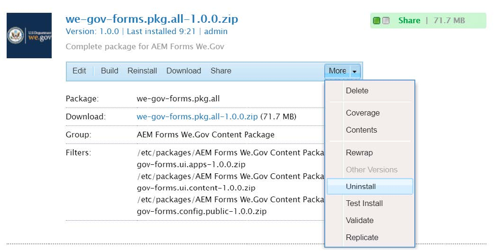
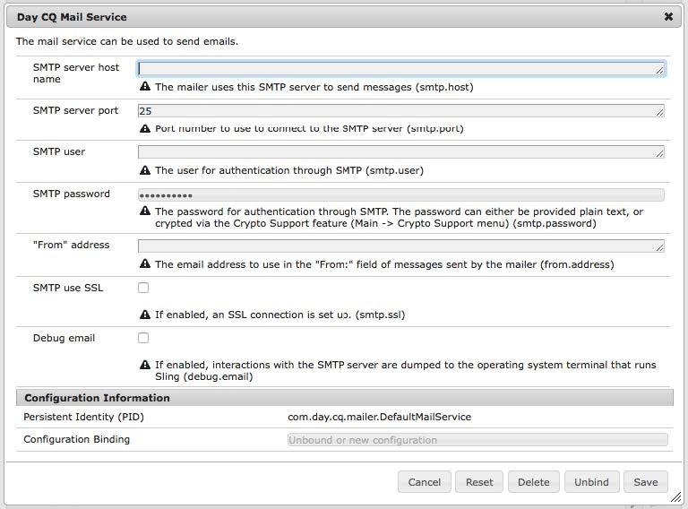
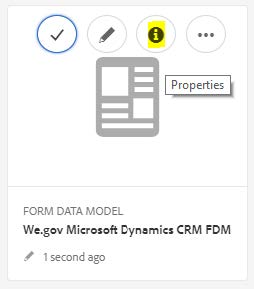
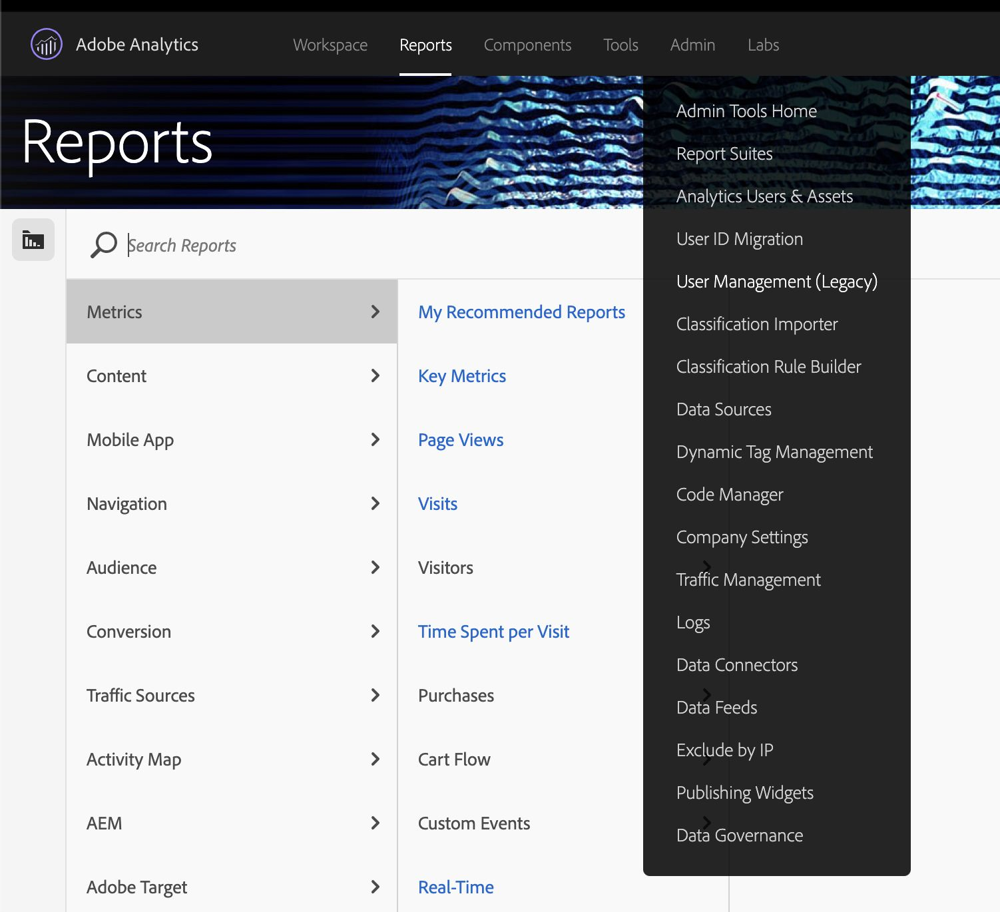
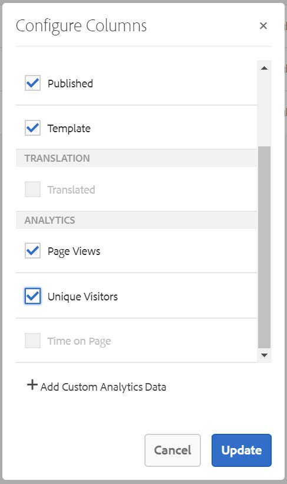
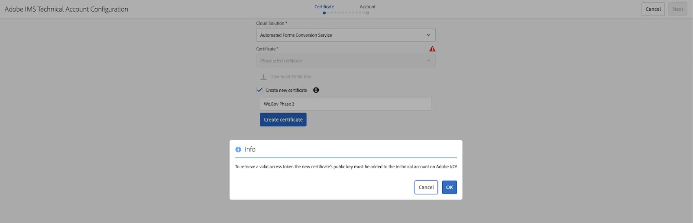
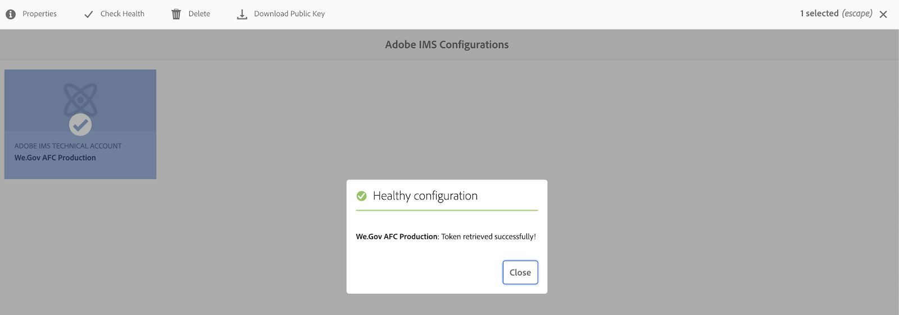
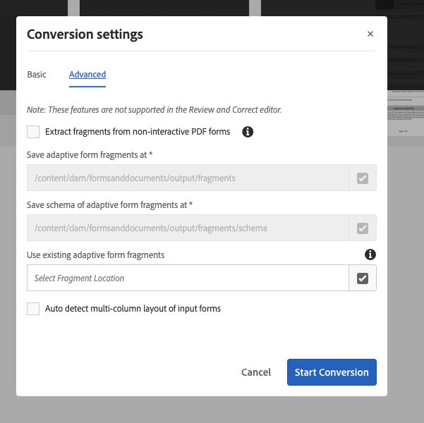

# Configure y configure el sitio de referencia de We.Gov y We.Finance {#set-up-and-configure-we-gov-reference-site}

## Detalles del paquete de demostración {#demo-package-details}

### Requisitos previos de instalación {#installation-prerequisites}

Este paquete se creó para **AEM Forms 6.4 OSGI Author**, se ha probado y, por lo tanto, se admite en las siguientes versiones de plataforma:

| VERSIÓN DE AEM | VERSIÓN DEL PAQUETE DE AEM Forms | ESTADO |
|---|---|---|
| 6.4 | 5,0,86 | **Compatible** |
| 6.5 | 6,0,80 | **Compatible** |
| 6.5.3 | 6.0.122 | **Compatible** |

Este paquete contiene configuración de nube que admite las siguientes versiones de plataforma:

| PROVEEDOR DE NUBE | VERSIÓN DEL SERVICIO | ESTADO |
|---|---|---|
| Adobe Sign | API v5 | **Compatible** |
| Microsoft Dynamics 365 | 1710 (9.1.0.3020) | **Compatible** |
| Adobe Analytics | API de Rest v1.4 | **Compatible** |
**Consideraciones sobre la instalación del paquete:**

* Se espera que el paquete esté instalado en un servidor limpio, libre de otros paquetes de demostración o versiones de paquetes de demostración más antiguas
* Se espera que el paquete esté instalado en un servidor OSGI, que se ejecuta en modo Autor

### ¿Qué incluye este paquete? {#what-does-this-package-include}

El [paquete de demostración de AEM Forms We.Gov](https://experience.adobe.com/#/downloads/content/software-distribution/en/aem.html?package=/content/software-distribution/en/details.html/content/dam/aem/public/adobe/packages/cq650/featurepack/we-gov-forms.pkg.all-2.0.2.zip) (**we-gov-forms.pkg.all-&lt;version>.zip**) viene como un paquete que incluye varios subpaquetes y servicios más. El paquete incluye los siguientes módulos:

* **we-gov-forms.pkg.all-&lt;version>.zip** : paquete de demostración  *completo*

   * **we-gov-forms.ui.apps-&lt;version>.zip** *: contiene todos los componentes, bibliotecas de cliente, usuarios de muestras, modelos de flujo de trabajo, etc.*

      * **we-gov-forms.core-&lt;version>.jar** :  *contiene todos los servicios OSGI, implementación de pasos de flujo de trabajo personalizados, etc.*

      * **we-gov-forms.derby&lt;version>.jar** :  *contiene todos los servicios OSGI, el esquema de la base de datos, etc.*

      * **core.wcm.components.all-2.0.4.zip** :  *recopilación de componentes WCM de muestra*

      * **grid-aem.ui.apps-1.0-SNAPSHOT.zip** : paquete de diseño de cuadrícula de  *AEM Sites para el control de columnas de la página Sitios*
   * **we-gov-forms.ui.content-&lt;version>.zip** :  *contiene todo el contenido, las páginas, las imágenes, los formularios, los recursos de comunicación interactivos, etc.*

   * **we-gov-forms.ui.analytics-&lt;version>.zip** :  *contiene todos los datos de Forms Analytics de We.Gov que se van a almacenar en el repositorio.*

   * **we-gov-forms.config.public-&lt;version>.zip** :  *contiene todos los nodos de configuración predeterminados, incluidas las configuraciones de nube de marcador de posición para ayudar a evitar problemas de enlace de servicios y modelos de datos de formularios.*

Los activos incluidos en este paquete incluyen:

* AEM páginas del sitio con plantillas editables
* AEM Forms Adaptive Forms
* Comunicaciones interactivas de AEM Forms (canal impreso y web)
* Documento de registro XDP de AEM Forms
* Modelo de datos de AEM Forms MS Dynamics Forms
* Integración de Adobe Sign
* Modelo de flujo de trabajo AEM
* Imágenes de muestra de AEM Assets
* Base de datos Apache Derby de muestra (en memoria)
* Fuente de datos Apache Derby (para su uso con el Modelo de datos de formulario)

## Demostración de la instalación del paquete {#demo-package-installation}

Esta sección contiene información sobre la instalación del paquete de demostración.

### Desde la distribución de software {#from-software-distribution}

1. Abra [Distribución de software](https://experience.adobe.com/downloads). Necesitará un Adobe ID para iniciar sesión en la distribución de software.
1. Pulse **[!UICONTROL Adobe Experience Manager]**, disponible en el menú del encabezado.
1. En la sección **[!UICONTROL Filters]**:
   1. Seleccione **[!UICONTROL Forms]** en la lista desplegable **[!UICONTROL Solución]**.
   2. Seleccione la versión y el tipo del paquete. También puede utilizar la opción **[!UICONTROL Search Downloads]** para filtrar los resultados.
1. Pulse el nombre del paquete **we-gov-forms.pkg.all-&lt;version>.zip**, seleccione **[!UICONTROL Accept EULA Terms]** y pulse **[!UICONTROL Download]**.
1. Abra [Administrador de paquetes](https://docs.adobe.com/content/help/es-ES/experience-manager-65/administering/contentmanagement/package-manager.html) y haga clic en **[!UICONTROL Cargar paquete]** para cargar el paquete.
1. Seleccione el paquete y haga clic en **[!UICONTROL Install]**.

   

1. Permita que se complete el proceso de instalación.
1. Vaya a *https://&lt;aemserver>:&lt;port>/content/we-gov/home.html?wcmmode=disabled* para asegurarse de que la instalación se haya realizado correctamente.

### Desde un archivo ZIP local {#from-a-local-zip-file}

1. Descargue y busque el archivo **we-gov-forms.pkg.all-&lt;version>.zip**.
1. Vaya a *https://&lt;aemserver>:&lt;port>/crx/packmgr/index.jsp*.
1. Seleccione la opción Cargar paquete.

   

1. Utilice el explorador de archivos para buscar y seleccionar el archivo ZIP descargado.
1. Haga clic en &quot;Abrir&quot; para cargar.
1. Una vez cargado, seleccione la opción &quot;Instalar&quot; para instalar el paquete.

   

1. Permita que se complete el proceso de instalación.
1. Vaya a *https://&lt;aemserver>:&lt;port>/content/we-gov/home.html?wcmmode=disabled* para asegurarse de que la instalación se haya realizado correctamente.

### Instalación de nuevas versiones de paquetes {#installing-new-package-versions}

Para instalar la nueva versión del paquete, siga los pasos definidos en 4.1 y 4.2. Es posible instalar una versión más reciente del paquete mientras ya está instalado otro paquete anterior, pero se recomienda desinstalar primero la versión anterior del paquete. Para ello, siga los pasos a continuación.

1. Vaya a *https://&lt;aemserver>:&lt;port>/crx/packmgr/index.jsp*
1. Busque el archivo **we-gov-forms.pkg.all-&lt;version>.zip** anterior.
1. Seleccione la opción &quot;Más&quot;.
1. En la lista desplegable, seleccione la opción &quot;Desinstalar&quot;.

   

1. En la confirmación, vuelva a seleccionar &quot;Desinstalar&quot; y permita que se complete el proceso de desinstalación.

## Demostración de la configuración del paquete {#demo-package-configuration}

Esta sección contiene detalles e instrucciones sobre la configuración posterior a la implementación del paquete de demostración antes de la presentación.

### Configuración de usuario ficticia {#fictional-user-configuration}

1. Vaya a *https://&lt;aemserver>:&lt;port>/libs/granite/security/content/groupadmin.html*
1. Inicie sesión como administrador para realizar las tareas siguientes.
1. Desplácese hacia abajo hasta el final de la página para cargar todos los grupos de usuarios.
1. Busque &quot;**workflow**&quot;.
1. Seleccione el grupo &quot;**workflow-users**&quot; y haga clic en &quot;Propiedades&quot;.
1. Vaya a la pestaña &quot;Miembros&quot;.
1. Escriba **wegov** en el campo &quot;Seleccionar usuario o grupo&quot;.
1. Seleccione en el menú desplegable &quot;**Usuarios de Forms de We.Gov**&quot;.

   

1. Haga clic en Guardar y cerrar en la barra de menús.
1. Repita los pasos del 2 al 7 buscando &quot;**analytics**&quot;, seleccionando el grupo &quot;**Administradores de Analytics**&quot; y agregando el grupo &quot;**Usuarios de Forms de We.Gov**&quot; como miembro.
1. Repita los pasos del 2 al 7 buscando &quot;**usuarios de formularios**&quot;, seleccionando el grupo &quot;**usuarios de formularios**&quot; y agregando el grupo &quot;**Usuarios de Forms de We.Gov**&quot; como miembro.
1. Repita los pasos del 2 al 7 buscando &quot;**usuarios de formularios**&quot;, seleccionando el grupo &quot;**usuarios de formularios**&quot; y agregando esta vez el grupo &quot;**Usuarios de We.Gov**&quot; como miembro.

### Configuración del servidor de correo electrónico {#email-server-configuration}

1. Consulte la documentación de configuración [Configuración de notificaciones por correo electrónico](/help/sites-administering/notification.md)
1. Inicie sesión como administrador para realizar esta tarea.
1. Vaya a *https://&lt;aemserver>:&lt;port>/system/console/configMgr*
1. Busque y haga clic en el servicio **Day CQ Mail Service** para configurarlo.

   

1. Configure el servicio para conectarse al servidor SMTP de su elección:

   1. **Nombre de host** del servidor SMTP: por ejemplo (smtp.gmail.com)
   1. **Puerto** del servidor: Por ejemplo (465) para gmail usando SSL
   1. **Usuario SMTP:** demo@  &lt;companyname> .com
   1. **Dirección** &quot;De&quot;: aemformsdemo@adobe.com

   

1. Haga clic en Guardar para guardar la configuración.

### (Opcional) Configuración AEM SSL {#aemsslconfig}

Esta sección contiene detalles sobre la configuración de SSL en la instancia de AEM para poder configurar la configuración de Adobe Sign Cloud.

**Referencias:**

1. [SSL de forma predeterminada](/help/sites-administering/ssl-by-default.md)

**Notas:**

1. Vaya a https://&lt;aemserver>:&lt;port>/aem/inbox, donde podrá completar el proceso explicado en el enlace de documentación de referencia anterior.
1. El paquete `we-gov-forms.pkg.all-[version].zip` incluye una clave SSL de muestra y un certificado al que se puede acceder extrayendo la carpeta `we-gov-forms.pkg.all-[version].zip/ssl` que forma parte del paquete.

1. Certificado SSL y detalles de clave:

   1. emitido a &quot;CN=localhost&quot;
   1. 10 años de validez
   1. valor de contraseña de &quot;password&quot;
1. La clave privada es *localhostprivate.der*.
1. El certificado es *localhost.crt*.
1. Haga clic en Siguiente. 
1. El nombre de host HTTPS debe establecerse en *localhost*.
1. El puerto debe establecerse en un puerto que el sistema haya expuesto.

### (Opcional) Configuración de nube de Adobe Sign {#adobe-sign-cloud-configuration}

Esta sección contiene detalles e instrucciones sobre la Configuración de Adobe Sign Cloud.

**Referencias:**

1. [Integración de Adobe Sign con AEM Forms](adobe-sign-integration-adaptive-forms.md)

#### Configuración de nube {#cloud-configuration}

1. Revise los requisitos previos. Consulte [AEM Configuración SSL](../../forms/using/forms-install-configure-gov-reference-site.md#aemsslconfig) para obtener la configuración SSL necesaria.
1. Ir a:

   *https://&lt;aemserver>:&lt;port>/libs/adobesign/cloudservices/adobesign.html/conf/we-gov*

   >[!NOTE]
   >
   >La URL utilizada para acceder al servidor de AEM debe coincidir con la URL configurada en el URI de redirección de Adobe Sign OAuth para evitar problemas de configuración (p. ej. *https://&lt;aemserver>:&lt;port>/mnt/overlay/adobesign/cloudservices/adobesign/properties.html*)

1. Seleccione la configuración &quot;Adobe Sign We.gov&quot;.
1. Haga clic en &quot;Propiedades&quot;.
1. Vaya a la pestaña &quot;Configuración&quot;.
1. Introduzca la URL oAuth, por ejemplo: [https://secure.na1.echosign.com/public/oauth](https://secure.na1.echosign.com/public/oauth)
1. Proporcione el ID de cliente y el Secreto de cliente configurados desde la instancia de Adobe Sign configurada.
1. Haga clic en &quot;Conectar a Adobe Sign&quot;.
1. Una vez realizada la conexión correctamente, haga clic en &quot;Guardar y cerrar&quot; para completar la integración.

### (Opcional) Configuración de la nube de MS Dynamics {#ms-dynamics-cloud-configuration}

Esta sección contiene detalles e instrucciones sobre la configuración de MS Dynamics Cloud.

**Referencias:**

1. [Configuración de OData de Microsoft Dynamics](https://docs.adobe.com/content/help/en/experience-manager-64/forms/form-data-model/ms-dynamics-odata-configuration.html)
1. [Configuración de Microsoft Dynamics para AEM Forms](https://helpx.adobe.com/experience-manager/kt/forms/using/config-dynamics-for-aem-forms.html)

#### Servicio en la nube de MS Dynamics OData {#ms-dynamics-odata-cloud-service}

1. Ir a:

   https://&lt;aemserver>:&lt;port>/libs/fd/fdm/gui/components/admin/fdmcloudservice/fdm.html/conf/we-gov

   1. Asegúrese de que está accediendo al servidor utilizando la misma URL de redireccionamiento configurada en el registro de la aplicación MS Dynamics.

1. Seleccione la configuración &quot;Cloud Service OData de Microsoft Dynamics&quot;.
1. Haga clic en &quot;Propiedades&quot;.

   

1. Vaya a la pestaña &quot;Configuración de autenticación&quot;.
1. Introduzca los siguientes detalles:

   1. **Raíz del servicio:**  p. ej.  `https://msdynamicsserver.api.crm3.dynamics.com/api/data/v9.1/`
   1. **Tipo de autenticación:** OAuth 2.0
   1. **Configuración de autenticación**  (consulte Configuración de nube de  [MS Dynamics ](../../forms/using/forms-install-configure-gov-reference-site.md#dynamicsconfig) para recopilar esta información):

      1. ID de cliente (también denominado ID de aplicación)
      1. Secreto del cliente
      1. URL de OAuth, por ejemplo [https://login.windows.net/common/oauth2/authorize](https://login.windows.net/common/oauth2/authorize)
      1. Actualizar URL del token: p. ej. [https://login.windows.net/common/oauth2/token](https://login.windows.net/common/oauth2/token)
      1. URL del token de acceso, por ejemplo [https://login.windows.net/common/oauth2/token](https://login.windows.net/common/oauth2/token)
      1. Ámbito de autorización: **openid**
      1. Encabezado de autenticación - **Portador de autorización**
      1. Recurso: por ejemplo `https://msdynamicsserver.api.crm3.dynamics.com`
   1. Haga clic en &quot;Conectar a OAuth&quot;.

1. Tras autenticarse correctamente, haga clic en &quot;Guardar y cerrar&quot; para completar la integración.

#### Configuración de nube de MS Dynamics {#dynamicsconfig}

Los pasos detallados en esta sección se incluyen para ayudarle a localizar el ID de cliente, el Secreto del cliente y los detalles de la instancia de MS Dynamics Cloud.

1. Vaya a [https://portal.azure.com/](https://portal.azure.com/) e inicie sesión.
1. En el menú de la izquierda, seleccione &quot;Todos los servicios&quot;.
1. Busque o vaya a &quot;Registro de aplicación&quot;.
1. Cree o seleccione un registro de aplicación existente.
1. Copie el **ID de aplicación** que se utilizará como el **ID de cliente** de OAuth en la configuración de nube de AEM
1. Haga clic en &quot;Configuración&quot; o &quot;Manifiesto&quot; para configurar las **URL de respuesta.**

   1. Esta dirección URL debe coincidir con la dirección URL utilizada para acceder al servidor de AEM al configurar el servicio OData.

1. En la vista Configuración, haga clic en &quot;Claves&quot; para ver cómo crear una clave nueva (se utiliza como Secreto del cliente en AEM ).

   1. Asegúrese de mantener una copia de la clave, ya que no podrá verla más adelante en Azure o AEM.

1. Para localizar la URL del recurso o la URL raíz del servicio, vaya al panel de instancias de MS Dynamics.
1. En la barra de navegación superior, haga clic en &quot;Ventas&quot; o escriba su propia instancia y seleccione Configuración.
1. Haga clic en &quot;Personalizaciones&quot; y &quot;Recursos para desarrolladores&quot; cerca de la parte inferior derecha.
1. Ahí encontrará la URL raíz del servicio: p. ej.

   *`https://msdynamicsserver.api.crm3.dynamics.com/api/data/v9.1/`

1. Los detalles sobre la URL del token de actualización y acceso están disponibles aquí:

   *[https://docs.microsoft.com/en-us/rest/api/datacatalog/authenticate-a-client-app](https://docs.microsoft.com/en-us/rest/api/datacatalog/authenticate-a-client-app)*

#### Prueba del modelo de datos de Forms (Dynamics) {#testing-the-form-data-model}

Una vez completada la configuración de la nube, es posible que desee probar el modelo de datos de formulario.

1. Ir a

   *https://&lt;aemserver>:&lt;port>/aem/forms.html/content/dam/formsanddocuments-fdm/we-gov*

1. Seleccione &quot;We.gov Microsoft Dynamics CRM FDM&quot; y &quot;Properties&quot;.

   

1. Vaya a la pestaña &quot;Actualizar origen&quot;.
1. Asegúrese de que la &quot;Configuración según el contexto&quot; esté configurada como &quot;/conf/we-gov&quot; y que la fuente de datos configurada sea &quot;ms-dynamics-data-cloud-service&quot;.

   

1. Edite el Modelo de datos de formulario.

1. Pruebe los servicios para asegurarse de que se conectan correctamente a la fuente de datos configurada.

   >[!NOTE]
   Después de probar los servicios, haga clic en **Cancelar** para asegurarse de que los cambios involuntarios no se propaguen al Modelo de datos de formulario.

   >[!NOTE]
   Se ha informado de que era necesario reiniciar el servidor AEM para que el origen de datos se enlace correctamente al FDM.

#### Prueba del modelo de datos de Forms (Derby) {#test-fdm-derby}

Una vez completada la configuración de la nube, es posible que desee probar el modelo de datos de formularios.

1. Vaya a *https://&lt;aemserver>:&lt;port>/aem/forms.html/content/dam/formsanddocuments-fdm/we-gov*

1. Seleccione el **We.gov EnSubscription FDM** y seleccione **Properties**.

   

1. Vaya a la pestaña **Update Source**.

1. Asegúrese de que la **Configuración según el contexto** está configurada en `/conf/we-gov` y que la fuente de datos configurada es **We.Gov Derby DS**.

   

1. Haga clic en **Guardar y cerrar**.

1. [Pruebe los ](work-with-form-data-model.md#test-data-model-objects-and-services) servicios para asegurarse de que se conectan correctamente a la fuente de datos configurada

   * Para probar la conexión, seleccione **HOMEMORTGAGEACCOUNT** y asígnele un servicio get. Pruebe que los administradores del sistema y del servicio puedan ver los datos que se recuperan.

### Configuración de Adobe Analytics (opcional) {#adobe-analytics-configuration}

Esta sección contiene detalles e instrucciones sobre la Configuración de Adobe Analytics Cloud.

**Referencias:**

* [Integración con Adobe Analytics](../../sites-administering/adobeanalytics.md)

* [Conexión a Adobe Analytics y creación de módulos](../../sites-administering/adobeanalytics-connect.md)

* [Visualización de datos de análisis de la página](../../sites-authoring/pa-using.md)

* [Configuración de análisis e informes](configure-analytics-forms-documents.md)

* [Ver y comprender los informes de análisis de AEM Forms](view-understand-aem-forms-analytics-reports.md)

### Configuración del servicio en la nube de Adobe Analytics {#adobe-analytics-cloud-service-configuration}

Este paquete viene preconfigurado para conectarse a Adobe Analytics. Se proporcionan los pasos siguientes para permitir que esta configuración se actualice.

1. Vaya a *https://&lt;aemserver>:&lt;port>/libs/cq/core/content/tools/cloudservices.html*
1. Busque la sección Adobe Analytics y seleccione el vínculo &quot;Mostrar configuraciones&quot;.
1. Seleccione la configuración &quot;We.Gov Adobe Analytics (Analytics Configuration)&quot;.

   

1. Haga clic en el botón &quot;Editar&quot; para actualizar la configuración de Adobe Analytics (deberá proporcionar el Secreto compartido). Haga clic en &quot;Conectar a Analytics&quot; para conectarse y en &quot;Aceptar&quot; para completarlo.

   

1. En la misma página, haga clic en &quot;We.Gov Adobe Analytics Framework (Analytics Framework)&quot; si desea actualizar las configuraciones del marco (consulte [Habilitar la creación de AEM](../../forms/using/forms-install-configure-gov-reference-site.md#enableauthoring) para habilitar la creación).

#### Búsqueda de credenciales de usuario en Adobe Analytics {#analytics-locating-user-credentials}

Para localizar las credenciales de usuario para una cuenta de Adobe Analytics, el administrador de cuentas debe realizar las siguientes tareas.

1. Vaya al portal de Adobe Experience Cloud.
   * Inicie sesión con sus credenciales de administrador
1. Seleccione el icono Adobe Analytics en el tablero principal.
   
1. Vaya a la ficha Administración y seleccione el elemento Administración de usuarios (heredado)
   
1. Seleccione la pestaña **Users**.
   
1. Seleccione el usuario que desee en la lista de usuarios.
1. Desplácese hasta la parte inferior de la página y la información de autenticación de los usuarios aparecerá en la parte inferior de la página.
   
1. El nombre de usuario y la información secreta compartida aparecerán en la parte derecha del cuadro de permisos.
1. Tenga en cuenta que el nombre de usuario tendrá dos puntos dentro del nombre, toda la información a la izquierda de los dos puntos es el nombre de usuario, y toda la información a la derecha de los dos puntos será el nombre de la empresa.
   * Este es un ejemplo de esto: *username : nombre de la empresa*

#### Configuración de la autenticación de usuarios en Adobe Analytics {#setup-user-authentication}

Los administradores pueden proporcionar a los usuarios AEM permisos de análisis realizando las siguientes acciones.

1. Vaya a Adobe Admin Console.

1. Haga clic en la instancia de Analytics que se expone a Admin Console.

   * Se encuentra en la página principal de la página de administración.

1. Seleccione Acceso completo de administrador de Analytics.

1. Agregue un usuario al Perfil.

   

1. Haga clic en la pestaña permisos una vez que el id de usuario se haya asignado al perfil.

1. Asegúrese de que todos los permisos estén asignados al perfil.

   

1. Tenga en cuenta que una vez que los permisos se han asignado a la capacidad de un usuario para iniciar sesión, puede tardar unas horas.

### Informes de Adobe Analytics {#adobe-analytics-reporting}

#### Ver informes de sitios de Adobe Analytics {#view-adobe-analytics-sites-reporting}

>[!NOTE]
Los datos de AEM Forms Analytics están disponibles sin conexión o sin una configuración de nube de Adobe Analytics si el paquete `we-gov-forms.ui.analytics-<version>.zip` está instalado, pero los datos de AEM Sites requieren una configuración de nube activa.

1. Vaya a *https://&lt;aemserver>:&lt;port>/sites.html/content*
1. Seleccione el &quot;Sitio de AEM Forms We.Gov&quot; para ver las páginas del sitio.
1. Seleccione una de las páginas del sitio (p. ej., Inicio) y elija &quot;Analytics &amp; Recommendations&quot;.

   

1. En esta página, verá información recuperada de Adobe Analytics relacionada con la página de AEM Sites (nota: por diseño, esta información se actualiza periódicamente desde Adobe Analytics y no se muestra en tiempo real).

   

1. En la página de vista de página (a la que se accede en el paso 3), también puede ver la información de vista de página cambiando la configuración de visualización para ver los elementos en la &quot;Vista de lista&quot;.
1. Busque el menú desplegable &quot;Ver&quot; y seleccione &quot;Vista de lista&quot;.

   

1. En el mismo menú, seleccione &quot;Ver configuración&quot; y seleccione las columnas que desee mostrar en la sección &quot;Analytics&quot;.

   

1. Haga clic en &quot;Actualizar&quot; para que las nuevas columnas estén disponibles.

   

#### Ver informes de Adobe Analytics forms {#view-adobe-analytics-forms-reporting}

>[!NOTE]
Los datos de AEM Forms Analytics están disponibles sin conexión o sin una configuración de nube de Adobe Analytics si el paquete `we-gov-forms.ui.analytics-<version>.zip` está instalado, pero los datos de AEM Sites requieren una configuración de nube activa.

1. Ir a

   *https://&lt;aemserver>:&lt;port>/aem/forms.html/content/dam/formsanddocuments/adobe-gov-forms*

1. Seleccione el formulario adaptable &quot;Solicitud de inscripción para beneficios de salud&quot; y seleccione la opción &quot;Informe de Analytics&quot;.

   

1. Espere a que se cargue la página y vea los datos del informe de Analytics.

   

### Habilitación de la configuración automatizada de Forms de Adobe {#automated-forms-enablement}

Para instalar y configurar AEM Forms con el Adobe Forms, los usuarios de la herramienta de conversión deben tener lo siguiente.

1. Acceso al Adobe I/O.

1. Permiso para crear una integración con el servicio de conversión de Forms de Adobe.

1. Adobe AEM 6.5 último service pack que se ejecuta como autor.

Revise lo siguiente antes de leer más instrucciones:

* [Configurar el servicio de conversión automatizada de formularios](https://docs.adobe.com/content/help/en/aem-forms-automated-conversion-service/using/configure-service.html)

#### Creación de una configuración de IMS, parte 1 {#creating-ims-config}

Para que el servicio se comunique correctamente con la herramienta de conversión de formularios, los usuarios deben configurar el servicio Identity Management System (IMS) para poder registrarse con el Adobe I/O.

1. Vaya a https://&lt;aemserver>:&lt;port> > Haga clic en Adobe Experience
Administrador en la parte superior izquierda > Herramientas > Seguridad > Configuración de Adobe IMS.

1. Haga clic en Crear.

1. Realice las acciones en la imagen siguiente.

   

1. Asegúrese de descargar el certificado.

1. No continúe con el resto de la configuración: revise la sección [Creación de la integración en Adobe I/O](#create-integration-adobeio)

>[!NOTE]
El certificado creado en esta sección se utilizará para crear el servicio de integración en Adobe I/O. Una vez que los usuarios se hayan creado en el servicio de integración, los usuarios podrán utilizar esa información desde el Adobe I/O para finalizar la configuración.

#### Creación de la integración en Adobe I/O {#create-integration-adobeio}

Asegúrese de que puede crear una integración dentro del dominio de Adobe si no se pone en contacto con el administrador del sistema para ello.

1. Vaya a la [Consola de Adobe I/O](https://console.adobe.io/).

1. Haga clic en Crear integración.

1. Seleccione Acceso a una API.

1. Asegúrese de que está en el grupo correcto (lista desplegable superior derecha).

1. En la sección Experience Cloud , seleccione la Herramienta de conversión de Forms.

1. Haga clic en Continuar.

1. Introduzca el nombre y la descripción de la integración.

1. Si utiliza la clave pública de la sección 2.1, colóquela dentro de la integración de la clave.

1. Seleccione un perfil para la automated forms conversion.

   

#### Creación de la configuración IMS, parte 2 {#create-ims-config-part-next}

Ahora que ha creado una integración, permítanos completar la instalación de la configuración de IMS.

1. Haga clic en la integración dentro de Adobe I/O para exponer los detalles de la conexión.

1. Vaya a la configuración de IMS en AEM (Herramientas > Seguridad > IMS)

1. Haga clic en Siguiente en la pantalla de configuración de IMS.

1. Introduzca el servidor de autorización (valor mostrado en la captura de pantalla).

1. Introduzca la clave de API.

1. Introduzca el Secreto del cliente (debe hacer clic en exponer en el Adobe I/O Integración para que se muestre).

1. Haga clic en la pestaña JWT en el Adobe I/O para obtener la carga útil JWT y pegarla en la carga útil de la configuración IMS.

   

1. Una vez creado, haga clic en la Configuración de IMS y seleccione Comprobación de estado, los usuarios deben ver el siguiente resultado.

   

#### Configuración de la nube (producción AFC de We.Gov) {#configure-cloud-configuration}

Una vez completada la configuración de IMS, podemos proceder a revisar la configuración de nube en AEM. Si la configuración no existe, siga estos pasos para crear la configuración de nube en AEM:

1. Abra el explorador y vaya a la URL del sistema https://&lt;nombre_dominio>:&lt;puerto_sistema>

1. Haga clic en Adobe Experience Manager en la esquina superior izquierda de la pantalla > Herramientas > Cloud Services > Configuración de conversación automatizada de Forms.

1. Seleccione la carpeta de configuración en la que desea colocar la configuración.

1. Haga clic en Crear.

1. Introduzca la información en la captura de pantalla siguiente.

   

1. Proporcione un Título y un Nombre a la configuración.

1. La URL de servicio del sistema se establece en https://aemformsconversion.adobe.io/.

1. URL de plantilla */conf/we-gov/settings/wcm/templates/we-gov-flamingo-template*.

1. Dirección URL del tema: */content/dam/formsanddocuments-themes/adobe-gov-forms-themes/we-gov-theme*

1. Haga clic en Siguiente. 

1. Para esta configuración, dejamos vacíos los dos valores de casilla de verificación.

   * Para obtener más información sobre estas opciones, consulte [Configuración del servicio en la nube](https://docs.adobe.com/content/help/en/aem-forms-automated-conversion-service/using/configure-service.html#configure-the-cloud-service).

#### Configuración de nube (producción AFC de We.Finance) {#configure-cloud-configuration-wefinance}

Una vez completada la configuración de IMS, podemos proceder a crear la configuración de nube en AEM.

1. Abra el explorador y vaya a la URL del sistema https://&lt;nombre_dominio>:&lt;puerto_sistema>

1. Haga clic en Adobe Experience Manager en la esquina superior izquierda de la pantalla > Herramientas > Cloud Services > Configuración de conversación automatizada de Forms.

1. Seleccione la carpeta de configuración en la que desea colocar la configuración.

1. Haga clic en Crear.

1. Introduzca la información en la captura de pantalla siguiente.

   

1. Proporcione un Título y un Nombre a la configuración.

1. La URL de servicio del sistema se establece en https://aemformsconversion.adobe.io/

1. URL de plantilla: */conf/we-finance/settings/wcm/templates/we-finance-adaptive-form*

1. Dirección URL del tema: */content/dam/formsanddocuments-themes/adobe-finance-forms-themes/we-finance-theme*

1. Haga clic en Siguiente. 

1. Para esta configuración, dejamos vacíos los dos valores de casilla de verificación.

   * Para obtener más información sobre estas opciones, consulte [Configuración del servicio en la nube](https://docs.adobe.com/content/help/en/aem-forms-automated-conversion-service/using/configure-service.html#configure-the-cloud-service).

#### Prueba de la conversión de formularios (aplicación de inscripción We.Gov) {#test-forms-conversion}

Una vez configurada la configuración, los usuarios pueden probarla cargando un documento PDF.

1. Vaya al sistema AEM https://&lt;nombre_dominio>:&lt;puerto_sistema>

1. Haga clic en Forms > Forms &amp; Documents > AEM Forms We.gov Forms > AFC.

1. Seleccione el PDF de aplicación de inscripción We.Gov.

1. Haga clic en el botón **Iniciar conversión automatizada** en la esquina superior derecha.

1. Los usuarios deben poder ver la opción como se muestra a continuación.

   

1. Una vez seleccionado el botón, se presentarán a los usuarios las siguientes opciones

   * Asegúrese de que los usuarios seleccionen la configuración *We.Gov AFC Production*

   

   

1. Seleccione Iniciar conversión una vez haya configurado todas las opciones que desee utilizar.

1. A medida que comienza el proceso de conversión, los usuarios deben ver la siguiente pantalla:

   

1. Cuando se complete la conversión, los usuarios verán la siguiente pantalla:

   

   Haga clic en la carpeta **Output** para ver el formulario adaptable generado.

#### Problemas y notas conocidos {#known-issues-notes}

El servicio de Automated forms conversion incluye ciertas [prácticas recomendadas, patrones complejos conocidos](https://docs.adobe.com/content/help/en/aem-forms-automated-conversion-service/using/styles-and-pattern-considerations-and-best-practices.html) y [problemas conocidos](https://docs.adobe.com/content/help/en/aem-forms-automated-conversion-service/using/known-issues.html). Revise estos elementos antes de empezar a utilizar el servicio de Automated forms conversion de AEM Forms.

1. Genere el formulario con Generar formularios adaptables sin enlaces de datos habilitados si desea enlazar el formulario a un FDM después de la conversión.

1. Asegúrese de que la carpeta de plantillas tiene jcr:read habilitado para todos los permisos o de que el usuario del servicio no podrá leer la plantilla del repositorio y la conversión fallará.

## Demostración de personalizaciones de paquetes {#demo-package-customizations}

Esta sección incluye instrucciones sobre la personalización de la demostración.

### Personalización de plantillas {#templates-customization}

Las plantillas editables se encuentran en la siguiente ubicación:

*https://&lt;aemserver>:&lt;port>/libs/wcm/core/content/sites/templates.html/conf/we-gov*

Estas plantillas incluyen las plantillas AEM Sitio, Formulario adaptable y Comunicaciones interactivas, creadas y ensambladas con componentes que se pueden encontrar en:

*https://&lt;aemserver>:&lt;port>/crx/de/index.jsp#/apps/we-gov/components*

#### Sistema de estilos {#customizetemplates}

Este sitio también incluye bibliotecas de cliente, una de las cuales importa el Bootstrap 4 ( [https://getbootstrap.com/](https://getbootstrap.com/) ). Esta biblioteca de cliente está disponible en

*https://&lt;aemserver>:&lt;port>/crx/de/index.jsp#/apps/we-gov/clientlibs/clientlib-base/css/bootstrap*

Las plantillas editables incluidas en este paquete también vienen preconfiguradas con políticas de plantilla/página que utilizan las clases CSS Bootstrap 4 para la paginación, el estilo, etc. No todas las clases se han agregado a las directivas de plantilla, pero cualquier clase compatible con el Bootstrap 4 se puede agregar a las directivas. Consulte la página de introducción para obtener una lista de las clases disponibles:

[https://getbootstrap.com/docs/4.1/getting-started/introduction/](https://getbootstrap.com/docs/4.1/getting-started/introduction/)

Las plantillas incluidas en este paquete también admiten el sistema de estilos:

[Sistema de estilos](../../sites-authoring/style-system.md)

#### Logotipos de plantilla {#template-logos}

Los activos DAM del proyecto también incluyen logotipos e imágenes de We.Gov. Estos recursos están disponibles en:

*https://&lt;aemserver>:&lt;port>/assets.html/content/dam/we-gov*

Al editar las plantillas de página y formulario, se pueden actualizar los logotipos de marca editando los componentes Navegación y Pie de página . Estos componentes ofrecen una marca y un cuadro de diálogo de logotipo configurables que se pueden utilizar para actualizar los logotipos:

Consulte Edición del contenido de una página para obtener más información:

[Edición del contenido de una página](../../sites-authoring/editing-content.md)

### Personalización de páginas de sitios {#sites-pages-customization}

Todas las páginas del sitio están disponibles en: *https://&lt;aemserver>:&lt;port>/sites.html/content/we-gov*

Estas páginas del sitio también utilizan el paquete AEM Grid para controlar el diseño de algunos componentes.

#### Sistema de estilos {#style-system}

Las páginas incluidas en este paquete también admiten el sistema de estilos:

[Sistema de estilos](../../sites-authoring/style-system.md)

También puede consultar [Templates customization style system](../../forms/using/forms-install-configure-gov-reference-site.md#customizetemplates) para obtener documentación sobre los estilos compatibles.

### Personalización de formularios adaptables {#adaptive-forms-customization}

Todos los formularios adaptables están disponibles en:

*https://&lt;aemserver>:&lt;port>/aem/forms.html/content/dam/formsanddocuments/adobe-gov-forms*

Estos formularios se pueden personalizar para adaptarse a determinados casos de uso. Tenga en cuenta que determinados campos y la lógica de envío no deben modificarse para garantizar que el formulario sigue funcionando correctamente. Esto incluye:

**Solicitud De Inscripción Para Beneficios De Salud:**

* contact_id - Campo oculto utilizado para recibir el ID de contacto de MS Dynamics durante el envío
* Enviar: la lógica del botón de envío requiere personalización para admitir devoluciones de llamadas. La personalización está documentada, pero se necesitaba una secuencia de comandos grande para enviar el formulario mientras se realizaba una operación de POST y GET en MS Dynamics a través del Modelo de datos de Forms.
* Panel raíz: el evento Initialize se utiliza para añadir un botón de MS Dynamics a la bandeja de entrada de AEM de la forma menos intrusiva posible, ya que todos los componentes de la interfaz de usuario de Granite de AEM Bandeja de entrada no se pueden modificar.

#### Estilo de formulario adaptable {#adaptive-form-styling}

Los formularios adaptables también se pueden diseñar con el editor de estilos o el editor de temas:

* [Estilo en línea de los componentes de formulario adaptables](inline-style-adaptive-forms.md)
* [Creación y uso de temas](themes.md)

### Personalización del flujo de trabajo {#workflow-customization}

El formulario adaptable de inscripción se envía a un flujo de trabajo OSGI para su procesamiento. Este flujo de trabajo se encuentra en *https://&lt;aemserver>:&lt;port>/conf/we-gov/settings/models/we-gov-process.html*.

Debido a ciertas limitaciones, este flujo de trabajo contiene varias secuencias de comandos y pasos personalizados del proceso de flujo de trabajo OSGI. Estos pasos del flujo de trabajo se crearon como pasos genéricos y no se han creado con cuadros de diálogo de configuración. En este momento, la configuración de los pasos del flujo de trabajo depende de los argumentos del proceso.

Todo el código Java del paso del flujo de trabajo está contenido en el paquete **we-gov-forms.core-&lt;version>.jar**.

## Consideraciones de demostración y problemas conocidos {#demo-considerations-and-known-issues}

Esta sección contiene información sobre las características de la demostración y las decisiones de diseño que pueden requerir consideraciones especiales durante el proceso de demostración.

### Consideraciones sobre la demostración {#demo-considerations}

* Según AGRS-159, asegúrese de que el nombre (primero, medio y último) del contacto utilizado en el formulario adaptable de inscripción sea único.
* El formulario adaptable de inscripción enviará el correo electrónico de Adobe Sign al correo electrónico especificado en el campo de correo electrónico del formulario. Esa dirección de correo electrónico no puede ser la misma dirección de correo electrónico que el correo electrónico utilizado para configurar la configuración de nube de Adobe Sign.

### Problemas conocidos {#known-issues}

* (AGRS-120) El componente Navegación del sitio actualmente no admite páginas secundarias anidadas con una profundidad de más de 2 niveles.
* (AGRS-159) El FDM actual de MS Dynamics debe realizar dos operaciones en primer lugar, almacenar en POST los datos del formulario adaptable de inscripción en Dynamics y, a continuación, recuperar el registro de usuario para recuperar el ID de contacto. En su estado actual, la recuperación del ID de contacto fallará si hay más de dos usuarios con el mismo nombre en Dynamics, lo que no permitirá que se envíe el formulario adaptable de inscripción.

## Configuración de pruebas de accesibilidad {#configure-accessibility-testing}

### Habilitación de la prueba de accesibilidad Chrome Agregar {#enable-chrome-add-on}

Para realizar primero las pruebas de accesibilidad, debe instalar el complemento de Chrome, esto se puede encontrar [aquí](https://chrome.google.com/webstore/detail/accessibility-developer-t/fpkknkljclfencbdbgkenhalefipecmb?hl=en).

Una vez instalada, cargue la página que desee probar en el explorador Chrome (Nota: Si tiene varias pestañas abiertas, puede que la puntuación se vea afectada, es preferible tener una sola pestaña abierta). Una vez cargada la página
**haga clic con el botón derecho** en la página y seleccione la pestaña **Audits** . Los desarrolladores pueden seleccionar el tipo de auditoría que debe realizar el complemento de accesibilidad. Una vez seleccionadas todas las opciones deseadas, el usuario puede seleccionar el botón Generar informe . Esto generará un documento PDF que muestra la clasificación general de accesibilidad y lo que se puede utilizar para aumentar la clasificación de accesibilidad en general.

Una vez ejecutado el informe, los usuarios pueden ver lo siguiente:

El número que se muestra delante de los usuarios es la clasificación general de accesibilidad que han adquirido. También hay una descripción de cómo se calculó siguiendo la puntuación.

Si los usuarios desean exportar esto, pueden hacer clic en los tres botones a la derecha de la pantalla y seleccionar entre las opciones adicionales que ofrece el complemento.

### Tema Ultramarino {#ultramarine-theme}

La temática de Ultramarina, de acceso público y mantenida por el Adobe, se integra en la
`we-gov-forms.pkg.all-<version>.zip` archivo ZIP instalable. Una vez que este paquete está instalado usando CRX.

Administrador de paquetes, los usuarios pueden acceder al tema de Ultramarine en AEM Forms navegando a **Forms** > **Temas** > **Temas de referencia** > **Ultramarina accesible**.

## Opciones de configuración {#configuration-options}

Los usuarios pueden configurar varias opciones de servicio de flujo de trabajo que incluyen las siguientes:

1. Entrada de Microsoft Dynamics
1. Adobe Sign
1. AEM Administración de comunicaciones personalizadas
1. Adobe Analytics

Para configurarlos para que se activen dentro del flujo de trabajo, los usuarios deben realizar las siguientes tareas.

1. Vaya a https://&#39;[server]:[port]&#39;/system/console/configMgr.

1. Busque las *Configuraciones de WeGov*.

1. Abra la definición del servicio y habilite los servicios seleccionados para que se invoquen dentro del flujo de trabajo.

   >[!NOTE]
   Solo porque un usuario habilita el servicio dentro de la página Administrador de configuración , los usuarios siguen teniendo que configurar una configuración de servicio para comunicarse con los servicios externos solicitados.

   

1. Una vez finalizado, haga clic en el botón Save para guardar la configuración.

## Siguientes pasos {#next-steps}

Ahora, todos están listos para explorar el sitio de referencia de We.Gov. Para obtener más información sobre el flujo de trabajo y los pasos del sitio de referencia de We.Gov, consulte el [tutorial del sitio de referencia de We.Gov](../../forms/using/forms-gov-reference-site-user-demo.md).
