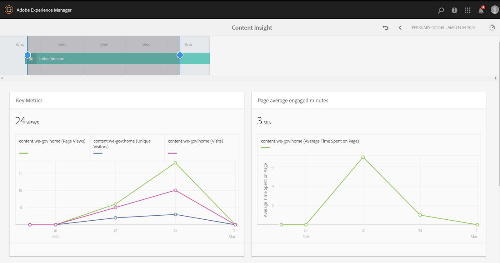
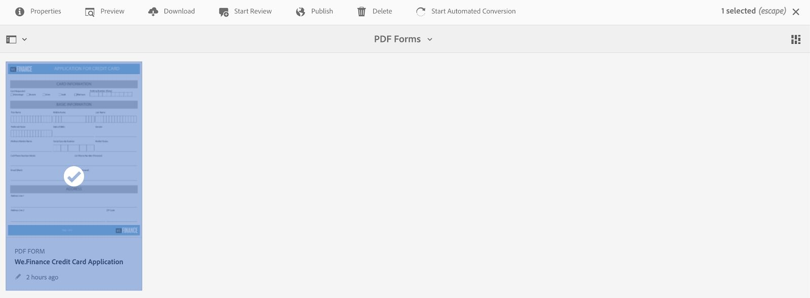
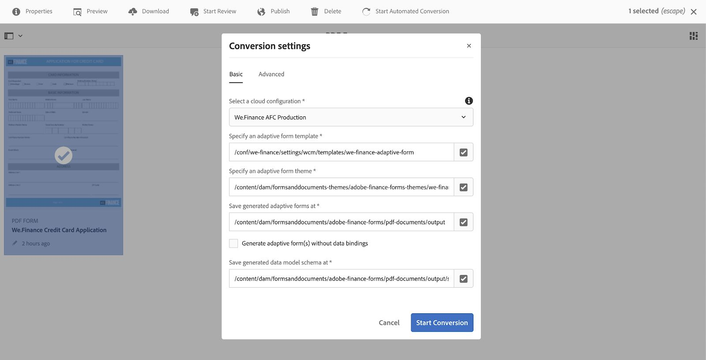
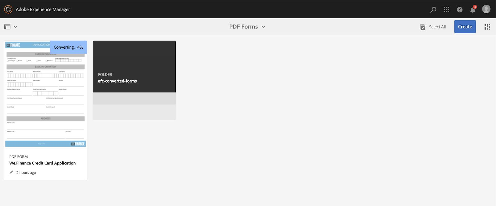
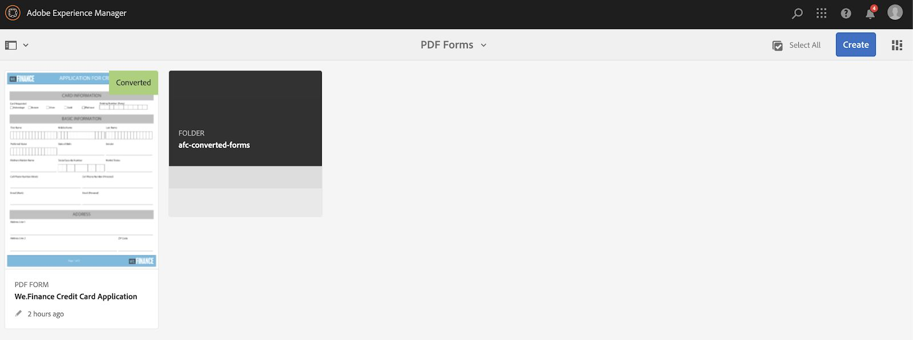

# Configurar y configurar el sitio de referencia de We.Gov {#set-up-and-configure-we-gov-reference-site}

## Detalles del paquete de demostración {#demo-package-details}

### Requisitos previos de instalación {#installation-prerequisites}

Este paquete se creó para **AEM Forms 6.4 OSGI Author**, se ha probado y, por tanto, se admite en las siguientes versiones de plataforma:

| VERSIÓN DE AEM | VERSIÓN DEL PAQUETE DE AEM FORMS | ESTADO |
|---|---|---|
| 6.4 | 5.0.86 | **Compatible** |
| 6.5 | 6.0.80 | **Compatible** |
| 6.5.3 | 6.0.122 | **Compatible** |

Este paquete contiene la configuración de nube que admite las siguientes versiones de plataforma:

| PROVEEDOR DE NUBE | VERSIÓN DE SERVICIO | ESTADO |
|---|---|---|
| Adobe Sign | API v5 | **Compatible** |
| Microsoft Dynamics 365 | 1710 (9.1.0.3020) | **Compatible** |
| Adobe Analytics | API v1.4 Rest | **Compatible** |
**Consideraciones sobre la instalación del paquete:**

* Se espera que el paquete se instale en un servidor limpio, libre de otros paquetes de demostración o versiones de paquetes de demostración anteriores
* Se espera que el paquete se instale en un servidor OSGI, que se ejecuta en modo Autor

### ¿Qué incluye este paquete? {#what-does-this-package-include}

El paquete de demostración de AEM Forms We.Gov (**we-gov-forms.pkg.all-&lt;version>.zip**) viene como un paquete que incluye varios otros subpaquetes y servicios. El paquete incluye los siguientes módulos:

* **we-gov-forms.pkg.all-&lt;version>.zip** : paquete de demostración *completo*

   * **we-gov-forms.ui.apps-&lt;version>.zip** *- Contiene todos los componentes, bibliotecas de clientes, usuarios de muestras, modelos de flujo de trabajo, etc.*

      * **we-gov-forms.core-&lt;version>.jar** : *contiene todos los servicios OSGI, implementación de pasos personalizados del flujo de trabajo, etc.*

      * **we-gov-forms.derby&lt;version>.jar** : *contiene todos los servicios OSGI, esquema de bases de datos, etc.*

      * **core.wcm.components.all-2.0.4.zip** : *colección de componentes WCM de muestra*

      * **grid-aem.ui.apps-1.0-SNAPSHOT.zip** : paquete de diseño de cuadrícula de *AEM Sites para el control de columnas de páginas Sitios*
   * **we-gov-forms.ui.content-&lt;version>.zip** : *contiene todo el contenido, las páginas, las imágenes, los formularios, los recursos de comunicación interactivos, etc.*

   * **we-gov-forms.ui.analytics-&lt;version>.zip** : *contiene todos los datos de Analytics de formularios We.Gov para almacenarlos en el repositorio.*

   * **we-gov-forms.config.public-&lt;version>.zip** : *contiene todos los nodos de configuración predeterminados, incluidas las configuraciones de nube de marcadores de posición, para ayudar a evitar problemas con el modelo de datos de formularios y el enlace de servicios.*

Los recursos incluidos en este paquete incluyen:

* Páginas de sitio de AEM con plantillas editables
* Formularios adaptables para AEM Forms
* Comunicaciones interactivas de AEM Forms (Canal de impresión y Web)
* AEM Forms Documento de registros XDP
* Modelo de datos de AEM Forms de MS Dynamics Forms
* Integración de Adobe Sign
* Modelo de flujo de trabajo de AEM
* Imágenes de muestra de AEM Assets
* Base de datos Apache Derby de muestra (en memoria)
* Apache Derby Data Source (para utilizar con el modelo de datos de formulario)

## Opciones de configuración {#configuration-options}

Los usuarios pueden configurar varias opciones de servicio de flujo de trabajo, entre las que se incluyen:

1. Entrada de Microsoft Dynamics
1. Adobe Sign
1. Administración personalizada de comunicaciones de AEM
1. Adobe Analytics

Para configurarlas para habilitarlas dentro del flujo de trabajo, los usuarios deben realizar las siguientes tareas.

1. Vaya a https://&#39;[server]:[port]&#39;/system/console/configMgr.

1. Busque las configuraciones de *WeGov*.

1. Abra la definición del servicio y active la invocación de los servicios seleccionados dentro del flujo de trabajo.

>[!NOTE]
>
>Sólo porque un usuario habilita el servicio en la página Administrador de configuración, los usuarios deben configurar una configuración de servicio para comunicarse con los servicios externos solicitados.

1. Una vez completada, haga clic en el botón Guardar para guardar la configuración.

## Instalación del paquete de demostración {#demo-package-installation}

Esta sección contiene información sobre la instalación del paquete de demostración.

### Desde paquete compartido {#from-package-share}

1. Vaya a *https://&lt;aemserver>:&lt;port>/crx/packageshare/*

   O bien, en AEM, haga clic en Implementación y vaya al icono Uso compartido de paquetes.

   

1. Inicie sesión con su Adobe ID.
1. Busque el paquete **we-gov-forms.pkg.all-&lt;version>** .
1. Seleccione la opción &quot;Descargar&quot; y acepte los términos y condiciones.
1. Una vez descargado, seleccione la opción &quot;Descargado&quot; para localizar el paquete en el Administrador de paquetes.
1. Seleccione la opción &quot;Instalar&quot; para instalar el paquete.

   

1. Permita que se complete el proceso de instalación.
1. Vaya a *https://&lt;aemserver>:&lt;port>/content/we-gov/home.html?wcmmode=disabled* para asegurarse de que la instalación se realizó correctamente.

### Desde un archivo ZIP local {#from-a-local-zip-file}

1. Descargue y localice el archivo **we-gov-forms.pkg.all-&lt;version>.zip** .
1. Vaya a *https://&lt;aemserver>:&lt;puerto>/crx/packmgr/index.jsp*.
1. Seleccione la opción &quot;Cargar paquete&quot;.

   

1. Utilice el navegador de archivos para desplazarse hasta el archivo ZIP descargado y seleccionarlo.
1. Haga clic en &quot;Abrir&quot; para cargar.
1. Una vez cargado, seleccione la opción &quot;Instalar&quot; para instalar el paquete.

   

1. Permita que se complete el proceso de instalación.
1. Vaya a *https://&lt;aemserver>:&lt;port>/content/we-gov/home.html?wcmmode=disabled* para asegurarse de que la instalación se realizó correctamente.

### Instalación de nuevas versiones de paquetes {#installing-new-package-versions}

Para instalar la nueva versión del paquete, siga los pasos definidos en 4.1 y 4.2. Es posible instalar una versión más reciente del paquete mientras ya hay otro paquete más antiguo instalado, pero se recomienda desinstalar primero la versión anterior del paquete. Para hacerlo, siga los pasos a continuación.

1. Vaya a *https://&lt;aemserver>:&lt;puerto>/crx/packmgr/index.jsp*
1. Busque el archivo **we-gov-forms.pkg.all-&lt;version>.zip** anterior.
1. Seleccione la opción &quot;Más&quot;.
1. En el menú desplegable, seleccione la opción &quot;Desinstalar&quot;.

   

1. En la confirmación, seleccione &quot;Desinstalar&quot; nuevamente y permita que se complete el proceso de desinstalación.

## Configuración del paquete de demostración {#demo-package-configuration}

Esta sección contiene detalles e instrucciones sobre la configuración posterior a la implementación del paquete de demostración antes de la presentación.

### Configuración ficticia del usuario {#fictional-user-configuration}

1. Vaya a *https://&lt;aemserver>:&lt;puerto>/libs/granite/security/content/groupadmin.html*
1. Inicie sesión como administrador para realizar las tareas siguientes.
1. Busque &quot;**workflow**&quot;.
1. Seleccione el grupo &quot;usuarios **del** flujo de trabajo&quot; y haga clic en &quot;Propiedades&quot;.
1. Vaya a la ficha &quot;Miembros&quot;.
1. Escriba **wegov** en el campo &quot;Seleccionar usuario o grupo&quot;.
1. Seleccione en el menú desplegable &quot;Usuarios **del formulario** We.Gov&quot;.

   

1. Haga clic en &quot;Guardar y cerrar&quot; en la barra de menús.
1. Repita los pasos del 2 al 7 buscando &quot;**análisis**&quot;, seleccionando el grupo &quot;Administradores **de** Analytics&quot; y agregando el grupo &quot;Usuarios **del formulario** We.Gov&quot; como miembro.
1. Repita los pasos del 2 al 7 buscando &quot;usuarios **de** formularios&quot;, seleccionando el grupo &quot;usuarios **de** formularios&quot; y agregando el grupo &quot;Usuarios **de formularios de** We.Gov&quot; como miembro.
1. Repita los pasos del 2 al 7 buscando &quot;usuarios **de** formularios&quot;, seleccionando el grupo &quot;usuarios **de** formularios&quot; y agregando esta vez el grupo &quot;Usuarios **de** We.Gov&quot; como miembro.

### Configuración del servidor de correo electrónico {#email-server-configuration}

1. Revisar la documentación de configuración [Configurar notificación por correo electrónico](/help/sites-administering/notification.md)
1. Inicie sesión como administrador para realizar esta tarea.
1. Vaya a *https://&lt;aemserver>:&lt;puerto>/system/console/configMgr*
1. Busque y haga clic en el servicio **Day CQ Mail Service** para configurarlo.

   

1. Configure el servicio para conectarse al servidor SMTP de su elección:

   1. **Nombre de host** del servidor SMTP: e.g (smtp.gmail.com)
   1. **Puerto** del servidor: por ejemplo (465) para gmail usando SSL
   1. **Usuario SMTP:** demo@ &lt;nombre_empresa>.com
   1. **Dirección**&quot;De&quot;: aemformsdemo@adobe.com

   

1. Haga clic en &quot;Guardar&quot; para guardar la configuración.

### (Opcional) Configuración de AEM SSL {#aemsslconfig}

Esta sección contiene detalles sobre la configuración de SSL en la instancia de AEM para poder configurar la configuración de Adobe Sign Cloud.

**Referencias:**

1. [SSL de forma predeterminada](/help/sites-administering/ssl-by-default.md)

**Notas:**

1. Vaya a https://&lt;aemserver>:&lt;port>/aem/inbox donde podrá completar el proceso explicado en el vínculo de documentación de referencia anterior.
1. El `we-gov-forms.pkg.all-[version].zip` paquete incluye una clave SSL de muestra y un certificado al que se puede acceder extrayendo la `we-gov-forms.pkg.all-[version].zip/ssl` carpeta que forma parte del paquete.

1. Certificado SSL y detalles de clave:

   1. emitido a &quot;CN=localhost&quot;
   1. 10 años de validez
   1. valor de contraseña de &quot;password&quot;
1. La clave privada es *localhostprivate.der*.
1. El certificado es *localhost.crt*.
1. Haga clic en Siguiente. 
1. El nombre de host HTTPS debe configurarse en *localhost*.
1. El puerto debe establecerse en un puerto que el sistema haya expuesto.

### (Optional) Adobe Sign cloud configuration {#adobe-sign-cloud-configuration}

Esta sección contiene detalles e instrucciones sobre la configuración de Adobe Sign Cloud.

**Referencias:**

1. [Integración de Adobe Sign con AEM Forms](adobe-sign-integration-adaptive-forms.md)

#### Cloud configuration {#cloud-configuration}

1. Revise los requisitos previos. Consulte Configuración [SSL de](../../forms/using/forms-install-configure-gov-reference-site.md#aemsslconfig) AEM para obtener la configuración SSL necesaria.
1. Ir a:

   *https://&lt;aemserver>:&lt;puerto>/libs/adobesign/cloudservices/adobesign.html/conf/we-gov*

   >[!NOTE]
   >
   >La dirección URL utilizada para acceder al servidor AEM debe coincidir con la URL configurada en el URI de redirección de OAuth de Adobe Sign para evitar problemas de configuración (por ejemplo, *https://&lt;aemserver>:&lt;puerto>/mnt/overlay/adobesign/cloudservices/adobesign/properties.html*)

1. Seleccione la configuración &quot;We.gov Adobe Sign&quot;.
1. Haga clic en &quot;Propiedades&quot;.
1. Vaya a la ficha &quot;Configuración&quot;.
1. Escriba la dirección URL de oAuth, por ejemplo: [https://secure.na1.echosign.com/public/oauth](https://secure.na1.echosign.com/public/oauth)
1. Proporcione el ID de cliente y el secreto de cliente configurados de la instancia de Adobe Sign configurada.
1. Haga clic en &quot;Conectar con Adobe Sign&quot;.
1. Después de una conexión correcta, haga clic en &quot;Guardar y cerrar&quot; para completar la integración.

### (Opcional) Configuración de nube de MS Dynamics {#ms-dynamics-cloud-configuration}

Esta sección contiene detalles e instrucciones sobre la configuración de MS Dynamics Cloud.

**Referencias:**

1. [Configuración de OData de Microsoft Dynamics](https://docs.adobe.com/content/help/en/experience-manager-64/forms/form-data-model/ms-dynamics-odata-configuration.html)
1. [Configuración de Microsoft Dynamics para AEM Forms](https://helpx.adobe.com/experience-manager/kt/forms/using/config-dynamics-for-aem-forms.html)

#### Servicio de nube MS Dynamics OData {#ms-dynamics-odata-cloud-service}

1. Ir a:

   https://&lt;aemserver>:&lt;puerto>/libs/fd/fdm/gui/components/admin/fdmcloudservice/fdm.html/conf/we-gov

   1. Asegúrese de que está accediendo al servidor utilizando la misma dirección URL de redireccionamiento configurada en el registro de la aplicación de MS Dynamics.

1. Seleccione la configuración &quot;Cloud Service OData de Microsoft Dynamics&quot;.
1. Haga clic en &quot;Propiedades&quot;.

   

1. Vaya a la ficha &quot;Ajustes de autenticación&quot;.
1. Introduzca los siguientes detalles:

   1. **Raíz del servicio:** por ejemplo https://msdynamicsserver.api.crm3.dynamics.com/api/data/v9.1/
   1. **Tipo de autenticación:** OAuth 2.0
   1. **Configuración** de autenticación (consulte Configuración [de nube de](../../forms/using/forms-install-configure-gov-reference-site.md#dynamicsconfig) MS Dynamics para recopilar esta información):

      1. ID de cliente: también denominado ID de aplicación
      1. Secreto del cliente
      1. URL de OAuth, por ejemplo: [https://login.windows.net/common/oauth2/authorize](https://login.windows.net/common/oauth2/authorize)
      1. Actualizar URL del token: por ejemplo: [https://login.windows.net/common/oauth2/token](https://login.windows.net/common/oauth2/token)
      1. URL de Token de acceso, por ejemplo: [https://login.windows.net/common/oauth2/token](https://login.windows.net/common/oauth2/token)
      1. Ámbito de autorización: **open**
      1. Encabezado de autenticación: portador **de autorización**
      1. Recurso: p. ej. [https://msdynamicsserver.api.crm3.dynamics.com](https://msdynamicsserver.api.crm3.dynamics.com)
   1. Haga clic en &quot;Conectar a OAuth&quot;.

1. Después de autenticarse correctamente, haga clic en &quot;Guardar y cerrar&quot; para completar la integración.

#### Configuración de la nube de MS Dynamics {#dynamicsconfig}

Los pasos detallados en esta sección se incluyen para ayudarle a localizar el ID de cliente, el secreto de cliente y los detalles de la instancia de MS Dynamics Cloud.

1. Vaya a [https://portal.azure.com/](https://portal.azure.com/) e inicie sesión.
1. En el menú de la izquierda, seleccione &quot;Todos los servicios&quot;.
1. Busque o vaya a &quot;Registro de la aplicación&quot;.
1. Cree o seleccione un registro de aplicación existente.
1. Copie el **ID de aplicación** que se va a usar como ID **de** cliente de OAuth en la configuración de nube de AEM
1. Haga clic en &quot;Configuración&quot; o &quot;Manifiesto&quot; para configurar las direcciones URL de **respuesta.**

   1. Esta URL debe coincidir con la URL utilizada para acceder al servidor AEM al configurar el servicio OData.

1. En la vista Configuración, haga clic en &quot;Teclas&quot; para crear una nueva clave de vista (se utiliza como Secreto del cliente en AEM).

   1. Asegúrese de guardar una copia de la clave, ya que no podrá realizar la vista posteriormente en Azure o AEM.

1. Para localizar la URL del recurso o la URL raíz del servicio, vaya al panel de instancia de MS Dynamics.
1. En la barra de navegación superior, haga clic en &quot;Ventas&quot; o en su propio tipo de instancia y en &quot;Seleccionar configuración&quot;.
1. Haga clic en &quot;Personalizaciones&quot; y &quot;Recursos para desarrolladores&quot; cerca de la parte inferior derecha.
1. Allí encontrará la URL de la raíz del servicio: e.g

   *[https://msdynamicsserver.api.crm3.dynamics.com/api/data/v9.1/](https://msdynamicsserver.api.crm3.dynamics.com/api/data/v9.1/)*

1. Los detalles sobre la URL de actualización y Token de acceso están disponibles aquí:

   *[https://docs.microsoft.com/en-us/rest/api/datacatalog/authenticate-a-client-app](https://docs.microsoft.com/en-us/rest/api/datacatalog/authenticate-a-client-app)*

#### Prueba del modelo de datos de formularios (Dynamics) {#testing-the-form-data-model}

Una vez completada la configuración de nube, es posible que desee probar el modelo de datos de formulario.

1. Ir a

   *https://&lt;aemserver>:&lt;puerto>/aem/forms.html/content/dam/formsanddocuments-fdm/we-gov*

1. Seleccione &quot;We.gov Microsoft Dynamics CRM FDM&quot; y &quot;Properties&quot;.

   

1. Vaya a la ficha &quot;Actualizar origen&quot;.
1. Asegúrese de que la &quot;Configuración según el contexto&quot; esté configurada en &quot;/conf/we-gov&quot; y que la fuente de datos configurada sea &quot;ms-ddynamic-odata-cloud-service&quot;.

   

1. Edite el modelo de datos de formulario.

1. Pruebe los servicios para asegurarse de que se conectan correctamente a la fuente de datos configurada.

   >[!NOTE]
   Después de probar los servicios, haga clic en **Cancelar** para asegurarse de que los cambios involuntarios no se propagan al Modelo de datos de formulario.

   >[!NOTE]
   Se ha informado de que se requería un reinicio de AEM Server para que la fuente de datos se enlazara correctamente al FDM.

#### Prueba del modelo de datos de formularios (Derby) {#test-fdm-derby}

Una vez completada la configuración de nube, es posible que desee probar el modelo de datos de formularios.

1. Vaya a *https://&lt;aemserver>:&lt;puerto>/aem/forms.html/content/dam/formsanddocuments-fdm/we-gov*

1. Seleccione el FDM **de inscripción de** We.gov y seleccione **Propiedades**.

   

1. Vaya a la ficha **Actualizar origen** .

1. Asegúrese de que la Configuración **según el** contexto esté configurada en `/conf/we-gov` y que la fuente de datos configurada sea **We.Gov Derby DS**.

   

1. Click on **Save and Close**.

1. Pruebe los servicios para asegurarse de que se conectan correctamente a la fuente de datos configurada

   * Para probar la conexión, seleccione **HOMEMORTGAGEACCOUNT** y asígnele un servicio get. Compruebe que los administradores del sistema y del servicio pueden ver los datos que se recuperan.

### Configuración de Adobe Analytics (opcional) {#adobe-analytics-configuration}

Esta sección contiene detalles e instrucciones sobre la Configuración de Adobe Analytics Cloud.

**Referencias:**

* [Integración con Adobe Analytics](../../sites-administering/adobeanalytics.md)

* [Conexión a Adobe Analytics y creación de marcos](../../sites-administering/adobeanalytics-connect.md)

* [Visualización de datos de análisis de la página](../../sites-authoring/pa-using.md)

* [Configuración de análisis e informes](configure-analytics-forms-documents.md)

* [Vista y comprensión de los informes de análisis de AEM Forms](view-understand-aem-forms-analytics-reports.md)

### Configuración del servicio de nube de Adobe Analytics {#adobe-analytics-cloud-service-configuration}

Este paquete viene preconfigurado para conectarse a Adobe Analytics. Se proporcionan los pasos siguientes para permitir que se actualice esta configuración.

1. Vaya a *https://&lt;aemserver>:&lt;puerto>/libs/cq/core/content/tools/cloudservices.html*
1. Busque la sección Adobe Analytics y seleccione el vínculo &quot;Mostrar configuraciones&quot;.
1. Seleccione la configuración &quot;We.Gov Adobe Analytics (Analytics Configuration)&quot;.

   

1. Haga clic en el botón &quot;Editar&quot; para actualizar la configuración de Adobe Analytics (deberá proporcionar el secreto compartido). Haga clic en &quot;Conectar a Analytics&quot; para conectarse y en &quot;Aceptar&quot; para completar.

   

1. En la misma página, haga clic en &quot;We.Gov Adobe Analytics Framework (Analytics Framework)&quot; si desea actualizar las configuraciones del marco (consulte [Habilitar la creación](../../forms/using/forms-install-configure-gov-reference-site.md#enableauthoring) de AEM para habilitar la creación).

#### Credenciales de usuario de localización de Adobe Analytics {#analytics-locating-user-credentials}

Para localizar las credenciales de usuario para una cuenta de Adobe Analytics, el administrador de la cuenta debe realizar las siguientes tareas.

1. Vaya al portal de Adobe Experience Cloud.
   * Inicie sesión con sus credenciales de administrador
1. Seleccione el icono de Adobe Analytics en el panel principal.
   
1. Vaya a la ficha Administración y seleccione el elemento Administración de usuarios (heredado)
   
1. Select the **Users** tab.
   
1. Seleccione el usuario que desee en la lista de usuarios.
1. Desplácese hasta la parte inferior de la página y la información de autenticación de los usuarios aparecerá en la parte inferior de la página.
   
1. El nombre de usuario y la información secreta compartida aparecerán en la parte derecha del cuadro de permisos.
1. Tenga en cuenta que el nombre de usuario tendrá dos puntos dentro del nombre y que toda la información a la izquierda de los dos puntos es el nombre de usuario, y toda la información a la derecha de los dos puntos será el nombre de la compañía.
   * A continuación se muestra un ejemplo de ello: *username: Nombre de compañía*

#### Configurar la autenticación de usuarios en Adobe Analytics {#setup-user-authentication}

Los administradores pueden proporcionar a los usuarios permisos de análisis de AEM mediante las siguientes acciones.

1. Vaya a Adobe Admin Console.

1. Haga clic en la instancia de Analytics que se muestra en la Consola de administración.

   * Se encuentra en la página principal de la página de administración.

1. Seleccione el acceso de administrador completo de Analytics.

1. Añada un usuario al Perfil.

   

1. Haga clic en la ficha Permisos una vez que el identificador de usuario se haya asignado al perfil.

1. Asegúrese de que todos los permisos están asignados al perfil.

   

1. Tenga en cuenta que una vez asignados los permisos, la capacidad de un usuario para iniciar sesión puede tardar unas horas.

### Adobe Analytics sistema de informes {#adobe-analytics-reporting}

#### Vista del sistema de informes de sitios de Adobe Analytics {#view-adobe-analytics-sites-reporting}

>[!NOTE]
AEM Forms Los datos de Analytics están disponibles sin conexión o sin una configuración de nube de Analytics de Adobe si el `we-gov-forms.ui.analytics-<version>.zip` paquete está instalado, pero los datos de AEM Sites requieren una configuración de nube activa.

1. Vaya a *https://&lt;aemserver>:&lt;puerto>/sites.html/content*
1. Seleccione el &quot;Sitio de AEM Forms We.Gov&quot; para la vista de las páginas del sitio.
1. Seleccione una de las páginas del sitio (p. ej. Inicio) y elija &quot;Analytics &amp; Recommendations&quot;.

   

1. En esta página, verá la información recuperada de Adobe Analytics que se refiere a la página AEM Sites (nota: por diseño, esta información se actualiza periódicamente desde Adobe Analytics y no se muestra en tiempo real).

   

1. De nuevo en la página de vista de página (a la que se accede en el paso 3), también puede realizar la vista de la información de vista de página cambiando la configuración de visualización a elementos de vista en la &quot;Vista de Lista&quot;.
1. Busque el menú desplegable &quot;Vista&quot; y seleccione &quot;Vista de Lista&quot;.

   

1. En el mismo menú, seleccione &quot;Configuración de Vista&quot; y seleccione las columnas que desee mostrar en la sección &quot;Analytics&quot;.

   

1. Haga clic en &quot;Actualizar&quot; para que las nuevas columnas estén disponibles.

   

#### Vista sistema de informes de formularios de Adobe Analytics {#view-adobe-analytics-forms-reporting}

>[!NOTE]
AEM Forms Los datos de Analytics están disponibles sin conexión o sin una configuración de nube de Analytics de Adobe si el `we-gov-forms.ui.analytics-<version>.zip` paquete está instalado, pero los datos de AEM Sites requieren una configuración de nube activa.

1. Ir a

   *https://&lt;aemserver>:&lt;puerto>/aem/forms.html/content/dam/formsanddocuments/adobe-gov-forms*

1. Seleccione el formulario adaptable &quot;Solicitud de inscripción para beneficios de salud&quot; y seleccione la opción &quot;Informe de Analytics&quot;.

   

1. Espere a que se cargue la página y vista los datos del informe de Analytics.

   

#### Vista de Adobe Analytics sistema de informes {#view-adobe-analytics-reporting}

De forma opcional, puede navegar a Adobe Analytics directamente para ver los datos de análisis.

1. Vaya a [https://my.omniture.com/login/](https://my.omniture.com/login/)
1. Inicie sesión con sus credenciales:

   1. **Compañía:** Demostración de AEM Forms
   1. **Usuario:** &lt;disponible a petición>
   1. **Contraseña:** &lt;disponible a petición>

1. Seleccione el &quot;Sitio de referencia de We.Gov&quot; en los grupos de informes.

   

1. Seleccione uno de los informes disponibles para mostrar los datos de análisis de ese informe.

   

### Habilitación de la configuración de formularios automatizados de Adobe {#automated-forms-enablement}

Para instalar y configurar AEM Forms con Adobe Forms, los usuarios de la herramienta de conversión deben tener lo siguiente.

1. Acceso a la E/S de Adobe.

1. Permiso para crear una integración con el servicio de conversión de formularios de Adobe.

1. Último Service Pack de Adobe AEM 6.5 que se ejecuta como autor.

Consulte las siguientes instrucciones antes de leer las instrucciones adicionales:

* [Configurar el servicio de conversión automatizada de formularios](https://docs.adobe.com/content/help/en/aem-forms-automated-conversion-service/using/configure-service.html)

#### Creación de una configuración de IMS Parte 1 {#creating-ims-config}

Para configurar el servicio para que se comunique correctamente con la herramienta de conversión de formularios, los usuarios deben configurar el servicio Identity Management System (IMS) para poder registrarse con Adobe I/O.

1. Vaya a https://&lt;aemserver>:&lt;puerto> > Haga clic en Adobe Experience Manager en la parte superior izquierda > Herramientas > Seguridad > Configuración de Adobe IMS.

1. Haga clic en Crear.

1. Realice las acciones de la siguiente imagen.

   

1. Asegúrese de descargar el certificado.

1. No continúe con el resto de la configuración - sección de revisión (TBD)

>[!NOTE]
El certificado creado en esta sección se utilizará para crear el servicio de integración en Adobe I/O. Una vez que los usuarios han creado el servicio de integración, los usuarios pueden utilizar esa información de Adobe I/O para finalizar la configuración.

#### Creación de la integración en Adobe I/O {#create-integration-adobeio}

Asegúrese de que puede crear una integración en su dominio de Adobe si no se pone en contacto con el administrador del sistema para hacerlo.

1. Vaya a la Consola [de E/S de](https://console.adobe.io/)Adobe.

1. Haga clic en Crear integración.

1. Seleccione Acceder a una API.

1. Asegúrese de que está en el grupo correcto (lista desplegable superior derecha).

1. En la sección Experience Cloud, seleccione la herramienta de conversión de formularios.

1. Haga clic en Continuar.

1. Escriba el nombre y la descripción de la integración.

1. Si utiliza la clave pública de la sección 2.1, colóquela dentro de la integración de la clave.

1. Seleccione un perfil para la conversión automatizada de formularios.

   

#### Creación de la configuración de IMS Parte 2 {#create-ims-config-part-next}

Ahora que ha creado una integración, permítanos completar la instalación de la configuración de IMS.

1. Haga clic en su integración en Adobe I/O para exponer los detalles de la conexión.

1. Vaya a la configuración de IMS en AEM (Herramientas > Seguridad > IMS)

1. Haga clic en Siguiente en la pantalla de configuración de IMS.

1. Introduzca el servidor de autorización (valor mostrado en la captura de pantalla).

1. Introduzca la clave de API.

1. Introduzca el secreto del cliente (debe hacer clic en exponer la integración en Adobe I/O para que se muestre).

1. Haga clic en la ficha JWT de Adobe I/O para obtener la carga útil JWT y pegarla en la carga útil de la configuración IMS.

   

1. Una vez creado, haga clic en Configuración de IMS y seleccione Comprobación de estado, los usuarios verán el siguiente resultado.

   

#### Configuración de la nube (Producción AFC We.Gov) {#configure-cloud-configuration}

Una vez completada la configuración de IMS, podemos proceder a crear la configuración de nube en AEM.

1. Abra el explorador y vaya a la dirección URL del sistema https://&lt;nombre_dominio>:&lt;puerto_sistema>

1. Haga clic en Adobe Experience Manager en la esquina superior izquierda de la pantalla > Herramientas > Cloud Service > Configuración de la conversación automatizada de formularios.

1. Seleccione la carpeta de configuración en la que desee colocar la configuración.

1. Haga clic en Crear.

1. Escriba la información en la captura de pantalla de abajo.

   

1. Proporcione un Título y un Nombre a la configuración.

1. La dirección URL del servicio para el sistema se establece en https://aemformsconversion.adobe.io/.

1. Plantilla URL */conf/we-gov/settings/wcm/templates/we-gov-flamingo-template*.

1. Dirección URL del tema: */content/dam/formsanddocuments-temáticas/adobe-gov-forms-temáticas/we-gov-topic*

1. Haga clic en Siguiente. 

1. Para esta configuración, dejamos los dos valores de casilla vacíos.

   * Para obtener más información sobre estas opciones, consulte [Configuración del servicio](https://docs.adobe.com/content/help/en/aem-forms-automated-conversion-service/using/configure-service.html#configure-the-cloud-service)en la nube.

#### Configuración de la nube (Producción AFC de We.Finance) {#configure-cloud-configuration-wefinance}

Una vez completada la configuración de IMS, podemos proceder a crear la configuración de nube en AEM.

1. Abra el explorador y vaya a la dirección URL del sistema https://&lt;nombre_dominio>:&lt;puerto_sistema>

1. Haga clic en Adobe Experience Manager en la esquina superior izquierda de la pantalla > Herramientas > Cloud Service > Configuración de la conversación automatizada de formularios.

1. Seleccione la carpeta de configuración en la que desee colocar la configuración.

1. Haga clic en Crear.

1. Escriba la información en la captura de pantalla de abajo.

   

1. Proporcione un Título y un Nombre a la configuración.

1. La dirección URL del servicio para el sistema se establece en https://aemformsconversion.adobe.io/

1. URL de plantilla: */conf/we-finance/settings/wcm/templates/we-finance-adaptive-form*

1. Dirección URL del tema: */content/dam/formsanddocuments-temáticas/adobe-Finance-forms-temáticas/we-Finance-topic*

1. Haga clic en Siguiente. 

1. Para esta configuración, dejamos los dos valores de casilla vacíos.

   * Para obtener más información sobre estas opciones, consulte [Configuración del servicio](https://docs.adobe.com/content/help/en/aem-forms-automated-conversion-service/using/configure-service.html#configure-the-cloud-service)en la nube.

#### Prueba de conversión de formularios (Solicitud de inscripción We.Gov) {#test-forms-conversion}

Una vez configurada la configuración, los usuarios pueden probarla cargando un documento PDF.

1. Vaya al sistema AEM https://&lt;nombre_dominio>:&lt;puerto_sistema>

1. Haga clic en Formularios > Formularios y Documentos > AEM Forms Formularios We.gov > AFC.

1. Seleccione el PDF de la aplicación de inscripción We.Gov.

1. Haga clic en el botón Conversión **automatizada de** Inicio en la esquina superior derecha.

1. Los usuarios deben poder ver la opción como se muestra a continuación.

   

1. Una vez seleccionado el botón, se mostrarán a los usuarios las siguientes opciones

   * Asegúrese de que los usuarios seleccionen la configuración de producción *AFC* We.Gov

   

   

1. Seleccione la conversión de inicio una vez que haya configurado todas las opciones que desee utilizar

   >[!NOTE]
   *Especifique una sección de tema* de formulario adaptable en la que los usuarios pueden especificar el tema Accesible-Ultramarino.

   >[!NOTE]
   Si desea enlazar el formulario generado con un FDM o cualquier otra cosa, debe seleccionar la casilla de verificación que indica *Generar formularios adaptables sin enlaces* de datos.

1. A medida que comienza el proceso de conversión, los usuarios deben ver la siguiente pantalla:

   

1. Cuando se complete la conversión, los usuarios verán la siguiente pantalla:

   

#### Prueba de conversión de formularios (Aplicación de tarjeta de crédito We.Finance) {#testing-forms-conversion-wefinance}

Una vez configurada la configuración, los usuarios pueden probarla cargando un documento PDF.

1. Vaya al sistema AEM https://&lt;nombre_dominio>:&lt;puerto_sistema>

1. Haga clic en Formularios > Formularios y Documentos > AEM Forms Formularios de finanzas > PDF forms.

1. Seleccione la Aplicación de tarjeta de crédito We.Finance.

1. Haga clic en el botón Conversión **automatizada de** Inicio en la esquina superior derecha.

1. Los usuarios deben poder ver la opción como se muestra a continuación.

   

1. Una vez seleccionado el botón, se mostrarán a los usuarios las siguientes opciones.

   * Asegúrese de que los usuarios seleccionen la configuración de producción *AFC de* We.Finance

   

   

1. Seleccione la conversión de inicio una vez que haya configurado todas las opciones que desee utilizar

   >[!NOTE]
   *Especifique una sección de tema* de formulario adaptable en la que los usuarios pueden especificar el tema Accesible-Ultramarino.

   >[!NOTE]
   Si desea enlazar el formulario generado con un FDM o cualquier otra cosa, debe seleccionar la casilla de verificación que indica *Generar formularios adaptables sin enlaces* de datos.

   >[!NOTE]
   Los usuarios deben establecer la ubicación de la carpeta de salida en */content/dam/formsanddocuments/adobe-finance-forms/afc-convert-forms* para que el formulario procesado aparezca en el portal de formularios dentro del sitio Web.Gov.

1. A medida que comienza el proceso de conversión, los usuarios deben ver la siguiente pantalla:

   

   >[!NOTE]
   Se ha informado de un error en el que, aunque se selecciona una carpeta independiente de la proporcionada en la configuración de nube, se seguirá creando una carpeta de salida localmente y, a continuación, se colocará el formulario generado en la ubicación correcta.

1. Cuando se complete la conversión, los usuarios verán la siguiente pantalla:

   

1. Los usuarios también pueden revisar el proceso de conversión y editar los resultados para proporcionar al sistema mejores capacidades de conversión.

#### Problemas y notas conocidos {#known-issues-notes}

El proceso de conversión de formularios tiene algunas limitaciones y se puede ver en el sitio web de Adobe. Consulte Problemas  conocidos para ver si los formularios son compatibles con este proceso.

1. Genere el formulario con Generar formularios adaptables sin enlaces de datos activados si desea enlazar el formulario a un FDM después de la conversión.

1. Asegúrese de que la carpeta de plantilla tiene jcr:read para todos los permisos habilitados o de que el usuario del servicio no podrá leer la plantilla del repositorio y la conversión fallará.

## Personalizaciones del paquete de demostración {#demo-package-customizations}

Esta sección incluye instrucciones sobre la personalización de la demostración.

### Personalización de plantillas {#templates-customization}

Las plantillas editables se encuentran en la siguiente ubicación:

*https://&lt;aemserver>:&lt;puerto>/libs/wcm/core/content/sites/templates.html/conf/we-gov*

Estas plantillas incluyen las plantillas Sitio de AEM, Formulario adaptable y Comunicaciones interactivas, creadas y ensambladas con componentes que se pueden encontrar en:

*https://&lt;aemserver>:&lt;puerto>/crx/de/index.jsp#/apps/we-gov/components*

#### Style system {#customizetemplates}

Este sitio también incluye bibliotecas cliente, una de las cuales importa Bootstrap 4 ( [https://getbootstrap.com/](https://getbootstrap.com/) ). Esta biblioteca de cliente está disponible en

*https://&lt;aemserver>:&lt;puerto>/crx/de/index.jsp#/apps/we-gov/clientlibs/clientlib-base/css/bootstrap*

Las plantillas editables incluidas en este paquete también vienen preconfiguradas con directivas de plantilla/página que utilizan las clases CSS de Bootstrap 4 para paginación, estilo, etc. No todas las clases se han agregado a las directivas de plantilla, pero cualquier clase admitida por Bootstrap 4 se puede agregar a las directivas. Consulte la página de introducción para obtener una lista de las clases disponibles:

[https://getbootstrap.com/docs/4.1/getting-started/introduction/](https://getbootstrap.com/docs/4.1/getting-started/introduction/)

Las plantillas incluidas en este paquete también admiten el sistema de estilos:

[Sistema de estilos](../../sites-authoring/style-system.md)

#### Logotipos de plantilla {#template-logos}

Los Recursos DAM del proyecto también incluyen logotipos e imágenes de We.Gov. Estos recursos están disponibles en:

*https://&lt;aemserver>:&lt;puerto>/assets.html/content/dam/we-gov*

Al editar las plantillas de página y formulario, puede elegir actualizar los logotipos de marca editando los componentes Navegación y Pie de página. Estos componentes oferta una marca y un cuadro de diálogo de logotipo configurables que pueden utilizarse para actualizar logotipos:

Consulte Edición del contenido de la página para obtener más información:

[Editar el contenido de una página](../../sites-authoring/editing-content.md)

### Personalización de páginas de sitios {#sites-pages-customization}

Todas las páginas del sitio están disponibles en: *https://&lt;aemserver>:&lt;puerto>/sites.html/content/we-gov*

Estas páginas de sitio también utilizan el paquete de cuadrícula de AEM para controlar el diseño de algunos componentes.

#### Style system {#style-system}

Las páginas incluidas en este paquete también admiten el sistema de estilos:

[Sistema de estilos](../../sites-authoring/style-system.md)

También puede consultar el sistema [de estilo de personalización de](../../forms/using/forms-install-configure-gov-reference-site.md#customizetemplates) Plantillas para obtener documentación sobre los estilos admitidos.

### Personalización de formularios adaptables {#adaptive-forms-customization}

Todos los formularios adaptables están disponibles en:

*https://&lt;aemserver>:&lt;puerto>/aem/forms.html/content/dam/formsanddocuments/adobe-gov-forms*

Estos formularios pueden personalizarse para adaptarse a determinados casos de uso. Tenga en cuenta que ciertos campos y la lógica de envío no deben modificarse para garantizar que el formulario siga funcionando correctamente. Esto incluye:

**Solicitud De Inscripción Para Beneficios De Salud:**

* contact_id - Campo oculto utilizado para recibir el ID de contacto de MS Dynamics durante el envío
* Enviar: la lógica del botón Enviar requiere personalización para admitir rellamadas. La personalización está documentada, pero se requiere una secuencia de comandos grande para enviar el formulario mientras se realiza una operación POST y GET a MS Dynamics mediante el modelo de datos de formularios.
* Panel raíz: Inicializar evento se utiliza para agregar un botón de MS Dynamics a la Bandeja de entrada de AEM de la manera menos intrusiva posible, ya que todos los componentes de la interfaz de usuario de Granite de la Bandeja de entrada de AEM no se pueden modificar.

#### Estilo de formulario adaptable {#adaptive-form-styling}

Los formularios adaptables también se pueden diseñar con el Editor de estilo o el editor de temas:

* [Estilo en línea de los componentes de formularios adaptables](inline-style-adaptive-forms.md)
* [Creación y uso de temáticas](themes.md)

### Personalización de flujos de trabajo {#workflow-customization}

El formulario adaptable de inscripción se envía a un flujo de trabajo OSGI para su procesamiento. Este flujo de trabajo se encuentra en *https://&lt;aemserver>:&lt;puerto>/conf/we-gov/settings/models/we-gov-process.html*.

Debido a ciertas limitaciones, este flujo de trabajo contiene varias secuencias de comandos y pasos personalizados del proceso de flujo de trabajo OSGI. Estos pasos del flujo de trabajo se crearon como pasos genéricos y no se crearon con los cuadros de diálogo de configuración. En este momento, la configuración de los pasos del flujo de trabajo depende de los argumentos del proceso.

Todo el código Java de paso de flujo de trabajo está contenido en el paquete **we-gov-forms.core-&lt;version>.jar** .

## Consideraciones de demostración y problemas conocidos {#demo-considerations-and-known-issues}

Esta sección contiene información sobre las funciones de demostración y las decisiones de diseño que pueden requerir consideraciones especiales durante el proceso de demostración.

### Consideraciones de demostración {#demo-considerations}

* Según AGRS-159, asegúrese de que el nombre (primero, medio y último) del contacto utilizado en el formulario adaptable de inscripción sea único.
* El formulario adaptable de inscripción enviará el correo electrónico de Adobe Sign al correo electrónico especificado en el campo de correo electrónico del formulario. Esa dirección de correo electrónico no puede ser la misma dirección de correo electrónico que el correo electrónico utilizado para configurar la configuración de nube de Adobe Sign.

### Problemas conocidos {#known-issues}

* (AGRS-120) El componente Navegación del sitio actualmente no admite páginas secundarias anidadas con una profundidad de más de 2 niveles.
* (AGRS-159) El FDM de MS Dynamics actual debe realizar dos operaciones para, en primer lugar, enviar los datos del formulario adaptable de matriculación a Dynamics y, a continuación, recuperar el registro de usuario para recuperar el ID de contacto. En su estado actual, la recuperación del ID de contacto fallará si hay más de dos usuarios con el mismo nombre en Dynamics, lo que no permitirá que se envíe el formulario adaptable de matriculación.

## Configuración de la prueba de accesibilidad {#configure-accessibility-testing}

### Habilitar la prueba de accesibilidad Chrome Añadir en {#enable-chrome-add-on}

Para realizar la prueba de accesibilidad primero debe instalar el complemento Chrome, esto se puede encontrar [aquí](https://chrome.google.com/webstore/detail/accessibility-developer-t/fpkknkljclfencbdbgkenhalefipecmb?hl=en).

Una vez instalada, cargue la página que desee probar en el navegador Chrome (Nota: El hecho de tener varias fichas abiertas puede afectar a su puntuación, es preferible tener una sola ficha abierta). Una vez cargada **la página, haga clic** con el botón derecho en la página y seleccione la ficha **Auditorías** . Allí los desarrolladores pueden seleccionar el tipo de auditoría que realizará el complemento Accesibilidad. Una vez seleccionadas todas las opciones deseadas, el usuario puede seleccionar el botón Generar informe. Esto generará un documento PDF que muestra la clasificación general de accesibilidad y lo que puede utilizarse para aumentar la clasificación de accesibilidad en general.

Una vez ejecutado el informe, los usuarios pueden esperar ver lo siguiente:

El número que se muestra delante de los usuarios es la clasificación general de accesibilidad que han adquirido. También hay una descripción de cómo se calculó después de la puntuación.

Si los usuarios desean exportar esto, pueden hacer clic en los tres botones a la derecha de la pantalla y seleccionar entre las opciones adicionales que el complemento oferta.

### Tema ultramarino {#ultramarine-theme}

El tema de Ultramarine disponible al público que mantiene Adobe está integrado en el archivo ZIP instalable`we-gov-forms.pkg.all-<version>.zip` . Una vez que este paquete se instale con CRX.

Administrador de paquetes, los usuarios pueden acceder al tema Ultramarina en AEM Forms navegando a **Formularios** > **Temáticas** > Temáticas **de** referencia > **Ultramarine-Accesible**.

## Próximos pasos {#next-steps}

Ahora todos están listos para explorar el sitio de referencia de We.Gov. Para obtener más información sobre el flujo de trabajo y los pasos del sitio de referencia de We.Gov, consulte [Recorrido](../../forms/using/forms-gov-reference-site-user-demo.md)del sitio de referencia de We.Gov.
