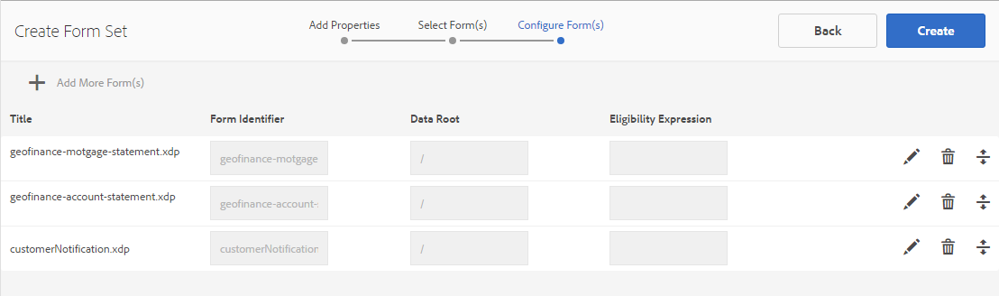

# Conjunto de formularios en AEM Forms{#form-set-in-aem-forms}

## Información general {#overview}

A menudo se requiere que los clientes envíen varios formularios para solicitar un servicio o beneficio. Requiere encontrar todas las formas pertinentes; y rellénelas, envíelas y realice un seguimiento por separado. Además, es necesario que rellenen los detalles comunes varias veces en los formularios. Todo el proceso resulta engorroso y propenso a errores si implica un gran número de formularios. La función de conjuntos de formularios de AEM Forms puede ayudar a simplificar la experiencia del usuario en estos casos.

Un conjunto de formularios es una colección de formularios HTML5 agrupados y presentados como un único conjunto de formularios para los usuarios finales. Cuando los usuarios finales empiezan a rellenar un conjunto de formularios, se realizan transiciones sin problemas de un formulario a otro. Al final, pueden enviar todos los formularios con un solo clic.

AEM Forms proporciona a los autores de formularios una interfaz de usuario intuitiva para crear, configurar y administrar conjuntos de formularios. Como autor, puede ordenar los formularios en una secuencia concreta que desee que sigan los usuarios finales. Además, se pueden aplicar condiciones o expresiones de idoneidad en formularios individuales para controlar su visibilidad en función de las entradas del usuario. Por ejemplo, puede configurar el formulario de detalles del cónyuge para que aparezca únicamente cuando el estado civil especifique como Casado.

Además, puede configurar campos comunes en distintos formularios para compartir enlaces de datos comunes. Con los enlaces de datos adecuados en su lugar, los usuarios finales deben rellenar la información común solo una vez que se rellene automáticamente en los formularios siguientes.

Los conjuntos de formularios también se admiten en la aplicación de AEM Forms, lo que permite que el personal de campo tenga un conjunto de formularios sin conexión, visite clientes, introduzca datos y sincronice posteriormente con el servidor de AEM Forms para enviar datos de formulario a procesos empresariales.

## Creación y administración del conjunto de formularios {#creating-and-managing-form-set}

Puede asociar varios XDP o plantillas de formulario, creados con Designer, a un conjunto de formularios. Los conjuntos de formularios se pueden utilizar para procesar de forma selectiva los XDP en función de los valores introducidos por los usuarios en los formularios iniciales y sus perfiles.

Utilice la [interfaz de usuario de AEM Forms](../../forms/using/introduction-managing-forms.md) para administrar todos los formularios, conjuntos de formularios y recursos relacionados.

### Crear un conjunto de formularios {#create-a-form-set}

Para crear un conjunto de formularios, haga lo siguiente:

1. Seleccione Forms > Forms y documentos.
1. Seleccione Crear > Conjunto de formularios.

1. En la página Agregar propiedades , añada los siguientes detalles y haga clic en Siguiente.

   * Título: Especifica el título del documento. El título le ayuda a identificar el conjunto de formularios en la interfaz de usuario de AEM Forms.
   * Descripción: Especifica la información detallada sobre el documento.
   * Etiquetas: Especifica etiquetas para identificar el conjunto de formularios de forma única. Las etiquetas ayudan a buscar en el conjunto de formularios. Para crear etiquetas, escriba nuevos nombres de etiquetas en el cuadro Etiquetas.
   * Enviar URL: Especifica la URL donde se registran los datos enviados para el caso de representación independiente del conjunto de formularios (caso de uso de aplicación que no es de AEM Forms). Se envían datos a este extremo como multipart/formdata con el siguiente parámetro de solicitud:
   * dataXML: Este parámetro contiene una representación XML de los datos de conjuntos de formularios enviados. Si todos los formularios del conjunto de formularios utilizan un esquema común, el XML se genera según ese esquema. De lo contrario, la etiqueta raíz XML contiene una etiqueta secundaria para cada formulario rellenado en el conjunto de formularios que contiene datos para los archivos adjuntos del formulario.
   * formsetPath: Ruta del conjunto de formularios en CRXDE, que se ha enviado.
   * Perfil de procesamiento HTML: Se pueden configurar determinadas opciones, como campos flotantes, archivos adjuntos y compatibilidad con borradores (para la representación de conjuntos de formularios independientes), a fin de personalizar el aspecto, el comportamiento y las interacciones del conjunto de formularios. Puede personalizar o ampliar el perfil existente para cambiar cualquier configuración del perfil del formulario HTML.

   

1. La pantalla Seleccionar formularios muestra los formularios XDP o archivos XDP disponibles. Busque y seleccione los formularios que desea incluir en el conjunto de formularios y, a continuación, haga clic en Agregar al conjunto de formularios. Si es necesario, busque de nuevo los formularios que desea agregar. Después de agregar todos los formularios al conjunto de formularios, haga clic en Siguiente.

   >[!NOTE]
   >
   >Asegúrese de que los nombres de campo de los formularios XDP no contienen el carácter de punto. De lo contrario, las secuencias de comandos que intenten resolver los campos con caracteres de punto no podrán resolverlos.

1. En la página Configurar formularios , puede hacer lo siguiente:

   * Orden del formulario: Arrastre y suelte los formularios para reordenarlos. El orden del formulario define el orden en que se muestran los formularios al usuario final en la aplicación de AEM Forms y en la representación independiente.
   * Identificador de formulario: Especifica una identidad única para los formularios que se van a utilizar en las expresiones de idoneidad.
   * Raíz de datos: Para cada formulario del conjunto de formularios, Author puede configurar el XPATH donde los datos de ese formulario en particular se colocan en el XML enviado. El valor predeterminado es /. Si todos los formularios del conjunto de formularios están enlazados a un esquema y comparten el mismo esquema XML, puede cambiar este valor. Se recomienda que cada campo del formulario tenga el enlace de datos adecuado especificado en el XDP. Si dos campos de dos formularios diferentes comparten el enlace de datos común, el campo del segundo formulario muestra los valores rellenados previamente del primer formulario. No enlace dos subformularios con el mismo contenido interno al mismo nodo XML. Para obtener más información sobre la estructura XML del conjunto de formularios, consulte [Relleno previo de XML para el conjunto de formularios](../../forms/using/formset-in-aem-forms.md#p-prefill-xml-for-form-set-p).
   * Expresión de elegibilidad: Especifica una expresión de JavaScript que evalúa un valor booleano e indica si un formulario en conjunto de formularios es apto para rellenarse. Si es false, no se pregunta al usuario ni se le muestra el formulario que se va a rellenar. Normalmente, la expresión se basa en los valores de los campos capturados antes de este formulario. Las expresiones también contienen llamadas a la API fs.valueOf del conjunto de formularios para extraer los valores rellenados por el usuario en un campo de un formulario del conjunto de formularios:

   *fs.valueOf(&lt;form Identifier=&quot;&quot;>,  &lt;fieldsom expression=&quot;&quot;>) >  &lt;value>*

   Por ejemplo, si tiene dos formularios en el conjunto de formularios: gastos de negocios y viajes, puede agregar un fragmento de JavaScript en el campo Expresión de idoneidad para ambos formularios para comprobar los datos introducidos por el usuario para el tipo de gasto de un formulario. Si el usuario elige Gastos comerciales, el formulario Gastos comerciales se procesa para el usuario final. O si el usuario elige el gasto de viaje, se procesa un formulario diferente para el usuario final. Para obtener más información, consulte Expresión de idoneidad.

   Además, el Autor también puede quitar un formulario del conjunto de formularios utilizando el icono Eliminar presente en la esquina derecha de cada fila o agregar otro conjunto de formularios utilizando el icono &#39;**+**&#39; de la barra de herramientas. Este icono &quot;**+**&quot; dirige al usuario de nuevo al paso anterior del asistente, que se utilizó para &quot;Seleccionar formularios&quot;. Las selecciones existentes se mantienen y cualquier selección adicional realizada se debe agregar al conjunto de formularios utilizando el icono Agregar a conjunto de formularios en esa página.

   

   >[!NOTE]
   >
   >La interfaz de usuario de AEM Forms administra todos los formularios que se utilizan en el conjunto de formularios.

### Administración de un conjunto de formularios {#managing-a-form-set}

Una vez creado un conjunto de formularios, puede realizar las siguientes acciones en ese conjunto de formularios:

* Un solo clic: Cuando el conjunto de formularios se crea y aparece en la página de recursos principal, puede hacer clic en el conjunto de formularios para verlo. Un conjunto de formularios se abre y muestra todas las plantillas de formulario (XDP) de ese conjunto de formularios.
* Editar: Al hacer clic en Editar después de seleccionar un conjunto de formularios, se abre la pantalla Configurar formulario que se muestra arriba en Pasos para crear un conjunto de formularios. Puede realizar todas las funcionalidades que se describen en este punto.
* Copiar + Pegar: Esto le permite copiar todo el conjunto de formularios desde una ubicación y pegarlo en la misma ubicación o en cualquier otra carpeta.
* Descargar: Puede descargar el conjunto de formularios con todas sus dependencias.
* Iniciar/Administrar revisión: Una vez creado el conjunto de formularios, puede configurar su revisión haciendo clic en Iniciar revisión. Una vez iniciada la revisión de un conjunto de formularios, la opción Administrar revisión se muestra al usuario. En la pantalla Administrar revisión, puede actualizar o finalizar la revisión. Para las revisiones que agregó, puede comprobar la revisión y agregar comentarios, si es necesario.
* Eliminar: Elimina el conjunto de formularios completo. Los formularios del conjunto de formularios eliminado permanecen en el repositorio.
* Publicar/Cancelar la publicación: Esto publica o cancela la publicación del conjunto de formularios junto con todos los formularios que contiene y los recursos relacionados de estos formularios.
* Vista previa: La vista previa ofrece dos opciones: Vista previa como HTML (sin datos) y vista previa personalizada con datos de ejemplo.
* Ver/editar propiedades: Puede ver o editar las propiedades de metadatos de un conjunto de formularios seleccionado.


### Editar un conjunto de formularios {#edit-a-form-set}

Para editar un conjunto de formularios, haga lo siguiente:

1. Seleccione Forms > Forms y documentos.
1. Busque el conjunto de formularios que desea editar. Pase el ratón sobre ella y seleccione Editar ( ).
1. En la página Configurar formularios , puede editar lo siguiente:

   * Orden del formulario
   * Formulario  Identificador
   * Raíz de datos
   * Expresión de elegibilidad

   También puede hacer clic en el icono Eliminar correspondiente para eliminar el formulario del conjunto de formularios.

## Conjunto de formularios en Administración de procesos {#form-set-in-process-management}

Una vez que haya creado un conjunto de formularios utilizando la interfaz de usuario de Administración de AEM Forms, puede utilizar el conjunto de formularios en una actividad de Punto de inicio o Asignar tarea mediante Workbench.

### Uso del conjunto de formularios en Task o Start point {#using-form-set-in-task-or-start-point}

1. Al diseñar un proceso, en la sección Presentación y datos de Asignar tarea/punto de inicio, seleccione **usar un recurso CRX**. Aparece el explorador de recursos CRX.

   

1. Seleccione el conjunto de formularios para filtrar el conjunto de formularios en AEM repositorio (CRX).

   

1. Selecciona un conjunto de formularios y hace clic en Aceptar.

## Expresiones de elegibilidad {#eligibility-expressions}

Las expresiones de idoneidad de un conjunto de formularios se utilizan para definir y controlar dinámicamente los formularios que se muestran a un usuario. Por ejemplo, para mostrar un formulario concreto solo si el usuario pertenece a un grupo de edad concreto. Especifique y edite una expresión de idoneidad mediante el administrador de formularios.

Una expresión de idoneidad puede ser cualquier instrucción de JavaScript válida que devuelva un valor booleano. La última instrucción del fragmento de código JavaScript se trata como un valor booleano que determina la idoneidad del formulario en función del procesamiento en el resto (líneas anteriores) del fragmento de código JavaScript. Si el valor de la expresión es true, el formulario puede mostrarse al usuario. Estos formularios se conocen como formularios aptos.

>[!NOTE]
>
>No se ejecuta la expresión de idoneidad para el primer formulario del conjunto de formularios. El primer formulario siempre se muestra independientemente de su expresión de idoneidad.

Además de las funciones estándar de JavaScript, el conjunto de formularios también expone la API fs.valueOf que proporciona acceso al valor de un campo de un formulario en un conjunto de formularios. Utilice esta API para acceder al valor de un campo de formulario en un conjunto de formularios. La sintaxis de la API es fs.valueOf (formUid, fieldSOM), donde:

* formUid (cadena): ID exclusivo de un formulario en el conjunto de formularios. Puede especificarlo al crear el conjunto de formularios en la interfaz de usuario del administrador de formularios. De forma predeterminada, es el nombre del formulario.
* fieldSOM (cadena): Expresión SOM del campo en el formulario especificado por formUid. La expresión SOM o la expresión Modelo de objetos de secuencia de comandos se utilizan para hacer referencia a valores, propiedades y métodos dentro de un modelo de objetos de documento (DOM) concreto. Puede verlo en el Diseñador de formularios en la ficha Secuencias de comandos mientras el campo está seleccionado.

>[!NOTE]
>
>Los parámetros formUid y fieldSOM deben ser literales de cadena.

### Ejemplos {#examples}

Uso válido de la API:

`fs.valueOf("form1", "xfa.form.form1.subform1.field1")`

Uso no válido de la API:

```javascript
var formUid = "form1";
 var fieldSOM = “xfa.form.form1.subform1.field1"; fs.valueOf(formUid, fieldSOM);
```

## Rellenar previamente XML para el conjunto de formularios {#prefill-xml-for-form-set}

El conjunto de formularios es una colección de varios formularios HTML5 que tienen esquemas comunes o diferentes. El conjunto de formularios admite la cumplimentación previa de campos de formulario mediante un archivo XML. Puede asociar un archivo XML con un conjunto de formularios, de modo que al abrir un formulario en el conjunto de formularios, algunos de los campos del formulario se precalculen.

El archivo XML de relleno previo se especifica utilizando el parámetro dataRef de la dirección URL del conjunto de formularios. El parámetro dataRef especifica la ruta absoluta del archivo XML de datos que se combina con el conjunto de formularios.

Por ejemplo, tiene tres formularios (formulario1, formulario2 y formulario3), en el conjunto de formularios con la siguiente estructura:

form1

field
form1field

form2

field
form2field

form3

field
form3field

Cada formulario tiene un campo con nombre común, denominado &quot;campo&quot; y un campo con nombre único denominado &quot;campo de formulario&lt;i>&quot;.

Puede rellenar previamente este conjunto de formularios utilizando un XML con la siguiente estructura:

```xml
<?xml version="1.0" encoding="UTF-8" ?>
<formSetRootTag>
 <field>common field value</field>
 <form1field>value1</form1field>
 <form2field>value2</form2field>
 <form3field>value3</form3field>
</formSetRootTag>
```

>[!NOTE]
>
>La etiqueta raíz XML puede tener cualquier nombre, pero las etiquetas de elemento correspondientes a los campos deben tener el mismo nombre que el campo. La jerarquía del XML debe imitar la jerarquía del formulario, lo que significa que el XML debe tener las etiquetas correspondientes para ajustar subformularios.

El fragmento XML anterior muestra que el XML de relleno previo para el conjunto de formularios es una unión de los fragmentos XML de relleno previo de los formularios individuales. Si ciertos campos de los diferentes formularios tienen una jerarquía/esquema de datos similar entre sí, los campos se rellenan previamente con los mismos valores. En este ejemplo, los tres formularios se rellenan previamente con el mismo valor para el campo común, &quot;field&quot;. Esta es una forma sencilla de reenviar los datos de un formulario al siguiente. Esto también se puede lograr enlazando los campos al mismo esquema o referencia de datos. Si desea separar los datos del conjunto de formularios en función del esquema de los formularios. Esto se puede lograr especificando el atributo &quot;raíz de datos&quot; del formulario durante la creación del conjunto de formularios (el valor predeterminado es &quot;/&quot;, que se asigna a la etiqueta raíz del conjunto de formularios).

En el ejemplo anterior, si especifica las raíces de los datos: &quot;/form1&quot;, &quot;/form2&quot; y &quot;/form3&quot; respectivamente para los tres formularios, debe utilizar un XML de relleno previo de la siguiente estructura:

```xml
<?xml version="1.0" encoding="UTF-8" ?>
<formSetRootTag>
 <form1>
  <field>field value1</field>
  <form1field>value1</form1field>
 </form1>
 <form2>
  <field>field value2</field>
  <form2field>value2</form2field>
 </form2>
 <form3>
  <field>field value3</field>
  <form3field>value3</form3field>
 </form3>
</formSetRootTag>
```

En un conjunto de formularios, el XML definió un esquema XML con la siguiente sintaxis:

```xml
<formset>
 <fs_data>
  <xdp:xdp xmlns:xdp="https://ns.adobe.com/xdp/">
  <xfa:datasets xmlns:xfa="https://www.xfa.org/schema/xfa-data/1.0/">
   <xfa:data>
   <rootElement>
    ... data ....
   </rootElement>
   </xfa:data>
  </xfa:datasets>
  </xdp:xdp>
 </fs_data>
 <fs_draft>
  ... private data...
 </fs_draft>
</formset>
```

>[!NOTE]
>
>Si hay dos formularios con orígenes de datos superpuestos, o si la jerarquía de elementos de un formulario se superpone con la jerarquía raíz de datos de otro formulario, en el xml de relleno previo, se combinan los valores de los elementos superpuestos. El XML de envío tiene una estructura similar a la del XML de relleno previo, pero el XML de envío tiene más etiquetas envolventes y algunas etiquetas de datos de contexto de conjunto de formularios anexadas al final.

### Descripción de elementos XML de relleno previo {#prefill-xml-elements-description}

Reglas de sintaxis para crear un archivo XML de relleno previo:

* elementos principales: elemento(s) que puede ser su principal, donde null indica que el elemento puede estar en la raíz del XML.
* cardinalidad: representa el número de veces que el elemento se puede usar dentro de su elemento principal.
* submitXML: indica si el elemento siempre está presente (P) u opcional (O) en el XML de envío.
* prefillXML: indica si el elemento es obligatorio(R) u opcional(O) en el XML de relleno previo.
* niños: indica qué elementos pueden ser sus elementos secundarios.

### FORMSET {#formset}

`parent elements:`

`null`

`cardinality: [0,1]`

`submitXML: P`

`prefillXML: O`

`children: fs_data`

El elemento raíz del conjunto de formularios XML. Se recomienda no utilizar esta palabra como nombre de rootSubform de ningún formulario del conjunto de formularios.

### FS_DATA {#fs-data}

`parent elements:`

`formset`

cardinalidad: [1]

submitXML: P

prefillXML: O

`children: xdp:xdp/rootElement`

El subárbol indica los datos de los formularios del conjunto de formularios. El elemento es opcional en el XML de relleno previo solo si el elemento del conjunto de formularios no está presente

### XDP:XDP {#xdp-xdp}

`parent elements: fs_data/null`

`cardinality: [0,1]`

`submitXML: O`

`prefillXML: O`

`children: xfa:datasets`

Esta etiqueta indica el inicio de HTML5 Form XML. Se añade en el XML de envío si está presente en el XML de relleno previo o si no hay ningún XML de relleno previo. Esta etiqueta se puede eliminar del XML de relleno previo.

### XFA:CONJUNTOS DE DATOS {#xfa-datasets}

`parent elements: xdp:xdp`

`cardinality: [1]`

`submitXML: O`

`prefillXML: O`

`children: xfa:data`

### XFA:DATA {#xfa-data}

`parent elements: xfa:datasets`

`cardinality: [1]`

`submitXML: O`

`prefillXML: O`

`children: rootElement`

### ROOTELEMENT {#rootelement}

`parent elements: xfa:datasets/fs_data/null`

`cardinality: [0,1]`

`submitXML: P`

`prefillXML: O`

`children: controlled by the Forms in Form set`

El nombre rootElement es solo un marcador de posición. El nombre real se selecciona de los formularios utilizados en el conjunto de formularios. El subárbol que comienza con rootElement contiene los datos de los campos y subformularios dentro de Forms en el conjunto de formularios. Existen múltiples factores que determinan la estructura de rootElement y sus elementos secundarios.

En el XML de relleno previo, esta etiqueta es opcional, pero si falta, se ignora todo el XML.

NOMBRE DE LA ETIQUETA ELEMENTO RAÍZ

Si hay un elemento raíz en el XML de relleno previo, el nombre de ese elemento también se toma en el XML de envío. En los casos en los que no hay un xml de prerelleno, el nombre del rootElement es el nombre del subformulario raíz del primer formulario del conjunto de formularios que tiene una propiedad dataRoot establecida en &quot;/&quot;. Si no hay tal formulario, el nombre de rootElement es **fs_voleameroot**, que es una palabra clave reservada.

## Conjunto de formularios en la aplicación de AEM Forms {#formset-in-workspace-app}

La aplicación de AEM Forms permite a los trabajadores de campo sincronizar sus dispositivos móviles con un servidor de AEM Forms y trabajar en sus tareas. La aplicación funciona incluso cuando el dispositivo está sin conexión al guardar datos localmente en el dispositivo. Mediante funciones de anotación, como fotografías, los trabajadores de campo pueden proporcionar información precisa para integrarla en los procesos empresariales.

<!-- Update link as it is a 404 - For more information on AEM Forms app, see [AEM Forms app overview](/help/forms/using/mobile-workspace-overview.md).-->

## Limitaciones conocidas: patrones no totalmente compatibles con el conjunto de formularios {#known-limitations-patterns-not-fully-supported-in-form-set}

Los siguientes patrones de datos no son totalmente compatibles con el conjunto de formularios:

<table>
 <tbody>
  <tr>
   <td><strong>Patrón no totalmente compatible con el conjunto de formularios</strong></td>
   <td><strong>Ejemplo</strong></td>
  </tr>
  <tr>
   <td>El tamaño de la entrada y el tamaño del patrón no coinciden</td>
   <td><p>When pattern= num{z,zzz}</p> <p>Y input=</p> <p>12.345 o</p> <p>1,23</p> </td>
  </tr>
  <tr>
   <td>Patrones de cláusula de imagen con corchetes "(" """)</td>
   <td>num{(zz,zzz)}</td>
  </tr>
  <tr>
   <td>Varios patrones de datos</td>
   <td>num{zz,zzz} | num{z,zzz,zzz}</td>
  </tr>
  <tr>
   <td>Patrones abreviados </td>
   <td><p>num.integer{},</p> <p>num.decimal{},</p> <p>num.percent{}, o</p> <p>num.currency{}</p> </td>
  </tr>
 </tbody>
</table>

