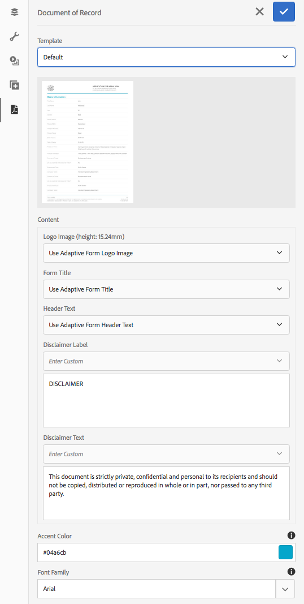
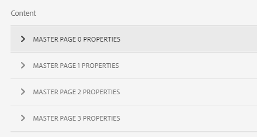

# Generar documento de registro para formularios adaptables{#generate-document-of-record-for-adaptive-forms}

## Información general {#overview}

Después de enviar un formulario, los clientes generalmente desean mantener un registro, impreso o en formato de documento, de la información que han rellenado en el formulario para su futura referencia. Esto se denomina documento de registro.

En este artículo se explica cómo generar un documento de registro para formularios adaptables.

>[!NOTE]
>
>La generación automática de documentos de registro no es compatible con formularios adaptables basados en XFA. Sin embargo, puede utilizar el XDP utilizado para crear el formulario adaptable como documento de registro.

## Tipos de formularios adaptables y sus documentos de registro {#adaptive-form-types-and-their-documents-of-record}

Al crear un formulario adaptable, puede seleccionar un modelo de formulario. Las opciones son:

* [Plantillas de ](../../forms/using/creating-adaptive-form.md#create-an-adaptive-form-based-on-an-xfa-form-template)
formularioPermite seleccionar una plantilla XFA para el formulario adaptable. Al seleccionar una plantilla XFA, puede utilizar el archivo XDP asociado para el documento de registro como se describe anteriormente.

* [XML ](../../forms/using/creating-adaptive-form.md#create-an-adaptive-form-based-on-xml-or-json-schema)
SchemaPermite seleccionar una definición de esquema XML para el formulario adaptable. Al seleccionar un esquema XML para el formulario adaptable, puede:

   * Asocie una plantilla XFA para el documento de registro. Asegúrese de que la plantilla XFA asociada utiliza el mismo esquema XML que el formulario adaptable
   * Generar automáticamente documento de registro

* Ninguna
Permite crear un formulario adaptable sin un modelo de formulario. El documento de registro se genera automáticamente para el formulario adaptable.

Cuando seleccione un modelo de formulario, configure el documento de registro mediante las opciones disponibles en Configuración de plantilla de documento de registro. Consulte [Configuración de plantilla de documento de registro](#document-of-record-template-configuration).

## Documento de registro generado automáticamente {#automatically-generated-document-of-record}

Un documento de registro permite a los clientes conservar una copia del formulario enviado para su impresión. Cuando se genera automáticamente un documento de registro, cada vez que se cambia el formulario, su documento de registro se actualiza inmediatamente. Por ejemplo, se elimina el campo de edad de los clientes que seleccionan Estados Unidos de América como país. Cuando estos clientes generan un documento de registro, el campo de edad no es visible para ellos en el documento de registro.

El documento de registro generado automáticamente tiene las siguientes ventajas:

* Se encarga del enlace de datos.
* Oculta automáticamente los campos marcados que se excluyen del documento de registro en el momento del envío. No se requiere esfuerzo adicional.
* Ahorra tiempo para diseñar una plantilla de documento de registro.
* Le permite probar diferentes estilos y apariencia utilizando diferentes plantillas base y elegir el mejor estilo y apariencia para el Documento de registro. Las apariencias de estilo son opcionales y, si no se especifica el estilo, los estilos del sistema se establecen de forma predeterminada.
* Garantiza que cualquier cambio en el formulario se refleje inmediatamente en el documento de registro.

## Componentes para generar automáticamente un documento de registro {#components-to-automatically-generate-a-document-of-record}

Para generar un documento de registro para formularios adaptables, se necesitan los siguientes componentes:

**Formulario** adaptableFormulario adaptable para el que se desea generar un documento de registro.

**Plantilla base (recomendada)** Plantilla XFA (archivo XDP) creada en AEM Designer. La plantilla base se utiliza para especificar la información de estilo y marca para la plantilla de documento de registro.

Consulte [Plantilla base de un documento de registro](#base-template-of-a-document-of-record)

>[!NOTE]
>
>La plantilla básica de un documento de registro también se denomina metamotrella de un documento de registro.

**Documento de** plantilla de registroPlantilla XFA (archivo XDP) generada a partir de un formulario adaptable.

Consulte [Configuración de plantilla de documento de registro](#document-of-record-template-configuration).

**Información de** datos de formulario rellenada por un usuario en el formulario adaptable. Se combina con la plantilla de documento de registro para generar el documento de registro.

## Asignación de elementos de formulario adaptables {#mapping-of-adaptive-form-elements}

Las siguientes secciones describen cómo aparecen los elementos de formulario adaptables en el documento de registro.

### Fields {#fields}

<table>
 <tbody>
  <tr>
   <th>Componente de formulario adaptable</th>
   <th>Componente XFA correspondiente</th>
   <th>¿Se incluye de forma predeterminada en la plantilla de documento de registro?</th>
   <th>Notas</th>
  </tr>
  <tr>
   <td>Botón</td>
   <td>Botón</td>
   <td>false</td>
   <td> </td>
  </tr>
  <tr>
   <td>Casilla de verificación</td>
   <td>Casilla de verificación</td>
   <td>verdadero</td>
   <td> </td>
  </tr>
  <tr>
   <td>Selector de fecha</td>
   <td>Campo de fecha y hora</td>
   <td>verdadero</td>
   <td> </td>
  </tr>
  <tr>
   <td>Lista desplegable</td>
   <td>Lista desplegable</td>
   <td>verdadero</td>
   <td> </td>
  </tr>
  <tr>
   <td>Firma a mano alzada</td>
   <td>Scribble de firma</td>
   <td>verdadero</td>
   <td> </td>
  </tr>
  <tr>
   <td>Cuadro numérico</td>
   <td>Campo numérico</td>
   <td>verdadero</td>
   <td> </td>
  </tr>
  <tr>
   <td>Cuadro de contraseña</td>
   <td>Campo de contraseña</td>
   <td>false</td>
   <td> </td>
  </tr>
  <tr>
   <td>Botón de opción</td>
   <td>Botón de opción</td>
   <td>verdadero</td>
   <td> </td>
  </tr>
  <tr>
   <td>Cuadro de texto</td>
   <td>Campo de texto</td>
   <td>verdadero</td>
   <td> </td>
  </tr>
  <tr>
   <td>Botón Restablecer</td>
   <td>Botón Restablecer</td>
   <td>false</td>
   <td> </td>
  </tr>
  <tr>
   <td>Botón Enviar</td>
   <td><p>Botón de envío por correo electrónico</p> <p>Botón Enviar HTTP</p> </td>
   <td>false</td>
   <td> </td>
  </tr>
  <tr>
   <td>Términos y condiciones</td>
   <td> </td>
   <td>verdadero</td>
   <td> </td>
  </tr>
  <tr>
   <td>Archivo adjunto</td>
   <td> </td>
   <td>false</td>
   <td>No disponible en la plantilla de documento de registro. Sólo disponible en documento de registro mediante archivos adjuntos.</td>
  </tr>
 </tbody>
</table>

### Contenedores {#containers}

<table>
 <tbody>
  <tr>
   <th>Componente de formulario adaptable</th>
   <th>Componente XFA correspondiente</th>
   <th>Notas</th>
  </tr>
  <tr>
   <td>Panel<br /> </td>
   <td>Subformulario<br /> </td>
   <td>El panel repetible se asigna a un subformulario repetible.</td>
  </tr>
 </tbody>
</table>

### Componentes estáticos {#static-components}

| Componente de formulario adaptable | Componente XFA correspondiente | Notas |
|---|---|---|
| Imagen | Imagen | Los componentes TextDraw e Image, tanto enlazados como no enlazados, siempre aparecen en el documento de registro de un formulario adaptable basado en XSD, a menos que se excluya mediante la configuración del documento de registro. |
| Texto | Texto |

>[!NOTE]
>
>En la IU clásica, se obtienen distintas pestañas para editar las propiedades de los campos.

### Tablas {#tables}

Los componentes de tabla de formularios adaptables, como encabezado, pie de página y asignación de filas, corresponden a los componentes XFA correspondientes. Puede asignar paneles repetibles a tablas en documento de registro.

## Plantilla base de un documento de registro {#base-template-of-a-document-of-record}

La plantilla base proporciona información de estilo y apariencia al documento de registro. Permite personalizar el aspecto predeterminado del documento de registro generado automáticamente. Por ejemplo, desea agregar el logotipo de su empresa en el encabezado y la información de copyright en el pie de página del documento de registro. La página de formato de la plantilla base se utiliza como página de formato para la plantilla de documento de registro. La página de formato puede tener información como encabezado de página, pie de página y número de página que se puede aplicar al documento de registro. Puede aplicar dicha información al documento de registro utilizando la plantilla base para la generación automática del documento de registro. El uso de una plantilla base permite cambiar las propiedades predeterminadas de los campos.

Siga [Convenciones de plantilla base](#base-template-conventions) cuando diseñe la plantilla base.

## Convenciones de plantilla base {#base-template-conventions}

Se utiliza una plantilla base para definir el encabezado, pie de página, estilo y apariencia de un documento de registro. El encabezado y pie de página pueden incluir información como el logotipo de la empresa y el texto de copyright. La primera página de formato de la plantilla base se copia y se utiliza como página de formato para el documento de registro, que contiene el encabezado, pie de página, número de página o cualquier otra información que deba aparecer en todas las páginas del documento de registro. Si utiliza una plantilla base que no se ajuste a las convenciones de plantilla base, la primera página de formato de la plantilla base se utilizará en la plantilla de documento de registro. Se recomienda encarecidamente que diseñe la plantilla base según sus convenciones y que la utilice para generar automáticamente el documento de registro.

**Convenciones de la página de formato**

* En la plantilla base, debe nombrar el subformulario raíz como `AF_METATEMPLATE` y la página de formato como `AF_MASTERPAGE`.

* La página de formato con el nombre `AF_MASTERPAGE` ubicado bajo el subformulario raíz `AF_METATEMPLATE` tiene preferencia para extraer información de encabezado, pie de página y estilo.

* Si `AF_MASTERPAGE` está ausente, se utiliza la primera página de formato presente en la plantilla base.

**Convenciones de estilo para campos**

* Para aplicar estilo en los campos del documento de registro, la plantilla base proporciona campos ubicados en el subformulario `AF_FIELDSSUBFORM` debajo del subformulario `AF_METATEMPLATE` raíz.

* Las propiedades de estos campos se aplican a los campos del documento de registro. Estos campos deben seguir la convención de nomenclatura `AF_<name of field in all caps>_XFO`. Por ejemplo, el nombre de campo de la casilla de verificación debe ser `AF_CHECKBOX_XFO`.

Para crear una plantilla base, haga lo siguiente en AEM Designer.

1. Haga clic en **Archivo > Nuevo**.
1. Seleccione la opción **Basado en una plantilla**.

1. Seleccione la categoría **Forms - Documento de registro**.
1. Seleccione **Plantilla base DoR**.
1. Haga clic en **Next** y proporcione la información requerida.

1. (Opcional) Modifique el estilo y el aspecto de los campos que desea aplicar en los campos del documento de registro.
1. Guarde el formulario.

Ahora puede utilizar el formulario guardado como plantilla base para el documento de registro.
No modifique ni elimine ninguna secuencia de comandos presente en la plantilla base.

**Modificación de la plantilla base**

* Si no aplica ningún estilo a los campos de la plantilla base, es aconsejable eliminar esos campos de la plantilla base para que todas las actualizaciones a la plantilla base se recojan automáticamente.
* Al modificar la plantilla base, no elimine, agregue ni modifique secuencias de comandos.

>[!NOTE]
>
>Diseñe una plantilla base utilizando convenciones y siguiendo estrictamente los pasos anteriores.

## Configuración del documento de plantilla de registro {#document-of-record-template-configuration}

Configure la plantilla de documento de registro del formulario para que sus clientes puedan descargar una copia del formulario enviado que sea fácil de imprimir. Un archivo XDP sirve como documento de la plantilla de registro. El documento de la descarga de los clientes de registro tiene un formato de acuerdo con el diseño especificado en el archivo XDP.

Realice los siguientes pasos para configurar un documento de registro para formularios adaptables:

1. En AEM instancia de autor, haga clic en **Forms > Forms y documentos.**
1. Seleccione un formulario y haga clic en **Ver propiedades**.
1. En la ventana Propiedades, pulse **Modelo de formulario**.
También puede seleccionar un modelo de formulario al crear un formulario.

   >[!NOTE]
   >
   >En la ficha Modelo de formulario, asegúrese de seleccionar **Esquema** o **Ninguno** en la lista desplegable **Seleccionar de**. **[!UICONTROL El documento de registro no es compatible con los formularios adaptables o basados en XFA con la plantilla de formulario como modelo de formulario.]**

1. En la sección Configuración de plantilla de documento de registro de la ficha Modelo de formulario, seleccione una de las siguientes opciones.

   **** NingunoSeleccione esta opción si no desea configurar el documento de registro para el formulario.

   **Asociar plantilla de formulario como** plantilla de documento de registroSeleccione esta opción si tiene un archivo XDP que desee utilizar como plantilla para el documento de registro. Al seleccionar esta opción, se muestran todos los archivos XDP disponibles en el repositorio de AEM Forms. Seleccione el archivo correspondiente.

   El archivo XDP seleccionado se asocia con el formulario adaptable.

   **Generar documento de** registroSeleccione esta opción para utilizar un archivo XDP como plantilla base para definir el estilo y el aspecto del documento de registro. Al seleccionar esta opción, se muestran todos los archivos XDP disponibles en el repositorio de AEM Forms. Seleccione el archivo correspondiente.

   >[!NOTE]
   >
   >Asegúrese de que el esquema utilizado para crear un formulario adaptable y un esquema (esquema de datos) del formulario XFA sea el mismo si:
   >
   >
   >
   >    * El formulario adaptable se basa en esquemas
   >    * Está utilizando la opción **Asociar plantilla de formulario como documento de plantilla de registro** para el documento de registro


1. Haga clic en **Listo.**

## Personalización de la información de marca en el documento de registro {#customize-the-branding-information-in-document-of-record}

Durante la generación de un documento de registro, puede cambiar la información de marca del documento de registro en la ficha Documento de registro. La ficha Documento de registro incluye opciones como logotipo, apariencia, diseño, encabezado y pie de página, renuncia de responsabilidad y si desea incluir o no las opciones de casillas de verificación y botones de opción no seleccionadas.

Para localizar la información de marca que introduce en la ficha Documento de registro, debe asegurarse de que la configuración regional del explorador esté correctamente configurada. Para personalizar la información de marca del documento de registro, complete los siguientes pasos:

1. Seleccione un panel (panel raíz) en el documento de registro y, a continuación, pulse .
1. Toque . Aparecerá la ficha Documento de registro.
1. Seleccione la plantilla predeterminada o una plantilla personalizada para procesar el documento de registro. Si selecciona la plantilla predeterminada, aparece una vista previa en miniatura del documento de registro debajo de la lista desplegable Plantilla.

   

   Si elige seleccionar una plantilla personalizada, busque y seleccione un XDP en el servidor de AEM Forms. Si desea utilizar una plantilla que no esté ya en el servidor de AEM Forms, primero debe cargar el XDP en el servidor de AEM Forms.

1. En función de si selecciona una plantilla predeterminada o personalizada, algunas o todas las propiedades siguientes aparecen en la ficha Documento de registro. Especifíquelos correctamente:

   * **Imagen** del logotipo: Puede elegir usar la imagen del logotipo desde el formulario adaptable, elegir una de DAM o cargar una desde el equipo.
   * **Título del formulario**
   * **Texto de encabezado**
   * **Etiqueta de la exención de responsabilidad**
   * **Exención de responsabilidad**
   * **Texto de la exención de responsabilidad**
   * **Color** de énfasis: El color en el que se representan las líneas del texto del encabezado y del separador en el documento o registro del PDF
   * **Familia** de fuentes: Familia de fuentes del texto del documento de registro PDF
   * **Para los componentes Casilla de verificación y Botón de radio , muestre solo los valores seleccionados**
   * **Separador para varios valores seleccionados**
   * **Incluir objetos de formulario que no estén enlazados al modelo de datos**
   * **Excluir campos ocultos del documento de registro**
   * **Ocultar descripción de paneles**

   Si la plantilla XDP personalizada que seleccione incluye varias páginas de formato, las propiedades de esas páginas aparecen en la sección **[!UICONTROL content]** de la ficha **[!UICONTROL Documento de registro]**.

   

   Las propiedades de la página de formato incluyen Imagen de logotipo, Texto de encabezado, Título del formulario, Etiqueta de exención de responsabilidad y Texto de exención de responsabilidad. Puede aplicar propiedades de formulario adaptables o de plantilla XDP al documento de registro. AEM Forms aplica las propiedades de la plantilla al documento de registro de forma predeterminada. También puede definir valores personalizados para las propiedades de la página de formato. Para obtener información sobre cómo aplicar varias páginas de formato en un documento de registro, consulte [Aplicación de varias páginas de formato a un documento de registro](#apply-multiple-master-pages-dor).

   >[!NOTE]
   >
   >Si utiliza una plantilla de formulario adaptable creada con una versión de Designer anterior a la 6.3 para que funcionen las propiedades Color de acento y Familia de fuentes, asegúrese de que lo siguiente está presente en la plantilla de formulario adaptable en el subformulario raíz:

   ```xml
   <proto>
   <font typeface="Arial"/>
   <fill>
   <color value="4,166,203"/>
   </fill>
   <edge>
   <color value="4,166,203"/>
   </edge>
   </proto>
   ```

1. Para guardar los cambios de marca, pulse Listo.

## Presentaciones de tablas y columnas para paneles del Documento de registro {#table-and-column-layouts-for-panels-in-document-of-record}

El formulario adaptable puede ser largo y tener varios campos de formulario. Es posible que no desee guardar un documento de registro como una copia exacta del formulario adaptable. Ahora puede elegir un diseño de tabla o columna para guardar uno o más paneles de formulario adaptables en el documento de PDF de registro.

Antes de generar un documento de registro, en la configuración de un panel, seleccione Presentación del documento de registro para ese panel como Tabla o Columna. Los campos del panel se organizan en consecuencia en el documento de registro.


Campos de un panel procesado en una presentación de tabla en el documento de registro


Campos de un panel procesado en una presentación de columna del documento de registro

## Configuración del documento de registro {#document-of-record-settings}

La configuración del documento de registro permite elegir las opciones que desea incluir en el documento de registro. Por ejemplo, un banco acepta el nombre, la edad, el número de la seguridad social y el número de teléfono en un formulario. El formulario genera un número de cuenta bancaria y detalles de sucursal. Puede elegir mostrar únicamente el nombre, el número de la seguridad social, la cuenta bancaria y los detalles de sucursal en el documento de registro.

El documento de configuración de registro de un componente está disponible en sus propiedades. Para acceder a las propiedades de un componente, seleccione el componente y haga clic en  en la superposición. Las propiedades se enumeran en la barra lateral y puede encontrar la siguiente configuración en ella.

**Configuración del nivel de campo**

* **Excluir Del Documento De Registro**: Si se establece la propiedad true, se excluye el campo del documento de registro. Esta es una propiedad con script denominada `excludeFromDoR`. Su comportamiento depende de la propiedad **Exclude fields from DoR if hidden** form level.

* **Mostrar panel como tabla:** al establecer la propiedad, se muestra el panel como tabla en el documento de registro si el panel tiene menos de 6 campos. Aplicable solo para panel.
* **Excluir título del documento de registro:** al establecer la propiedad se excluye el título del panel o tabla del documento de registro. Aplicable solo para panel y tabla.
* **Excluir descripción del documento de registro:** al establecer la propiedad, se excluye la descripción del panel/tabla del documento de registro. Aplicable solo para panel y tabla.
* **[!UICONTROL Paginación]**  >  **[!UICONTROL Lugar]**: Determina dónde se selecciona para colocar el panel.
   * **[!UICONTROL Colocar]**  >  **[!UICONTROL Siguiente]**: Coloca el panel después del objeto anterior en el panel principal.
   * **[!UICONTROL Lugar]**  >  **[!UICONTROL En el área]**  de contenido > Nombre del área de contenido: Coloca el panel en el área de contenido especificada.
   * **[!UICONTROL Colocar]**  >  **[!UICONTROL Principio de la siguiente área]** de contenido: Coloca el panel en la parte superior de la siguiente área de contenido.
   * **[!UICONTROL Lugar]**  >  **[!UICONTROL Principio del área]**  de contenido > Nombre del área de contenido: Coloca el panel en la parte superior del área de contenido especificada.
   * **[!UICONTROL Colocar]**  >  **[!UICONTROL En la página]**  > Nombre de la página de formato: Coloca el panel en la página especificada. Si un salto de página no se inserta automáticamente, [!DNL AEM Forms] añade un salto de página.
   * **[!UICONTROL Lugar]**  >  **[!UICONTROL Principio de la página]** siguiente: Coloca el panel al principio de la siguiente página. Si un salto de página no se inserta automáticamente, [!DNL AEM Forms] añade un salto de página.
   * **[!UICONTROL Lugar]**  >  **[!UICONTROL Principio de la página]**  > Nombre de la página de formato: Coloca el panel al principio de la página, cuando se representa la página especificada. Si un salto de página no se inserta automáticamente, [!DNL AEM Forms] añade un salto de página.
* **[!UICONTROL Paginación]**  >  **[!UICONTROL Después]**: Determina qué área se rellenará después de colocar un panel. Los siguientes campos están disponibles en la  **** sección posterior:
   * **[!UICONTROL Después]**  >  **[!UICONTROL Continuar relleno principal]**: Continúa combinando los datos de todos los objetos que quedan por rellenar en el panel principal.
   * **[!UICONTROL Después]**  >  **[!UICONTROL Ir al área]** de contenido siguiente: Comienza a rellenar la siguiente área de contenido después de colocar el panel.
   * **[!UICONTROL Después]**  >  **[!UICONTROL Ir al área]**  de contenido > Nombre del área de contenido: Comienza a rellenar el área de contenido especificada después de colocar el panel.
   * **[!UICONTROL Después]**  >  **[!UICONTROL Ir a la página]** siguiente: Comienza a rellenar la página siguiente después de colocar el panel.
   * **[!UICONTROL Después]**  >  **[!UICONTROL Ir a la página]**  > Nombre de la página: Comienza a rellenar la página especificada después de colocar el panel.
* **[!UICONTROL Paginación]**  >  **[!UICONTROL Desbordamiento]**: Define un desbordamiento para un panel o una tabla que ocupa páginas. Los siguientes campos están disponibles en la sección **[!UICONTROL Overflow]**:
   * **[!UICONTROL Desbordamiento]**  >  **[!UICONTROL Ninguno]**: Comienza a rellenar la página siguiente. Si un salto de página no se inserta automáticamente, [!DNL AEM Forms] añade un salto de página.
   * **[!UICONTROL Desbordamiento]**  >  **[!UICONTROL Ir al área]**  de contenido > Nombre del área de contenido: Comienza a rellenar el área de contenido especificada.
   * **[!UICONTROL Desbordamiento]**  >  **[!UICONTROL Ir a la página]**  > Nombre de la página: Comienza a rellenar la página especificada.

Para obtener información sobre cómo aplicar saltos de página y aplicar varias páginas de formato en un documento de registro, consulte [Aplicar salto de página en un documento de registro](#apply-page-breaks-in-dor) y [Aplicar varias páginas de formato a un documento de registro](#apply-multiple-master-pages-dor).

**Configuración del nivel de formulario**

* **Incluir campos no enlazados en DoR:** la configuración de la propiedad incluye campos no enlazados del formulario adaptable basado en esquema en el documento de registro. De forma predeterminada, es true.
* **Excluir campos de DoR si está oculto:** al establecer la propiedad se anula el comportamiento de la propiedad de nivel de campo &quot;Excluir del documento de registro&quot; cuando no es verdadero. Si los campos están ocultos en el momento del envío del formulario, se excluirán del documento de registro si la propiedad está establecida en true, siempre que la propiedad &quot;Excluir del documento de registro&quot; no esté establecida.

## Aplicar un salto de página en un documento de registro {#apply-page-breaks-in-dor}

Puede aplicar saltos de página en un documento de registro utilizando varios métodos.

Para aplicar un salto de página a un documento de registro:

1. Pulse el panel y seleccione .

1. Expanda **[!UICONTROL Documento de registro]** para ver las propiedades.

1. En la sección **[!UICONTROL Paginación]**, pulse  en el campo **[!UICONTROL Colocar]**.
1. Pulse **[!UICONTROL Principio de la página siguiente]** y pulse **[!UICONTROL Seleccionar]**. También puede pulsar **[!UICONTROL Principio de la página]**, seleccionar la página de formato y pulsar **[!UICONTROL Seleccionar]** para aplicar el salto de página.
1. Toque  para guardar las propiedades.

El panel seleccionado se mueve a la página siguiente.

## Aplicar varias páginas de formato a un documento de registro {#apply-multiple-master-pages-dor}

Si la plantilla XDP personalizada que seleccione incluye varias páginas de formato, las propiedades de esas páginas aparecen en la sección [!UICONTROL content] de la ficha [!UICONTROL Documento de registro]. Para obtener más información, consulte [Personalización de la información de marca en el documento de registro](#customize-the-branding-information-in-document-of-record).

Puede aplicar varias páginas de formato a un documento de registro aplicando diferentes páginas de formato a los componentes de un formulario adaptable. Utilice la sección [Paginación](#document-of-record-settings) de las propiedades Documento de registro para aplicar varias páginas de formato.

A continuación se muestra un ejemplo de cómo aplicar varias páginas de formato a un documento de registro:
Se carga una plantilla XDP que incluye cuatro páginas de formato en el servidor [!DNL AEM Forms]. [!DNL AEM Forms] aplica las propiedades de la plantilla al documento de registro de forma predeterminada. [!DNL AEM Forms] también aplica las primeras propiedades de página de formato de la plantilla al documento de registro.

Para aplicar las propiedades de la segunda página de formato a un panel y las propiedades de la tercera página de formato a los paneles siguientes, ejecute los pasos siguientes:

1. Pulse el panel para aplicar la segunda página de formato y seleccione .
1. En la sección **[!UICONTROL Paginación]**, pulse  en el campo **[!UICONTROL Colocar]**.
1. Toque **[!UICONTROL En la página]**, seleccione la segunda página de formato y pulse **[!UICONTROL Seleccionar]**.
AEM Forms aplica la segunda página de formato al panel y a todos los paneles posteriores del formulario adaptable.
1. En la sección **[!UICONTROL Paginación]**, pulse  en el campo **[!UICONTROL Después]**.
1. Toque **[!UICONTROL Ir a la página]**, seleccione la tercera página de formato y pulse **[!UICONTROL Seleccionar]**.
1. Toque  para guardar las propiedades.
AEM Forms aplica la tercera página de formato al panel y a todos los paneles posteriores del formulario adaptable.


## Consideraciones clave al trabajar con un documento de registro {#key-considerations-when-working-with-document-of-record}

Tenga en cuenta las siguientes consideraciones y limitaciones al trabajar en el documento de registro para formularios adaptables.

* Las plantillas de documento de registro no admiten texto enriquecido. Por lo tanto, cualquier texto enriquecido del formulario adaptable estático o de la información rellenada por el usuario final aparece como texto sin formato en el documento de registro.
* Los fragmentos de documento en un formulario adaptable no aparecen en el documento de registro. Sin embargo, se admiten fragmentos de formulario adaptables.
* No se admite el enlace de contenido en el documento de registro generado para el formulario adaptable basado en el esquema XML.
* La versión localizada del documento de registro se crea bajo demanda para una configuración regional cuando el usuario solicita la renderización del documento de registro. La localización del documento de registro se produce junto con la localización del formulario adaptable. Para obtener más información sobre la localización de documentos de registro y formularios adaptables, consulte [Uso de AEM flujo de trabajo de traducción para localizar formularios adaptables y documento de registro](/help/forms/using/using-aem-translation-workflow-to-localize-adaptive-forms.md).
