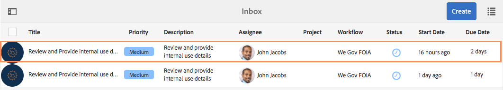

# Recorrido por FOIA del sitio de referencia We.Gov {#we-gov-reference-site-foia-walkthrough}

## Requisito previo {#pre-requisite}

Configure el sitio de referencia de We.Gov tal como se describe en [Configurar y configurar los sitios](/help/forms/using/setup-reference-sites.md)de referencia de AEM Forms.

## Situación de la Ley de libertad de información del sitio de referencia {#reference-site-freedom-of-information-act-scenario}

We.Gov es una organización estatal que permite a los padres adoptivos inscribirse para recibir apoyo infantil si adoptan a un niño. We.Gov también permite a los padres solicitar información de los siguientes departamentos gubernamentales bajo la ley de libertad de información:

* Organismo de Logística de Defensa
* Departamento de Defensa Oficina del Inspector General
* Departamento de Justicia - Oficina de Política de la Información
* Departamento de la Marina
* Organismo de Protección del Medio Ambiente

Para obtener más información sobre la Ley de libertad de información, consulte [www.foia.gov](https://www.foia.gov).

El escenario incluye las siguientes personas:

* Sarah Rose, la persona que solicita información en
* John Jacobs, la persona que maneja la solicitud, la envía al departamento correspondiente
* Gloria Rios, la empleada del gobierno que facilita la información según la solicitud

## Sarah inicia una solicitud de información en el marco de FOIA {#sarah-initiates-request-for-information-under-foia}

Según la Ley de Libertad de Información, Sarah solicita copia de los registros de casos de la Administración para Niños y Familias durante años (año fiscal) 2013 a 2016. Sarah presenta esta solicitud al Departamento de Justicia - Oficina de Política de Información y también significa que está dispuesta a pagar hasta 100 dólares de los EE.UU. por los gastos de impresión y franqueo.

### Cómo funciona {#how-it-works}

### Véalo usted mismo {#see-it-yourself}

In your browser, open `https://<hostname>:<PublishPort>/wegov`. En el sitio Web We.Gov, toque Aplicaciones > Todas las aplicaciones. En la página Todas las aplicaciones, toque Aplicar en Aplicación para Solicitud FOIA.

## Sarah comienza su solicitud de información bajo FOIA {#sarah-starts-her-application-for-information-under-foia}

Sarah hace clic en **Aplicar** y en la página de Solicitud de Ley de Libertad de Información, Sarah introduce información que incluye lo siguiente:

* **** Agencia: Sarah especifica la agencia a la que se dirigió la solicitud como Departamento de Justicia - Oficina de Política de Información.

* **Pagará Hasta**: Sarah especifica que está dispuesta a pagar hasta 100 USD por gastos de impresión y envío.
* **Describa la solicitud en detalle**: Sarah especifica &quot;Solicitud de copia de los registros de casos de la Administración para Niños y Familias para los años fiscales 2013 a 2016&quot;.

Solicitud de copia de los registros de casos de la Administración para la Infancia y la Familia correspondientes a los ejercicios económicos 2013 a 2016

En cualquier momento, Sarah puede tocar save (guardar) para guardar el borrador del formulario y volver más tarde para rellenar el formulario y enviarlo. Sarah presenta el formulario.

>[!NOTE]
>
>El flujo de trabajo de reanudación del correo electrónico funciona únicamente con los usuarios que han iniciado sesión. En el escenario del sitio de referencia, asegúrese de añadir al usuario Sarah Rose. Las credenciales de inicio de sesión de Sarah son `srose/password`.

## John Jacobs recibe y aprueba la solicitud {#john-jacobs-receives-and-approves-the-application}

John Jacobs recibe las solicitudes y las envía a la persona adecuada. La bandeja de entrada de AEM le permite ver todas las aplicaciones enviadas en un solo lugar.

### Cómo funciona {#how-it-works-1}

Cuando Sarah rellena y envía la solicitud FOIA, se envía un registro de la solicitud a la bandeja de entrada de John Jacobs. John Jacobs puede consultar la solicitud presentada y aceptarla o rechazarla.

### Véalo usted mismo {#see-it-yourself-1}

Puede acceder a la bandeja de entrada de AEM en https://&lt;***hostname***>:&lt;***PublishPort***>/content/we-finance/global/en/login.html?resource=/aem/inbox.html. Inicie sesión en la bandeja de entrada de AEM, utilizando jjacobs/password como nombre de usuario/contraseña para John Jacobs, y consulte la aplicación FOIA. Para obtener información sobre el uso de la Bandeja de entrada de AEM para tareas de flujo de trabajo centradas en formularios, consulte [Gestión de aplicaciones y tareas de formularios en la Bandeja de entrada](/help/forms/using/manage-applications-inbox.md)de AEM.

John Jacobs puede ver, aprobar o rechazar la aplicación desde el tablero de aplicaciones. John Jacobs selecciona y abre los detalles de la solicitud y luego de revisarla, la aprueba.

### <strong>Sarah recibe un correo electrónico</strong> de confirmación {#strong-sarah-receives-an-acknowledgement-email-strong}

Después de que John Jacobs apruebe la solicitud, Sarah recibe un correo electrónico de acuse de recibo del sitio Web We.Gov. Sarah está informada sobre las tarifas y el tiempo necesario para procesar su solicitud. El correo electrónico también incluye detalles de correo electrónico y teléfono con los que sarah puede ponerse en contacto para recibir actualizaciones en su aplicación.

## Gloria recibe la solicitud FOIA de aprobación de segundo nivel {#gloria-receives-the-foia-request-for-second-level-approval}

Después de que John Jacobs rellene la información requerida y apruebe la solicitud de Sarah, las solicitudes van a Gloria Rios para la aprobación final. Gloria revisa el documento adjunto de registro y aprueba la solicitud.

### Cómo funciona {#how-it-works-2}

Cuando John Jacobs aprueba la solicitud FOIA, se crea un PDF o Documento de Registro de la aplicación y se envía a la bandeja de entrada de Gloria Rios. Gloria puede ver la solicitud enviada y aprobarla o rechazarla.

### Véalo usted mismo {#see-for-yourself}

Puede acceder a la bandeja de entrada de AEM en https://&lt;***hostname***>:&lt;***PublishPort***>/content/we-finance/global/en/login.html?resource=/aem/inbox.html. Inicie sesión en la bandeja de entrada de AEM con grios/password como nombre de usuario/contraseña para Gloria Rios y consulte la solicitud FOIS.

Gloria abre la solicitud y examina los detalles de la solicitud FOIA. Después de revisar los detalles de la solicitud y comprobar la viabilidad de proporcionar los documentos requeridos, Gloria aprueba la solicitud.

## Sarah recibe una notificación de que su solicitud ha sido aprobada {#sarah-receives-notification-that-her-request-is-approved}

Después de que Gloria apruebe la solicitud de FOIA, Sarah recibe un correo electrónico que le notifica que su solicitud ha sido aprobada. El correo electrónico también incluye la información sobre el calendario provisional para proporcionar el documento y los detalles de contacto para el seguimiento de la solicitud.

