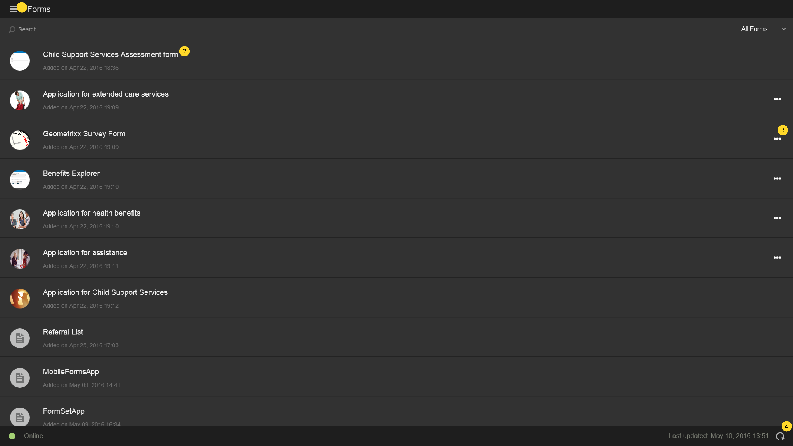
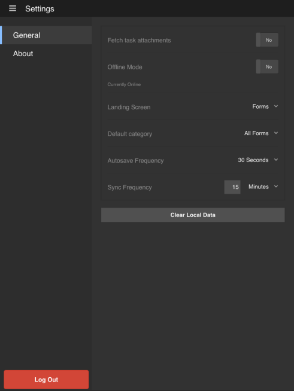

# Pantalla principal{#home-screen}

Al iniciar sesión en la aplicación AEM Forms, se le redirige a la pantalla Inicio.

## Pantalla Inicio predeterminada {#default-home-screen}

De forma predeterminada, la pantalla Inicio muestra todos los formularios, incluidos los puntos de inicio y las tareas (si el servidor conectado está habilitado para AEM Forms Workflow), junto con las miniaturas asociadas. You can specify the thumbnails in the AEM Forms Server.

La siguiente figura muestra anotaciones con llamadas a los componentes esenciales en la pantalla Inicio predeterminada.

<!--
Click to enlarge

-->

1. **Menu button**: Select the **Menu** button to navigate to Tasks, Forms, Outbox, and Settings. Si la aplicación AEM Forms está conectada a un servidor de AEM Forms JEE, puede ver la opción Tareas. La opción Tareas también almacena los borradores creados a partir de las tareas de un proceso. For AEM Forms OSGi servers, the Tasks option is hidden. La Bandeja de salida almacena los formularios y los borradores guardados antes de sincronizarse con el servidor. All saved forms and drafts in the Outbox are uploaded to the AEM Forms Server when the app is [synchronized with the server](../../forms/using/sync-app.md). Para obtener información sobre la configuración, consulte [Actualización de la configuración general](../../forms/using/update-general-settings.md).
1. **Task or Form**: Select the listed task or form that you want to work with.
1. **Puntos suspensivos horizontales**: indican que hay acciones disponibles en el formulario. Tapping the ellipsis displays the actions and description that the author has provided. The **Delete Draft** and **Complete** option is visible when you select the ellipsis.
1. **Refresh icon**: Select the refresh icon so you can synchronize your app with the AEM Forms Server.

### Personalización de la pantalla Inicio {#customizing-the-home-screen}

Puede cambiar la pantalla Inicio predeterminada de la aplicación desde la **[Configuración general](../../forms/using/update-general-settings.md)** de la aplicación o desde la pestaña **Preferencia** de HTML Workspace.

The change made to the Home screen setting on the app affects the Home screen for the currently logged in user or the user on the current mobile device.

However, the change made in HTML Workspace effects all AEM Forms app users logged in to the AEM Forms Server.
