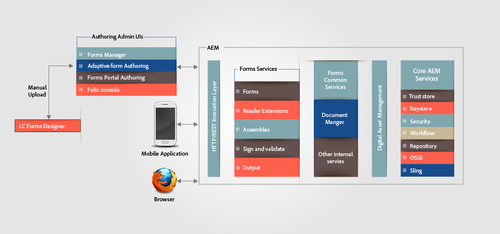

# Arquitectura de formularios HTML5{#architecture-of-html-forms}

## Arquitectura {#architecture}

La funcionalidad de formularios HTML5 se implementa como un paquete dentro de la instancia de AEM incrustada y se expone como un punto final de REST sobre HTTP/S mediante RESTful [Apache Sling Architecture](https://sling.apache.org/).

`` [ 01-aem-forms-arquitectura *Ver tamaño completo *](javascript:void(0).md)

.md)

### Uso de Sling Framework {#using-sling-framework}

[Apache Sling](https://sling.apache.org/) se centra en los recursos. Utiliza una URL de solicitud para resolver primero el recurso. Cada recurso tiene una propiedad **sling:resourceType** (o **sling:resourceSuperType**). En función de esta propiedad, el método de solicitud y las propiedades de la dirección URL de la solicitud, se selecciona una secuencia de comandos sling para gestionar la solicitud. Este script sling puede ser un JSP o un servlet. En los formularios HTML5, los nodos **de perfil** actúan como recursos de sling y el procesador **de perfiles** actúa como la secuencia de comandos de sling que gestiona la solicitud para procesar el formulario móvil con un perfil concreto. Un procesador **de perfiles** es un JSP que lee parámetros de una solicitud y llama al servicio OSGi de Forms.

Para obtener más información sobre el extremo REST y los parámetros de solicitud admitidos, consulte [Representación de plantilla](/help/forms/using/rendering-form-template.md)de formulario.

Cuando un usuario realiza una solicitud desde un dispositivo cliente, como un navegador iOS o Android, Sling resuelve primero el nodo de perfil en función de la dirección URL de la solicitud. Desde este nodo de perfil, lee **sling:resourceSuperType** y **sling:resourceType** para determinar todas las secuencias de comandos disponibles que pueden gestionar esta solicitud de procesamiento de formulario. A continuación, utiliza selectores de solicitud Sling junto con el método de solicitud para identificar la secuencia de comandos más adecuada para gestionar esta solicitud. Una vez que la solicitud llega a un JSP de procesador de perfiles, JSP llama al servicio OSGi de Forms.

Para obtener más información sobre la resolución de secuencias de comandos sling, consulte [AEM Sling Cheat Sheet](https://docs.adobe.com/content/docs/en/cq/current/developing/sling_cheatsheet.html) o Descomposición [de URL Sling de](https://sling.apache.org/site/url-decomposition.html)Apache.

#### Flujo de llamada de procesamiento de formularios habitual {#typical-form-processing-call-flow}

Los formularios HTML5 almacenan en caché todos los objetos intermedios necesarios para procesar (representación o envío) un formulario en la primera solicitud. No almacena en caché los objetos que dependen de los datos, ya que es probable que estos objetos cambien.

Formulario móvil mantiene dos niveles diferentes de caché: caché de preprocesamiento y caché de procesamiento. La caché preRender contiene todos los fragmentos e imágenes de una plantilla resuelta y la caché de procesamiento contiene contenido procesado como HTML.

Flujo de trabajo de formularios HTML5

Los formularios HTML5 no almacenan en caché plantillas que no tienen referencias de fragmentos e imágenes. Si los formularios HTML5 tardan más de lo normal, compruebe en los registros del servidor si faltan referencias y advertencias. Asegúrese también de que no se alcance el tamaño máximo del objeto.

El servicio OSGi de Forms procesa una solicitud en dos pasos:

* **Presentación y generación** de estado de formulario inicial: El servicio de procesamiento OSGi de Forms llama al componente Caché de formularios para determinar si el formulario ya se ha almacenado en caché y no se ha invalidado. Si el formulario está en caché y es válido, proporciona el HTML generado a partir de la caché. Si el formulario está invalidado, el servicio de procesamiento OSGi de Forms genera Presentación de formulario inicial y Estado de formulario en formato XML. El servicio OSGi de Forms transforma este XML en HTML layout y estado de formulario JSON inicial y, a continuación, se almacena en caché para solicitudes posteriores.
* **Formularios** rellenados previamente: Durante la representación, si un usuario solicita formularios con datos rellenados previamente, el servicio de procesamiento OSGi de Forms llama al contenedor de servicio de Forms y genera un nuevo estado de Formulario con datos combinados. Sin embargo, como el diseño ya se ha generado en el paso anterior, esta llamada es más rápida que la primera llamada. Esta llamada solo realiza la combinación de datos y ejecuta las secuencias de comandos en los datos.

Si hay alguna actualización en el formulario o alguno de los recursos utilizados dentro del formulario, el componente de la caché del formulario la detecta y la caché de ese formulario en particular se invalida. Una vez que el servicio OSGi de Forms finaliza el procesamiento, el jsp del procesador de perfiles agrega referencias de biblioteca JavaScript y estilo a este formulario y devuelve la respuesta al cliente. Aquí se puede utilizar un servidor web típico como [Apache](https://httpd.apache.org/) con compresión HTML activada. Un servidor web reduciría el tamaño de respuesta, el tráfico de red y el tiempo necesario para transmitir los datos entre el servidor y el equipo cliente de forma significativa.

Cuando un usuario envía el formulario, el explorador envía el estado del formulario en formato JSON al proxy [de](../../forms/using/service-proxy.md)envío del servicio; a continuación, el proxy de servicio de envío genera un XML de datos con datos JSON y envía ese XML de datos para enviar el extremo.

## Componentes {#components}

Se requiere un paquete de complementos de AEM Forms para activar formularios HTML5. Para obtener más información sobre la instalación del paquete del complemento AEM Forms, consulte [Instalación y configuración de AEM Forms](../../forms/using/installing-configuring-aem-forms-osgi.md).

### Componentes OSGi (adobe-lc-forms-core.jar) {#osgi-components-adobe-lc-forms-core-jar}

**El procesador de formularios XFA de Adobe (com.adobe.livecycle.adobe-lc-forms-core)** es el nombre para mostrar del paquete OSGi de formularios HTML5 cuando se visualiza desde la vista de paquete de la consola de administración Felix (https://[host]:[port]/system/console/buncles).

Este componente contiene componentes OSGi para la configuración de procesamiento, administración de caché y configuración.

#### Servicio OSGi de Forms {#forms-osgi-service}

Este servicio OSGi contiene la lógica para procesar un XDP como HTML y gestiona el envío de un formulario para generar datos XML. Este servicio utiliza el contenedor de servicios de Forms. El contenedor de servicio Forms llama internamente al componente nativo `XMLFormService.exe` que realiza el procesamiento.

Si se recibe una solicitud de procesamiento, este componente llama al contenedor de servicios de Forms para generar información de presentación y estado que se procesa más adelante para generar estados DOM de formularios HTML y JSON.

Este componente también es responsable de generar datos XML a partir del estado de formulario enviado JSON.

#### Componente Caché {#cache-component}

Los formularios HTML5 utilizan el almacenamiento en caché para optimizar el rendimiento y el tiempo de respuesta. Puede configurar el nivel del servicio de caché para ajustar el equilibrio entre el rendimiento y la utilización del espacio.

<table>
 <tbody>
  <tr>
   <th>Estrategia de caché</th>
   <th>Descripción</th>
  </tr>
  <tr>
   <td>Ninguna</td>
   <td>No almacenar en caché artefactos  </td>
  </tr>
  <tr>
   <td>Conservador</td>
   <td>Almacenar en caché solo los artefactos intermedios que se generan antes del procesamiento del formulario, como la plantilla que contiene fragmentos e imágenes en línea</td>
  </tr>
  <tr>
   <td>Agresivo</td>
   <td>Caché Contenido  HTML procesado Almacenar en caché todos los artefactos almacenados en caché en el nivel Conservador.  <strong>Nota</strong>: Esta estrategia resulta en un mejor rendimiento, pero consume más memoria para almacenar los artefactos almacenados en caché.</td>
  </tr>
 </tbody>
</table>

Los formularios HTML5 se guardan en la memoria caché mediante la estrategia LRU. Si la estrategia de caché se establece en la caché Ninguno, no se creará la caché y los datos de caché existentes, si los hay, se borrarán. Además de la estrategia de almacenamiento en caché, también puede configurar el tamaño total de caché en memoria, lo que puede ayudar a tener el límite máximo en el tamaño de caché y si va más allá, utilizará el modo LRU para liberar recursos de caché.

>[!NOTE]
>
>La caché en memoria no se comparte entre los nodos del clúster.

#### Servicio de configuración {#configuration-service}

El servicio de configuración permite ajustar los parámetros de configuración y la configuración de caché para formularios HTML5.

Para actualizar esta configuración, vaya a la Consola de administración de CQ Felix (disponible en https://&lt;[server]:[port]/system/console/configMgr), busque y seleccione Configuración de formularios móviles.

Puede configurar el tamaño de caché o deshabilitar la caché mediante el servicio de configuración. También puede habilitar la depuración mediante el parámetro Opciones de depuración. Encontrará más información sobre la depuración de formularios en [Depuración de formularios](/help/forms/using/debug.md)HTML5.

### Componentes de tiempo de ejecución (adobe-lc-forms-Runtime-pkg.zip) {#runtime-components-adobe-lc-forms-runtime-pkg-zip}

El paquete de tiempo de ejecución contiene las bibliotecas del lado del cliente utilizadas para procesar formularios HTML.

**Componentes importantes disponibles como parte del paquete Runtime:**

#### Motor de secuencias de comandos {#scripting-engine}

La implementación de Adobe XFA admite dos tipos de lenguajes de secuencias de comandos para permitir la ejecución lógica definida por el usuario en formularios: JavaScript y FormCalc.

El motor de secuencias de comandos de HTML Forms se escribe en JavaScript para admitir la API de secuencias de comandos XFA en ambos idiomas.

En el momento de la representación, la secuencia de comandos de FormCalc se traduce (y se almacena en caché) en JavaScript en el servidor transparente para el usuario o diseñador.

Este motor de secuencias de comandos utiliza algunas de las funciones de ECMAScript5 como Object.defineProperty. El motor/biblioteca se entrega como CQ Client Lib con el nombre de categoría **xfaforms.profile**. También proporciona la API **** de FormBridge para permitir que los portales externos o las aplicaciones interactúen con el formulario. Con FormBridge, una aplicación externa puede ocultar mediante programación determinados elementos, obtener o establecer sus valores o cambiar sus atributos.

Para obtener más información, consulte el artículo [Puente](/help/forms/using/form-bridge-apis.md) de formulario.

#### Motor de diseño {#layout-engine}

La presentación y el aspecto visual de los formularios HTML5 se basan en las funciones SVG 1.1, jQuery, BackBone y CSS3. El aspecto inicial de un formulario se genera y se almacena en caché en el servidor. La modificación de esa presentación inicial y cualquier otro cambio incremental en la presentación del formulario se administran en el cliente. Para conseguirlo, el paquete Runtime contiene un motor de diseño escrito en JavaScript y basado en jQuery/Backbone. Este motor gestiona todo el comportamiento dinámico, como Añadir/Eliminar instancias repetibles o Diseño de objetos acumulables. Este motor de presentación procesa un formulario de una página a la vez. Inicialmente, un usuario solo visualiza una página y la barra de desplazamiento horizontal representa solo la primera página. Sin embargo, cuando un usuario se desplaza hacia abajo, la siguiente página comienza a procesarse. Esta representación página por página reduce la cantidad de tiempo necesario para procesar la primera página en un explorador y mejora el rendimiento percibido del formulario. Este motor/biblioteca forma parte de CQ Client Lib con el nombre de categoría **xfaforms.profile**.

El motor de presentación también contiene un conjunto de utilidades utilizadas para capturar el valor de los campos de formulario de un usuario. Estas utilidades están modeladas como utilidades [de interfaz de usuario de](https://api.jqueryui.com/jQuery.widget/) jQuery que implementan cierto contrato adicional para funcionar sin problemas con el motor de diseño.

Para obtener más información sobre las utilidades y los contratos correspondientes, consulte Widgets [personalizados para formularios](/help/forms/using/introduction-widgets.md)HTML5.

#### Estilo {#styling}

El estilo asociado con los elementos HTML se agrega en línea o en función de bloques CSS incrustados. Algunos estilos comunes que no dependen del formulario forman parte de CQ Client Lib con nombre de categoría xfaforms.profile.

Además de las propiedades de estilo predeterminadas, cada elemento de formulario también contiene ciertas clases CSS basadas en el tipo de elemento, el nombre y otras propiedades. Con estas clases, se pueden volver a aplicar estilo a los elementos especificando su propia CSS.

Para obtener más información sobre el estilo y las clases predeterminados, consulte [Introducción a los estilos](/help/forms/using/css-styles.md).

#### Script del lado del servidor y servicios Web {#server-side-script-and-web-services}

Todas las secuencias de comandos marcadas para ejecutarse en el servidor o marcadas para llamar a un servicio Web (independientemente de dónde esté marcado para ejecutarse) siempre se ejecutan en el servidor.

Motor de secuencias de comandos de cliente:

1. Realiza una llamada sincrónica al servidor que pasa el estado de formulario actual en forma de JSON
1. Ejecuta la secuencia de comandos o el servicio Web en el servidor
1. Genera un nuevo estado JSON
1. Combina el nuevo estado JSON en el cliente cuando se devuelve la respuesta.

#### Paquetes de recursos de localización {#localization-resource-bundles}

Los formularios HTML5 admiten italiano (it), español (es), portugués brasileño (pt_BR), chino simplificado (zh_CN), chino tradicional (solo compatibilidad limitada) (zh_TW), coreano (ko_KR), inglés (en_US), francés (fr_FR), alemán (de_DE) y japonés (ja). Según la configuración regional recibida en el encabezado de la solicitud, se envía al cliente el paquete de recursos correspondiente. Este paquete de recursos se agrega a Profile JSP como una biblioteca de cliente de CQ con el nombre de categoría **xfaforms.I18N**. Puede anular la lógica de recoger el paquete de configuración regional en el perfil.

### Sling Components (adobe-lc-forms-content-pkg.zip) {#sling-components-adobe-lc-forms-content-pkg-zip}

El paquete Sling contiene contenido relacionado con los perfiles y el procesador de perfiles.

#### Perfiles {#profiles}

Los perfiles son los nodos de recursos de sling que representan un formulario o una familia de formularios. A nivel de CQ, estos perfiles son nodos JCR. Los nodos residen en la carpeta **/content** del repositorio JCR y pueden estar dentro de cualquier subcarpeta de la carpeta **/content** .

#### Representadores de perfil {#profile-renderers}

El nodo Profile tiene una propiedad **sling:resourceSuperType** con valor **xfaforms/profile**. Esta propiedad envía internamente solicitudes a la secuencia de comandos sling para los nodos Profile ubicados en la carpeta **/libs/xfaforms/profile** . Estas secuencias de comandos son páginas JSP, que son contenedores para agrupar los formularios HTML y los artefactos JS/CSS requeridos. Las páginas incluyen referencias a:

* **xfaforms.I18N.&lt;locale>**: Esta biblioteca contiene datos localizados.
* **xfaforms.profile**: Esta biblioteca contiene la implementación para el motor XFA Scripting y Layout.

Estas bibliotecas están modeladas como bibliotecas de cliente de CQ que aprovecha las ventajas de la concatenación automática, la minimización y las capacidades de compresión de las bibliotecas JavaScript del marco de CQ.
Para obtener más información sobre las bibliotecas de cliente de CQ, consulte [Documentación](https://docs.adobe.com/docs/en/cq/current/developing/components/clientlibs.html)de CQ Clientlib.

Como se ha descrito anteriormente, el procesador de perfiles JSP llama a Forms Service a través de un sling include. Este JSP también establece varias opciones de depuración en función de la configuración de administración o los parámetros de solicitud.

Los formularios HTML5 permiten a los desarrolladores crear un procesador de perfiles y perfiles para personalizar el aspecto de los formularios. Por ejemplo, los formularios HTML permiten a los desarrolladores integrar formularios en un panel o en la sección &lt;div> de un portal HTML existente.
Para obtener más información sobre la creación de perfiles personalizados, consulte [Creación de un perfil](/help/forms/using/custom-profile.md)personalizado.
[Comuníquese con la asistencia técnica](https://www.adobe.com/account/sign-in.supportportal.html)
