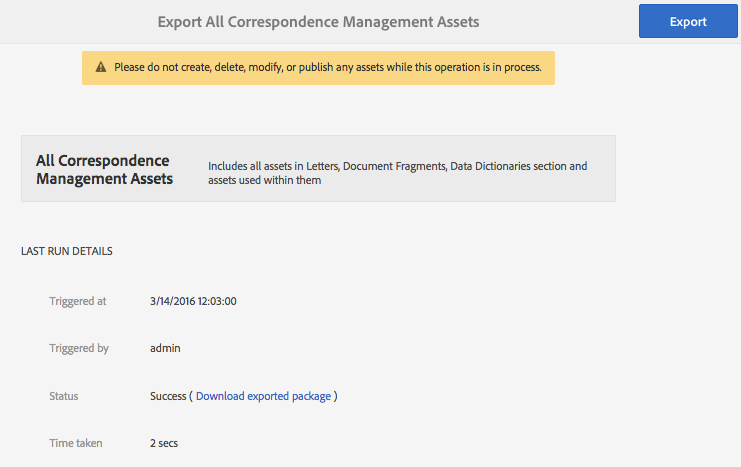

# Importación y exportación de recursos a AEM Forms{#importing-and-exporting-assets-to-aem-forms}

Puede mover formularios y recursos, temas, diccionarios de datos, fragmentos de documentos y letras relacionados entre distintas instancias de AEM Forms. Este movimiento es necesario cuando se migran sistemas o se mueven formularios de un servidor de etapas a un servidor de producción. Para aquellos recursos para los que se admite la carga e importación mediante la interfaz de usuario de AEM Forms, se recomienda utilizar la interfaz de usuario de Forms para la exportación o importación. No se recomienda utilizar AEM Package Manager para exportar o importar estos recursos.

>[!NOTE]
>
>* En AEM 6.4 Forms, la estructura y las rutas del repositorio de crx han cambiado. Si importa recursos de una versión anterior a AEM 6.4 Forms y el formulario depende en parte de la estructura anterior, deberá exportar manualmente las dependencias. Para obtener más información sobre los cambios en la estructura y las rutas del repositorio, consulte Reestructuración [del repositorio en AEM](/help/sites-deploying/repository-restructuring.md).
>

## Descargar o cargar recursos de Forms y Documents {#download-or-upload-forms-amp-documents-assets}

La interfaz de usuario de AEM Forms permite exportar recursos desde una instancia de AEM descargándolos como un paquete CRX de AEM o archivos binarios. A continuación, puede importar el paquete CRX de AEM descargado o el archivo binario en otra instancia de AEM.

La exportación e importación a través de la interfaz de usuario de AEM Forms se admite para todos los recursos, excepto para las plantillas de formulario adaptable y las directivas de contenido de formulario adaptable. Por lo tanto, al exportar un formulario adaptable desde la interfaz de usuario de AEM Forms, la plantilla de formulario adaptable y las políticas de contenido relacionadas no se exportan automáticamente como otros recursos relacionados.

Para estos tipos de recursos, debe utilizar AEM Package Manager para crear un paquete CRX en el servidor AEM de origen e instalar el paquete en el servidor de destino. Para obtener información sobre la creación e instalación de paquetes, consulte [Uso de paquetes](/help/sites-administering/package-manager.md).

### Descargar recursos de formularios y documentos {#download-forms-amp-documents-assets}

Para descargar recursos de Forms &amp; Documents:

1. Inicie sesión en la instancia de AEM Forms.
1. Puntee en el icono de Experience Manager  > icono de  de navegación > Formularios > Formularios y documentos.
1. Seleccione los recursos de formulario y toque el icono **Descargar** .
1. En los recursos de descarga, elija una de las siguientes opciones y toque **Descargar**.

   * **Descargar como paquete CRX:** Utilice la opción para descargar y mover todos los recursos seleccionados y las dependencias relacionadas de una instancia de AEM Forms a otra. Descarga todos los recursos y carpetas como paquete crx. Todos los recursos de formulario, incluidos los formularios creados en AEM (formularios adaptables, comunicaciones interactivas y fragmentos de formulario adaptables), conjuntos de formularios, plantillas de formulario, documentos PDF y recursos (XSD, XFS, imágenes) se pueden descargar como paquete desde la interfaz de usuario de AEM Forms.
La ventaja de descargar recursos como paquete es que también descarga los recursos que ha utilizado el recurso seleccionado para la descarga. Por ejemplo, si tiene un formulario adaptable que utiliza una plantilla de formulario, XSD y una imagen. Al seleccionar este formulario adaptable y descargarlo como paquete, el paquete descargado también contiene la plantilla de formulario, XSD y la imagen. También se descargan todas las propiedades de metadatos (incluidas las propiedades personalizadas) asociadas al recurso.

   * **Descargar recursos como archivos binarios:** Utilice la opción para descargar solo plantillas de formulario (XDP), formularios PDF (PDF), documento (PDF) y recursos (imágenes, esquemas, hojas de estilo). Puede editar estos recursos con aplicaciones externas. Descarga los recursos de formularios que tienen binarios, como XSD, XDP, imágenes, PDF y XDP como archivo .zip.
No puede descargar formularios adaptables, comunicaciones interactivas, fragmentos de formularios adaptables, temas ni conjuntos de formularios con la opción **Descargar recursos como archivos** binarios. Para descargar estos recursos, debe utilizar la opción **Descargar como paquete** CRX.
   Los recursos seleccionados se descargan como un archivo (archivo .zip).

   >[!NOTE]
   >
   >Tanto el paquete de AEM como los archivos binarios se descargan como un archivo (.zip). Las plantillas de los recursos no se descargan junto con los recursos. Es necesario exportar las plantillas de recursos por separado.

### Carga de recursos de formularios y documentos {#upload-forms-amp-documents-assets}

Para cargar recursos de Forms &amp; Documents:

>[!VIDEO](https://vimeo.com/)

1. Inicie sesión en la instancia de AEM Forms.
1. Puntee en el icono  de Experience Manager > icono de  de navegación> Formularios > Formularios y documentos.
1. Toque **Crear** > Cargar **archivo**. Aparece un cuadro de diálogo de carga o paquete.
1. En el cuadro de diálogo, busque y seleccione el paquete o el archivo que desea importar. También puede seleccionar documentos PDF, XSD, imágenes, hojas de estilo y formularios XDP. Toque **Abrir**. La carpeta o el nombre de archivo que seleccione no deben incluir caracteres especiales.

   En el cuadro de diálogo, compruebe los detalles de los recursos que se están cargando y toque **Cargar**.

   En caso de que cargue un recurso de formulario existente, el recurso se actualizará.

   >[!NOTE]
   >
   >La carga de un paquete no reemplaza la jerarquía de carpetas existente. Por ejemplo, si tiene un formulario adaptable denominado &#39;Formación&#39; en la ubicación /content/dam/formsanddocuments en un servidor. Descargue el formulario adaptable y cárguelo en otro servidor. El segundo servidor también tiene una carpeta con el nombre &#39;Training&#39; en la misma ubicación /content/dam/formsanddocuments. La carga falla.

## Descarga o carga de un tema {#downloading-or-uploading-a-theme}

Con AEM Forms, puede crear, descargar o cargar temas. Se crea un tema como otros recursos, como formularios, documentos y letras. Puede crear un tema, descargarlo y cargarlo en una instancia independiente para reutilizarlo. Para obtener más información sobre los temas, consulte [Temas en AEM Forms](../../forms/using/themes.md).

### Descarga de un tema {#downloading-a-theme}

Puede exportar temas en formularios AEM que puede utilizar en otros proyectos o instancias. AEM le permite descargar un tema como archivo zip, que puede cargar en la instancia.

Para descargar un tema:

1. Inicie sesión en la instancia de AEM Forms.
1. Puntee en el icono de Experience Manager  > icono de  de navegación > Formularios > Temas.
1. Seleccione el tema y toque **Descargar**. El tema se descarga como archivo (archivo .zip).

### Carga de un tema {#uploading-a-theme}

Puede utilizar temas creados con ajustes preestablecidos de estilo en el proyecto. Puede importar los paquetes de temas que otros creen cargándolos en el proyecto.

Para cargar un tema:

1. En Experience Manager, vaya a **Formularios > Temas**.
1. En la página Temas, haga clic en **Crear > Carga** de archivos.
1. En el mensaje de carga de archivos, busque y seleccione un paquete de temas en el equipo y haga clic en **Cargar**.
El tema cargado está disponible en la página de temas.

1. Inicie sesión en la instancia de AEM Forms.
1. Puntee en el icono de Experience Manager  > icono de  de navegación > Formularios > Temas.
1. haga clic en **Crear** > Cargar **archivo**. En el mensaje de carga de archivos, busque y seleccione un paquete de temas en el equipo y haga clic en **Cargar**. Se carga el tema.

## Importación y exportación de recursos en Correspondencia {#import-and-export-assets-in-correspondence-management}

Para compartir recursos, como diccionarios de datos, cartas y fragmentos de documentos, entre dos implementaciones diferentes de la administración de correspondencia, puede crear y compartir archivos .cmp. Un archivo .cmp puede incluir uno o varios diccionarios de datos, letras, fragmentos de documentos y formularios.

### Exportar fragmentos de documento, letras y/o diccionarios de datos {#export-document-fragments-letters-and-or-data-dictionaries}

1. En las páginas de letras, fragmentos de documento o diccionario de datos, toque y seleccione los recursos que desea exportar a un solo paquete y, a continuación, toque Cola para descarga. Los recursos están alineados para la exportación.
1. Si es necesario, repita el paso anterior para agregar letras, fragmentos de documento y diccionarios de datos.
1. Toque **Descargar**.
1. La Administración de correspondencia muestra el cuadro de diálogo Descargar recursos con una lista de recursos en la lista de exportación.

   

1. Para ver las dependencias exportadas, toque Resolver. O bien, vaya al paso siguiente. Aunque no toque resolver, las dependencias se seguirán exportando.
1. Para descargar el archivo .cmp, toque **Aceptar**.
1. Correspondence Management descarga un archivo .cmp en el equipo.

   El archivo .cmp incluye los recursos exportados. Puede compartir el archivo .cmp con otros usuarios. Otros usuarios pueden importar el archivo .cmp en otro servidor para obtener todos los recursos del nuevo servidor.

### Exportar todos los recursos de Correspondence Management como un paquete {#export-all-the-correspondence-management-assets-as-a-package}

Utilice esta opción para descargar todos los recursos de Correspondence Management y las dependencias relacionadas como un paquete desde una instancia de formularios de AEM.

Por ejemplo, si Gestión de correspondencia tiene una carta que utiliza una imagen y un texto, el paquete descargado también contiene la imagen y el texto relacionados con la carta. También se descargan todas las propiedades de metadatos (incluidas las propiedades personalizadas) asociadas al recurso. Una vez descargado el paquete (.cmp), puede [importarlo a otra instancia](../../forms/using/import-export-forms-templates.md#p-upload-forms-documents-assets-p)de AEM Forms.

Para descargar todos los recursos de Correspondence Management y las dependencias relacionadas como un paquete, complete los siguientes pasos:

1. Inicie sesión en el servidor de AEM Forms como usuario de formularios.
1. Toque **Adobe Experience Manager** en la barra de navegación global.
1. Toque las herramientas ( ) y, a continuación, **Formularios**.
1. Tap **Export Correspondence Management Assets**.

   

   ( &quot;Aparece la página Exportar todos los recursos de gestión de correspondencia y muestra la información sobre la última vez que se intentó el proceso de exportación y un vínculo para descargar el último paquete exportado correctamente.

   

1. Toque **Exportar** y, en el mensaje de confirmación, **Aceptar**.

   Una vez completado el proceso por lotes, se actualizan los detalles de la última ejecución y el vínculo para descargar el paquete. Esto incluye información como el inicio de sesión del administrador y si el lote se ejecutó correctamente o falló. Los recursos se exportan a un paquete y aparece el vínculo Descargar paquete exportado.

   >[!NOTE]
   >
   >El proceso Exportar todos los recursos no se puede cancelar una vez iniciado. Además, mientras la operación de exportación está en curso, no cree, elimine, modifique ni publique recursos ni inicie el proceso de publicación de todos los recursos.a

1. Toque el vínculo **Descargar paquete** exportado para descargar el archivo del paquete.

   Para agregar los recursos del paquete a otra instancia de Correspondence Management, [importe el paquete a una instancia](../../forms/using/import-export-forms-templates.md#p-upload-forms-documents-assets-p)de AEM Forms.

### Importar fragmentos de documento, letras y/o diccionarios de datos en la administración de correspondencia {#import-document-fragments-letters-and-or-data-dictionaries-into-correspondence-management}

Puede importar recursos que se exportan a un archivo .cmp. Un archivo .cmp puede tener una o más letras, diccionarios de datos, fragmentos de documentos y recursos dependientes.

>[!NOTE]
>
>Durante la importación de recursos antiguos de Correspondence Management para la migración, inicie sesión con una cuenta de administrador. Para obtener más información sobre la migración de recursos antiguos de la gestión de correspondencia, consulte [Migración de recursos de la gestión de correspondencia a formularios](/help/forms/using/migration-utility.md)AEM 6.1.

1. En la página de fragmentos de documentos, letras o diccionario de datos, toque **Crear > Cargar** archivo y seleccione el archivo .cmp.
1. La Administración de correspondencia muestra el cuadro de diálogo Importar recursos con la lista de recursos importados. Toque **Importar**.

   Después de importar los recursos, se actualizan las siguientes propiedades de los recursos mientras que las demás propiedades permanecen iguales:

   * Autor: Muestra el ID del usuario que importó el recurso al servidor
   * Modificado: Hora a la que se importó el recurso al servidor
   >[!NOTE]
   >
   >Para poder cargar XDP (como parte del archivo cmp o de otro modo), debe formar parte del grupo de usuarios avanzados de formularios. Para obtener derechos de acceso, póngase en contacto con el administrador.

## Exportación de una aplicación de flujo de trabajo {#export-a-workflow-application}

Puede utilizar el administrador de paquetes AEM para exportar aplicaciones de flujo de trabajo. El procedimiento es el siguiente:

1. Abra el administrador de paquetes de AEM Forms. La dirección URL del administrador de paquetes es https://&lt;server>:&lt;port>/crx/packmgr.
1. Haga clic en **[!UICONTROL Crear paquete]**. The **[!UICONTROL New Package]** dialog box appears.
1. Especifique el nombre, la versión y el grupo del paquete. Haga clic en **[!UICONTROL Aceptar]**.
1. Haga clic en **[!UICONTROL Editar]** y abra la ficha **[!UICONTROL Filtros]** . Haga clic en **[!UICONTROL Agregar filtro]**. Especifique la ruta de la aplicación de flujo de trabajo. Por ejemplo, /etc/fd/dashboard/startpoints/homemortgage. Haga clic en **[!UICONTROL Agregar regla]**.

1. Abra la pestaña **[!UICONTROL Avanzadas.]** Seleccione **[!UICONTROL Combinar]** o **[!UICONTROL Sobrescribir]** en el campo Gestión de ACL. Haga clic en **[!UICONTROL Guardar]**.
1. Haga clic en **[!UICONTROL Generar]** para crear el paquete.

   Después de crear el paquete, puede descargarlo e importarlo al otro servidor. La aplicación de flujo de trabajo aparece en el servidor donde se carga el paquete.

   >[!NOTE]
   >
   >Para que la aplicación de flujo de trabajo funcione correctamente, exporte también el formulario adaptable y el modelo de flujo de trabajo correspondientes con la aplicación de trabajo.

## Carpetas y organización de recursos {#folders-and-organizing-assets}

La interfaz de usuario de AEM Forms utiliza carpetas para organizar los recursos. Estas carpetas se utilizan para organizar recursos creados en la interfaz de usuario de AEM Forms. Puede cambiar el nombre de las subcarpetas, crearlas y almacenarlas en ellas. La organización de documentos y recursos en una carpeta le permite agrupar los archivos para facilitar la gestión. Puede seleccionar una carpeta y elegir descargarla o eliminarla.

Para crear una carpeta, complete los siguientes pasos:

### Crear una carpeta {#create-a-folder}

1. Inicie sesión en la interfaz de usuario de AEM Forms en `https://<server>:<port>/aem/forms.html`.
1. Vaya a la ubicación en la que desea crear una carpeta.
1. Toque Crear > Carpeta.
1. Introduzca los siguientes detalles:

   * **Título:** Nombre para mostrar de la carpeta
   * **Nombre:** *(Obligatorio)* El nombre del nodo en el que desea almacenar la carpeta en el repositorio
   >[!NOTE]
   >
   >De forma predeterminada, el valor del campo de nombre se rellena automáticamente desde el título. El nombre sólo puede contener caracteres alfanuméricos o caracteres especiales de guión (-) y subrayado (_). Cualquier otro carácter especial introducido en el título se sustituye automáticamente por un guión y se le solicita que confirme el nuevo nombre. Puede elegir continuar con el nombre sugerido o editarlo más adelante.

1. En la ubicación actual de la lista de recursos se muestra una nueva carpeta con el título definido.

   Si existe una carpeta con el nombre especificado, el envío falla con un error. Puede ver el mensaje de error pasando el ratón sobre el icono  que aparece junto al campo de nombre.

   Puede tocar la carpeta recién creada para ir dentro de ella y crear recursos o carpetas dentro de ella. Además, puede seleccionar una carpeta y elegir colocarla en la cola para descargarla, eliminarla o editar su nombre.

   

### Creación de copias de uno o varios recursos o letras {#create-copies-of-one-or-more-assets-or-letters}

Puede utilizar recursos y letras existentes para crear rápidamente recursos y letras con propiedades, contenido y recursos heredados similares. Puede copiar y pegar diccionarios de datos, fragmentos de documentos y letras.

Complete los siguientes pasos para crear copias de recursos y letras:

1. En la página correspondiente Recursos o Cartas, seleccione uno o varios recursos o letras. La interfaz de usuario muestra el icono Copiar.
1. Pulse Copiar. La interfaz de usuario muestra el icono Pegar. También puede elegir ir o navegar dentro de una carpeta antes de pegarla. Las distintas carpetas pueden contener recursos con los mismos nombres. Para obtener más información sobre las carpetas, consulte [Carpetas y organización de recursos](#folders-and-organizing-assets).
1. Toque Pegar. Aparecerá el cuadro de diálogo Pegar. El sistema genera automáticamente nombres y títulos para las nuevas copias de recursos/letras, pero puede editar los títulos y nombres de los recursos/letras.

   Si copia y pega los recursos o letras en el mismo lugar, se agrega un sufijo &quot;-CopyXX&quot; al nombre existente del recurso o la letra. Si no existe ningún título para el recurso o la carta copiados, el campo de título generado automáticamente permanece en blanco.

1. Si es necesario, edite el Título y el Nombre con los que desea guardar la copia del recurso o la carta.
1. Toque Pegar. Se crean nuevas copias de los recursos copiados.

## Búsqueda {#search-forms}

La interfaz de usuario de AEM Forms permite buscar el contenido. Con la barra superior, puede tocar Buscar **[A]** para buscar recursos como recursos y documentos en el contenido.

Al buscar recursos, AEM Forms muestra el panel lateral. También puede tocar  > Filter **[B]** para activar el panel lateral. Con los distintos filtros del panel lateral, puede reducir la búsqueda. El panel lateral también permite guardar las búsquedas.

**A.** Buscar **B.** Filtro

Panel lateral: Filtros

En el panel lateral, puede utilizar lo siguiente para reducir los resultados de búsqueda:

* Directorio de búsqueda
* Etiquetas
* Criterios de búsqueda; por ejemplo, fechas de modificación, estado de publicación o estado de Live Copy

El panel lateral también le permite guardar la configuración de búsqueda con los nombres que desee.

Para obtener más información e instrucciones sobre el uso de la búsqueda, los filtros, la búsqueda guardada y el panel lateral, consulte [Buscar](/help/sites-authoring/search.md).
