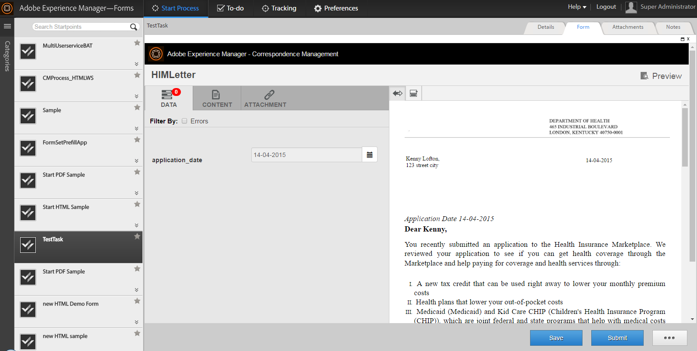

# Integración de aplicaciones de terceros en el espacio de trabajo de AEM Forms{#integrating-third-party-applications-in-aem-forms-workspace}

El espacio de trabajo de AEM Forms admite la administración de actividades de asignación y finalización de tareas para formularios y documentos. Estos formularios y documentos pueden ser Forms XDP, formularios de Flex® o guías (obsoletos) que se han procesado en formatos XDP, PDF, HTML o Flex.

Estas capacidades se mejoran aún más. AEM Forms ahora admite la colaboración con aplicaciones de terceros que admiten funciones similares al espacio de trabajo de AEM Forms. Una parte común de esta funcionalidad es el flujo de trabajo de asignación y la posterior aprobación de una tarea. AEM Forms ofrece una única experiencia unificada para los usuarios empresariales de AEM Forms, de modo que todas estas asignaciones o aprobaciones de tareas para las aplicaciones admitidas se puedan gestionar a través del espacio de trabajo de AEM Forms.

Por ejemplo, consideremos la gestión de correspondencia como el candidato de muestra para la integración con el espacio de trabajo de AEM Forms. Correspondence Management tiene el concepto de una &#39;Carta&#39;, que puede procesarse y permite realizar acciones.

## Crear recursos de Administración de correspondencia {#create-correspondence-management-assets}

Inicio mediante la creación de una plantilla de gestión de correspondencia de muestra que se procesa en el espacio de trabajo de AEM Forms. Para obtener más información, consulte [Creación de una plantilla de carta](../../forms/using/create-letter.md).

Acceda a la plantilla Gestión de correspondencia en su dirección URL para comprobar si la plantilla Gestión de correspondencia se puede procesar correctamente. La dirección URL tiene un patrón similar a `https://'[server]:[port]'/lc/content/cm/createcorrespondence.html?cmLetterId=encodedLetterId&cmUseTestData=1&cmPreview=0;`

donde `encodedLetterId` es el Id. de letra con codificación URL. Especifique el mismo ID de letra al definir el proceso de procesamiento para la tarea del espacio de trabajo en Workbench.

## Cree una tarea para procesar y enviar una carta en AEM Workspace {#create-a-task-to-render-and-submit-a-letter-in-aem-workspace}

Antes de ejecutar estos pasos, asegúrese de que es miembro de los siguientes grupos:

* cm-agent-users
* Usuarios de Workspace

Para obtener más información, consulte [Añadir y configurar usuarios](/help/forms/using/admin-help/adding-configuring-users.md).

Siga estos pasos para crear una tarea para procesar y enviar una carta en AEM Workspace:

1. Inicie Workbench. Inicie sesión en localhost como administrador.
1. Haga clic en Archivo > Nuevo > Aplicación. En el campo Nombre de la aplicación, escriba `CMDemoSample` y haga clic en Finalizar.
1. Seleccione `CMDemoSample/1.0` y haga clic con el botón derecho `NewProcess`. En el campo de nombre, escriba `CMRenderer` y haga clic en Finalizar.
1. Arrastre el selector de actividades de punto de Inicio y configúrelo:

   1. En Datos de presentación, seleccione Utilizar un recurso CRX.

      

   1. Busque un recurso. En el cuadro de diálogo Seleccionar recurso de formulario, la ficha Letras lista todas las letras del servidor.

      

   1. Seleccione la letra adecuada y haga clic en **Aceptar**.

1. Haga clic en Administrar Perfiles de acción. Aparece el cuadro de diálogo Administrar Perfil de acción. Asegúrese de que el proceso de procesamiento y el proceso de envío están correctamente seleccionados.
1. Para abrir la carta con un archivo XML de datos, busque y seleccione el archivo de datos adecuado en el proceso de preparación de datos.
1. Haga clic en Aceptar.
1. Defina las variables para Salida de punto de Inicio y Archivos adjuntos de Tarea. Las variables definidas contendrán los datos de Salida de punto de Inicio y Datos adjuntos de Tarea.
1. (Opcional) Para agregar otro usuario al flujo de trabajo, arrastre un selector de actividades, configúrelo y asígnelo a un usuario. Escriba un contenedor personalizado (ejemplo de abajo) o descargue e instale el DSC (que se muestra más abajo) para indicar la plantilla Carta, la salida de punto de Inicio y los datos adjuntos de tarea.

   A continuación se muestra un contenedor personalizado de muestra:

   ```javascript
   public LetterInstanceInfo getLetterInstanceInfo(Document dataXML) throws Exception {
   try {
   if(dataXML == null)
   throw new Exception("dataXML is missing");
   
   CoreService coreService = getRemoteCoreService();
   if (coreService == null)
   throw new Exception("Unable to retrive service. Please verify connection details.");
   Map<String, Object> result = coreService.getLetterInstanceInfo(IOUtils.toString(dataXML.getInputStream(), "UTF-8"));
   LetterInstanceInfo letterInstanceInfo = new LetterInstanceInfo();
   
   List<Document> attachmentDocs = new ArrayList<Document>();
   List<byte[]> attachments = (List<byte[]>)result.get(CoreService.ATTACHMENT_KEY);
   if (attachments != null){
   for (byte[] attachment : attachments)
   { attachmentDocs.add(new Document(attachment)); }
   
   }
   letterInstanceInfo.setLetterAttachments(attachmentDocs);
   
   byte[] updateLayout = (byte[])result.get(CoreService.LAYOUT_TEMPLATE_KEY);
   if (updateLayout != null)
   { letterInstanceInfo.setLetterTemplate(new Document(updateLayout)); }
   
   else
   { throw new Exception("template bytes missing while getting Letter instance Info."); }
   
   return letterInstanceInfo;
   } catch (Exception e)
   { throw new Exception(e); }
   
   }
   ```

   [Descargar ](assets/dscsample.zip)
archivo DSC: Hay disponible un DSC de muestra en el archivo DSCSample.zip adjunto anteriormente. Descargue y descomprima el archivo DSCSample.zip. Antes de utilizar el servicio DSC, debe configurarlo. Para obtener más información, consulte [Configuración del servicio DSC](../../forms/using/add-action-button-in-create-correspondence-ui.md#p-configure-the-dsc-service-p).

   En el cuadro de diálogo Definir Actividad, seleccione la actividad adecuada, como getLetterInstanceInfo, y haga clic en **Aceptar**.

1. Implemente la aplicación. Si se le solicita que registre y guarde los recursos.
1. Inicie sesión en el área de trabajo de formularios AEM en https://&#39;[server]:[port]&#39;/lc/content/ws.
1. Abra la tarea que ha agregado, CMRenderer. Aparecerá la carta de Correspondencia Management.

   

1. Rellene los datos requeridos y envíe la carta. La ventana se cierra. En este proceso, la tarea se asigna al usuario especificado en el flujo de trabajo en el paso 9.

   >[!NOTE]
   >
   >El botón Enviar no se activa hasta que se completen todas las variables requeridas en la carta.
