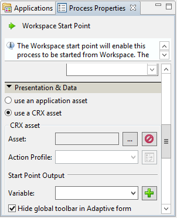

# Integración de aplicaciones de terceros en el espacio de trabajo de AEM Forms{#integrating-third-party-applications-in-aem-forms-workspace}

El espacio de trabajo de AEM Forms admite la administración de las actividades de asignación y finalización de tareas para formularios y documentos. Estos formularios y documentos pueden ser Forms XDP, formularios de Flex® o guías (obsoletos) que se han procesado en los formatos XDP, PDF, HTML o Flex.

Estas capacidades se mejoran aún más. AEM Forms ahora admite la colaboración con aplicaciones de terceros que admiten funcionalidades similares al espacio de trabajo de AEM Forms. Una parte común de esta funcionalidad es el flujo de trabajo de asignación y posterior aprobación de una tarea. AEM Forms proporciona una única experiencia unificada para los usuarios empresariales de AEM Forms, de modo que todas estas asignaciones de tareas o aprobaciones para las aplicaciones compatibles se puedan administrar a través del espacio de trabajo de AEM Forms.

Por ejemplo, consideremos la gestión de correspondencia como el candidato de muestra para la integración con el espacio de trabajo de AEM Forms. Correspondence Management tiene el concepto de una &quot;carta&quot;, que puede procesarse y permite realizar acciones.

## Crear recursos de gestión de correspondencia {#create-correspondence-management-assets}

Comience creando una plantilla de gestión de correspondencia de ejemplo que se muestre en el espacio de trabajo de AEM Forms. Para obtener más información, consulte [Creación de una plantilla de carta](../../forms/using/create-letter.md).

Acceda a la plantilla Gestión de Correspondencia en su dirección URL para comprobar si la plantilla Gestión de Correspondencia se puede procesar correctamente. La dirección URL tiene un patrón similar al `https://'[server]:[port]'/lc/content/cm/createcorrespondence.html?cmLetterId=encodedLetterId&cmUseTestData=1&cmPreview=0;`

donde `encodedLetterId` es el ID de carta con codificación URL. Especifique el mismo ID de letra, al definir el proceso de renderización para la tarea de espacio de trabajo en Workbench.

## Creación de una tarea para procesar y enviar una carta en AEM Workspace {#create-a-task-to-render-and-submit-a-letter-in-aem-workspace}

Antes de ejecutar estos pasos, asegúrese de que es miembro de los siguientes grupos:

* cm-agent-users
* Usuarios de Workspace

Para obtener más información, consulte [Agregar y configurar usuarios](/help/forms/using/admin-help/adding-configuring-users.md).

Siga estos pasos para crear una tarea para procesar y enviar una carta en AEM Workspace:

1. Iniciar Workbench. Inicie sesión en localhost como administrador.
1. Haga clic en Archivo > Nuevo > Aplicación. En el campo Nombre de la aplicación , introduzca `CMDemoSample` y, a continuación, haga clic en Finalizar.
1. Select `CMDemoSample/1.0` y haga clic con el botón derecho `NewProcess`. En el campo de nombre, introduzca `CMRenderer` y, a continuación, haga clic en Finalizar.
1. Arrastre el selector de actividades de punto de inicio y configúrelo:

   1. En Datos de presentación, seleccione Usar un recurso CRX.

      

   1. Busque un recurso. En el cuadro de diálogo Seleccionar recurso de formulario, la ficha Letras enumera todas las letras del servidor.

      

   1. Seleccione la carta adecuada y haga clic en **OK**.

1. Haga clic en Administrar perfiles de acción. Aparecerá el cuadro de diálogo Administrar perfil de acción. Asegúrese de que Procesar y Enviar procesos estén correctamente seleccionados.
1. Para abrir la carta con un archivo XML de datos, busque y seleccione el archivo de datos correspondiente en el Proceso de preparación de datos.
1. Haga clic en Aceptar.
1. Defina las variables para la salida del punto de inicio y los archivos adjuntos de la tarea. Las variables definidas contienen datos de salida del punto de inicio y datos de archivos adjuntos de la tarea.
1. (Opcional) Para agregar otro usuario en el flujo de trabajo, arrastre un selector de actividades, configúrelo y asígnelo a un usuario. Escriba un envoltorio personalizado (el ejemplo que se muestra a continuación) o descargue e instale el DSC (que se muestra a continuación) para la plantilla de carta exacta, la salida del punto de inicio y el archivo adjunto de la tarea.

   A continuación se muestra un ejemplo de envoltorio personalizado:

   ```javascript
   public LetterInstanceInfo getLetterInstanceInfo(Document dataXML) throws Exception {
   try {
   if(dataXML == null)
   throw new Exception("dataXML is missing");
   
   CoreService coreService = getRemoteCoreService();
   if (coreService == null)
   throw new Exception("Unable to retrive service. Please verify connection details.");
   Map<String, Object> result = coreService.getLetterInstanceInfo(IOUtils.toString(dataXML.getInputStream(), "UTF-8"));
   LetterInstanceInfo letterInstanceInfo = new LetterInstanceInfo();
   
   List<Document> attachmentDocs = new ArrayList<Document>();
   List<byte[]> attachments = (List<byte[]>)result.get(CoreService.ATTACHMENT_KEY);
   if (attachments != null){
   for (byte[] attachment : attachments)
   { attachmentDocs.add(new Document(attachment)); }
   
   }
   letterInstanceInfo.setLetterAttachments(attachmentDocs);
   
   byte[] updateLayout = (byte[])result.get(CoreService.LAYOUT_TEMPLATE_KEY);
   if (updateLayout != null)
   { letterInstanceInfo.setLetterTemplate(new Document(updateLayout)); }
   
   else
   { throw new Exception("template bytes missing while getting Letter instance Info."); }
   
   return letterInstanceInfo;
   } catch (Exception e)
   { throw new Exception(e); }
   
   }
   ```

   [Obtener archivo](assets/dscsample.zip)
Descargar DSC: Hay disponible un DSC de muestra en el archivo DSCSample.zip adjunto anteriormente. Descargue y descomprima el archivo DSCSample.zip . Antes de utilizar el servicio DSC, debe configurarlo. Para obtener más información, consulte [Configuración del servicio DSC](../../forms/using/add-action-button-in-create-correspondence-ui.md#p-configure-the-dsc-service-p).

   En el cuadro de diálogo Definir actividad , seleccione la actividad adecuada, como getLetterInstanceInfo , y haga clic en **OK**.

1. Implemente la aplicación. Si se le solicita, inicie sesión y guarde los recursos.
1. Inicie sesión en el espacio de trabajo de AEM forms en https://&#39;[server]:[puerto]&#39;/lc/content/ws.
1. Abra la tarea que ha agregado, CMRenderer. Aparecerá la carta de Gestión de Correspondencia.

   

1. Rellene los datos necesarios y envíe la carta. La ventana se cierra. En este proceso, la tarea se asigna al usuario especificado en el flujo de trabajo en el paso 9.

   >[!NOTE]
   >
   >El botón Enviar no está habilitado hasta que se hayan rellenado todas las variables requeridas de la carta.
