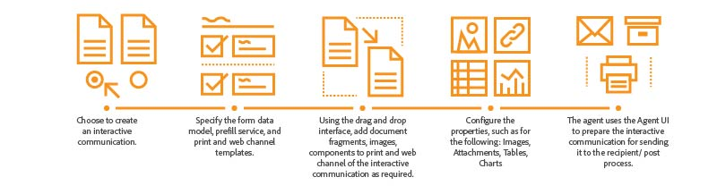

# Información general sobre comunicaciones interactivas {#interactive-communications-overview}

Este artículo incluye información general, casos de uso de muestra, flujo de trabajo de creación y diferencias entre la comunicación interactiva y la carta.

Interactive Communications centraliza y administra la creación, el ensamblaje y la entrega de correspondencia segura, personalizada e interactiva, como correspondencia comercial, documentos, declaraciones, avisos de beneficios, correos de marketing, facturas y kits de bienvenida.

## Funcionalidades clave {#key-capabilities}

A continuación se muestran las funciones clave de Interactive Communications:

- Integración predeterminada con el modelo de datos de formulario para permitir un acceso fácil y sencillo a las bases de datos back-end y a otros sistemas CRM, como MS® Dynamics
- Interfaz de creación integrada para canales web e impresos con capacidad para generar automáticamente canales web a partir del canal de impresión
- Gráficos para presentar información en formatos visuales fácilmente comprensibles en impresión y Web
- Los fragmentos de documento admiten el editor de reglas y el modelo de datos de formulario
- La interfaz de usuario del agente muestra la impresión y la vista previa web de la comunicación interactiva
- Arrastrar y soltar componentes para construir rápidamente canales web y de impresión

## Creación de comunicaciones interactivas {#interactive-communication-creation}

### Flujo de trabajo {#workflow}

Para crear una comunicación interactiva, haga que los [componentes](#buildingblocks) de la comunicación interactiva estén listos y, a continuación, complete los siguientes pasos:

1. Elija [crear una comunicación interactiva](/help/forms/using/create-interactive-communication.md).

1. Especifique el [modelo de datos de formulario](/help/forms/using/data-integration.md), el servicio de rellenado previo y las [plantillas de impresión y canal web](/help/forms/using/web-channel-print-channel.md). Puede elegir generar el canal web a partir del canal de impresión.

1. Con la [interfaz de arrastrar y soltar](/help/forms/using/introduction-interactive-communication-authoring.md), añada fragmentos de documento, imágenes, componentes a la impresión y al canal web de la comunicación interactiva según sea necesario.
1. Configure las propiedades de los componentes insertados, como por ejemplo:

   1. [Imágenes](/help/forms/using/create-interactive-communication.md#step2)
   1. [Tablas](/help/forms/using/create-interactive-communication.md#tables)  (Incluidos Los Fragmentos De Diseño)
   1. [Gráficos](/help/forms/using/chart-component-interactive-communications.md)
   1. [Fragmentos de documento](/help/forms/using/create-interactive-communication.md#document-fragment-properties)

1. Obtenga una vista previa de los canales impresos y web y, si es necesario, edite la comunicación interactiva.
1. El agente utiliza la interfaz de usuario del agente para [preparar la comunicación interactiva](/help/forms/using/prepare-send-interactive-communication.md) para enviarla al proceso de destinatario/publicación.

### Componentes {#buildingblocks}

A continuación se indican los componentes básicos necesarios para crear una comunicación interactiva:

- [Modelo de datos de formulario](/help/forms/using/data-integration.md)
- [Plantillas de canal web e impresión](/help/forms/using/web-channel-print-channel.md)
- [Fragmentos de documento](/help/forms/using/document-fragments.md)
- Imágenes
-  Temas para el canal web

## Comunicaciones Interactivas Y Administración De Correspondencia {#interactive-communications-vs-correspondence-management}

La comunicación interactiva es el enfoque predeterminado y recomendado para crear comunicaciones con los clientes. Para seguir utilizando las letras creadas en AEM 6.3 Forms y AEM 6.2 Forms, debe [instalar un paquete de compatibilidad](/help/forms/using/compatibility-package.md). A continuación se muestra una comparación entre las capacidades de la comunicación interactiva y la carta.

<table>
 <tbody>
  <tr>
   <td><strong>Capacidad</strong></td>
   <td><strong>Comunicación interactiva</strong></td>
   <td><strong>Carta</strong></td>
  </tr>
  <tr>
   <td>Salida</td>
   <td>Imprimir y Web</td>
   <td>Imprimir</td>
  </tr>
  <tr>
   <td>Esquema</td>
   <td>Modelo de datos de formulario </td>
   <td>Diccionario de datos </td>
  </tr>
  <tr>
   <td>Localización</td>
   <td>No se admite en el modelo de datos de formulario</td>
   <td>Admitido en el diccionario de datos</td>
  </tr>
  <tr>
   <td>Editor de reglas</td>
   <td>
    <ul>
     <li>Editor de reglas de compatibilidad de texto y condición para crear condiciones en línea</li>
     <li>El editor de comunicación interactiva admite la aplicación de reglas en los componentes del canal web</li>
    </ul> </td>
   <td>No hay IU para la creación de expresiones condicionales</td>
  </tr>
  <tr>
   <td>Creación  </td>
   <td>Interfaz de arrastrar y soltar para construir canales web e impresos</td>
   <td>No hay mecanismo de arrastrar y soltar </td>
  </tr>
  <tr>
   <td>Gráficos</td>
   <td>Gráficos admitidos tanto en impresión como en canal web</td>
   <td>No se admite</td>
  </tr>
  <tr>
   <td>Temas</td>
   <td>Utiliza temas para aplicar estilo al canal web</td>
   <td>No admite temas</td>
  </tr>
   <tr>
   <td>Borradores</td>
   <td>Compatible</td>
   <td>Compatible</td>
  </tr>
  <tr>
   <td>Auditoría</td>
   <td>No compatible</td>
   <td>Compatible</td>
  </tr>
   <tr>
   <td>Versiones</td>
   <td>No compatible</td>
   <td>Compatible</td>
  </tr>
   <tr>
   <td>Borradores Administrar instancias</td>
   <td>No compatible</td>
   <td>Compatible</td>
  </tr>
  <tr>
   <td>Procesamiento por lotes</td>
   <td>Compatible </td>
   <td>Compatible</td>
  </tr>
  <tr>
   <td>Firma del agente</td>
   <td>No se admite</td>
   <td>Compatible</td>
  </tr>
  <tr>
   <td>Funciones remotas</td>
   <td>No se admite</td>
   <td>Compatible</td>
  </tr>
 </tbody>
</table>
