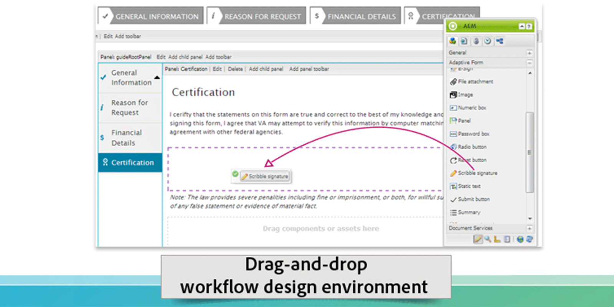

# Introducción a AEM Forms{#introduction-to-aem-forms}

| Versión | Vínculo del artículo |
| -------- | ---------------------------- |
| AEM as a Cloud Service | [Haga clic aquí](https://experienceleague.adobe.com/docs/experience-manager-cloud-service/content/forms/forms-overview/home.html) |
| AEM 6.5 | Este artículo |

Para obtener información sobre las últimas funciones y mejoras de AEM Forms, consulte [Novedades de AEM Forms](../../forms/using/whats-new.md).

## Acerca de AEM Forms {#about-aem-forms}

Adobe Experience Manager (AEM) ofrece una solución fácil de usar para crear, administrar, publicar y actualizar formularios digitales complejos a la vez que se integra con procesos back-end, reglas empresariales y datos.

AEM Forms combina la creación, administración y publicación de formularios junto con las capacidades de Administración de correspondencia, Document Security y análisis integrados para crear experiencias de extremo a extremo atractivas. Diseñado para funcionar en todos los canales web y móviles, AEM Forms puede integrarse de forma eficaz en sus procesos empresariales, reduciendo los procesos y errores en papel y mejorando al mismo tiempo la eficiencia.

En las grandes empresas, los formularios suelen crearse una vez y reutilizarse copiándolos a un sistema de gestión de contenidos. Mantener actualizada una gran base de datos de formularios y conseguir que estos resulten reconocibles puede constituir un auténtico reto. AEM proporciona un portal de formularios personalizable que garantiza que los clientes puedan localizar y acceder a los formularios que necesitan en los canales web y móviles.

AEM Forms proporciona herramientas de administración de formularios que no solo le permiten administrar formularios adaptables, sino también formularios XFA, formularios PDF y recursos relacionados. Para obtener más información, consulte [Introducción a la administración de formularios](../../forms/using/introduction-managing-forms.md).

### Capacidades clave {#key-capabilities}

En resumen, AEM Forms proporciona potentes funciones de administración de formularios, como las siguientes, que reducen los procesos manuales y aumentan la satisfacción del cliente.

* Un portal de formularios centralizado para diseñar e implementar formularios dinámicos, incluidos formularios PDF, HTML5 y adaptables.
* Una interfaz gráfica de usuario fácil de usar para que los usuarios empresariales puedan importar, administrar, previsualizar y publicar fácilmente formularios.
* Un directorio de formularios adaptable con potentes características de búsqueda mediante palabras clave, etiquetas y metadatos.
* Detección dinámica del dispositivo y la ubicación de un usuario para representar correctamente el formulario en los canales web y móvil.
* Integración con Adobe Analytics para medir de forma eficaz las métricas de uso de los formularios.
* Integración con los servicios de firma electrónica o la firma manuscrita de Adobe Document Cloud para firmar electrónicamente documentos que contengan información confidencial.
* Funcionalidades automatizadas de publicación de formularios y la capacidad de proporcionar una comunicación oportuna, personalizada y coherente a través de varios canales.

## Tipo de formularios de AEM {#aem-form-types}

AEM Forms permite ampliar formularios nuevos y existentes para crear:

* Formularios HTML y PDF paginados con una apariencia Pixel Perfect prácticamente idéntica a la del papel, o
* formularios adaptables que se representan automáticamente en el dispositivo y el explorador del usuario.

**Formularios PDF**

Es posible rellenar los formularios PDF sin conexión, guardarlos localmente y enviar los datos de formulario la próxima vez que vuelva a estar en línea. Los códigos de barras 2D se pueden usar para capturar datos de formulario, y las firmas digitales para validar la autenticidad de los usuarios.

**Formularios HTML**

Los formularios HTML5 basados en explorador se pueden ver tanto en dispositivos móviles como en exploradores de escritorio. Puede firmar electrónicamente los formularios HTML mediante la firma manuscrita o los servicios de firma electrónica.

**Formularios adaptables**

Los formularios adaptables se pueden adaptar dinámicamente a las respuestas del usuario añadiendo o eliminando campos o secciones según sea necesario. AEM permite reutilizar las plantillas de formulario XML de Adobe para crear formularios adaptables.

### Funciones admitidas {#supported-features}

Todos los tipos de formulario admiten las siguientes funciones:

* Diseño dinámico
* Validación de los campos de formulario
* Ayuda contextual
* Administración de datos XML y scripts
* Diseño y comprobación de accesibilidad
* Posibilidad de guardar formularios en el servidor
* Compatibilidad con archivos adjuntos
* Integración con HTML Workspace para la captura de datos

## Recopilación de datos sin conexión {#offline-data-collection}

Una vez enviados los datos de formulario, Adobe Experience Manager los conecta con los sistemas existentes, las reglas empresariales y las personas requeridas.

AEM Forms proporciona Forms Workspace, una aplicación móvil que amplía los procesos empresariales digitales a los dispositivos móviles. Con Forms Workspace, puede recopilar y registrar datos incluso sin conexión. Forms Workspace utiliza las capacidades de su dispositivo móvil y le permite capturar fotos y vídeos y recopilar datos como marcas de tiempo y otro tipo de información. La próxima vez que se conecte a una red, puede sincronizar los datos recopilados.

Capturar los datos sin conexión y sincronizarlos la próxima vez que vuelva a estar en línea resulta especialmente útil para las personas que trabajan sobre el terreno. Mejora la productividad y reduce los errores.

**Ventajas de utilizar Forms Workspace para la recopilación de datos sin conexión**

* HTML Workspace es una aplicación fácil de usar para la asignación y el seguimiento de tareas
* Entorno de diseño del flujo de trabajo de arrastrar y soltar
* Conectores de gestión de contenido empresarial (ECM)
* Compatibilidad con estándares abiertos, incluidos XML y SOAP, para conectar datos de formularios con sistemas empresariales
* Los informes HTML predeterminados monitorizan los trabajos pendientes, las colas de trabajo y los indicadores clave de rendimiento (KPI)
* Paneles personalizables para obtener información en tiempo real sobre las operaciones empresariales
* API para conectarse con herramientas de informes de terceros

## Comunicación personalizada {#personalized-communication}

Uno de los principales componentes de una experiencia de autoservicio digital eficaz es la comunicación de información oportuna y personalizada, de forma que los usuarios puedan acceder a ella desde cualquier parte y en cualquier dispositivo. Las comunicaciones personalizadas y oportunas pueden mejorar tanto las tasas de conversión como la satisfacción del usuario.

Con AEM Forms, los usuarios empresariales pueden crear experiencias del usuario personalizadas y atractivas personalizando las plantillas de documento, incorporando información de los procesos back-end e incluyendo componentes interactivos. Una interfaz de usuario intuitiva ayuda a los usuarios sin conocimientos técnicos a desarrollar reglas empresariales para decidir cuándo generar una comunicación en función de una consulta o iniciar una respuesta generada por el usuario.

Los documentos personalizados, como los recibos, los kits de bienvenida y los extractos, se pueden entregar fácilmente a través de diferentes canales. Las organizaciones pueden dirigir el tráfico a portales web personalizados, lo que favorece la inscripción en servicios adicionales o su compra.

**Funciones principales**

* Entorno de creación de correspondencia compatible con plantillas, bloques de contenido, reglas empresariales y mucho más
* Conversión y ensamblado de documentos
* Compatibilidad con el envío de documentos a la carta o por lotes a través de varios canales, incluidos la web, el correo electrónico y el papel
* Pista de auditoría con historial de cambios
* Compatibilidad con firmas digitales para validar la integridad del contenido y la identidad del firmante
* Complemento Document Security de AEM Forms, que incluye cifrado, políticas de uso, seguimiento y auditoría

Flujo de trabajo de comunicación personalizado y optimizado

>[!NOTE]
>
>La función Adaptive Forms AEM, disponible en QuickStart de la versión 6.5 de la versión, está diseñada únicamente para fines de exploración y evaluación. Para su uso en producción, es esencial obtener una licencia válida para AEM Forms, ya que la funcionalidad de Forms adaptable requiere una licencia adecuada.
