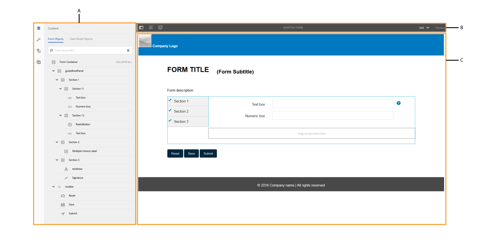
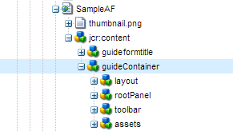

# Introducción a la creación de formularios adaptables {#introduction-to-authoring-adaptive-forms}

## Información general {#overview}

Los formularios adaptables le permiten crear formularios atractivos, interactivos, dinámicos y adaptables. AEM Forms proporciona una interfaz de usuario intuitiva y componentes integrados para crear y trabajar con formularios adaptables. Puede elegir crear un formulario adaptable basado en un modelo o esquema de formulario o sin un modelo de formulario. Es importante elegir cuidadosamente el modelo de formulario que no sólo se adapte a sus necesidades sino que amplíe sus inversiones y recursos de infraestructura existentes. Puede elegir entre las siguientes opciones para crear un formulario adaptable:

* **Uso de un modelo de datos de formulario**
   [La ](../../forms/using/data-integration.md) integración de datos permite integrar entidades y servicios de orígenes de datos dispares en un modelo de datos de formulario que se puede utilizar para crear formularios adaptables. Elija el modelo de datos de formulario si el formulario adaptable que está creando implica recuperar y escribir datos desde y hacia varios orígenes de datos.

* **Uso de una**
plantilla de formulario XDPes un modelo de formulario ideal si tiene inversiones en formularios XFA o XDP. Proporciona una forma directa de convertir los formularios basados en XFA en formularios adaptables. Las reglas XFA existentes se conservan en los formularios adaptables asociados. Los formularios adaptables resultantes admiten construcciones XFA, como validaciones, eventos, propiedades y patrones.

* **Los esquemas XML y JSON de Definición de Esquema XML (XSD) o**
Esquema JSON representan la estructura en la que el sistema back-end de la organización produce o consume los datos. Puede asociar el esquema a un formulario adaptable y utilizar sus elementos para agregar contenido dinámico al formulario adaptable. Los elementos del esquema estarán disponibles para su uso en la ficha Objetos del modelo de datos del navegador de contenido al crear formularios adaptables.

* **Usar ninguno o sin**
modelo de formularioLos formularios adaptables creados con esta opción no utilizan ningún modelo de formulario. El XML de datos generado a partir de estos formularios tiene una estructura plana con campos y valores correspondientes.

Para obtener más información sobre la creación de un formulario adaptable, consulte [Creación de un formulario adaptable](../../forms/using/creating-adaptive-form.md).

## IU de creación de formularios adaptable {#adaptive-form-authoring-ui}

La IU táctil para la creación de formularios adaptables es intuitiva y proporciona:

* Funcionalidad de arrastrar y soltar
* Componentes de formulario estándar
* Repositorio integrado para recursos

Al crear un formulario adaptable nuevo o editar uno existente, se utilizan los siguientes elementos de la interfaz de usuario:

* [Barra lateral](#sidebar)
* [Barra de herramientas de página](#page-toolbar)
* [Barra de herramientas Componente](#component-toolbar)
* [Página de formulario adaptable](#af-page)

**A.** Barra lateral  **B.Barra de herramientas** de página  **C.Página de formulario** adaptable

### Barra lateral {#sidebar}

La barra lateral permite

* Consulte el contenido del formulario, como paneles, componentes, campos y presentación.
* Edite las propiedades del componente.
* Busque, vista y utilice recursos en el repositorio de AEM Digital Asset Management (DAM).
* Añada componentes en el formulario.

**A.** Navegador de contenido  **B.** Navegador de propiedades  **C.** Recursos navegador  **D.** Componentes

<!--Click to enlarge

](assets/sidebar-comps-1.png) -->

La barra lateral comprende los siguientes exploradores:

* **Navegador**
de contenidoEn el navegador de contenido, puede ver

   * **Objetos**
de formularioMuestra la jerarquía de objetos del formulario. El autor puede desplazarse a un componente de formulario específico tocando ese elemento en el árbol de objetos de formulario. El autor puede buscar objetos y reorganizarlos desde este árbol.

   * **Objetos**
del modelo de datosPermite ver la jerarquía del modelo de formulario.
Permite arrastrar y soltar elementos del modelo de formulario en el formulario adaptable. Los elementos agregados se convierten automáticamente en componentes de formulario mientras se conservan sus propiedades originales. Puede ver objetos del modelo de datos cuando el formulario utiliza esquema XML, esquema JSON o plantilla XDP.

* **Navegador de propiedades**

   Permite editar las propiedades de un componente. Las propiedades cambian según un componente. Para ver las propiedades del contenedor de formulario adaptable:

   Seleccione un componente, luego toque  > **[!UICONTROL Contenedor de formulario adaptable]** y luego toque .

* **Navegador de recursos**

   Segmenta distintos tipos de contenido, como imágenes, documentos, páginas, películas, etc.

* **Navegador de componentes**

   Incluye componentes que se pueden utilizar para crear un formulario adaptable. Puede arrastrar componentes desde a un formulario adaptable para agregar elementos de formulario y configurar elementos agregados según los requisitos. En la tabla siguiente se describen los componentes enumerados en el navegador de componentes.

<table>
 <tbody>
  <tr>
   <th><strong>Componente</strong></th>
   <th><strong>Funcionalidad</strong></th>
  </tr>
  <tr>
   <td>Bloque de Adobe Sign</td>
   <td>Añade un bloque de texto con marcadores de posición para los campos que se van a rellenar al firmar con Adobe Sign.</td>
  </tr>
  <tr>
   <td>Botón</td>
   <td>Añade un botón, que puede configurar para realizar acciones como guardar, restablecer, ir a continuación, ir anterior, etc.</td>
  </tr>
  <tr>
   <td>Captcha</td>
   <td>Añade la validación de CAPTCHA mediante el servicio Google reCAPTCHA. Para obtener más información, consulte <a href="../../forms/using/captcha-adaptive-forms.md" target="_blank">Uso de CAPTCHA en formularios adaptables</a>.</td>
  </tr>
  <tr>
   <td>Gráfico</td>
   <td>Añade un gráfico que se puede utilizar en formularios y documentos adaptables para la representación visual de datos bidimensionales en paneles repetitivos y filas de tabla.</td>
  </tr>
  <tr>
   <td>Casilla de verificación</td>
   <td>Añade una casilla de verificación.</td>
  </tr>
  <tr>
   <td>Campo de introducción de fecha</td>
   <td>Utilice el componente Campo de entrada de fecha en el formulario para permitir que los clientes rellenen el día, el mes y el año por separado en tres cuadros. Puede personalizar el aspecto del componente y cambiar el formato de fecha. Por ejemplo, puede permitir que los clientes introduzcan fechas en formato MM/DD/AAAA o DD/MM/AAAA.</td>
  </tr>
  <tr>
   <td>Selector de fecha</td>
   <td>Añade un campo de calendario para elegir una fecha.</td>
  </tr>
  <tr>
   <td>Fragmento de documento</td>
   <td>Permite agregar componentes reutilizables de una correspondencia.</td>
  </tr>
  <tr>
   <td>Grupo de fragmentos de documento</td>
   <td>Permite agregar un grupo de fragmentos de documento relacionados que puede utilizar en una plantilla de carta como una sola unidad.</td>
  </tr>
  <tr>
   <td>Lista desplegable</td>
   <td>Añade una lista desplegable: selección única o múltiple</td>
  </tr>
  <tr>
   <td>Correo electrónico</td>
   <td>
Añade un campo para capturar la dirección de correo electrónico. El componente Correo electrónico, de forma predeterminada, valida las direcciones de correo electrónico mediante la siguiente expresión regular.
 
<code>^[a-zA-Z0-9.!#$%&amp;’*+/=?^_`{|}~-]+@[a-zA-Z0-9-]+(?:.[a-zA-Z0-9-]+)*$</code>
 </td>
  </tr>
  <tr>
   <td>Adjuntar archivo</td>
   <td>
Añade un botón que permite a los usuarios examinar y adjuntar documentos de apoyo a un formulario. Puede adjuntar varios archivos a un componente Archivo adjunto.
 
<strong> Nota: </strong><ul> <li> El componente no admite adjuntar archivos con un nombre de archivo que comience por caracteres (.), que contengan caracteres \ / : * ? " &lt; &gt; | ; % $, o que contiene nombres de archivo especiales reservados para el sistema operativo Windows como nul, prn, con, lpt o com. </li> <li> Para adjuntar varios archivos a un componente de archivo adjunto abierto en el navegador Apple Safari, seleccione y adjunte archivos uno a uno. No puede seleccionar y adjuntar varios archivos a la vez.</li> <li>El componente Archivo adjunto admite un conjunto predefinido de formatos de archivo en formularios adaptables activados para Adobe Sign. Para obtener más información, consulte <a href="https://helpx.adobe.com/document-cloud/help/supported-file-formats-fill-sign.html#main-pars_text">Formatos de archivo admitidos</a>. </li> </ul>
 </td>
  </tr>
  <tr>
   <td>Lista de archivos adjuntos</td>
   <td>Añade un campo que lista todos los archivos adjuntos cargados mediante el componente Archivo adjunto.</td>
  </tr>
  <tr>
   <td>Encabezado  </td>
   <td>Añade el encabezado de página que generalmente incluye el logotipo de una empresa, el título del formulario y el resumen.  </td>
  </tr>
  <tr>
   <td>Pie de página</td>
   <td>Añade el pie de página que generalmente incluye información de copyright y vínculos a otras páginas. </td>
  </tr>
  <tr>
   <td>Imagen</td>
   <td>Permite insertar una imagen.</td>
  </tr>
  <tr>
   <td>Opción de imagen</td>
   <td>Permite a los clientes seleccionar una imagen para proporcionar información. Puede utilizar la información para proporcionar servicios personalizados a sus clientes.</td>
  </tr>
  <tr>
   <td>Botón Siguiente</td>
   <td>Añade un botón para desplazarse al siguiente panel de un formulario.</td>
  </tr>
  <tr>
   <td>Cuadro numérico</td>
   <td>Añade un campo para capturar valores numéricos</td>
  </tr>
  <tr>
   <td>Stepper numérico</td>
   <td>Utilice Numeric Stepper en el formulario para permitir que los clientes introduzcan un valor numérico, que pueden aumentar o disminuir en función de un paso predefinido.</td>
  </tr>
  <tr>
   <td>Panel</td>
   <td>
Añade un panel o subpanel.
 
También puede agregar un componente de panel desde la barra de herramientas del panel principal mediante el botón Añadir panel secundario</code>. Del mismo modo, puede agregar una barra de herramientas específica del panel mediante el botón Añadir barra de herramientas del panel</code>. Puede configurar la posición de la barra de herramientas del panel mediante el cuadro de diálogo Editar panel.</code></code>
 </td>
  </tr>
  <tr>
   <td>Cuadro de contraseña</td>
   <td>Añade un campo para capturar una contraseña.</td>
  </tr>
  <tr>
   <td>Botón Anterior</td>
   <td>Añade un botón que los usuarios necesitan para volver a la página o panel anterior.</td>
  </tr>
  <tr>
   <td>Botón de opción</td>
   <td>Añade los botones de radio.</td>
  </tr>
  <tr>
   <td>Botón Restablecer</td>
   <td>Añade un botón para restablecer los campos del formulario.</td>
  </tr>
  <tr>
   <td>Botón Guardar</td>
   <td>Añade un botón para guardar datos de formulario.</td>
  </tr>
  <tr>
   <td>Firma manuscrita</td>
   <td>Añade un campo para capturar firmas de garabatos.</td>
  </tr>
  <tr>
   <td>Separador</td>
   <td>Permite la segregación visual de paneles en el formulario.</td>
  </tr>
  <tr>
   <td>Paso de firma</td>
   <td>Muestra la información proporcionada en el formulario y los campos de firma para que el usuario pueda verificarlo y firmarlo.</td>
  </tr>
  <tr>
   <td>Texto</td>
   <td>Permite especificar texto estático.</td>
  </tr>
  <tr>
   <td>Botón de envío</td>
   <td>Añade un botón de envío para enviar el formulario a la acción de envío configurada.</td>
  </tr>
  <tr>
   <td>Paso de resumen</td>
   <td>Envía el formulario y muestra el texto de resumen que especifican los autores después de enviarlo. </td>
  </tr>
  <tr>
   <td>Cambiar</td>
   <td>Añade un conmutador que realiza una acción de alternancia o de activación/desactivación. No puede agregar más de dos opciones en el componente Switch. Dado que un conmutador solo puede tener dos valores: Activado o Desactivado, no es obligatorio. Se guarda al menos un valor independientemente de la entrada del usuario.   </td>
  </tr>
  <tr>
   <td>Tabla</td>
   <td>Agrega una tabla que le permite organizar los datos en filas y columnas. </td>
  </tr>
  <tr>
   <td>Teléfono</td>
   <td>
Añade un campo para capturar el número de teléfono. El componente Teléfono permite a los autores configurar uno de los siguientes tipos de números de teléfono. Cada tipo está asociado con una expresión regular predeterminada para la validación.

    <ul>
     <li>Type International se valida por <code>^[+][0-9]{0,14}$</code>.</li>
     <li>El tipo USPhoneNumber está validado por <code>{'+1 ('999') '999-9999}</code>.</li>
     <li>El tipo UKPhoneNumber está validado por <code>text{'+'99 999 999 9999}</code>.</li>
     <li>Tipo personalizado no proporciona un patrón de validación predeterminado. Toma el valor del último tipo de número de teléfono seleccionado. También puede especificar su propio patrón de validación personalizado.</li>
    </ul> </td>
  </tr>
  <tr>
   <td>Términos y condiciones  </td>
   <td>Añade un campo que los autores pueden utilizar para especificar los términos y condiciones que los usuarios deben revisar antes de rellenar el formulario.</td>
  </tr>
  <tr>
   <td>Cuadro de texto </td>
   <td>
Añade un cuadro de texto en el que un usuario puede especificar la información requerida. 
 
De forma predeterminada, el componente Cuadro de texto solo acepta texto sin formato. Puede habilitar un componente Cuadro de texto para aceptar Texto enriquecido. Un componente de texto enriquecido habilitado proporciona opciones para agregar encabezados, cambiar estilos de carácter (negrita, cursiva, subrayado de caracteres), crear listas ordenadas y sin ordenar, cambiar el fondo del texto y el color del texto, y agregar hipervínculos. Para habilitar texto enriquecido para un cuadro de texto, habilite la opción<strong> Permitir texto enriquecido</strong> en las propiedades del componente.
 </td>
  </tr>
  <tr>
   <td>Título</td>
   <td>Especifica un título para el formulario adaptable.</td>
  </tr>
  <tr>
   <td>Paso de verificación</td>
   <td>
Añade un marcador de posición para mostrar el formulario cumplimentado para su verificación por el usuario.
 
<strong>Nota</strong>: El formulario adaptable que contiene el componente Verificar no admite usuarios anónimos. Además, no se recomienda utilizar el componente Verificar en un fragmento de formulario adaptable.
 </td>
  </tr>
 </tbody>
</table>

#### Prácticas recomendadas para trabajar con componentes {#best-practices}

Algunas prácticas recomendadas y puntos clave que hay que recordar al trabajar con componentes de formularios adaptables son los siguientes:

* Cada componente tiene propiedades asociadas que controlan su apariencia y funcionalidad. Para configurar las propiedades de un componente, toque el componente y toque  para abrir las propiedades del componente en el navegador de propiedades.
* Un componente se identifica con su nombre de elemento. Al tocar , puede cambiar el nombre del componente cambiando el valor del campo **[!UICONTROL Nombre del elemento]** en el explorador de propiedades. El campo Nombre del elemento solo acepta letras, números, guiones (-) y subrayados (_). No se permiten otros caracteres especiales y el nombre del elemento debe comenzar con una letra.

* Puede modificar la propiedad Título de un componente de formulario adaptable en línea en el editor de formularios sin necesidad de abrir el navegador Propiedades siempre que el título esté visible en el formulario. Para ello:

   1. Toque para seleccionar un componente que tenga una propiedad **[!UICONTROL Title]** y cuya propiedad **[!UICONTROL Hide title]** esté deshabilitada.

   1. Toque  para que el título se pueda editar.

   1. Modifique el título y toque la tecla de retorno o toque cualquier lugar fuera del componente para guardar los cambios. Toque la tecla Esc para descartar los cambios.

* Algunos componentes de formulario adaptables como Correo electrónico y Teléfono incluyen patrones de validación predeterminados. Sin embargo, puede especificar la validación personalizada actualizando el campo **[!UICONTROL Patrón de validación]** en el acordeón Patrones de las propiedades del componente. Consulte las descripciones de los componentes en la tabla anterior para obtener más información sobre las validaciones predeterminadas.

* Los campos de formularios adaptables, como Cuadro numérico y Correo electrónico, se pueden configurar para incluir tipos de entrada HTML5 especializados. Cuando estos campos están enfocados en dispositivos móviles y tabletas, el teclado muestra alfabeto, números y caracteres específicos por adelantado que se utilizan comúnmente para introducir información en los campos. Ayuda a los usuarios a introducir información rápidamente sin tener que alternar entre conjuntos de caracteres en el teclado. Para permitir la entrada especializada de un componente, active la casilla de verificación **[!UICONTROL Usar número de tipo HTML]** en sus propiedades de componente.

* Puede habilitar un componente Cuadro de texto para aceptar Texto enriquecido. Para habilitar el texto enriquecido para un cuadro de texto, active la casilla de verificación **[!UICONTROL Permitir texto enriquecido]** en las propiedades del componente.

* Puede activar los componentes Cuadro de texto, Correo electrónico y Teléfono para rellenar automáticamente los valores de campos como nombre, dirección, tarjeta de crédito, teléfono y correo electrónico a partir de la información almacenada en la configuración de relleno automático del explorador. Para habilitar esta función, seleccione **[!UICONTROL Habilitar relleno automático]** en las propiedades del componente y seleccione un **[!UICONTROL Atributo de relleno automático]**. Cuando un usuario rellena un formulario adaptable, los valores se sugieren desde el perfil de relleno automático en el navegador o en función de los valores que el usuario haya rellenado anteriormente. Tenga en cuenta que el relleno automático funciona si la configuración de relleno automático está activada en el navegador del usuario.

* Especifique los valores de los elementos Botón de radio y Casilla de verificación en formato `{value}={text}` en las propiedades del componente.
* El componente Archivo adjunto, de forma predeterminada, permite al usuario adjuntar un solo archivo. Sin embargo, puede configurar las propiedades del componente para que admitan varios archivos adjuntos. Además, si un usuario adjunta varios archivos con el mismo nombre de archivo, los archivos adjuntos pueden provocar algunos problemas. Por lo tanto, se recomienda asociar un identificador único para cada archivo adjunto enviado en el envío del formulario. Para ello:

   1. En el servidor de AEM Forms, vaya a **[!UICONTROL Adobe Experience Manager]** > **[!UICONTROL Herramientas]** > **[!UICONTROL Operaciones]** > **[!UICONTROL Consola Web]**.
   1. Busque y toque **[!UICONTROL Servicio de configuración adaptable de Forms]**.
   1. En el cuadro de diálogo Servicio de configuración adaptable de Forms, habilite **[!UICONTROL Convertir nombres de archivo en únicos]**. De forma predeterminada, está desactivado.

* Para permitir que los usuarios adjunten un PDF mediante el navegador Safari, asegúrese de que **application/pdf** se agrega a la propiedad Tipos de archivo admitidos del componente Archivo adjunto. Los formularios adaptables creados con la versión anterior de AEM Forms pueden contener **.pdf** en lugar de **application/pdf** en la propiedad Tipos de archivos admitidos.

Para obtener más información sobre las prácticas recomendadas en los formularios adaptables, consulte [Prácticas recomendadas para trabajar con formularios adaptables](/help/forms/using/adaptive-forms-best-practices.md).

>[!NOTE]
>
>Los componentes de formulario adaptables no admiten idiomas de derecha a izquierda (RTL). Por ejemplo, hebreo.

### Barra de herramientas de página {#page-toolbar}

La barra de herramientas de la página de la parte superior ofrece opciones que le permiten previsualización del formulario, cambiar sus propiedades y editar la presentación del formulario. Puede realizar la previsualización del formulario al crearlo y realizar los cambios correspondientes. En la barra de herramientas de la página, verá:

* **Alternar** : Permite mostrar u ocultar la barra lateral.

* **Información** : Le permite vista de propiedades de página, publicar/cancelar la publicación de un formulario, inicio de un flujo de trabajo de formulario y abrir el formulario en la IU clásica.

* **** : Permite emular el aspecto del formulario para diferentes tamaños de visualización, como tablets y teléfonos.

* **Editar**: Permite seleccionar otros modos como:  **[!UICONTROL Editar]**,  **[!UICONTROL Estilo]**,  **[!UICONTROL Desarrollador]** y  **[!UICONTROL Diseño]**.

   * **Editar**: Permite editar las propiedades del formulario y sus componentes. Por ejemplo, agregar un componente, soltar una imagen y especificar campos obligatorios.
   * **Estilo**: Permite aplicar estilo al aspecto de los componentes del formulario. Por ejemplo, en el modo de estilo, puede seleccionar un panel y especificar su color de fondo.

   * **Desarrollador**: Permite a un desarrollador:

      * Descubra de qué formularios se componen.
      * Depurar lo que está sucediendo donde y cuando, lo que a su vez ayuda a resolver problemas.
   * **Diseño**. Permite habilitar o deshabilitar componentes personalizados o componentes predeterminados que no aparecen en la barra lateral.

* **Previsualización**: Permite realizar previsualizaciones del aspecto del formulario al publicarlo.

### Barra de herramientas de componentes {#component-toolbar}

Al seleccionar un componente, verá una barra de herramientas que le permite trabajar con él. Se obtienen opciones para cortar, pegar, mover y especificar propiedades de los componentes. Sus opciones son:

A.**Configurar**: Al tocar **[!UICONTROL Configurar]**, las propiedades de los componentes son visibles en la barra lateral. La configuración de estas propiedades permite personalizar la experiencia de captura de datos. Puede cambiar el nombre del elemento del componente, especificar el texto de la etiqueta en el campo Título del componente. El nombre del elemento permite capturar los valores que introducen los usuarios mediante el componente. En las propiedades del componente, se especifica el comportamiento del componente y se gestionan los datos introducidos por el usuario. Configure las propiedades en la barra lateral para capturar los datos de usuario y usarlos para un procesamiento posterior. Las propiedades del contenedor de formulario adaptable permiten especificar las bibliotecas de cliente, los diseños, las Temáticas, el Documento de la configuración de registro, la configuración de guardado, la configuración de envío y la configuración de metadatos.

B.**Copiar**: Puede utilizar la opción de copia para copiar un componente y pegarlo en otros lugares del formulario. Al pegar un componente, el componente pegado obtiene un nuevo nombre de elemento pero conserva las propiedades del componente copiado.

C.**Cortar**: Puede utilizar la opción de corte para mover un componente de un lugar a otro en el formulario adaptable.

D. **Eliminar**: Permite eliminar el componente del formulario.

E. **Insertar**: Permite insertar un componente sobre el componente seleccionado.

F. **Pegar**: Permite pegar el componente que se corta o copia mediante las opciones descritas anteriormente.

G. **Editar reglas**: Permite abrir el editor de reglas. Para obtener más información, consulte [Editor de reglas](../../forms/using/rule-editor.md).

H. **Grupo**: Permite seleccionar varios componentes si desea cortar, copiar o pegar varios componentes juntos.

I. **Principal**: Permite seleccionar el elemento principal de un componente. Por ejemplo, un campo de texto se encuentra dentro de una subsección, que reside en una sección. La sección reside en el panel raíz de la guía y el contenedor de formulario adaptable es el principal de un panel raíz de guía. Para un componente, puede ver todas las opciones con la jerarquía ordenada en la parte inferior.

Por ejemplo, si toca **[!UICONTROL Principal]** para un cuadro de texto, puede ver:

* Subsección
* Sección
* guideRootPanel
* Contenedor de formulario adaptable

J. **Otros**: Proporciona más opciones para trabajar con el componente seleccionado.

* Expresión SOM de vista
* Guardar un panel como fragmento (solo para paneles)
* Añadir panel secundario (solo para paneles)
* Añadir barra de herramientas del panel (solo para paneles)
* Reemplazar (no para paneles)

### Página de formulario adaptable {#af-page}

La página de formulario adaptable es el formulario real. Es como cualquier otra página WCM modelada como el componente WCM `cq:Page`. La siguiente imagen muestra la estructura de contenido de un formulario adaptable típico.

La estructura de contenido suele contener los siguientes componentes principales:

* **guideContainer**: Raíz de un formulario adaptable, que se marca como  **[!UICONTROL Inicio del]** formulario adaptable en la interfaz de usuario del formulario adaptable. En este componente, puede especificar:

   * *Diseño móvil del formulario* adaptable: Define el aspecto del formulario en dispositivos móviles.
   * *Página* de agradecimiento: Define la página a la que se redirige al usuario después de enviar el formulario.
   * *Enviar acción*: Define cómo se procesa el formulario en el servidor una vez que el usuario lo envía.
   * *Estilo*: Especifica la ruta al archivo CSS utilizado para personalizar el aspecto del formulario.

* **rootPanel:** panel raíz de un formulario adaptable. Puede contener subpaneles en el nodo items. Cada panel, incluido el panel raíz, puede tener un diseño asociado. La presentación del panel dicta el diseño del formulario. Por ejemplo, en la maquetación Acordeón, sus elementos están dispuestos como pasos de Acordeón.

* **barra de herramientas:** Un contenedor de formulario adaptable tiene una barra de herramientas global asociada, que es global para el formulario. Esta barra de herramientas se puede agregar mediante la acción **[!UICONTROL Añadir barra de herramientas]** de la barra de edición, que permite a los autores agregar acciones como Enviar, Guardar, Restablecer, etc.

* **recursos:** Este nodo contiene información adicional que se utiliza para la creación de formularios. Por ejemplo, detalles del modelo de formulario, detalles de localización, etc.).

