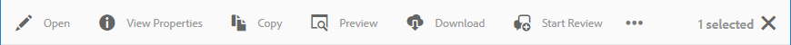

# Introducción a la administración de formularios{#introduction-to-managing-forms}

AEM Forms proporciona una interfaz de usuario simplificada pero potente para crear y gestionar formularios, documentos, temas, cartas, fragmentos de documentos, diccionarios de datos y recursos relacionados. Ayuda a administrar el ciclo de vida completo de formularios, documentos y recursos relacionados, desde el escritorio de un desarrollador hasta la oferta en un servidor de portal para usuarios finales. Puede utilizar la interfaz de usuario de AEM Forms para:

* Acceso a los componentes de AEM Forms
* Acceso a las configuraciones de AEM Forms

>[!NOTE]
>
>Para obtener información detallada sobre otras herramientas y opciones de AEM, consulte [Creación](/help/sites-authoring/author.md).

## Acceso a los componentes de AEM Forms {#access-aem-forms-components}

Junto con las opciones para crear formularios, documentos y recursos relacionados, AEM ofrece opciones para crear sitios, recursos, administrar una instancia de AEM, etc. Puede hacer clic en el logotipo de  Experience Manager para navegar a todas las herramientas disponibles. Junto con los vínculos a las consolas de otros componentes, también contiene vínculos para AEM Forms. Para desplazarse a AEM Forms, haga clic en el logotipo de Experience Manager  >  de navegación > Formularios. Se muestran los vínculos de las siguientes consolas:

* Formularios y documentos
* Temas
* Cartas
* Fragmentos de documento
* Diccionarios de datos

### Formularios y documentos  {#forms-documents}

Forms &amp; Documents proporciona opciones para crear una comunicación interactiva, un formulario adaptable, un fragmento de formulario adaptable y un conjunto de formularios. Solo para AEM Forms en JEE, Forms &amp; Documents ofrece una opción para importar archivos desde el almacenamiento local y sincronizar recursos de AEM Forms con Workbench.

El botón Crear es el punto de partida del proceso de creación o carga de recursos de AEM Forms. Proporciona opciones para crear:

* **Comunicación** interactiva: Una comunicación interactiva es una correspondencia, una declaración o un documento digital basado en HTML personalizado, interactivo y compatible con el dispositivo. Las comunicaciones interactivas son de naturaleza interactiva y cambian el diseño y el diseño automáticamente en función del dispositivo y la configuración del usuario. Para obtener información detallada, consulte Información general sobre comunicaciones [interactivas](/help/forms/using/interactive-communications-overview.md)

* **** Formulario adaptable: Un formulario adaptable es un formulario atractivo y adaptable. Puede crear un formulario adaptable para adaptarse dinámicamente a las entradas del usuario agregando o eliminando secciones de formulario basadas en la respuesta del usuario, el dispositivo o el entorno de trabajo. El artículo [Introducción a la creación de formularios](../../forms/using/introduction-forms-authoring.md) adaptables proporciona información detallada sobre los formularios adaptables.

* **** Fragmento de formulario adaptable:Aunque cada formulario está diseñado para un propósito específico, hay algunos segmentos comunes en la mayoría de las formas, como proporcionar detalles personales como nombre y dirección, detalles de familia, detalles de ingresos, etc. Puede crear un recurso individual para estas secciones. Estos segmentos reutilizables independientes se denominan fragmentos de formulario adaptables. Para obtener información detallada, consulte el artículo Fragmentos [de formulario](../../forms/using/adaptive-form-fragments.md) adaptables.

* **** Conjunto de formularios: Un conjunto de formularios es una colección de formularios HTML5 agrupados y presentados como un único conjunto de formularios para los usuarios finales. Cuando los usuarios finales empiezan a rellenar un conjunto de formularios, los formularios se pasan sin problemas de un formulario a otro. Al final, un usuario puede enviar todos los formularios, como una sola entidad, con un solo clic. Para obtener información detallada, consulte Conjunto [de formularios en AEM Forms](../../forms/using/formset-in-aem-forms.md).

* **** Carpeta: La interfaz de usuario de AEM Forms utiliza carpetas para organizar los recursos. Admite dos tipos de carpetas:

   * **** Carpeta general: Estas carpetas se utilizan para recursos creados en la interfaz de usuario de AEM Forms. Estas carpetas no tienen una estructura de carpetas estricta. Puede cambiar el nombre, crear subcarpetas y almacenar formularios adaptables, comunicaciones interactivas, fragmentos de formulario adaptables, plantillas de formulario (XDP), formularios PDF, documentos y recursos relacionados en estas carpetas.
   * **** Carpeta Flujo de trabajo de formularios: Las carpetas de flujo de trabajo de formularios se crean cuando los procesos de Workbench (archivos de LiveCycle) se migran y sincronizan con la interfaz de usuario de AEM Forms. No se permite cambiar el nombre, crear una subcarpeta, crear una comunicación interactiva, un fragmento de formulario adaptable o una comunicación interactiva. Tampoco se le permite eliminar una carpeta de versión ni crear y cargar un formulario adaptable, un fragmento de formulario adaptable o una comunicación interactiva en paralelo a la carpeta de la versión.

******A. Carpeta general** B. Carpeta de flujo de trabajo de formularios

El panel Formularios y documento también ofrece opciones para:

* **** Importar archivos desde almacenamiento local: Puede importar formularios y documentos PDF, plantillas de formulario (formularios XFA) y otros recursos (imagen y esquema XML para XSD). Para obtener instrucciones paso a paso, consulte [Importación y exportación de recursos a AEM Forms](../../forms/using/import-export-forms-templates.md).
* **** Sincronizar recursos de AEM Forms con Workbench: Puede utilizar la opción Archivos de Workbench para sincronizar recursos entre la interfaz de usuario de AEM Forms y Workbench. Garantiza que todos los recursos estén disponibles en la interfaz de usuario de AEM Forms y en la selección de recursos del repositorio crx de Workbench.

### Temas  {#themes}

Un tema contiene detalles de estilo para componentes y paneles. Los temas tienen una identidad independiente. Por lo tanto, puede reutilizar un tema en varios formularios adaptables. Puede especificar estilos para un componente o modificar las propiedades CSS de los distintos componentes utilizados en los formularios. Los estilos incluyen propiedades como colores de fondo, colores de estado, transparencia y tamaño. Puede guardar las personalizaciones en un tema y colocarlas en componentes del formulario como un ajuste preestablecido. Al agregar el tema al formulario, el estilo especificado se refleja en los componentes correspondientes del formulario. Con AEM 6.2 Forms, puede crear temas y aplicarlos a sus formularios.

Para obtener información sobre la creación y el uso de temas, consulte [Temas en AEM Forms](../../forms/using/themes.md).

### Cartas  {#letters}

Una carta de formularios AEM es una correspondencia segura, personalizada e interactiva. Puede utilizar AEM Forms para reunir rápidamente letras (también conocidas como correspondencias) de contenido preaprobado y de creación personalizada en un proceso optimizado.

Para obtener información sobre la creación y el uso de letras, consulte [Creación de cartas](../../forms/using/create-letter.md).

### Fragmentos de documento {#document-fragments}

Los fragmentos de documento son partes reutilizables o componentes de una correspondencia mediante los cuales se pueden componer letras. Los fragmentos del documento son de tipo texto, lista, condición y fragmento de diseño. Para obtener información sobre la creación y el uso de fragmentos de documento, consulte [Creación de fragmentos](/help/forms/using/document-fragments.md)de documento.

### Diccionarios de datos {#data-dictionaries}

Normalmente, los usuarios empresariales no necesitan conocer las representaciones de metadatos como XSD (esquema XML) y clases Java. Sin embargo, generalmente requieren acceso a estas estructuras y atributos de datos para generar soluciones. AEM Forms utiliza un diccionario de datos que permite a los usuarios empresariales utilizar información de fuentes de datos back-end sin conocer detalles técnicos sobre sus modelos de datos subyacentes.

Para obtener más información sobre la creación y el uso de diccionarios de datos, consulte el artículo Creación de diccionarios [de datos](../../forms/using/data-dictionary.md)

## Acceso a las configuraciones de AEM Forms {#accessing-aem-forms-configurations}

El panel Herramientas de AEM contiene herramientas para varios componentes. Para desplazarse a las herramientas específicas de AEM Forms, haga clic en el logotipo de Experience Manager  >  de herramientas > Formularios. Se muestran las herramientas para realizar las siguientes funciones:

* **** Configurar carpeta vigilada: Un administrador puede configurar una carpeta de red, conocida como carpeta vigilada, para que cuando un usuario coloque un archivo (como un archivo PDF) en la carpeta vigilada, se inicie una operación preconfigurada y se manipule el archivo. Para obtener información detallada, consulte [Creación y configuración de una carpeta](/help/forms/using/creating-configure-watched-folder.md)vigilada.
* **** Configurar el servicio sin conexión de la aplicación Forms:El servicio sin conexión de la aplicación de AEM Forms almacena en caché las rutas o direcciones URL de los recursos utilizados en un formulario. El almacenamiento en caché de rutas o direcciones URL de los recursos utilizados en un formulario mejora el rendimiento del servidor. Para configurar el componente sin conexión del lado del servidor de la aplicación de AEM Forms, consulte [Trabajo en modo](/help/forms/using/work-offline-mode.md)sin conexión.

* **** Configurar generador de PDF: Un administrador puede configurar AEM Forms PDF Generator, agregar cuentas de usuario e importar o exportar la configuración al generador de PDF.
* **** Publicar recursos de gestión de correspondencia: AEM Forms permite publicar todas las letras, fragmentos de documento y diccionarios de datos, así como las dependencias relacionadas, desde una instancia de autor a la vez. Los recursos publicados incluyen todos los recursos de Correspondence Management y las dependencias relacionadas. Para obtener información detallada, consulte [Publicación y cancelación de la publicación de formularios y documentos](../../forms/using/publishing-unpublishing-forms.md#publishallthecorrespondencemanagementassets).
* **** Exportar recursos de gestión de correspondencia: Puede descargar todos los recursos de Correspondence Management y las dependencias relacionadas como un paquete desde una instancia de formulario de AEM. Para obtener información detallada, consulte [Importación y exportación de recursos a AEM Forms](../../forms/using/import-export-forms-templates.md#importandexportassetsincorrespondencemanagement)

## Elementos comunes de la interfaz de usuario {#commonelements}

* **** Carril izquierdo: Puede hacer clic en el icono del carril izquierdo  para mostrar las funciones Línea de tiempo y Referencias de AEM Forms.

   * **** Línea de tiempo: Puede agregar y ver comentarios en un recurso que se puede revisar en la línea de tiempo. Para obtener instrucciones detalladas, consulte [Creación y gestión de revisiones de recursos en formularios](../../forms/using/create-reviews-forms.md).
   * **** Referencias: Un recurso de AEM Forms se puede utilizar en varios recursos de AEM Forms. Por ejemplo, un fragmento de documento se puede utilizar en varias letras. Referencias es una lista de recursos (otros formularios o recursos) en la que se utiliza el recurso seleccionado y también la lista de otros recursos que utiliza el recurso seleccionado.

* **** Rutas de exploración: Una ruta de exploración representa el título de la consola o carpeta actual. Puede hacer clic en la opción Ruta de exploración para navegar entre el nivel de carpetas que están en una jerarquía superior.
* **** Conmutador de vistas: Puede hacer clic en la  de vistas del icono del conmutador de visualización o en la  de visualización para cambiar rápidamente entre la lista y la vista de tarjeta. Para obtener más información sobre los componentes comunes de la interfaz de usuario, consulte [Creación](/help/sites-authoring/author.md).
* **** Buscar: La  de opciones de búsqueda permite encontrar rápidamente y saltar al contenido y las herramientas que necesita. Escriba el nombre del contenido o la capacidad del producto y seleccione entre las sugerencias; por ejemplo, escriba &quot;Documentos&quot; para buscar rápidamente y navegar a la consola Formularios y documentos o Fragmentos de documento. Para obtener más información sobre la búsqueda, consulte el artículo [de búsqueda](/help/sites-authoring/search.md) de AEM 6.2

* **Barra de herramientas** Acciones: Al seleccionar un recurso, la barra de herramientas de acciones aparece encima de la lista de recursos. Contiene todas las herramientas de administración del recurso seleccionado. Puede pasar el ratón sobre un icono de herramienta para ver la información sobre herramientas que describe su funcionalidad

>[!NOTE]
>
>Cuando un usuario realiza una búsqueda en cualquier consola de Forms &amp; Documents, el carril solo contiene **Filtros y opciones**. Puede utilizar Filtros y opciones para realizar búsquedas avanzadas.

* **Barra de herramientas** Acciones: Al seleccionar un recurso, la barra de herramientas de acciones aparece encima de la lista de recursos. Contiene todas las herramientas de administración del recurso seleccionado. Puede pasar el ratón sobre un icono de herramienta para ver la información sobre herramientas que describe su funcionalidad

Barra de herramientas de acciones para un formulario adaptable

