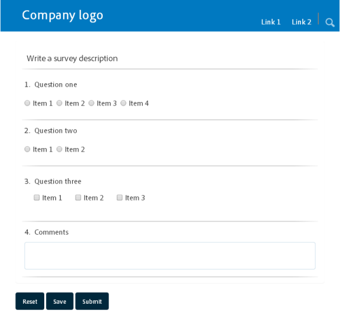

# Funciones de diseño de formularios adaptables{#layout-capabilities-of-adaptive-forms}

Adobe Experience Manager (AEM) le permite crear formularios adaptables fáciles de usar que oferta experiencias dinámicas a los usuarios finales. La presentación del formulario controla cómo se muestran los elementos o componentes en un formulario adaptable.

## Conocimientos previos {#prerequisite-knowledge}

Antes de conocer las distintas funciones de presentación de los formularios adaptables, lea los siguientes artículos para obtener más información sobre los formularios adaptables.

[Introducción a AEM Forms](../../forms/using/introduction-aem-forms.md)

[Introducción a la creación de formularios](../../forms/using/introduction-forms-authoring.md)

## Tipos de diseños {#types-of-layouts}

Un formulario adaptable le proporciona los siguientes tipos de diseños:

**Diseño** del panelControla cómo se muestran en un dispositivo los elementos o componentes de un panel.

**Diseño** móvilControla la navegación de un formulario en un dispositivo móvil. Si el ancho del dispositivo es de 768 píxeles o más, el diseño se considera un diseño móvil y se optimiza para un dispositivo móvil.

**Diseño de** barra de herramientasControla la ubicación de los botones Acción en la barra de herramientas o la barra de herramientas del panel en un formulario.

Todos estos diseños de panel se definen en la siguiente ubicación:

`/libs/fd/af/layouts`.

>[!NOTE]
>
>Para cambiar la presentación de un formulario adaptable, utilice el modo de creación en AEM.


## Diseño de panel {#panel-layout}

Un autor de formulario puede asociar una presentación con cada panel de un formulario adaptable, incluido el panel raíz.

Los diseños de panel están disponibles en `/libs/fd/af/layouts/panel` ubicación.


Lista de diseños de panel en formularios adaptables

### Interactivo: todo en una página sin navegación {#responsive-everything-on-one-page-without-navigation-br}

Utilice este diseño de panel para crear un diseño interactivo que se ajuste al tamaño de pantalla del dispositivo sin necesidad de navegación especializada.

Con esta presentación, puede colocar varios componentes de **[!UICONTROL formulario adaptable de panel]** uno tras otro dentro del panel.



Un formulario con una presentación adaptable como se ve en una pantalla pequeña


Un formulario con una presentación adaptable como se ve en una pantalla grande

### Asistente: formulario de varios pasos que muestra un paso a la vez {#wizard-a-multi-step-form-showing-one-step-at-a-time}

Utilice esta presentación del panel para proporcionar navegación guiada dentro de un formulario. Por ejemplo, utilice esta presentación cuando desee capturar información obligatoria en un formulario mientras guía a los usuarios paso a paso.

Utilice el componente `Panel adaptive form` para proporcionar navegación paso a paso dentro de un panel. Cuando se utiliza este diseño, un usuario pasa al siguiente paso solo después de completar el paso actual

```javascript
window.guideBridge.validate([], this.panel.navigationContext.currentItem.somExpression)
```


Expresión de finalización de pasos en el diseño Asistente para un formulario de varios pasos


Un formulario con el Asistente

### Diseño del diseño de acordeón {#layout-for-accordion-design}

Con este diseño, puede colocar el componente `Panel adaptive form` en un panel con navegación por estilo acordeón. Con este diseño, también puede crear paneles repetitivos. Los paneles repetitivos le permiten agregar o quitar paneles dinámicamente según sea necesario. Puede definir el número mínimo y máximo de veces que se repite un panel. Además, el título del panel se puede determinar dinámicamente, basándose en la información proporcionada en los elementos del panel.

La expresión de resumen puede utilizarse para mostrar los valores proporcionados por el usuario final en el título del panel minimizado.


Paneles repetitivos creados con el diseño Acordeón

### Diseño en fichas: las fichas aparecen a la izquierda {#tabbed-layout-tabs-appear-on-the-left}

Con este diseño, puede colocar el componente `Panel adaptive form` en un panel con navegación por tabuladores. Las fichas se colocan a la izquierda del contenido del panel.


Fichas que aparecen a la izquierda de un panel

### Diseño en fichas: las fichas aparecen en la parte superior {#tabbed-layout-tabs-appear-on-the-top}

Con este diseño, puede colocar el componente `Panel adaptive form` en un panel con navegación por tabuladores. Las fichas se colocan sobre el contenido del panel.


Fichas que aparecen en la parte superior de un panel

## Diseños móviles {#mobile-layouts}

Las maquetaciones móviles permiten una navegación sencilla en los dispositivos móviles con pantallas relativamente más pequeñas. Las maquetaciones móviles utilizan estilos tabulados o de asistente para la navegación por formularios. La aplicación de un diseño para móviles proporciona una sola presentación para todo el formulario.

Este diseño controla la navegación mediante una barra de navegación y un menú de navegación. La barra de navegación muestra el icono **&lt;** y **** para indicar **siguiente** y **anteriores** pasos de navegación en el formulario.

Los diseños móviles están disponibles en `/libs/fd/af/layouts/mobile/` ubicación. De forma predeterminada, los siguientes diseños móviles están disponibles en formularios adaptables.


Lista de diseños móviles en formularios adaptables

Al utilizar una presentación móvil, el menú de formulario, para acceder a varios paneles de formulario, está disponible tocando el icono .

### Presentación con títulos de panel en el encabezado de formulario {#layout-with-panel-titles-in-the-form-header}

Este diseño, como su nombre indica, muestra los títulos del panel junto con el menú de navegación y la barra de navegación. Este diseño también proporciona los iconos Siguiente y Anterior para la navegación.


Diseños móviles con títulos de panel en los encabezados de formulario

### Presentación sin títulos de panel en el encabezado del formulario {#layout-without-panel-titles-in-the-form-header}

Este diseño, como su nombre indica, muestra únicamente el menú de navegación y la barra de navegación sin títulos de panel. Este diseño también proporciona los iconos Siguiente y Anterior para la navegación.


Diseños móviles sin títulos de panel en los encabezados de formulario

## Diseños de la barra de herramientas {#toolbar-layouts}

Un diseño de barra de herramientas controla la colocación y visualización de los botones de acción que se agregan a los formularios adaptables. La presentación se puede agregar a nivel de formulario o de panel.


Una lista de diseños de barra de herramientas en formularios adaptables

Los diseños de la barra de herramientas están disponibles en la ubicación `/libs/fd/af/layouts/toolbar`. los formularios adaptables proporcionan los siguientes diseños de barra de herramientas de forma predeterminada.

### Diseño predeterminado de la barra de herramientas {#default-layout-for-toolbar}

Esta presentación está seleccionada como presentación predeterminada cuando se agregan botones de acción en un formulario adaptable. Al seleccionar este diseño, se muestra el mismo diseño tanto para el escritorio como para los dispositivos móviles.

Además, puede agregar varias barras de herramientas que contengan botones de acción configurados con este diseño. Un botón de acción está asociado a un control de formulario. Puede configurar las barras de herramientas para que estén antes o después de un panel.


Vista predeterminada de la barra de herramientas

### Diseño fijo móvil para la barra de herramientas {#mobile-fixed-layout-for-toolbar}

Seleccione este diseño para proporcionar maquetaciones alternativas para equipos de escritorio y dispositivos móviles.

Para el diseño de escritorio, puede agregar botones de acción con algunas etiquetas específicas. Solo se puede configurar una barra de herramientas con este diseño. Si hay más de una barra de herramientas configurada con este diseño, hay una superposición para dispositivos móviles y solo una barra de herramientas está visible. Por ejemplo, puede tener una barra de herramientas en la parte inferior o superior del formulario, o bien, después o antes de los paneles del formulario.

Para el diseño móvil, puede añadir botones de acción mediante iconos.


Diseño fijo móvil para la barra de herramientas

